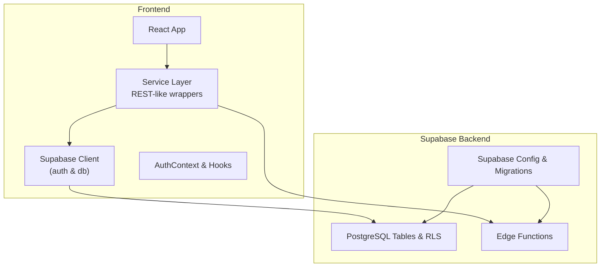
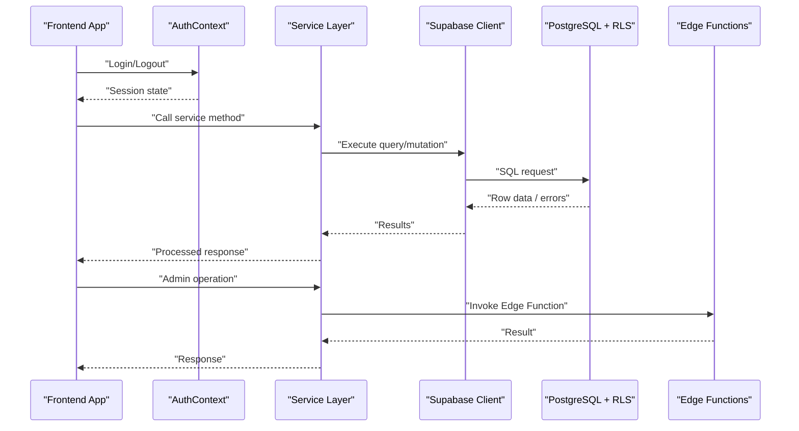
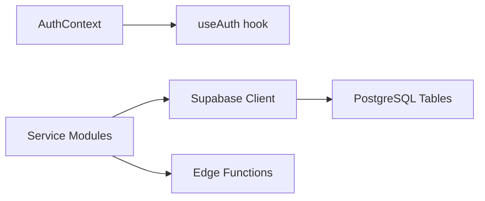

# API Reference

<cite>
**Referenced Files in This Document**
- [supabase.ts](file://src/config/supabase.ts)
- [AuthContext.tsx](file://src/context/AuthContext.tsx)
- [useAuth.ts](file://src/hooks/useAuth.ts)
- [attachments.service.ts](file://src/services/attachments.service.ts)
- [attendance.service.ts](file://src/services/attendance.service.ts)
- [reports.service.ts](file://src/services/reports.service.ts)
- [settings.service.ts](file://src/services/settings.service.ts)
- [shifts.service.ts](file://src/services/shifts.service.ts)
- [workers.service.ts](file://src/services/workers.service.ts)
- [zones.service.ts](file://src/services/zones.service.ts)
- [index.ts](file://supabase/functions/admin-user/index.ts)
- [cloudinary-delete/index.ts](file://supabase/functions/cloudinary-delete/index.ts)
- [diagnose-auth/index.ts](file://supabase/functions/diagnose-auth/index.ts)
- [seed-auth/index.ts](file://supabase/functions/seed-auth/index.ts)
- [test-zone-update/index.ts](file://supabase/functions/test-zone-update/index.ts)
- [config.toml](file://supabase/config.toml)
- [001_initial.sql](file://supabase/migrations/001_initial.sql)
- [002_seed_auth.sql](file://supabase/migrations/002_seed_auth.sql)
- [009_app_settings.sql](file://supabase/migrations/009_app_settings.sql)
- [vercel.json](file://vercel.json)
- [package.json](file://package.json)
</cite>

## Table of Contents
1. [Introduction](#introduction)
2. [Project Structure](#project-structure)
3. [Core Components](#core-components)
4. [Architecture Overview](#architecture-overview)
5. [Detailed Component Analysis](#detailed-component-analysis)
6. [Dependency Analysis](#dependency-analysis)
7. [Performance Considerations](#performance-considerations)
8. [Troubleshooting Guide](#troubleshooting-guide)
9. [Conclusion](#conclusion)
10. [Appendices](#appendices)

## Introduction
This document provides a comprehensive API reference for AbsensiOnline’s public interfaces powered by Supabase. It covers:
- RESTful endpoints exposed via Supabase SQL and Edge Functions
- Authentication and authorization requirements
- Request/response patterns, parameters, and validation rules
- GraphQL-like query patterns supported by Supabase ORM
- Rate limiting, CORS, security headers, and API versioning strategies
- Practical frontend service-layer usage examples
- Client implementation guidelines and integration patterns

## Project Structure
AbsensiOnline’s API surface is primarily implemented through:
- Supabase client initialization and authentication context in the frontend
- Service-layer wrappers around Supabase SQL queries and Edge Functions
- Supabase Edge Functions for server-side tasks
- Supabase migrations defining database schemas and RLS policies

**Diagram sources**
- [supabase.ts](file://src/config/supabase.ts)
- [AuthContext.tsx](file://src/context/AuthContext.tsx)
- [useAuth.ts](file://src/hooks/useAuth.ts)
- [config.toml](file://supabase/config.toml)

**Section sources**
- [supabase.ts](file://src/config/supabase.ts)
- [config.toml](file://supabase/config.toml)

## Core Components
- Supabase client initialization and auth configuration
- Authentication context and hooks for session management
- Service-layer wrappers for CRUD operations on attendance, workers, shifts, zones, attachments, reports, and settings
- Edge Functions for administrative tasks and diagnostics

Key responsibilities:
- Frontend: Initialize Supabase client, manage auth state, and call service-layer functions
- Backend: Enforce row-level security (RLS), expose REST-like SQL routes, and run Edge Functions

**Section sources**
- [supabase.ts](file://src/config/supabase.ts)
- [AuthContext.tsx](file://src/context/AuthContext.tsx)
- [useAuth.ts](file://src/hooks/useAuth.ts)
- [attachments.service.ts](file://src/services/attachments.service.ts)
- [attendance.service.ts](file://src/services/attendance.service.ts)
- [reports.service.ts](file://src/services/reports.service.ts)
- [settings.service.ts](file://src/services/settings.service.ts)
- [shifts.service.ts](file://src/services/shifts.service.ts)
- [workers.service.ts](file://src/services/workers.service.ts)
- [zones.service.ts](file://src/services/zones.service.ts)

## Architecture Overview
The system follows a client-driven architecture:
- Frontend initializes Supabase client and authenticates users
- Services encapsulate Supabase queries and mutations
- Supabase enforces RLS and exposes REST-like SQL routes
- Edge Functions handle privileged operations and diagnostics

**Diagram sources**
- [supabase.ts](file://src/config/supabase.ts)
- [AuthContext.tsx](file://src/context/AuthContext.tsx)
- [useAuth.ts](file://src/hooks/useAuth.ts)
- [attendance.service.ts](file://src/services/attendance.service.ts)
- [index.ts](file://supabase/functions/admin-user/index.ts)

## Detailed Component Analysis

### Supabase Client Initialization
- Initializes Supabase client with project URL and anonymous/public anon key
- Provides auth and database clients for the rest of the app
- Used by services and auth context

Implementation highlights:
- Client creation and export for use across the app
- Auth state subscription and session management

**Section sources**
- [supabase.ts](file://src/config/supabase.ts)

### Authentication and Authorization
- Authentication context manages logged-in state and session lifecycle
- Hooks provide convenient access to auth state and methods
- Supabase RLS policies govern data visibility per user

Authentication methods:
- Email/password sign-in/sign-up
- Session persistence and refresh
- Role-based access enforced by RLS

Authorization requirements:
- All requests require a valid session token
- RLS policies restrict rows returned per user identity

**Section sources**
- [AuthContext.tsx](file://src/context/AuthContext.tsx)
- [useAuth.ts](file://src/hooks/useAuth.ts)

### Edge Functions
Edge Functions are serverless functions deployed under Supabase. They are invoked via HTTPS endpoints and are useful for privileged operations or background tasks.

Available Edge Functions:
- admin-user: Administrative user operations
- cloudinary-delete: Delete assets from Cloudinary
- diagnose-auth: Diagnose authentication issues
- seed-auth: Seed authentication data
- test-zone-update: Test zone update logic

Invocation pattern:
- Endpoint: https://<project-ref>.functions.supabase.io/<function-name>
- Headers: Authorization: Bearer <anon-key> or appropriate JWT depending on function policy
- Body: JSON payload as required by the function

Common usage:
- Use for operations requiring elevated permissions or external integrations
- Prefer client-side queries for standard CRUD operations

**Section sources**
- [index.ts](file://supabase/functions/admin-user/index.ts)
- [cloudinary-delete/index.ts](file://supabase/functions/cloudinary-delete/index.ts)
- [diagnose-auth/index.ts](file://supabase/functions/diagnose-auth/index.ts)
- [seed-auth/index.ts](file://supabase/functions/seed-auth/index.ts)
- [test-zone-update/index.ts](file://supabase/functions/test-zone-update/index.ts)

### Service Layer: Attendance
Purpose:
- Manage attendance records, including check-in/out, history retrieval, and reporting

Typical operations:
- Insert/update/delete attendance entries
- Query attendance by worker, date range, or shift
- Aggregate presence statistics

Parameters:
- Worker ID, shift ID, timestamps, status flags
- Pagination and filtering via query builder

Validation:
- Ensure worker exists and belongs to current user’s organization
- Timestamps must be coherent

Error handling:
- Propagate Supabase error codes and messages
- Normalize errors for UI consumption

**Section sources**
- [attendance.service.ts](file://src/services/attendance.service.ts)

### Service Layer: Workers
Purpose:
- Manage worker profiles and assignments

Typical operations:
- Create/update worker profiles
- Assign workers to zones and shifts
- List workers with filters and pagination

Parameters:
- Personal info, contact details, zone assignment
- Filters: active status, zone, shift

Validation:
- Unique phone/email constraints
- Required fields enforcement

**Section sources**
- [workers.service.ts](file://src/services/workers.service.ts)

### Service Layer: Shifts
Purpose:
- Define work schedules and availability

Typical operations:
- Create/update/delete shifts
- Retrieve upcoming shifts for a worker
- Export shift schedules

Parameters:
- Shift start/end, timezone-aware timestamps
- Recurrence rules and exceptions

Validation:
- Overlap checks and timezone correctness

**Section sources**
- [shifts.service.ts](file://src/services/shifts.service.ts)

### Service Layer: Zones
Purpose:
- Geographic regions for attendance geofencing

Typical operations:
- Create/update zones with geofences
- Validate proximity to zone center
- List zones for selection

Parameters:
- Coordinates, radius, polygon shapes
- Zone metadata (name, color)

Validation:
- Geometry validity and radius bounds

**Section sources**
- [zones.service.ts](file://src/services/zones.service.ts)

### Service Layer: Attachments
Purpose:
- Upload and manage supporting documents/images

Typical operations:
- Upload files to storage
- Delete attachments
- Link attachments to attendance records

Parameters:
- File metadata, URLs, MIME types
- Foreign keys to related entities

Validation:
- File size limits and allowed types

**Section sources**
- [attachments.service.ts](file://src/services/attachments.service.ts)

### Service Layer: Reports
Purpose:
- Generate attendance summaries and exports

Typical operations:
- Daily/weekly/monthly summaries
- Export to PDF or CSV
- Compliance reports

Parameters:
- Date range, worker filters, report type

Validation:
- Ensure date range is reasonable

**Section sources**
- [reports.service.ts](file://src/services/reports.service.ts)

### Service Layer: Settings
Purpose:
- Application-wide settings and configurations

Typical operations:
- Fetch settings for UI behavior
- Update global flags (e.g., maintenance mode)

Parameters:
- Key-value pairs for settings
- Validation against known setting keys

**Section sources**
- [settings.service.ts](file://src/services/settings.service.ts)

### GraphQL-like Queries via Supabase ORM
Supabase supports flexible SQL-based querying that mirrors GraphQL-like patterns:
- Select specific columns and nested relations
- Apply filters, ordering, and pagination
- Aggregate and group data for analytics

Common patterns:
- Filtering by foreign keys and timestamps
- Joins across related tables (workers, shifts, zones)
- Aggregations for counts and sums

Best practices:
- Use indexes on frequently filtered columns
- Limit result sets with offset/limit
- Prefer selective column selection

**Section sources**
- [001_initial.sql](file://supabase/migrations/001_initial.sql)
- [002_seed_auth.sql](file://supabase/migrations/002_seed_auth.sql)
- [009_app_settings.sql](file://supabase/migrations/009_app_settings.sql)

## Dependency Analysis
The frontend depends on Supabase for authentication and data access. Services encapsulate Supabase calls and provide a stable interface for components.

**Diagram sources**
- [AuthContext.tsx](file://src/context/AuthContext.tsx)
- [useAuth.ts](file://src/hooks/useAuth.ts)
- [supabase.ts](file://src/config/supabase.ts)
- [config.toml](file://supabase/config.toml)

**Section sources**
- [supabase.ts](file://src/config/supabase.ts)
- [AuthContext.tsx](file://src/context/AuthContext.tsx)
- [useAuth.ts](file://src/hooks/useAuth.ts)
- [config.toml](file://supabase/config.toml)

## Performance Considerations
- Use pagination (offset/limit) for large datasets
- Index frequently queried columns (timestamps, foreign keys)
- Minimize selected columns to reduce payload sizes
- Batch updates where possible
- Cache non-sensitive data in memory for short periods
- Monitor Edge Function cold starts and optimize initialization

## Troubleshooting Guide
Common issues and resolutions:
- Authentication failures: Verify session state and re-login if needed
- Permission denied: Check RLS policies and user roles
- Network errors: Confirm Supabase project URL and API keys
- Edge Function errors: Inspect logs and function payload validation

Diagnostic steps:
- Use the diagnose-auth Edge Function to troubleshoot auth issues
- Review Supabase dashboard logs for SQL and Edge Function errors
- Validate frontend service-layer parameters before invoking Supabase

**Section sources**
- [diagnose-auth/index.ts](file://supabase/functions/diagnose-auth/index.ts)
- [AuthContext.tsx](file://src/context/AuthContext.tsx)
- [useAuth.ts](file://src/hooks/useAuth.ts)

## Conclusion
AbsensiOnline’s API leverages Supabase for secure, scalable data access with clear separation between frontend services and backend resources. Authentication is mandatory, RLS ensures data isolation, and Edge Functions handle privileged tasks. Following the patterns outlined here will help you integrate reliably and efficiently.

## Appendices

### Authentication Methods and Requirements
- Method: Email/password
- Token: Bearer token included in Authorization header
- Scope: Depends on user role; RLS determines visibility
- Session: Managed by Supabase Auth; persisted in browser storage

**Section sources**
- [AuthContext.tsx](file://src/context/AuthContext.tsx)
- [useAuth.ts](file://src/hooks/useAuth.ts)

### Rate Limiting Considerations
- Supabase enforces platform-level rate limits; design clients to retry with exponential backoff
- Prefer batching and caching to minimize request volume
- Monitor response headers for rate limit indicators

### CORS Configuration
- Configure allowed origins in Supabase project settings
- Ensure credentials mode aligns with frontend origin
- Validate preflight requests for cross-origin requests

**Section sources**
- [config.toml](file://supabase/config.toml)

### Security Headers and Policies
- Enforce HTTPS in production
- Set Content-Security-Policy headers to restrict script and asset sources
- Use SameSite cookies and secure flags for session cookies

**Section sources**
- [vercel.json](file://vercel.json)

### API Versioning Strategies
- Use Supabase migrations to evolve schemas safely
- Keep service-layer signatures stable while evolving underlying queries
- Avoid breaking changes to response structures

**Section sources**
- [001_initial.sql](file://supabase/migrations/001_initial.sql)
- [002_seed_auth.sql](file://supabase/migrations/002_seed_auth.sql)
- [009_app_settings.sql](file://supabase/migrations/009_app_settings.sql)

### Client Implementation Guidelines
- Initialize Supabase once and reuse the client instance
- Wrap all Supabase calls in service-layer functions
- Centralize error handling and user feedback
- Use optimistic updates for better UX, with rollback on failure

### Practical Examples from the Frontend Service Layer
- Login: Use auth hooks to sign in and subscribe to session changes
- Fetch attendance: Call service method to query records with filters and pagination
- Submit report: Build report parameters and trigger export via service
- Admin tasks: Invoke Edge Functions for privileged operations

**Section sources**
- [useAuth.ts](file://src/hooks/useAuth.ts)
- [attendance.service.ts](file://src/services/attendance.service.ts)
- [reports.service.ts](file://src/services/reports.service.ts)
- [index.ts](file://supabase/functions/admin-user/index.ts)