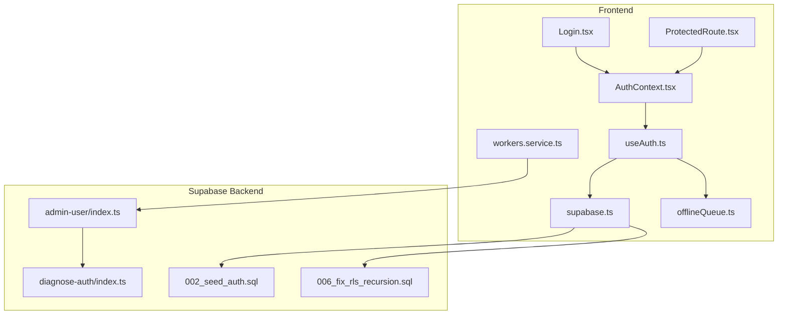
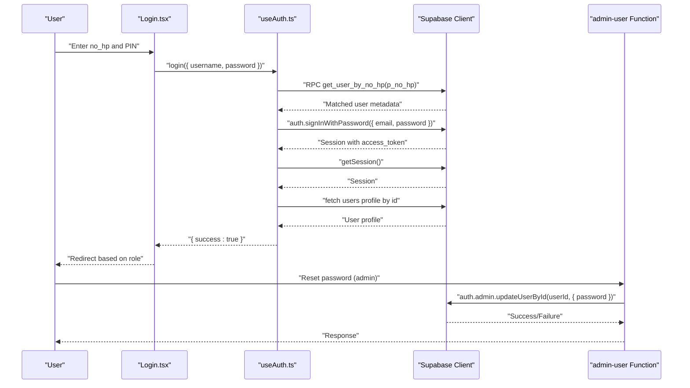
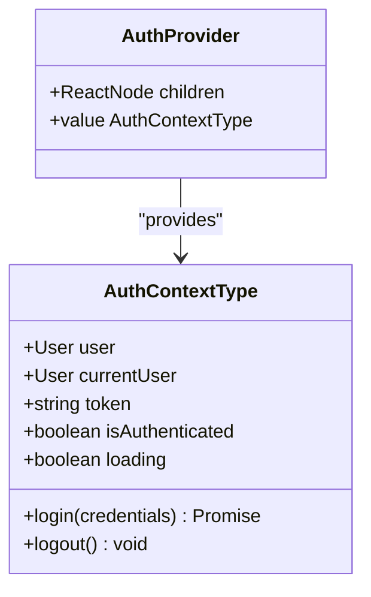
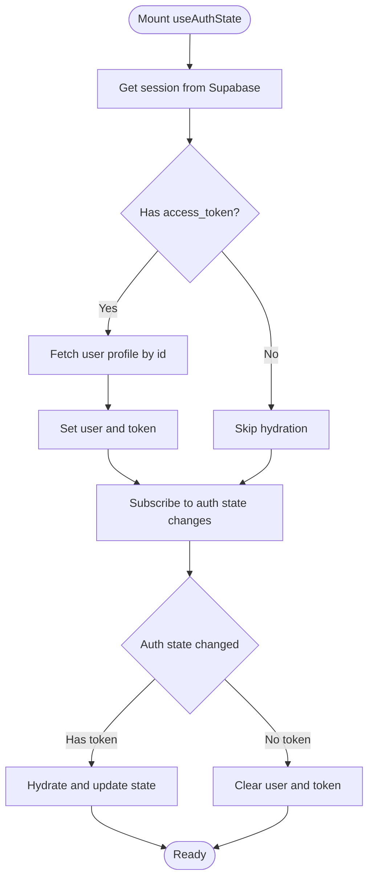
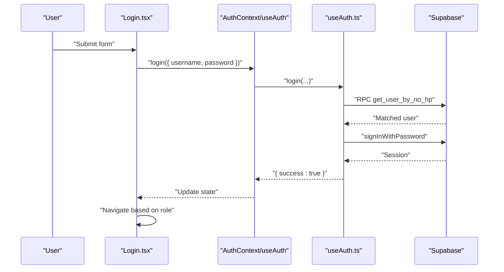
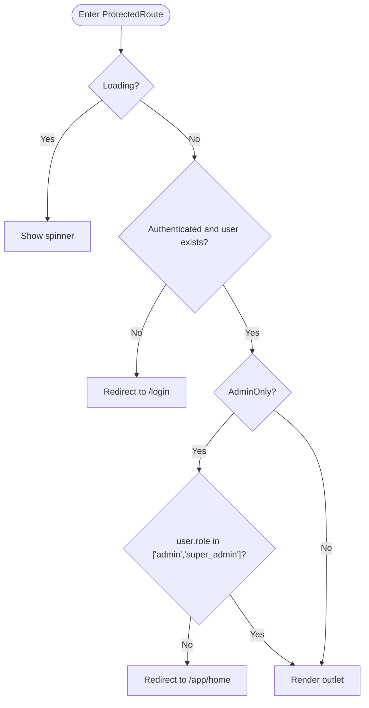
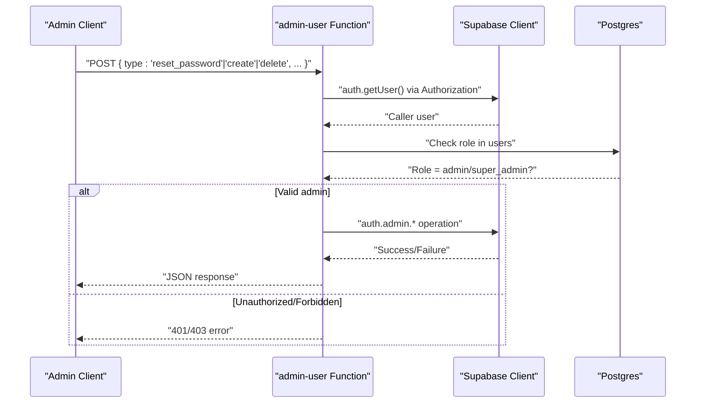
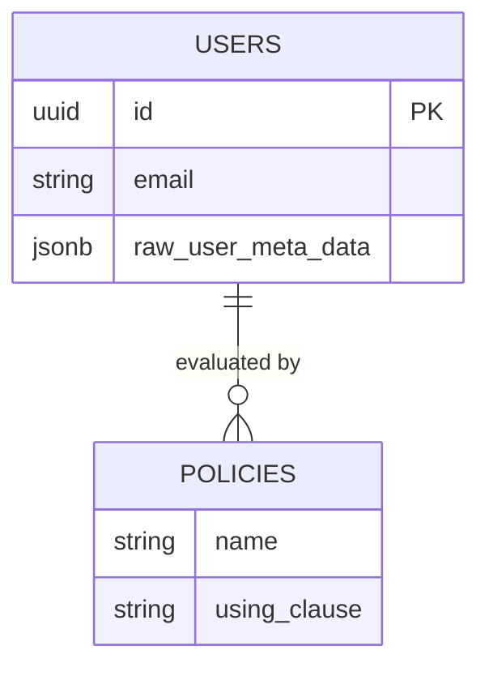
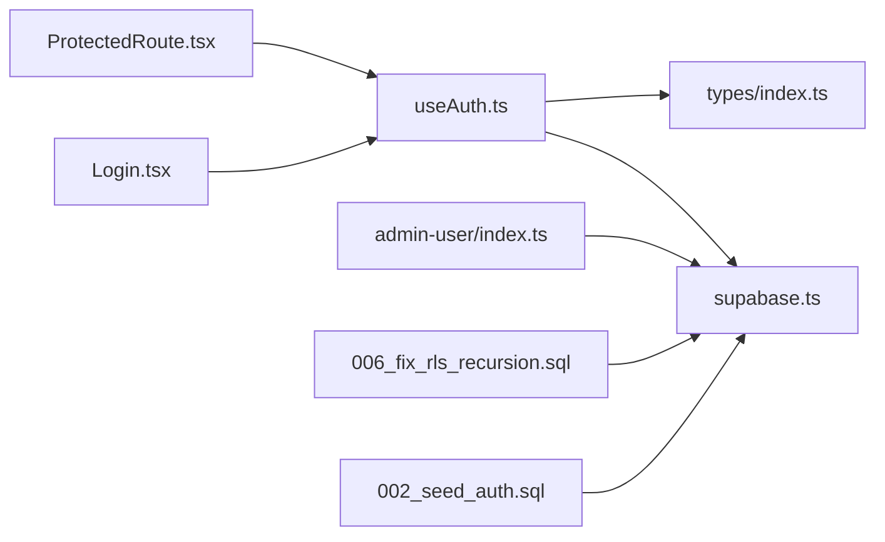

# Authentication API

<cite>
**Referenced Files in This Document**
- [AuthContext.tsx](file://src/context/AuthContext.tsx)
- [useAuth.ts](file://src/hooks/useAuth.ts)
- [Login.tsx](file://src/components/Login.tsx)
- [ProtectedRoute.tsx](file://src/components/ProtectedRoute.tsx)
- [supabase.ts](file://src/config/supabase.ts)
- [index.ts](file://supabase/functions/admin-user/index.ts)
- [index.ts](file://supabase/functions/diagnose-auth/index.ts)
- [002_seed_auth.sql](file://supabase/migrations/002_seed_auth.sql)
- [006_fix_rls_recursion.sql](file://supabase/migrations/006_fix_rls_recursion.sql)
- [DESIGN.md](file://DESIGN.md)
- [workers.service.ts](file://src/services/workers.service.ts)
- [index.ts](file://src/types/index.ts)
- [offlineQueue.ts](file://src/utils/offlineQueue.ts)
</cite>

## Table of Contents
1. [Introduction](#introduction)
2. [Project Structure](#project-structure)
3. [Core Components](#core-components)
4. [Architecture Overview](#architecture-overview)
5. [Detailed Component Analysis](#detailed-component-analysis)
6. [Dependency Analysis](#dependency-analysis)
7. [Performance Considerations](#performance-considerations)
8. [Troubleshooting Guide](#troubleshooting-guide)
9. [Conclusion](#conclusion)
10. [Appendices](#appendices)

## Introduction
This document describes the authentication API and runtime behavior for AbsensiOnline’s Supabase-based system. It covers login/logout flows, session management, token handling, role-based access control, protected routes, and administrative operations. It also documents JWT token structure, expiration handling, and security considerations, including password reset and account lifecycle management.

## Project Structure
Authentication spans frontend React components and hooks, Supabase client configuration, and serverless functions for administrative tasks. The following diagram maps the primary files involved in authentication.

**Diagram sources**
- [Login.tsx:1-119](file://src/components/Login.tsx#L1-L119)
- [ProtectedRoute.tsx:1-32](file://src/components/ProtectedRoute.tsx#L1-L32)
- [AuthContext.tsx:1-43](file://src/context/AuthContext.tsx#L1-L43)
- [useAuth.ts:1-115](file://src/hooks/useAuth.ts#L1-L115)
- [supabase.ts:1-7](file://src/config/supabase.ts#L1-L7)
- [workers.service.ts:118-132](file://src/services/workers.service.ts#L118-L132)
- [offlineQueue.ts:1-51](file://src/utils/offlineQueue.ts#L1-L51)
- [index.ts:1-167](file://supabase/functions/admin-user/index.ts#L1-L167)
- [index.ts:1-74](file://supabase/functions/diagnose-auth/index.ts#L1-L74)
- [002_seed_auth.sql:1-29](file://supabase/migrations/002_seed_auth.sql#L1-L29)
- [006_fix_rls_recursion.sql:1-28](file://supabase/migrations/006_fix_rls_recursion.sql#L1-L28)

**Section sources**
- [AuthContext.tsx:1-43](file://src/context/AuthContext.tsx#L1-L43)
- [useAuth.ts:1-115](file://src/hooks/useAuth.ts#L1-L115)
- [Login.tsx:1-119](file://src/components/Login.tsx#L1-L119)
- [ProtectedRoute.tsx:1-32](file://src/components/ProtectedRoute.tsx#L1-L32)
- [supabase.ts:1-7](file://src/config/supabase.ts#L1-L7)
- [index.ts:1-167](file://supabase/functions/admin-user/index.ts#L1-L167)
- [index.ts:1-74](file://supabase/functions/diagnose-auth/index.ts#L1-L74)
- [002_seed_auth.sql:1-29](file://supabase/migrations/002_seed_auth.sql#L1-L29)
- [006_fix_rls_recursion.sql:1-28](file://supabase/migrations/006_fix_rls_recursion.sql#L1-L28)
- [DESIGN.md:58-127](file://DESIGN.md#L58-L127)

## Core Components
- Supabase client initialization and configuration
- Authentication state provider and hook
- Login form and protected route guard
- Administrative user management functions
- Role-based access control policies
- Token and session hydration

Key responsibilities:
- Initialize Supabase client with environment variables
- Manage session retrieval, change subscriptions, and token hydration
- Provide login and logout actions with error handling
- Enforce role-based access control in routes and backend functions
- Support administrative operations for user creation, password reset, and deletion

**Section sources**
- [supabase.ts:1-7](file://src/config/supabase.ts#L1-L7)
- [AuthContext.tsx:1-43](file://src/context/AuthContext.tsx#L1-L43)
- [useAuth.ts:1-115](file://src/hooks/useAuth.ts#L1-L115)
- [Login.tsx:1-119](file://src/components/Login.tsx#L1-L119)
- [ProtectedRoute.tsx:1-32](file://src/components/ProtectedRoute.tsx#L1-L32)
- [index.ts:1-167](file://supabase/functions/admin-user/index.ts#L1-L167)
- [006_fix_rls_recursion.sql:1-28](file://supabase/migrations/006_fix_rls_recursion.sql#L1-L28)

## Architecture Overview
The authentication architecture combines a frontend React layer with Supabase Auth and a serverless function layer for administrative tasks. Sessions are persisted locally and automatically refreshed by Supabase. Roles are enforced via Supabase Row Level Security (RLS) policies and validated in backend functions.

**Diagram sources**
- [Login.tsx:21-33](file://src/components/Login.tsx#L21-L33)
- [useAuth.ts:58-96](file://src/hooks/useAuth.ts#L58-L96)
- [index.ts:96-128](file://supabase/functions/admin-user/index.ts#L96-L128)

**Section sources**
- [DESIGN.md:58-127](file://DESIGN.md#L58-L127)
- [useAuth.ts:34-56](file://src/hooks/useAuth.ts#L34-L56)
- [index.ts:96-128](file://supabase/functions/admin-user/index.ts#L96-L128)

## Detailed Component Analysis

### Supabase Client Initialization
- Initializes the Supabase client using Vite environment variables for URL and anonymous key.
- Provides a singleton client instance used by hooks and services.

**Section sources**
- [supabase.ts:1-7](file://src/config/supabase.ts#L1-L7)

### AuthContext Provider
- Exposes authentication state and actions to the app.
- Wraps children with a provider that supplies user, token, isAuthenticated, loading, login, and logout.
- Includes a deprecated currentUser alias for backward compatibility.

**Diagram sources**
- [AuthContext.tsx:5-36](file://src/context/AuthContext.tsx#L5-L36)

**Section sources**
- [AuthContext.tsx:1-43](file://src/context/AuthContext.tsx#L1-L43)

### Authentication Hook (useAuthState)
- Retrieves and hydrates the current session on mount.
- Subscribes to auth state changes to keep user and token synchronized.
- Implements login using a stored procedure to resolve the user by phone number, then signs in with password.
- Implements logout by signing out and clearing local storage keys.

**Diagram sources**
- [useAuth.ts:34-56](file://src/hooks/useAuth.ts#L34-L56)
- [useAuth.ts:22-27](file://src/hooks/useAuth.ts#L22-L27)

**Section sources**
- [useAuth.ts:1-115](file://src/hooks/useAuth.ts#L1-L115)

### Login Component
- Collects phone number and PIN, validates inputs, and triggers login.
- Navigates based on user role after successful login.
- Displays errors returned by the login action.

**Diagram sources**
- [Login.tsx:21-33](file://src/components/Login.tsx#L21-L33)
- [useAuth.ts:58-96](file://src/hooks/useAuth.ts#L58-L96)

**Section sources**
- [Login.tsx:1-119](file://src/components/Login.tsx#L1-L119)
- [useAuth.ts:58-96](file://src/hooks/useAuth.ts#L58-L96)

### Protected Route Guard
- Blocks unauthenticated users and enforces admin-only routes when requested.
- Uses user role to decide navigation.

**Diagram sources**
- [ProtectedRoute.tsx:9-31](file://src/components/ProtectedRoute.tsx#L9-L31)

**Section sources**
- [ProtectedRoute.tsx:1-32](file://src/components/ProtectedRoute.tsx#L1-L32)

### Administrative User Management Functions
- Validates authorization header and retrieves the caller’s role from the database.
- Supports creating users with generated emails and metadata, resetting PINs, and deleting users.
- Enforces admin-only access and validates payload constraints.

**Diagram sources**
- [index.ts:10-49](file://supabase/functions/admin-user/index.ts#L10-49)
- [index.ts:96-128](file://supabase/functions/admin-user/index.ts#L96-L128)

**Section sources**
- [index.ts:1-167](file://supabase/functions/admin-user/index.ts#L1-L167)

### Role-Based Access Control (RLS)
- Policies enforce admin-only access using JWT claims from the authenticated user’s metadata.
- Prevents recursive policy definitions and ensures safe checks.

**Diagram sources**
- [006_fix_rls_recursion.sql:14-28](file://supabase/migrations/006_fix_rls_recursion.sql#L14-L28)

**Section sources**
- [006_fix_rls_recursion.sql:1-28](file://supabase/migrations/006_fix_rls_recursion.sql#L1-L28)

### User Types and Roles
- Defines the User interface and Role union used across the app.
- Roles include worker, admin, and super_admin.

**Section sources**
- [index.ts:32-46](file://src/types/index.ts#L32-L46)
- [index.ts](file://src/types/index.ts#L4)

### Session Persistence and Offline Queue
- Supabase persists sessions by default; the app clears specific local storage keys on logout.
- Offline queue utilities manage pending attendance submissions while offline.

**Section sources**
- [useAuth.ts:98-104](file://src/hooks/useAuth.ts#L98-L104)
- [offlineQueue.ts:1-51](file://src/utils/offlineQueue.ts#L1-L51)

## Dependency Analysis
- Frontend depends on Supabase client for authentication and database operations.
- Administrative functions depend on Supabase Auth Admin SDK and service role key.
- RLS policies depend on JWT claims embedded in the access token.

**Diagram sources**
- [Login.tsx:1-119](file://src/components/Login.tsx#L1-L119)
- [ProtectedRoute.tsx:1-32](file://src/components/ProtectedRoute.tsx#L1-L32)
- [useAuth.ts:1-115](file://src/hooks/useAuth.ts#L1-L115)
- [supabase.ts:1-7](file://src/config/supabase.ts#L1-L7)
- [index.ts:1-167](file://supabase/functions/admin-user/index.ts#L1-L167)
- [006_fix_rls_recursion.sql:1-28](file://supabase/migrations/006_fix_rls_recursion.sql#L1-L28)
- [002_seed_auth.sql:1-29](file://supabase/migrations/002_seed_auth.sql#L1-L29)
- [index.ts:32-46](file://src/types/index.ts#L32-L46)

**Section sources**
- [useAuth.ts:1-115](file://src/hooks/useAuth.ts#L1-L115)
- [index.ts:1-167](file://supabase/functions/admin-user/index.ts#L1-L167)
- [006_fix_rls_recursion.sql:1-28](file://supabase/migrations/006_fix_rls_recursion.sql#L1-L28)
- [002_seed_auth.sql:1-29](file://supabase/migrations/002_seed_auth.sql#L1-L29)

## Performance Considerations
- Session hydration occurs once on mount and again on auth state changes; avoid unnecessary re-renders by memoizing callbacks.
- Keep user profile queries minimal; cache roles and metadata where appropriate.
- Use Supabase’s built-in token refresh to minimize manual refresh logic.

[No sources needed since this section provides general guidance]

## Troubleshooting Guide
Common issues and recovery patterns:
- Login failures due to invalid credentials or missing user metadata return descriptive errors from the login action.
- On logout, local storage keys are cleared; ensure cleanup completes to prevent stale state.
- Use the diagnostic function to compare auth users versus public users and detect mismatches or orphan records.

**Section sources**
- [useAuth.ts:66-83](file://src/hooks/useAuth.ts#L66-L83)
- [useAuth.ts:98-104](file://src/hooks/useAuth.ts#L98-L104)
- [index.ts:20-54](file://supabase/functions/diagnose-auth/index.ts#L20-L54)

## Conclusion
AbsensiOnline’s authentication system leverages Supabase Auth for secure session management, integrates role-based access control via RLS, and exposes administrative capabilities through serverless functions. The frontend provides a streamlined login experience and protected routing, while backend functions support user lifecycle operations. The design balances simplicity for MVP with extensibility for future enhancements like OTP-based authentication.

[No sources needed since this section summarizes without analyzing specific files]

## Appendices

### API Definitions

- POST /functions/admin-user
  - Purpose: Admin-only endpoint to create, reset password, or delete users.
  - Headers:
    - Authorization: Bearer <service_role_key>
  - Body:
    - type: "create" | "reset_password" | "delete"
    - Payload varies by type:
      - create: { no_hp, nama, password?, role? }
      - reset_password: { userId, password }
      - delete: { userId }
  - Responses:
    - 200: Success payload
    - 400: Validation or operation error
    - 401: Missing/invalid authorization
    - 403: Forbidden (non-admin)
    - 500: Internal error

**Section sources**
- [index.ts:10-49](file://supabase/functions/admin-user/index.ts#L10-49)
- [index.ts:58-93](file://supabase/functions/admin-user/index.ts#L58-L93)
- [index.ts:96-128](file://supabase/functions/admin-user/index.ts#L96-L128)
- [index.ts:130-154](file://supabase/functions/admin-user/index.ts#L130-L154)

### JWT Token Structure and Expiration
- Access token is stored by Supabase and used for authenticated requests.
- Supabase automatically refreshes tokens; the frontend reads the latest session and hydrates user data.
- RLS policies evaluate roles from JWT claims embedded in the access token.

**Section sources**
- [DESIGN.md:58-127](file://DESIGN.md#L58-L127)
- [useAuth.ts:34-56](file://src/hooks/useAuth.ts#L34-L56)
- [006_fix_rls_recursion.sql:14-28](file://supabase/migrations/006_fix_rls_recursion.sql#L14-L28)

### Security Considerations
- Admin-only endpoints require Authorization header with a service role key.
- RLS policies restrict access to admin/super_admin roles using JWT claims.
- Diagnostic function helps identify inconsistencies between auth and public user tables.

**Section sources**
- [index.ts:10-49](file://supabase/functions/admin-user/index.ts#L10-49)
- [006_fix_rls_recursion.sql:14-28](file://supabase/migrations/006_fix_rls_recursion.sql#L14-L28)
- [index.ts:20-54](file://supabase/functions/diagnose-auth/index.ts#L20-L54)

### Password Reset Workflow
- Admin calls admin-user with type "reset_password".
- Function validates payload and updates the user’s password via Supabase Auth Admin SDK.
- Service method wraps this call and returns standardized results.

**Section sources**
- [index.ts:96-128](file://supabase/functions/admin-user/index.ts#L96-L128)
- [workers.service.ts:118-121](file://src/services/workers.service.ts#L118-L121)

### Account Lifecycle Operations
- Create user: Provide no_hp, nama, optional password and role; function creates an auth user and returns the auth user id.
- Delete user: Deletes the auth user and the public user record.

**Section sources**
- [index.ts:58-93](file://supabase/functions/admin-user/index.ts#L58-L93)
- [index.ts:130-154](file://supabase/functions/admin-user/index.ts#L130-L154)
- [workers.service.ts:123-132](file://src/services/workers.service.ts#L123-L132)

### Protected Route Handling
- Unauthenticated users are redirected to /login.
- Admin-only routes redirect non-admin users to /app/home.
- Loading state renders a spinner until auth state resolves.

**Section sources**
- [ProtectedRoute.tsx:9-31](file://src/components/ProtectedRoute.tsx#L9-L31)

### Authentication State Management
- AuthContext exposes user, token, isAuthenticated, loading, login, and logout.
- useAuthState hydrates session and subscribes to auth state changes.

**Section sources**
- [AuthContext.tsx:18-36](file://src/context/AuthContext.tsx#L18-L36)
- [useAuth.ts:29-56](file://src/hooks/useAuth.ts#L29-L56)

### Multi-Factor Authentication and Account Verification
- Current implementation uses password-based sign-in with PIN.
- Future roadmap indicates migrating to phone OTP-based authentication.

**Section sources**
- [DESIGN.md:77-102](file://DESIGN.md#L77-L102)