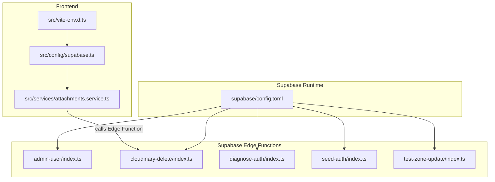
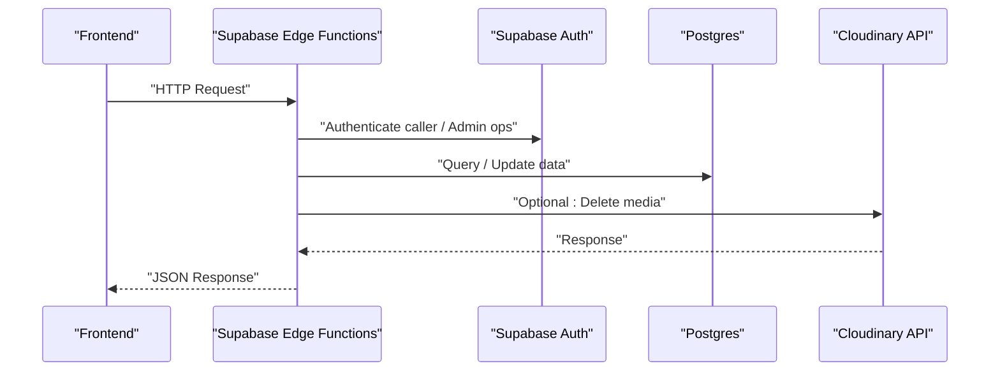
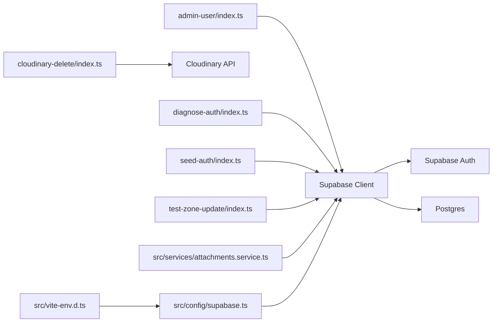

# Edge Functions

<cite>
**Referenced Files in This Document**
- [admin-user/index.ts](file://supabase/functions/admin-user/index.ts)
- [cloudinary-delete/index.ts](file://supabase/functions/cloudinary-delete/index.ts)
- [diagnose-auth/index.ts](file://supabase/functions/diagnose-auth/index.ts)
- [seed-auth/index.ts](file://supabase/functions/seed-auth/index.ts)
- [test-zone-update/index.ts](file://supabase/functions/test-zone-update/index.ts)
- [config.toml](file://supabase/config.toml)
- [vite-env.d.ts](file://src/vite-env.d.ts)
- [supabase.ts](file://src/config/supabase.ts)
- [attachments.service.ts](file://src/services/attachments.service.ts)
- [001_initial.sql](file://supabase/migrations/001_initial.sql)
</cite>

## Table of Contents
1. [Introduction](#introduction)
2. [Project Structure](#project-structure)
3. [Core Components](#core-components)
4. [Architecture Overview](#architecture-overview)
5. [Detailed Component Analysis](#detailed-component-analysis)
6. [Dependency Analysis](#dependency-analysis)
7. [Performance Considerations](#performance-considerations)
8. [Troubleshooting Guide](#troubleshooting-guide)
9. [Conclusion](#conclusion)
10. [Appendices](#appendices)

## Introduction
This document describes AbsensiOnline’s Supabase Edge Functions and how they integrate with the frontend. It covers five functions:
- admin-user: administrative user lifecycle operations
- cloudinary-delete: media cleanup via Cloudinary
- diagnose-auth: authentication and user data reconciliation diagnostics
- seed-auth: initial authentication data seeding
- test-zone-update: geofencing zone update validation

It explains purpose, input parameters, output formats, execution environment, deployment prerequisites, environment variables, error handling, logging strategies, and practical frontend integration patterns. It also provides guidance for extending the function library.

## Project Structure
Edge functions live under supabase/functions/<function-name>/index.ts. Each function is a Deno-based HTTP handler exposed by Supabase Edge Functions. The Supabase runtime configuration is defined in supabase/config.toml. Frontend integration uses Supabase client libraries configured in the Vite environment.

**Diagram sources**
- [config.toml:42-43](file://supabase/config.toml#L42-L43)
- [supabase.ts:1-6](file://src/config/supabase.ts#L1-L6)
- [vite-env.d.ts:3-13](file://src/vite-env.d.ts#L3-L13)
- [attachments.service.ts:1-28](file://src/services/attachments.service.ts#L1-L28)

**Section sources**
- [config.toml:1-43](file://supabase/config.toml#L1-L43)
- [supabase.ts:1-6](file://src/config/supabase.ts#L1-L6)
- [vite-env.d.ts:3-13](file://src/vite-env.d.ts#L3-L13)
- [attachments.service.ts:1-28](file://src/services/attachments.service.ts#L1-L28)

## Core Components
- admin-user: Enforces admin-only access, validates caller role, and supports create, reset_password, and delete operations against Supabase Auth and Postgres users table.
- cloudinary-delete: Accepts a Cloudinary public_id and optional resource_type, authenticates with Cloudinary API credentials, and returns the deletion outcome.
- diagnose-auth: Compares Supabase Auth users and public users, detects mismatches, and lists orphan attendances for diagnostic purposes.
- seed-auth: Seeds predefined users into Supabase Auth with deterministic IDs and metadata for testing and development.
- test-zone-update: Validates write/read/update cycles on the zones table for geofencing validation.

**Section sources**
- [admin-user/index.ts:10-167](file://supabase/functions/admin-user/index.ts#L10-L167)
- [cloudinary-delete/index.ts:8-71](file://supabase/functions/cloudinary-delete/index.ts#L8-L71)
- [diagnose-auth/index.ts:9-74](file://supabase/functions/diagnose-auth/index.ts#L9-L74)
- [seed-auth/index.ts:9-65](file://supabase/functions/seed-auth/index.ts#L9-L65)
- [test-zone-update/index.ts:9-68](file://supabase/functions/test-zone-update/index.ts#L9-L68)

## Architecture Overview
The functions execute in the Supabase Edge Functions runtime. They use Supabase client libraries to interact with Supabase Auth and Postgres, and optionally external APIs (Cloudinary). CORS is enabled for all functions. Frontend applications call these functions via HTTPS endpoints exposed by Supabase.

**Diagram sources**
- [admin-user/index.ts:24-54](file://supabase/functions/admin-user/index.ts#L24-L54)
- [cloudinary-delete/index.ts:23-50](file://supabase/functions/cloudinary-delete/index.ts#L23-L50)
- [diagnose-auth/index.ts:15-61](file://supabase/functions/diagnose-auth/index.ts#L15-L61)
- [seed-auth/index.ts:15-52](file://supabase/functions/seed-auth/index.ts#L15-L52)
- [test-zone-update/index.ts:15-49](file://supabase/functions/test-zone-update/index.ts#L15-L49)

## Detailed Component Analysis

### admin-user
Purpose
- Administrative user management: create, reset PIN/password, and delete users.
- Enforces role-based access control (admin/super_admin).

Execution Environment
- Uses Supabase client initialized with Authorization header from the incoming request.
- Performs admin operations using the service role key.

Inputs (request body)
- type: "create" | "reset_password" | "delete"
- For create: no_hp, nama, password (optional), role (optional)
- For reset_password: userId, password (PIN constraints apply)
- For delete: userId

Outputs
- On success: JSON with operation-specific fields (e.g., authUserId, success)
- On failure: JSON with error message and appropriate HTTP status

Security and Access Control
- Requires Authorization header
- Verifies caller role against ["admin", "super_admin"]

Error Handling
- Returns 400 for invalid inputs or validation failures
- Returns 401 for missing/unauthorized authorization
- Returns 403 for forbidden access
- Returns 500 for unexpected errors

Logging Strategy
- Returns structured JSON responses; include minimal contextual info in messages for observability.

Frontend Integration Pattern
- Call via HTTPS endpoint exposed by Supabase Edge Functions.
- Ensure Authorization header is set from the current session.

**Section sources**
- [admin-user/index.ts:10-167](file://supabase/functions/admin-user/index.ts#L10-L167)

### cloudinary-delete
Purpose
- Delete a Cloudinary resource by public_id and optional resource_type.

Execution Environment
- Reads Cloudinary credentials from environment variables.
- Calls Cloudinary Resources API to delete the resource.

Inputs (request body)
- public_id: required
- resource_type: optional (defaults to image)

Outputs
- JSON with ok, status, cloudinary_response, and requested metadata
- On missing public_id: 400
- On missing environment variables: 500 with availability flags

Security and Access Control
- No explicit auth enforcement; ensure this function is protected by Supabase Edge Functions policies or called from trusted contexts.

Error Handling
- Returns 400 for missing public_id
- Returns 500 for environment variable issues or unexpected errors

Logging Strategy
- Log raw response and status for auditability; avoid exposing secrets.

Frontend Integration Pattern
- Called from frontend after extracting public_id from Cloudinary URLs.
- Use the Supabase client to invoke the function securely.

**Section sources**
- [cloudinary-delete/index.ts:8-71](file://supabase/functions/cloudinary-delete/index.ts#L8-L71)

### diagnose-auth
Purpose
- Diagnose discrepancies between Supabase Auth users and public users, and identify orphan attendances.

Execution Environment
- Uses service role client to enumerate users and query public tables.

Inputs
- None (reads fixed test phone numbers)

Outputs
- JSON containing:
  - auth_users: filtered list of internal users
  - public_users: users from the public.users table for test numbers
  - mismatch: per-number match status
  - orphan_attendances: attendances whose user_id is not present in public users

Security and Access Control
- Uses service role key; restrict access to authorized callers.

Error Handling
- Returns 500 on unexpected errors

Logging Strategy
- Return comprehensive diagnostics for operator review.

Frontend Integration Pattern
- Invoke to validate data consistency during maintenance or on-demand checks.

**Section sources**
- [diagnose-auth/index.ts:9-74](file://supabase/functions/diagnose-auth/index.ts#L9-L74)

### seed-auth
Purpose
- Seed initial authentication users with deterministic IDs and metadata for development/testing.

Execution Environment
- Uses service role client to list, delete, and create users.

Inputs
- None (hardcoded test users)

Outputs
- JSON array with creation results per user (no_hp, email, auth_user_id, error)

Security and Access Control
- Uses service role key; intended for controlled environments.

Error Handling
- Returns 500 on unexpected errors

Logging Strategy
- Log results per user for verification.

Frontend Integration Pattern
- Run once during setup or reset; not typically invoked by regular users.

**Section sources**
- [seed-auth/index.ts:9-65](file://supabase/functions/seed-auth/index.ts#L9-L65)

### test-zone-update
Purpose
- Validate write/read/update cycle on the zones table for geofencing validation.

Execution Environment
- Uses service role client to select, update, re-select, and restore a zone record.

Inputs
- None (operates on first available zone)

Outputs
- JSON with zone_id, original_lat, new_lat, update_result, and read_back

Security and Access Control
- Uses service role key; intended for validation/testing.

Error Handling
- Returns 404 if no zones exist
- Returns 500 on unexpected errors

Logging Strategy
- Include before/after latitudes and update result for validation logs.

Frontend Integration Pattern
- Use to verify backend connectivity and RLS policies for zones.

**Section sources**
- [test-zone-update/index.ts:9-68](file://supabase/functions/test-zone-update/index.ts#L9-L68)

## Dependency Analysis
Runtime and external dependencies:
- Supabase client SDK for TypeScript
- Deno standard HTTP server for function handlers
- Cloudinary REST API for media deletion

Internal dependencies:
- Functions rely on Supabase Auth and Postgres schemas defined in migrations.
- Frontend services depend on Supabase client configuration and environment variables.

**Diagram sources**
- [admin-user/index.ts:24-54](file://supabase/functions/admin-user/index.ts#L24-L54)
- [cloudinary-delete/index.ts:23-50](file://supabase/functions/cloudinary-delete/index.ts#L23-L50)
- [diagnose-auth/index.ts:15-61](file://supabase/functions/diagnose-auth/index.ts#L15-L61)
- [seed-auth/index.ts:15-52](file://supabase/functions/seed-auth/index.ts#L15-L52)
- [test-zone-update/index.ts:15-49](file://supabase/functions/test-zone-update/index.ts#L15-L49)
- [supabase.ts:1-6](file://src/config/supabase.ts#L1-L6)
- [vite-env.d.ts:3-13](file://src/vite-env.d.ts#L3-L13)
- [attachments.service.ts:1-28](file://src/services/attachments.service.ts#L1-L28)

**Section sources**
- [admin-user/index.ts:24-54](file://supabase/functions/admin-user/index.ts#L24-L54)
- [cloudinary-delete/index.ts:23-50](file://supabase/functions/cloudinary-delete/index.ts#L23-L50)
- [diagnose-auth/index.ts:15-61](file://supabase/functions/diagnose-auth/index.ts#L15-L61)
- [seed-auth/index.ts:15-52](file://supabase/functions/seed-auth/index.ts#L15-L52)
- [test-zone-update/index.ts:15-49](file://supabase/functions/test-zone-update/index.ts#L15-L49)
- [supabase.ts:1-6](file://src/config/supabase.ts#L1-L6)
- [vite-env.d.ts:3-13](file://src/vite-env.d.ts#L3-L13)
- [attachments.service.ts:1-28](file://src/services/attachments.service.ts#L1-L28)

## Performance Considerations
- Keep function logic lightweight; offload heavy work to background jobs or scheduled tasks.
- Minimize external API calls; cache where appropriate.
- Use pagination and limits for queries; avoid scanning large datasets.
- Prefer single-row selects and targeted updates to reduce contention.
- Monitor function cold starts and optimize initialization.

## Troubleshooting Guide
Common issues and resolutions:
- Missing Authorization header or invalid token
  - Symptom: 401 Unauthorized
  - Action: Ensure frontend sets Authorization header from active session
- Role not permitted
  - Symptom: 403 Forbidden
  - Action: Verify caller role is admin or super_admin
- Invalid inputs
  - Symptom: 400 Bad Request
  - Action: Validate payload fields (e.g., required fields, PIN length/format)
- Environment variables not set
  - Symptom: 500 Internal Server Error with env availability flags
  - Action: Set Cloudinary credentials or Supabase keys in Supabase project settings
- No zones found
  - Symptom: 404 Not Found
  - Action: Seed zones data before invoking test-zone-update
- Unexpected errors
  - Symptom: 500 Internal Server Error
  - Action: Inspect returned error message and logs; verify Supabase connection and permissions

**Section sources**
- [admin-user/index.ts:160-165](file://supabase/functions/admin-user/index.ts#L160-L165)
- [cloudinary-delete/index.ts:64-69](file://supabase/functions/cloudinary-delete/index.ts#L64-L69)
- [diagnose-auth/index.ts:67-72](file://supabase/functions/diagnose-auth/index.ts#L67-L72)
- [seed-auth/index.ts:58-63](file://supabase/functions/seed-auth/index.ts#L58-L63)
- [test-zone-update/index.ts:61-66](file://supabase/functions/test-zone-update/index.ts#L61-L66)

## Conclusion
These edge functions provide essential capabilities for user administration, media cleanup, authentication diagnostics, data seeding, and geofencing validation. By adhering to the documented inputs, outputs, environment requirements, and security practices, teams can reliably operate and extend the function library while maintaining robust error handling and observability.

## Appendices

### Deployment Requirements and Environment Variables
- Supabase Edge Functions runtime configuration is defined in supabase/config.toml.
- Functions require Supabase project keys:
  - SUPABASE_URL
  - SUPABASE_SERVICE_ROLE_KEY (for admin operations)
  - SUPABASE_ANON_KEY (for client-side operations)
- Cloudinary integration requires:
  - CLOUDINARY_CLOUD_NAME
  - CLOUDINARY_API_KEY
  - CLOUDINARY_API_SECRET
- Frontend environment variables are defined in Vite’s type definitions and used to configure the Supabase client.

**Section sources**
- [config.toml:42-43](file://supabase/config.toml#L42-L43)
- [vite-env.d.ts:3-13](file://src/vite-env.d.ts#L3-L13)
- [supabase.ts:1-6](file://src/config/supabase.ts#L1-L6)

### Database Schema Context
- The zones table defines geofencing boundaries with constraints on latitude, longitude, and radius.
- Users and attendances tables define relationships relevant to authentication and presence tracking.

**Section sources**
- [001_initial.sql:10-26](file://supabase/migrations/001_initial.sql#L10-L26)
- [001_initial.sql:44-67](file://supabase/migrations/001_initial.sql#L44-L67)
- [001_initial.sql:68-96](file://supabase/migrations/001_initial.sql#L68-L96)

### Frontend Integration Examples
- Supabase client configuration and environment usage
  - Configure Supabase client with Vite environment variables
  - Extract Cloudinary public_id from URLs for deletion
- Example call pattern
  - Use the Supabase client to invoke the Edge Function endpoint
  - Handle responses and propagate errors to the UI

**Section sources**
- [supabase.ts:1-6](file://src/config/supabase.ts#L1-L6)
- [vite-env.d.ts:3-13](file://src/vite-env.d.ts#L3-L13)
- [attachments.service.ts:1-28](file://src/services/attachments.service.ts#L1-L28)