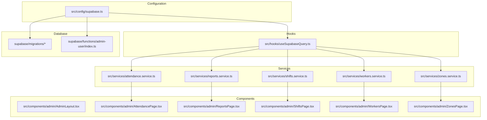
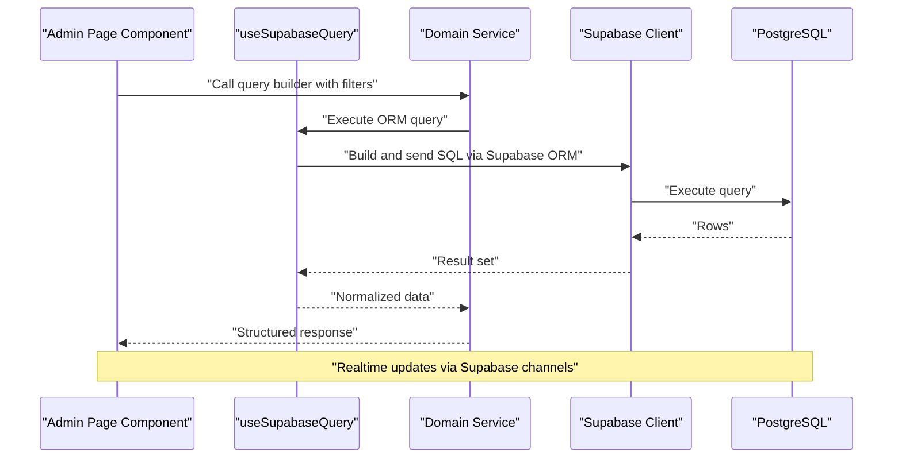
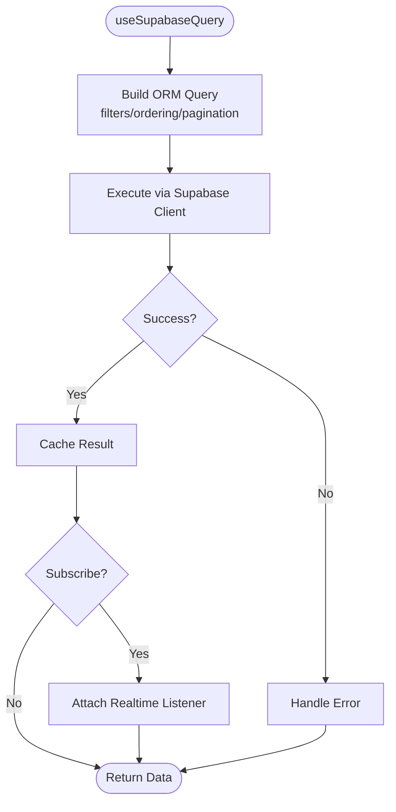
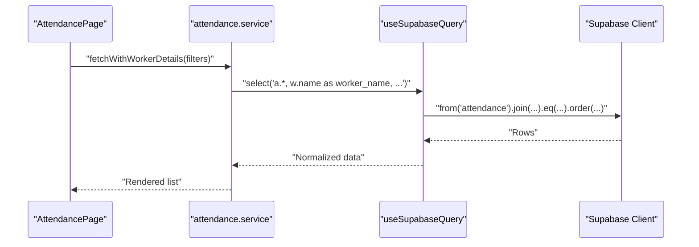
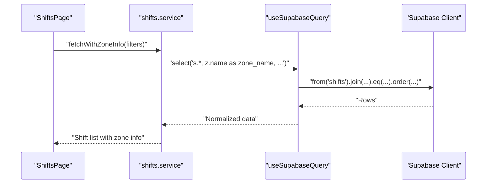
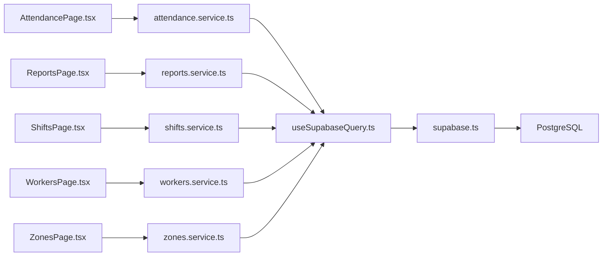

# GraphQL-like Queries

<cite>
**Referenced Files in This Document**
- [supabase.ts](file://src/config/supabase.ts)
- [useSupabaseQuery.ts](file://src/hooks/useSupabaseQuery.ts)
- [attendance.service.ts](file://src/services/attendance.service.ts)
- [workers.service.ts](file://src/services/workers.service.ts)
- [shifts.service.ts](file://src/services/shifts.service.ts)
- [zones.service.ts](file://src/services/zones.service.ts)
- [reports.service.ts](file://src/services/reports.service.ts)
- [AdminLayout.tsx](file://src/components/admin/AdminLayout.tsx)
- [AttendancePage.tsx](file://src/components/admin/AttendancePage.tsx)
- [ReportsPage.tsx](file://src/components/admin/ReportsPage.tsx)
- [ShiftsPage.tsx](file://src/components/admin/ShiftsPage.tsx)
- [WorkersPage.tsx](file://src/components/admin/WorkersPage.tsx)
- [ZonesPage.tsx](file://src/components/admin/ZonesPage.tsx)
- [index.ts](file://supabase/functions/admin-user/index.ts)
- [001_initial.sql](file://supabase/migrations/001_initial.sql)
- [009_app_settings.sql](file://supabase/migrations/009_app_settings.sql)
</cite>

## Table of Contents
1. [Introduction](#introduction)
2. [Project Structure](#project-structure)
3. [Core Components](#core-components)
4. [Architecture Overview](#architecture-overview)
5. [Detailed Component Analysis](#detailed-component-analysis)
6. [Dependency Analysis](#dependency-analysis)
7. [Performance Considerations](#performance-considerations)
8. [Troubleshooting Guide](#troubleshooting-guide)
9. [Conclusion](#conclusion)

## Introduction
This document explains how AbsensiOnline implements GraphQL-like query patterns using Supabase ORM. It focuses on field selection, filtering, relationship traversal, joins, aggregations, subscriptions, and caching strategies. The application organizes data access via service modules and a shared Supabase client hook, enabling flexible and composable queries similar to GraphQL’s selective field retrieval and nested selections.

## Project Structure
The application follows a layered architecture:
- Configuration: Supabase client initialization and RLS policies
- Hooks: Shared query abstraction and reactive data fetching
- Services: Domain-specific query builders and report generators
- Components: UI pages that orchestrate queries and render results
- Migrations: Database schema and indexes supporting efficient queries

**Diagram sources**
- [supabase.ts](file://src/config/supabase.ts)
- [useSupabaseQuery.ts](file://src/hooks/useSupabaseQuery.ts)
- [attendance.service.ts](file://src/services/attendance.service.ts)
- [workers.service.ts](file://src/services/workers.service.ts)
- [shifts.service.ts](file://src/services/shifts.service.ts)
- [zones.service.ts](file://src/services/zones.service.ts)
- [reports.service.ts](file://src/services/reports.service.ts)
- [AdminLayout.tsx](file://src/components/admin/AdminLayout.tsx)
- [AttendancePage.tsx](file://src/components/admin/AttendancePage.tsx)
- [ReportsPage.tsx](file://src/components/admin/ReportsPage.tsx)
- [ShiftsPage.tsx](file://src/components/admin/ShiftsPage.tsx)
- [WorkersPage.tsx](file://src/components/admin/WorkersPage.tsx)
- [ZonesPage.tsx](file://src/components/admin/ZonesPage.tsx)
- [index.ts](file://supabase/functions/admin-user/index.ts)
- [001_initial.sql](file://supabase/migrations/001_initial.sql)
- [009_app_settings.sql](file://supabase/migrations/009_app_settings.sql)

**Section sources**
- [supabase.ts](file://src/config/supabase.ts)
- [useSupabaseQuery.ts](file://src/hooks/useSupabaseQuery.ts)
- [001_initial.sql](file://supabase/migrations/001_initial.sql)

## Core Components
- Supabase client initialization: Provides a singleton client configured for authentication, realtime, and database access.
- Query hook: Encapsulates Supabase ORM usage, offering reactive fetch, filters, ordering, and pagination patterns.
- Services: Implement domain-specific queries and aggregations, exposing GraphQL-like field selection via explicit column selection and joins.
- Components: Compose services to build complex views, such as attendance with worker details, shift schedules with zone info, and reports.

Key responsibilities:
- Field selection: Explicitly select columns to mirror GraphQL’s field selection behavior.
- Filtering: Apply range, equality, and array membership filters.
- Joins and relationships: Traverse foreign keys and use nested selects to simulate nested fields.
- Aggregations: Use count and group-by patterns for reporting.
- Subscriptions: Leverage Supabase realtime for live updates.
- Caching: Use React Query patterns to cache and invalidate queries efficiently.

**Section sources**
- [supabase.ts](file://src/config/supabase.ts)
- [useSupabaseQuery.ts](file://src/hooks/useSupabaseQuery.ts)
- [attendance.service.ts](file://src/services/attendance.service.ts)
- [workers.service.ts](file://src/services/workers.service.ts)
- [shifts.service.ts](file://src/services/shifts.service.ts)
- [zones.service.ts](file://src/services/zones.service.ts)
- [reports.service.ts](file://src/services/reports.service.ts)

## Architecture Overview
The system separates concerns across configuration, hooks, services, and components. Services encapsulate Supabase ORM logic, while components orchestrate queries and present results. Realtime subscriptions enable near real-time updates for dynamic dashboards.

**Diagram sources**
- [useSupabaseQuery.ts](file://src/hooks/useSupabaseQuery.ts)
- [attendance.service.ts](file://src/services/attendance.service.ts)
- [workers.service.ts](file://src/services/workers.service.ts)
- [shifts.service.ts](file://src/services/shifts.service.ts)
- [zones.service.ts](file://src/services/zones.service.ts)
- [reports.service.ts](file://src/services/reports.service.ts)
- [supabase.ts](file://src/config/supabase.ts)

## Detailed Component Analysis

### Supabase Client Initialization
- Initializes the Supabase client with project credentials and exposes:
  - Database client for ORM operations
  - Auth client for session management
  - Realtime client for subscriptions
- Ensures consistent configuration across the app.

**Section sources**
- [supabase.ts](file://src/config/supabase.ts)

### Query Hook: useSupabaseQuery
- Provides a unified pattern for:
  - Reactive fetching with automatic refetch on data change
  - Filtering, ordering, and pagination
  - Subscription support for live updates
  - Caching and invalidation strategies
- Enables services to focus on building ORM queries while the hook manages lifecycle and performance.

**Diagram sources**
- [useSupabaseQuery.ts](file://src/hooks/useSupabaseQuery.ts)
- [supabase.ts](file://src/config/supabase.ts)

**Section sources**
- [useSupabaseQuery.ts](file://src/hooks/useSupabaseQuery.ts)

### Attendance Service: Attendance Records with Worker Details
- Implements GraphQL-like field selection by explicitly selecting required columns from attendance and joining worker details.
- Supports filtering by date ranges, worker IDs, and status.
- Uses joins to traverse foreign keys and return denormalized rows mirroring nested field selection.

Common patterns:
- Select specific columns from attendance and worker tables
- Join on worker ID to include worker metadata
- Filter by date range and optional status flags
- Order by check-in/out timestamps

**Diagram sources**
- [AttendancePage.tsx](file://src/components/admin/AttendancePage.tsx)
- [attendance.service.ts](file://src/services/attendance.service.ts)
- [useSupabaseQuery.ts](file://src/hooks/useSupabaseQuery.ts)
- [supabase.ts](file://src/config/supabase.ts)

**Section sources**
- [attendance.service.ts](file://src/services/attendance.service.ts)
- [AttendancePage.tsx](file://src/components/admin/AttendancePage.tsx)

### Shifts Service: Shift Schedules with Zone Information
- Retrieves shift schedule data joined with zone details to provide contextual location information.
- Filters by date range, zone ID, and active status.
- Orders by scheduled start time for predictable lists.

GraphQL-like selection:
- Select shift fields plus zone name/description
- Join on zone ID to include zone metadata
- Paginate and sort by start time

**Diagram sources**
- [ShiftsPage.tsx](file://src/components/admin/ShiftsPage.tsx)
- [shifts.service.ts](file://src/services/shifts.service.ts)
- [useSupabaseQuery.ts](file://src/hooks/useSupabaseQuery.ts)
- [supabase.ts](file://src/config/supabase.ts)

**Section sources**
- [shifts.service.ts](file://src/services/shifts.service.ts)
- [ShiftsPage.tsx](file://src/components/admin/ShiftsPage.tsx)

### Workers Service: Worker Profiles and Metadata
- Fetches worker profiles with selected fields and optional filters by status or zone assignment.
- Supports ordering by name or join date.
- Used extensively in attendance and scheduling contexts.

GraphQL-like selection:
- Select profile fields and computed metadata
- Optional filter by active status
- Sort by name for consistent UI lists

**Section sources**
- [workers.service.ts](file://src/services/workers.service.ts)
- [WorkersPage.tsx](file://src/components/admin/WorkersPage.tsx)

### Zones Service: Zone Definitions and Metrics
- Provides zone definitions and supports metrics aggregation for reporting.
- Filters by active status and supports paginated lists.

GraphQL-like selection:
- Select zone fields and optional counts via aggregates
- Filter by active flag
- Sort by zone name

**Section sources**
- [zones.service.ts](file://src/services/zones.service.ts)
- [ZonesPage.tsx](file://src/components/admin/ZonesPage.tsx)

### Reports Service: Aggregated Insights
- Builds aggregated queries for attendance summaries, productivity metrics, and compliance reports.
- Uses grouping, counting, and date truncation to produce roll-ups.
- Exposes structured report data consumable by UI components.

GraphQL-like selection:
- Group by date/worker/zone
- Count check-ins and compute percentages
- Order by time periods for trend visualization

**Section sources**
- [reports.service.ts](file://src/services/reports.service.ts)
- [ReportsPage.tsx](file://src/components/admin/ReportsPage.tsx)

### Admin Pages Orchestration
- Admin components coordinate service calls to assemble complex views:
  - Attendance page combines attendance records with worker details
  - Reports page consumes aggregated data from reports service
  - Shifts and zones pages rely on filtered lists from respective services

**Section sources**
- [AdminLayout.tsx](file://src/components/admin/AdminLayout.tsx)
- [AttendancePage.tsx](file://src/components/admin/AttendancePage.tsx)
- [ReportsPage.tsx](file://src/components/admin/ReportsPage.tsx)
- [ShiftsPage.tsx](file://src/components/admin/ShiftsPage.tsx)
- [WorkersPage.tsx](file://src/components/admin/WorkersPage.tsx)
- [ZonesPage.tsx](file://src/components/admin/ZonesPage.tsx)

## Dependency Analysis
The following diagram shows how components depend on services and how services depend on the query hook and Supabase client.

**Diagram sources**
- [AttendancePage.tsx](file://src/components/admin/AttendancePage.tsx)
- [ReportsPage.tsx](file://src/components/admin/ReportsPage.tsx)
- [ShiftsPage.tsx](file://src/components/admin/ShiftsPage.tsx)
- [WorkersPage.tsx](file://src/components/admin/WorkersPage.tsx)
- [ZonesPage.tsx](file://src/components/admin/ZonesPage.tsx)
- [attendance.service.ts](file://src/services/attendance.service.ts)
- [reports.service.ts](file://src/services/reports.service.ts)
- [shifts.service.ts](file://src/services/shifts.service.ts)
- [workers.service.ts](file://src/services/workers.service.ts)
- [zones.service.ts](file://src/services/zones.service.ts)
- [useSupabaseQuery.ts](file://src/hooks/useSupabaseQuery.ts)
- [supabase.ts](file://src/config/supabase.ts)

**Section sources**
- [useSupabaseQuery.ts](file://src/hooks/useSupabaseQuery.ts)
- [supabase.ts](file://src/config/supabase.ts)

## Performance Considerations
- Indexing
  - Ensure primary keys and foreign keys are indexed automatically by migrations.
  - Add composite indexes for frequent filter combinations (e.g., worker ID + date, zone ID + start time).
  - Consider partial indexes for active records to optimize RLS-filtered queries.
- Query patterns
  - Prefer explicit column selection to reduce payload size.
  - Use pagination and ordering to limit result sets.
  - Minimize deep nesting; prefer multiple focused queries over complex joins.
- Realtime
  - Subscribe only to necessary channels and tables.
  - Batch updates when possible to reduce churn.
- Caching
  - Reuse query keys across components to leverage cache hits.
  - Invalidate caches on mutation completion.
- Aggregations
  - Precompute frequently accessed metrics where feasible.
  - Use server-side grouping and limits to avoid large intermediate datasets.

[No sources needed since this section provides general guidance]

## Troubleshooting Guide
- Authentication and RLS
  - Verify user sessions and RLS policies align with intended access patterns.
  - Check function-level triggers for administrative tasks.
- Query errors
  - Validate column names and table relationships.
  - Confirm filters match data types and supported operators.
- Realtime connectivity
  - Ensure websocket connections are established and channels are subscribed.
  - Monitor for subscription errors and retry logic.
- Performance regressions
  - Review query plans and indexes after schema changes.
  - Audit slow queries and add appropriate indexes.

**Section sources**
- [index.ts](file://supabase/functions/admin-user/index.ts)
- [001_initial.sql](file://supabase/migrations/001_initial.sql)
- [009_app_settings.sql](file://supabase/migrations/009_app_settings.sql)

## Conclusion
AbsensiOnline achieves GraphQL-like flexibility using Supabase ORM by composing explicit field selection, joins, filters, and aggregations. The separation of concerns across configuration, hooks, services, and components enables maintainable, testable, and performant data access. By applying sound indexing, caching, and subscription strategies, the system supports responsive dashboards and scalable reporting.