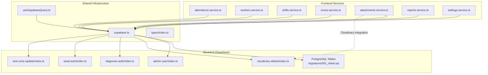
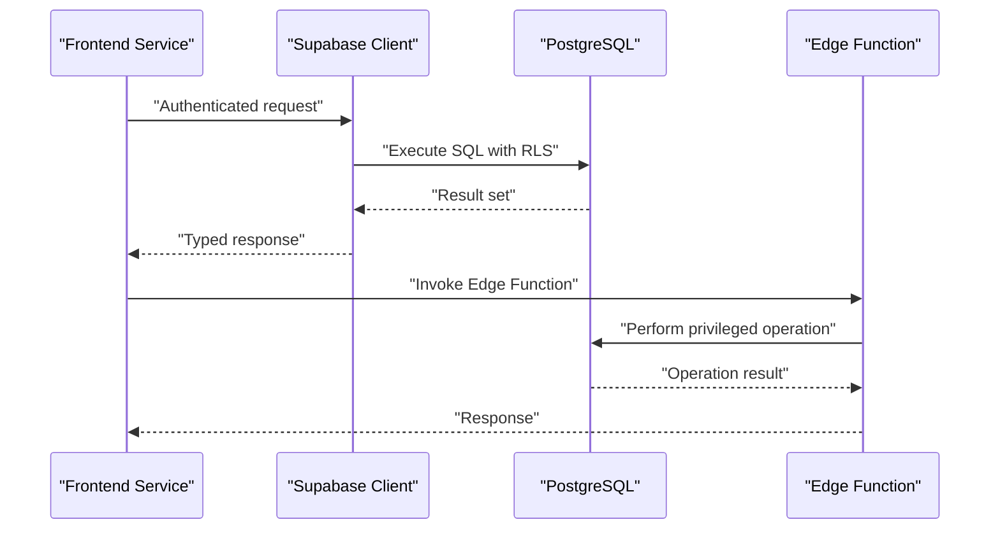
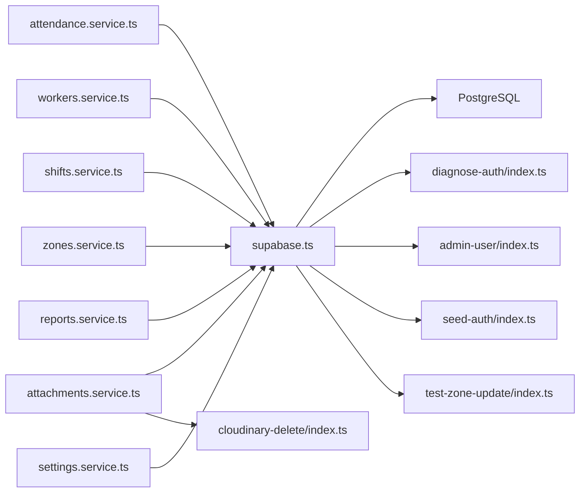

# REST Endpoints

<cite>
**Referenced Files in This Document**
- [supabase.ts](file://src/config/supabase.ts)
- [useSupabaseQuery.ts](file://src/hooks/useSupabaseQuery.ts)
- [attendance.service.ts](file://src/services/attendance.service.ts)
- [workers.service.ts](file://src/services/workers.service.ts)
- [shifts.service.ts](file://src/services/shifts.service.ts)
- [zones.service.ts](file://src/services/zones.service.ts)
- [attachments.service.ts](file://src/services/attachments.service.ts)
- [reports.service.ts](file://src/services/reports.service.ts)
- [settings.service.ts](file://src/services/settings.service.ts)
- [index.ts](file://src/types/index.ts)
- [001_initial.sql](file://supabase/migrations/001_initial.sql)
- [009_app_settings.sql](file://supabase/migrations/009_app_settings.sql)
- [admin-user/index.ts](file://supabase/functions/admin-user/index.ts)
- [cloudinary-delete/index.ts](file://supabase/functions/cloudinary-delete/index.ts)
- [diagnose-auth/index.ts](file://supabase/functions/diagnose-auth/index.ts)
- [seed-auth/index.ts](file://supabase/functions/seed-auth/index.ts)
- [test-zone-update/index.ts](file://supabase/functions/test-zone-update/index.ts)
</cite>

## Table of Contents
1. [Introduction](#introduction)
2. [Project Structure](#project-structure)
3. [Core Components](#core-components)
4. [Architecture Overview](#architecture-overview)
5. [Detailed Component Analysis](#detailed-component-analysis)
6. [Dependency Analysis](#dependency-analysis)
7. [Performance Considerations](#performance-considerations)
8. [Troubleshooting Guide](#troubleshooting-guide)
9. [Conclusion](#conclusion)

## Introduction
This document provides comprehensive REST API documentation for AbsensiOnline’s data access endpoints. It covers HTTP methods, URL patterns, request/response schemas, authentication requirements, parameter specifications, validation rules, pagination, filtering, error responses, status codes, and practical usage examples from the frontend service layer. The APIs documented here include attendance, workers, shifts, zones, reports, settings, and attachments.

## Project Structure
The frontend interacts with Supabase via typed service modules. Each domain (attendance, workers, shifts, zones, attachments, reports, settings) has a dedicated service that encapsulates HTTP requests and data transformations. Supabase client configuration and shared query helpers centralize authentication and data fetching logic.

**Diagram sources**
- [supabase.ts](file://src/config/supabase.ts)
- [useSupabaseQuery.ts](file://src/hooks/useSupabaseQuery.ts)
- [attendance.service.ts](file://src/services/attendance.service.ts)
- [workers.service.ts](file://src/services/workers.service.ts)
- [shifts.service.ts](file://src/services/shifts.service.ts)
- [zones.service.ts](file://src/services/zones.service.ts)
- [attachments.service.ts](file://src/services/attachments.service.ts)
- [reports.service.ts](file://src/services/reports.service.ts)
- [settings.service.ts](file://src/services/settings.service.ts)
- [001_initial.sql](file://supabase/migrations/001_initial.sql)
- [admin-user/index.ts](file://supabase/functions/admin-user/index.ts)
- [cloudinary-delete/index.ts](file://supabase/functions/cloudinary-delete/index.ts)
- [diagnose-auth/index.ts](file://supabase/functions/diagnose-auth/index.ts)
- [seed-auth/index.ts](file://supabase/functions/seed-auth/index.ts)
- [test-zone-update/index.ts](file://supabase/functions/test-zone-update/index.ts)

**Section sources**
- [supabase.ts](file://src/config/supabase.ts)
- [useSupabaseQuery.ts](file://src/hooks/useSupabaseQuery.ts)
- [index.ts](file://src/types/index.ts)

## Core Components
- Supabase client configuration initializes authentication and database connections used by all services.
- Shared query hook provides standardized fetch, loading, and error handling for Supabase queries.
- Domain-specific service modules expose CRUD and report endpoints with typed request/response shapes.

Key responsibilities:
- Authentication: Supabase Auth session drives all authenticated requests.
- Data access: Supabase SQL tables and Row Level Security (RLS) define access policies.
- Utility functions: Supabase Edge Functions support administrative tasks and integrations (e.g., Cloudinary cleanup).

**Section sources**
- [supabase.ts](file://src/config/supabase.ts)
- [useSupabaseQuery.ts](file://src/hooks/useSupabaseQuery.ts)
- [001_initial.sql](file://supabase/migrations/001_initial.sql)

## Architecture Overview
The frontend services call Supabase client methods to perform database operations. Edge Functions augment backend capabilities for specialized tasks. Authentication is enforced centrally via Supabase Auth.

**Diagram sources**
- [supabase.ts](file://src/config/supabase.ts)
- [001_initial.sql](file://supabase/migrations/001_initial.sql)
- [admin-user/index.ts](file://supabase/functions/admin-user/index.ts)
- [cloudinary-delete/index.ts](file://supabase/functions/cloudinary-delete/index.ts)

## Detailed Component Analysis

### Authentication and Authorization
- Authentication is managed by Supabase Auth. All authenticated routes require a valid session.
- Row Level Security (RLS) policies restrict data access per user role and ownership.
- Edge Functions enable privileged operations (e.g., admin tasks, Cloudinary cleanup).

Common outcomes:
- 401 Unauthorized: No active session or invalid credentials.
- 403 Forbidden: Insufficient permissions or RLS policy violation.
- 404 Not Found: Resource does not exist or access denied by policy.
- 500 Internal Server Error: Backend failure during request processing.

**Section sources**
- [supabase.ts](file://src/config/supabase.ts)
- [001_initial.sql](file://supabase/migrations/001_initial.sql)
- [diagnose-auth/index.ts](file://supabase/functions/diagnose-auth/index.ts)

### Attendance API
Purpose: Manage attendance records, including check-in/check-out, status updates, and history retrieval.

Endpoints
- GET /attendance
  - Description: List attendance records with optional filters and pagination.
  - Query parameters:
    - page (integer): Page number (default varies by implementation).
    - limit (integer): Number of items per page (default varies by implementation).
    - worker_id (uuid): Filter by worker ID.
    - shift_id (uuid): Filter by shift ID.
    - date_from (date): Filter by start date.
    - date_to (date): Filter by end date.
    - status (enum): Filter by status (e.g., present, absent, leave).
  - Sorting: Supports ordering by date or status.
  - Response: Array of attendance records with metadata.
  - Status codes: 200 OK, 400 Bad Request, 401 Unauthorized, 403 Forbidden, 500 Internal Server Error.

- POST /attendance
  - Description: Create a new attendance record.
  - Request body: Attendance creation payload (fields defined by domain types).
  - Response: Created attendance record.
  - Status codes: 201 Created, 400 Bad Request, 401 Unauthorized, 403 Forbidden, 500 Internal Server Error.

- GET /attendance/{id}
  - Description: Retrieve a single attendance record by ID.
  - Path parameters: id (uuid).
  - Response: Attendance record.
  - Status codes: 200 OK, 401 Unauthorized, 403 Forbidden, 404 Not Found, 500 Internal Server Error.

- PUT /attendance/{id}
  - Description: Update an existing attendance record.
  - Path parameters: id (uuid).
  - Request body: Attendance update payload.
  - Response: Updated attendance record.
  - Status codes: 200 OK, 400 Bad Request, 401 Unauthorized, 403 Forbidden, 404 Not Found, 500 Internal Server Error.

- DELETE /attendance/{id}
  - Description: Delete an attendance record.
  - Path parameters: id (uuid).
  - Response: Deletion result.
  - Status codes: 200 OK, 400 Bad Request, 401 Unauthorized, 403 Forbidden, 404 Not Found, 500 Internal Server Error.

Validation rules
- Required fields: worker_id, shift_id, date, status.
- Date range: date_from and date_to must form a valid interval.
- Enum constraints: status must match supported values.

Pagination and filtering
- Pagination via page and limit.
- Filtering via worker_id, shift_id, date range, and status.

Error responses
- 400 Bad Request: Validation errors or malformed request.
- 401 Unauthorized: Missing or invalid session.
- 403 Forbidden: Access denied by RLS.
- 404 Not Found: Record not found.
- 500 Internal Server Error: Unexpected server error.

Practical usage examples
- Fetch paginated attendance for a worker within a date range.
- Create a new attendance record for a scheduled shift.
- Update attendance status after manual review.
- Delete accidental entries with proper authorization checks.

**Section sources**
- [attendance.service.ts](file://src/services/attendance.service.ts)
- [index.ts](file://src/types/index.ts)
- [001_initial.sql](file://supabase/migrations/001_initial.sql)

### Workers API
Purpose: Manage worker profiles, assignments, and related attributes.

Endpoints
- GET /workers
  - Description: List workers with optional filters.
  - Query parameters:
    - page (integer), limit (integer): Pagination.
    - zone_id (uuid): Filter by zone.
    - name (text): Filter by name substring.
    - phone (text): Filter by phone number.
  - Sorting: Supports ordering by name or join_date.
  - Response: Array of worker records with metadata.
  - Status codes: 200 OK, 400 Bad Request, 401 Unauthorized, 403 Forbidden, 500 Internal Server Error.

- POST /workers
  - Description: Create a new worker.
  - Request body: Worker creation payload.
  - Response: Created worker record.
  - Status codes: 201 Created, 400 Bad Request, 401 Unauthorized, 403 Forbidden, 500 Internal Server Error.

- GET /workers/{id}
  - Description: Retrieve a single worker by ID.
  - Path parameters: id (uuid).
  - Response: Worker record.
  - Status codes: 200 OK, 401 Unauthorized, 403 Forbidden, 404 Not Found, 500 Internal Server Error.

- PUT /workers/{id}
  - Description: Update a worker profile.
  - Path parameters: id (uuid).
  - Request body: Worker update payload.
  - Response: Updated worker record.
  - Status codes: 200 OK, 400 Bad Request, 401 Unauthorized, 403 Forbidden, 404 Not Found, 500 Internal Server Error.

- DELETE /workers/{id}
  - Description: Delete a worker.
  - Path parameters: id (uuid).
  - Response: Deletion result.
  - Status codes: 200 OK, 400 Bad Request, 401 Unauthorized, 403 Forbidden, 404 Not Found, 500 Internal Server Error.

Validation rules
- Required fields: name, zone_id, phone.
- Unique constraints: phone may be unique depending on schema.
- Zone assignment: zone_id must reference an existing zone.

Pagination and filtering
- Pagination via page and limit.
- Filtering via zone_id, name, phone.

Error responses
- 400 Bad Request: Validation errors.
- 401 Unauthorized: Missing or invalid session.
- 403 Forbidden: Access denied by RLS.
- 404 Not Found: Record not found.
- 500 Internal Server Error: Unexpected server error.

Practical usage examples
- Search workers by name or phone.
- Assign workers to zones and manage profiles.
- Bulk operations: Use page/limit to iterate and update statuses.

**Section sources**
- [workers.service.ts](file://src/services/workers.service.ts)
- [index.ts](file://src/types/index.ts)
- [001_initial.sql](file://supabase/migrations/001_initial.sql)

### Shifts API
Purpose: Define and manage work shifts, schedules, and templates.

Endpoints
- GET /shifts
  - Description: List shifts with optional filters.
  - Query parameters:
    - page (integer), limit (integer): Pagination.
    - zone_id (uuid): Filter by zone.
    - start_time_from (timestamp), start_time_to (timestamp): Filter by start time range.
    - end_time_from (timestamp), end_time_to (timestamp): Filter by end time range.
  - Sorting: Supports ordering by start_time or duration.
  - Response: Array of shift records with metadata.
  - Status codes: 200 OK, 400 Bad Request, 401 Unauthorized, 403 Forbidden, 500 Internal Server Error.

- POST /shifts
  - Description: Create a new shift.
  - Request body: Shift creation payload.
  - Response: Created shift record.
  - Status codes: 201 Created, 400 Bad Request, 401 Unauthorized, 403 Forbidden, 500 Internal Server Error.

- GET /shifts/{id}
  - Description: Retrieve a single shift by ID.
  - Path parameters: id (uuid).
  - Response: Shift record.
  - Status codes: 200 OK, 401 Unauthorized, 403 Forbidden, 404 Not Found, 500 Internal Server Error.

- PUT /shifts/{id}
  - Description: Update a shift definition.
  - Path parameters: id (uuid).
  - Request body: Shift update payload.
  - Response: Updated shift record.
  - Status codes: 200 OK, 400 Bad Request, 401 Unauthorized, 403 Forbidden, 404 Not Found, 500 Internal Server Error.

- DELETE /shifts/{id}
  - Description: Delete a shift.
  - Path parameters: id (uuid).
  - Response: Deletion result.
  - Status codes: 200 OK, 400 Bad Request, 401 Unauthorized, 403 Forbidden, 404 Not Found, 500 Internal Server Error.

Validation rules
- Required fields: zone_id, start_time, end_time.
- Time constraints: start_time must precede end_time.
- Overlap detection: Prevent overlapping shifts per zone.

Pagination and filtering
- Pagination via page and limit.
- Filtering via zone_id and time ranges.

Error responses
- 400 Bad Request: Validation errors.
- 401 Unauthorized: Missing or invalid session.
- 403 Forbidden: Access denied by RLS.
- 404 Not Found: Record not found.
- 500 Internal Server Error: Unexpected server error.

Practical usage examples
- Schedule workers across shifts with overlap checks.
- Export shift lists for payroll processing.

**Section sources**
- [shifts.service.ts](file://src/services/shifts.service.ts)
- [index.ts](file://src/types/index.ts)
- [001_initial.sql](file://supabase/migrations/001_initial.sql)

### Zones API
Purpose: Manage geographic or organizational zones used to group workers and shifts.

Endpoints
- GET /zones
  - Description: List zones with optional filters.
  - Query parameters:
    - page (integer), limit (integer): Pagination.
    - name (text): Filter by name substring.
  - Sorting: Supports ordering by name.
  - Response: Array of zone records with metadata.
  - Status codes: 200 OK, 400 Bad Request, 401 Unauthorized, 403 Forbidden, 500 Internal Server Error.

- POST /zones
  - Description: Create a new zone.
  - Request body: Zone creation payload.
  - Response: Created zone record.
  - Status codes: 201 Created, 400 Bad Request, 401 Unauthorized, 403 Forbidden, 500 Internal Server Error.

- GET /zones/{id}
  - Description: Retrieve a single zone by ID.
  - Path parameters: id (uuid).
  - Response: Zone record.
  - Status codes: 200 OK, 401 Unauthorized, 403 Forbidden, 404 Not Found, 500 Internal Server Error.

- PUT /zones/{id}
  - Description: Update a zone definition.
  - Path parameters: id (uuid).
  - Request body: Zone update payload.
  - Response: Updated zone record.
  - Status codes: 200 OK, 400 Bad Request, 401 Unauthorized, 403 Forbidden, 404 Not Found, 500 Internal Server Error.

- DELETE /zones/{id}
  - Description: Delete a zone.
  - Path parameters: id (uuid).
  - Response: Deletion result.
  - Status codes: 200 OK, 400 Bad Request, 401 Unauthorized, 403 Forbidden, 404 Not Found, 500 Internal Server Error.

Validation rules
- Required fields: name.
- Uniqueness: name may be unique depending on schema.

Pagination and filtering
- Pagination via page and limit.
- Filtering via name.

Error responses
- 400 Bad Request: Validation errors.
- 401 Unauthorized: Missing or invalid session.
- 403 Forbidden: Access denied by RLS.
- 404 Not Found: Record not found.
- 500 Internal Server Error: Unexpected server error.

Practical usage examples
- Assign workers and shifts to zones for reporting.
- Restrict visibility via RLS per zone.

**Section sources**
- [zones.service.ts](file://src/services/zones.service.ts)
- [index.ts](file://src/types/index.ts)
- [001_initial.sql](file://supabase/migrations/001_initial.sql)

### Attachments API
Purpose: Upload, manage, and delete attachment files associated with records.

Endpoints
- POST /attachments/upload
  - Description: Upload a file to Cloudinary via Supabase Edge Function.
  - Request: Form-data with file field.
  - Response: Attachment metadata (URL, public_id, etc.).
  - Status codes: 201 Created, 400 Bad Request, 401 Unauthorized, 403 Forbidden, 500 Internal Server Error.

- DELETE /attachments/delete
  - Description: Delete a file from Cloudinary via Edge Function.
  - Request body: { public_id: string }.
  - Response: Deletion result.
  - Status codes: 200 OK, 400 Bad Request, 401 Unauthorized, 403 Forbidden, 500 Internal Server Error.

- GET /attachments
  - Description: List attachments with optional filters.
  - Query parameters:
    - page (integer), limit (integer): Pagination.
    - record_type (enum): Filter by related entity type.
    - record_id (uuid): Filter by related entity ID.
  - Sorting: Supports ordering by created_at.
  - Response: Array of attachment records with metadata.
  - Status codes: 200 OK, 400 Bad Request, 401 Unauthorized, 403 Forbidden, 500 Internal Server Error.

Validation rules
- Required fields: file upload or public_id for deletion.
- Content-type: Enforce allowed MIME types where applicable.

Pagination and filtering
- Pagination via page and limit.
- Filtering via record_type and record_id.

Error responses
- 400 Bad Request: Validation errors or unsupported file type.
- 401 Unauthorized: Missing or invalid session.
- 403 Forbidden: Access denied by RLS.
- 404 Not Found: Attachment not found.
- 500 Internal Server Error: Unexpected server error.

Practical usage examples
- Upload evidence images for attendance disputes.
- Delete temporary uploads after approval.

**Section sources**
- [attachments.service.ts](file://src/services/attachments.service.ts)
- [cloudinary-delete/index.ts](file://supabase/functions/cloudinary-delete/index.ts)
- [index.ts](file://src/types/index.ts)

### Reports API
Purpose: Generate and retrieve attendance and productivity reports.

Endpoints
- GET /reports/attendance-summary
  - Description: Summarize attendance counts by status and date range.
  - Query parameters:
    - date_from (date), date_to (date): Report period.
    - zone_id (uuid): Filter by zone.
    - worker_id (uuid): Filter by worker.
  - Response: Aggregated summary metrics.
  - Status codes: 200 OK, 400 Bad Request, 401 Unauthorized, 403 Forbidden, 500 Internal Server Error.

- GET /reports/worker-productivity
  - Description: Compute productivity metrics per worker.
  - Query parameters:
    - date_from (date), date_to (date): Report period.
    - zone_id (uuid): Filter by zone.
  - Response: Worker-level productivity metrics.
  - Status codes: 200 OK, 400 Bad Request, 401 Unauthorized, 403 Forbidden, 500 Internal Server Error.

- GET /reports/export-pdf
  - Description: Export a PDF report (via utility).
  - Query parameters: Same as summary/productivity endpoints.
  - Response: PDF binary stream.
  - Status codes: 200 OK, 400 Bad Request, 401 Unauthorized, 403 Forbidden, 500 Internal Server Error.

Validation rules
- Required fields: date_from and date_to must form a valid interval.
- Optional filters: zone_id and worker_id refine scope.

Error responses
- 400 Bad Request: Invalid date range or parameters.
- 401 Unauthorized: Missing or invalid session.
- 403 Forbidden: Access denied by RLS.
- 500 Internal Server Error: Unexpected server error.

Practical usage examples
- Generate daily summaries for supervisors.
- Export monthly productivity reports for management.

**Section sources**
- [reports.service.ts](file://src/services/reports.service.ts)
- [exportPdf.ts](file://src/utils/exportPdf.ts)
- [index.ts](file://src/types/index.ts)

### Settings API
Purpose: Configure application-wide settings and preferences.

Endpoints
- GET /settings
  - Description: Retrieve current settings.
  - Response: Settings object.
  - Status codes: 200 OK, 401 Unauthorized, 403 Forbidden, 500 Internal Server Error.

- PUT /settings
  - Description: Update settings.
  - Request body: Partial settings payload.
  - Response: Updated settings object.
  - Status codes: 200 OK, 400 Bad Request, 401 Unauthorized, 403 Forbidden, 500 Internal Server Error.

Validation rules
- Required fields: Depends on setting keys.
- Enum constraints: Some settings accept predefined values.

Error responses
- 400 Bad Request: Validation errors.
- 401 Unauthorized: Missing or invalid session.
- 403 Forbidden: Access denied by RLS.
- 500 Internal Server Error: Unexpected server error.

Practical usage examples
- Enable/disable geofencing.
- Set default shift durations.

**Section sources**
- [settings.service.ts](file://src/services/settings.service.ts)
- [009_app_settings.sql](file://supabase/migrations/009_app_settings.sql)
- [index.ts](file://src/types/index.ts)

## Dependency Analysis
The frontend services depend on the Supabase client for authentication and data access. Edge Functions provide privileged operations and integrations. Shared types define request/response contracts.

**Diagram sources**
- [supabase.ts](file://src/config/supabase.ts)
- [attendance.service.ts](file://src/services/attendance.service.ts)
- [workers.service.ts](file://src/services/workers.service.ts)
- [shifts.service.ts](file://src/services/shifts.service.ts)
- [zones.service.ts](file://src/services/zones.service.ts)
- [attachments.service.ts](file://src/services/attachments.service.ts)
- [reports.service.ts](file://src/services/reports.service.ts)
- [settings.service.ts](file://src/services/settings.service.ts)
- [cloudinary-delete/index.ts](file://supabase/functions/cloudinary-delete/index.ts)
- [diagnose-auth/index.ts](file://supabase/functions/diagnose-auth/index.ts)
- [admin-user/index.ts](file://supabase/functions/admin-user/index.ts)
- [seed-auth/index.ts](file://supabase/functions/seed-auth/index.ts)
- [test-zone-update/index.ts](file://supabase/functions/test-zone-update/index.ts)

**Section sources**
- [supabase.ts](file://src/config/supabase.ts)
- [index.ts](file://src/types/index.ts)

## Performance Considerations
- Prefer filtered queries with indexed columns (zone_id, worker_id, timestamps).
- Use pagination (page, limit) to avoid large payloads.
- Batch operations: Combine multiple updates within a transaction where supported.
- Caching: Store frequently accessed settings and static lookup data locally.
- Network efficiency: Minimize redundant requests by coalescing filters and sorting on the server side.

## Troubleshooting Guide
Common issues and resolutions
- 401 Unauthorized: Ensure a valid session exists. Reauthenticate if needed.
- 403 Forbidden: Verify user role and RLS policies. Check ownership of requested resources.
- 404 Not Found: Confirm resource IDs and filters. RLS may hide missing records.
- 400 Bad Request: Validate request payloads against domain types. Check required fields and constraints.
- Edge Function failures: Review logs for Cloudinary operations and administrative tasks.

Diagnostic steps
- Inspect Supabase Auth session and tokens.
- Verify RLS policies for the requesting user.
- Test Edge Functions independently for privileged operations.

**Section sources**
- [diagnose-auth/index.ts](file://supabase/functions/diagnose-auth/index.ts)
- [001_initial.sql](file://supabase/migrations/001_initial.sql)

## Conclusion
AbsensiOnline’s REST endpoints are implemented through typed frontend services that communicate with Supabase. Authentication and authorization are enforced centrally, while Edge Functions handle privileged operations and integrations. The documented endpoints cover CRUD operations, filtering, pagination, and reporting, with clear validation rules and error handling. Following the guidelines above ensures reliable and secure API usage across attendance, workers, shifts, zones, attachments, reports, and settings domains.