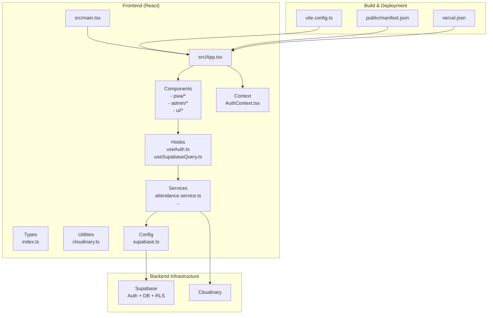
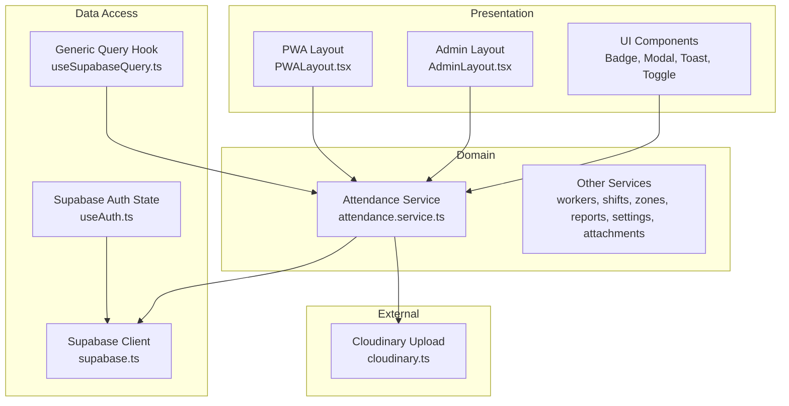
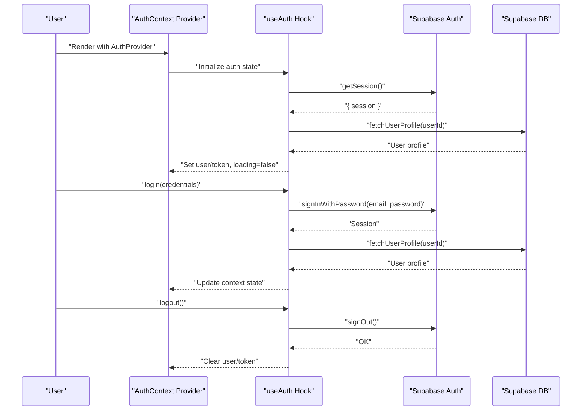
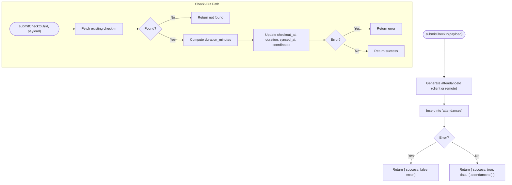
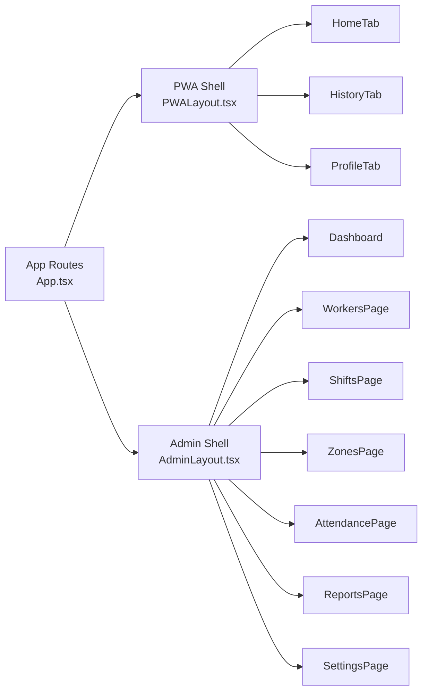
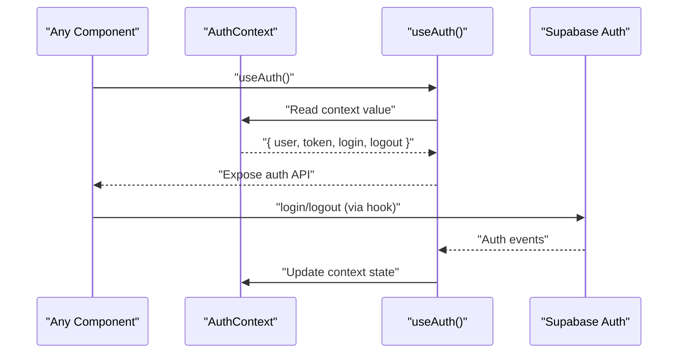
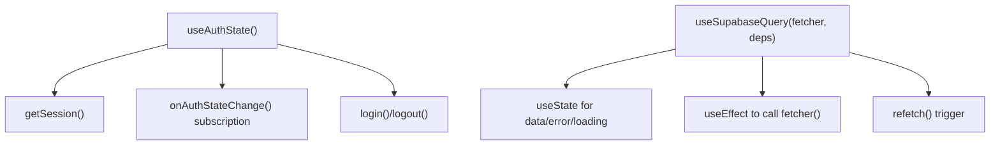
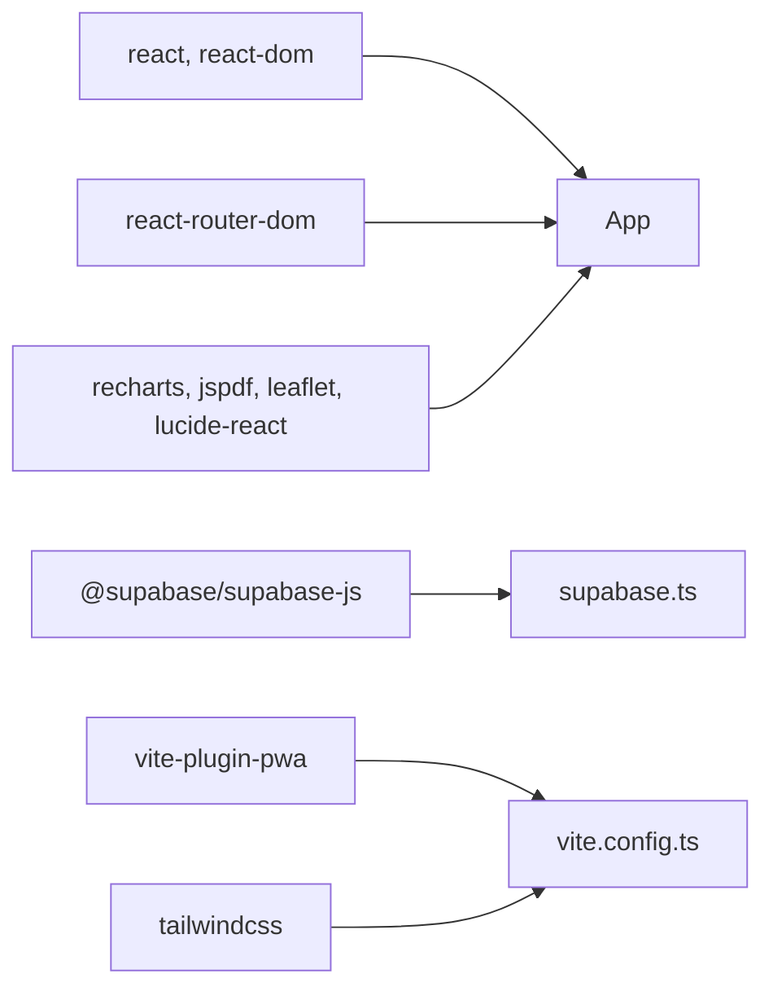
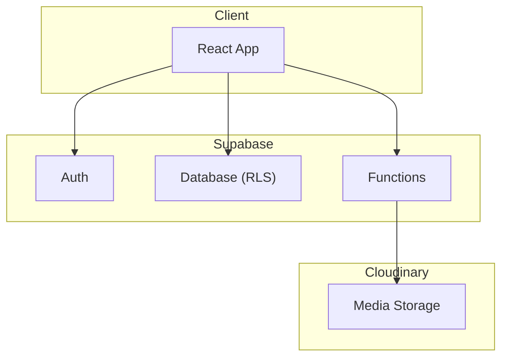
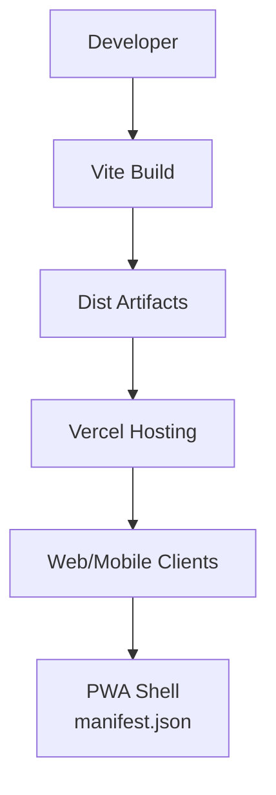

# Architecture Overview

<cite>
**Referenced Files in This Document**
- [src/main.tsx](file://src/main.tsx)
- [src/App.tsx](file://src/App.tsx)
- [src/config/supabase.ts](file://src/config/supabase.ts)
- [src/context/AuthContext.tsx](file://src/context/AuthContext.tsx)
- [src/hooks/useAuth.ts](file://src/hooks/useAuth.ts)
- [src/hooks/useSupabaseQuery.ts](file://src/hooks/useSupabaseQuery.ts)
- [src/services/attendance.service.ts](file://src/services/attendance.service.ts)
- [src/components/pwa/PWALayout.tsx](file://src/components/pwa/PWALayout.tsx)
- [src/components/admin/AdminLayout.tsx](file://src/components/admin/AdminLayout.tsx)
- [src/types/index.ts](file://src/types/index.ts)
- [src/utils/cloudinary.ts](file://src/utils/cloudinary.ts)
- [public/manifest.json](file://public/manifest.json)
- [vite.config.ts](file://vite.config.ts)
- [vercel.json](file://vercel.json)
- [package.json](file://package.json)
</cite>

## Table of Contents
1. [Introduction](#introduction)
2. [Project Structure](#project-structure)
3. [Core Components](#core-components)
4. [Architecture Overview](#architecture-overview)
5. [Detailed Component Analysis](#detailed-component-analysis)
6. [Dependency Analysis](#dependency-analysis)
7. [Performance Considerations](#performance-considerations)
8. [Security Architecture](#security-architecture)
9. [Deployment Topology](#deployment-topology)
10. [Scalability Considerations](#scalability-considerations)
11. [Troubleshooting Guide](#troubleshooting-guide)
12. [Conclusion](#conclusion)

## Introduction
This document presents the architecture of AbsensiOnline, a Progressive Web Application (PWA) for attendance tracking. The system follows a component-based architecture built with React and Vite, integrates with Supabase for authentication and database, and leverages Cloudinary for media uploads. It employs service layer abstraction, React Context for global state, and custom hooks for reusable logic. The design supports both web and mobile experiences via a PWA shell and responsive layouts.

## Project Structure
The project is organized around a clear separation of concerns:
- Frontend: React application bootstrapped with Vite, structured into components, services, hooks, context, types, and utilities.
- Backend/Infrastructure: Supabase handles authentication, database, and serverless functions; Vercel hosts the static site with SPA routing.
- Mobile/Web Integration: PWA configuration enables installation and offline-capable experiences.



**Diagram sources**
- [src/main.tsx:1-15](file://src/main.tsx#L1-L15)
- [src/App.tsx:1-58](file://src/App.tsx#L1-L58)
- [src/context/AuthContext.tsx:1-43](file://src/context/AuthContext.tsx#L1-L43)
- [src/hooks/useAuth.ts:1-115](file://src/hooks/useAuth.ts#L1-L115)
- [src/hooks/useSupabaseQuery.ts:1-48](file://src/hooks/useSupabaseQuery.ts#L1-L48)
- [src/services/attendance.service.ts:1-188](file://src/services/attendance.service.ts#L1-L188)
- [src/config/supabase.ts:1-7](file://src/config/supabase.ts#L1-L7)
- [src/utils/cloudinary.ts:1-63](file://src/utils/cloudinary.ts#L1-L63)
- [vite.config.ts:1-48](file://vite.config.ts#L1-L48)
- [public/manifest.json:1-13](file://public/manifest.json#L1-L13)
- [vercel.json:1-4](file://vercel.json#L1-L4)

**Section sources**
- [src/main.tsx:1-15](file://src/main.tsx#L1-L15)
- [src/App.tsx:1-58](file://src/App.tsx#L1-L58)
- [vite.config.ts:1-48](file://vite.config.ts#L1-L48)
- [vercel.json:1-4](file://vercel.json#L1-L4)

## Core Components
- Application bootstrap initializes React, routing, and providers for authentication and toast notifications.
- Routing defines separate paths for admin and PWA views, protected by route guards.
- Authentication context encapsulates login/logout, session hydration, and user state.
- Hooks abstract Supabase auth state and generic query lifecycle.
- Services encapsulate data access patterns against Supabase tables and integrate Cloudinary for media.
- Types define domain models and standardized service result structures.
- Utilities provide Cloudinary upload helpers and shared UI utilities.

Key implementation references:
- [Application bootstrap:1-15](file://src/main.tsx#L1-L15)
- [Routing and layout composition:1-58](file://src/App.tsx#L1-L58)
- [Authentication provider and hook:1-43](file://src/context/AuthContext.tsx#L1-L43)
- [Auth state management:1-115](file://src/hooks/useAuth.ts#L1-L115)
- [Generic query hook:1-48](file://src/hooks/useSupabaseQuery.ts#L1-L48)
- [Attendance service:1-188](file://src/services/attendance.service.ts#L1-L188)
- [Type definitions:1-182](file://src/types/index.ts#L1-L182)
- [Cloudinary integration:1-63](file://src/utils/cloudinary.ts#L1-L63)

**Section sources**
- [src/main.tsx:1-15](file://src/main.tsx#L1-L15)
- [src/App.tsx:1-58](file://src/App.tsx#L1-L58)
- [src/context/AuthContext.tsx:1-43](file://src/context/AuthContext.tsx#L1-L43)
- [src/hooks/useAuth.ts:1-115](file://src/hooks/useAuth.ts#L1-L115)
- [src/hooks/useSupabaseQuery.ts:1-48](file://src/hooks/useSupabaseQuery.ts#L1-L48)
- [src/services/attendance.service.ts:1-188](file://src/services/attendance.service.ts#L1-L188)
- [src/types/index.ts:1-182](file://src/types/index.ts#L1-L182)
- [src/utils/cloudinary.ts:1-63](file://src/utils/cloudinary.ts#L1-L63)

## Architecture Overview
The system follows a layered architecture:
- Presentation Layer: React components organized by feature (PWA and Admin) and UI primitives.
- Domain Layer: Services encapsulate business logic and data operations.
- Data Access Layer: Supabase client configured with environment variables; serverless functions support specialized operations.
- External Integrations: Cloudinary for media storage and delivery.



**Diagram sources**
- [src/components/pwa/PWALayout.tsx:1-43](file://src/components/pwa/PWALayout.tsx#L1-L43)
- [src/components/admin/AdminLayout.tsx:1-141](file://src/components/admin/AdminLayout.tsx#L1-L141)
- [src/services/attendance.service.ts:1-188](file://src/services/attendance.service.ts#L1-L188)
- [src/hooks/useAuth.ts:1-115](file://src/hooks/useAuth.ts#L1-L115)
- [src/hooks/useSupabaseQuery.ts:1-48](file://src/hooks/useSupabaseQuery.ts#L1-L48)
- [src/config/supabase.ts:1-7](file://src/config/supabase.ts#L1-L7)
- [src/utils/cloudinary.ts:1-63](file://src/utils/cloudinary.ts#L1-L63)

## Detailed Component Analysis

### Authentication and Session Management
The authentication subsystem uses Supabase Auth with a custom hook to manage session hydration, reactive auth state changes, and login/logout flows. The AuthContext exposes a stable API for downstream components.



**Diagram sources**
- [src/context/AuthContext.tsx:18-36](file://src/context/AuthContext.tsx#L18-L36)
- [src/hooks/useAuth.ts:22-56](file://src/hooks/useAuth.ts#L22-L56)
- [src/hooks/useAuth.ts:58-104](file://src/hooks/useAuth.ts#L58-L104)

**Section sources**
- [src/context/AuthContext.tsx:1-43](file://src/context/AuthContext.tsx#L1-L43)
- [src/hooks/useAuth.ts:1-115](file://src/hooks/useAuth.ts#L1-L115)

### Attendance Service and Data Flow
The attendance service orchestrates check-in/check-out operations, computes durations, and aggregates history records. It interacts with Supabase tables and returns standardized results.



**Diagram sources**
- [src/services/attendance.service.ts:25-77](file://src/services/attendance.service.ts#L25-L77)
- [src/services/attendance.service.ts:132-159](file://src/services/attendance.service.ts#L132-L159)

**Section sources**
- [src/services/attendance.service.ts:1-188](file://src/services/attendance.service.ts#L1-L188)

### PWA and Admin Layouts
The application provides two primary navigation shells:
- PWA Layout: Bottom-tabbed mobile-first interface for workers.
- Admin Layout: Sidebar-based desktop-friendly interface for administrators.



**Diagram sources**
- [src/App.tsx:20-57](file://src/App.tsx#L20-L57)
- [src/components/pwa/PWALayout.tsx:11-42](file://src/components/pwa/PWALayout.tsx#L11-L42)
- [src/components/admin/AdminLayout.tsx:17-140](file://src/components/admin/AdminLayout.tsx#L17-L140)

**Section sources**
- [src/App.tsx:1-58](file://src/App.tsx#L1-L58)
- [src/components/pwa/PWALayout.tsx:1-43](file://src/components/pwa/PWALayout.tsx#L1-L43)
- [src/components/admin/AdminLayout.tsx:1-141](file://src/components/admin/AdminLayout.tsx#L1-L141)

### Service Layer Pattern
Services encapsulate data operations and present a unified interface to components. They handle:
- Supabase queries and mutations
- Result normalization via a standard shape
- Integration with external services (e.g., Cloudinary)

```mermaid
classDiagram
class AttendanceService {
+getAttendances() ServiceResult~Attendance[]~
+submitCheckIn(payload) ServiceResult~{ attendanceId }~
+submitCheckOut(id, payload) ServiceResult~void~
+getTodayAttendance(workerId) ServiceResult~TodayRecord|null~
+getHistory(userId) ServiceResult~HistoryRecord[]~
+updateAttendanceStatus(id, payload) ServiceResult~Attendance~
}
class SupabaseClient {
+from(table)
+rpc(fn, params)
}
class CloudinaryUtil {
+uploadToCloudinary(file, folder, onProgress) ServiceResult
}
AttendanceService --> SupabaseClient : "uses"
AttendanceService --> CloudinaryUtil : "optional integration"
```

**Diagram sources**
- [src/services/attendance.service.ts:1-188](file://src/services/attendance.service.ts#L1-L188)
- [src/config/supabase.ts:1-7](file://src/config/supabase.ts#L1-L7)
- [src/utils/cloudinary.ts:1-63](file://src/utils/cloudinary.ts#L1-L63)

**Section sources**
- [src/services/attendance.service.ts:1-188](file://src/services/attendance.service.ts#L1-L188)
- [src/utils/cloudinary.ts:1-63](file://src/utils/cloudinary.ts#L1-L63)

### Context Pattern for Global State
The AuthContext provides a single source of truth for authentication state across the app, enabling components to access user info, tokens, and actions without prop drilling.



**Diagram sources**
- [src/context/AuthContext.tsx:18-36](file://src/context/AuthContext.tsx#L18-L36)
- [src/hooks/useAuth.ts:29-114](file://src/hooks/useAuth.ts#L29-L114)

**Section sources**
- [src/context/AuthContext.tsx:1-43](file://src/context/AuthContext.tsx#L1-L43)
- [src/hooks/useAuth.ts:1-115](file://src/hooks/useAuth.ts#L1-L115)

### Hook Pattern for Reusable Logic
Custom hooks centralize cross-cutting concerns:
- useAuthState: Manages session hydration and auth state subscriptions.
- useSupabaseQuery: Encapsulates loading/error/refetch semantics for data fetching.



**Diagram sources**
- [src/hooks/useAuth.ts:29-114](file://src/hooks/useAuth.ts#L29-L114)
- [src/hooks/useSupabaseQuery.ts:11-47](file://src/hooks/useSupabaseQuery.ts#L11-L47)

**Section sources**
- [src/hooks/useAuth.ts:1-115](file://src/hooks/useAuth.ts#L1-L115)
- [src/hooks/useSupabaseQuery.ts:1-48](file://src/hooks/useSupabaseQuery.ts#L1-L48)

## Dependency Analysis
The frontend depends on:
- React and React Router for UI and routing
- Supabase client for auth and DB
- Tailwind CSS for styling
- Vite and PWA plugin for build and offline capabilities
- Optional external libraries for charts, PDF generation, and mapping



**Diagram sources**
- [package.json:13-27](file://package.json#L13-L27)
- [vite.config.ts:16-33](file://vite.config.ts#L16-L33)
- [src/config/supabase.ts:1-7](file://src/config/supabase.ts#L1-L7)

**Section sources**
- [package.json:1-41](file://package.json#L1-L41)
- [vite.config.ts:1-48](file://vite.config.ts#L1-L48)

## Performance Considerations
- Single-file build: The Vite single-file plugin consolidates assets for efficient delivery.
- PWA caching: Workbox runtime caching is disabled to favor network reliability; adjust per environment needs.
- Lazy loading: Consider lazy-loading heavy routes (e.g., ReportsPage) to reduce initial bundle size.
- Offline-first UX: Combine service worker updates with local storage queues for pending sync operations.
- Image compression: Integrate browser-image-compression to optimize media uploads prior to Cloudinary.

[No sources needed since this section provides general guidance]

## Security Architecture
- Supabase Auth: Username-to-email mapping and password-based sign-in; session tokens stored securely.
- Supabase Row Level Security (RLS): Enforced policies on tables to restrict data access by user roles.
- Supabase Functions: Serverless functions (seed, diagnose, admin-user, cloudinary-delete) provide controlled backend logic.
- Environment Variables: Supabase keys and Cloudinary credentials are loaded from environment variables.



**Diagram sources**
- [src/hooks/useAuth.ts:58-96](file://src/hooks/useAuth.ts#L58-L96)
- [src/services/attendance.service.ts:30-46](file://src/services/attendance.service.ts#L30-L46)
- [src/utils/cloudinary.ts:11-62](file://src/utils/cloudinary.ts#L11-L62)

**Section sources**
- [src/hooks/useAuth.ts:1-115](file://src/hooks/useAuth.ts#L1-L115)
- [src/services/attendance.service.ts:1-188](file://src/services/attendance.service.ts#L1-L188)
- [src/utils/cloudinary.ts:1-63](file://src/utils/cloudinary.ts#L1-L63)

## Deployment Topology
- Static hosting: Vercel serves the SPA with a rewrite rule to index.html for deep links.
- PWA assets: Manifest and icons included via Vite PWA plugin.
- Build pipeline: Vite compiles TypeScript/JSX, applies Tailwind, and bundles with single-file optimization.



**Diagram sources**
- [vite.config.ts:20-32](file://vite.config.ts#L20-L32)
- [public/manifest.json:1-13](file://public/manifest.json#L1-L13)
- [vercel.json:1-4](file://vercel.json#L1-L4)

**Section sources**
- [vite.config.ts:1-48](file://vite.config.ts#L1-L48)
- [vercel.json:1-4](file://vercel.json#L1-L4)
- [public/manifest.json:1-13](file://public/manifest.json#L1-L13)

## Scalability Considerations
- Horizontal scaling: Supabase manages database and auth scaling; consider read replicas and connection pooling.
- CDN and media: Offload images to Cloudinary for global distribution and reduced origin load.
- Background jobs: Use Supabase Edge Functions or external workers for heavy tasks (e.g., report generation).
- Caching: Implement selective caching for frequently accessed lists (e.g., zones, shifts) while keeping real-time feeds fresh.
- Observability: Add logging and metrics for auth events, DB queries, and Cloudinary uploads.

[No sources needed since this section provides general guidance]

## Troubleshooting Guide
Common areas to inspect:
- Authentication failures: Verify Supabase URL/keys and auth state change handlers.
- Network errors: Check service results and error propagation from hooks.
- Media uploads: Validate Cloudinary credentials and CORS settings.
- Routing issues: Ensure SPA rewrites are active on the platform.

References:
- [Auth state and login flow:58-96](file://src/hooks/useAuth.ts#L58-L96)
- [Standardized service results:137-141](file://src/types/index.ts#L137-L141)
- [Cloudinary upload helper:11-62](file://src/utils/cloudinary.ts#L11-L62)
- [SPA rewrites:1-4](file://vercel.json#L1-L4)

**Section sources**
- [src/hooks/useAuth.ts:1-115](file://src/hooks/useAuth.ts#L1-L115)
- [src/types/index.ts:137-141](file://src/types/index.ts#L137-L141)
- [src/utils/cloudinary.ts:1-63](file://src/utils/cloudinary.ts#L1-L63)
- [vercel.json:1-4](file://vercel.json#L1-L4)

## Conclusion
AbsensiOnline’s architecture balances simplicity and extensibility. The component-based design, service layer abstraction, and context/hook patterns enable maintainable, testable code. Supabase provides a robust foundation for auth and data, while Cloudinary enhances media workflows. With PWA capabilities and a responsive layout strategy, the system delivers consistent experiences across devices.