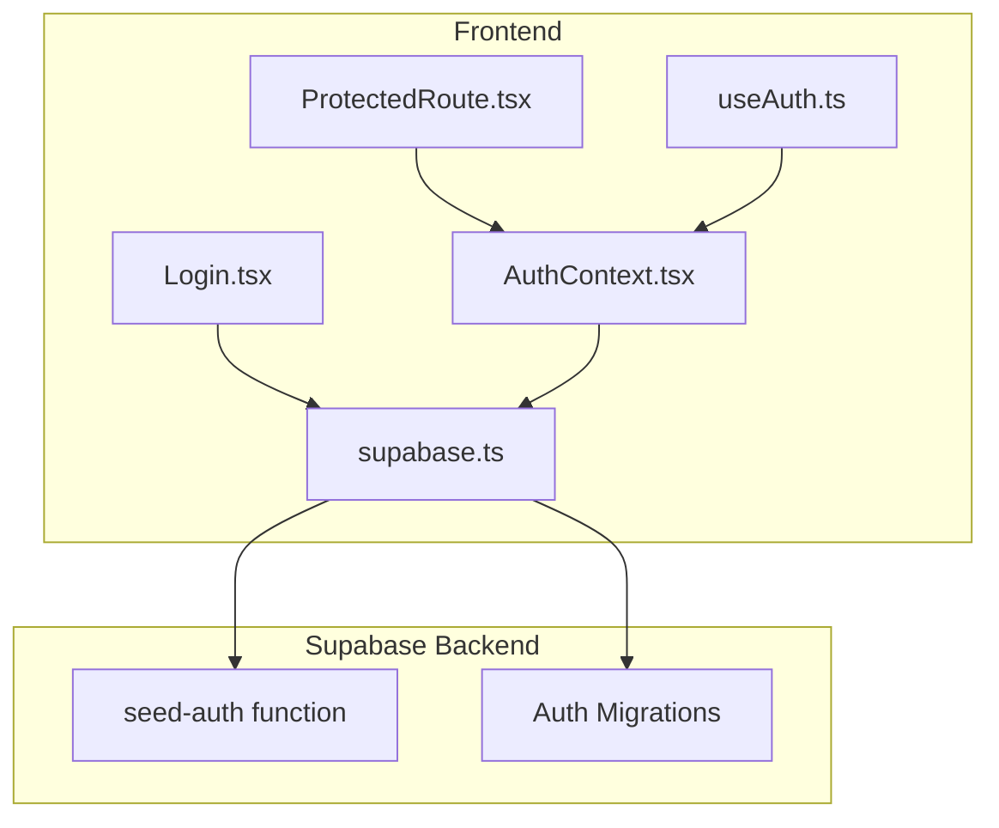
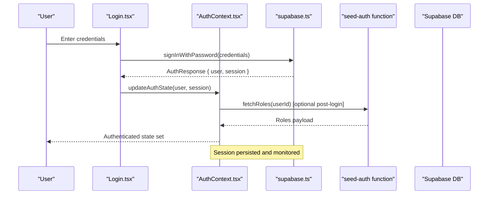
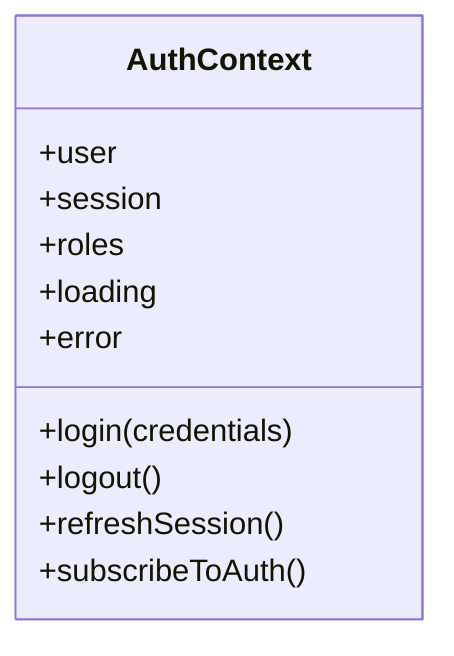
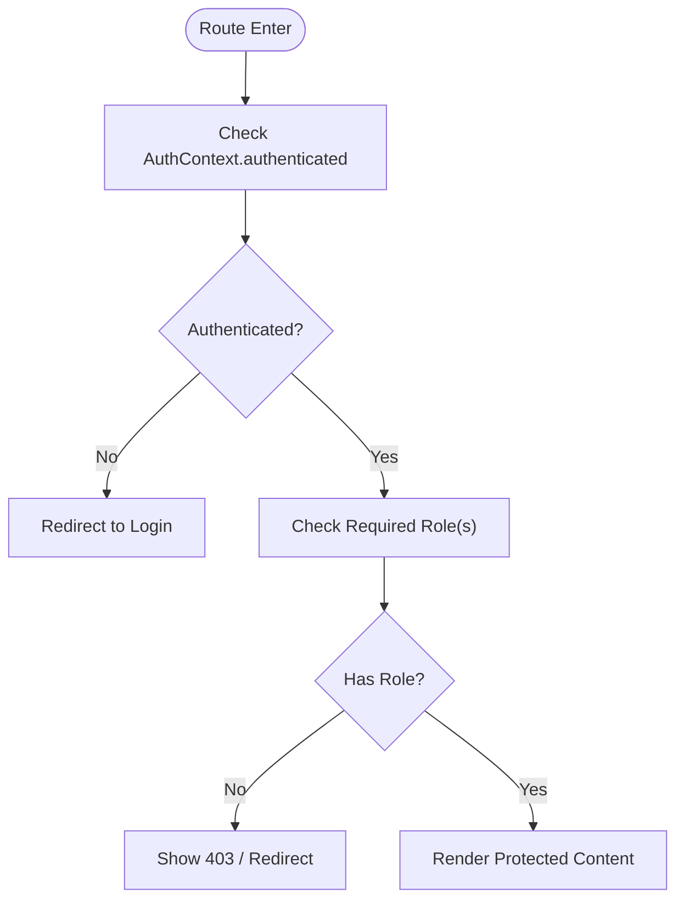
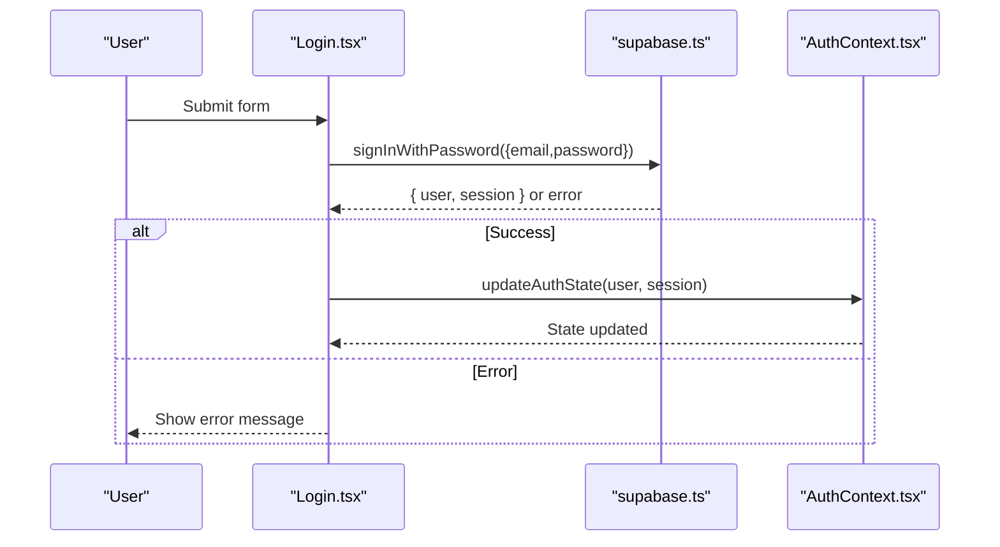
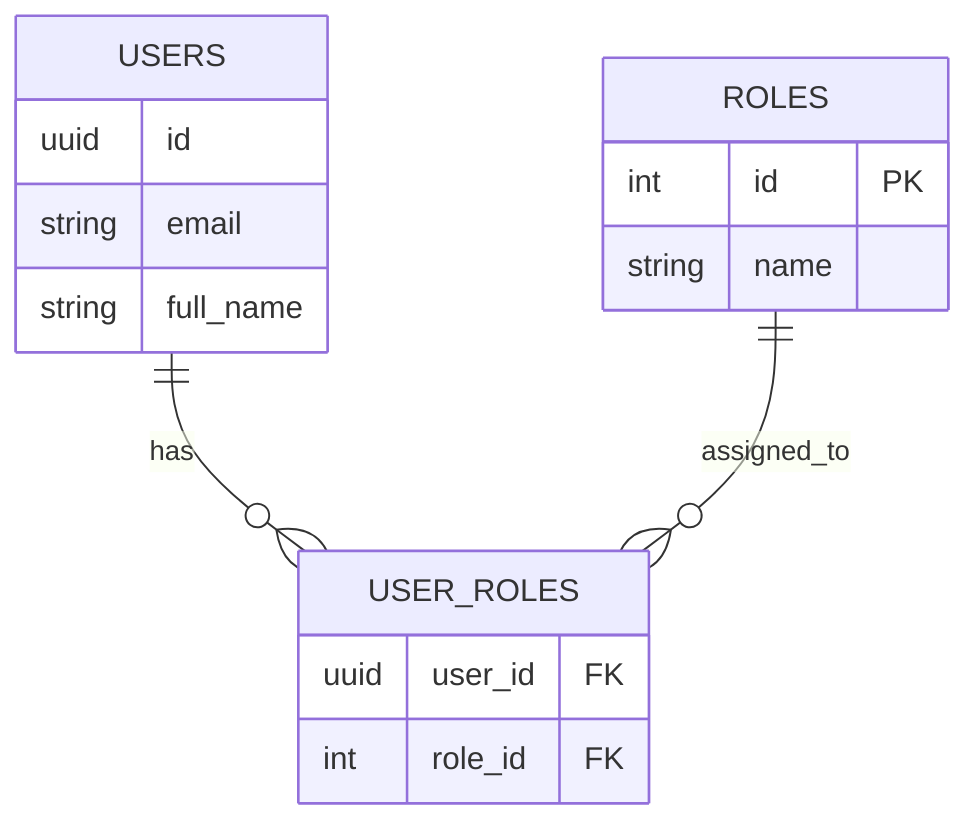
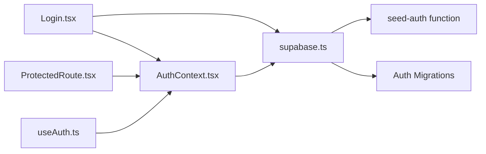

# Authentication & Authorization

<cite>
**Referenced Files in This Document**
- [AuthContext.tsx](file://src/context/AuthContext.tsx)
- [ProtectedRoute.tsx](file://src/components/ProtectedRoute.tsx)
- [Login.tsx](file://src/components/Login.tsx)
- [supabase.ts](file://src/config/supabase.ts)
- [useAuth.ts](file://src/hooks/useAuth.ts)
- [index.ts](file://supabase/functions/seed-auth/index.ts)
- [002_seed_auth.sql](file://supabase/migrations/002_seed_auth.sql)
- [005_cleanup_auth.sql](file://supabase/migrations/005_cleanup_auth.sql)
- [006_fix_rls_recursion.sql](file://supabase/migrations/006_fix_rls_recursion.sql)
- [007_add_attachments_delete_rls.sql](file://supabase/migrations/007_add_attachments_delete_rls.sql)
- [008_remediation.sql](file://supabase/migrations/008_remediation.sql)
- [009_app_settings.sql](file://supabase/migrations/009_app_settings.sql)
</cite>

## Table of Contents
1. [Introduction](#introduction)
2. [Project Structure](#project-structure)
3. [Core Components](#core-components)
4. [Architecture Overview](#architecture-overview)
5. [Detailed Component Analysis](#detailed-component-analysis)
6. [Dependency Analysis](#dependency-analysis)
7. [Performance Considerations](#performance-considerations)
8. [Troubleshooting Guide](#troubleshooting-guide)
9. [Conclusion](#conclusion)

## Introduction
This document explains the authentication and authorization model for AbsensiOnline. It covers the user role system (admin, supervisor, worker), the authentication flow (login, session management, logout), JWT token handling, Supabase authentication integration, route protection via ProtectedRoute, and the AuthContext provider for global state management. It also documents user registration, password reset, session persistence, and security considerations such as token refresh, role-based access control (RBAC), and authentication middleware. Practical examples of role-specific UI rendering and permission checks are included.

## Project Structure
Authentication and authorization logic is primarily implemented in the frontend under src/context, src/components, src/hooks, and src/config, with backend support provided by Supabase functions and migrations.

**Diagram sources**
- [AuthContext.tsx](file://src/context/AuthContext.tsx)
- [ProtectedRoute.tsx](file://src/components/ProtectedRoute.tsx)
- [Login.tsx](file://src/components/Login.tsx)
- [useAuth.ts](file://src/hooks/useAuth.ts)
- [supabase.ts](file://src/config/supabase.ts)
- [index.ts](file://supabase/functions/seed-auth/index.ts)
- [002_seed_auth.sql](file://supabase/migrations/002_seed_auth.sql)

**Section sources**
- [AuthContext.tsx](file://src/context/AuthContext.tsx)
- [ProtectedRoute.tsx](file://src/components/ProtectedRoute.tsx)
- [Login.tsx](file://src/components/Login.tsx)
- [useAuth.ts](file://src/hooks/useAuth.ts)
- [supabase.ts](file://src/config/supabase.ts)
- [index.ts](file://supabase/functions/seed-auth/index.ts)
- [002_seed_auth.sql](file://supabase/migrations/002_seed_auth.sql)

## Core Components
- AuthContext: Provides global authentication state and methods for login, logout, and session updates.
- ProtectedRoute: Guards routes based on authentication and role requirements.
- Login: Handles user login and integrates with Supabase.
- useAuth: Hook to consume AuthContext methods and state.
- Supabase client: Manages authentication client, subscriptions, and session lifecycle.
- Supabase seed-auth function: Initializes roles and seeds initial users.
- Supabase migrations: Define schema, policies, and seeded data for auth.

Key responsibilities:
- Authentication state management and persistence
- Role-based UI rendering and route protection
- Session lifecycle and token refresh
- Integration with Supabase Auth and RLS

**Section sources**
- [AuthContext.tsx](file://src/context/AuthContext.tsx)
- [ProtectedRoute.tsx](file://src/components/ProtectedRoute.tsx)
- [Login.tsx](file://src/components/Login.tsx)
- [useAuth.ts](file://src/hooks/useAuth.ts)
- [supabase.ts](file://src/config/supabase.ts)
- [index.ts](file://supabase/functions/seed-auth/index.ts)
- [002_seed_auth.sql](file://supabase/migrations/002_seed_auth.sql)

## Architecture Overview
The system uses Supabase Auth for identity and JWT tokens, with a React context managing global state. ProtectedRoute enforces RBAC at the routing level, while AuthContext exposes methods for login/logout and session updates. Supabase functions and migrations support seeding roles and enforcing row-level security.

**Diagram sources**
- [Login.tsx](file://src/components/Login.tsx)
- [AuthContext.tsx](file://src/context/AuthContext.tsx)
- [supabase.ts](file://src/config/supabase.ts)
- [index.ts](file://supabase/functions/seed-auth/index.ts)

## Detailed Component Analysis

### AuthContext Provider
AuthContext centralizes authentication state and actions:
- State: user, session, roles, loading, error
- Methods: login, logout, refreshSession, subscribeToAuth
- Persistence: leverages Supabase session storage and emits updates

Implementation highlights:
- Subscribes to Supabase auth state changes and updates context
- Exposes refreshSession to handle token expiry scenarios
- Stores roles after successful login for downstream RBAC decisions

**Diagram sources**
- [AuthContext.tsx](file://src/context/AuthContext.tsx)

**Section sources**
- [AuthContext.tsx](file://src/context/AuthContext.tsx)

### ProtectedRoute Component
ProtectedRoute enforces authentication and role-based access:
- Requires authentication before allowing navigation
- Supports role gates (admin, supervisor, worker)
- Redirects unauthenticated or unauthorized users appropriately

**Diagram sources**
- [ProtectedRoute.tsx](file://src/components/ProtectedRoute.tsx)
- [AuthContext.tsx](file://src/context/AuthContext.tsx)

**Section sources**
- [ProtectedRoute.tsx](file://src/components/ProtectedRoute.tsx)
- [AuthContext.tsx](file://src/context/AuthContext.tsx)

### Login Component
Login integrates with Supabase Auth:
- Captures email/password
- Calls Supabase client to authenticate
- On success, updates AuthContext with user and session
- Handles errors and displays feedback

**Diagram sources**
- [Login.tsx](file://src/components/Login.tsx)
- [supabase.ts](file://src/config/supabase.ts)
- [AuthContext.tsx](file://src/context/AuthContext.tsx)

**Section sources**
- [Login.tsx](file://src/components/Login.tsx)
- [supabase.ts](file://src/config/supabase.ts)
- [AuthContext.tsx](file://src/context/AuthContext.tsx)

### Supabase Authentication Integration
Supabase client configuration:
- Initializes Supabase client and exposes auth helpers
- Subscribes to auth state changes and persists sessions
- Provides methods for sign-in, sign-out, and session refresh

Token handling:
- Uses Supabase-managed session storage
- Emits auth state changes for global synchronization
- Supports automatic refresh via Supabase client

**Section sources**
- [supabase.ts](file://src/config/supabase.ts)

### Role System and RBAC
Roles and permissions:
- Roles: admin, supervisor, worker
- Permissions derived from roles for UI and route gating
- Seed function initializes roles and assigns them to users

Seeding and cleanup:
- Initial roles and users created via migration
- Cleanup removes legacy artifacts and fixes RLS recursion
- Additional migrations refine RLS policies and app settings

**Diagram sources**
- [002_seed_auth.sql](file://supabase/migrations/002_seed_auth.sql)
- [005_cleanup_auth.sql](file://supabase/migrations/005_cleanup_auth.sql)
- [006_fix_rls_recursion.sql](file://supabase/migrations/006_fix_rls_recursion.sql)
- [007_add_attachments_delete_rls.sql](file://supabase/migrations/007_add_attachments_delete_rls.sql)
- [008_remediation.sql](file://supabase/migrations/008_remediation.sql)
- [009_app_settings.sql](file://supabase/migrations/009_app_settings.sql)

**Section sources**
- [index.ts](file://supabase/functions/seed-auth/index.ts)
- [002_seed_auth.sql](file://supabase/migrations/002_seed_auth.sql)
- [005_cleanup_auth.sql](file://supabase/migrations/005_cleanup_auth.sql)
- [006_fix_rls_recursion.sql](file://supabase/migrations/006_fix_rls_recursion.sql)
- [007_add_attachments_delete_rls.sql](file://supabase/migrations/007_add_attachments_delete_rls.sql)
- [008_remediation.sql](file://supabase/migrations/008_remediation.sql)
- [009_app_settings.sql](file://supabase/migrations/009_app_settings.sql)

### User Registration and Password Reset
Registration:
- Implemented via Supabase Auth client
- Creates new user accounts with email confirmation if enabled
- Post-registration, roles can be assigned via seed-auth function

Password reset:
- Uses Supabase Auth password recovery flow
- Sends reset instructions to user’s email
- Completes reset via Supabase client

**Section sources**
- [supabase.ts](file://src/config/supabase.ts)
- [index.ts](file://supabase/functions/seed-auth/index.ts)

### Session Persistence and Token Refresh
Session persistence:
- Supabase manages session storage and emits auth state changes
- AuthContext subscribes to these changes and keeps UI synchronized

Token refresh:
- Supabase client handles automatic token refresh
- AuthContext refreshSession ensures local state remains current during refresh events

**Section sources**
- [supabase.ts](file://src/config/supabase.ts)
- [AuthContext.tsx](file://src/context/AuthContext.tsx)

### Role-Specific UI Rendering and Permission Checks
Examples:
- Admin-only routes and components gated by ProtectedRoute(role=admin)
- Supervisor dashboards rendered conditionally based on roles
- Worker-specific tabs and actions hidden from higher roles
- Permission checks in hooks and components using useAuth

Practical patterns:
- Wrap sensitive pages with ProtectedRoute and specify required roles
- Use role checks in render logic to show/hide UI elements
- Centralize permission logic in useAuth for reuse across components

**Section sources**
- [ProtectedRoute.tsx](file://src/components/ProtectedRoute.tsx)
- [useAuth.ts](file://src/hooks/useAuth.ts)
- [AuthContext.tsx](file://src/context/AuthContext.tsx)

## Dependency Analysis
Authentication depends on:
- Supabase client for auth operations and session lifecycle
- AuthContext for global state and method exposure
- ProtectedRoute for runtime RBAC enforcement
- Supabase functions and migrations for role initialization and policies

**Diagram sources**
- [Login.tsx](file://src/components/Login.tsx)
- [AuthContext.tsx](file://src/context/AuthContext.tsx)
- [ProtectedRoute.tsx](file://src/components/ProtectedRoute.tsx)
- [useAuth.ts](file://src/hooks/useAuth.ts)
- [supabase.ts](file://src/config/supabase.ts)
- [index.ts](file://supabase/functions/seed-auth/index.ts)
- [002_seed_auth.sql](file://supabase/migrations/002_seed_auth.sql)

**Section sources**
- [Login.tsx](file://src/components/Login.tsx)
- [AuthContext.tsx](file://src/context/AuthContext.tsx)
- [ProtectedRoute.tsx](file://src/components/ProtectedRoute.tsx)
- [useAuth.ts](file://src/hooks/useAuth.ts)
- [supabase.ts](file://src/config/supabase.ts)
- [index.ts](file://supabase/functions/seed-auth/index.ts)
- [002_seed_auth.sql](file://supabase/migrations/002_seed_auth.sql)

## Performance Considerations
- Minimize re-renders by memoizing AuthContext consumers and role checks
- Debounce frequent auth state updates if needed
- Cache roles locally after first fetch to reduce network calls
- Use lazy loading for protected routes to defer heavy components until authorized

## Troubleshooting Guide
Common issues and resolutions:
- Stuck on login: Verify Supabase client initialization and network connectivity
- Unauthorized redirects: Ensure ProtectedRoute receives correct role props and AuthContext state is initialized
- Role not applied: Confirm seed-auth function executed and roles stored in user_roles
- Session not persisting: Check browser storage availability and Supabase auth state subscription
- RLS policy conflicts: Review migration-defined policies and remediation steps

**Section sources**
- [supabase.ts](file://src/config/supabase.ts)
- [AuthContext.tsx](file://src/context/AuthContext.tsx)
- [ProtectedRoute.tsx](file://src/components/ProtectedRoute.tsx)
- [index.ts](file://supabase/functions/seed-auth/index.ts)
- [006_fix_rls_recursion.sql](file://supabase/migrations/006_fix_rls_recursion.sql)
- [008_remediation.sql](file://supabase/migrations/008_remediation.sql)

## Conclusion
AbsensiOnline implements a robust authentication and authorization system centered on Supabase Auth and a React context provider. Users authenticate via email/password, receive JWT sessions managed by Supabase, and gain access based on roles enforced at the route and component levels. Supabase functions and migrations seed roles and enforce RLS policies. The system supports registration, password reset, persistent sessions, and secure RBAC across the application.