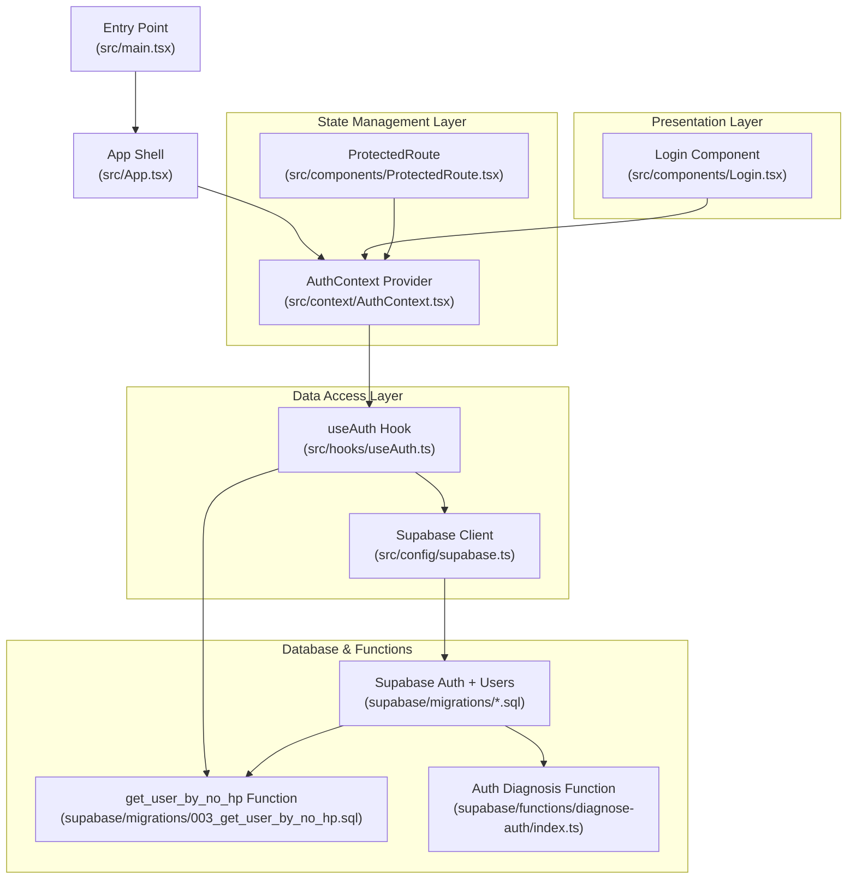
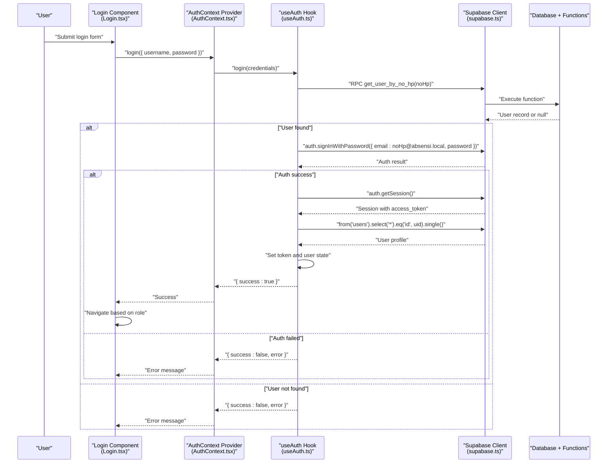
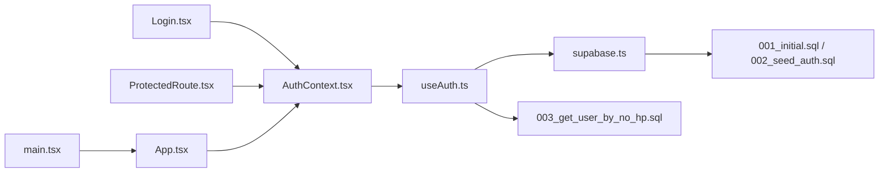

# Authentication Flow

<cite>
**Referenced Files in This Document**
- [Login.tsx](file://src/components/Login.tsx)
- [AuthContext.tsx](file://src/context/AuthContext.tsx)
- [useAuth.ts](file://src/hooks/useAuth.ts)
- [supabase.ts](file://src/config/supabase.ts)
- [App.tsx](file://src/App.tsx)
- [main.tsx](file://src/main.tsx)
- [ProtectedRoute.tsx](file://src/components/ProtectedRoute.tsx)
- [index.ts](file://src/types/index.ts)
- [003_get_user_by_no_hp.sql](file://supabase/migrations/003_get_user_by_no_hp.sql)
- [002_seed_auth.sql](file://supabase/migrations/002_seed_auth.sql)
- [001_initial.sql](file://supabase/migrations/001_initial.sql)
- [index.ts](file://supabase/functions/diagnose-auth/index.ts)
</cite>

## Table of Contents
1. [Introduction](#introduction)
2. [Project Structure](#project-structure)
3. [Core Components](#core-components)
4. [Architecture Overview](#architecture-overview)
5. [Detailed Component Analysis](#detailed-component-analysis)
6. [Dependency Analysis](#dependency-analysis)
7. [Performance Considerations](#performance-considerations)
8. [Troubleshooting Guide](#troubleshooting-guide)
9. [Conclusion](#conclusion)

## Introduction
This document explains the complete authentication flow in AbsensiOnline, from user input validation through Supabase authentication integration to successful session establishment. It covers the login form implementation, credential validation, error handling, user feedback mechanisms, Supabase integration (including JWT token acquisition and verification), authentication state management via the AuthContext provider, automatic login detection, and authentication callbacks. Practical examples of login error scenarios, timeout handling, and authentication failure recovery are included, along with the relationship between the Login component, useAuth hook, and AuthContext provider.

## Project Structure
The authentication system is organized around three primary layers:
- Presentation Layer: Login component renders the form and handles user interactions.
- State Management Layer: AuthContext provider exposes authentication state and actions to the app.
- Data Access Layer: useAuth hook encapsulates Supabase integration, session hydration, and user profile retrieval.

**Diagram sources**
- [Login.tsx:1-119](file://src/components/Login.tsx#L1-L119)
- [AuthContext.tsx:1-43](file://src/context/AuthContext.tsx#L1-L43)
- [useAuth.ts:1-115](file://src/hooks/useAuth.ts#L1-L115)
- [supabase.ts:1-7](file://src/config/supabase.ts#L1-L7)
- [App.tsx:1-58](file://src/App.tsx#L1-L58)
- [main.tsx:1-15](file://src/main.tsx#L1-L15)
- [ProtectedRoute.tsx:1-32](file://src/components/ProtectedRoute.tsx#L1-L32)
- [003_get_user_by_no_hp.sql:1-31](file://supabase/migrations/003_get_user_by_no_hp.sql#L1-L31)
- [002_seed_auth.sql:1-29](file://supabase/migrations/002_seed_auth.sql#L1-L29)
- [001_initial.sql:1-303](file://supabase/migrations/001_initial.sql#L1-L303)
- [index.ts:1-74](file://supabase/functions/diagnose-auth/index.ts#L1-L74)

**Section sources**
- [App.tsx:20-57](file://src/App.tsx#L20-L57)
- [main.tsx:8-14](file://src/main.tsx#L8-L14)

## Core Components
- Login component: Renders the login form, validates input, triggers authentication, displays errors, and navigates after successful login.
- AuthContext provider: Exposes authentication state and actions (login, logout) to the app.
- useAuth hook: Manages session hydration, listens to Supabase auth state changes, performs login, and retrieves user profiles.
- Supabase client: Provides access to Supabase authentication and database services.
- ProtectedRoute: Guards routes based on authentication and role.

**Section sources**
- [Login.tsx:6-33](file://src/components/Login.tsx#L6-L33)
- [AuthContext.tsx:18-36](file://src/context/AuthContext.tsx#L18-L36)
- [useAuth.ts:29-114](file://src/hooks/useAuth.ts#L29-L114)
- [supabase.ts:3-6](file://src/config/supabase.ts#L3-L6)
- [ProtectedRoute.tsx:9-31](file://src/components/ProtectedRoute.tsx#L9-L31)

## Architecture Overview
The authentication flow integrates the UI, state management, and Supabase backend as follows:
- The Login component collects credentials and delegates authentication to the AuthContext provider.
- The provider uses the useAuth hook to call Supabase authentication APIs.
- On successful sign-in, the hook hydrates the session, fetches the user profile, and updates global state.
- ProtectedRoute enforces authentication and role-based access during navigation.

**Diagram sources**
- [Login.tsx:21-33](file://src/components/Login.tsx#L21-L33)
- [AuthContext.tsx:18-36](file://src/context/AuthContext.tsx#L18-L36)
- [useAuth.ts:58-96](file://src/hooks/useAuth.ts#L58-L96)
- [supabase.ts:3-6](file://src/config/supabase.ts#L3-L6)
- [003_get_user_by_no_hp.sql:6-30](file://supabase/migrations/003_get_user_by_no_hp.sql#L6-L30)

## Detailed Component Analysis

### Login Component
Responsibilities:
- Render the login form with phone number and PIN fields.
- Validate that both fields are present before submission.
- Trigger authentication via the AuthContext provider.
- Display user-friendly error messages.
- Navigate to appropriate route after successful login based on user role.

Key behaviors:
- Form submission prevents default, validates inputs, sets loading state, calls login, and handles errors.
- Uses Lucide icons for visual cues.
- Navigates to admin dashboard for admin roles and to the app home for workers.

Practical examples:
- Empty fields: Error message indicates missing input.
- Non-existent phone number: Error indicates unregistered or inactive number.
- Incorrect PIN: Error indicates wrong PIN.
- Successful login: Automatic navigation based on role.

**Section sources**
- [Login.tsx:6-33](file://src/components/Login.tsx#L6-L33)
- [Login.tsx:35-117](file://src/components/Login.tsx#L35-L117)

### AuthContext Provider
Responsibilities:
- Wraps the app with authentication context.
- Exposes user, token, isAuthenticated, loading, login, and logout functions.
- Delegates authentication logic to the useAuth hook.

Integration:
- Consumed by Login and ProtectedRoute components.
- Ensures useAuth is used within provider boundaries.

**Section sources**
- [AuthContext.tsx:18-36](file://src/context/AuthContext.tsx#L18-L36)
- [AuthContext.tsx:38-42](file://src/context/AuthContext.tsx#L38-L42)

### useAuth Hook
Responsibilities:
- Hydrate session on mount by fetching current session and user profile.
- Subscribe to Supabase auth state changes to keep state synchronized.
- Implement login flow: lookup user by phone number, construct email, authenticate, and finalize session.
- Implement logout by signing out and clearing local storage.

Login flow internals:
- Lookup user by phone number using a secure function bypassing RLS.
- Construct email from phone number with a local domain.
- Authenticate with Supabase password auth.
- Retrieve session and hydrate user profile.
- Update token and user state.

Session hydration and callbacks:
- Initializes loading state and fetches initial session.
- Subscribes to auth state change events to update token and user.
- Unsubscribes on cleanup.

Logout behavior:
- Signs out from Supabase.
- Clears token and user state.
- Removes app-specific local storage entries.

**Section sources**
- [useAuth.ts:29-56](file://src/hooks/useAuth.ts#L29-L56)
- [useAuth.ts:58-96](file://src/hooks/useAuth.ts#L58-L96)
- [useAuth.ts:98-104](file://src/hooks/useAuth.ts#L98-L104)

### Supabase Integration
Client initialization:
- Creates Supabase client using environment variables for URL and anonymous key.

Authentication services:
- Uses RPC function to securely lookup users by phone number.
- Uses password-based authentication with constructed email.
- Retrieves session and verifies access token presence.

Database schema and policies:
- Users table stores personal info and role.
- Row-level security policies restrict access based on role.
- Seed data includes admin and worker accounts with predefined PINs.

**Section sources**
- [supabase.ts:3-6](file://src/config/supabase.ts#L3-L6)
- [003_get_user_by_no_hp.sql:6-30](file://supabase/migrations/003_get_user_by_no_hp.sql#L6-L30)
- [002_seed_auth.sql:1-29](file://supabase/migrations/002_seed_auth.sql#L1-L29)
- [001_initial.sql:46-67](file://supabase/migrations/001_initial.sql#L46-L67)

### ProtectedRoute Component
Responsibilities:
- Guard routes based on authentication status and role.
- Show loading spinner while authentication state is resolving.
- Redirect unauthenticated users to login.
- Enforce admin-only access when required.

**Section sources**
- [ProtectedRoute.tsx:9-31](file://src/components/ProtectedRoute.tsx#L9-L31)

### Authentication State Model
The authentication state consists of:
- user: hydrated user profile or null.
- token: access token from Supabase session or null.
- isAuthenticated: boolean derived from token and user presence.
- loading: indicates whether initial session hydration is in progress.

**Section sources**
- [index.ts:131-135](file://src/types/index.ts#L131-L135)
- [useAuth.ts:106-113](file://src/hooks/useAuth.ts#L106-L113)

## Dependency Analysis
The authentication pipeline exhibits clean separation of concerns:
- Login depends on AuthContext for authentication actions.
- AuthContext depends on useAuth for state management.
- useAuth depends on Supabase client and database functions.
- ProtectedRoute depends on AuthContext for guards.
- App and main bootstrap the provider and routing.

**Diagram sources**
- [Login.tsx:7](file://src/components/Login.tsx#L7)
- [AuthContext.tsx:19](file://src/context/AuthContext.tsx#L19)
- [useAuth.ts:3](file://src/hooks/useAuth.ts#L3)
- [supabase.ts:3-6](file://src/config/supabase.ts#L3-L6)
- [003_get_user_by_no_hp.sql:6-30](file://supabase/migrations/003_get_user_by_no_hp.sql#L6-L30)
- [001_initial.sql:46-67](file://supabase/migrations/001_initial.sql#L46-L67)
- [002_seed_auth.sql:1-29](file://supabase/migrations/002_seed_auth.sql#L1-L29)
- [ProtectedRoute.tsx:10](file://src/components/ProtectedRoute.tsx#L10)
- [App.tsx:23](file://src/App.tsx#L23)
- [main.tsx:10-12](file://src/main.tsx#L10-L12)

**Section sources**
- [App.tsx:20-57](file://src/App.tsx#L20-L57)
- [main.tsx:8-14](file://src/main.tsx#L8-L14)

## Performance Considerations
- Session hydration occurs once on mount and via auth state subscriptions, minimizing redundant network calls.
- Local state updates are batched to avoid unnecessary re-renders.
- Navigation is deferred until authentication state is confirmed to prevent race conditions.
- Using a dedicated RPC function for user lookup avoids broad scans and respects RLS.

## Troubleshooting Guide
Common error scenarios and recovery steps:
- Empty input fields: Prompt user to fill both phone number and PIN.
- Unregistered or inactive phone number: Inform user that the number is not found or active.
- Wrong PIN: Indicate incorrect password and allow retry.
- Network/server errors: Display generic connectivity error and suggest retry.
- Session retrieval failures: Log and guide user to re-authenticate.
- Role-based access violations: Redirect appropriately based on user role.

Diagnostic aids:
- Auth diagnosis function checks mismatches between auth users and public users, helping identify synchronization issues.
- Database seed data provides known-good credentials for testing.

**Section sources**
- [Login.tsx:23-31](file://src/components/Login.tsx#L23-L31)
- [useAuth.ts:66-88](file://src/hooks/useAuth.ts#L66-L88)
- [index.ts:20-54](file://supabase/functions/diagnose-auth/index.ts#L20-L54)
- [002_seed_auth.sql:5-28](file://supabase/migrations/002_seed_auth.sql#L5-L28)

## Conclusion
AbsensiOnline’s authentication flow combines a user-friendly login interface with robust Supabase integration. The Login component delegates to AuthContext, which relies on useAuth to manage sessions, hydrate user profiles, and enforce access controls via ProtectedRoute. The system leverages a secure RPC function for user lookup, password-based authentication, and reactive auth state subscriptions to maintain a seamless and reliable user experience.