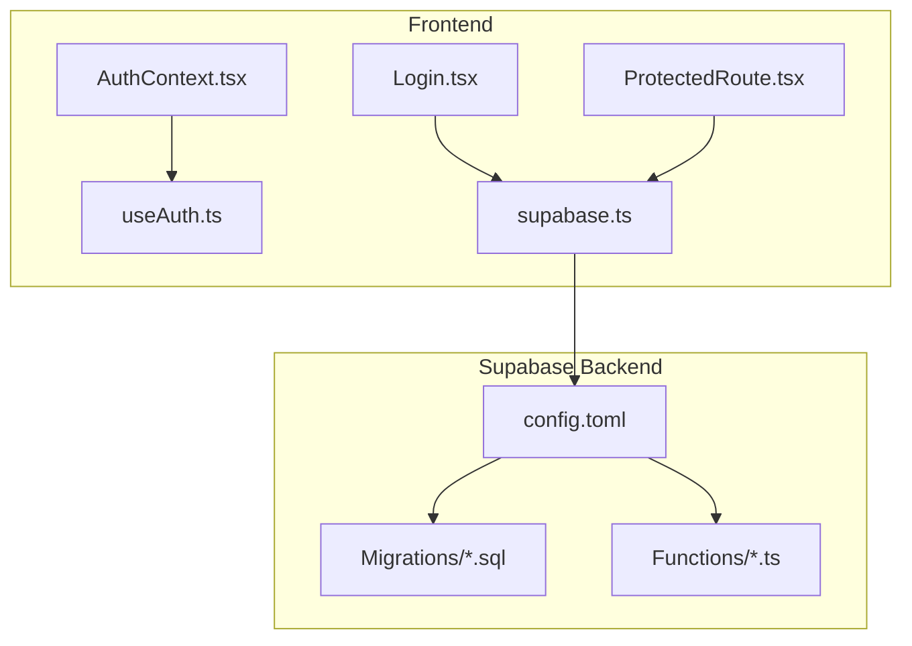
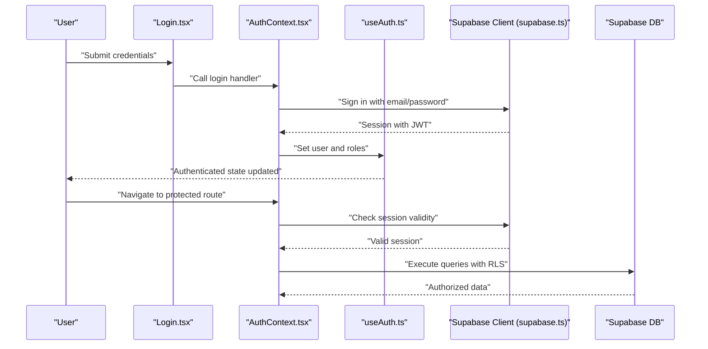
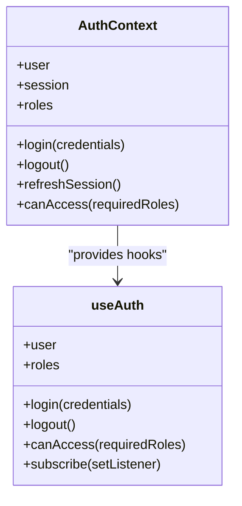
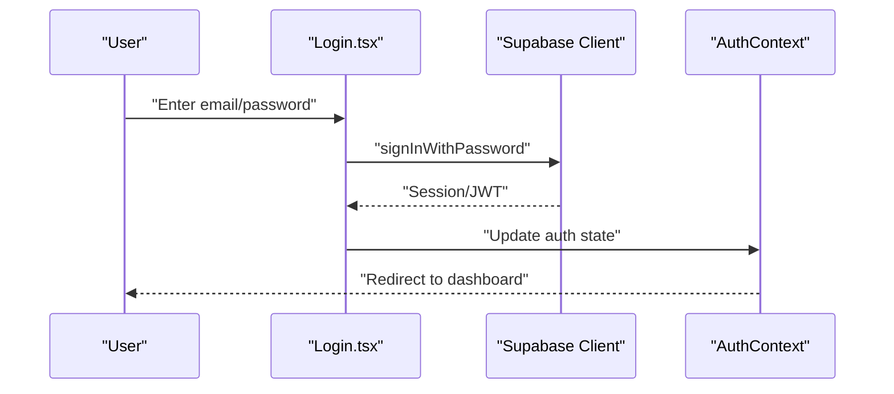
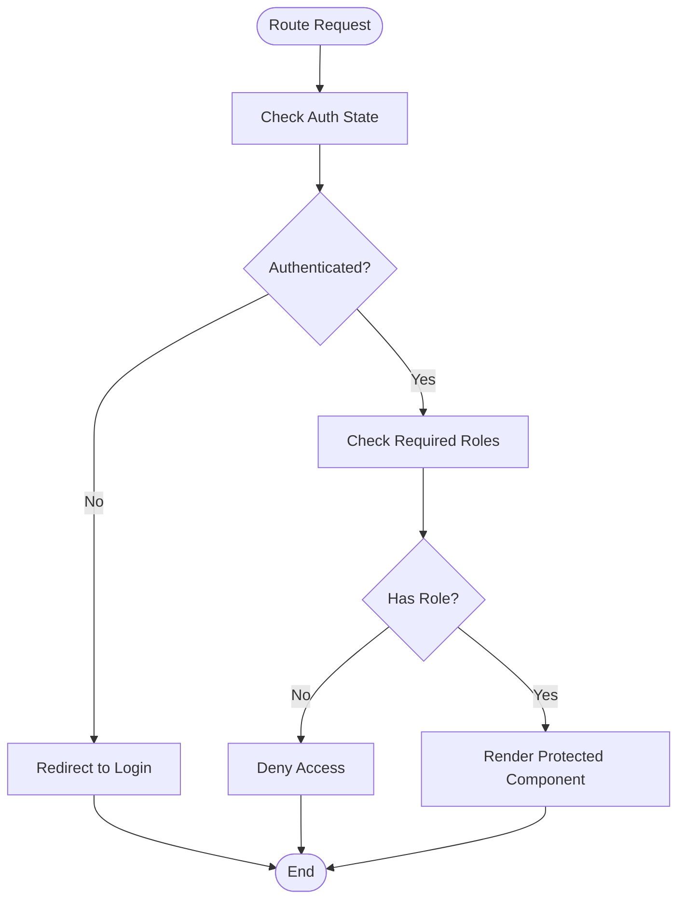
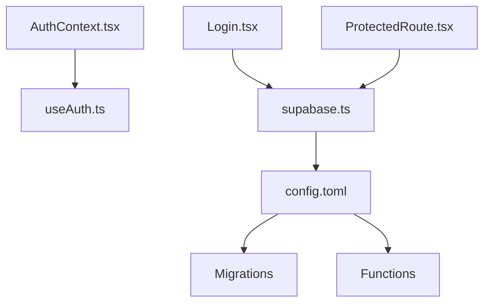

# Security Implementation

<cite>
**Referenced Files in This Document**
- [AuthContext.tsx](file://src/context/AuthContext.tsx)
- [useAuth.ts](file://src/hooks/useAuth.ts)
- [Login.tsx](file://src/components/Login.tsx)
- [ProtectedRoute.tsx](file://src/components/ProtectedRoute.tsx)
- [supabase.ts](file://src/config/supabase.ts)
- [index.ts](file://supabase/functions/admin-user/index.ts)
- [diagnose-auth/index.ts](file://supabase/functions/diagnose-auth/index.ts)
- [seed-auth/index.ts](file://supabase/functions/seed-auth/index.ts)
- [test-zone-update/index.ts](file://supabase/functions/test-zone-update/index.ts)
- [001_initial.sql](file://supabase/migrations/001_initial.sql)
- [002_seed_auth.sql](file://supabase/migrations/002_seed_auth.sql)
- [005_cleanup_auth.sql](file://supabase/migrations/005_cleanup_auth.sql)
- [006_fix_rls_recursion.sql](file://supabase/migrations/006_fix_rls_recursion.sql)
- [007_add_attachments_delete_rls.sql](file://supabase/migrations/007_add_attachments_delete_rls.sql)
- [008_remediation.sql](file://supabase/migrations/008_remediation.sql)
- [009_app_settings.sql](file://supabase/migrations/009_app_settings.sql)
- [config.toml](file://supabase/config.toml)
- [cloudinary-delete/index.ts](file://supabase/functions/cloudinary-delete/index.ts)
- [REMEDiation_DESIGN.md](file://REMEDIATION_DESIGN.md)
- [REMEDIATION_SPEC.md](file://REMEDIATION_SPEC.md)
- [REMEDIATION_TASKS.md](file://REMEDIATION_TASKS.md)
</cite>

## Table of Contents
1. [Introduction](#introduction)
2. [Project Structure](#project-structure)
3. [Core Components](#core-components)
4. [Architecture Overview](#architecture-overview)
5. [Detailed Component Analysis](#detailed-component-analysis)
6. [Dependency Analysis](#dependency-analysis)
7. [Performance Considerations](#performance-considerations)
8. [Troubleshooting Guide](#troubleshooting-guide)
9. [Conclusion](#conclusion)
10. [Appendices](#appendices)

## Introduction
This document provides comprehensive security documentation for the AbsensiOnline authentication and authorization system. It covers JWT token security, role-based access control (RBAC), Supabase Row Level Security (RLS) policies, authentication middleware, secure session handling, credential protection, token storage, transmission security, authentication bypass prevention, session fixation protection, secure logout procedures, practical security validation examples, access control checks, security audit trails, remediation measures for vulnerabilities, and ongoing security monitoring approaches.

## Project Structure
The security-critical parts of the application are organized across React frontend components and hooks, Supabase backend configuration, database migrations, and serverless functions. The frontend handles authentication state, protected routing, and user interactions, while Supabase manages identity, RLS policies, and secure function execution.

**Diagram sources**
- [AuthContext.tsx](file://src/context/AuthContext.tsx)
- [useAuth.ts](file://src/hooks/useAuth.ts)
- [Login.tsx](file://src/components/Login.tsx)
- [ProtectedRoute.tsx](file://src/components/ProtectedRoute.tsx)
- [supabase.ts](file://src/config/supabase.ts)
- [config.toml](file://supabase/config.toml)

**Section sources**
- [AuthContext.tsx](file://src/context/AuthContext.tsx)
- [useAuth.ts](file://src/hooks/useAuth.ts)
- [Login.tsx](file://src/components/Login.tsx)
- [ProtectedRoute.tsx](file://src/components/ProtectedRoute.tsx)
- [supabase.ts](file://src/config/supabase.ts)
- [config.toml](file://supabase/config.toml)

## Core Components
- Authentication Context and Hooks: Centralized state management for authentication, including user session, roles, and access control helpers.
- Login Component: Handles user credentials submission and initiates authentication against Supabase.
- Protected Route: Enforces RBAC and ensures only authorized users can access protected pages.
- Supabase Client: Provides secure client-side access to Supabase services and enforces RLS at the database level.
- Supabase Functions: Serverless functions for administrative tasks, diagnostics, seeding, and zone updates.
- Database Migrations: Define initial schema, seed data, cleanup, recursion fixes, RLS policies, remediations, and app settings.

Key security responsibilities:
- JWT token lifecycle management and refresh handling
- Role-based authorization checks
- Secure session handling and logout
- Data isolation via RLS policies
- Audit-ready function logs and diagnostics

**Section sources**
- [AuthContext.tsx](file://src/context/AuthContext.tsx)
- [useAuth.ts](file://src/hooks/useAuth.ts)
- [Login.tsx](file://src/components/Login.tsx)
- [ProtectedRoute.tsx](file://src/components/ProtectedRoute.tsx)
- [supabase.ts](file://src/config/supabase.ts)
- [index.ts](file://supabase/functions/admin-user/index.ts)
- [diagnose-auth/index.ts](file://supabase/functions/diagnose-auth/index.ts)
- [seed-auth/index.ts](file://supabase/functions/seed-auth/index.ts)
- [test-zone-update/index.ts](file://supabase/functions/test-zone-update/index.ts)
- [001_initial.sql](file://supabase/migrations/001_initial.sql)
- [002_seed_auth.sql](file://supabase/migrations/002_seed_auth.sql)
- [005_cleanup_auth.sql](file://supabase/migrations/005_cleanup_auth.sql)
- [006_fix_rls_recursion.sql](file://supabase/migrations/006_fix_rls_recursion.sql)
- [007_add_attachments_delete_rls.sql](file://supabase/migrations/007_add_attachments_delete_rls.sql)
- [008_remediation.sql](file://supabase/migrations/008_remediation.sql)
- [009_app_settings.sql](file://supabase/migrations/009_app_settings.sql)

## Architecture Overview
The system integrates a React SPA with Supabase for authentication and data access. Authentication state is managed client-side, while Supabase enforces RLS and provides secure function execution. Access control is enforced both at the application layer (React) and the database layer (RLS).

**Diagram sources**
- [Login.tsx](file://src/components/Login.tsx)
- [AuthContext.tsx](file://src/context/AuthContext.tsx)
- [useAuth.ts](file://src/hooks/useAuth.ts)
- [supabase.ts](file://src/config/supabase.ts)

## Detailed Component Analysis

### Authentication Context and Hooks
Responsibilities:
- Manage authentication state and user profile
- Provide role-based access helpers
- Coordinate sign-in, sign-out, and session refresh
- Integrate with Supabase client for secure operations

Security considerations:
- Centralized state prevents inconsistent access control across components
- Role checks are performed locally after validating session
- Session refresh is handled securely via Supabase client

**Diagram sources**
- [AuthContext.tsx](file://src/context/AuthContext.tsx)
- [useAuth.ts](file://src/hooks/useAuth.ts)

**Section sources**
- [AuthContext.tsx](file://src/context/AuthContext.tsx)
- [useAuth.ts](file://src/hooks/useAuth.ts)

### Login Component
Responsibilities:
- Capture user credentials
- Invoke authentication flow
- Handle errors and show feedback

Security considerations:
- Submits credentials to Supabase for verification
- Uses HTTPS for transmission
- Avoids logging sensitive data

**Diagram sources**
- [Login.tsx](file://src/components/Login.tsx)
- [supabase.ts](file://src/config/supabase.ts)
- [AuthContext.tsx](file://src/context/AuthContext.tsx)

**Section sources**
- [Login.tsx](file://src/components/Login.tsx)
- [supabase.ts](file://src/config/supabase.ts)
- [AuthContext.tsx](file://src/context/AuthContext.tsx)

### Protected Route
Responsibilities:
- Guard routes based on user roles
- Redirect unauthenticated or unauthorized users
- Enforce RBAC before rendering protected components

Security considerations:
- Validates session and roles before allowing navigation
- Prevents direct URL access to protected areas

**Diagram sources**
- [ProtectedRoute.tsx](file://src/components/ProtectedRoute.tsx)
- [AuthContext.tsx](file://src/context/AuthContext.tsx)
- [useAuth.ts](file://src/hooks/useAuth.ts)

**Section sources**
- [ProtectedRoute.tsx](file://src/components/ProtectedRoute.tsx)
- [AuthContext.tsx](file://src/context/AuthContext.tsx)
- [useAuth.ts](file://src/hooks/useAuth.ts)

### Supabase Client Configuration
Responsibilities:
- Initialize Supabase client with project URL and anonymous key
- Provide authenticated and unauthenticated clients
- Enable RLS and realtime subscriptions

Security considerations:
- Uses secure HTTPS endpoints
- Enables RLS to enforce row-level policies
- Manages service role tokens for privileged operations

**Section sources**
- [supabase.ts](file://src/config/supabase.ts)
- [config.toml](file://supabase/config.toml)

### Supabase Functions
Administrative and diagnostic functions:
- admin-user: Administrative operations for users
- diagnose-auth: Authentication diagnostics and health checks
- seed-auth: Initial authentication data seeding
- test-zone-update: Zone update testing
- cloudinary-delete: Cloudinary asset deletion

Security considerations:
- Runs under Supabase service role with least privilege
- Logs activities for audit trails
- Validates inputs and limits scope of operations

**Section sources**
- [index.ts](file://supabase/functions/admin-user/index.ts)
- [diagnose-auth/index.ts](file://supabase/functions/diagnose-auth/index.ts)
- [seed-auth/index.ts](file://supabase/functions/seed-auth/index.ts)
- [test-zone-update/index.ts](file://supabase/functions/test-zone-update/index.ts)
- [cloudinary-delete/index.ts](file://supabase/functions/cloudinary-delete/index.ts)

### Database Migrations and RLS Policies
Initial schema and policies:
- 001_initial.sql: Creates tables and sets up basic RLS
- 002_seed_auth.sql: Seeds authentication data
- 005_cleanup_auth.sql: Cleans up legacy auth artifacts
- 006_fix_rls_recursion.sql: Fixes recursive RLS issues
- 007_add_attachments_delete_rls.sql: Adds delete RLS policy for attachments
- 008_remediation.sql: Applies remediation patches
- 009_app_settings.sql: Adds app settings table

Security considerations:
- RLS policies isolate data per user or role
- Remediation migrations address known vulnerabilities
- App settings are controlled via RLS and admin functions

**Section sources**
- [001_initial.sql](file://supabase/migrations/001_initial.sql)
- [002_seed_auth.sql](file://supabase/migrations/002_seed_auth.sql)
- [005_cleanup_auth.sql](file://supabase/migrations/005_cleanup_auth.sql)
- [006_fix_rls_recursion.sql](file://supabase/migrations/006_fix_rls_recursion.sql)
- [007_add_attachments_delete_rls.sql](file://supabase/migrations/007_add_attachments_delete_rls.sql)
- [008_remediation.sql](file://supabase/migrations/008_remediation.sql)
- [009_app_settings.sql](file://supabase/migrations/009_app_settings.sql)

## Dependency Analysis
The frontend depends on Supabase for authentication and data access. Supabase enforces RLS and executes serverless functions. Migrations define the schema and policies.

**Diagram sources**
- [AuthContext.tsx](file://src/context/AuthContext.tsx)
- [useAuth.ts](file://src/hooks/useAuth.ts)
- [Login.tsx](file://src/components/Login.tsx)
- [ProtectedRoute.tsx](file://src/components/ProtectedRoute.tsx)
- [supabase.ts](file://src/config/supabase.ts)
- [config.toml](file://supabase/config.toml)

**Section sources**
- [AuthContext.tsx](file://src/context/AuthContext.tsx)
- [useAuth.ts](file://src/hooks/useAuth.ts)
- [Login.tsx](file://src/components/Login.tsx)
- [ProtectedRoute.tsx](file://src/components/ProtectedRoute.tsx)
- [supabase.ts](file://src/config/supabase.ts)
- [config.toml](file://supabase/config.toml)

## Performance Considerations
- Minimize unnecessary re-renders by using stable references in AuthContext
- Cache frequently accessed user roles and permissions
- Use Supabase realtime subscriptions judiciously to avoid bandwidth waste
- Optimize RLS queries to reduce database load

## Troubleshooting Guide
Common issues and resolutions:
- Authentication failures: Verify credentials and network connectivity; check Supabase logs
- Authorization errors: Confirm user roles and RLS policies; review ProtectedRoute checks
- Session invalidation: Ensure proper logout and session refresh flows
- Function errors: Review function logs and validate inputs

Practical checks:
- Use diagnose-auth function to validate authentication state
- Inspect RLS policies for correctness
- Monitor Supabase logs for anomalies

**Section sources**
- [diagnose-auth/index.ts](file://supabase/functions/diagnose-auth/index.ts)
- [006_fix_rls_recursion.sql](file://supabase/migrations/006_fix_rls_recursion.sql)
- [008_remediation.sql](file://supabase/migrations/008_remediation.sql)

## Conclusion
AbsensiOnline implements a layered security model combining client-side RBAC, JWT-based sessions, and robust Supabase RLS policies. The system enforces strict access controls, protects user credentials, and provides secure session handling with logout capabilities. Ongoing remediation efforts and function-based diagnostics support continuous security improvements.

## Appendices

### Security Validation Examples
- Access control checks: Use role-based helpers to validate permissions before rendering sensitive UI or invoking privileged actions.
- Token validation: Ensure JWTs are present and valid before allowing protected operations.
- Session fixation protection: Clear sessions on logout and enforce fresh session creation on login.
- Secure logout: Invalidate current session and clear local state.

### Security Audit Trails
- Function logs: Enable and monitor function execution logs for administrative and diagnostic functions.
- RLS audit: Track policy violations and access attempts via database logs.
- Authentication logs: Monitor failed login attempts and suspicious activities.

### Remediation Measures and Monitoring
- Remediation design and specification documents outline vulnerability fixes and security hardening steps.
- Continuous monitoring includes periodic RLS audits, function log reviews, and authentication diagnostics.

**Section sources**
- [REMEDIATION_DESIGN.md](file://REMEDIATION_DESIGN.md)
- [REMEDIATION_SPEC.md](file://REMEDIATION_SPEC.md)
- [REMEDIATION_TASKS.md](file://REMEDIATION_TASKS.md)