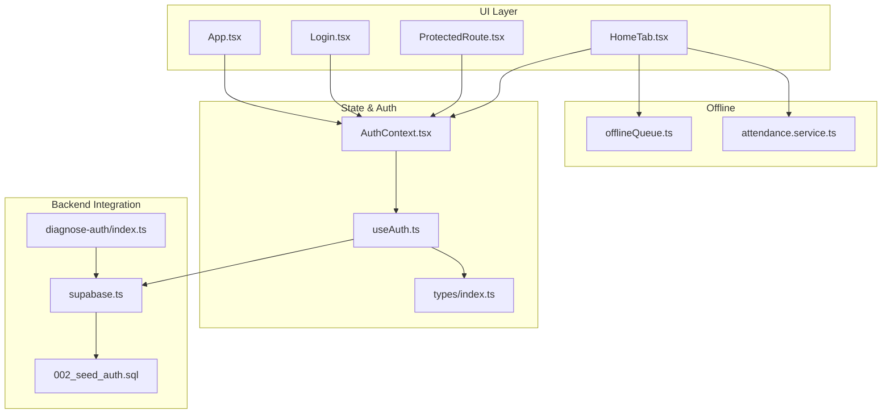
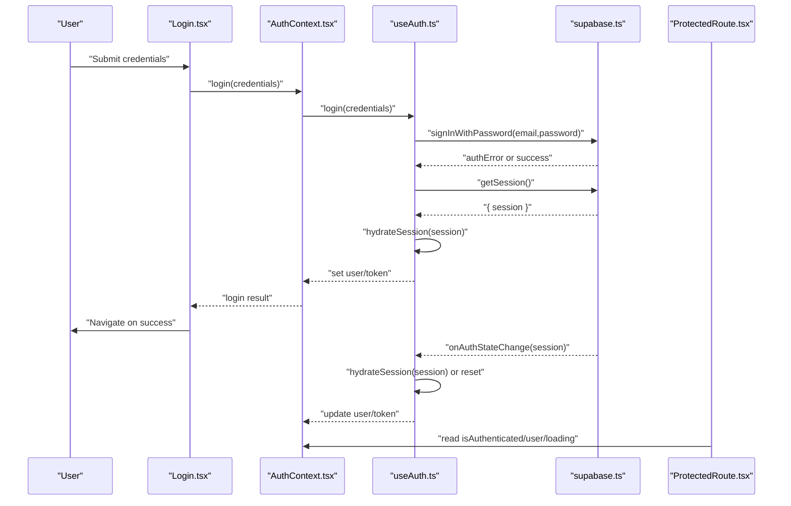
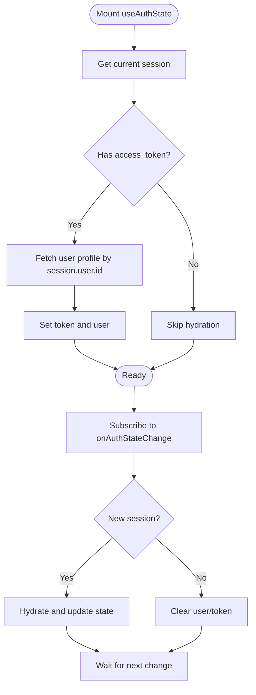
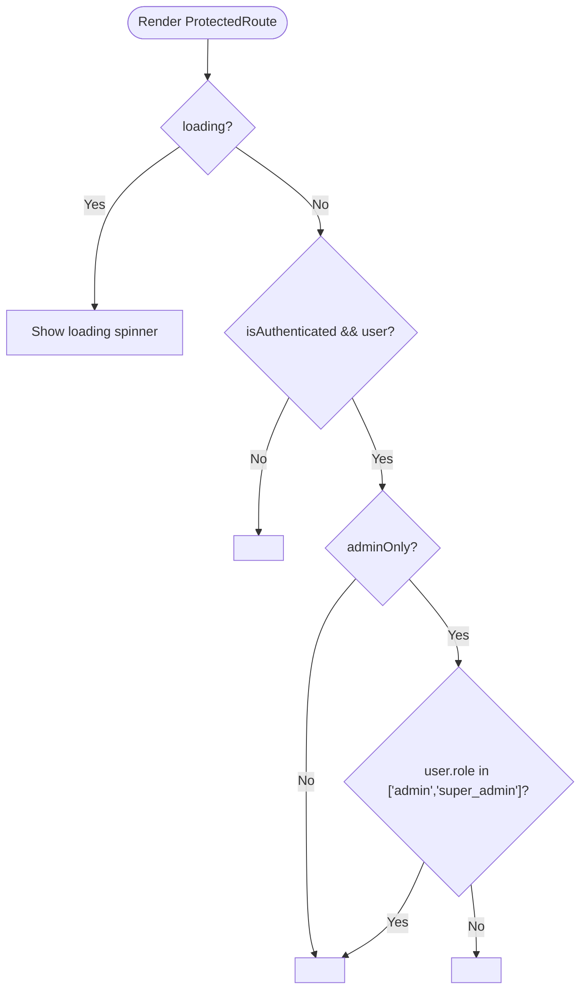
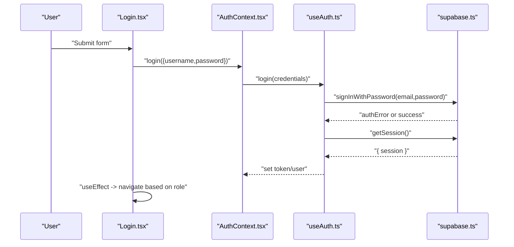
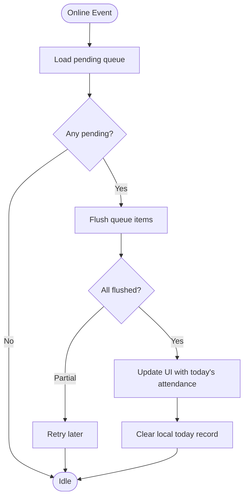
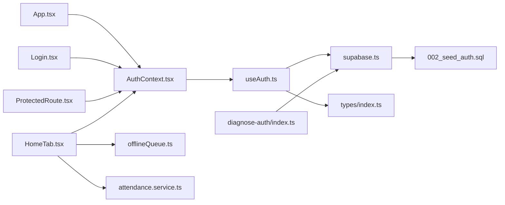

# Session Management

<cite>
**Referenced Files in This Document**
- [AuthContext.tsx](file://src/context/AuthContext.tsx)
- [useAuth.ts](file://src/hooks/useAuth.ts)
- [supabase.ts](file://src/config/supabase.ts)
- [ProtectedRoute.tsx](file://src/components/ProtectedRoute.tsx)
- [Login.tsx](file://src/components/Login.tsx)
- [App.tsx](file://src/App.tsx)
- [HomeTab.tsx](file://src/components/pwa/HomeTab.tsx)
- [offlineQueue.ts](file://src/utils/offlineQueue.ts)
- [attendance.service.ts](file://src/services/attendance.service.ts)
- [main.tsx](file://src/main.tsx)
- [index.ts](file://src/types/index.ts)
- [002_seed_auth.sql](file://supabase/migrations/002_seed_auth.sql)
- [diagnose-auth/index.ts](file://supabase/functions/diagnose-auth/index.ts)
</cite>

## Table of Contents
1. [Introduction](#introduction)
2. [Project Structure](#project-structure)
3. [Core Components](#core-components)
4. [Architecture Overview](#architecture-overview)
5. [Detailed Component Analysis](#detailed-component-analysis)
6. [Dependency Analysis](#dependency-analysis)
7. [Performance Considerations](#performance-considerations)
8. [Troubleshooting Guide](#troubleshooting-guide)
9. [Conclusion](#conclusion)

## Introduction
This document explains session management in AbsensiOnline, covering the complete lifecycle from initial authentication through token refresh and session termination. It details the AuthContext implementation for maintaining authentication state across component re-renders, the ProtectedRoute component for protecting authenticated routes, session persistence and automatic logout behavior, and integration with offline functionality. Practical examples demonstrate session state checking, route protection implementation, and handling expired sessions. The document also clarifies how session state is maintained during offline periods.

## Project Structure
The session management system centers around three primary layers:
- Authentication provider and hook: centralizes session hydration, change subscriptions, login, and logout.
- Route protection: guards authenticated and admin-only routes.
- Offline synchronization: persists and retries attendance actions while offline.

**Diagram sources**
- [App.tsx:20-57](file://src/App.tsx#L20-L57)
- [AuthContext.tsx:18-36](file://src/context/AuthContext.tsx#L18-L36)
- [useAuth.ts:29-56](file://src/hooks/useAuth.ts#L29-L56)
- [supabase.ts:3-6](file://src/config/supabase.ts#L3-L6)
- [Login.tsx:6-33](file://src/components/Login.tsx#L6-L33)
- [ProtectedRoute.tsx:9-31](file://src/components/ProtectedRoute.tsx#L9-L31)
- [HomeTab.tsx:37-123](file://src/components/pwa/HomeTab.tsx#L37-L123)
- [offlineQueue.ts:11-96](file://src/utils/offlineQueue.ts#L11-L96)
- [attendance.service.ts:25-46](file://src/services/attendance.service.ts#L25-L46)
- [types/index.ts:32-46](file://src/types/index.ts#L32-L46)
- [002_seed_auth.sql:1-29](file://supabase/migrations/002_seed_auth.sql#L1-L29)
- [diagnose-auth/index.ts:14-31](file://supabase/functions/diagnose-auth/index.ts#L14-L31)

**Section sources**
- [App.tsx:20-57](file://src/App.tsx#L20-L57)
- [AuthContext.tsx:18-36](file://src/context/AuthContext.tsx#L18-L36)
- [useAuth.ts:29-56](file://src/hooks/useAuth.ts#L29-L56)
- [supabase.ts:3-6](file://src/config/supabase.ts#L3-L6)
- [Login.tsx:6-33](file://src/components/Login.tsx#L6-L33)
- [ProtectedRoute.tsx:9-31](file://src/components/ProtectedRoute.tsx#L9-L31)
- [HomeTab.tsx:37-123](file://src/components/pwa/HomeTab.tsx#L37-L123)
- [offlineQueue.ts:11-96](file://src/utils/offlineQueue.ts#L11-L96)
- [attendance.service.ts:25-46](file://src/services/attendance.service.ts#L25-L46)
- [types/index.ts:32-46](file://src/types/index.ts#L32-L46)
- [002_seed_auth.sql:1-29](file://supabase/migrations/002_seed_auth.sql#L1-L29)
- [diagnose-auth/index.ts:14-31](file://supabase/functions/diagnose-auth/index.ts#L14-L31)

## Core Components
- AuthContext and Provider: Expose authentication state and actions to the app. It wraps children with a provider that supplies user, token, isAuthenticated, loading, login, and logout.
- useAuthState hook: Initializes session hydration on mount, subscribes to Supabase auth state changes, manages login and logout, and exposes derived state.
- ProtectedRoute: Guards routes by checking authentication and role, rendering a spinner while loading, redirecting unauthenticated users, and restricting admin-only routes.
- Login: Handles credential submission, displays errors, and navigates after successful authentication.
- Offline Queue: Persists attendance actions locally and flushes them when online, integrating with session-aware components.

Key implementation references:
- AuthContext provider and consumer: [AuthContext.tsx:18-42](file://src/context/AuthContext.tsx#L18-L42)
- Auth state hydration and subscription: [useAuth.ts:34-56](file://src/hooks/useAuth.ts#L34-L56)
- Login flow and navigation: [Login.tsx:15-33](file://src/components/Login.tsx#L15-L33)
- ProtectedRoute logic: [ProtectedRoute.tsx:9-31](file://src/components/ProtectedRoute.tsx#L9-L31)
- Offline queue storage keys and helpers: [offlineQueue.ts:11-42](file://src/utils/offlineQueue.ts#L11-L42)

**Section sources**
- [AuthContext.tsx:18-42](file://src/context/AuthContext.tsx#L18-L42)
- [useAuth.ts:34-56](file://src/hooks/useAuth.ts#L34-L56)
- [Login.tsx:15-33](file://src/components/Login.tsx#L15-L33)
- [ProtectedRoute.tsx:9-31](file://src/components/ProtectedRoute.tsx#L9-L31)
- [offlineQueue.ts:11-42](file://src/utils/offlineQueue.ts#L11-L42)

## Architecture Overview
The session lifecycle is driven by Supabase’s auth client. On initialization, the app retrieves the current session and subscribes to auth state changes. Authentication state is normalized into a user profile and access token, persisted in memory and used to guard routes and enable offline operations.

**Diagram sources**
- [Login.tsx:21-33](file://src/components/Login.tsx#L21-L33)
- [AuthContext.tsx:18-36](file://src/context/AuthContext.tsx#L18-L36)
- [useAuth.ts:58-96](file://src/hooks/useAuth.ts#L58-L96)
- [supabase.ts:3-6](file://src/config/supabase.ts#L3-L6)
- [ProtectedRoute.tsx:10-18](file://src/components/ProtectedRoute.tsx#L10-L18)

## Detailed Component Analysis

### AuthContext and useAuthState
AuthContext provides a stable authentication surface to the app. useAuthState initializes session hydration and auth state subscription, normalizes the session into a user profile and token, and exposes login/logout functions. It also sets loading to false after hydration completes.

**Diagram sources**
- [useAuth.ts:34-56](file://src/hooks/useAuth.ts#L34-L56)
- [useAuth.ts:22-27](file://src/hooks/useAuth.ts#L22-L27)
- [useAuth.ts:16-20](file://src/hooks/useAuth.ts#L16-L20)

Implementation highlights:
- Session hydration and user profile fetching: [useAuth.ts:22-27](file://src/hooks/useAuth.ts#L22-L27), [useAuth.ts:16-20](file://src/hooks/useAuth.ts#L16-L20)
- Auth state subscription and cleanup: [useAuth.ts:44-56](file://src/hooks/useAuth.ts#L44-L56)
- Login flow and post-login session retrieval: [useAuth.ts:58-96](file://src/hooks/useAuth.ts#L58-L96)
- Logout and local storage cleanup: [useAuth.ts:98-104](file://src/hooks/useAuth.ts#L98-L104)

**Section sources**
- [AuthContext.tsx:18-42](file://src/context/AuthContext.tsx#L18-L42)
- [useAuth.ts:22-27](file://src/hooks/useAuth.ts#L22-L27)
- [useAuth.ts:16-20](file://src/hooks/useAuth.ts#L16-L20)
- [useAuth.ts:34-56](file://src/hooks/useAuth.ts#L34-L56)
- [useAuth.ts:58-96](file://src/hooks/useAuth.ts#L58-L96)
- [useAuth.ts:98-104](file://src/hooks/useAuth.ts#L98-L104)

### ProtectedRoute
ProtectedRoute enforces authentication and optional admin-only access. It renders a loading spinner while authentication state is being resolved, redirects unauthenticated users to the login page, and restricts admin-only routes to users with roles admin or super_admin.

**Diagram sources**
- [ProtectedRoute.tsx:9-31](file://src/components/ProtectedRoute.tsx#L9-L31)

Practical usage:
- Protecting admin routes: [App.tsx:29-40](file://src/App.tsx#L29-L40)
- Protecting worker routes: [App.tsx:42-49](file://src/App.tsx#L42-L49)

**Section sources**
- [ProtectedRoute.tsx:9-31](file://src/components/ProtectedRoute.tsx#L9-L31)
- [App.tsx:29-40](file://src/App.tsx#L29-L40)
- [App.tsx:42-49](file://src/App.tsx#L42-L49)

### Login Component
Login handles credential submission, validates presence of inputs, triggers authentication, and navigates upon success. It listens to authentication state changes to redirect to appropriate dashboards based on user role.

**Diagram sources**
- [Login.tsx:21-33](file://src/components/Login.tsx#L21-L33)
- [AuthContext.tsx:18-36](file://src/context/AuthContext.tsx#L18-L36)
- [useAuth.ts:58-96](file://src/hooks/useAuth.ts#L58-L96)
- [supabase.ts:3-6](file://src/config/supabase.ts#L3-L6)

**Section sources**
- [Login.tsx:15-33](file://src/components/Login.tsx#L15-L33)
- [AuthContext.tsx:18-36](file://src/context/AuthContext.tsx#L18-L36)
- [useAuth.ts:58-96](file://src/hooks/useAuth.ts#L58-L96)
- [supabase.ts:3-6](file://src/config/supabase.ts#L3-L6)

### Session Persistence and Automatic Logout
- Session persistence: The app hydrates the session on mount and subscribes to auth state changes. Token and user are stored in memory via React state. There is no explicit token refresh mechanism in the frontend; Supabase manages token lifecycle.
- Automatic logout: The logout action signs out the user and clears token and user state. It also removes offline-related local storage entries to prevent stale data on subsequent sessions.
- Backend seeding: Authentication users are seeded with local emails and metadata, enabling the login flow.

References:
- Session hydration and subscription: [useAuth.ts:34-56](file://src/hooks/useAuth.ts#L34-L56)
- Logout and local storage cleanup: [useAuth.ts:98-104](file://src/hooks/useAuth.ts#L98-L104)
- Auth user seeding: [002_seed_auth.sql:1-29](file://supabase/migrations/002_seed_auth.sql#L1-L29)

**Section sources**
- [useAuth.ts:34-56](file://src/hooks/useAuth.ts#L34-L56)
- [useAuth.ts:98-104](file://src/hooks/useAuth.ts#L98-L104)
- [002_seed_auth.sql:1-29](file://supabase/migrations/002_seed_auth.sql#L1-L29)

### Session Validation Strategies
- Frontend validation: ProtectedRoute checks isAuthenticated and user presence, and optionally admin role. Loading state prevents premature navigation decisions.
- Backend diagnostics: A diagnostic function lists auth users, public users, mismatches, and orphans to help troubleshoot session inconsistencies.

References:
- Route protection logic: [ProtectedRoute.tsx:10-28](file://src/components/ProtectedRoute.tsx#L10-L28)
- Auth diagnostics: [diagnose-auth/index.ts:22-61](file://supabase/functions/diagnose-auth/index.ts#L22-L61)

**Section sources**
- [ProtectedRoute.tsx:10-28](file://src/components/ProtectedRoute.tsx#L10-L28)
- [diagnose-auth/index.ts:22-61](file://supabase/functions/diagnose-auth/index.ts#L22-L61)

### Integration with Offline Functionality
- Offline queue: Attendance actions are queued locally with a synced flag. On reconnect, the queue is flushed and synced with the backend. Local today record tracks ongoing attendance for the day.
- Online/offline detection: The home tab listens to browser online/offline events and attempts to flush the queue when online.
- Session-awareness: Offline actions are associated with the current user; upon successful flush, the UI updates to reflect the latest attendance state.

**Diagram sources**
- [HomeTab.tsx:99-123](file://src/components/pwa/HomeTab.tsx#L99-L123)
- [offlineQueue.ts:66-96](file://src/utils/offlineQueue.ts#L66-L96)
- [offlineQueue.ts:20-42](file://src/utils/offlineQueue.ts#L20-L42)
- [attendance.service.ts:25-46](file://src/services/attendance.service.ts#L25-L46)

References:
- Online/offline listeners and queue flush: [HomeTab.tsx:87-123](file://src/components/pwa/HomeTab.tsx#L87-L123)
- Queue storage and helpers: [offlineQueue.ts:11-96](file://src/utils/offlineQueue.ts#L11-L96)
- Attendance submission: [attendance.service.ts:25-46](file://src/services/attendance.service.ts#L25-L46)

**Section sources**
- [HomeTab.tsx:87-123](file://src/components/pwa/HomeTab.tsx#L87-L123)
- [offlineQueue.ts:11-96](file://src/utils/offlineQueue.ts#L11-L96)
- [attendance.service.ts:25-46](file://src/services/attendance.service.ts#L25-L46)

### Practical Examples

- Session state checking in components:
  - Access user and token via AuthContext: [AuthContext.tsx:18-36](file://src/context/AuthContext.tsx#L18-L36)
  - Guard routes with ProtectedRoute: [ProtectedRoute.tsx:9-31](file://src/components/ProtectedRoute.tsx#L9-L31)

- Route protection implementation:
  - Admin-only routes: [App.tsx:29-40](file://src/App.tsx#L29-L40)
  - Worker routes: [App.tsx:42-49](file://src/App.tsx#L42-L49)

- Handling expired sessions:
  - Auth state subscription resets user/token when session ends: [useAuth.ts:44-56](file://src/hooks/useAuth.ts#L44-L56)
  - ProtectedRoute redirects unauthenticated users: [ProtectedRoute.tsx:20-22](file://src/components/ProtectedRoute.tsx#L20-L22)

- Maintaining session state during offline periods:
  - Queue items persist with user context and are flushed when online: [offlineQueue.ts:11-96](file://src/utils/offlineQueue.ts#L11-L96)
  - UI updates after successful flush: [HomeTab.tsx:99-123](file://src/components/pwa/HomeTab.tsx#L99-L123)

**Section sources**
- [AuthContext.tsx:18-36](file://src/context/AuthContext.tsx#L18-L36)
- [ProtectedRoute.tsx:9-31](file://src/components/ProtectedRoute.tsx#L9-L31)
- [App.tsx:29-40](file://src/App.tsx#L29-L40)
- [App.tsx:42-49](file://src/App.tsx#L42-L49)
- [useAuth.ts:44-56](file://src/hooks/useAuth.ts#L44-L56)
- [ProtectedRoute.tsx:20-22](file://src/components/ProtectedRoute.tsx#L20-L22)
- [offlineQueue.ts:11-96](file://src/utils/offlineQueue.ts#L11-L96)
- [HomeTab.tsx:99-123](file://src/components/pwa/HomeTab.tsx#L99-L123)

## Dependency Analysis
The session management stack depends on Supabase for authentication and on local storage for offline persistence. AuthContext and useAuthState encapsulate these dependencies, exposing a clean interface to the rest of the app.

**Diagram sources**
- [useAuth.ts:3-3](file://src/hooks/useAuth.ts#L3-L3)
- [supabase.ts:3-6](file://src/config/supabase.ts#L3-L6)
- [types/index.ts:32-46](file://src/types/index.ts#L32-L46)
- [AuthContext.tsx:18-36](file://src/context/AuthContext.tsx#L18-L36)
- [App.tsx:20-57](file://src/App.tsx#L20-L57)
- [Login.tsx:6-7](file://src/components/Login.tsx#L6-L7)
- [ProtectedRoute.tsx:9-10](file://src/components/ProtectedRoute.tsx#L9-L10)
- [HomeTab.tsx:37-18](file://src/components/pwa/HomeTab.tsx#L37-L18)
- [offlineQueue.ts:11-96](file://src/utils/offlineQueue.ts#L11-L96)
- [attendance.service.ts:25-46](file://src/services/attendance.service.ts#L25-L46)
- [002_seed_auth.sql:1-29](file://supabase/migrations/002_seed_auth.sql#L1-L29)
- [diagnose-auth/index.ts:14-31](file://supabase/functions/diagnose-auth/index.ts#L14-L31)

**Section sources**
- [useAuth.ts:3-3](file://src/hooks/useAuth.ts#L3-L3)
- [supabase.ts:3-6](file://src/config/supabase.ts#L3-L6)
- [types/index.ts:32-46](file://src/types/index.ts#L32-L46)
- [AuthContext.tsx:18-36](file://src/context/AuthContext.tsx#L18-L36)
- [App.tsx:20-57](file://src/App.tsx#L20-L57)
- [Login.tsx:6-7](file://src/components/Login.tsx#L6-L7)
- [ProtectedRoute.tsx:9-10](file://src/components/ProtectedRoute.tsx#L9-L10)
- [HomeTab.tsx:37-18](file://src/components/pwa/HomeTab.tsx#L37-L18)
- [offlineQueue.ts:11-96](file://src/utils/offlineQueue.ts#L11-L96)
- [attendance.service.ts:25-46](file://src/services/attendance.service.ts#L25-L46)
- [002_seed_auth.sql:1-29](file://supabase/migrations/002_seed_auth.sql#L1-L29)
- [diagnose-auth/index.ts:14-31](file://supabase/functions/diagnose-auth/index.ts#L14-L31)

## Performance Considerations
- Auth state hydration occurs once on mount and again on auth state changes. Keep the number of subscribers minimal by consolidating logic in useAuthState.
- Avoid unnecessary re-renders by accessing user and token via AuthContext rather than duplicating state.
- Offline queue flushing runs sequentially; consider batching or rate-limiting if queues grow large.
- Use the loading state in ProtectedRoute to avoid redundant computations while authentication resolves.

## Troubleshooting Guide
Common issues and resolutions:
- Stuck loading on protected routes: Verify that the auth subscription emits a state and that isAuthenticated is computed correctly. See [useAuth.ts:106-113](file://src/hooks/useAuth.ts#L106-L113) and [ProtectedRoute.tsx:12-18](file://src/components/ProtectedRoute.tsx#L12-L18).
- Redirect loops to login: Ensure the session is present and hydrated. Check [useAuth.ts:34-56](file://src/hooks/useAuth.ts#L34-L56) and [Login.tsx:15-19](file://src/components/Login.tsx#L15-L19).
- Admin-only route access denied: Confirm user role is admin or super_admin. See [ProtectedRoute.tsx:24-28](file://src/components/ProtectedRoute.tsx#L24-L28).
- Offline sync not working: Verify online/offline events and queue flushing. See [HomeTab.tsx:87-123](file://src/components/pwa/HomeTab.tsx#L87-L123) and [offlineQueue.ts:66-96](file://src/utils/offlineQueue.ts#L66-L96).
- Diagnosing auth mismatches: Use the diagnostic function to compare auth users vs public users. See [diagnose-auth/index.ts:22-61](file://supabase/functions/diagnose-auth/index.ts#L22-L61).

**Section sources**
- [useAuth.ts:106-113](file://src/hooks/useAuth.ts#L106-L113)
- [ProtectedRoute.tsx:12-18](file://src/components/ProtectedRoute.tsx#L12-L18)
- [Login.tsx:15-19](file://src/components/Login.tsx#L15-L19)
- [ProtectedRoute.tsx:24-28](file://src/components/ProtectedRoute.tsx#L24-L28)
- [HomeTab.tsx:87-123](file://src/components/pwa/HomeTab.tsx#L87-L123)
- [offlineQueue.ts:66-96](file://src/utils/offlineQueue.ts#L66-L96)
- [diagnose-auth/index.ts:22-61](file://supabase/functions/diagnose-auth/index.ts#L22-L61)

## Conclusion
AbsensiOnline’s session management relies on Supabase for authentication and React context for state distribution. The AuthContext and useAuthState hook centralize session hydration, change handling, and login/logout operations. ProtectedRoute ensures secure routing, while offlineQueue enables robust offline-first attendance workflows. Together, these components provide a reliable, maintainable session lifecycle from login to logout, with clear fallbacks and diagnostics.