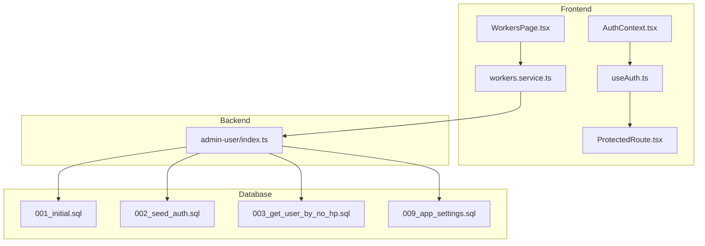
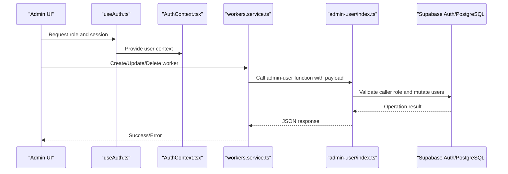
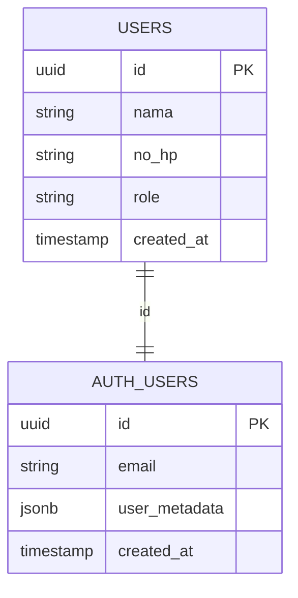
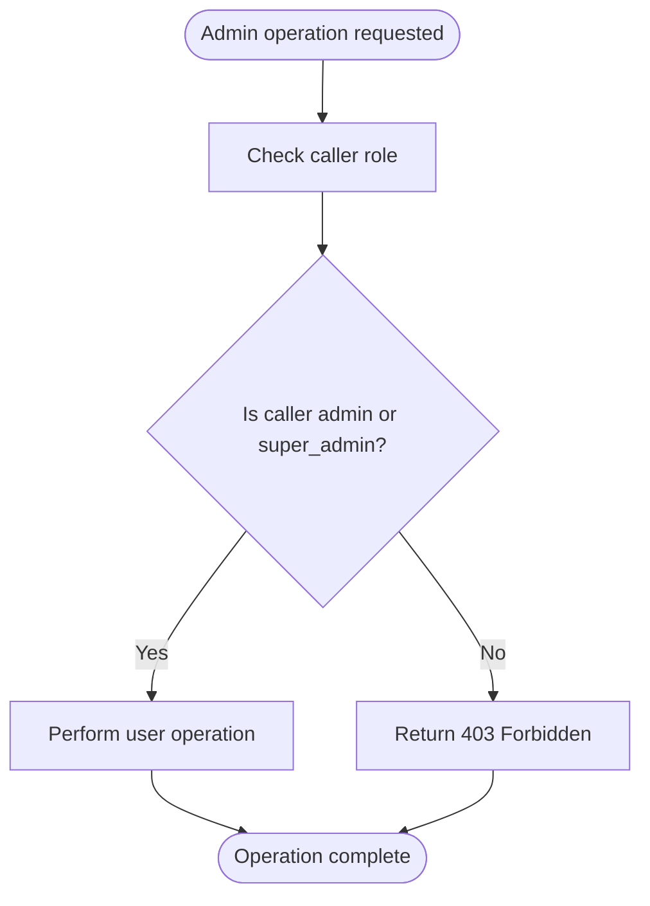
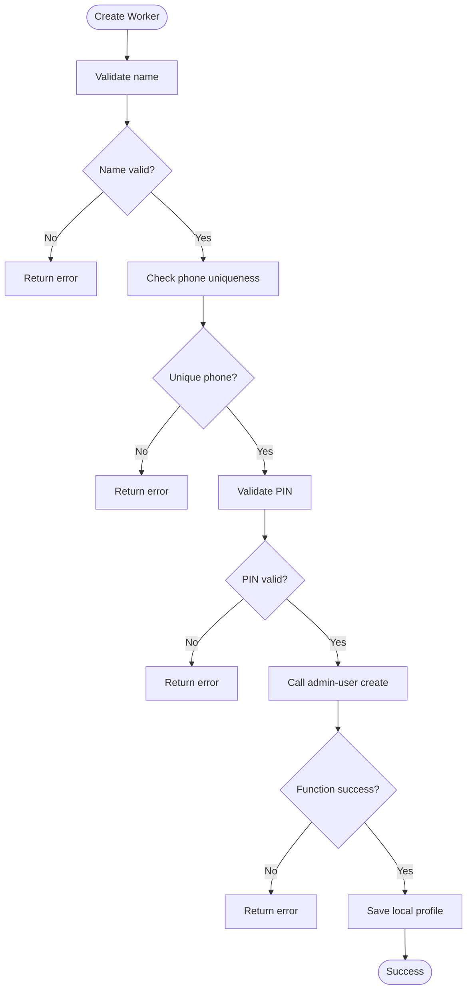
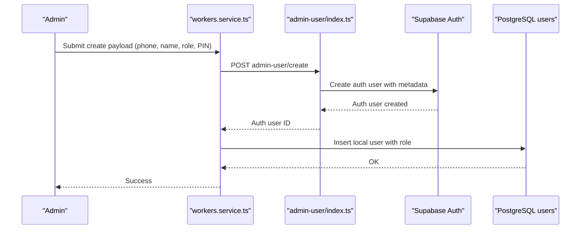
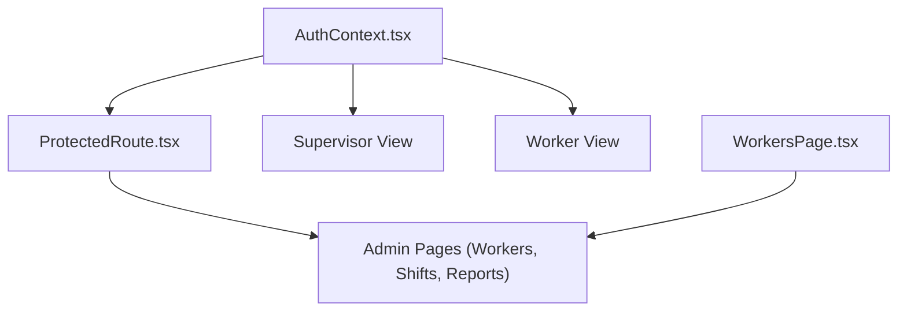
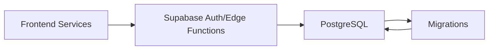

# User Roles & Permissions

<cite>
**Referenced Files in This Document**
- [AuthContext.tsx](file://src/context/AuthContext.tsx)
- [useAuth.ts](file://src/hooks/useAuth.ts)
- [ProtectedRoute.tsx](file://src/components/ProtectedRoute.tsx)
- [workers.service.ts](file://src/services/workers.service.ts)
- [index.ts](file://supabase/functions/admin-user/index.ts)
- [001_initial.sql](file://supabase/migrations/001_initial.sql)
- [002_seed_auth.sql](file://supabase/migrations/002_seed_auth.sql)
- [003_get_user_by_no_hp.sql](file://supabase/migrations/003_get_user_by_no_hp.sql)
- [009_app_settings.sql](file://supabase/migrations/009_app_settings.sql)
- [WorkersPage.tsx](file://src/components/admin/WorkersPage.tsx)
</cite>

## Table of Contents
1. [Introduction](#introduction)
2. [Project Structure](#project-structure)
3. [Core Components](#core-components)
4. [Architecture Overview](#architecture-overview)
5. [Detailed Component Analysis](#detailed-component-analysis)
6. [Dependency Analysis](#dependency-analysis)
7. [Performance Considerations](#performance-considerations)
8. [Troubleshooting Guide](#troubleshooting-guide)
9. [Conclusion](#conclusion)

## Introduction
This document explains the user role system in AbsensiOnline, focusing on three primary roles: admin, supervisor, and worker. It details role-based access control (RBAC), how roles are assigned and validated, and how different roles interact with application features such as attendance management, shift scheduling, and reporting. Practical examples illustrate role-specific UI rendering, menu visibility, and feature availability. The document also covers the database schema for user roles, role validation logic, and security implications.

## Project Structure
The role system spans frontend services and backend Supabase functions and migrations:
- Frontend RBAC and navigation are handled via context, hooks, protected routes, and admin pages.
- Backend role creation and validation are implemented in a Supabase Edge Function.
- Database schema and seeded roles are defined in migration files.

**Diagram sources**
- [AuthContext.tsx](file://src/context/AuthContext.tsx)
- [useAuth.ts](file://src/hooks/useAuth.ts)
- [ProtectedRoute.tsx](file://src/components/ProtectedRoute.tsx)
- [WorkersPage.tsx](file://src/components/admin/WorkersPage.tsx)
- [workers.service.ts](file://src/services/workers.service.ts)
- [index.ts](file://supabase/functions/admin-user/index.ts)
- [001_initial.sql](file://supabase/migrations/001_initial.sql)
- [002_seed_auth.sql](file://supabase/migrations/002_seed_auth.sql)
- [003_get_user_by_no_hp.sql](file://supabase/migrations/003_get_user_by_no_hp.sql)
- [009_app_settings.sql](file://supabase/migrations/009_app_settings.sql)

**Section sources**
- [AuthContext.tsx](file://src/context/AuthContext.tsx)
- [useAuth.ts](file://src/hooks/useAuth.ts)
- [ProtectedRoute.tsx](file://src/components/ProtectedRoute.tsx)
- [WorkersPage.tsx](file://src/components/admin/WorkersPage.tsx)
- [workers.service.ts](file://src/services/workers.service.ts)
- [index.ts](file://supabase/functions/admin-user/index.ts)
- [001_initial.sql](file://supabase/migrations/001_initial.sql)
- [002_seed_auth.sql](file://supabase/migrations/002_seed_auth.sql)
- [003_get_user_by_no_hp.sql](file://supabase/migrations/003_get_user_by_no_hp.sql)
- [009_app_settings.sql](file://supabase/migrations/009_app_settings.sql)

## Core Components
- Role model and RBAC:
  - Users have a role field stored in the database and metadata.
  - Roles include super_admin, admin, supervisor, and worker.
  - Access checks are enforced in the admin-user Edge Function and frontend services.
- Role assignment and validation:
  - Admins and super_admins can create, update, and delete users via the admin-user function.
  - Worker creation validates phone number uniqueness and PIN constraints.
- Feature access:
  - Admins manage workers, shifts, zones, and reports.
  - Supervisors and workers have restricted views aligned with their roles.
  - UI visibility and route protection enforce role-based access.

**Section sources**
- [index.ts:38-81](file://supabase/functions/admin-user/index.ts#L38-L81)
- [workers.service.ts:54-132](file://src/services/workers.service.ts#L54-L132)
- [001_initial.sql](file://supabase/migrations/001_initial.sql)
- [002_seed_auth.sql](file://supabase/migrations/002_seed_auth.sql)

## Architecture Overview
The RBAC architecture combines client-side context and server-side enforcement:
- AuthContext and useAuth provide current user role to the UI.
- ProtectedRoute restricts access to admin-only areas.
- workers.service delegates administrative tasks to the admin-user Edge Function.
- The Edge Function validates caller role and performs user operations with Supabase auth admin APIs.

**Diagram sources**
- [useAuth.ts](file://src/hooks/useAuth.ts)
- [AuthContext.tsx](file://src/context/AuthContext.tsx)
- [workers.service.ts:6-18](file://src/services/workers.service.ts#L6-L18)
- [index.ts:38-81](file://supabase/functions/admin-user/index.ts#L38-L81)

## Detailed Component Analysis

### Role Model and Database Schema
- Users table stores user profiles and role metadata.
- Supabase auth users table holds credentials and metadata including role.
- Seed data initializes roles and assigns them to users.

**Diagram sources**
- [001_initial.sql](file://supabase/migrations/001_initial.sql)
- [002_seed_auth.sql](file://supabase/migrations/002_seed_auth.sql)

**Section sources**
- [001_initial.sql](file://supabase/migrations/001_initial.sql)
- [002_seed_auth.sql](file://supabase/migrations/002_seed_auth.sql)

### Role-Based Access Control Implementation
- Caller role validation:
  - Only admin and super_admin can invoke admin-user operations.
  - Unauthorized callers receive a 403 Forbidden response.
- Role hierarchy:
  - super_admin can perform all actions.
  - admin can manage workers, shifts, zones, and reports.
  - supervisor and worker have read-only or limited access depending on UI and service logic.

**Diagram sources**
- [index.ts:38-49](file://supabase/functions/admin-user/index.ts#L38-L49)

**Section sources**
- [index.ts:38-49](file://supabase/functions/admin-user/index.ts#L38-L49)

### Role Assignment and Validation Logic
- Worker creation:
  - Validates name and phone number uniqueness.
  - Enforces PIN length and numeric constraints.
  - Calls admin-user function to create auth user with metadata.
- Worker updates and deletions:
  - Delegates to admin-user function for auth and database cleanup.
- Reset PIN:
  - Validates PIN and resets password via admin-user function.

**Diagram sources**
- [workers.service.ts:54-82](file://src/services/workers.service.ts#L54-L82)

**Section sources**
- [workers.service.ts:54-132](file://src/services/workers.service.ts#L54-L132)

### User Registration and Role Assignment Workflows
- Registration flow:
  - Admin supplies phone number, name, optional password/PIN, and role.
  - System creates an auth user with email derived from phone number and metadata including role.
  - Local user profile is created with role and personal info.
- Role assignment:
  - Role is stored in user metadata during auth user creation.
  - Local users table mirrors role for UI and service logic.

**Diagram sources**
- [workers.service.ts:73-82](file://src/services/workers.service.ts#L73-L82)
- [index.ts:75-81](file://supabase/functions/admin-user/index.ts#L75-L81)

**Section sources**
- [workers.service.ts:73-82](file://src/services/workers.service.ts#L73-L82)
- [index.ts:75-81](file://supabase/functions/admin-user/index.ts#L75-L81)

### Role-Specific UI Rendering and Feature Availability
- Admin dashboard and management pages:
  - Admins see worker management, shifts, zones, and reports.
  - WorkersPage loads workers, zones, and shifts; supports create/update/delete/reset actions.
- Supervisor and worker views:
  - UI components and routes are restricted to appropriate roles via ProtectedRoute and context.
  - Menu visibility and feature availability reflect current user role.
- Route protection:
  - ProtectedRoute enforces role-based access to admin-only routes.

**Diagram sources**
- [AuthContext.tsx](file://src/context/AuthContext.tsx)
- [ProtectedRoute.tsx](file://src/components/ProtectedRoute.tsx)
- [WorkersPage.tsx](file://src/components/admin/WorkersPage.tsx)

**Section sources**
- [WorkersPage.tsx:162-196](file://src/components/admin/WorkersPage.tsx#L162-L196)
- [ProtectedRoute.tsx](file://src/components/ProtectedRoute.tsx)
- [AuthContext.tsx](file://src/context/AuthContext.tsx)

### Permission Hierarchy and Security Implications
- super_admin:
  - Full access to all features and administrative controls.
  - Can manage other admins and roles.
- admin:
  - Manages workers, shifts, zones, and reports.
  - Cannot escalate own role beyond admin.
- supervisor:
  - Limited to viewing and managing assigned areas or teams.
  - Cannot modify roles or perform administrative operations.
- worker:
  - Read-only access to personal records and schedules.
  - Cannot access administrative features.

Security implications:
- Role validation occurs in both frontend context and backend function.
- All administrative operations are proxied through the admin-user function to prevent direct privilege escalation.
- Auth metadata ensures role persistence across sessions.

**Section sources**
- [index.ts:38-49](file://supabase/functions/admin-user/index.ts#L38-L49)
- [workers.service.ts:20-28](file://src/services/workers.service.ts#L20-L28)

## Dependency Analysis
- Frontend depends on Supabase for auth/session and on the admin-user function for administrative tasks.
- The admin-user function depends on Supabase auth admin APIs and PostgreSQL users table.
- Migrations define schema and seed initial roles.

**Diagram sources**
- [workers.service.ts:6-18](file://src/services/workers.service.ts#L6-L18)
- [index.ts:51-54](file://supabase/functions/admin-user/index.ts#L51-L54)
- [001_initial.sql](file://supabase/migrations/001_initial.sql)
- [002_seed_auth.sql](file://supabase/migrations/002_seed_auth.sql)

**Section sources**
- [workers.service.ts:6-18](file://src/services/workers.service.ts#L6-L18)
- [index.ts:51-54](file://supabase/functions/admin-user/index.ts#L51-L54)
- [001_initial.sql](file://supabase/migrations/001_initial.sql)
- [002_seed_auth.sql](file://supabase/migrations/002_seed_auth.sql)

## Performance Considerations
- Centralized admin operations reduce client-side complexity and improve consistency.
- Batch loading of related data (workers, zones, shifts) minimizes network requests.
- Role checks are lightweight but should be cached in context to avoid repeated computations.

## Troubleshooting Guide
- 403 Forbidden when performing admin operations:
  - Verify caller role is admin or super_admin.
  - Ensure the caller’s session has the correct metadata.
- Worker creation fails:
  - Check phone number uniqueness and PIN constraints.
  - Confirm the admin-user function responds without errors.
- Role not reflected in UI:
  - Refresh context/session.
  - Verify user metadata contains the expected role.

**Section sources**
- [index.ts:44-49](file://supabase/functions/admin-user/index.ts#L44-L49)
- [workers.service.ts:58-62](file://src/services/workers.service.ts#L58-L62)
- [workers.service.ts:118-121](file://src/services/workers.service.ts#L118-L121)

## Conclusion
AbsensiOnline implements a clear RBAC model with super_admin, admin, supervisor, and worker roles. Role enforcement is centralized in the admin-user Edge Function and reinforced in the frontend via context and protected routes. Administrative tasks are delegated to the function to maintain security and consistency. The database schema and migrations define the role model and seed initial roles, while UI components render role-appropriate features and menus.