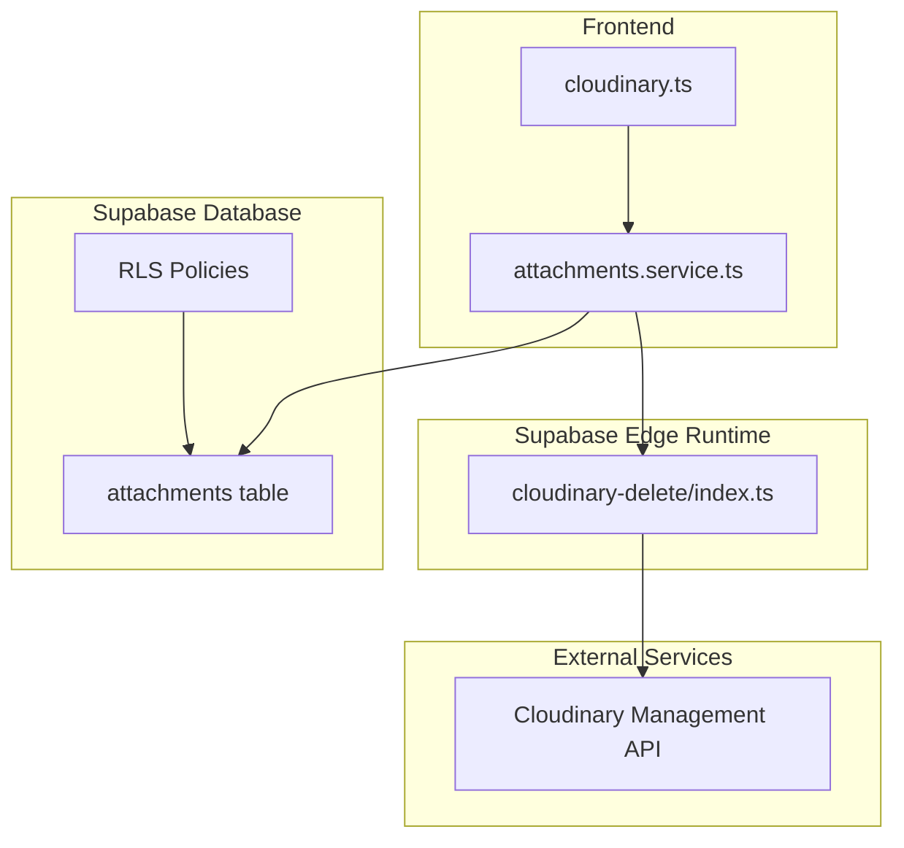
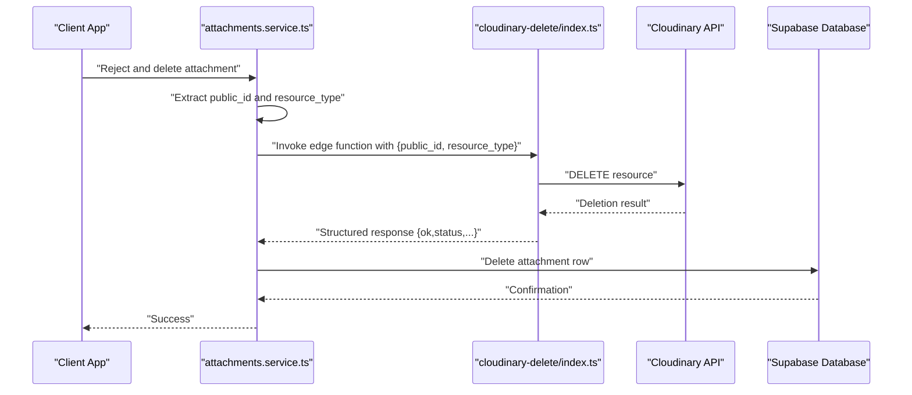
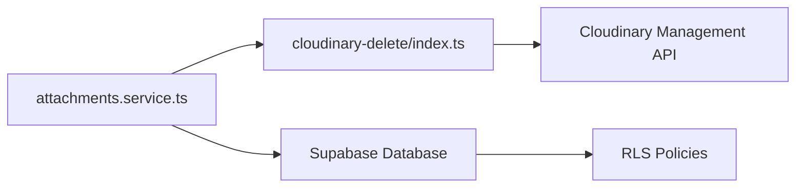

# Cleanup Automation

<cite>
**Referenced Files in This Document**
- [index.ts](file://supabase/functions/cloudinary-delete/index.ts)
- [cloudinary.ts](file://src/utils/cloudinary.ts)
- [attachments.service.ts](file://src/services/attachments.service.ts)
- [007_add_attachments_delete_rls.sql](file://supabase/migrations/007_add_attachments_delete_rls.sql)
- [001_initial.sql](file://supabase/migrations/001_initial.sql)
- [index.ts](file://src/types/index.ts)
</cite>

## Table of Contents
1. [Introduction](#introduction)
2. [Project Structure](#project-structure)
3. [Core Components](#core-components)
4. [Architecture Overview](#architecture-overview)
5. [Detailed Component Analysis](#detailed-component-analysis)
6. [Dependency Analysis](#dependency-analysis)
7. [Performance Considerations](#performance-considerations)
8. [Troubleshooting Guide](#troubleshooting-guide)
9. [Conclusion](#conclusion)

## Introduction
This document explains the Cloudinary cleanup automation implemented in AbsensiOnline. It focuses on the cloudinary-delete edge function responsible for removing orphaned media assets, the trigger conditions that initiate cleanup, the coordination with the Supabase database and attachments service for maintaining referential integrity, and the operational aspects such as scheduling, batch processing, and monitoring. It also provides troubleshooting guidance and performance optimization recommendations for large-scale media management.

## Project Structure
The cleanup automation spans three primary areas:
- Edge Function: A serverless function hosted on Supabase that performs the Cloudinary deletion via the Cloudinary Management API.
- Frontend Service Layer: An attachments service that parses Cloudinary URLs, validates authentication, and invokes the edge function.
- Database Layer: Supabase tables and policies governing attachment records and access controls.

**Diagram sources**
- [index.ts:1-71](file://supabase/functions/cloudinary-delete/index.ts#L1-L71)
- [attachments.service.ts:1-127](file://src/services/attachments.service.ts#L1-L127)
- [cloudinary.ts:1-63](file://src/utils/cloudinary.ts#L1-L63)
- [001_initial.sql:97-120](file://supabase/migrations/001_initial.sql#L97-L120)
- [007_add_attachments_delete_rls.sql:1-7](file://supabase/migrations/007_add_attachments_delete_rls.sql#L1-L7)

**Section sources**
- [index.ts:1-71](file://supabase/functions/cloudinary-delete/index.ts#L1-L71)
- [attachments.service.ts:1-127](file://src/services/attachments.service.ts#L1-L127)
- [cloudinary.ts:1-63](file://src/utils/cloudinary.ts#L1-L63)
- [001_initial.sql:97-120](file://supabase/migrations/001_initial.sql#L97-L120)
- [007_add_attachments_delete_rls.sql:1-7](file://supabase/migrations/007_add_attachments_delete_rls.sql#L1-L7)

## Core Components
- Cloudinary Delete Edge Function: Accepts a Cloudinary public_id and optional resource_type, authenticates against Cloudinary, and deletes the asset. Returns structured metadata including Cloudinary's raw response and request details.
- Attachments Service: Parses Cloudinary URLs to extract public_id and resource_type, ensures authenticated session, and calls the edge function. Coordinates database deletions after successful Cloudinary removal.
- Cloudinary Upload Utility: Handles uploads to Cloudinary from the frontend, generating secure URLs and public_ids used by the cleanup process.
- Database Schema and Policies: Defines the attachments table and access policies enabling authorized deletion of attachments.

**Section sources**
- [index.ts:8-70](file://supabase/functions/cloudinary-delete/index.ts#L8-L70)
- [attachments.service.ts:4-46](file://src/services/attachments.service.ts#L4-L46)
- [cloudinary.ts:11-62](file://src/utils/cloudinary.ts#L11-L62)
- [001_initial.sql:97-120](file://supabase/migrations/001_initial.sql#L97-L120)
- [007_add_attachments_delete_rls.sql:4-6](file://supabase/migrations/007_add_attachments_delete_rls.sql#L4-L6)

## Architecture Overview
The cleanup flow integrates the frontend service layer, the Supabase edge function, external Cloudinary APIs, and the Supabase database. The attachments service orchestrates cleanup by invoking the edge function with the extracted public_id and resource_type, then proceeds to remove the record from the database upon success.

**Diagram sources**
- [attachments.service.ts:96-110](file://src/services/attachments.service.ts#L96-L110)
- [index.ts:43-63](file://supabase/functions/cloudinary-delete/index.ts#L43-L63)
- [001_initial.sql:97-120](file://supabase/migrations/001_initial.sql#L97-L120)

## Detailed Component Analysis

### Cloudinary Delete Edge Function
Responsibilities:
- Validate incoming request payload for public_id.
- Verify Cloudinary environment variables are present.
- Construct Cloudinary Management API endpoint and Basic Authentication header.
- Issue DELETE request to Cloudinary with the specified public_id(s).
- Parse and return structured response including Cloudinary’s raw response and request metadata.

Key behaviors:
- CORS support for preflight OPTIONS requests.
- Robust error handling for malformed payloads, missing environment variables, and Cloudinary failures.
- Returns standardized response envelope for downstream consumers.

Operational notes:
- Accepts optional resource_type with default image.
- Uses Cloudinary Management API v1.1 resources endpoint for deletion.

**Section sources**
- [index.ts:8-70](file://supabase/functions/cloudinary-delete/index.ts#L8-L70)

### Attachments Service
Responsibilities:
- Extract public_id and resource_type from Cloudinary URLs.
- Ensure authenticated session exists before invoking the edge function.
- Call the Supabase cloudinary-delete edge function with proper headers (Authorization and apikey).
- Coordinate database deletion after successful Cloudinary removal.
- Provide CRUD operations for attachments and auxiliary helpers like incrementing attachment counts.

Cleanup orchestration:
- rejectAndDeleteAttachment fetches the attachment URL, calls deleteFromCloudinary, and deletes the database record on success.

URL parsing:
- extractCloudinaryPublicId handles version segments and file extensions to reliably derive public_id and resource_type.

**Section sources**
- [attachments.service.ts:4-46](file://src/services/attachments.service.ts#L4-L46)
- [attachments.service.ts:96-110](file://src/services/attachments.service.ts#L96-L110)

### Cloudinary Upload Utility
Responsibilities:
- Upload files to Cloudinary using configured upload preset and folder.
- Report progress via callback and handle various failure modes (network, parsing, user cancellation).
- Return structured results indicating success or error messages.

Integration with cleanup:
- Generates the URLs stored in the attachments table, which are later parsed by the attachments service for cleanup.

**Section sources**
- [cloudinary.ts:11-62](file://src/utils/cloudinary.ts#L11-L62)

### Database Schema and Access Control
Attachments table:
- Stores attachment records linked to attendances and users.
- Includes metadata such as URL, counts, and verification status.

RLS Policy:
- Adds a DELETE policy for authenticated users with admin or super_admin roles, enabling administrators to remove attachments.

**Section sources**
- [001_initial.sql:97-120](file://supabase/migrations/001_initial.sql#L97-L120)
- [007_add_attachments_delete_rls.sql:4-6](file://supabase/migrations/007_add_attachments_delete_rls.sql#L4-L6)

## Dependency Analysis
The cleanup automation depends on:
- Supabase edge runtime hosting the cloudinary-delete function.
- Cloudinary Management API for asset deletion.
- Supabase database for attachment records and RLS policies.
- Frontend utilities for uploads and service layer for orchestration.

**Diagram sources**
- [attachments.service.ts:30-46](file://src/services/attachments.service.ts#L30-L46)
- [index.ts:43-50](file://supabase/functions/cloudinary-delete/index.ts#L43-L50)
- [007_add_attachments_delete_rls.sql:4-6](file://supabase/migrations/007_add_attachments_delete_rls.sql#L4-L6)

**Section sources**
- [attachments.service.ts:30-46](file://src/services/attachments.service.ts#L30-L46)
- [index.ts:23-37](file://supabase/functions/cloudinary-delete/index.ts#L23-L37)
- [007_add_attachments_delete_rls.sql:4-6](file://supabase/migrations/007_add_attachments_delete_rls.sql#L4-L6)

## Performance Considerations
- Batch processing: The current edge function deletes a single public_id per invocation. For large-scale cleanup, consider extending the function to accept arrays of public_ids and process them in batches while respecting Cloudinary rate limits.
- Concurrency control: Limit concurrent Cloudinary deletion calls to avoid throttling or timeouts.
- Asynchronous workflows: Offload heavy cleanup tasks to background jobs or scheduled tasks to prevent blocking user-facing operations.
- Monitoring and retries: Implement retry logic with exponential backoff for transient failures and track metrics for deletion throughput and error rates.
- CDN invalidation: After deletion, invalidate CDN caches if applicable to ensure immediate visibility of removals.

[No sources needed since this section provides general guidance]

## Troubleshooting Guide

Common issues and resolutions:
- Missing environment variables:
  - Symptom: Edge function returns environment variable errors.
  - Action: Ensure CLOUDINARY_CLOUD_NAME, CLOUDINARY_API_KEY, and CLOUDINARY_API_SECRET are set in Supabase secrets.
- Invalid Cloudinary URL:
  - Symptom: URL parsing fails and cleanup does not start.
  - Action: Verify the attachment URL originates from Cloudinary and follows expected path patterns.
- Authentication failures:
  - Symptom: Edge function rejects requests due to missing or invalid Authorization.
  - Action: Ensure the caller passes a valid Bearer token and apikey header.
- Cloudinary deletion failures:
  - Symptom: Cloudinary returns non-OK status or error message.
  - Action: Inspect the returned response envelope for details and retry after resolving underlying issues (e.g., asset already deleted).
- Database deletion blocked:
  - Symptom: Attachment row remains after successful Cloudinary deletion.
  - Action: Confirm RLS policy allows authenticated admin users to delete attachments.

Manual cleanup procedure:
- Retrieve the attachment URL from the database.
- Invoke the cloudinary-delete edge function with the extracted public_id and resource_type.
- On success, manually delete the attachment row from the attachments table.

Monitoring approaches:
- Log structured responses from the edge function for auditability.
- Track deletion success rates and latency.
- Alert on sustained failure rates or Cloudinary API errors.

**Section sources**
- [index.ts:27-37](file://supabase/functions/cloudinary-delete/index.ts#L27-L37)
- [attachments.service.ts:20-46](file://src/services/attachments.service.ts#L20-L46)
- [007_add_attachments_delete_rls.sql:4-6](file://supabase/migrations/007_add_attachments_delete_rls.sql#L4-L6)

## Conclusion
The cleanup automation in AbsensiOnline leverages a focused edge function to remove orphaned Cloudinary assets, coordinated by the attachments service and governed by Supabase database policies. By understanding the trigger conditions, data flows, and integration points, teams can operate reliable, auditable, and scalable media cleanup processes. Extending the edge function to support batch operations and implementing robust monitoring and retry strategies will further enhance reliability for large-scale deployments.