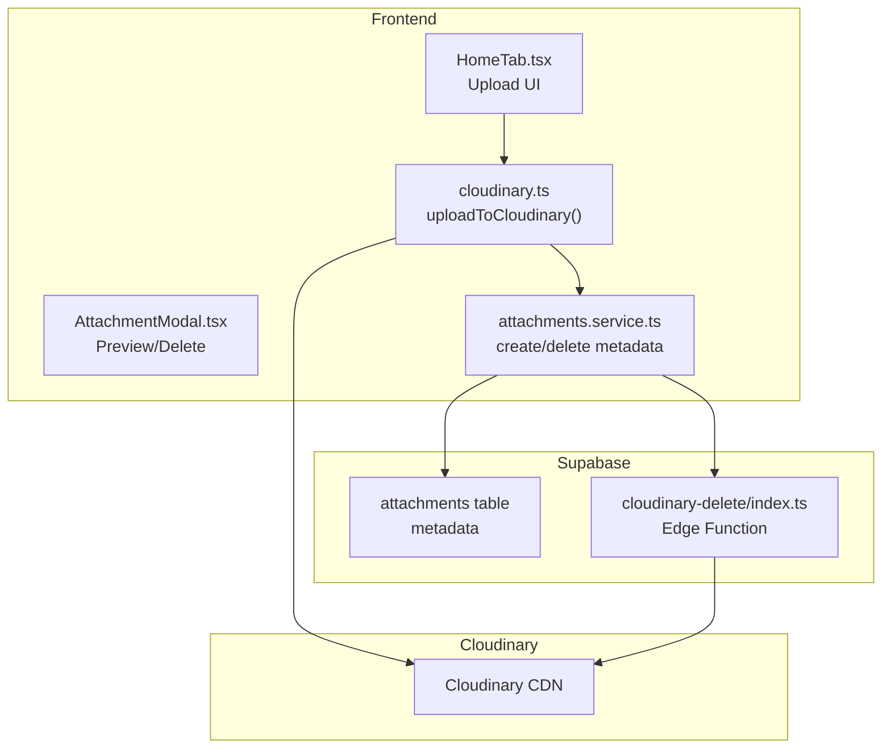
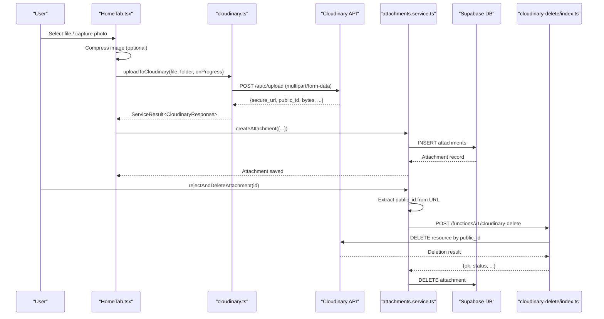
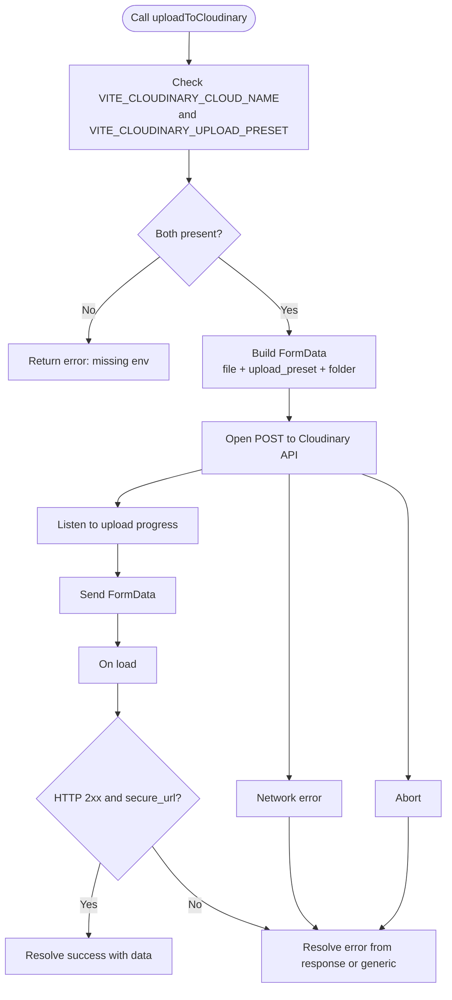
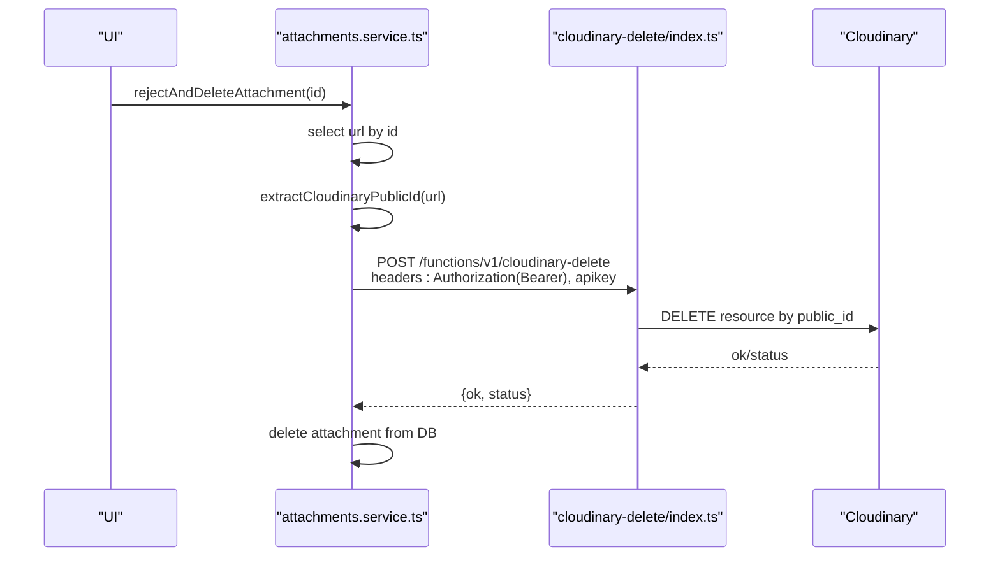
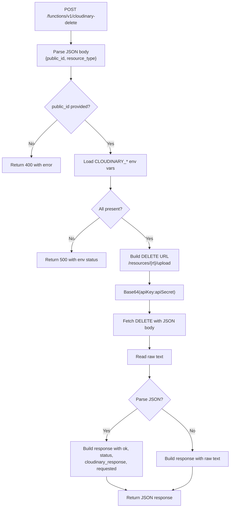
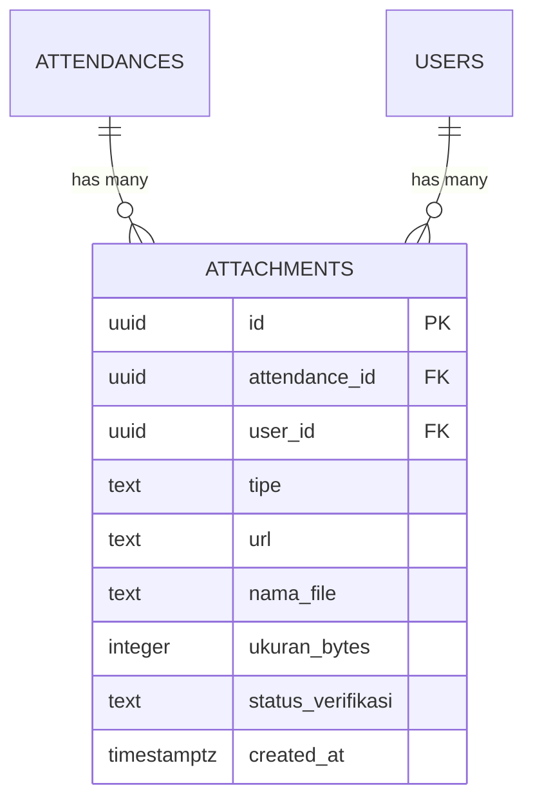
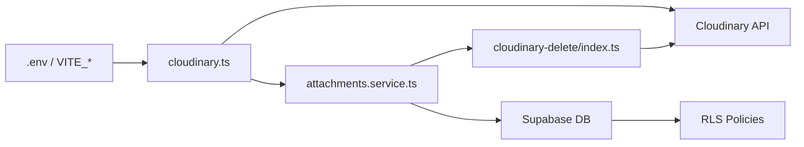

# Cloudinary Integration

<cite>
**Referenced Files in This Document**
- [cloudinary.ts](file://src/utils/cloudinary.ts)
- [attachments.service.ts](file://src/services/attachments.service.ts)
- [index.ts](file://supabase/functions/cloudinary-delete/index.ts)
- [001_initial.sql](file://supabase/migrations/001_initial.sql)
- [HomeTab.tsx](file://src/components/pwa/HomeTab.tsx)
- [AttachmentModal.tsx](file://src/components/admin/AttachmentModal.tsx)
- [index.ts](file://src/types/index.ts)
- [vite-env.d.ts](file://src/vite-env.d.ts)
- [Cloudinary.md](file://Cloudinary.md)
</cite>

## Table of Contents
1. [Introduction](#introduction)
2. [Project Structure](#project-structure)
3. [Core Components](#core-components)
4. [Architecture Overview](#architecture-overview)
5. [Detailed Component Analysis](#detailed-component-analysis)
6. [Dependency Analysis](#dependency-analysis)
7. [Performance Considerations](#performance-considerations)
8. [Security Considerations](#security-considerations)
9. [Troubleshooting Guide](#troubleshooting-guide)
10. [Conclusion](#conclusion)

## Introduction
This document explains how AbsensiOnline integrates Cloudinary for image and document uploads, metadata storage via Supabase, and automated cleanup of orphaned assets. It covers the upload pipeline, media processing capabilities, storage management, Supabase integration, and the Cloudinary Delete Edge Function used to remove unused assets. It also documents compression, responsive image generation, CDN optimization strategies, and security considerations such as signed URLs, access control, and transformation parameters.

## Project Structure
Cloudinary integration spans the frontend, backend edge function, and Supabase database:
- Frontend upload utility and UI components
- Supabase-backed metadata storage
- Supabase Edge Function to delete Cloudinary resources
- Database schema and row-level security policies

**Diagram sources**
- [HomeTab.tsx:430-491](file://src/components/pwa/HomeTab.tsx#L430-L491)
- [cloudinary.ts:11-62](file://src/utils/cloudinary.ts#L11-L62)
- [attachments.service.ts:1-127](file://src/services/attachments.service.ts#L1-L127)
- [index.ts:1-71](file://supabase/functions/cloudinary-delete/index.ts#L1-L71)
- [001_initial.sql:97-112](file://supabase/migrations/001_initial.sql#L97-L112)

**Section sources**
- [HomeTab.tsx:430-491](file://src/components/pwa/HomeTab.tsx#L430-L491)
- [cloudinary.ts:11-62](file://src/utils/cloudinary.ts#L11-L62)
- [attachments.service.ts:1-127](file://src/services/attachments.service.ts#L1-L127)
- [index.ts:1-71](file://supabase/functions/cloudinary-delete/index.ts#L1-L71)
- [001_initial.sql:97-112](file://supabase/migrations/001_initial.sql#L97-L112)

## Core Components
- Cloudinary upload utility: Handles form submission, progress events, and parsing of Cloudinary responses.
- Attachment service: Manages metadata CRUD, verification updates, and deletion orchestration including Cloudinary cleanup.
- Cloudinary Delete Edge Function: Deletes Cloudinary resources using Cloudinary API credentials.
- Database schema: Stores attachment metadata with foreign keys and RLS policies.

**Section sources**
- [cloudinary.ts:11-62](file://src/utils/cloudinary.ts#L11-L62)
- [attachments.service.ts:1-127](file://src/services/attachments.service.ts#L1-L127)
- [index.ts:1-71](file://supabase/functions/cloudinary-delete/index.ts#L1-L71)
- [001_initial.sql:97-112](file://supabase/migrations/001_initial.sql#L97-L112)

## Architecture Overview
The upload flow begins in the PWA home tab, which compresses images (when applicable), uploads to Cloudinary, records metadata in Supabase, and updates counters. Deletion triggers Cloudinary cleanup via a Supabase Edge Function.

**Diagram sources**
- [HomeTab.tsx:430-491](file://src/components/pwa/HomeTab.tsx#L430-L491)
- [cloudinary.ts:11-62](file://src/utils/cloudinary.ts#L11-L62)
- [attachments.service.ts:96-110](file://src/services/attachments.service.ts#L96-L110)
- [index.ts:1-71](file://supabase/functions/cloudinary-delete/index.ts#L1-L71)

## Detailed Component Analysis

### Cloudinary Upload Utility
Purpose:
- Upload files to Cloudinary using a signed upload preset.
- Append a folder path for organization.
- Report upload progress via callbacks.
- Parse and validate Cloudinary responses.

Key behaviors:
- Validates presence of Cloud Name and Upload Preset from environment.
- Uses XMLHttpRequest to stream upload and compute progress.
- Parses JSON response and handles HTTP errors and network failures.
- Returns a typed ServiceResult with either data (secure_url, public_id, bytes) or error.

**Diagram sources**
- [cloudinary.ts:11-62](file://src/utils/cloudinary.ts#L11-L62)

**Section sources**
- [cloudinary.ts:11-62](file://src/utils/cloudinary.ts#L11-L62)
- [vite-env.d.ts:5-6](file://src/vite-env.d.ts#L5-L6)

### Attachment Service Implementation
Responsibilities:
- Retrieve attachments by attendance or user.
- Create attachment metadata entries.
- Update verification status.
- Reject and delete attachments (including Cloudinary cleanup).
- Increment attachment counts on attendance records.

Deletion workflow:
- Extract public_id and resource_type from stored Cloudinary URL.
- Obtain Supabase session and call the Edge Function with bearer token and apikey header.
- On success, delete the metadata record from Supabase.

**Diagram sources**
- [attachments.service.ts:96-110](file://src/services/attachments.service.ts#L96-L110)
- [index.ts:1-71](file://supabase/functions/cloudinary-delete/index.ts#L1-L71)

**Section sources**
- [attachments.service.ts:1-127](file://src/services/attachments.service.ts#L1-L127)

### Cloudinary Delete Edge Function
Purpose:
- Accept public_id and optional resource_type.
- Validate presence of Cloudinary API credentials in environment.
- Call Cloudinary Resources API to delete the resource.
- Return structured response including ok flag, status, and requested parameters.

**Diagram sources**
- [index.ts:1-71](file://supabase/functions/cloudinary-delete/index.ts#L1-L71)

**Section sources**
- [index.ts:1-71](file://supabase/functions/cloudinary-delete/index.ts#L1-L71)

### Database Schema and Policies
The attachments table stores:
- Foreign keys to attendances and users
- Type (foto/dokumen)
- URL, filename, size in bytes
- Verification status
- Created timestamp

Row Level Security:
- Admins can select/update/delete all rows.
- Users can only select/update/delete their own rows.
- Insert is restricted to authenticated users matching the current user id.

**Diagram sources**
- [001_initial.sql:97-112](file://supabase/migrations/001_initial.sql#L97-L112)

**Section sources**
- [001_initial.sql:97-112](file://supabase/migrations/001_initial.sql#L97-L112)
- [index.ts:48-58](file://src/types/index.ts#L48-L58)

### Frontend Upload and Preview Components
- HomeTab.tsx:
  - Enforces daily and per-type limits from app settings.
  - Compresses images for type 'foto' using browser-image-compression with progress feedback.
  - Calls uploadToCloudinary and persists metadata via createAttachment.
  - Updates attendance attachment count upon successful save.
- AttachmentModal.tsx:
  - Renders attachment previews and download actions.
  - Confirms permanent deletion including Cloudinary cleanup.

**Section sources**
- [HomeTab.tsx:430-491](file://src/components/pwa/HomeTab.tsx#L430-L491)
- [AttachmentModal.tsx:102-136](file://src/components/admin/AttachmentModal.tsx#L102-L136)

## Dependency Analysis
- Frontend depends on:
  - Environment variables for Cloudinary configuration
  - Supabase for authentication session and metadata persistence
  - Edge Function for Cloudinary deletion
- Backend Edge Function depends on:
  - Cloudinary API credentials in environment
  - Cloudinary Resources API for deletion
- Database depends on:
  - Row Level Security policies for access control
  - Foreign keys to attendances and users

**Diagram sources**
- [cloudinary.ts:11-62](file://src/utils/cloudinary.ts#L11-L62)
- [attachments.service.ts:1-127](file://src/services/attachments.service.ts#L1-L127)
- [index.ts:1-71](file://supabase/functions/cloudinary-delete/index.ts#L1-L71)
- [001_initial.sql:169-266](file://supabase/migrations/001_initial.sql#L169-L266)

**Section sources**
- [cloudinary.ts:11-62](file://src/utils/cloudinary.ts#L11-L62)
- [attachments.service.ts:1-127](file://src/services/attachments.service.ts#L1-L127)
- [index.ts:1-71](file://supabase/functions/cloudinary-delete/index.ts#L1-L71)
- [001_initial.sql:169-266](file://supabase/migrations/001_initial.sql#L169-L266)

## Performance Considerations
- Image compression:
  - Photos are compressed and resized before upload to reduce payload size and improve upload times.
  - Compression progress contributes half of the total progress bar for photos.
- CDN optimization:
  - Cloudinary delivers optimized images via CDN; leverage responsive breakpoints and automatic format selection for reduced bandwidth.
- Storage quotas:
  - Daily and per-type limits are enforced in the UI and can be configured via app settings.
- Network resilience:
  - Upload uses XMLHttpRequest with progress and error handling; consider retry logic for transient failures.

[No sources needed since this section provides general guidance]

## Security Considerations
- Access control:
  - Supabase RLS policies restrict attachment access to owners and admins.
  - Edge Function validates environment variables and returns structured errors.
- Authentication:
  - Deletion requests pass the user’s access token in the Authorization header.
  - Supabase apikey header is included for function invocation.
- Transformation parameters:
  - Prefer signed URLs for sensitive transformations or private assets.
  - Use Cloudinary’s signed URL generation to prevent unauthorized parameter tampering.
- Secrets:
  - Cloudinary API credentials are loaded from environment variables in the Edge Function.
  - Frontend uses an upload preset; avoid exposing API secrets in client-side code.

**Section sources**
- [001_initial.sql:250-266](file://supabase/migrations/001_initial.sql#L250-L266)
- [attachments.service.ts:24-38](file://src/services/attachments.service.ts#L24-L38)
- [index.ts:23-37](file://supabase/functions/cloudinary-delete/index.ts#L23-L37)

## Troubleshooting Guide
Common issues and resolutions:
- Missing Cloudinary configuration:
  - Symptom: Upload returns configuration error.
  - Resolution: Set VITE_CLOUDINARY_CLOUD_NAME and VITE_CLOUDINARY_UPLOAD_PRESET.
- Network connectivity:
  - Symptom: Upload error indicating connection failure.
  - Resolution: Verify internet connectivity and Cloudinary availability.
- Upload aborted:
  - Symptom: Upload canceled.
  - Resolution: Retry or ensure uninterrupted network.
- Invalid Cloudinary URL:
  - Symptom: Error extracting public_id during deletion.
  - Resolution: Ensure stored URL originates from Cloudinary and matches expected pattern.
- Not authenticated:
  - Symptom: Deletion fails due to missing session.
  - Resolution: Ensure user is logged in and session exists.
- Edge Function environment missing:
  - Symptom: 500 error indicating missing environment variables.
  - Resolution: Provide CLOUDINARY_CLOUD_NAME, CLOUDINARY_API_KEY, CLOUDINARY_API_SECRET.
- Cloudinary deletion failure:
  - Symptom: Deletion request succeeds but Cloudinary returns error.
  - Resolution: Inspect returned status and cloudinary_response for details.

**Section sources**
- [cloudinary.ts:19-21](file://src/utils/cloudinary.ts#L19-L21)
- [cloudinary.ts:52-58](file://src/utils/cloudinary.ts#L52-L58)
- [attachments.service.ts:21-25](file://src/services/attachments.service.ts#L21-L25)
- [index.ts:27-37](file://supabase/functions/cloudinary-delete/index.ts#L27-L37)
- [index.ts:64-69](file://supabase/functions/cloudinary-delete/index.ts#L64-L69)

## Conclusion
AbsensiOnline integrates Cloudinary for efficient, scalable media handling with Supabase-managed metadata and robust deletion via an Edge Function. The system enforces access control, supports image compression and CDN delivery, and provides a clear deletion path for orphaned assets. By following the documented configuration, security practices, and troubleshooting steps, teams can maintain reliable and secure media workflows.