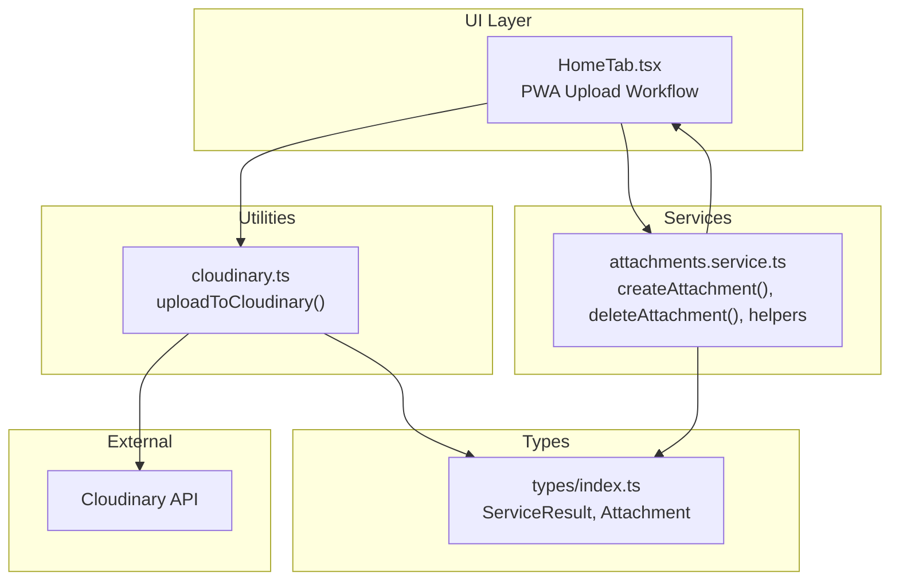
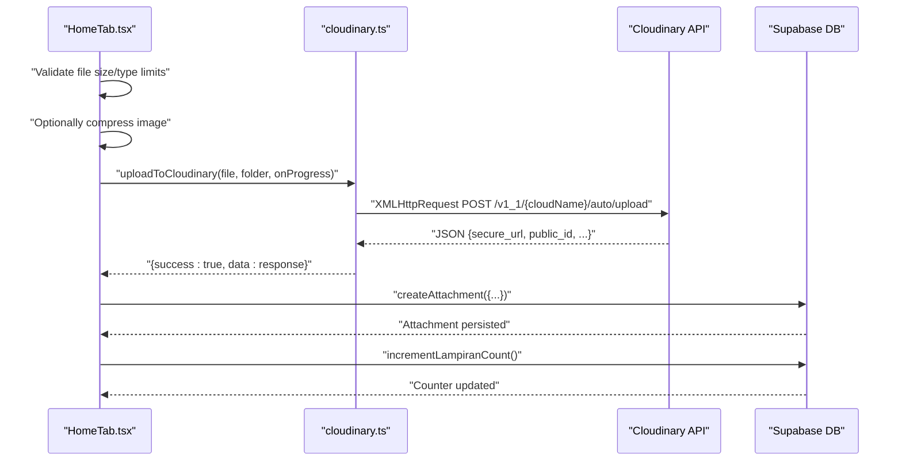
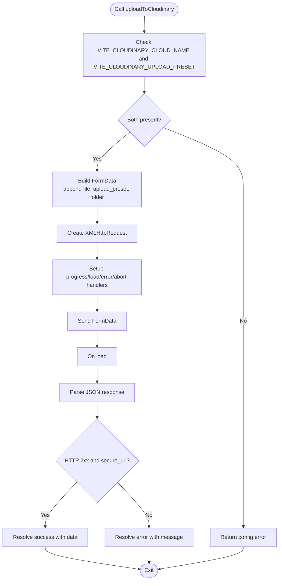
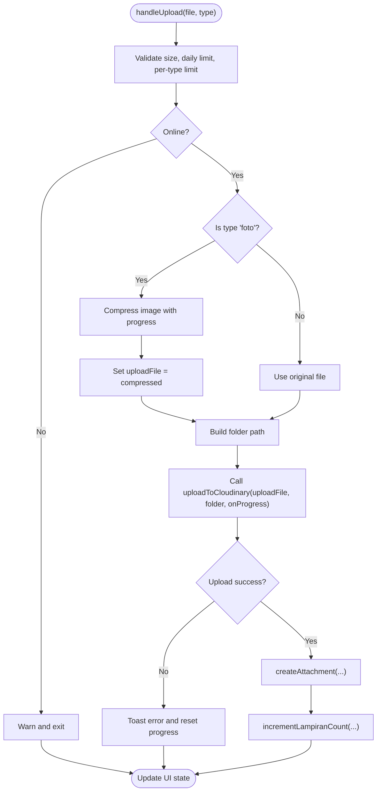
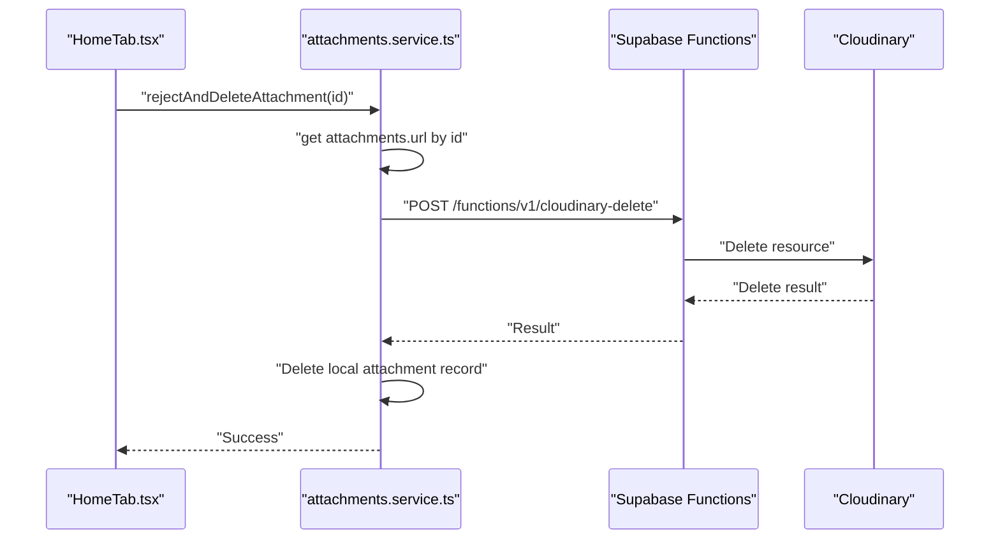
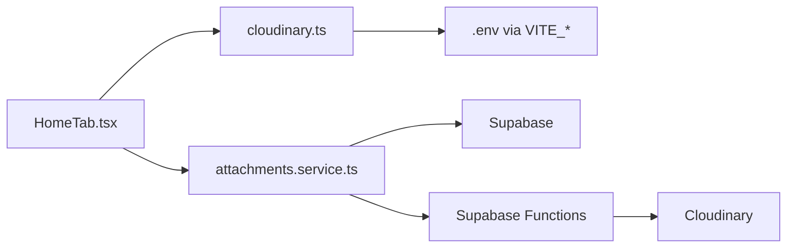

# Image Upload Process

<cite>
**Referenced Files in This Document**
- [cloudinary.ts](file://src/utils/cloudinary.ts)
- [attachments.service.ts](file://src/services/attachments.service.ts)
- [HomeTab.tsx](file://src/components/pwa/HomeTab.tsx)
- [index.ts](file://src/types/index.ts)
- [SPEC.md](file://SPEC.md)
- [DESIGN.md](file://DESIGN.md)
- [vite-env.d.ts](file://src/vite-env.d.ts)
</cite>

## Table of Contents
1. [Introduction](#introduction)
2. [Project Structure](#project-structure)
3. [Core Components](#core-components)
4. [Architecture Overview](#architecture-overview)
5. [Detailed Component Analysis](#detailed-component-analysis)
6. [Dependency Analysis](#dependency-analysis)
7. [Performance Considerations](#performance-considerations)
8. [Troubleshooting Guide](#troubleshooting-guide)
9. [Conclusion](#conclusion)

## Introduction
This document explains the Cloudinary image upload process in AbsensiOnline. It focuses on the uploadToCloudinary function, covering file validation, progress tracking, error handling, and integration with the attachments service. It also documents environment-based authentication, security considerations for upload presets, and practical workflows for successful uploads.

## Project Structure
The upload pipeline spans a small set of focused modules:
- A utility module that performs the Cloudinary upload via XMLHttpRequest
- A PWA component that orchestrates validation, compression, and progress updates
- An attachments service that persists metadata and coordinates deletion
- Shared types that define the response shape and service result contract

**Diagram sources**
- [HomeTab.tsx:412-491](file://src/components/pwa/HomeTab.tsx#L412-L491)
- [cloudinary.ts:11-62](file://src/utils/cloudinary.ts#L11-L62)
- [attachments.service.ts:48-94](file://src/services/attachments.service.ts#L48-L94)
- [index.ts:48-58](file://src/types/index.ts#L48-L58)

**Section sources**
- [HomeTab.tsx:412-491](file://src/components/pwa/HomeTab.tsx#L412-L491)
- [cloudinary.ts:11-62](file://src/utils/cloudinary.ts#L11-L62)
- [attachments.service.ts:48-94](file://src/services/attachments.service.ts#L48-L94)
- [index.ts:48-58](file://src/types/index.ts#L48-L58)

## Core Components
- uploadToCloudinary(file, folder, onProgress?): Performs the upload to Cloudinary using XMLHttpRequest, constructs FormData, tracks progress, and parses the response.
- HomeTab.tsx: Validates file size/type limits, optionally compresses images, computes progress, and integrates with the attachments service.
- attachments.service.ts: Persists attachment records, increments counters, and supports deletion via a Supabase function that calls Cloudinary.

Key behaviors:
- Environment-based configuration for Cloudinary credentials
- Unsigned upload preset for browser-side uploads
- Progress reporting via onProgress callback
- Robust error handling for network, parsing, and validation failures

**Section sources**
- [cloudinary.ts:11-62](file://src/utils/cloudinary.ts#L11-L62)
- [HomeTab.tsx:412-491](file://src/components/pwa/HomeTab.tsx#L412-L491)
- [attachments.service.ts:48-94](file://src/services/attachments.service.ts#L48-L94)

## Architecture Overview
The upload flow is initiated from the PWA component, validated and optionally compressed, then sent to Cloudinary. On success, the app persists the attachment metadata and updates counters.

**Diagram sources**
- [HomeTab.tsx:412-491](file://src/components/pwa/HomeTab.tsx#L412-L491)
- [cloudinary.ts:11-62](file://src/utils/cloudinary.ts#L11-L62)
- [attachments.service.ts:48-94](file://src/services/attachments.service.ts#L48-L94)

## Detailed Component Analysis

### uploadToCloudinary Function
Responsibilities:
- Read environment variables for Cloudinary cloud name and upload preset
- Construct FormData with file, upload preset, and folder
- Configure XMLHttpRequest to POST to Cloudinary auto upload endpoint
- Report upload progress via onProgress
- Parse and validate response; resolve with success or error

Implementation highlights:
- Authentication: Uses an unsigned upload preset configured in the frontend environment
- Security: No API secret is exposed in the browser; the preset controls allowed transformations and folder
- Progress: Listens to upload progress events and forwards percentage
- Error handling: Catches parse errors, network errors, and aborts; returns structured ServiceResult

FormData construction:
- Keys: file, upload_preset, folder
- Folder value: absensi/{folder}, where {folder} is derived from user and attendance identifiers

XMLHttpRequest configuration:
- Method: POST
- Endpoint: https://api.cloudinary.com/v1_1/{cloudName}/auto/upload
- Event listeners: progress, load, error, abort
- Body: FormData

Response processing:
- Parses JSON and checks for a valid secure_url
- Returns success with the parsed response or a descriptive error

**Diagram sources**
- [cloudinary.ts:11-62](file://src/utils/cloudinary.ts#L11-L62)

**Section sources**
- [cloudinary.ts:11-62](file://src/utils/cloudinary.ts#L11-L62)

### PWA Upload Workflow (HomeTab.tsx)
Responsibilities:
- Enforce app-level limits (max file size, daily file count, per-type caps)
- Optionally compress images before upload
- Compute combined progress (compression + upload)
- Call uploadToCloudinary and persist results via the attachments service
- Update attachment counters and manage local state

Validation and compression:
- File size checked against settings.max_file_size_mb
- Daily and per-type quotas enforced
- Images are compressed to reduce payload and improve UX

Progress computation:
- Compression contributes up to 50%
- Upload contributes the remaining portion
- Progress callback updates UI state

Persistence:
- On success, creates an attachment record with URL, filename, size, and verification status
- Increments the attendance attachment counter

**Diagram sources**
- [HomeTab.tsx:412-491](file://src/components/pwa/HomeTab.tsx#L412-L491)

**Section sources**
- [HomeTab.tsx:412-491](file://src/components/pwa/HomeTab.tsx#L412-L491)

### Attachments Service Integration
Responsibilities:
- Persist attachment metadata to the database
- Increment attachment counts per attendance
- Delete attachments and their Cloudinary resources via a Supabase function

Deletion flow:
- Extracts public_id and resource_type from a Cloudinary URL
- Requires an authenticated session
- Calls a Supabase Edge Function to delete the resource
- On success, deletes the local record

**Diagram sources**
- [attachments.service.ts:96-110](file://src/services/attachments.service.ts#L96-L110)

**Section sources**
- [attachments.service.ts:48-94](file://src/services/attachments.service.ts#L48-L94)
- [attachments.service.ts:96-110](file://src/services/attachments.service.ts#L96-L110)

## Dependency Analysis
- HomeTab.tsx depends on:
  - uploadToCloudinary for network upload
  - attachments.service.ts for persistence and counters
  - App settings for validation rules
- uploadToCloudinary depends on:
  - Vite environment variables for Cloudinary configuration
  - Browser XMLHttpRequest for transport
- attachments.service.ts depends on:
  - Supabase client for database operations
  - Supabase Functions for Cloudinary deletion

**Diagram sources**
- [HomeTab.tsx:412-491](file://src/components/pwa/HomeTab.tsx#L412-L491)
- [cloudinary.ts:11-62](file://src/utils/cloudinary.ts#L11-L62)
- [attachments.service.ts:20-46](file://src/services/attachments.service.ts#L20-L46)
- [vite-env.d.ts:5-6](file://src/vite-env.d.ts#L5-L6)

**Section sources**
- [HomeTab.tsx:412-491](file://src/components/pwa/HomeTab.tsx#L412-L491)
- [cloudinary.ts:11-62](file://src/utils/cloudinary.ts#L11-L62)
- [attachments.service.ts:20-46](file://src/services/attachments.service.ts#L20-L46)
- [vite-env.d.ts:5-6](file://src/vite-env.d.ts#L5-L6)

## Performance Considerations
- Prefer image compression for photos to reduce upload time and bandwidth usage
- Use progress callbacks to provide responsive feedback; combine compression and upload progress for realistic estimates
- Respect app-level limits to avoid overwhelming Cloudinary and the backend
- Leverage unsigned presets to minimize server-side overhead while maintaining security boundaries

## Troubleshooting Guide
Common issues and resolutions:
- Missing environment variables:
  - Symptom: Immediate configuration error before upload
  - Resolution: Set VITE_CLOUDINARY_CLOUD_NAME and VITE_CLOUDINARY_UPLOAD_PRESET in the environment
  - Reference: [SPEC.md:13-14](file://SPEC.md#L13-L14), [cloudinary.ts:16-21](file://src/utils/cloudinary.ts#L16-L21)
- Network connectivity:
  - Symptom: "Failed to connect to Cloudinary" error
  - Resolution: Verify internet connection and firewall/proxy settings
  - Reference: [cloudinary.ts:52-54](file://src/utils/cloudinary.ts#L52-L54)
- Invalid file type or size:
  - Symptom: Validation warning and early exit
  - Resolution: Ensure file is under max size and meets type quotas
  - Reference: [HomeTab.tsx:418-432](file://src/components/pwa/HomeTab.tsx#L418-L432)
- Parsing errors:
  - Symptom: "Failed to process upload response"
  - Resolution: Retry upload; inspect Cloudinary logs if persistent
  - Reference: [cloudinary.ts:47-49](file://src/utils/cloudinary.ts#L47-L49)
- Upload aborted:
  - Symptom: "Upload cancelled"
  - Resolution: Re-attempt upload; ensure user intent and network stability
  - Reference: [cloudinary.ts:56-58](file://src/utils/cloudinary.ts#L56-L58)
- Preset misconfiguration:
  - Symptom: Upload rejected by Cloudinary
  - Resolution: Confirm the unsigned preset allows the target folder and transformations
  - Reference: [SPEC.md:199-200](file://SPEC.md#L199-L200), [SPEC.md:553-557](file://SPEC.md#L553-L557)

Security and configuration references:
- Environment variable declarations: [vite-env.d.ts:5-6](file://src/vite-env.d.ts#L5-L6)
- Preset usage and endpoint: [SPEC.md:199-200](file://SPEC.md#L199-L200), [SPEC.md:553-557](file://SPEC.md#L553-L557)
- Design guidance: [DESIGN.md:448-449](file://DESIGN.md#L448-L449), [DESIGN.md](file://DESIGN.md#L468)

**Section sources**
- [cloudinary.ts:16-21](file://src/utils/cloudinary.ts#L16-L21)
- [cloudinary.ts:47-58](file://src/utils/cloudinary.ts#L47-L58)
- [HomeTab.tsx:418-432](file://src/components/pwa/HomeTab.tsx#L418-L432)
- [SPEC.md:13-14](file://SPEC.md#L13-L14)
- [SPEC.md:199-200](file://SPEC.md#L199-L200)
- [SPEC.md:553-557](file://SPEC.md#L553-L557)
- [DESIGN.md:448-449](file://DESIGN.md#L448-L449)
- [DESIGN.md](file://DESIGN.md#L468)
- [vite-env.d.ts:5-6](file://src/vite-env.d.ts#L5-L6)

## Conclusion
The Cloudinary upload process in AbsensiOnline is designed for simplicity and reliability in the browser. It leverages an unsigned preset, robust progress reporting, and clear error handling. The PWA component enforces sensible limits and optional compression, while the attachments service ensures reliable persistence and cleanup. By validating environment configuration and following the troubleshooting steps, teams can maintain a smooth and secure upload experience.