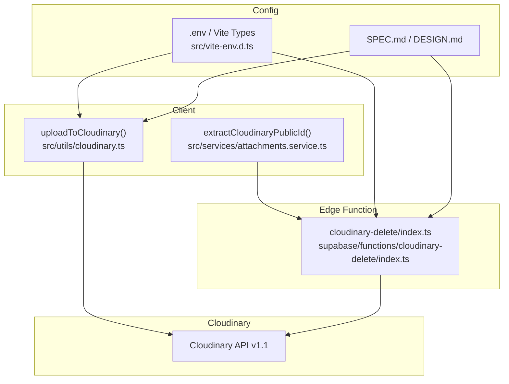
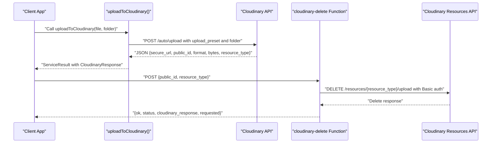
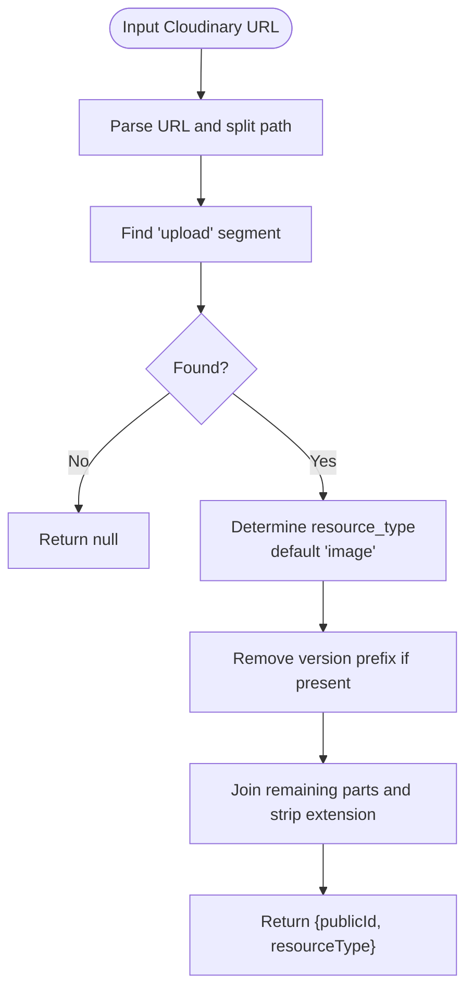
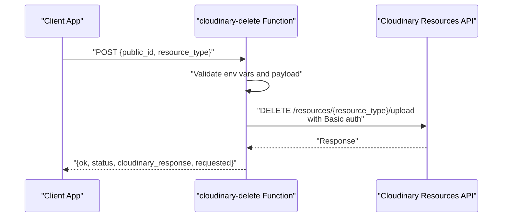
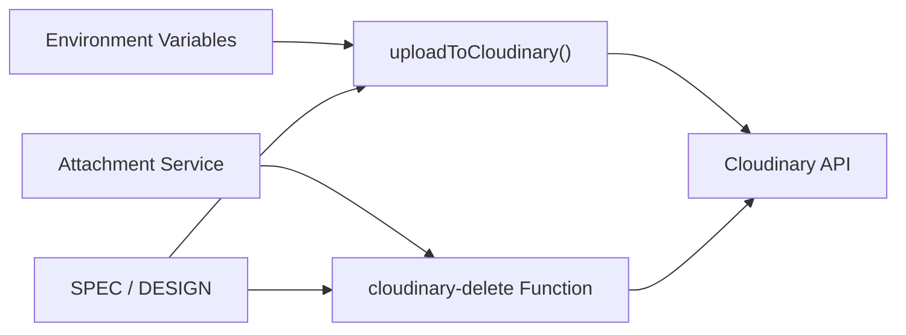

# Media Processing and Storage

<cite>
**Referenced Files in This Document**
- [cloudinary.ts](file://src/utils/cloudinary.ts)
- [attachments.service.ts](file://src/services/attachments.service.ts)
- [cloudinary-delete/index.ts](file://supabase/functions/cloudinary-delete/index.ts)
- [SPEC.md](file://SPEC.md)
- [DESIGN.md](file://DESIGN.md)
- [vite-env.d.ts](file://src/vite-env.d.ts)
- [Cloudinary.md](file://Cloudinary.md)
</cite>

## Table of Contents
1. [Introduction](#introduction)
2. [Project Structure](#project-structure)
3. [Core Components](#core-components)
4. [Architecture Overview](#architecture-overview)
5. [Detailed Component Analysis](#detailed-component-analysis)
6. [Dependency Analysis](#dependency-analysis)
7. [Performance Considerations](#performance-considerations)
8. [Troubleshooting Guide](#troubleshooting-guide)
9. [Conclusion](#conclusion)
10. [Appendices](#appendices)

## Introduction
This document explains how AbsensiOnline integrates Cloudinary for media processing and storage. It covers automatic image optimization, responsive breakpoints, and format conversion via Cloudinary transformations; the folder organization under absensi/${folder}; resource type handling; metadata returned by Cloudinary; secure_url generation, public_id management, and file size tracking; storage quotas and retention considerations; and cost optimization strategies. Practical examples demonstrate transformation parameters, CDN delivery optimization, and best practices for organizing attendance-related media assets.

## Project Structure
Cloudinary integration spans client-side utilities, backend Supabase Edge Functions, and configuration files:
- Client-side upload utility encapsulates Cloudinary auto upload and returns structured metadata.
- Backend deletion function removes Cloudinary resources securely via signed requests.
- Environment variables configure Cloudinary credentials and presets.
- Specifications and design documents define configuration and usage expectations.

**Diagram sources**
- [cloudinary.ts:11-62](file://src/utils/cloudinary.ts#L11-L62)
- [attachments.service.ts:4-46](file://src/services/attachments.service.ts#L4-L46)
- [cloudinary-delete/index.ts:1-70](file://supabase/functions/cloudinary-delete/index.ts#L1-L70)
- [vite-env.d.ts:5-6](file://src/vite-env.d.ts#L5-L6)
- [SPEC.md:13-200](file://SPEC.md#L13-L200)

**Section sources**
- [cloudinary.ts:11-62](file://src/utils/cloudinary.ts#L11-L62)
- [attachments.service.ts:4-46](file://src/services/attachments.service.ts#L4-L46)
- [cloudinary-delete/index.ts:1-70](file://supabase/functions/cloudinary-delete/index.ts#L1-L70)
- [vite-env.d.ts:5-6](file://src/vite-env.d.ts#L5-L6)
- [SPEC.md:13-200](file://SPEC.md#L13-L200)

## Core Components
- Cloudinary upload utility: Performs unsigned uploads with an upload preset, appends a folder path under absensi/${folder}, and parses the Cloudinary response to return secure_url, public_id, format, bytes, and resource_type.
- Attachment service: Extracts public_id and resource_type from Cloudinary URLs for downstream operations such as deletion.
- Supabase Edge Function: Accepts a public_id and resource_type, validates environment variables, and deletes the resource via Cloudinary’s API using Basic authentication.
- Configuration: Environment variables define Cloudinary cloud name and upload preset; TypeScript declarations ensure compile-time checks.

Key behaviors:
- Folder organization: All uploads target the absensi/${folder} path.
- Resource type: Defaults to image when parsing URLs; deletion function accepts resource_type with a default fallback.
- Metadata: Returned by Cloudinary and consumed by the application for display and analytics.

**Section sources**
- [cloudinary.ts:3-9](file://src/utils/cloudinary.ts#L3-L9)
- [cloudinary.ts:11-62](file://src/utils/cloudinary.ts#L11-L62)
- [attachments.service.ts:4-18](file://src/services/attachments.service.ts#L4-L18)
- [cloudinary-delete/index.ts:13-40](file://supabase/functions/cloudinary-delete/index.ts#L13-L40)
- [vite-env.d.ts:5-6](file://src/vite-env.d.ts#L5-L6)
- [SPEC.md:13-200](file://SPEC.md#L13-L200)

## Architecture Overview
The system supports two primary flows: upload and deletion.

Upload flow:
- Client composes FormData with file, upload_preset, and folder.
- Sends to Cloudinary auto upload endpoint.
- Receives structured response containing secure_url, public_id, format, bytes, and resource_type.

Deletion flow:
- Client extracts public_id and resource_type from a stored URL.
- Calls Supabase Edge Function with public_id and resource_type.
- Function authenticates against Cloudinary API using Basic auth and deletes the resource.
- Returns standardized response with ok, status, and requested details.

**Diagram sources**
- [cloudinary.ts:11-62](file://src/utils/cloudinary.ts#L11-L62)
- [cloudinary-delete/index.ts:13-70](file://supabase/functions/cloudinary-delete/index.ts#L13-L70)

## Detailed Component Analysis

### Upload Utility: Automatic Image Optimization and Folder Organization
- Purpose: Perform unsigned uploads using an upload preset and organize assets under absensi/${folder}.
- Folder organization: The folder parameter is appended as absensi/${folder}, ensuring tenant-like separation.
- Metadata: The response includes secure_url, public_id, format, bytes, and resource_type.
- Progress reporting: Optional onProgress callback receives percentage updates during upload.

Transformation parameters (examples):
- f_auto: Automatically selects the optimal image format based on browser support.
- q_auto: Automatically optimizes quality based on image content and delivery context.
- c_limit for responsive breakpoints: Use c_limit with width and height constraints to generate multiple sizes for responsive layouts.

CDN delivery optimization:
- Use secure_url for HTTPS delivery.
- Combine f_auto and q_auto for adaptive optimization.
- Leverage c_limit to pre-generate sizes aligned with common viewport widths.

Best practices for attendance-related assets:
- Use descriptive subfolders under absensi/${folder} (e.g., photos/daily_reports, signatures/workers).
- Store original assets and derive optimized variants via transformations.
- Track bytes to monitor storage growth and optimize retention.

**Section sources**
- [cloudinary.ts:3-9](file://src/utils/cloudinary.ts#L3-L9)
- [cloudinary.ts:11-62](file://src/utils/cloudinary.ts#L11-L62)
- [SPEC.md:553-557](file://SPEC.md#L553-L557)

### Attachment Service: Public ID Extraction and Deletion Coordination
- Purpose: Parse Cloudinary URLs to extract public_id and resource_type.
- Robustness: Handles version segments and file extensions; defaults resource_type to image when absent.
- Deletion coordination: Supplies parsed identifiers to the Edge Function for safe removal.

**Diagram sources**
- [attachments.service.ts:4-18](file://src/services/attachments.service.ts#L4-L18)

**Section sources**
- [attachments.service.ts:4-18](file://src/services/attachments.service.ts#L4-L18)

### Supabase Edge Function: Secure Deletion
- Purpose: Delete Cloudinary resources via signed requests using Basic authentication.
- Validation: Requires public_id; logs environment variable presence for diagnostics.
- Endpoint: Uses Cloudinary’s resources API with resource_type and public_ids array.
- Response: Standardized shape including ok, status, and requested details for auditing.

**Diagram sources**
- [cloudinary-delete/index.ts:13-70](file://supabase/functions/cloudinary-delete/index.ts#L13-L70)

**Section sources**
- [cloudinary-delete/index.ts:13-70](file://supabase/functions/cloudinary-delete/index.ts#L13-L70)

### Configuration and Environment
- Cloudinary cloud name and upload preset are configured via environment variables.
- TypeScript declaration ensures compile-time checks for these variables.
- Specifications document expected keys and usage contexts.

**Section sources**
- [vite-env.d.ts:5-6](file://src/vite-env.d.ts#L5-L6)
- [SPEC.md:13-200](file://SPEC.md#L13-L200)
- [DESIGN.md:448-468](file://DESIGN.md#L448-L468)

## Dependency Analysis
- Client utility depends on environment variables for Cloudinary configuration.
- Attachment service depends on URL parsing logic to extract identifiers for deletion.
- Edge Function depends on Cloudinary API credentials and resource_type for deletion.
- Specification documents define expected behavior and configuration.

**Diagram sources**
- [cloudinary.ts:15-21](file://src/utils/cloudinary.ts#L15-L21)
- [attachments.service.ts:20-46](file://src/services/attachments.service.ts#L20-L46)
- [cloudinary-delete/index.ts:23-40](file://supabase/functions/cloudinary-delete/index.ts#L23-L40)
- [SPEC.md:13-200](file://SPEC.md#L13-L200)

**Section sources**
- [cloudinary.ts:15-21](file://src/utils/cloudinary.ts#L15-L21)
- [attachments.service.ts:20-46](file://src/services/attachments.service.ts#L20-L46)
- [cloudinary-delete/index.ts:23-40](file://supabase/functions/cloudinary-delete/index.ts#L23-L40)
- [SPEC.md:13-200](file://SPEC.md#L13-L200)

## Performance Considerations
- Use f_auto and q_auto to reduce bandwidth and improve load times.
- Pre-generate sizes with c_limit aligned to common device widths to minimize client-side resizing.
- Monitor bytes returned by Cloudinary to track growth and plan retention.
- Offload transformations to Cloudinary’s CDN to reduce server CPU and memory usage.
- Batch deletions by resource_type and public_ids to minimize API round trips.

[No sources needed since this section provides general guidance]

## Troubleshooting Guide
Common issues and resolutions:
- Missing configuration: Ensure VITE_CLOUDINARY_CLOUD_NAME and VITE_CLOUDINARY_UPLOAD_PRESET are set; the upload utility returns a descriptive error if missing.
- Network errors: The upload utility surfaces connection failures and cancellation events.
- Invalid Cloudinary URL: The attachment service returns null when parsing fails; verify URL format and domain.
- Edge Function errors: The function validates environment variables and payload; check logs for missing keys and HTTP status codes.
- Transformation previews: Use the provided script to upload and transform an image; inspect the transformed URL to verify format and size.

**Section sources**
- [cloudinary.ts:19-21](file://src/utils/cloudinary.ts#L19-L21)
- [cloudinary.ts:52-58](file://src/utils/cloudinary.ts#L52-L58)
- [attachments.service.ts:15-17](file://src/services/attachments.service.ts#L15-L17)
- [cloudinary-delete/index.ts:16-21](file://supabase/functions/cloudinary-delete/index.ts#L16-L21)
- [Cloudinary.md:51-85](file://Cloudinary.md#L51-L85)

## Conclusion
AbsensiOnline leverages Cloudinary for efficient media ingestion, transformation, and deletion. The client-side upload utility organizes assets under absensi/${folder}, returns essential metadata, and integrates with CDN-delivered transformations. The Edge Function enables secure deletion using Basic authentication. By combining f_auto, q_auto, and c_limit, teams can optimize delivery and storage costs while maintaining high-quality visuals for attendance-related assets.

[No sources needed since this section summarizes without analyzing specific files]

## Appendices

### API Responses and Fields
- secure_url: HTTPS URL delivered by Cloudinary’s CDN.
- public_id: Unique identifier used for transformations and deletions.
- format: Detected or selected image format.
- bytes: File size in bytes.
- resource_type: Cloudinary resource type (defaults to image).

**Section sources**
- [cloudinary.ts:3-9](file://src/utils/cloudinary.ts#L3-L9)

### Transformation Examples
- f_auto: Selects optimal format (e.g., avif/webp) based on browser support.
- q_auto: Chooses quality automatically for balanced file size and perceived quality.
- c_limit w,h: Generates a constrained canvas for responsive breakpoints.

**Section sources**
- [SPEC.md:553-557](file://SPEC.md#L553-L557)

### Cost Optimization Strategies
- Prefer CDN-delivered transformations to avoid server-side computation.
- Use f_auto and q_auto to reduce file sizes.
- Archive or delete unused assets to control storage growth tracked by bytes.
- Apply c_limit to pre-generate commonly used sizes.

**Section sources**
- [SPEC.md:553-557](file://SPEC.md#L553-L557)