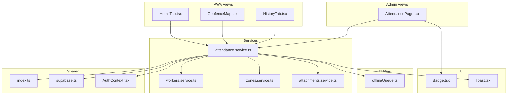
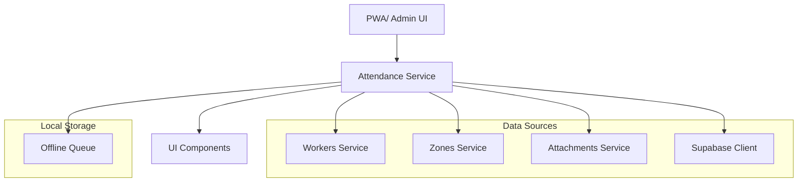
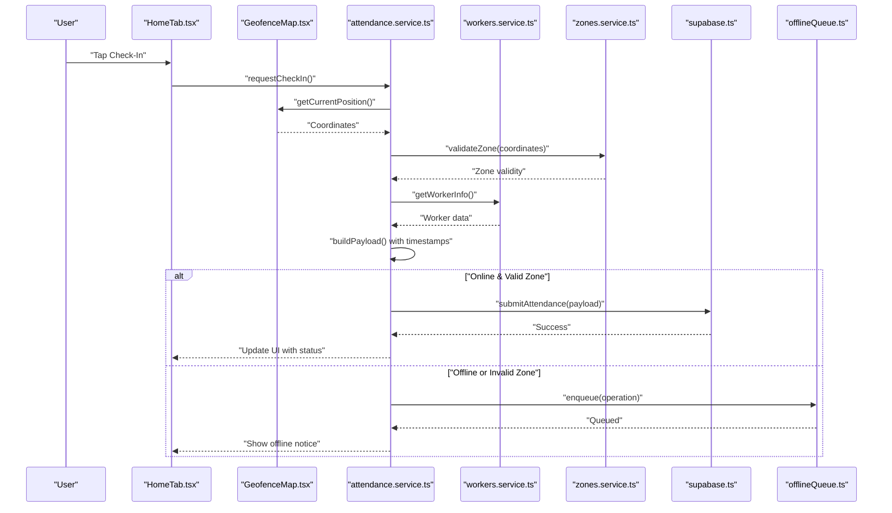
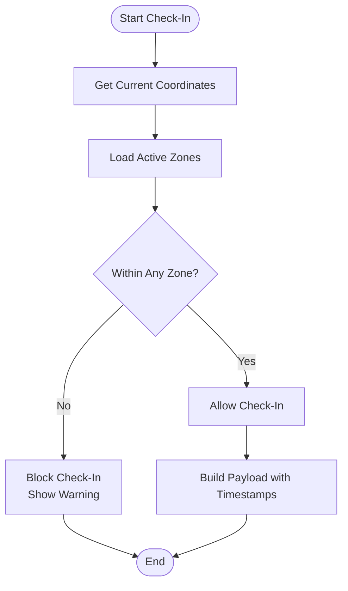
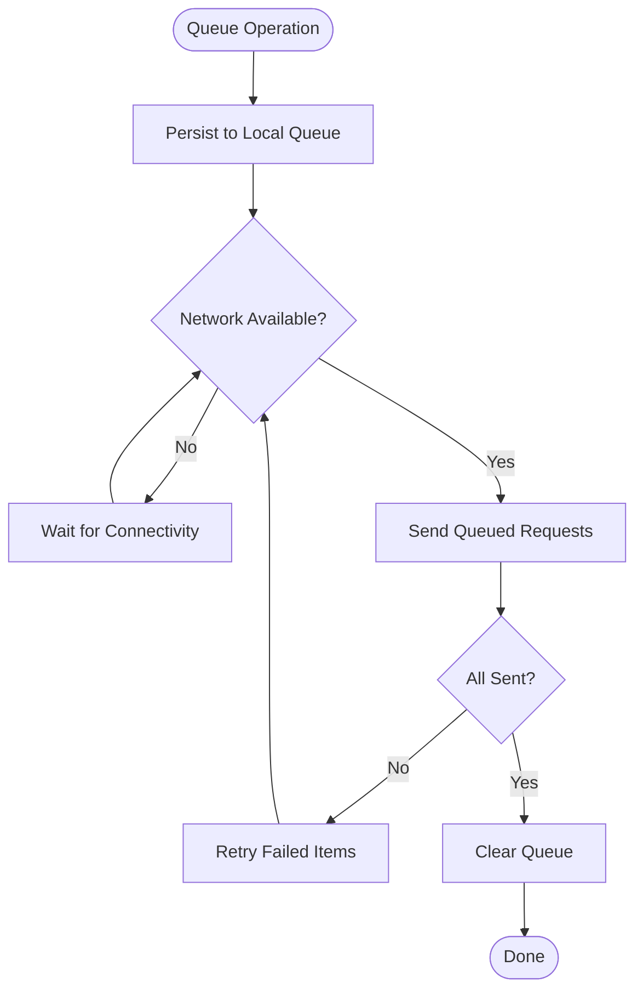
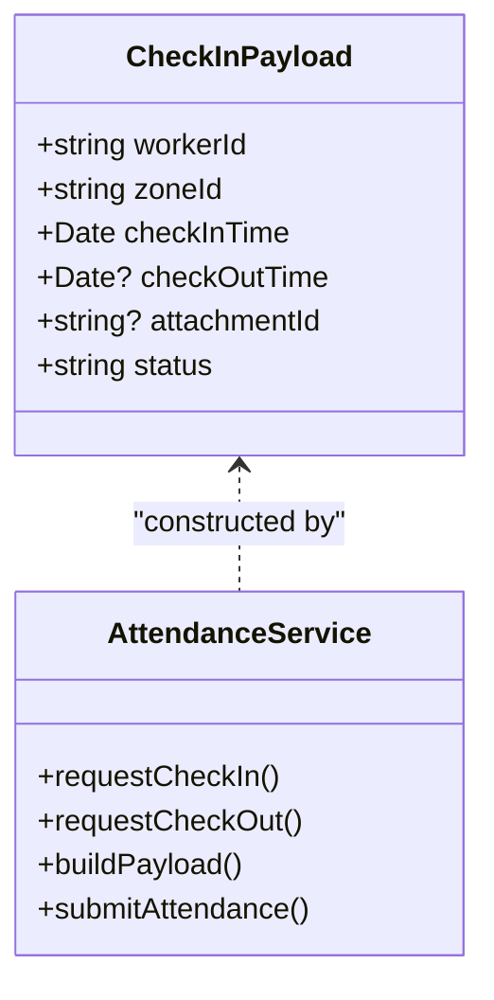
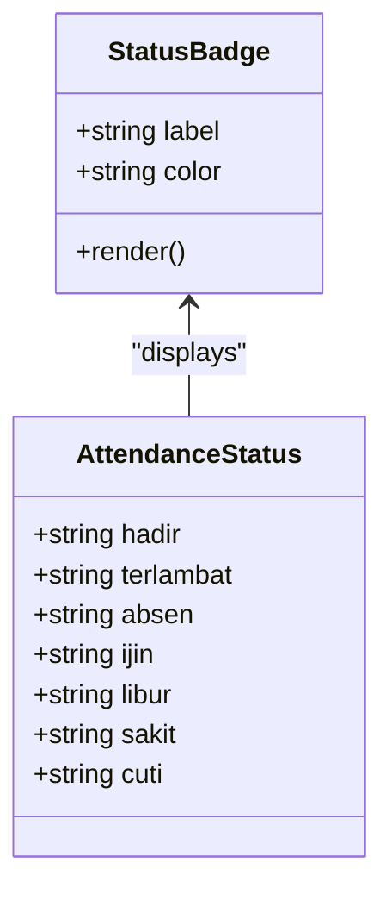
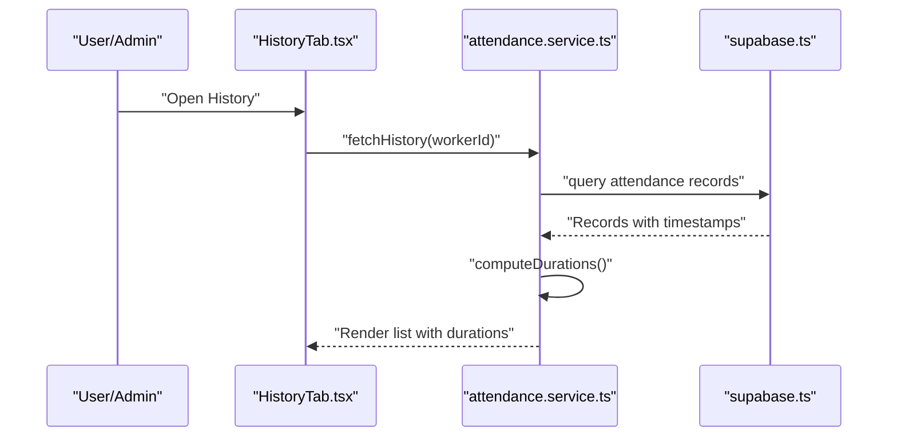
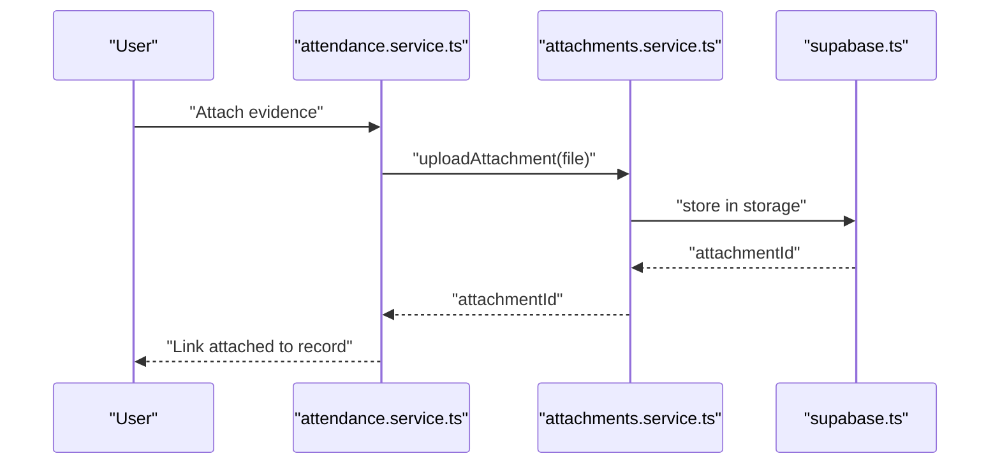
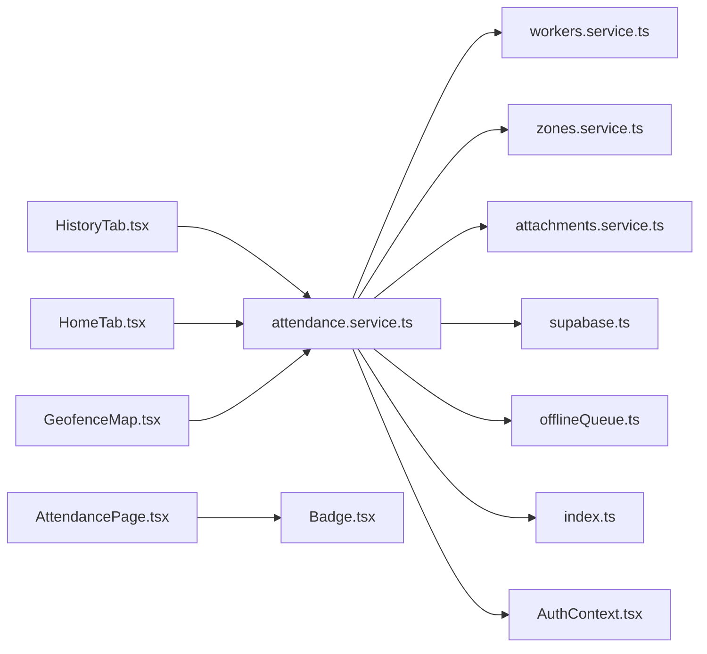

# Attendance Management

<cite>
**Referenced Files in This Document**
- [attendance.service.ts](file://src/services/attendance.service.ts)
- [offlineQueue.ts](file://src/utils/offlineQueue.ts)
- [GeofenceMap.tsx](file://src/components/pwa/GeofenceMap.tsx)
- [HomeTab.tsx](file://src/components/pwa/HomeTab.tsx)
- [HistoryTab.tsx](file://src/components/pwa/HistoryTab.tsx)
- [AttendancePage.tsx](file://src/components/admin/AttendancePage.tsx)
- [workers.service.ts](file://src/services/workers.service.ts)
- [zones.service.ts](file://src/services/zones.service.ts)
- [attachments.service.ts](file://src/services/attachments.service.ts)
- [Badge.tsx](file://src/components/ui/Badge.tsx)
- [Toast.tsx](file://src/components/ui/Toast.tsx)
- [AuthContext.tsx](file://src/context/AuthContext.tsx)
- [supabase.ts](file://src/config/supabase.ts)
- [index.ts](file://src/types/index.ts)
</cite>

## Table of Contents
1. [Introduction](#introduction)
2. [Project Structure](#project-structure)
3. [Core Components](#core-components)
4. [Architecture Overview](#architecture-overview)
5. [Detailed Component Analysis](#detailed-component-analysis)
6. [Dependency Analysis](#dependency-analysis)
7. [Performance Considerations](#performance-considerations)
8. [Troubleshooting Guide](#troubleshooting-guide)
9. [Conclusion](#conclusion)

## Introduction
This document provides comprehensive documentation for the Attendance Management feature. It covers the check-in/check-out workflow, GPS validation, geofencing implementation, offline queue functionality, payload submission, worker identification, zone validation, timestamp handling, attendance status management, history system, duration calculation, and attachment integration. Practical examples, error handling scenarios, and performance considerations are included to guide both developers and administrators.

## Project Structure
The Attendance Management feature spans frontend components, services, utilities, and shared types. Key areas include:
- Services for attendance operations, worker data, zones, and attachments
- PWA tabs for geofencing, home, and history views
- Offline queue utility for asynchronous submissions
- UI components for badges and toast notifications
- Shared types and Supabase configuration

**Diagram sources**
- [HomeTab.tsx](file://src/components/pwa/HomeTab.tsx)
- [GeofenceMap.tsx](file://src/components/pwa/GeofenceMap.tsx)
- [HistoryTab.tsx](file://src/components/pwa/HistoryTab.tsx)
- [AttendancePage.tsx](file://src/components/admin/AttendancePage.tsx)
- [attendance.service.ts](file://src/services/attendance.service.ts)
- [workers.service.ts](file://src/services/workers.service.ts)
- [zones.service.ts](file://src/services/zones.service.ts)
- [attachments.service.ts](file://src/services/attachments.service.ts)
- [offlineQueue.ts](file://src/utils/offlineQueue.ts)
- [Badge.tsx](file://src/components/ui/Badge.tsx)
- [Toast.tsx](file://src/components/ui/Toast.tsx)
- [AuthContext.tsx](file://src/context/AuthContext.tsx)
- [supabase.ts](file://src/config/supabase.ts)
- [index.ts](file://src/types/index.ts)

**Section sources**
- [attendance.service.ts](file://src/services/attendance.service.ts)
- [offlineQueue.ts](file://src/utils/offlineQueue.ts)
- [GeofenceMap.tsx](file://src/components/pwa/GeofenceMap.tsx)
- [HomeTab.tsx](file://src/components/pwa/HomeTab.tsx)
- [HistoryTab.tsx](file://src/components/pwa/HistoryTab.tsx)
- [AttendancePage.tsx](file://src/components/admin/AttendancePage.tsx)
- [workers.service.ts](file://src/services/workers.service.ts)
- [zones.service.ts](file://src/services/zones.service.ts)
- [attachments.service.ts](file://src/services/attachments.service.ts)
- [Badge.tsx](file://src/components/ui/Badge.tsx)
- [Toast.tsx](file://src/components/ui/Toast.tsx)
- [AuthContext.tsx](file://src/context/AuthContext.tsx)
- [supabase.ts](file://src/config/supabase.ts)
- [index.ts](file://src/types/index.ts)

## Core Components
- Attendance service orchestrates check-in/check-out, payload construction, and submission to backend via Supabase.
- Offline queue buffers operations when network is unavailable, ensuring eventual delivery.
- Geofencing map validates proximity to designated zones during check-in.
- Worker and zone services provide identity and boundary data.
- Attachment service integrates evidence images/documents.
- UI badge and toast components present status and feedback.
- Shared types define payloads and statuses consistently across the app.

Key responsibilities:
- Real-time GPS validation and geofencing checks
- Worker identification and shift-aware status computation
- Timestamp handling and duration calculation
- Status labeling and color coding for attendance outcomes
- History rendering and attachment previews

**Section sources**
- [attendance.service.ts](file://src/services/attendance.service.ts)
- [offlineQueue.ts](file://src/utils/offlineQueue.ts)
- [GeofenceMap.tsx](file://src/components/pwa/GeofenceMap.tsx)
- [workers.service.ts](file://src/services/workers.service.ts)
- [zones.service.ts](file://src/services/zones.service.ts)
- [attachments.service.ts](file://src/services/attachments.service.ts)
- [Badge.tsx](file://src/components/ui/Badge.tsx)
- [Toast.tsx](file://src/components/ui/Toast.tsx)
- [index.ts](file://src/types/index.ts)

## Architecture Overview
The system follows a layered architecture:
- Presentation layer: PWA tabs and admin pages
- Business logic layer: Attendance service and supporting services
- Persistence layer: Supabase client and local offline queue
- Shared contracts: TypeScript types and UI components

**Diagram sources**
- [attendance.service.ts](file://src/services/attendance.service.ts)
- [workers.service.ts](file://src/services/workers.service.ts)
- [zones.service.ts](file://src/services/zones.service.ts)
- [attachments.service.ts](file://src/services/attachments.service.ts)
- [offlineQueue.ts](file://src/utils/offlineQueue.ts)
- [supabase.ts](file://src/config/supabase.ts)

## Detailed Component Analysis

### Check-In/Check-Out Workflow
The workflow integrates GPS validation, geofencing, and offline capabilities:
- User initiates check-in from Home tab or Geofence map
- System retrieves current position and validates against configured zones
- If inside a valid zone, constructs payload and submits immediately
- If outside zone or offline, queues operation locally for later retry
- On successful submission, updates UI with status and attachment preview

**Diagram sources**
- [HomeTab.tsx](file://src/components/pwa/HomeTab.tsx)
- [GeofenceMap.tsx](file://src/components/pwa/GeofenceMap.tsx)
- [attendance.service.ts](file://src/services/attendance.service.ts)
- [workers.service.ts](file://src/services/workers.service.ts)
- [zones.service.ts](file://src/services/zones.service.ts)
- [offlineQueue.ts](file://src/utils/offlineQueue.ts)
- [supabase.ts](file://src/config/supabase.ts)

**Section sources**
- [HomeTab.tsx](file://src/components/pwa/HomeTab.tsx)
- [GeofenceMap.tsx](file://src/components/pwa/GeofenceMap.tsx)
- [attendance.service.ts](file://src/services/attendance.service.ts)
- [offlineQueue.ts](file://src/utils/offlineQueue.ts)

### GPS Validation and Geofencing Implementation
- Position retrieval uses device APIs exposed through the Geofence map component
- Zone boundaries are fetched from the zones service and validated against coordinates
- Validation ensures the user is within a permitted radius before allowing check-in
- Invalid locations trigger warnings and prevent submission

**Diagram sources**
- [GeofenceMap.tsx](file://src/components/pwa/GeofenceMap.tsx)
- [zones.service.ts](file://src/services/zones.service.ts)
- [attendance.service.ts](file://src/services/attendance.service.ts)

**Section sources**
- [GeofenceMap.tsx](file://src/components/pwa/GeofenceMap.tsx)
- [zones.service.ts](file://src/services/zones.service.ts)
- [attendance.service.ts](file://src/services/attendance.service.ts)

### Offline Queue Functionality
- Operations are queued locally when network is unavailable or zone validation fails
- Queue persists across sessions and retries submission on connectivity restore
- UI notifies users about pending operations and allows manual retry

**Diagram sources**
- [offlineQueue.ts](file://src/utils/offlineQueue.ts)
- [attendance.service.ts](file://src/services/attendance.service.ts)

**Section sources**
- [offlineQueue.ts](file://src/utils/offlineQueue.ts)
- [attendance.service.ts](file://src/services/attendance.service.ts)

### CheckInPayload Interface and Submission Process
- Payload includes worker identifier, zone information, timestamps, and optional attachments
- Submission routes through the attendance service to Supabase
- Worker identification ensures the logged-in user’s data is associated with the record
- Zone validation prevents out-of-bounds check-ins
- Timestamp handling captures precise check-in/out moments for duration calculations

**Diagram sources**
- [attendance.service.ts](file://src/services/attendance.service.ts)
- [index.ts](file://src/types/index.ts)

**Section sources**
- [attendance.service.ts](file://src/services/attendance.service.ts)
- [index.ts](file://src/types/index.ts)

### Attendance Status Management
Statuses include:
- Hadir (Present)
- Terlambat (Late)
- Absen (Absent)
- Ijin (Permission)
- Libur (Holiday)
- Sakit (Sick)
- Cuti (Leave)

Each status is represented with a label and color-coded badge for quick recognition.

**Diagram sources**
- [Badge.tsx](file://src/components/ui/Badge.tsx)
- [index.ts](file://src/types/index.ts)

**Section sources**
- [Badge.tsx](file://src/components/ui/Badge.tsx)
- [index.ts](file://src/types/index.ts)

### Attendance History System and Duration Calculation
- History tab displays past check-ins/check-outs with status and timestamps
- Duration is computed as check-out time minus check-in time
- Attachments are linked for evidence viewing
- Admin page aggregates reports and supports filtering

**Diagram sources**
- [HistoryTab.tsx](file://src/components/pwa/HistoryTab.tsx)
- [attendance.service.ts](file://src/services/attendance.service.ts)
- [supabase.ts](file://src/config/supabase.ts)

**Section sources**
- [HistoryTab.tsx](file://src/components/pwa/HistoryTab.tsx)
- [attendance.service.ts](file://src/services/attendance.service.ts)
- [supabase.ts](file://src/config/supabase.ts)

### Attachment Integration
- Attachments are uploaded via the attachments service and linked to attendance records
- Evidence images/documents enhance auditability
- Preview and deletion controls are integrated into history and admin views

**Diagram sources**
- [attendance.service.ts](file://src/services/attendance.service.ts)
- [attachments.service.ts](file://src/services/attachments.service.ts)
- [supabase.ts](file://src/config/supabase.ts)

**Section sources**
- [attendance.service.ts](file://src/services/attendance.service.ts)
- [attachments.service.ts](file://src/services/attachments.service.ts)
- [supabase.ts](file://src/config/supabase.ts)

### Practical Examples
- Check-in at work: User taps Check-In on Home tab; GPS validated; zone confirmed; payload submitted; status badge updates.
- Late check-in: Same flow; status labeled as late; duration reflects adjusted timing.
- Absent record: Manual absence entry via admin; status set accordingly; no GPS required.
- Permission/leave: Admin sets status to ijin/cuti; duration handled as applicable.
- Offline scenario: Out-of-zone or no signal; operation queued; notification shown; retry on reconnect.

**Section sources**
- [HomeTab.tsx](file://src/components/pwa/HomeTab.tsx)
- [GeofenceMap.tsx](file://src/components/pwa/GeofenceMap.tsx)
- [AttendancePage.tsx](file://src/components/admin/AttendancePage.tsx)
- [offlineQueue.ts](file://src/utils/offlineQueue.ts)
- [Badge.tsx](file://src/components/ui/Badge.tsx)

### Error Handling Scenarios
- GPS permission denied or unavailable: Prompt user to enable permissions; block check-in until resolved.
- Zone validation failure: Show warning and prevent submission; suggest moving closer to the zone.
- Network errors: Enqueue operation; notify user; retry on reconnection.
- Duplicate or invalid payloads: Backend validation rejects; show error via toast; allow correction.
- Attachment upload failures: Re-attempt upload; inform user; allow retry.

**Section sources**
- [GeofenceMap.tsx](file://src/components/pwa/GeofenceMap.tsx)
- [offlineQueue.ts](file://src/utils/offlineQueue.ts)
- [Toast.tsx](file://src/components/ui/Toast.tsx)
- [attendance.service.ts](file://src/services/attendance.service.ts)

## Dependency Analysis
The attendance subsystem exhibits strong cohesion around the attendance service while depending on workers, zones, attachments, Supabase, and offline queue utilities. UI components depend on shared types and context for authentication.

**Diagram sources**
- [attendance.service.ts](file://src/services/attendance.service.ts)
- [workers.service.ts](file://src/services/workers.service.ts)
- [zones.service.ts](file://src/services/zones.service.ts)
- [attachments.service.ts](file://src/services/attachments.service.ts)
- [offlineQueue.ts](file://src/utils/offlineQueue.ts)
- [supabase.ts](file://src/config/supabase.ts)
- [index.ts](file://src/types/index.ts)
- [AuthContext.tsx](file://src/context/AuthContext.tsx)
- [AttendancePage.tsx](file://src/components/admin/AttendancePage.tsx)
- [HistoryTab.tsx](file://src/components/pwa/HistoryTab.tsx)
- [HomeTab.tsx](file://src/components/pwa/HomeTab.tsx)
- [GeofenceMap.tsx](file://src/components/pwa/GeofenceMap.tsx)
- [Badge.tsx](file://src/components/ui/Badge.tsx)

**Section sources**
- [attendance.service.ts](file://src/services/attendance.service.ts)
- [workers.service.ts](file://src/services/workers.service.ts)
- [zones.service.ts](file://src/services/zones.service.ts)
- [attachments.service.ts](file://src/services/attachments.service.ts)
- [offlineQueue.ts](file://src/utils/offlineQueue.ts)
- [supabase.ts](file://src/config/supabase.ts)
- [index.ts](file://src/types/index.ts)
- [AuthContext.tsx](file://src/context/AuthContext.tsx)
- [AttendancePage.tsx](file://src/components/admin/AttendancePage.tsx)
- [HistoryTab.tsx](file://src/components/pwa/HistoryTab.tsx)
- [HomeTab.tsx](file://src/components/pwa/HomeTab.tsx)
- [GeofenceMap.tsx](file://src/components/pwa/GeofenceMap.tsx)
- [Badge.tsx](file://src/components/ui/Badge.tsx)

## Performance Considerations
- Real-time location validation: Debounce frequent position updates; cache recent zone validations; limit precision to reduce battery drain.
- Data synchronization: Batch offline queue submissions; prioritize recent entries; implement exponential backoff on failures.
- UI responsiveness: Render placeholders for attachments; lazy-load history items; virtualize long lists.
- Backend efficiency: Use indexed queries on timestamps and worker identifiers; paginate history; compress image attachments where supported.
- Caching: Persist worker and zone metadata locally; invalidate on configuration changes.

[No sources needed since this section provides general guidance]

## Troubleshooting Guide
- Check-in blocked unexpectedly: Verify GPS permissions and location accuracy; confirm zone boundaries; ensure device time is correct.
- Offline queue not sending: Check connectivity; review queue persistence; inspect retry logs; manually retry failed items.
- Incorrect status: Review shift rules and late thresholds; verify timestamps; reconcile with admin settings.
- Attachment issues: Confirm upload completion; check storage limits; validate file types; retry upload if needed.
- UI not updating: Refresh page; clear browser cache; confirm authentication context; check toast notifications for errors.

**Section sources**
- [GeofenceMap.tsx](file://src/components/pwa/GeofenceMap.tsx)
- [offlineQueue.ts](file://src/utils/offlineQueue.ts)
- [Toast.tsx](file://src/components/ui/Toast.tsx)
- [AuthContext.tsx](file://src/context/AuthContext.tsx)

## Conclusion
The Attendance Management feature integrates robust GPS validation, geofencing, offline support, and a comprehensive status system. By leveraging the attendance service, supporting utilities, and shared types, the system ensures accurate, reliable, and user-friendly attendance tracking. Administrators benefit from detailed reporting and attachment handling, while end-users enjoy intuitive check-in/out experiences with clear status feedback.

[No sources needed since this section summarizes without analyzing specific files]