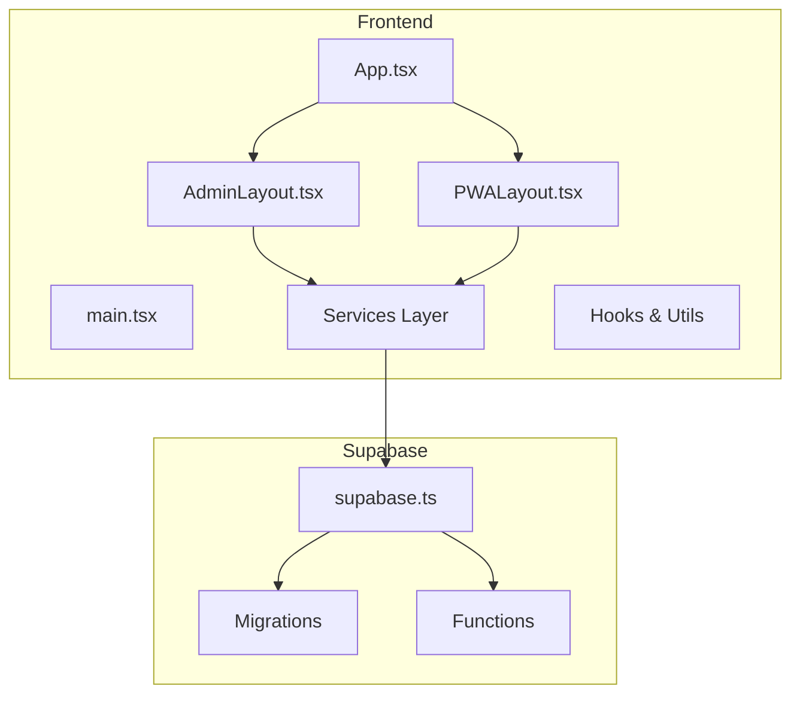
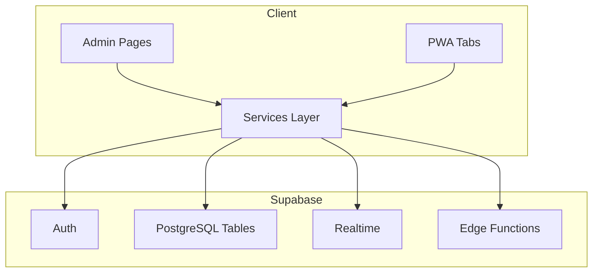
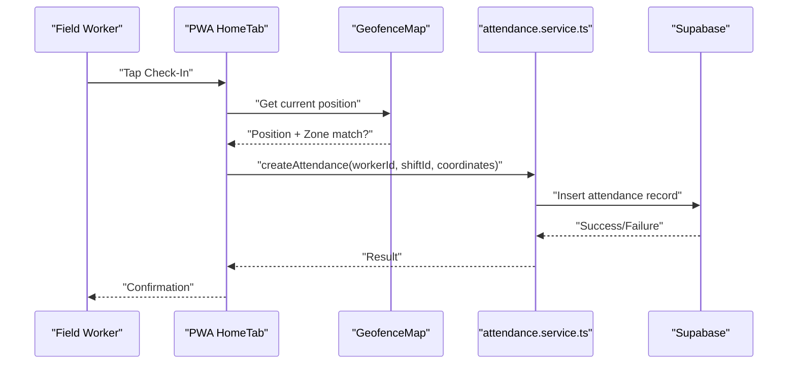
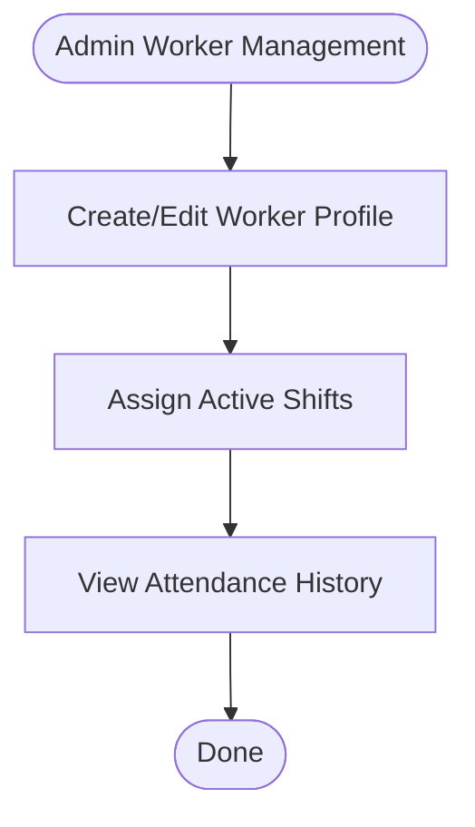
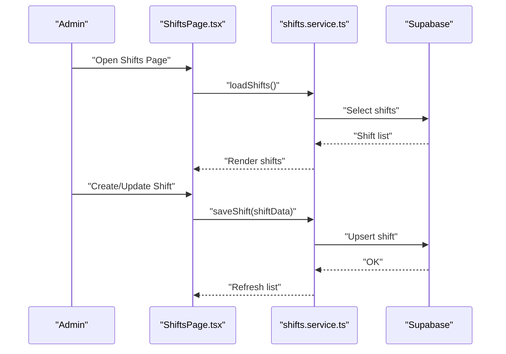
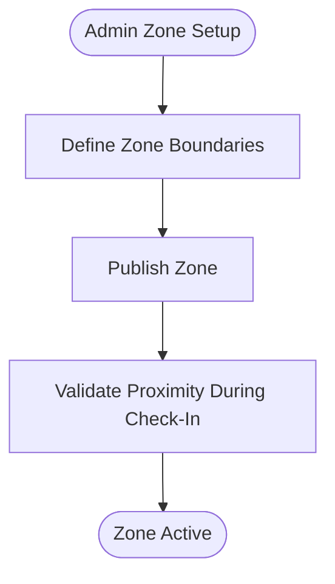
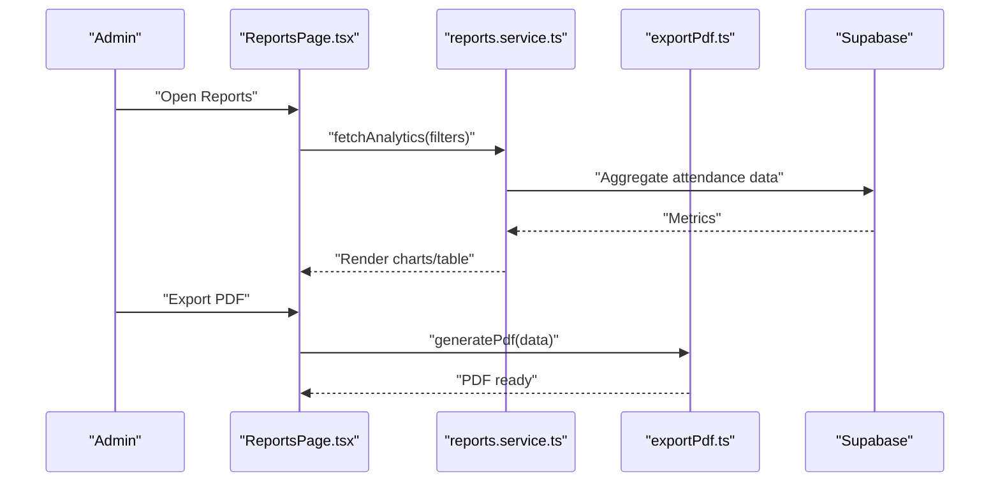
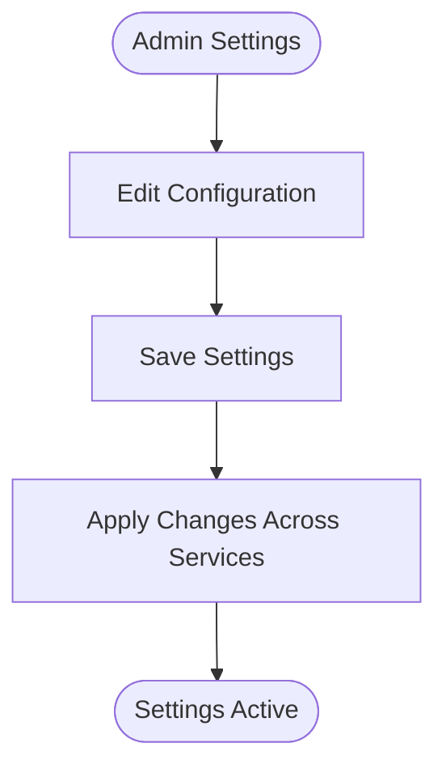
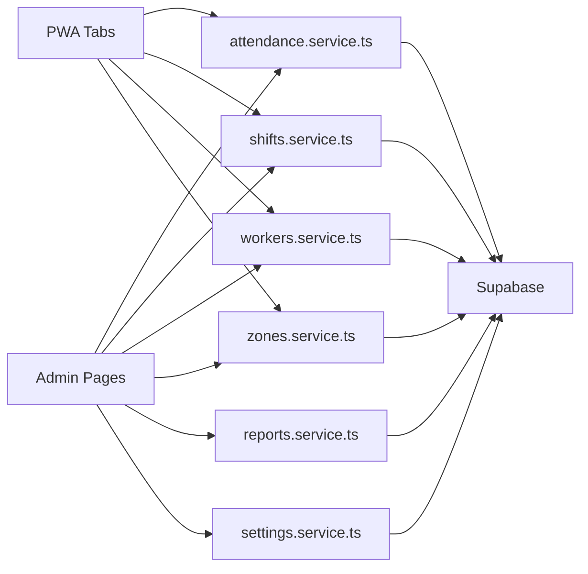

# Core Features

<cite>
**Referenced Files in This Document**
- [App.tsx](file://src/App.tsx)
- [main.tsx](file://src/main.tsx)
- [supabase.ts](file://src/config/supabase.ts)
- [AuthContext.tsx](file://src/context/AuthContext.tsx)
- [ProtectedRoute.tsx](file://src/components/ProtectedRoute.tsx)
- [Login.tsx](file://src/components/Login.tsx)
- [AdminLayout.tsx](file://src/components/admin/AdminLayout.tsx)
- [PWALayout.tsx](file://src/components/pwa/PWALayout.tsx)
- [AttendancePage.tsx](file://src/components/admin/AttendancePage.tsx)
- [Dashboard.tsx](file://src/components/admin/Dashboard.tsx)
- [ReportsPage.tsx](file://src/components/admin/ReportsPage.tsx)
- [SettingsPage.tsx](file://src/components/admin/SettingsPage.tsx)
- [ShiftsPage.tsx](file://src/components/admin/ShiftsPage.tsx)
- [WorkersPage.tsx](file://src/components/admin/WorkersPage.tsx)
- [ZonesPage.tsx](file://src/components/admin/ZonesPage.tsx)
- [GeofenceMap.tsx](file://src/components/pwa/GeofenceMap.tsx)
- [HomeTab.tsx](file://src/components/pwa/HomeTab.tsx)
- [HistoryTab.tsx](file://src/components/pwa/HistoryTab.tsx)
- [ProfileTab.tsx](file://src/components/pwa/ProfileTab.tsx)
- [attendance.service.ts](file://src/services/attendance.service.ts)
- [shifts.service.ts](file://src/services/shifts.service.ts)
- [workers.service.ts](file://src/services/workers.service.ts)
- [zones.service.ts](file://src/services/zones.service.ts)
- [reports.service.ts](file://src/services/reports.service.ts)
- [settings.service.ts](file://src/services/settings.service.ts)
- [attachments.service.ts](file://src/services/attachments.service.ts)
- [useAuth.ts](file://src/hooks/useAuth.ts)
- [useSupabaseQuery.ts](file://src/hooks/useSupabaseQuery.ts)
- [offlineQueue.ts](file://src/utils/offlineQueue.ts)
- [exportPdf.ts](file://src/utils/exportPdf.ts)
- [index.ts](file://src/types/index.ts)
- [001_initial.sql](file://supabase/migrations/001_initial.sql)
- [009_app_settings.sql](file://supabase/migrations/009_app_settings.sql)
- [admin-user/index.ts](file://supabase/functions/admin-user/index.ts)
- [seed-auth/index.ts](file://supabase/functions/seed-auth/index.ts)
- [test-zone-update/index.ts](file://supabase/functions/test-zone-update/index.ts)
</cite>

## Table of Contents
1. [Introduction](#introduction)
2. [Project Structure](#project-structure)
3. [Core Components](#core-components)
4. [Architecture Overview](#architecture-overview)
5. [Detailed Component Analysis](#detailed-component-analysis)
6. [Dependency Analysis](#dependency-analysis)
7. [Performance Considerations](#performance-considerations)
8. [Troubleshooting Guide](#troubleshooting-guide)
9. [Conclusion](#conclusion)
10. [Appendices](#appendices)

## Introduction
AbsensiOnline is a location-aware attendance management platform designed for workforce tracking across defined geographic zones. It integrates a React-based frontend with Supabase for authentication, real-time data, and serverless functions, alongside a PWA client enabling offline-first experiences. The core feature areas include:
- Attendance Management: Check-in/check-out, geofencing, and history tracking
- User Management: Worker profiles, roles, and access control
- Shift Scheduling: Shift templates, assignments, and schedules
- Zone Management: Geographic boundaries and geofence enforcement
- Reporting Analytics: Attendance summaries, productivity metrics, and exportable reports

These features are orchestrated through a service layer that communicates with Supabase tables and functions, ensuring secure, scalable, and maintainable operations.

## Project Structure
The application follows a modular structure:
- Frontend (React + TypeScript): UI components, layouts, services, hooks, and utilities
- Supabase Backend: Authentication, RLS policies, migrations, and serverless functions
- PWA Client: Dedicated tabbed interface for field workers with offline capabilities

**Diagram sources**
- [App.tsx](file://src/App.tsx)
- [main.tsx](file://src/main.tsx)
- [AdminLayout.tsx](file://src/components/admin/AdminLayout.tsx)
- [PWALayout.tsx](file://src/components/pwa/PWALayout.tsx)
- [supabase.ts](file://src/config/supabase.ts)

**Section sources**
- [App.tsx](file://src/App.tsx)
- [main.tsx](file://src/main.tsx)
- [supabase.ts](file://src/config/supabase.ts)

## Core Components
- Authentication and Routing
  - Authentication context and protected routes enable role-based access to admin and PWA views.
  - Login component integrates with Supabase for sign-in/sign-up flows.
- Admin Dashboard
  - Centralized administration pages for attendance, reports, settings, shifts, workers, and zones.
- PWA Client
  - Tabbed interface for home (check-in/out), history, profile, and geofence map.
- Services Layer
  - Typed service modules encapsulate CRUD and analytics operations against Supabase tables and functions.
- Hooks and Utilities
  - Supabase query helpers, offline queue for PWA, PDF export utilities, and app settings.

**Section sources**
- [AuthContext.tsx](file://src/context/AuthContext.tsx)
- [ProtectedRoute.tsx](file://src/components/ProtectedRoute.tsx)
- [Login.tsx](file://src/components/Login.tsx)
- [AdminLayout.tsx](file://src/components/admin/AdminLayout.tsx)
- [PWALayout.tsx](file://src/components/pwa/PWALayout.tsx)
- [useAuth.ts](file://src/hooks/useAuth.ts)
- [useSupabaseQuery.ts](file://src/hooks/useSupabaseQuery.ts)
- [offlineQueue.ts](file://src/utils/offlineQueue.ts)
- [exportPdf.ts](file://src/utils/exportPdf.ts)

## Architecture Overview
The system architecture centers on Supabase as the backend backbone:
- Supabase Auth: User sessions, roles, and RLS
- Supabase Realtime: Live updates for attendance and zone changes
- Supabase Postgres: Structured storage for attendance, shifts, workers, zones, and settings
- Supabase Edge Functions: Serverless logic for admin tasks and diagnostics
- Frontend Services: Typed APIs to Supabase tables and functions

**Diagram sources**
- [supabase.ts](file://src/config/supabase.ts)
- [attendance.service.ts](file://src/services/attendance.service.ts)
- [shifts.service.ts](file://src/services/shifts.service.ts)
- [workers.service.ts](file://src/services/workers.service.ts)
- [zones.service.ts](file://src/services/zones.service.ts)
- [reports.service.ts](file://src/services/reports.service.ts)
- [settings.service.ts](file://src/services/settings.service.ts)

## Detailed Component Analysis

### Attendance Management
- Feature Scope
  - Check-in/check-out with geofencing verification
  - Attendance history and status tracking
  - Offline queue support for PWA
- Data Model
  - Attendance records linked to workers and shifts
  - Zone boundaries for geofence validation
- Workflows
  - PWA Home tab initiates check-in/out; geofence map validates proximity
  - Admin dashboard displays live attendance and historical summaries
- Service Integration
  - Attendance service handles insert/update/delete and queries
  - Offline queue buffers events until connectivity resumes
- Interdependencies
  - Requires active worker profile and valid shift assignment
  - Zone boundaries must be defined and up-to-date

**Diagram sources**
- [HomeTab.tsx](file://src/components/pwa/HomeTab.tsx)
- [GeofenceMap.tsx](file://src/components/pwa/GeofenceMap.tsx)
- [attendance.service.ts](file://src/services/attendance.service.ts)
- [offlineQueue.ts](file://src/utils/offlineQueue.ts)

**Section sources**
- [HomeTab.tsx](file://src/components/pwa/HomeTab.tsx)
- [GeofenceMap.tsx](file://src/components/pwa/GeofenceMap.tsx)
- [AttendancePage.tsx](file://src/components/admin/AttendancePage.tsx)
- [HistoryTab.tsx](file://src/components/pwa/HistoryTab.tsx)
- [attendance.service.ts](file://src/services/attendance.service.ts)
- [offlineQueue.ts](file://src/utils/offlineQueue.ts)

### User Management (Workers)
- Feature Scope
  - Worker profiles, contact info, and role assignments
  - Onboarding via admin or self-service flows
- Data Model
  - Worker records linked to attendance and shift assignments
- Workflows
  - Admin creates/edit worker profiles
  - Workers update personal info via PWA profile tab
- Service Integration
  - Workers service manages CRUD operations
  - Auth context ensures session-bound access

**Diagram sources**
- [WorkersPage.tsx](file://src/components/admin/WorkersPage.tsx)
- [workers.service.ts](file://src/services/workers.service.ts)

**Section sources**
- [WorkersPage.tsx](file://src/components/admin/WorkersPage.tsx)
- [workers.service.ts](file://src/services/workers.service.ts)
- [AuthContext.tsx](file://src/context/AuthContext.tsx)

### Shift Scheduling
- Feature Scope
  - Define shift templates and assign to workers
  - Schedule visibility and conflict detection
- Data Model
  - Shift definitions and assignments
- Workflows
  - Admin configures shifts and assigns to eligible workers
  - PWA displays applicable shifts for check-in
- Service Integration
  - Shifts service handles CRUD and lookup operations

**Diagram sources**
- [ShiftsPage.tsx](file://src/components/admin/ShiftsPage.tsx)
- [shifts.service.ts](file://src/services/shifts.service.ts)

**Section sources**
- [ShiftsPage.tsx](file://src/components/admin/ShiftsPage.tsx)
- [shifts.service.ts](file://src/services/shifts.service.ts)

### Zone Management
- Feature Scope
  - Define geographic zones for geofencing
  - Zone boundary updates and validation
- Data Model
  - Zone geometry and metadata
- Workflows
  - Admin defines zones; PWA verifies proximity during check-in
  - Zone change triggers revalidation of pending check-ins
- Service Integration
  - Zones service manages CRUD and spatial checks
  - Test function validates zone update logic

**Diagram sources**
- [ZonesPage.tsx](file://src/components/admin/ZonesPage.tsx)
- [zones.service.ts](file://src/services/zones.service.ts)
- [test-zone-update/index.ts](file://supabase/functions/test-zone-update/index.ts)

**Section sources**
- [ZonesPage.tsx](file://src/components/admin/ZonesPage.tsx)
- [zones.service.ts](file://src/services/zones.service.ts)
- [test-zone-update/index.ts](file://supabase/functions/test-zone-update/index.ts)

### Reporting Analytics
- Feature Scope
  - Attendance summaries, productivity metrics, and exportable reports
- Data Model
  - Aggregated stats derived from attendance and related tables
- Workflows
  - Admin selects date range and filters; reports service computes metrics
  - Export to PDF for distribution
- Service Integration
  - Reports service orchestrates analytics queries
  - Export utility generates PDFs

**Diagram sources**
- [ReportsPage.tsx](file://src/components/admin/ReportsPage.tsx)
- [reports.service.ts](file://src/services/reports.service.ts)
- [exportPdf.ts](file://src/utils/exportPdf.ts)

**Section sources**
- [ReportsPage.tsx](file://src/components/admin/ReportsPage.tsx)
- [reports.service.ts](file://src/services/reports.service.ts)
- [exportPdf.ts](file://src/utils/exportPdf.ts)

### Settings and Configuration
- Feature Scope
  - Application-wide settings and tenant configuration
- Data Model
  - Settings persisted in dedicated table
- Workflows
  - Admin updates settings; changes propagate to services and UI
- Service Integration
  - Settings service reads/writes configuration

**Diagram sources**
- [SettingsPage.tsx](file://src/components/admin/SettingsPage.tsx)
- [settings.service.ts](file://src/services/settings.service.ts)

**Section sources**
- [SettingsPage.tsx](file://src/components/admin/SettingsPage.tsx)
- [settings.service.ts](file://src/services/settings.service.ts)

## Dependency Analysis
- Component Coupling
  - Services depend on Supabase client configured in supabase.ts
  - Admin and PWA layouts consume services to render data
  - Hooks abstract Supabase query logic for reuse
- Data Flow
  - UI components trigger service methods
  - Services execute SQL queries or call edge functions
  - Realtime subscriptions keep UI synchronized
- External Dependencies
  - Supabase SDK for auth, realtime, and database
  - Utility libraries for PDF generation and offline queue

**Diagram sources**
- [AdminLayout.tsx](file://src/components/admin/AdminLayout.tsx)
- [PWALayout.tsx](file://src/components/pwa/PWALayout.tsx)
- [attendance.service.ts](file://src/services/attendance.service.ts)
- [shifts.service.ts](file://src/services/shifts.service.ts)
- [workers.service.ts](file://src/services/workers.service.ts)
- [zones.service.ts](file://src/services/zones.service.ts)
- [reports.service.ts](file://src/services/reports.service.ts)
- [settings.service.ts](file://src/services/settings.service.ts)

**Section sources**
- [supabase.ts](file://src/config/supabase.ts)
- [useSupabaseQuery.ts](file://src/hooks/useSupabaseQuery.ts)

## Performance Considerations
- Realtime Updates
  - Leverage Supabase Realtime to minimize polling and reduce latency for live attendance and zone changes.
- Query Optimization
  - Use indexed columns for frequent filters (worker_id, shift_id, date ranges) to improve report queries.
- Caching and Pagination
  - Paginate history and report lists to avoid large payloads; cache recent datasets in memory.
- Offline Operations
  - Utilize the offline queue to buffer actions; replay on reconnect to prevent data loss.
- Scalability
  - Normalize data models to reduce duplication; use edge functions for heavy computations.
- PWA Efficiency
  - Minimize geolocation requests; debounce map interactions; precompute nearby zones.

[No sources needed since this section provides general guidance]

## Troubleshooting Guide
- Authentication Issues
  - Verify session state and route protection; ensure auth context initializes correctly.
- Connectivity Problems
  - Inspect offline queue behavior; confirm retry logic and error notifications.
- Data Sync Errors
  - Check service method return values; validate Supabase RLS policies.
- Zone Validation Failures
  - Confirm zone definitions and proximity thresholds; test with the zone update function.
- Report Generation Delays
  - Monitor query execution time; consider adding indexes or simplifying filters.

**Section sources**
- [AuthContext.tsx](file://src/context/AuthContext.tsx)
- [ProtectedRoute.tsx](file://src/components/ProtectedRoute.tsx)
- [offlineQueue.ts](file://src/utils/offlineQueue.ts)
- [test-zone-update/index.ts](file://supabase/functions/test-zone-update/index.ts)

## Conclusion
AbsensiOnline’s architecture cleanly separates concerns across UI, services, and Supabase, enabling robust attendance management, efficient worker onboarding, flexible shift scheduling, precise zone enforcement, and insightful reporting. By leveraging Supabase’s auth, realtime, and edge capabilities, the system remains scalable and maintainable while supporting both admin and field-worker workflows.

[No sources needed since this section summarizes without analyzing specific files]

## Appendices
- Database Schema Overview
  - Core tables include attendance, shifts, workers, zones, and settings. Migrations define initial schema and subsequent enhancements.
- Edge Functions
  - Functions support administrative tasks and diagnostics, extending backend capabilities without modifying the main application.
- Types and Contracts
  - Strongly typed indices and shared types ensure consistency across services and components.

**Section sources**
- [001_initial.sql](file://supabase/migrations/001_initial.sql)
- [009_app_settings.sql](file://supabase/migrations/009_app_settings.sql)
- [admin-user/index.ts](file://supabase/functions/admin-user/index.ts)
- [seed-auth/index.ts](file://supabase/functions/seed-auth/index.ts)
- [index.ts](file://src/types/index.ts)