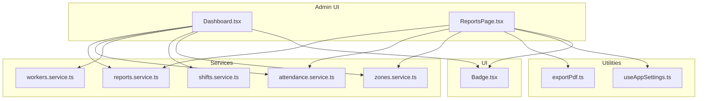
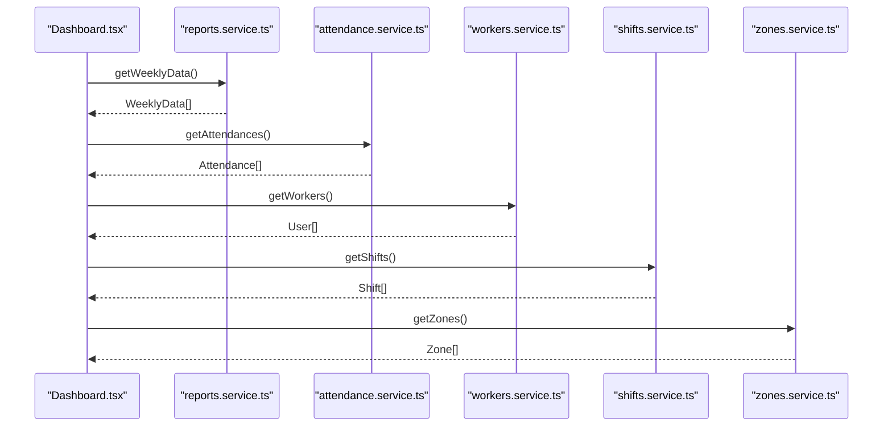
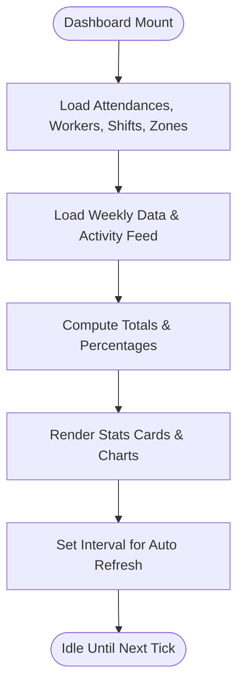
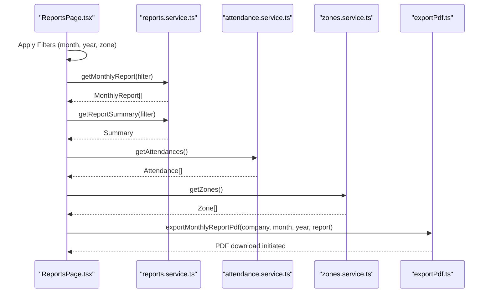
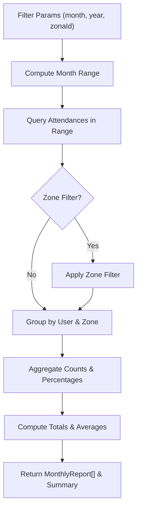
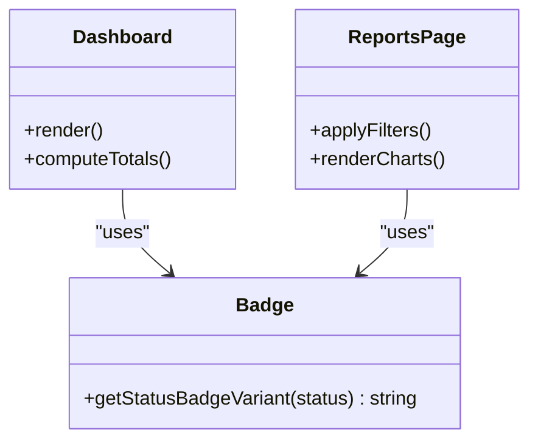
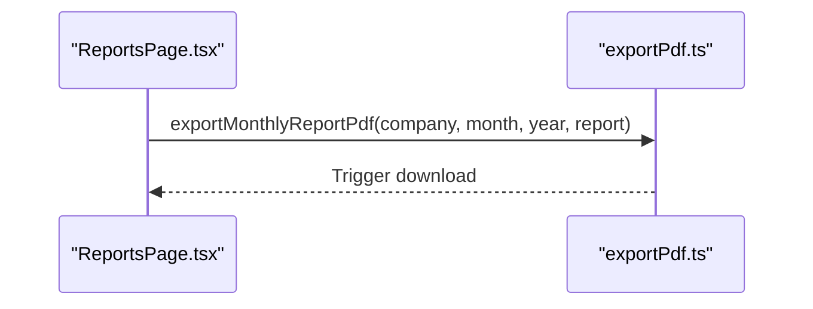
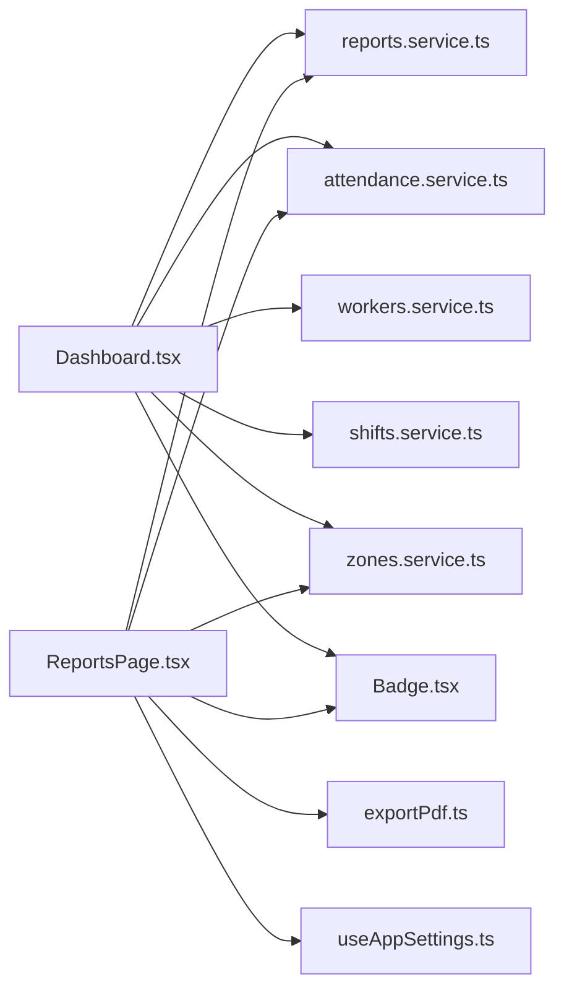

# Reporting & Analytics

<cite>
**Referenced Files in This Document**
- [Dashboard.tsx](file://src/components/admin/Dashboard.tsx)
- [ReportsPage.tsx](file://src/components/admin/ReportsPage.tsx)
- [reports.service.ts](file://src/services/reports.service.ts)
- [attendance.service.ts](file://src/services/attendance.service.ts)
- [workers.service.ts](file://src/services/workers.service.ts)
- [shifts.service.ts](file://src/services/shifts.service.ts)
- [zones.service.ts](file://src/services/zones.service.ts)
- [exportPdf.ts](file://src/utils/exportPdf.ts)
- [useAppSettings.ts](file://src/hooks/useAppSettings.ts)
- [Badge.tsx](file://src/components/ui/Badge.tsx)
</cite>

## Table of Contents
1. [Introduction](#introduction)
2. [Project Structure](#project-structure)
3. [Core Components](#core-components)
4. [Architecture Overview](#architecture-overview)
5. [Detailed Component Analysis](#detailed-component-analysis)
6. [Dependency Analysis](#dependency-analysis)
7. [Performance Considerations](#performance-considerations)
8. [Troubleshooting Guide](#troubleshooting-guide)
9. [Conclusion](#conclusion)
10. [Appendices](#appendices)

## Introduction
This document describes the Reporting and Analytics system, focusing on dashboard widgets, attendance summaries, worker performance metrics, real-time statistics, report generation (daily, weekly, monthly, and custom periods), data visualization, interactive filtering, PDF export, and integration points. It synthesizes frontend dashboard/report pages, backend service logic, and utility functions to provide a practical guide for developers and stakeholders.

## Project Structure
The reporting and analytics features are primarily implemented in:
- Admin dashboard and reports page components under src/components/admin
- Services under src/services for data retrieval and report computation
- Utility for PDF export under src/utils
- Hooks and UI components supporting filtering and presentation

**Diagram sources**
- [Dashboard.tsx](file://src/components/admin/Dashboard.tsx)
- [ReportsPage.tsx](file://src/components/admin/ReportsPage.tsx)
- [reports.service.ts](file://src/services/reports.service.ts)
- [attendance.service.ts](file://src/services/attendance.service.ts)
- [workers.service.ts](file://src/services/workers.service.ts)
- [shifts.service.ts](file://src/services/shifts.service.ts)
- [zones.service.ts](file://src/services/zones.service.ts)
- [exportPdf.ts](file://src/utils/exportPdf.ts)
- [useAppSettings.ts](file://src/hooks/useAppSettings.ts)
- [Badge.tsx](file://src/components/ui/Badge.tsx)

**Section sources**
- [Dashboard.tsx](file://src/components/admin/Dashboard.tsx)
- [ReportsPage.tsx](file://src/components/admin/ReportsPage.tsx)
- [reports.service.ts](file://src/services/reports.service.ts)

## Core Components
- Dashboard widgets:
  - Real-time stats cards for total workers, present today, late arrivals, and absentees
  - Weekly trend visualization using bar charts
  - Recent check-in activity feed
  - Automatic refresh every minute
- Reports page:
  - Monthly report generation with interactive filters (month, year, zone)
  - Summary statistics (total presence days, average attendance percentage, totals for late and absent)
  - Zone-wise bar chart visualization
  - PDF export capability for monthly reports
- Services:
  - Monthly report aggregation and summary computation
  - Attendance data fetching
  - Worker, shift, and zone metadata retrieval
- Utilities:
  - PDF export for monthly reports
  - Application settings hook for company branding in exports

**Section sources**
- [Dashboard.tsx](file://src/components/admin/Dashboard.tsx)
- [ReportsPage.tsx](file://src/components/admin/ReportsPage.tsx)
- [reports.service.ts](file://src/services/reports.service.ts)
- [exportPdf.ts](file://src/utils/exportPdf.ts)
- [useAppSettings.ts](file://src/hooks/useAppSettings.ts)

## Architecture Overview
The system follows a layered architecture:
- UI Layer: React components render dashboards and reports
- Service Layer: TypeScript services encapsulate Supabase queries and report computations
- Data Layer: Supabase tables for attendances, zones, and related metadata
- Utility Layer: Export and settings utilities

**Diagram sources**
- [Dashboard.tsx](file://src/components/admin/Dashboard.tsx)
- [reports.service.ts](file://src/services/reports.service.ts)
- [attendance.service.ts](file://src/services/attendance.service.ts)
- [workers.service.ts](file://src/services/workers.service.ts)
- [shifts.service.ts](file://src/services/shifts.service.ts)
- [zones.service.ts](file://src/services/zones.service.ts)

## Detailed Component Analysis

### Dashboard Widgets and Real-Time Statistics
- Data loading:
  - Concurrently loads attendance, workers, shifts, and zones via service functions
  - Loads weekly trends and activity feed
- Widget composition:
  - Stats cards for total workers, present today, late arrivals, and absentees
  - Weekly trend chart using Recharts bar chart
  - Recent check-ins feed
- Real-time behavior:
  - Automatic refresh every 60 seconds
  - Last update timestamp displayed

**Diagram sources**
- [Dashboard.tsx](file://src/components/admin/Dashboard.tsx)

**Section sources**
- [Dashboard.tsx](file://src/components/admin/Dashboard.tsx)

### Reports Page and Interactive Filtering
- Filters:
  - Month/year dropdowns
  - Zone filter selector
- Data computation:
  - Monthly report aggregation per user and zone
  - Summary statistics computed client-side from filtered attendance records
- Visualizations:
  - Zone-wise bar chart for presence percentages
- Export:
  - PDF export button invokes export utility with company name, month, and report data

**Diagram sources**
- [ReportsPage.tsx](file://src/components/admin/ReportsPage.tsx)
- [reports.service.ts](file://src/services/reports.service.ts)
- [attendance.service.ts](file://src/services/attendance.service.ts)
- [zones.service.ts](file://src/services/zones.service.ts)
- [exportPdf.ts](file://src/utils/exportPdf.ts)

**Section sources**
- [ReportsPage.tsx](file://src/components/admin/ReportsPage.tsx)
- [reports.service.ts](file://src/services/reports.service.ts)

### Report Generation and Data Aggregation
- Monthly report:
  - Builds date range from provided month and year
  - Queries attendances within the range, optionally filtered by zone
  - Aggregates per user and zone, computes presence percentages
- Summary computation:
  - Sums total presence days and counts late/absent occurrences
  - Calculates average attendance percentage across workers
- Client-side filtering:
  - Filters attendance records by selected month/year and zone for summary and charts

**Diagram sources**
- [reports.service.ts](file://src/services/reports.service.ts)

**Section sources**
- [reports.service.ts](file://src/services/reports.service.ts)

### Data Visualization and Chart Integration
- Recharts integration:
  - Bar charts for weekly trends and zone-wise summaries
  - Responsive containers for adaptive layouts
  - Tooltips and legends for interactivity
- Status badges:
  - Color-coded badges for performance indicators
  - Variant mapping for status labels

**Diagram sources**
- [Dashboard.tsx](file://src/components/admin/Dashboard.tsx)
- [ReportsPage.tsx](file://src/components/admin/ReportsPage.tsx)
- [Badge.tsx](file://src/components/ui/Badge.tsx)

**Section sources**
- [Dashboard.tsx](file://src/components/admin/Dashboard.tsx)
- [ReportsPage.tsx](file://src/components/admin/ReportsPage.tsx)
- [Badge.tsx](file://src/components/ui/Badge.tsx)

### PDF Export Functionality
- Export trigger:
  - Button click invokes export utility with company name, month, year, and report data
- Utility responsibilities:
  - Generates PDF using provided parameters
  - Initiates browser download

**Diagram sources**
- [ReportsPage.tsx](file://src/components/admin/ReportsPage.tsx)
- [exportPdf.ts](file://src/utils/exportPdf.ts)

**Section sources**
- [ReportsPage.tsx](file://src/components/admin/ReportsPage.tsx)
- [exportPdf.ts](file://src/utils/exportPdf.ts)

### KPI Tracking and Executive Dashboard Features
- KPIs:
  - Total workers, present today, late arrivals, absentees
  - Average attendance percentage
  - Presence day totals
- Executive insights:
  - Weekly trend visualization
  - Recent check-in activity feed
  - Automatic refresh for near-real-time updates

**Section sources**
- [Dashboard.tsx](file://src/components/admin/Dashboard.tsx)
- [ReportsPage.tsx](file://src/components/admin/ReportsPage.tsx)

## Dependency Analysis
- Dashboard depends on:
  - reports.service for weekly data and activity feed
  - attendance.service, workers.service, shifts.service, zones.service for base datasets
  - Badge for status rendering
- ReportsPage depends on:
  - reports.service for monthly report and summary
  - attendance.service and zones.service for filtering and context
  - exportPdf utility for PDF export
  - useAppSettings hook for company branding

**Diagram sources**
- [Dashboard.tsx](file://src/components/admin/Dashboard.tsx)
- [ReportsPage.tsx](file://src/components/admin/ReportsPage.tsx)
- [reports.service.ts](file://src/services/reports.service.ts)
- [attendance.service.ts](file://src/services/attendance.service.ts)
- [workers.service.ts](file://src/services/workers.service.ts)
- [shifts.service.ts](file://src/services/shifts.service.ts)
- [zones.service.ts](file://src/services/zones.service.ts)
- [exportPdf.ts](file://src/utils/exportPdf.ts)
- [useAppSettings.ts](file://src/hooks/useAppSettings.ts)
- [Badge.tsx](file://src/components/ui/Badge.tsx)

**Section sources**
- [Dashboard.tsx](file://src/components/admin/Dashboard.tsx)
- [ReportsPage.tsx](file://src/components/admin/ReportsPage.tsx)
- [reports.service.ts](file://src/services/reports.service.ts)

## Performance Considerations
- Concurrent data loading:
  - Use of Promise.all reduces total latency when fetching multiple datasets
- Client-side filtering:
  - Filtering and aggregation occur after initial fetch; consider server-side aggregation for very large datasets
- Real-time refresh:
  - One-minute interval ensures near-real-time updates; tune interval based on backend capacity
- Chart responsiveness:
  - Recharts ResponsiveContainer adapts to layout changes; avoid excessive re-renders by stabilizing props
- Caching opportunities:
  - Memoize computed summaries and report arrays to prevent redundant recalculations during quick filter changes
  - Persist frequently accessed datasets locally to reduce network requests

## Troubleshooting Guide
- No data displayed on dashboard:
  - Verify service responses and error handling; ensure Supabase connectivity and table permissions
- Reports page shows empty charts:
  - Confirm selected month/year and zone filter alignment with available attendance records
- PDF export fails:
  - Check export utility invocation parameters and confirm report data availability
- Performance issues:
  - Monitor concurrent requests and consider pagination or server-side filtering for large datasets

## Conclusion
The Reporting and Analytics system integrates dashboard widgets, interactive reports, and export capabilities. It leverages concurrent data loading, client-side aggregation, and Recharts for visualization. Enhancements such as server-side aggregations, caching, and scheduled exports would further improve scalability and automation.

## Appendices

### Example Report Configurations
- Monthly report:
  - Filter by month, year, and optional zone
  - Aggregates presence, late, and absent counts per user and zone
- Summary metrics:
  - Total presence days, average attendance percentage, totals for late and absent
- Export:
  - Company-branded PDF export for selected month/year

**Section sources**
- [ReportsPage.tsx](file://src/components/admin/ReportsPage.tsx)
- [reports.service.ts](file://src/services/reports.service.ts)
- [exportPdf.ts](file://src/utils/exportPdf.ts)
- [useAppSettings.ts](file://src/hooks/useAppSettings.ts)

### Custom Metric Calculations and Aggregation Patterns
- Percentage calculations:
  - Presence percentage per zone computed from counts
- Averages:
  - Average attendance percentage derived from total presence divided by total working days
- Filtering patterns:
  - Date range filtering and optional zone filtering applied before aggregation

**Section sources**
- [ReportsPage.tsx](file://src/components/admin/ReportsPage.tsx)
- [reports.service.ts](file://src/services/reports.service.ts)

### Integration with External Reporting Tools
- PDF export:
  - Utilize the existing export utility as a foundation for integrating third-party reporting libraries
- Scheduled reports:
  - Extend service functions to support programmatic report generation and dispatch workflows
- Data export:
  - Add CSV/XLSX export alongside current PDF option for broader tool compatibility

**Section sources**
- [exportPdf.ts](file://src/utils/exportPdf.ts)
- [reports.service.ts](file://src/services/reports.service.ts)