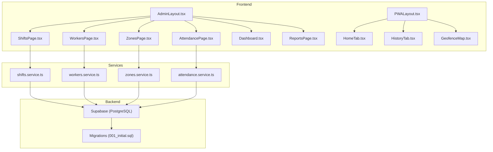
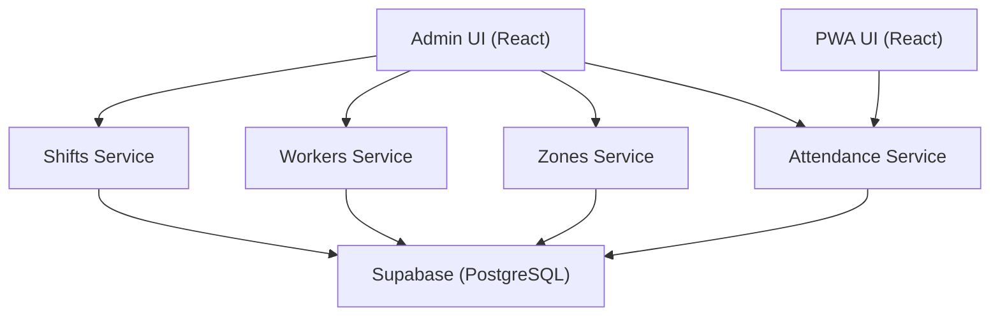
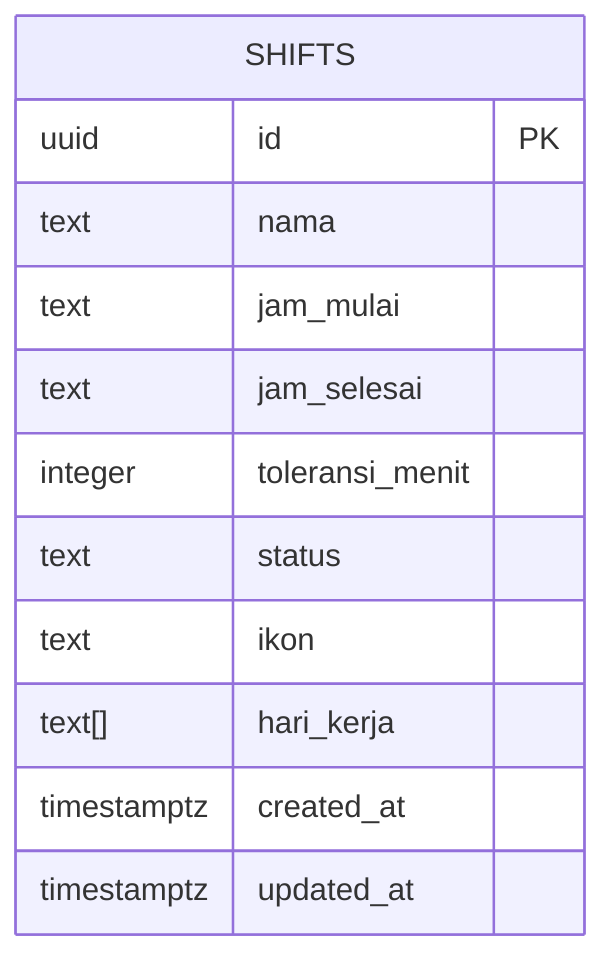
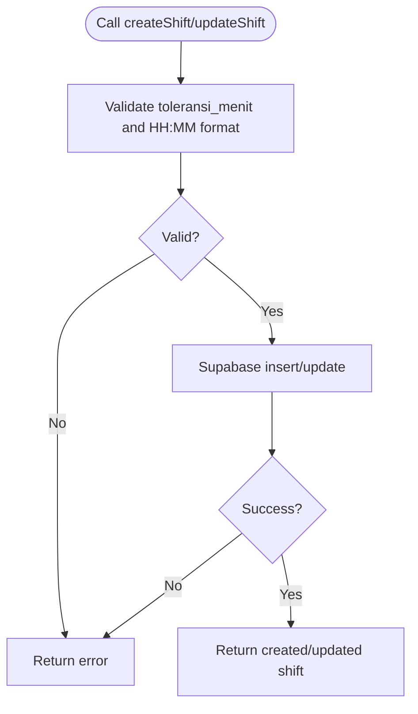
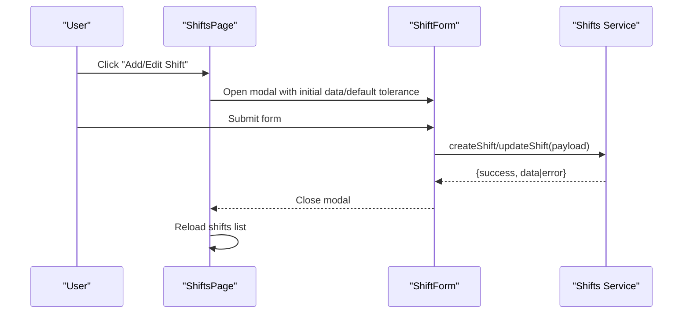
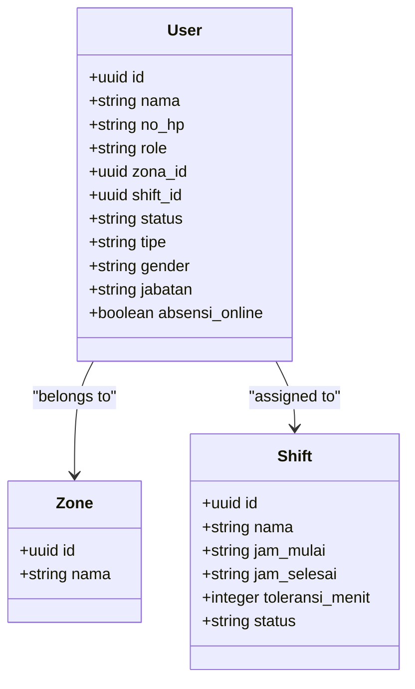
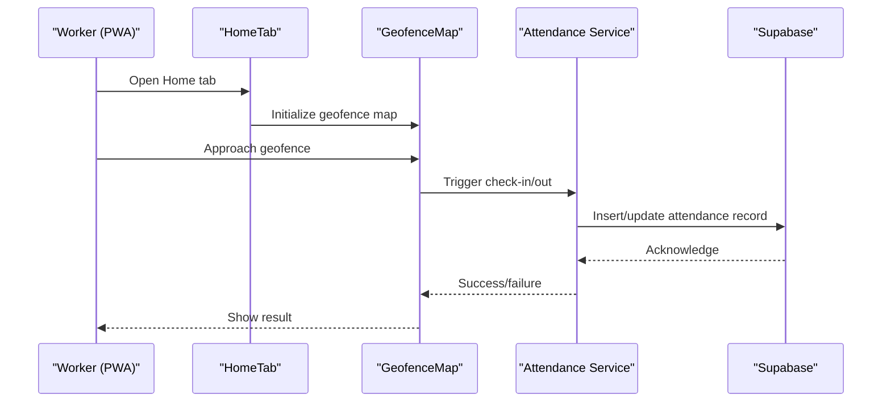
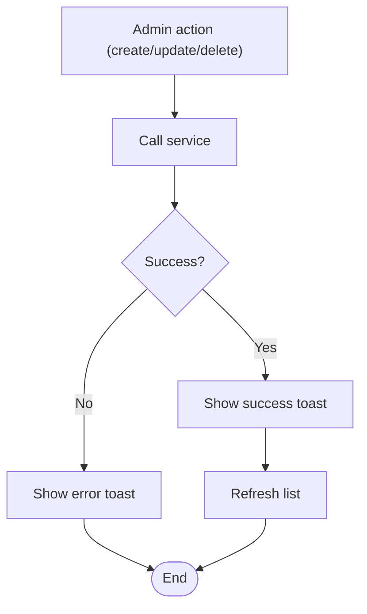
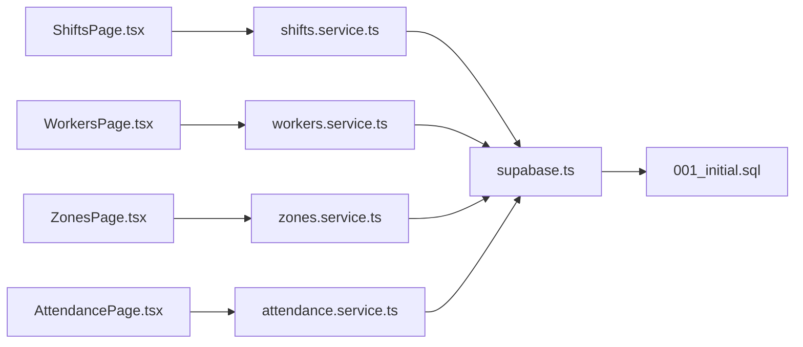

# Shift Scheduling

<cite>
**Referenced Files in This Document**
- [SPEC.md](file://SPEC.md)
- [001_initial.sql](file://supabase/migrations/001_initial.sql)
- [shifts.service.ts](file://src/services/shifts.service.ts)
- [ShiftsPage.tsx](file://src/components/admin/ShiftsPage.tsx)
- [workers.service.ts](file://src/services/workers.service.ts)
- [zones.service.ts](file://src/services/zones.service.ts)
- [attendance.service.ts](file://src/services/attendance.service.ts)
- [index.ts](file://src/types/index.ts)
- [useAppSettings.ts](file://src/hooks/useAppSettings.ts)
- [AuthContext.tsx](file://src/context/AuthContext.tsx)
- [AdminLayout.tsx](file://src/components/admin/AdminLayout.tsx)
- [Dashboard.tsx](file://src/components/admin/Dashboard.tsx)
- [ReportsPage.tsx](file://src/components/admin/ReportsPage.tsx)
- [WorkersPage.tsx](file://src/components/admin/WorkersPage.tsx)
- [ZonesPage.tsx](file://src/components/admin/ZonesPage.tsx)
- [AttendancePage.tsx](file://src/components/admin/AttendancePage.tsx)
- [PWALayout.tsx](file://src/components/pwa/PWALayout.tsx)
- [HomeTab.tsx](file://src/components/pwa/HomeTab.tsx)
- [HistoryTab.tsx](file://src/components/pwa/HistoryTab.tsx)
- [GeofenceMap.tsx](file://src/components/pwa/GeofenceMap.tsx)
- [Toast.tsx](file://src/components/ui/Toast.tsx)
- [ConfirmDialog.tsx](file://src/components/ui/ConfirmDialog.tsx)
- [Modal.tsx](file://src/components/ui/Modal.tsx)
- [ErrorBoundary.tsx](file://src/components/ErrorBoundary.tsx)
- [Login.tsx](file://src/components/Login.tsx)
- [ProtectedRoute.tsx](file://src/components/ProtectedRoute.tsx)
- [supabase.ts](file://src/config/supabase.ts)
- [offlineQueue.ts](file://src/utils/offlineQueue.ts)
</cite>

## Table of Contents
1. [Introduction](#introduction)
2. [Project Structure](#project-structure)
3. [Core Components](#core-components)
4. [Architecture Overview](#architecture-overview)
5. [Detailed Component Analysis](#detailed-component-analysis)
6. [Dependency Analysis](#dependency-analysis)
7. [Performance Considerations](#performance-considerations)
8. [Troubleshooting Guide](#troubleshooting-guide)
9. [Conclusion](#conclusion)
10. [Appendices](#appendices)

## Introduction
This document describes the Shift Scheduling system implemented in the repository. It covers shift lifecycle management (creation, modification, deletion), shift timing configuration, tolerance settings, and overlap detection. It also documents worker and zone assignment, template and recurring schedule support, exception handling, status management, real-time tracking, notifications, best practices, performance considerations, and integration points with the attendance tracking system.

## Project Structure
The system is organized around:
- Database schema for shifts, users, zones, and related metadata
- Frontend admin pages for managing shifts, workers, zones, and attendance
- Services for backend interactions via Supabase
- Types and shared utilities
- PWA components for mobile-friendly attendance and history views
- Authentication and protected routing

**Diagram sources**
- [AdminLayout.tsx](file://src/components/admin/AdminLayout.tsx)
- [ShiftsPage.tsx](file://src/components/admin/ShiftsPage.tsx)
- [WorkersPage.tsx](file://src/components/admin/WorkersPage.tsx)
- [ZonesPage.tsx](file://src/components/admin/ZonesPage.tsx)
- [AttendancePage.tsx](file://src/components/admin/AttendancePage.tsx)
- [Dashboard.tsx](file://src/components/admin/Dashboard.tsx)
- [ReportsPage.tsx](file://src/components/admin/ReportsPage.tsx)
- [PWALayout.tsx](file://src/components/pwa/PWALayout.tsx)
- [HomeTab.tsx](file://src/components/pwa/HomeTab.tsx)
- [HistoryTab.tsx](file://src/components/pwa/HistoryTab.tsx)
- [GeofenceMap.tsx](file://src/components/pwa/GeofenceMap.tsx)
- [shifts.service.ts](file://src/services/shifts.service.ts)
- [workers.service.ts](file://src/services/workers.service.ts)
- [zones.service.ts](file://src/services/zones.service.ts)
- [attendance.service.ts](file://src/services/attendance.service.ts)
- [001_initial.sql](file://supabase/migrations/001_initial.sql)

**Section sources**
- [SPEC.md](file://SPEC.md)
- [001_initial.sql](file://supabase/migrations/001_initial.sql)
- [shifts.service.ts](file://src/services/shifts.service.ts)
- [ShiftsPage.tsx](file://src/components/admin/ShiftsPage.tsx)

## Core Components
- Shift entity and validation rules
- Shift CRUD service
- Admin UI for shift management
- Worker and zone services
- Attendance tracking service
- Types and settings hooks
- Authentication and routing

Key responsibilities:
- Define shift schema, constraints, and defaults
- Enforce tolerances and time format validation
- Provide CRUD operations for shifts
- Render forms and manage state in the admin UI
- Integrate with workers and zones for assignment
- Track attendance and report outcomes
- Support default settings and user preferences

**Section sources**
- [SPEC.md](file://SPEC.md)
- [001_initial.sql](file://supabase/migrations/001_initial.sql)
- [shifts.service.ts](file://src/services/shifts.service.ts)
- [ShiftsPage.tsx](file://src/components/admin/ShiftsPage.tsx)
- [workers.service.ts](file://src/services/workers.service.ts)
- [zones.service.ts](file://src/services/zones.service.ts)
- [attendance.service.ts](file://src/services/attendance.service.ts)
- [index.ts](file://src/types/index.ts)
- [useAppSettings.ts](file://src/hooks/useAppSettings.ts)

## Architecture Overview
The system follows a layered architecture:
- Presentation layer: React components for admin and PWA
- Service layer: TypeScript wrappers around Supabase
- Data layer: PostgreSQL schema with migrations
- Shared domain: Types and utilities

**Diagram sources**
- [ShiftsPage.tsx](file://src/components/admin/ShiftsPage.tsx)
- [PWALayout.tsx](file://src/components/pwa/PWALayout.tsx)
- [shifts.service.ts](file://src/services/shifts.service.ts)
- [workers.service.ts](file://src/services/workers.service.ts)
- [zones.service.ts](file://src/services/zones.service.ts)
- [attendance.service.ts](file://src/services/attendance.service.ts)
- [supabase.ts](file://src/config/supabase.ts)

## Detailed Component Analysis

### Shift Entity and Schema
- Fields: id, name, start/end time (HH:MM), tolerance minutes, status, icon, working days array, timestamps
- Constraints: toleransi_menit >= 0 enforced at DB level; status constrained to predefined values; default toleransi and status applied on insert
- Working days: array of day identifiers for recurring schedules

**Diagram sources**
- [SPEC.md](file://SPEC.md)
- [001_initial.sql](file://supabase/migrations/001_initial.sql)

**Section sources**
- [SPEC.md](file://SPEC.md)
- [001_initial.sql](file://supabase/migrations/001_initial.sql)

### Shift CRUD Service
Responsibilities:
- Retrieve all shifts or by ID
- Validate tolerances and time formats
- Insert/update/delete shifts
- Return typed results with success/error codes

Validation rules:
- Tolerance range: 0–120 minutes
- Time format: HH:MM with valid ranges for hours and minutes
- Database constraint ensures toleransi >= 0

**Diagram sources**
- [shifts.service.ts](file://src/services/shifts.service.ts)

**Section sources**
- [shifts.service.ts](file://src/services/shifts.service.ts)

### Admin UI: Shift Management
- Lists shifts with loading and error states
- Opens modal form for create/edit
- Uses default tolerance from app settings
- Confirms deletions via confirm dialog
- Refreshes list after mutations

**Diagram sources**
- [ShiftsPage.tsx](file://src/components/admin/ShiftsPage.tsx)
- [shifts.service.ts](file://src/services/shifts.service.ts)

**Section sources**
- [ShiftsPage.tsx](file://src/components/admin/ShiftsPage.tsx)
- [useAppSettings.ts](file://src/hooks/useAppSettings.ts)

### Worker and Zone Assignment
- Users table includes foreign keys to zones and shifts
- Assignment occurs at the user level; no dedicated shift assignment API is present in the provided files
- Workers page manages user records; zones page manages zones

**Diagram sources**
- [001_initial.sql](file://supabase/migrations/001_initial.sql)

**Section sources**
- [001_initial.sql](file://supabase/migrations/001_initial.sql)
- [workers.service.ts](file://src/services/workers.service.ts)
- [zones.service.ts](file://src/services/zones.service.ts)
- [WorkersPage.tsx](file://src/components/admin/WorkersPage.tsx)
- [ZonesPage.tsx](file://src/components/admin/ZonesPage.tsx)

### Attendance Tracking and Real-Time Updates
- Attendance service exists for retrieving and reporting attendance
- PWA components include HomeTab, HistoryTab, and GeofenceMap for on-site check-ins and history
- Offline queue utility supports offline operations

**Diagram sources**
- [HomeTab.tsx](file://src/components/pwa/HomeTab.tsx)
- [GeofenceMap.tsx](file://src/components/pwa/GeofenceMap.tsx)
- [HistoryTab.tsx](file://src/components/pwa/HistoryTab.tsx)
- [attendance.service.ts](file://src/services/attendance.service.ts)
- [offlineQueue.ts](file://src/utils/offlineQueue.ts)

**Section sources**
- [attendance.service.ts](file://src/services/attendance.service.ts)
- [HomeTab.tsx](file://src/components/pwa/HomeTab.tsx)
- [GeofenceMap.tsx](file://src/components/pwa/GeofenceMap.tsx)
- [HistoryTab.tsx](file://src/components/pwa/HistoryTab.tsx)
- [offlineQueue.ts](file://src/utils/offlineQueue.ts)

### Templates, Recurrence, and Exceptions
- Template concept: reusable shift definitions stored in the shifts table
- Recurrence: implemented via the working days array field
- Exceptions: not modeled in the provided schema; can be handled by:
  - Creating exceptions as separate records in a dedicated table
  - Overriding assignments per worker or date
  - Using status flags to mark overrides

[No sources needed since this section synthesizes concepts from existing schema and does not quote specific code]

### Status Management and Notifications
- Shift status: active/non-active controlled by the status field
- Notifications: toast-based feedback in admin UI for successful actions and errors
- Authentication: protected routes and context guard UI components

**Diagram sources**
- [ShiftsPage.tsx](file://src/components/admin/ShiftsPage.tsx)
- [Toast.tsx](file://src/components/ui/Toast.tsx)
- [ProtectedRoute.tsx](file://src/components/ProtectedRoute.tsx)
- [AuthContext.tsx](file://src/context/AuthContext.tsx)

**Section sources**
- [ShiftsPage.tsx](file://src/components/admin/ShiftsPage.tsx)
- [Toast.tsx](file://src/components/ui/Toast.tsx)
- [ProtectedRoute.tsx](file://src/components/ProtectedRoute.tsx)
- [AuthContext.tsx](file://src/context/AuthContext.tsx)

### Conflict Detection and Resolution
- No explicit overlap detection logic is present in the provided files
- Recommended approach:
  - Enforce uniqueness of shift times per worker per day at DB level
  - Implement pre-flight checks in the frontend/service to prevent overlaps
  - Provide conflict resolution UI with options to reschedule or override

[No sources needed since this section proposes recommended patterns not yet implemented]

## Dependency Analysis
- Frontend components depend on services and types
- Services depend on Supabase client
- Database schema defines relationships and constraints
- Authentication and routing wrap UI components

**Diagram sources**
- [ShiftsPage.tsx](file://src/components/admin/ShiftsPage.tsx)
- [WorkersPage.tsx](file://src/components/admin/WorkersPage.tsx)
- [ZonesPage.tsx](file://src/components/admin/ZonesPage.tsx)
- [AttendancePage.tsx](file://src/components/admin/AttendancePage.tsx)
- [shifts.service.ts](file://src/services/shifts.service.ts)
- [workers.service.ts](file://src/services/workers.service.ts)
- [zones.service.ts](file://src/services/zones.service.ts)
- [attendance.service.ts](file://src/services/attendance.service.ts)
- [supabase.ts](file://src/config/supabase.ts)
- [001_initial.sql](file://supabase/migrations/001_initial.sql)

**Section sources**
- [shifts.service.ts](file://src/services/shifts.service.ts)
- [workers.service.ts](file://src/services/workers.service.ts)
- [zones.service.ts](file://src/services/zones.service.ts)
- [attendance.service.ts](file://src/services/attendance.service.ts)
- [supabase.ts](file://src/config/supabase.ts)
- [001_initial.sql](file://supabase/migrations/001_initial.sql)

## Performance Considerations
- Indexes on users (phone+role), zones, and shifts improve lookup performance
- Batch operations: group shift updates and minimize round-trips
- Pagination for large lists of shifts, workers, and attendance records
- Caching: memoize frequently accessed shift data in the UI
- Offline-first: leverage offline queue for attendance events during connectivity loss

[No sources needed since this section provides general guidance]

## Troubleshooting Guide
Common issues and resolutions:
- Validation errors when creating or updating shifts (tolerance out of range, invalid time format)
  - Ensure toleransi_menit is within 0–120 and times are valid HH:MM
- Deletion failures
  - Verify no dependent records (e.g., users assigned to the shift) before deleting
- UI feedback
  - Use toast notifications to surface errors and successes
- Authentication barriers
  - Ensure protected routes and context are properly configured

**Section sources**
- [shifts.service.ts](file://src/services/shifts.service.ts)
- [ShiftsPage.tsx](file://src/components/admin/ShiftsPage.tsx)
- [Toast.tsx](file://src/components/ui/Toast.tsx)
- [ProtectedRoute.tsx](file://src/components/ProtectedRoute.tsx)
- [AuthContext.tsx](file://src/context/AuthContext.tsx)

## Conclusion
The Shift Scheduling system provides a solid foundation for managing shift definitions, assigning workers and zones, and tracking attendance. Enhancements such as built-in overlap detection, exception modeling, and robust notification mechanisms would further strengthen the system for production use.

## Appendices

### Example Scenarios

- Create a new shift template
  - Steps: open Shifts page, click add, fill name, start/end times, tolerance, status, working days, submit
  - Outcome: shift saved with defaults applied

- Modify an existing shift
  - Steps: select edit, adjust fields, validate tolerance/time format, save
  - Outcome: updated shift returned with success

- Delete a shift
  - Steps: open delete confirmation, confirm, submit
  - Outcome: shift removed if no dependencies

- Assign a worker to a shift
  - Steps: navigate to Workers page, edit user record, select shift, save
  - Outcome: user assigned to selected shift

- Override a scheduled shift for a worker
  - Steps: create exception record or adjust assignment for the specific date
  - Outcome: worker uses overridden shift for that date

- Real-time attendance check-in
  - Steps: open PWA, go to Home tab, approach geofence, confirm check-in
  - Outcome: attendance recorded and reflected in History tab

[No sources needed since this section provides procedural examples]