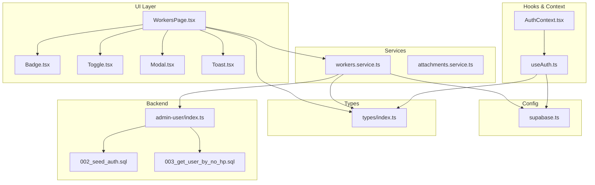
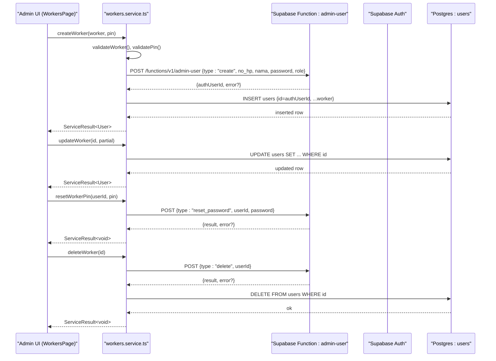
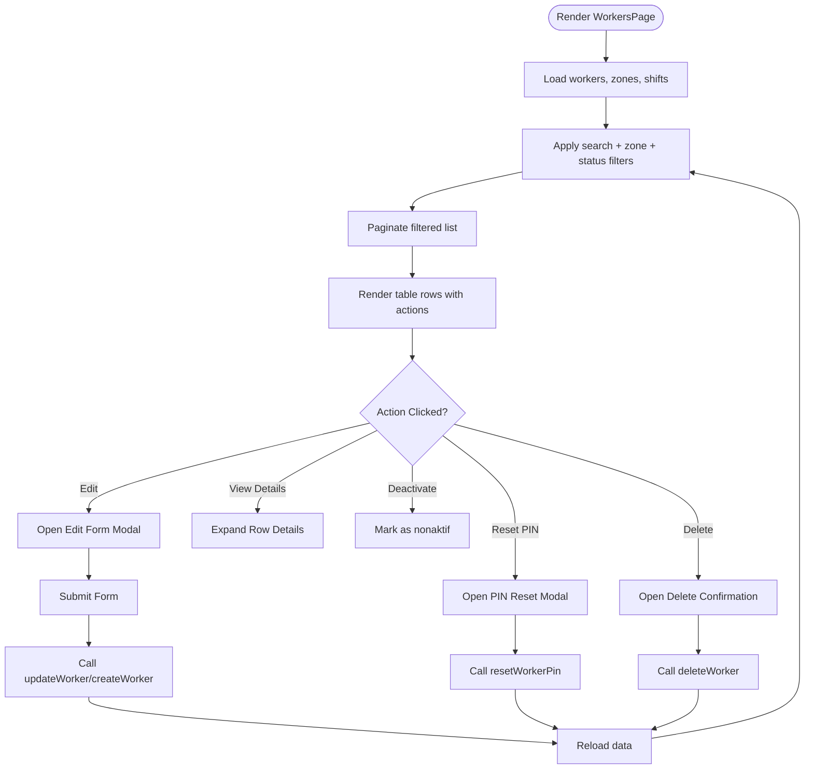
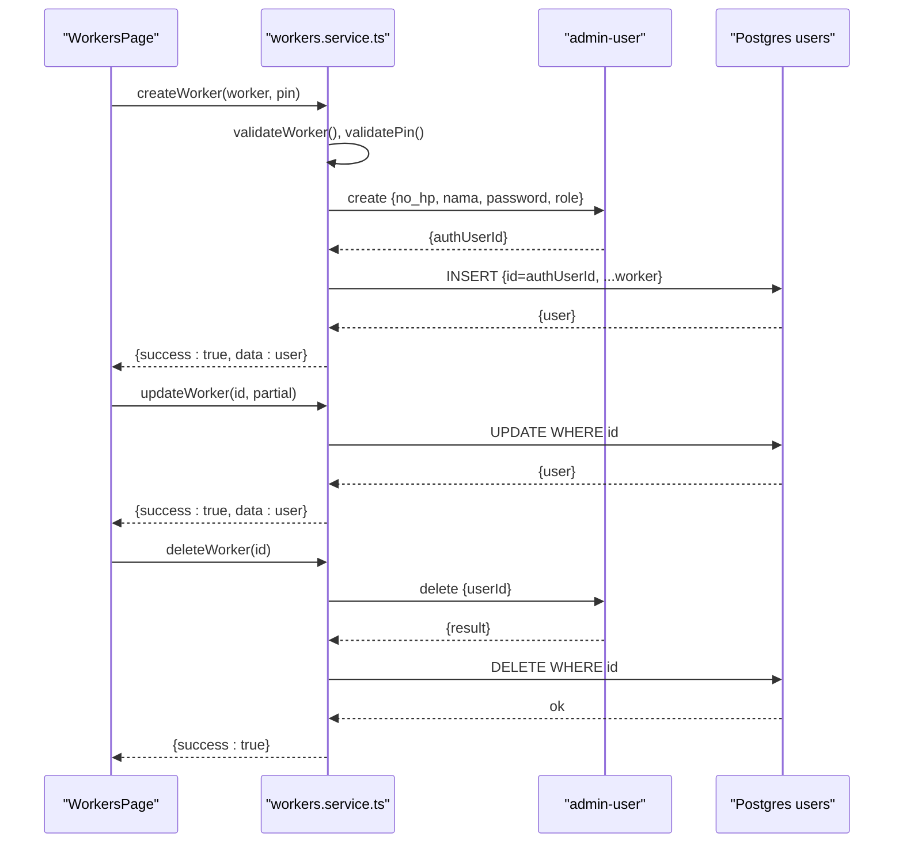
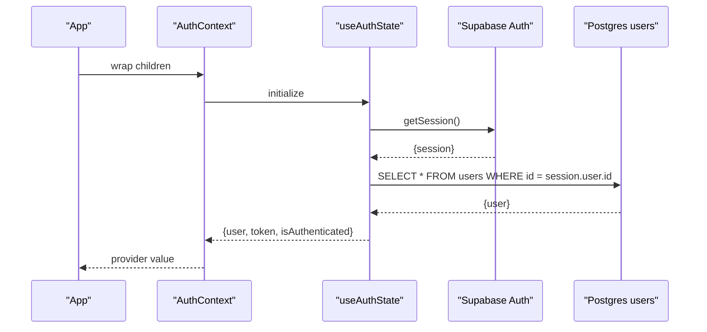
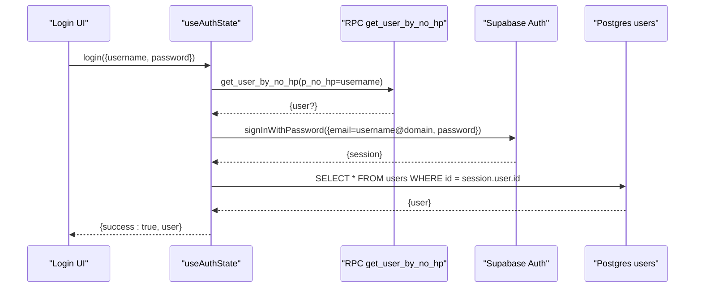
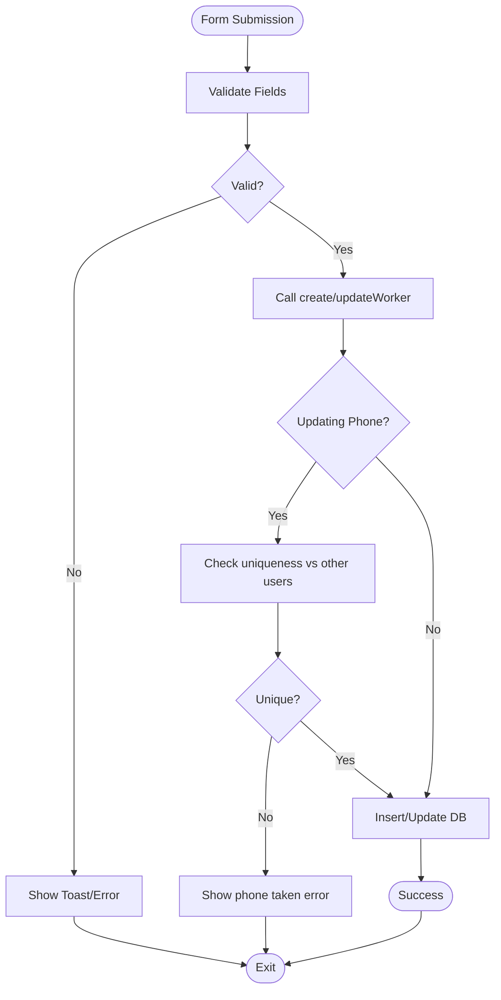
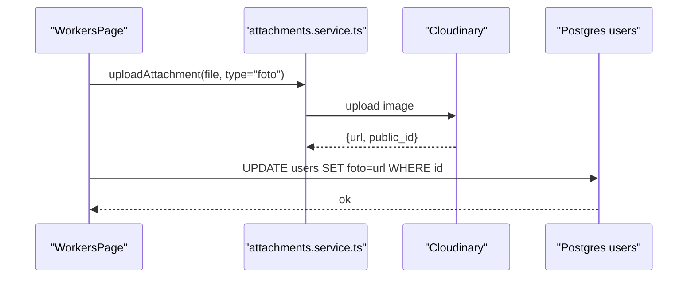
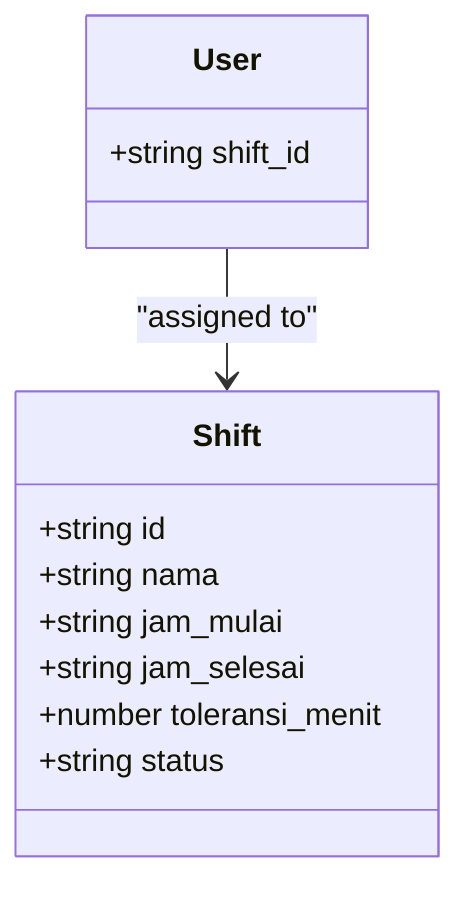
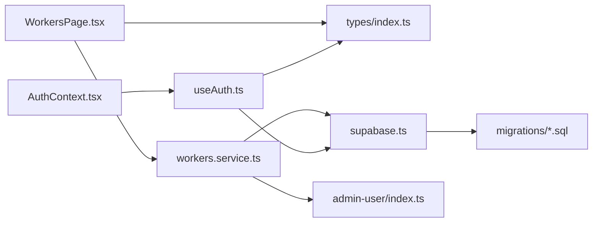

# User Management

<cite>
**Referenced Files in This Document**
- [WorkersPage.tsx](file://src/components/admin/WorkersPage.tsx)
- [workers.service.ts](file://src/services/workers.service.ts)
- [AuthContext.tsx](file://src/context/AuthContext.tsx)
- [useAuth.ts](file://src/hooks/useAuth.ts)
- [supabase.ts](file://src/config/supabase.ts)
- [index.ts](file://src/types/index.ts)
- [admin-user/index.ts](file://supabase/functions/admin-user/index.ts)
- [002_seed_auth.sql](file://supabase/migrations/002_seed_auth.sql)
- [003_get_user_by_no_hp.sql](file://supabase/migrations/003_get_user_by_no_hp.sql)
</cite>

## Table of Contents
1. [Introduction](#introduction)
2. [Project Structure](#project-structure)
3. [Core Components](#core-components)
4. [Architecture Overview](#architecture-overview)
5. [Detailed Component Analysis](#detailed-component-analysis)
6. [Dependency Analysis](#dependency-analysis)
7. [Performance Considerations](#performance-considerations)
8. [Troubleshooting Guide](#troubleshooting-guide)
9. [Conclusion](#conclusion)

## Introduction
This document describes the User Management system for AbsensiOnline, focusing on worker profile lifecycle management, authentication integration, session handling, role-based access control, and administrative workflows. It covers CRUD operations for workers, registration and verification flows, profile updates, search and filtering, bulk-like operations (PIN reset), and the integration with Supabase Auth and Postgres. Privacy and audit considerations are addressed alongside practical examples of validation, profile photo handling, and shift assignment.

## Project Structure
The User Management system spans UI components, services, hooks, contexts, and backend integrations:
- UI: Worker listing, forms, modals, and search/filter controls
- Services: Worker CRUD and PIN reset operations via Supabase Functions
- Hooks: Authentication state hydration and session management
- Types: Shared data models and enums
- Backend: Supabase Auth, Postgres users table, and custom functions



**Diagram sources**
- [WorkersPage.tsx:1-542](file://src/components/admin/WorkersPage.tsx#L1-L542)
- [workers.service.ts:1-133](file://src/services/workers.service.ts#L1-L133)
- [AuthContext.tsx:1-43](file://src/context/AuthContext.tsx#L1-L43)
- [useAuth.ts:1-115](file://src/hooks/useAuth.ts#L1-L115)
- [supabase.ts](file://src/config/supabase.ts)
- [index.ts:1-182](file://src/types/index.ts#L1-L182)
- [admin-user/index.ts](file://supabase/functions/admin-user/index.ts)
- [002_seed_auth.sql](file://supabase/migrations/002_seed_auth.sql)
- [003_get_user_by_no_hp.sql](file://supabase/migrations/003_get_user_by_no_hp.sql)

**Section sources**
- [WorkersPage.tsx:1-542](file://src/components/admin/WorkersPage.tsx#L1-L542)
- [workers.service.ts:1-133](file://src/services/workers.service.ts#L1-L133)
- [AuthContext.tsx:1-43](file://src/context/AuthContext.tsx#L1-L43)
- [useAuth.ts:1-115](file://src/hooks/useAuth.ts#L1-L115)
- [index.ts:1-182](file://src/types/index.ts#L1-L182)

## Core Components
- Worker listing and management UI: search, filters, pagination, inline editing, and action modals
- Worker CRUD service: create, read, update, delete, and PIN reset via a dedicated Supabase Function
- Authentication context and hook: session hydration, login/logout, and profile fetching
- Types and enums: standardized role, status, and model definitions
- Backend integration: Supabase Auth for credentials and sessions, Postgres users table, and RPC helpers

Key responsibilities:
- UI validates user input and orchestrates service calls
- Services validate data, enforce constraints, and delegate auth operations to Supabase Functions
- Auth hook hydrates user profile after session retrieval
- Types define consistent data contracts across frontend and backend

**Section sources**
- [WorkersPage.tsx:162-509](file://src/components/admin/WorkersPage.tsx#L162-L509)
- [workers.service.ts:20-133](file://src/services/workers.service.ts#L20-L133)
- [useAuth.ts:29-114](file://src/hooks/useAuth.ts#L29-L114)
- [index.ts:32-46](file://src/types/index.ts#L32-L46)

## Architecture Overview
The system integrates frontend components with Supabase Auth and Postgres, delegating administrative user operations to a custom Function for centralized control and RLS safety.



**Diagram sources**
- [workers.service.ts:6-18](file://src/services/workers.service.ts#L6-L18)
- [workers.service.ts:54-91](file://src/services/workers.service.ts#L54-L91)
- [workers.service.ts:93-112](file://src/services/workers.service.ts#L93-L112)
- [workers.service.ts:114-121](file://src/services/workers.service.ts#L114-L121)
- [workers.service.ts:123-132](file://src/services/workers.service.ts#L123-L132)
- [admin-user/index.ts](file://supabase/functions/admin-user/index.ts)

**Section sources**
- [workers.service.ts:1-133](file://src/services/workers.service.ts#L1-L133)
- [WorkersPage.tsx:198-233](file://src/components/admin/WorkersPage.tsx#L198-L233)

## Detailed Component Analysis

### Worker Listing and Search Interface
The WorkersPage component provides:
- Search by name, phone number, or ID
- Filter by zone and status
- Pagination with fixed page size
- Inline expandable rows for detailed info
- Action buttons: edit, view details, deactivate, reset PIN, delete
- Bulk-like operation: PIN reset modal per worker

Validation and UX:
- Real-time filtering and pagination
- Toast notifications for feedback
- Confirmation modals for destructive actions



**Diagram sources**
- [WorkersPage.tsx:162-509](file://src/components/admin/WorkersPage.tsx#L162-L509)

**Section sources**
- [WorkersPage.tsx:162-509](file://src/components/admin/WorkersPage.tsx#L162-L509)

### Worker CRUD Operations
- Create: Validates worker and PIN, checks phone uniqueness, calls admin-user create, inserts local user record
- Read: Fetches all workers excluding super_admin, plus individual lookup
- Update: Validates worker data, enforces unique phone constraint, updates user record
- Delete: Delegates to admin-user delete, then removes local user record



**Diagram sources**
- [workers.service.ts:54-91](file://src/services/workers.service.ts#L54-L91)
- [workers.service.ts:93-112](file://src/services/workers.service.ts#L93-L112)
- [workers.service.ts:123-132](file://src/services/workers.service.ts#L123-L132)

**Section sources**
- [workers.service.ts:20-133](file://src/services/workers.service.ts#L20-L133)

### Authentication Context and Session Management
- AuthProvider wraps the app and exposes user, token, isAuthenticated, loading, login, and logout
- useAuthState hydrates the current user profile from the users table upon session retrieval
- Login resolves user by phone number via RPC, constructs an email@domain, and signs in with Supabase Auth
- Logout clears session and local storage keys



**Diagram sources**
- [AuthContext.tsx:18-36](file://src/context/AuthContext.tsx#L18-L36)
- [useAuth.ts:29-56](file://src/hooks/useAuth.ts#L29-L56)
- [useAuth.ts:58-96](file://src/hooks/useAuth.ts#L58-L96)
- [003_get_user_by_no_hp.sql:1-50](file://supabase/migrations/003_get_user_by_no_hp.sql#L1-L50)

**Section sources**
- [AuthContext.tsx:1-43](file://src/context/AuthContext.tsx#L1-L43)
- [useAuth.ts:16-27](file://src/hooks/useAuth.ts#L16-L27)
- [useAuth.ts:58-96](file://src/hooks/useAuth.ts#L58-L96)

### Role Assignment and Access Control
- Roles: worker, admin, super_admin
- Workers are created with role worker by default
- WorkersPage filters out super_admin from listings
- Access control relies on Supabase RLS policies and admin-user Function permissions

```mermaid
classDiagram
class User {
+string id
+string nama
+string no_hp
+string role
+string zona_id
+string shift_id
+string status
+string tipe
+string gender
+boolean absensi_online
}
class Role {
<<enum>>
"worker"
"admin"
"super_admin"
}
User --> Role : "has"
```

**Diagram sources**
- [index.ts:4-46](file://src/types/index.ts#L4-L46)

**Section sources**
- [workers.service.ts:24](file://src/services/workers.service.ts#L24)
- [index.ts:4](file://src/types/index.ts#L4)

### Worker Registration Workflow
- Phone number lookup via RPC to resolve user identity
- Email@domain constructed from phone number for Auth login
- Supabase Auth sign-in with provided PIN
- Post-login hydration fetches user profile from users table



**Diagram sources**
- [useAuth.ts:62-93](file://src/hooks/useAuth.ts#L62-L93)
- [003_get_user_by_no_hp.sql:1-50](file://supabase/migrations/003_get_user_by_no_hp.sql#L1-L50)

**Section sources**
- [useAuth.ts:58-96](file://src/hooks/useAuth.ts#L58-L96)
- [003_get_user_by_no_hp.sql:1-50](file://supabase/migrations/003_get_user_by_no_hp.sql#L1-L50)

### Profile Updates and Validation
- WorkerForm validates required fields and formats before submission
- Service-side validations ensure:
  - Name presence
  - Phone number format and uniqueness
  - PIN length and numeric constraints
- UpdateWorker enforces uniqueness against other users



**Diagram sources**
- [WorkersPage.tsx:134-152](file://src/components/admin/WorkersPage.tsx#L134-L152)
- [workers.service.ts:36-46](file://src/services/workers.service.ts#L36-L46)
- [workers.service.ts:97-107](file://src/services/workers.service.ts#L97-L107)

**Section sources**
- [WorkersPage.tsx:134-152](file://src/components/admin/WorkersPage.tsx#L134-L152)
- [workers.service.ts:36-46](file://src/services/workers.service.ts#L36-L46)
- [workers.service.ts:93-112](file://src/services/workers.service.ts#L93-L112)

### Profile Photo Uploads
- The User model includes an optional photo URL field
- Photo upload logic is encapsulated in the attachments service module
- Typical flow involves uploading to Cloudinary via a helper and storing the URL in the user record



**Diagram sources**
- [index.ts:43](file://src/types/index.ts#L43)
- [attachments.service.ts](file://src/services/attachments.service.ts)

**Section sources**
- [index.ts:43](file://src/types/index.ts#L43)

### Shift Assignment Processes
- Workers are associated with a shift via shift_id
- Shifts are fetched and presented in dropdowns during creation/edit
- Shift details (name, start/end times) are displayed in expanded worker rows



**Diagram sources**
- [index.ts:21-30](file://src/types/index.ts#L21-L30)
- [index.ts:32-46](file://src/types/index.ts#L32-L46)

**Section sources**
- [WorkersPage.tsx:511-541](file://src/components/admin/WorkersPage.tsx#L511-L541)
- [index.ts:21-46](file://src/types/index.ts#L21-L46)

### Permission Hierarchies and Audit Trail
- Role hierarchy: super_admin > admin > worker
- Listings exclude super_admin
- Administrative actions (create, update, delete, reset_password) are delegated to the admin-user Function
- Audit trail: maintain logs of user modifications externally (e.g., activity feed or change history table) to track who modified what and when

[No sources needed since this section provides general guidance]

## Dependency Analysis
The system exhibits layered dependencies:
- UI depends on services and shared types
- Services depend on Supabase client and custom Functions
- Hooks depend on Supabase Auth and Postgres
- Backend depends on migrations and Functions



**Diagram sources**
- [WorkersPage.tsx:1-12](file://src/components/admin/WorkersPage.tsx#L1-L12)
- [workers.service.ts:1](file://src/services/workers.service.ts#L1)
- [useAuth.ts:1-4](file://src/hooks/useAuth.ts#L1-L4)
- [AuthContext.tsx:1-4](file://src/context/AuthContext.tsx#L1-L4)
- [supabase.ts](file://src/config/supabase.ts)
- [admin-user/index.ts](file://supabase/functions/admin-user/index.ts)
- [002_seed_auth.sql](file://supabase/migrations/002_seed_auth.sql)
- [003_get_user_by_no_hp.sql](file://supabase/migrations/003_get_user_by_no_hp.sql)

**Section sources**
- [WorkersPage.tsx:1-12](file://src/components/admin/WorkersPage.tsx#L1-L12)
- [workers.service.ts:1](file://src/services/workers.service.ts#L1)
- [useAuth.ts:1-4](file://src/hooks/useAuth.ts#L1-L4)
- [AuthContext.tsx:1-4](file://src/context/AuthContext.tsx#L1-L4)

## Performance Considerations
- Batch operations: Use bulk PIN reset via the Function for efficiency
- Filtering and pagination: Keep filters minimal and avoid heavy computations in render loops
- Image uploads: Compress images and use CDN caching for profile photos
- Offline queue: Leverage existing offline queue utilities for sync resilience

[No sources needed since this section provides general guidance]

## Troubleshooting Guide
Common issues and resolutions:
- Login failures: Verify phone-to-email resolution and PIN correctness
- Duplicate phone numbers: Ensure uniqueness before create/update
- PIN constraints: Enforce 4–8 digits, numeric-only
- Session hydration: Confirm post-login profile fetch succeeds
- Function errors: Inspect admin-user Function logs and Supabase error messages

**Section sources**
- [useAuth.ts:62-93](file://src/hooks/useAuth.ts#L62-L93)
- [workers.service.ts:36-46](file://src/services/workers.service.ts#L36-L46)
- [workers.service.ts:48-52](file://src/services/workers.service.ts#L48-L52)
- [workers.service.ts:64-71](file://src/services/workers.service.ts#L64-L71)
- [workers.service.ts:97-107](file://src/services/workers.service.ts#L97-L107)

## Conclusion
The User Management system combines a robust UI for worker administration with secure backend operations through Supabase Auth and Functions. It enforces strong validation, supports role-based access control, and provides clear pathways for registration, updates, and administrative tasks like PIN resets. Extending audit logging and optimizing image handling will further strengthen the system’s reliability and user experience.