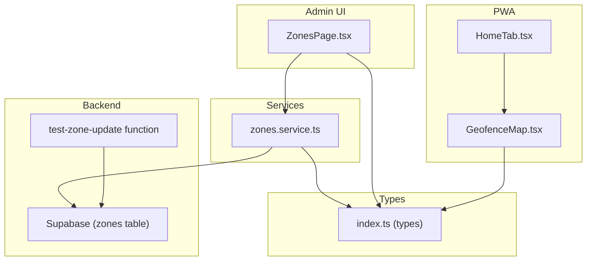
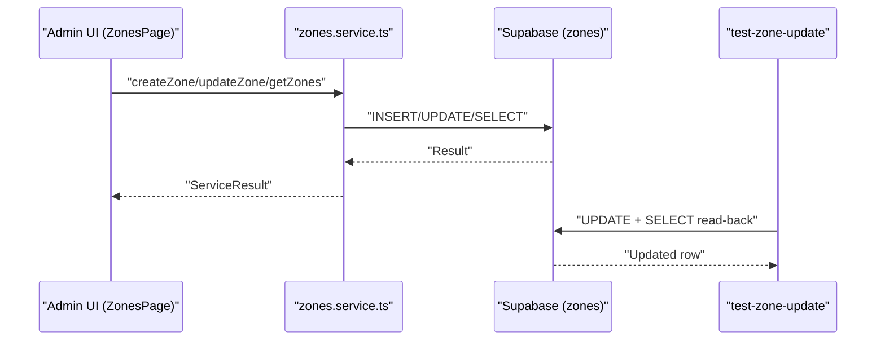
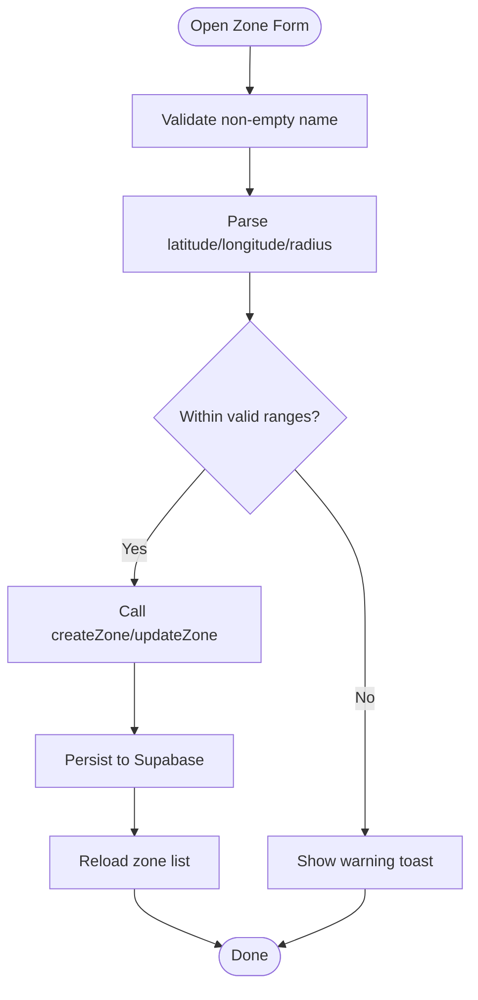
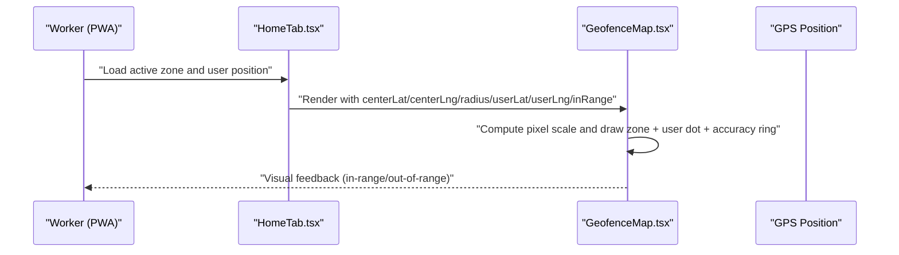
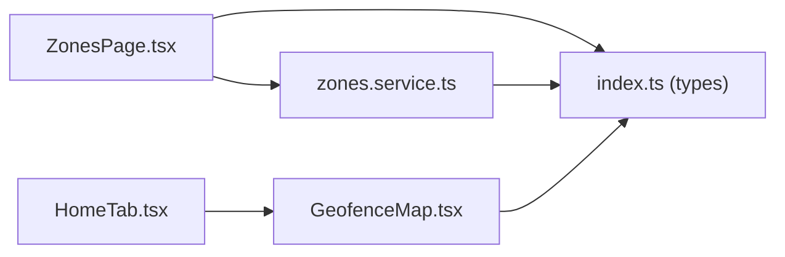

# Zone Management

<cite>
**Referenced Files in This Document**
- [ZonesPage.tsx](file://src/components/admin/ZonesPage.tsx)
- [zones.service.ts](file://src/services/zones.service.ts)
- [index.ts (types)](file://src/types/index.ts)
- [GeofenceMap.tsx](file://src/components/pwa/GeofenceMap.tsx)
- [HomeTab.tsx](file://src/components/pwa/HomeTab.tsx)
- [index.ts (test-zone-update)](file://supabase/functions/test-zone-update/index.ts)
</cite>

## Table of Contents
1. [Introduction](#introduction)
2. [Project Structure](#project-structure)
3. [Core Components](#core-components)
4. [Architecture Overview](#architecture-overview)
5. [Detailed Component Analysis](#detailed-component-analysis)
6. [Dependency Analysis](#dependency-analysis)
7. [Performance Considerations](#performance-considerations)
8. [Troubleshooting Guide](#troubleshooting-guide)
9. [Conclusion](#conclusion)
10. [Appendices](#appendices)

## Introduction
This document describes the Zone Management system used to define work zones, configure geofences, and integrate with GPS tracking for attendance monitoring. It covers zone creation and editing, boundary definition via coordinates and radius, validation rules, and how zones are represented in both administrative and field-facing UIs. It also outlines workflows for assigning zones to workers and shifts, monitoring presence, detecting violations, and alerting. Guidance is included for performance optimization, coordinate precision, and troubleshooting common geofencing issues.

## Project Structure
The Zone Management system spans UI pages, a service layer, and shared types. The administrative UI renders a map and list of zones, validates inputs, and persists changes to the backend. The PWA includes a geofence visualization component that displays a user’s current GPS position relative to a selected zone. Types define the shape of zone records and related entities.

**Diagram sources**
- [ZonesPage.tsx:1-420](file://src/components/admin/ZonesPage.tsx#L1-L420)
- [zones.service.ts:1-50](file://src/services/zones.service.ts#L1-L50)
- [index.ts (types):10-19](file://src/types/index.ts#L10-L19)
- [GeofenceMap.tsx:1-153](file://src/components/pwa/GeofenceMap.tsx#L1-L153)
- [HomeTab.tsx:590-619](file://src/components/pwa/HomeTab.tsx#L590-L619)
- [index.ts (test-zone-update):1-68](file://supabase/functions/test-zone-update/index.ts#L1-L68)

**Section sources**
- [ZonesPage.tsx:1-420](file://src/components/admin/ZonesPage.tsx#L1-L420)
- [zones.service.ts:1-50](file://src/services/zones.service.ts#L1-L50)
- [index.ts (types):10-19](file://src/types/index.ts#L10-L19)
- [GeofenceMap.tsx:1-153](file://src/components/pwa/GeofenceMap.tsx#L1-L153)
- [HomeTab.tsx:590-619](file://src/components/pwa/HomeTab.tsx#L590-L619)
- [index.ts (test-zone-update):1-68](file://supabase/functions/test-zone-update/index.ts#L1-L68)

## Core Components
- Zone model and related types: Defines the structure of a zone, including name, description, coordinates, radius, status, and optional color.
- Zone service: Provides CRUD operations for zones and applies validation rules for coordinates and radius.
- Admin UI (ZonesPage): Renders a map and list of zones, handles creation/editing, deletion, and selection.
- PWA geofence visualization: Renders a canvas-based map around a zone center, showing user location and accuracy.

Key responsibilities:
- Coordinate validation: Latitude [-90, 90], longitude [-180, 180], radius (1–10,000 meters).
- Zone persistence: Uses Supabase “zones” table via service methods.
- UI rendering: Admin map draws active zones with proportional radii; PWA map shows user position and accuracy ring.

**Section sources**
- [index.ts (types):10-19](file://src/types/index.ts#L10-L19)
- [zones.service.ts:16-27](file://src/services/zones.service.ts#L16-L27)
- [ZonesPage.tsx:36-114](file://src/components/admin/ZonesPage.tsx#L36-L114)
- [GeofenceMap.tsx:42-121](file://src/components/pwa/GeofenceMap.tsx#L42-L121)

## Architecture Overview
The system follows a layered architecture:
- Presentation layer: ZonesPage (admin) and GeofenceMap (PWA).
- Service layer: zones.service.ts encapsulates data access and validation.
- Data layer: Supabase “zones” table; a test function demonstrates read-back verification.

**Diagram sources**
- [ZonesPage.tsx:271-283](file://src/components/admin/ZonesPage.tsx#L271-L283)
- [zones.service.ts:4-49](file://src/services/zones.service.ts#L4-L49)
- [index.ts (test-zone-update):32-43](file://supabase/functions/test-zone-update/index.ts#L32-L43)

## Detailed Component Analysis

### Zone Model and Validation
- Zone fields: id, name, description, latitude, longitude, radius_meter, status, color.
- Validation rules enforced by the service:
  - Latitude: -90 to 90
  - Longitude: -180 to 180
  - Radius: 1 to 10,000 meters

These rules ensure geofence boundaries remain physically meaningful and prevent invalid configurations.

**Section sources**
- [index.ts (types):10-19](file://src/types/index.ts#L10-L19)
- [zones.service.ts:16-27](file://src/services/zones.service.ts#L16-L27)

### Zone Creation and Editing (Admin UI)
- ZonesPage renders:
  - A map of active zones with proportional radii.
  - A table listing all zones with status and actions.
  - A modal form for adding/editing zones with validation feedback.
- Form validation mirrors service-side rules and enforces:
  - Non-empty name.
  - Numeric coordinate and radius ranges.
- Save triggers either createZone or updateZone, followed by reloading the zone list.

**Diagram sources**
- [ZonesPage.tsx:221-247](file://src/components/admin/ZonesPage.tsx#L221-L247)
- [zones.service.ts:29-43](file://src/services/zones.service.ts#L29-L43)

**Section sources**
- [ZonesPage.tsx:155-247](file://src/components/admin/ZonesPage.tsx#L155-L247)
- [zones.service.ts:29-43](file://src/services/zones.service.ts#L29-L43)

### Zone Deletion and Bulk Operations
- Deletion is supported via deleteZone; the admin UI confirms before removing a zone and refreshes the list.
- Bulk operations (e.g., mass updates or deletions) are not present in the current implementation. They would require extending the service and UI to support batch actions.

**Section sources**
- [ZonesPage.tsx:285-295](file://src/components/admin/ZonesPage.tsx#L285-L295)
- [zones.service.ts:45-49](file://src/services/zones.service.ts#L45-L49)

### Zone Assignment to Workers and Shifts
- Worker entity includes a foreign key to a zone and a shift.
- While the code does not implement explicit zone inheritance, hierarchical zone structures are not defined. Zone assignment is per-worker via direct foreign keys.

Implications:
- No automatic inheritance from parent zones.
- Zone assignments are managed alongside worker and shift records.

**Section sources**
- [index.ts (types):32-46](file://src/types/index.ts#L32-L46)

### Geofencing Visualization and Monitoring
- Admin map:
  - Draws active zones with proportional radii and highlights the selected zone.
  - Converts geographic coordinates to screen positions and computes radii using a scaling factor.
- PWA geofence map:
  - Renders a centered circle around the zone center.
  - Plots user position with an accuracy ring and a dashed line to the center.
  - Uses a scaling approximation to convert meters to pixels based on latitude-dependent factors.

**Diagram sources**
- [HomeTab.tsx:590-619](file://src/components/pwa/HomeTab.tsx#L590-L619)
- [GeofenceMap.tsx:42-121](file://src/components/pwa/GeofenceMap.tsx#L42-L121)

**Section sources**
- [ZonesPage.tsx:36-114](file://src/components/admin/ZonesPage.tsx#L36-L114)
- [GeofenceMap.tsx:42-121](file://src/components/pwa/GeofenceMap.tsx#L42-L121)
- [HomeTab.tsx:590-619](file://src/components/pwa/HomeTab.tsx#L590-L619)

### Geofence Violation Detection and Alerts
- The PWA displays in-range vs out-of-range states and GPS accuracy.
- Violations occur when the user leaves the zone radius while clocking in/out.
- Alerting is not implemented in the current code; it would require:
  - Real-time position polling and distance calculations.
  - Backend or function-triggered notifications when thresholds are crossed.

[No sources needed since this section synthesizes behavior without quoting specific files]

### Zone Hierarchy Management
- No hierarchical zone structures are defined in the codebase.
- Zone assignment is direct (per worker and shift) without inheritance.

[No sources needed since this section summarizes absence of features]

## Dependency Analysis
- ZonesPage depends on:
  - zones.service.ts for CRUD operations.
  - index.ts (types) for type safety.
  - useAppSettings hook for default radius.
- zones.service.ts depends on:
  - Supabase client for database operations.
  - index.ts (types) for return types.
- GeofenceMap depends on:
  - index.ts (types) for props.
  - Canvas API for rendering.

**Diagram sources**
- [ZonesPage.tsx:1-420](file://src/components/admin/ZonesPage.tsx#L1-L420)
- [zones.service.ts:1-50](file://src/services/zones.service.ts#L1-L50)
- [index.ts (types):10-19](file://src/types/index.ts#L10-L19)
- [GeofenceMap.tsx:1-153](file://src/components/pwa/GeofenceMap.tsx#L1-L153)
- [HomeTab.tsx:590-619](file://src/components/pwa/HomeTab.tsx#L590-L619)

**Section sources**
- [ZonesPage.tsx:1-420](file://src/components/admin/ZonesPage.tsx#L1-L420)
- [zones.service.ts:1-50](file://src/services/zones.service.ts#L1-L50)
- [index.ts (types):10-19](file://src/types/index.ts#L10-L19)
- [GeofenceMap.tsx:1-153](file://src/components/pwa/GeofenceMap.tsx#L1-L153)
- [HomeTab.tsx:590-619](file://src/components/pwa/HomeTab.tsx#L590-L619)

## Performance Considerations
- Rendering:
  - Admin map scales radii to keep circles readable; limits minimum/maximum drawn radii to improve legibility.
  - PWA map uses a constant display radius and a linear meter-to-pixel scale derived from latitude.
- Data access:
  - Zones are fetched with ordering by name; consider indexing on status and name for frequent filtering.
- Validation:
  - Client-side validation reduces unnecessary server calls; server-side validation ensures data integrity.

[No sources needed since this section provides general guidance]

## Troubleshooting Guide
Common issues and resolutions:
- Invalid coordinates or radius:
  - Symptom: Save fails with a warning toast.
  - Cause: Values outside accepted ranges.
  - Fix: Adjust inputs to fall within valid bounds.
- Zone not visible on map:
  - Symptom: Active zone does not render.
  - Cause: Zero or near-zero coordinate ranges leading to division by small numbers during scaling.
  - Fix: Ensure multiple active zones exist or adjust zoom/selection logic.
- Update verification:
  - Use the test function to verify UPDATE + SELECT read-back behavior for a zone.

**Section sources**
- [ZonesPage.tsx:221-247](file://src/components/admin/ZonesPage.tsx#L221-L247)
- [ZonesPage.tsx:36-114](file://src/components/admin/ZonesPage.tsx#L36-L114)
- [index.ts (test-zone-update):32-43](file://supabase/functions/test-zone-update/index.ts#L32-L43)

## Conclusion
The Zone Management system provides robust zone creation, validation, and visualization. It supports per-worker zone assignment and offers strong client-side rendering for both administrative and field-facing experiences. Future enhancements could include hierarchical zone structures, bulk operations, real-time violation alerts, and expanded backend triggers for automated notifications.

[No sources needed since this section summarizes without analyzing specific files]

## Appendices

### Example Scenarios
- Creating a small-radius zone near a desk: Set radius to a few dozen meters; ensure coordinates are within valid ranges.
- Large campus zone: Use a larger radius; verify map scaling keeps the circle readable.
- Worker assignment: Assign a worker to a zone and a shift; monitor attendance against the zone’s geofence.

[No sources needed since this section provides conceptual examples]

### Geofencing Accuracy Considerations
- GPS accuracy is displayed in the PWA; use it to assess confidence in in-range/out-of-range decisions.
- For sensitive check-ins, consider tolerance thresholds and retry logic for low-accuracy readings.

[No sources needed since this section provides general guidance]

### Integration with GPS Tracking Systems
- The PWA shows user position and accuracy; integrate periodic GPS updates to drive in-range state.
- Backend functions can be extended to emit events or notifications upon significant state changes.

[No sources needed since this section provides general guidance]