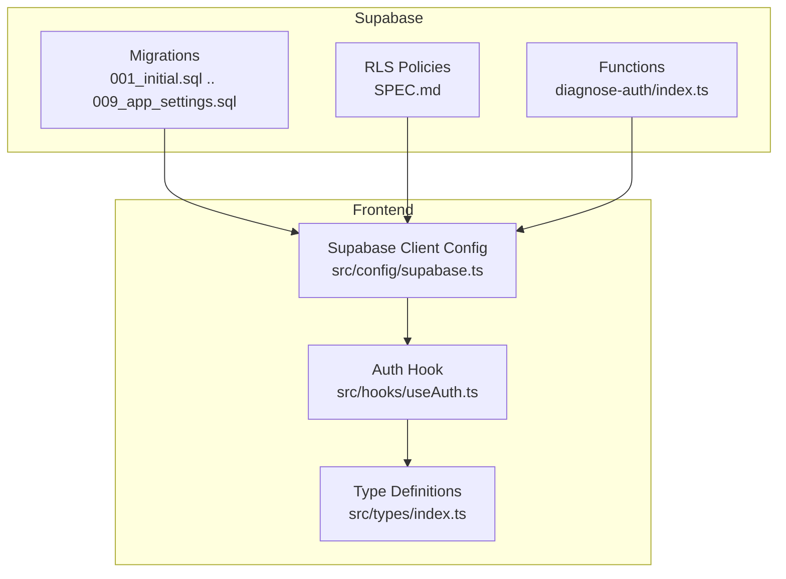
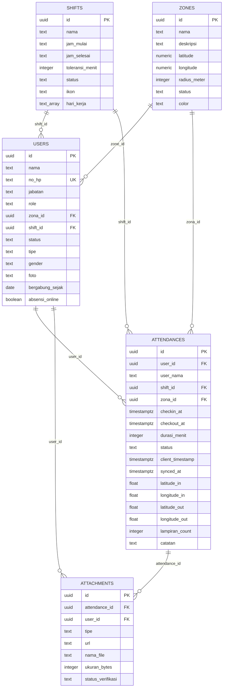
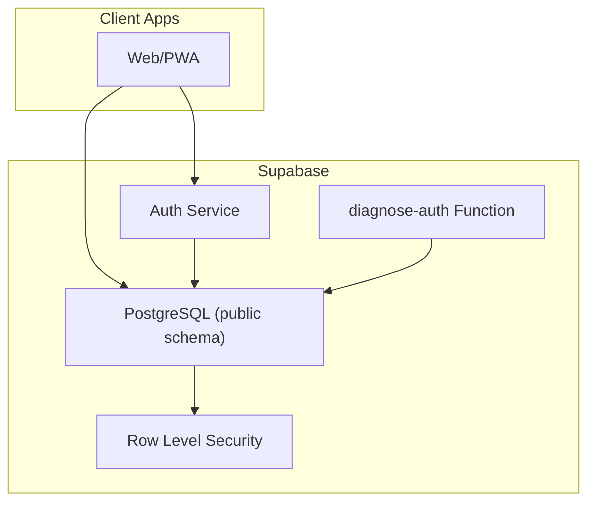
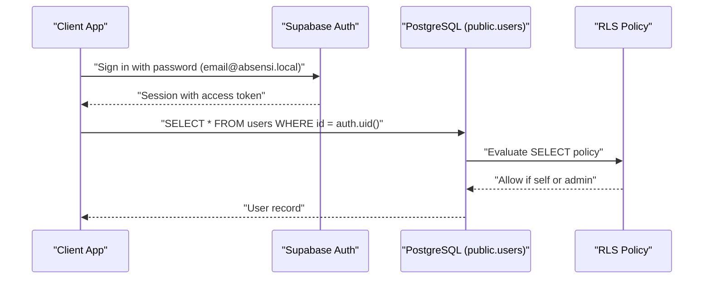
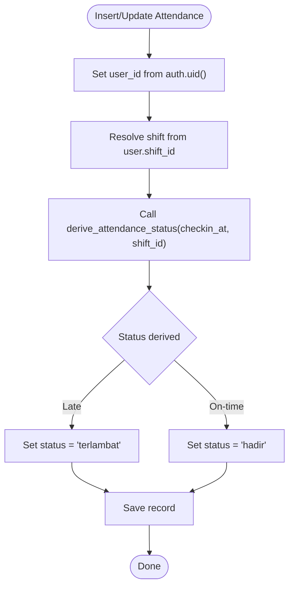
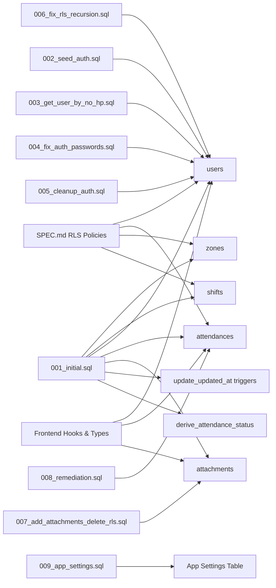

# Database Design

<cite>
**Referenced Files in This Document**
- [001_initial.sql](file://supabase/migrations/001_initial.sql)
- [002_seed_auth.sql](file://supabase/migrations/002_seed_auth.sql)
- [003_get_user_by_no_hp.sql](file://supabase/migrations/003_get_user_by_no_hp.sql)
- [004_fix_auth_passwords.sql](file://supabase/migrations/004_fix_auth_passwords.sql)
- [005_cleanup_auth.sql](file://supabase/migrations/005_cleanup_auth.sql)
- [006_fix_rls_recursion.sql](file://supabase/migrations/006_fix_rls_recursion.sql)
- [007_add_attachments_delete_rls.sql](file://supabase/migrations/007_add_attachments_delete_rls.sql)
- [008_remediation.sql](file://supabase/migrations/008_remediation.sql)
- [009_app_settings.sql](file://supabase/migrations/009_app_settings.sql)
- [SPEC.md](file://SPEC.md)
- [DESIGN.md](file://DESIGN.md)
- [index.ts](file://src/types/index.ts)
- [useAuth.ts](file://src/hooks/useAuth.ts)
- [supabase.ts](file://src/config/supabase.ts)
- [index.ts](file://supabase/functions/diagnose-auth/index.ts)
</cite>

## Table of Contents
1. [Introduction](#introduction)
2. [Project Structure](#project-structure)
3. [Core Components](#core-components)
4. [Architecture Overview](#architecture-overview)
5. [Detailed Component Analysis](#detailed-component-analysis)
6. [Dependency Analysis](#dependency-analysis)
7. [Performance Considerations](#performance-considerations)
8. [Troubleshooting Guide](#troubleshooting-guide)
9. [Conclusion](#conclusion)
10. [Appendices](#appendices)

## Introduction
This document presents the database design for AbsensiOnline, focusing on the entity relationship model, table schemas, constraints, Row Level Security (RLS), migration strategy, and operational considerations. It synthesizes schema definitions from Supabase migrations, RLS policies documented in SPEC, and supporting frontend integration details. The goal is to provide a clear understanding of how data is modeled, secured, and accessed across the application.

## Project Structure
The database schema and access control are primarily defined in Supabase migrations and functions, while the frontend interacts with the database through Supabase client configuration and typed interfaces.

**Diagram sources**
- [001_initial.sql](file://supabase/migrations/001_initial.sql)
- [SPEC.md](file://SPEC.md)
- [index.ts](file://supabase/functions/diagnose-auth/index.ts)
- [supabase.ts](file://src/config/supabase.ts)
- [useAuth.ts](file://src/hooks/useAuth.ts)
- [index.ts](file://src/types/index.ts)

**Section sources**
- [001_initial.sql](file://supabase/migrations/001_initial.sql)
- [SPEC.md](file://SPEC.md)
- [DESIGN.md](file://DESIGN.md)
- [supabase.ts](file://src/config/supabase.ts)

## Core Components
This section outlines the core entities and their relationships, derived from the initial migration and RLS policies.

- Zones: Geographic boundaries used for attendance geofencing. Each zone defines a center coordinate and radius, along with status and optional color.
- Shifts: Work schedules with start/end times, tolerance minutes, recurrence days, and status.
- Users: Employees with personal info, role, zone assignment, shift assignment, employment type, gender, photo, join date, and online presence flag.
- Attendances: Records of check-in/check-out events linked to users, shifts, and zones, including computed duration, status, location data, attachment count, and notes.
- Attachments: Files associated with attendance records, linked to both attendance and user, with verification status.

Entity relationships:
- Users belong to a single Zone and a single Shift (optional).
- Attendances belong to one User, one Shift, and one Zone.
- Attachments belong to one Attendance and one User.

**Diagram sources**
- [001_initial.sql](file://supabase/migrations/001_initial.sql)

**Section sources**
- [001_initial.sql](file://supabase/migrations/001_initial.sql)
- [SPEC.md](file://SPEC.md)

## Architecture Overview
The database architecture centers on Supabase’s managed PostgreSQL with RLS enabled on all core tables. Frontend clients connect via the Supabase client configured to target the public schema. Authentication is handled through Supabase Auth, with custom metadata stored for user identification. Functions assist in diagnostics and administrative tasks.

**Diagram sources**
- [DESIGN.md](file://DESIGN.md)
- [supabase.ts](file://src/config/supabase.ts)
- [index.ts](file://supabase/functions/diagnose-auth/index.ts)

**Section sources**
- [DESIGN.md](file://DESIGN.md)
- [supabase.ts](file://src/config/supabase.ts)

## Detailed Component Analysis

### Zones
- Purpose: Define geographic regions for attendance geofencing.
- Schema highlights:
  - Primary key: id (UUID)
  - Fields: nama, deskripsi, latitude, longitude, radius_meter, status, color
  - Constraints: status constrained to predefined values; defaults applied where appropriate
- Indexes: None explicitly defined in the initial migration; consider adding spatial/geographic indexes if queries involve proximity/radius filtering.
- RLS: Access controlled via policies that permit authenticated users to read zones and restrict modifications to admins.

**Section sources**
- [001_initial.sql](file://supabase/migrations/001_initial.sql)
- [SPEC.md](file://SPEC.md)

### Shifts
- Purpose: Define work schedules with tolerance and working days.
- Schema highlights:
  - Primary key: id (UUID)
  - Fields: nama, jam_mulai, jam_selesai, toleransi_menit (default 15), status (default 'aktif'), ikon (emoji), hari_kerja (array, default empty)
  - Constraints: toleransi_menit non-negative; status constrained; default values for availability and icon
- Indexes: None explicitly defined; consider indexing hari_kerja for schedule queries.
- RLS: Readable by authenticated users; modifications restricted to admins.

**Section sources**
- [001_initial.sql](file://supabase/migrations/001_initial.sql)
- [SPEC.md](file://SPEC.md)

### Users
- Purpose: Store employee profiles and organizational assignments.
- Schema highlights:
  - Primary key: id (UUID)
  - Unique key: no_hp
  - Fields: nama, no_hp, jabatan, role (default 'worker'), zona_id (FK to zones), shift_id (FK to shifts), status (default 'aktif'), tipe (default 'tetap'), gender (default 'pria'), foto, bergabung_sejak (default current date), absensi_online (default true)
  - Constraints: role, status, tipe, gender constrained; FKs set to ON DELETE SET NULL for optional assignments
- Indexes: Composite index on (no_hp, role); separate indexes on zona_id and shift_id
- RLS: Select policy allows workers to read only themselves; admins can select/update/delete all users. Policies rewritten to avoid recursion using JWT claims.

**Diagram sources**
- [SPEC.md](file://SPEC.md)
- [006_fix_rls_recursion.sql](file://supabase/migrations/006_fix_rls_recursion.sql)
- [useAuth.ts](file://src/hooks/useAuth.ts)

**Section sources**
- [001_initial.sql](file://supabase/migrations/001_initial.sql)
- [SPEC.md](file://SPEC.md)
- [006_fix_rls_recursion.sql](file://supabase/migrations/006_fix_rls_recursion.sql)
- [useAuth.ts](file://src/hooks/useAuth.ts)

### Attendances
- Purpose: Track check-in/check-out events with status derivation and location data.
- Schema highlights:
  - Primary key: id (UUID)
  - Fields: user_id (FK), user_nama, shift_id (FK), zona_id (FK), checkin_at, checkout_at, durasi_menit, status (default 'absen'), client_timestamp, synced_at, latitude_in, longitude_in, latitude_out, longitude_out, lampiran_count (default 0), catatan
  - Constraints: status constrained; FKs cascade deletes for referential integrity; triggers update updated_at on updates
- Indexes: Composite index on (user_id, checkin_at DESC); index on checkin_at DESC; indexes on zona_id and status
- RLS: Admins can read all; workers can read only their own; workers can insert/update only their own; admins can override statuses; deletions allowed for admins.

**Diagram sources**
- [001_initial.sql](file://supabase/migrations/001_initial.sql)

**Section sources**
- [001_initial.sql](file://supabase/migrations/001_initial.sql)
- [SPEC.md](file://SPEC.md)

### Attachments
- Purpose: Store media/documents linked to attendance records and users.
- Schema highlights:
  - Primary key: id (UUID)
  - Fields: attendance_id (FK), user_id (FK), tipe (constraint: 'foto' | 'dokumen'), url, nama_file, ukuran_bytes, status_verifikasi (default 'menunggu')
  - Constraints: FKs cascade deletes; verification status constrained
- Indexes: Indexes on attendance_id and user_id
- RLS: Not explicitly defined in the initial migration; later migrations add deletion RLS for attachments.

**Section sources**
- [001_initial.sql](file://supabase/migrations/001_initial.sql)
- [007_add_attachments_delete_rls.sql](file://supabase/migrations/007_add_attachments_delete_rls.sql)

### Functions and Triggers
- update_updated_at(): Generic trigger to set updated_at on row updates for zones, shifts, users, and attendances.
- derive_attendance_status(p_checkin_at, p_shift_id): Computes attendance status based on scheduled time and shift tolerance.

**Section sources**
- [001_initial.sql](file://supabase/migrations/001_initial.sql)

## Dependency Analysis
This section maps dependencies among database components and external integrations.

**Diagram sources**
- [001_initial.sql](file://supabase/migrations/001_initial.sql)
- [SPEC.md](file://SPEC.md)
- [006_fix_rls_recursion.sql](file://supabase/migrations/006_fix_rls_recursion.sql)
- [007_add_attachments_delete_rls.sql](file://supabase/migrations/007_add_attachments_delete_rls.sql)
- [002_seed_auth.sql](file://supabase/migrations/002_seed_auth.sql)
- [003_get_user_by_no_hp.sql](file://supabase/migrations/003_get_user_by_no_hp.sql)
- [004_fix_auth_passwords.sql](file://supabase/migrations/004_fix_auth_passwords.sql)
- [005_cleanup_auth.sql](file://supabase/migrations/005_cleanup_auth.sql)
- [008_remediation.sql](file://supabase/migrations/008_remediation.sql)
- [009_app_settings.sql](file://supabase/migrations/009_app_settings.sql)
- [useAuth.ts](file://src/hooks/useAuth.ts)
- [index.ts](file://src/types/index.ts)

**Section sources**
- [001_initial.sql](file://supabase/migrations/001_initial.sql)
- [SPEC.md](file://SPEC.md)
- [006_fix_rls_recursion.sql](file://supabase/migrations/006_fix_rls_recursion.sql)
- [007_add_attachments_delete_rls.sql](file://supabase/migrations/007_add_attachments_delete_rls.sql)
- [002_seed_auth.sql](file://supabase/migrations/002_seed_auth.sql)
- [003_get_user_by_no_hp.sql](file://supabase/migrations/003_get_user_by_no_hp.sql)
- [004_fix_auth_passwords.sql](file://supabase/migrations/004_fix_auth_passwords.sql)
- [005_cleanup_auth.sql](file://supabase/migrations/005_cleanup_auth.sql)
- [008_remediation.sql](file://supabase/migrations/008_remediation.sql)
- [009_app_settings.sql](file://supabase/migrations/009_app_settings.sql)
- [useAuth.ts](file://src/hooks/useAuth.ts)
- [index.ts](file://src/types/index.ts)

## Performance Considerations
- Indexes:
  - Users: Composite index on (no_hp, role) supports lookups by phone and role; separate indexes on zona_id and shift_id support joins.
  - Attendances: Composite index on (user_id, checkin_at DESC) optimizes user history retrieval; index on checkin_at DESC supports chronological queries; indexes on zona_id and status support filtering.
  - Attachments: Indexes on attendance_id and user_id optimize lookup by related entities.
- Triggers: update_updated_at triggers are lightweight but should be considered for write-heavy workloads.
- RLS Overhead: Enabling RLS adds evaluation overhead per query; keep policies minimal and leverage indexes to reduce scans.
- Spatial Queries: If future needs arise for proximity/radius filtering on zones, consider adding GIST indexes or materialized views.

[No sources needed since this section provides general guidance]

## Troubleshooting Guide
- Infinite Recursion in RLS:
  - Symptom: Policy evaluation errors due to recursive subqueries on users table.
  - Resolution: Use JWT claims to evaluate roles without querying users inside policies.
  - Evidence: Migration 006 rewrites admin policies to use auth.jwt() metadata.
- Authentication Flow Issues:
  - Symptom: Login failures or inability to hydrate user profile.
  - Resolution: Verify frontend login uses the correct email pattern and PIN hashing; confirm RPC get_user_by_no_hp returns a match; ensure session hydration succeeds.
  - Evidence: Frontend hook performs RPC lookup and session-based login; diagnose-auth function helps inspect users.
- Diagnostics:
  - Use the diagnose-auth function to list filtered auth users and public users for validation.

**Section sources**
- [006_fix_rls_recursion.sql](file://supabase/migrations/006_fix_rls_recursion.sql)
- [useAuth.ts](file://src/hooks/useAuth.ts)
- [index.ts](file://supabase/functions/diagnose-auth/index.ts)

## Conclusion
AbsensiOnline’s database design leverages Supabase’s managed PostgreSQL with a clear entity model centered on zones, shifts, users, attendances, and attachments. RLS ensures data isolation by role, with policies refined to avoid recursion. Migrations define schema, constraints, indexes, and helper functions, while the frontend integrates via Supabase client configuration and typed interfaces. The design balances simplicity, security, and extensibility for attendance tracking and verification workflows.

[No sources needed since this section summarizes without analyzing specific files]

## Appendices

### Migration Strategy and Versioning
- Approach: Supabase migrations are numbered sequentially. Each migration file applies incremental schema changes, seeds, and policy updates.
- Typical Lifecycle:
  - Initial schema creation (001_initial.sql)
  - Auth seeding and adjustments (002_seed_auth.sql, 003_get_user_by_no_hp.sql, 004_fix_auth_passwords.sql, 005_cleanup_auth.sql)
  - RLS fixes and refinement (006_fix_rls_recursion.sql)
  - Feature additions and policy tightening (007_add_attachments_delete_rls.sql)
  - Operational improvements (008_remediation.sql)
  - Application settings (009_app_settings.sql)
- Best Practices:
  - Keep migrations atomic and reversible where possible.
  - Add indexes alongside schema changes.
  - Test RLS policies in staging before applying to production.

**Section sources**
- [001_initial.sql](file://supabase/migrations/001_initial.sql)
- [002_seed_auth.sql](file://supabase/migrations/002_seed_auth.sql)
- [003_get_user_by_no_hp.sql](file://supabase/migrations/003_get_user_by_no_hp.sql)
- [004_fix_auth_passwords.sql](file://supabase/migrations/004_fix_auth_passwords.sql)
- [005_cleanup_auth.sql](file://supabase/migrations/005_cleanup_auth.sql)
- [006_fix_rls_recursion.sql](file://supabase/migrations/006_fix_rls_recursion.sql)
- [007_add_attachments_delete_rls.sql](file://supabase/migrations/007_add_attachments_delete_rls.sql)
- [008_remediation.sql](file://supabase/migrations/008_remediation.sql)
- [009_app_settings.sql](file://supabase/migrations/009_app_settings.sql)

### Data Integrity Constraints
- Primary Keys: All core tables use UUID primary keys.
- Foreign Keys: Users.zone_id and Users.shift_id are optional; Attendances links to Users, Shifts, and Zones; Attachments links to Attendances and Users with cascading deletes.
- Check Constraints: Enum-like fields constrained to predefined values (e.g., status, role, tipe, gender, verification status).
- Defaults: Many fields have sensible defaults to minimize application-side logic.

**Section sources**
- [001_initial.sql](file://supabase/migrations/001_initial.sql)

### Sample Data Structures
- Zone: { id, nama, deskripsi, latitude, longitude, radius_meter, status, color }
- Shift: { id, nama, jam_mulai, jam_selesai, toleransi_menit, status, ikon, hari_kerja }
- User: { id, nama, no_hp, jabatan, role, zona_id, shift_id, status, tipe, gender, foto, bergabung_sejak, absensi_online }
- Attendance: { id, user_id, user_nama, shift_id, zona_id, checkin_at, checkout_at, durasi_menit, status, client_timestamp, synced_at, latitude_in, longitude_in, latitude_out, longitude_out, lampiran_count, catatan }
- Attachment: { id, attendance_id, user_id, tipe, url, nama_file, ukuran_bytes, status_verifikasi }

**Section sources**
- [index.ts](file://src/types/index.ts)
- [001_initial.sql](file://supabase/migrations/001_initial.sql)

### Audit Trails and Retention
- Audit Trail: Supabase does not automatically generate audit logs for row changes. Consider implementing a dedicated audit log table or leveraging Supabase’s logging features externally.
- Retention: No explicit retention policies are defined in the migrations. Define retention windows and cleanup jobs (e.g., purge old attendance records after N months) as part of operational procedures.

[No sources needed since this section provides general guidance]