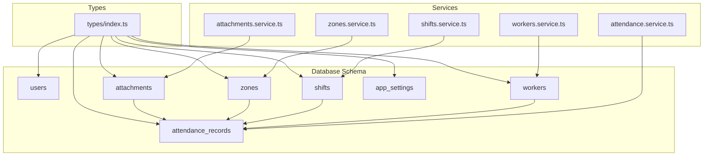
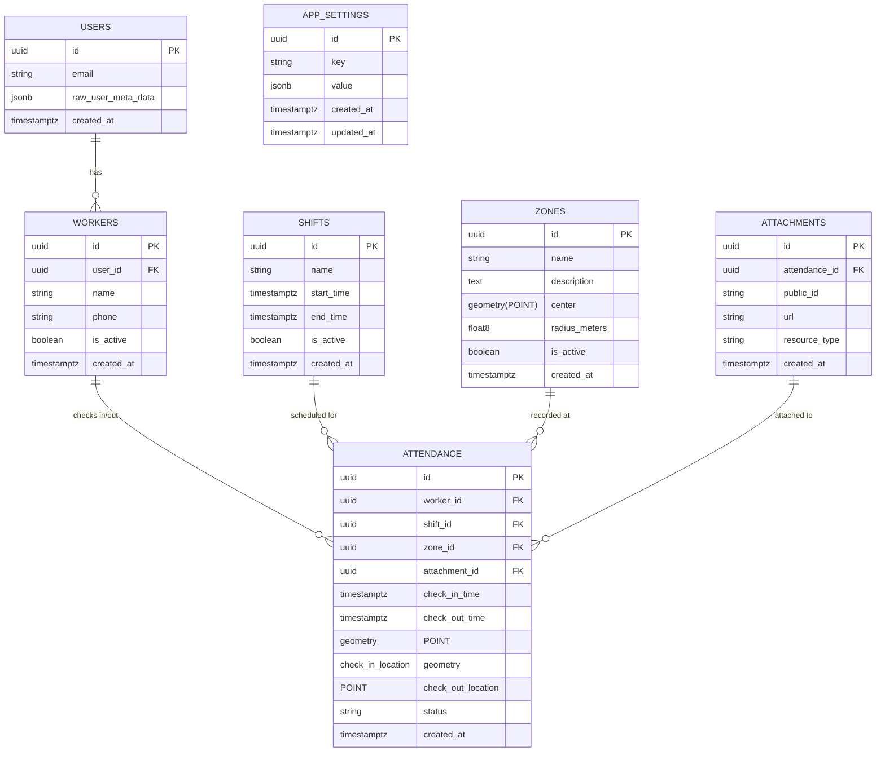
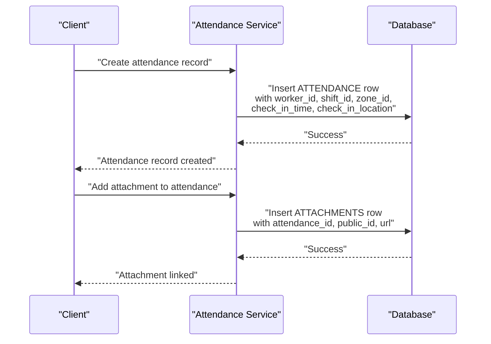
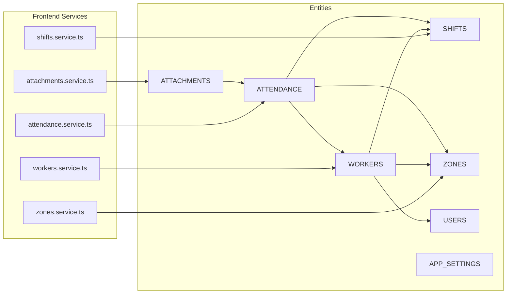

# Entity Relationships

<cite>
**Referenced Files in This Document**
- [001_initial.sql](file://supabase/migrations/001_initial.sql)
- [009_app_settings.sql](file://supabase/migrations/009_app_settings.sql)
- [attachments.service.ts](file://src/services/attachments.service.ts)
- [attendance.service.ts](file://src/services/attendance.service.ts)
- [shifts.service.ts](file://src/services/shifts.service.ts)
- [workers.service.ts](file://src/services/workers.service.ts)
- [zones.service.ts](file://src/services/zones.service.ts)
- [index.ts](file://src/types/index.ts)
</cite>

## Table of Contents
1. [Introduction](#introduction)
2. [Project Structure](#project-structure)
3. [Core Components](#core-components)
4. [Architecture Overview](#architecture-overview)
5. [Detailed Component Analysis](#detailed-component-analysis)
6. [Dependency Analysis](#dependency-analysis)
7. [Performance Considerations](#performance-considerations)
8. [Troubleshooting Guide](#troubleshooting-guide)
9. [Conclusion](#conclusion)

## Introduction
This document describes the entity relationships for AbsensiOnline’s database schema. It focuses on core entities: users, workers, attendance_records, shifts, zones, attachments, and app_settings. The goal is to define entity roles, relationships, cardinalities, foreign keys, referential integrity rules, and business rules that govern how AbsensiOnline tracks worker attendance, assigns workers to shifts and zones, manages location-based check-ins, and stores supporting metadata and settings.

## Project Structure
The database schema is defined via Supabase migrations, while client-side services encapsulate CRUD operations and typed models. The relevant files include:
- Initial schema and constraints
- Application settings schema
- TypeScript type definitions
- Services for workers, shifts, zones, attendance, attachments

**Diagram sources**
- [001_initial.sql](file://supabase/migrations/001_initial.sql)
- [009_app_settings.sql](file://supabase/migrations/009_app_settings.sql)
- [workers.service.ts](file://src/services/workers.service.ts)
- [shifts.service.ts](file://src/services/shifts.service.ts)
- [zones.service.ts](file://src/services/zones.service.ts)
- [attendance.service.ts](file://src/services/attendance.service.ts)
- [attachments.service.ts](file://src/services/attachments.service.ts)
- [index.ts](file://src/types/index.ts)

**Section sources**
- [001_initial.sql](file://supabase/migrations/001_initial.sql)
- [009_app_settings.sql](file://supabase/migrations/009_app_settings.sql)
- [index.ts](file://src/types/index.ts)

## Core Components
This section defines the core entities and their primary attributes, focusing on how they relate to each other.

- Users
  - Role: Authentication and authorization anchor for the system.
  - Attributes: Typically includes identifiers and credentials managed by Supabase Auth.
  - Relationship: Workers are linked to Users via a foreign key; this enables role-based access and auditability.

- Workers
  - Role: Represents individuals who perform work and can be assigned to shifts and zones.
  - Attributes: Personal details and a foreign key to Users.
  - Relationship: One-to-many with Attendance Records (a worker checks in/out multiple times). Many-to-many with Shifts/Zones via assignment tables (see schema below).

- Attendance Records
  - Role: Captures check-in/check-out events with geolocation and timestamps.
  - Attributes: References to Worker, Shift, Zone, and optional Attachments.
  - Relationship: Links Workers to Shifts and Zones; optionally links to Attachments.

- Shifts
  - Role: Defines working periods (start/end) and associated policies.
  - Relationship: Many workers can be assigned to many shifts; many attendance records reference a shift.

- Zones
  - Role: Geographic regions or facilities where attendance is recorded.
  - Relationship: Many attendance records reference a zone; workers can be assigned to zones.

- Attachments
  - Role: Stores media (photos, documents) related to attendance events.
  - Relationship: One-to-many with Attendance Records (an attendance record may have zero or more attachments).

- App Settings
  - Role: Global configuration for the application (e.g., enforcement flags, thresholds).
  - Relationship: Independent entity; consumed by services to enforce business rules.

**Section sources**
- [001_initial.sql](file://supabase/migrations/001_initial.sql)
- [009_app_settings.sql](file://supabase/migrations/009_app_settings.sql)
- [index.ts](file://src/types/index.ts)

## Architecture Overview
The entity model centers around Attendance Records as the event hub, linking Workers, Shifts, and Zones. Attachments augment attendance events. App Settings influence validation and enforcement rules. Services on the frontend coordinate reads/writes against these entities.

**Diagram sources**
- [001_initial.sql](file://supabase/migrations/001_initial.sql)
- [009_app_settings.sql](file://supabase/migrations/009_app_settings.sql)

## Detailed Component Analysis

### Users
- Purpose: Authentication and identity provider via Supabase Auth.
- Relationship: Workers reference Users to bind profiles and permissions.
- Cardinality: One-to-many with Workers.

**Section sources**
- [001_initial.sql](file://supabase/migrations/001_initial.sql)
- [index.ts](file://src/types/index.ts)

### Workers
- Purpose: Core person entity for attendance.
- Assignments: Workers are assigned to shifts and zones; assignments are enforced by foreign keys in Attendance Records.
- Cardinality: One-to-many with Attendance Records; indirectly many-to-many with Shifts/Zones via Attendance Records.

**Section sources**
- [001_initial.sql](file://supabase/migrations/001_initial.sql)
- [workers.service.ts](file://src/services/workers.service.ts)
- [index.ts](file://src/types/index.ts)

### Attendance Records
- Purpose: Event log of check-in/check-out actions with timestamps and geolocation.
- Links: Foreign keys to Worker, Shift, Zone, and optional Attachment.
- Status: Enumerated via string field; validated by business rules.
- Cardinality: One-to-one with Attachment (optional); one-to-one with Worker per event; one-to-one with Shift per event; one-to-one with Zone per event.

**Diagram sources**
- [001_initial.sql](file://supabase/migrations/001_initial.sql)
- [attendance.service.ts](file://src/services/attendance.service.ts)
- [attachments.service.ts](file://src/services/attachments.service.ts)

**Section sources**
- [001_initial.sql](file://supabase/migrations/001_initial.sql)
- [attendance.service.ts](file://src/services/attendance.service.ts)
- [attachments.service.ts](file://src/services/attachments.service.ts)
- [index.ts](file://src/types/index.ts)

### Shifts
- Purpose: Defines scheduled work periods.
- Relationship: Attendance Records reference Shifts to associate events with schedules.
- Cardinality: One-to-many with Attendance Records.

**Section sources**
- [001_initial.sql](file://supabase/migrations/001_initial.sql)
- [shifts.service.ts](file://src/services/shifts.service.ts)
- [index.ts](file://src/types/index.ts)

### Zones
- Purpose: Geographic boundaries for attendance capture.
- Relationship: Attendance Records reference Zones to indicate where check-ins occurred.
- Cardinality: One-to-many with Attendance Records.

**Section sources**
- [001_initial.sql](file://supabase/migrations/001_initial.sql)
- [zones.service.ts](file://src/services/zones.service.ts)
- [index.ts](file://src/types/index.ts)

### Attachments
- Purpose: Media assets tied to attendance events.
- Relationship: Optional linkage to Attendance Records; supports evidence collection.
- Cardinality: One-to-many with Attendance Records.

**Section sources**
- [001_initial.sql](file://supabase/migrations/001_initial.sql)
- [attachments.service.ts](file://src/services/attachments.service.ts)
- [index.ts](file://src/types/index.ts)

### App Settings
- Purpose: Centralized configuration for application behavior.
- Relationship: Consumed by services to enforce rules (e.g., geofence radius, required fields).
- Cardinality: Independent; many settings can be defined.

**Section sources**
- [009_app_settings.sql](file://supabase/migrations/009_app_settings.sql)
- [index.ts](file://src/types/index.ts)

## Dependency Analysis
This section maps how services depend on entities and how frontend components interact with backend APIs.

**Diagram sources**
- [workers.service.ts](file://src/services/workers.service.ts)
- [shifts.service.ts](file://src/services/shifts.service.ts)
- [zones.service.ts](file://src/services/zones.service.ts)
- [attendance.service.ts](file://src/services/attendance.service.ts)
- [attachments.service.ts](file://src/services/attachments.service.ts)
- [001_initial.sql](file://supabase/migrations/001_initial.sql)
- [009_app_settings.sql](file://supabase/migrations/009_app_settings.sql)

**Section sources**
- [workers.service.ts](file://src/services/workers.service.ts)
- [shifts.service.ts](file://src/services/shifts.service.ts)
- [zones.service.ts](file://src/services/zones.service.ts)
- [attendance.service.ts](file://src/services/attendance.service.ts)
- [attachments.service.ts](file://src/services/attachments.service.ts)
- [001_initial.sql](file://supabase/migrations/001_initial.sql)
- [009_app_settings.sql](file://supabase/migrations/009_app_settings.sql)

## Performance Considerations
- Indexes: Ensure foreign key columns (worker_id, shift_id, zone_id, attendance_id) are indexed to optimize joins in attendance queries.
- Spatial indexing: Zones’ center geometry should be indexed for efficient proximity checks.
- Partitioning: Large attendance datasets may benefit from partitioning by date ranges.
- Caching: Frequently accessed settings can be cached to reduce repeated reads.

[No sources needed since this section provides general guidance]

## Troubleshooting Guide
Common issues and resolutions grounded in schema constraints and service usage:

- Attendance creation fails due to missing worker or shift
  - Cause: Missing foreign key references.
  - Resolution: Verify worker exists and is assigned to the intended shift before creating attendance records.

- Zone boundary errors
  - Cause: Check-in location outside configured radius.
  - Resolution: Adjust zone radius or reposition center; consult App Settings for enforcement parameters.

- Duplicate attachments
  - Cause: Multiple uploads for the same attendance record.
  - Resolution: Enforce one-to-many semantics; ensure new attachments are appended, not replacing existing ones.

- Authorization mismatch
  - Cause: Worker profile not linked to authenticated user.
  - Resolution: Confirm user_id in Workers matches current authenticated user.

**Section sources**
- [001_initial.sql](file://supabase/migrations/001_initial.sql)
- [009_app_settings.sql](file://supabase/migrations/009_app_settings.sql)
- [index.ts](file://src/types/index.ts)

## Conclusion
AbsensiOnline’s schema is centered on Attendance Records as the event hub, connecting Workers, Shifts, Zones, and Attachments. App Settings provide configurable business rules. The relationships are designed to support accurate, auditable, and location-aware attendance tracking with clear foreign key constraints and referential integrity. Services on the frontend translate these relationships into practical workflows for administrators and workers.