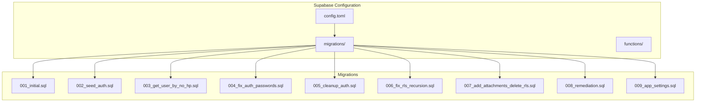
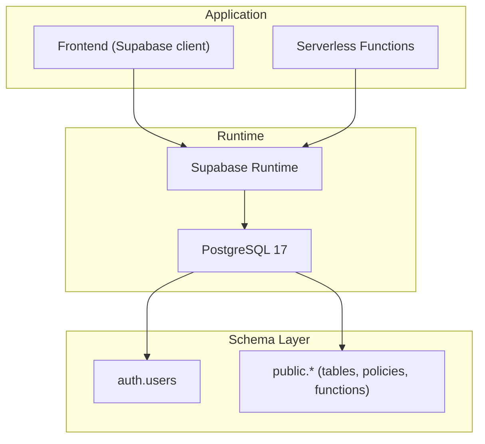
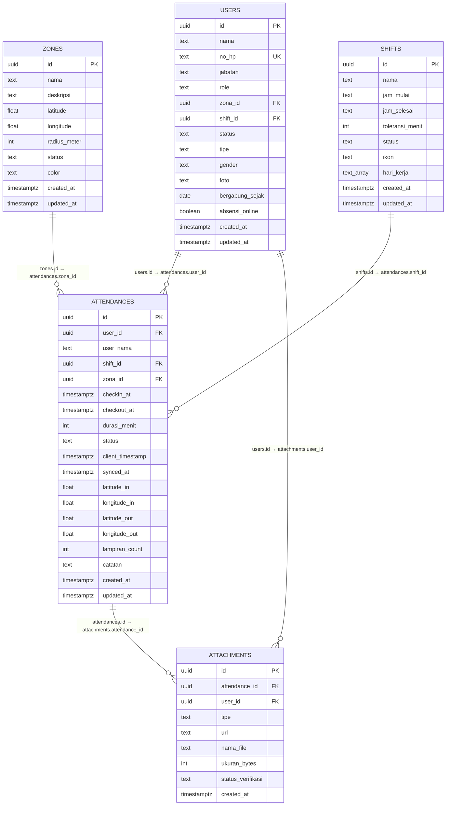
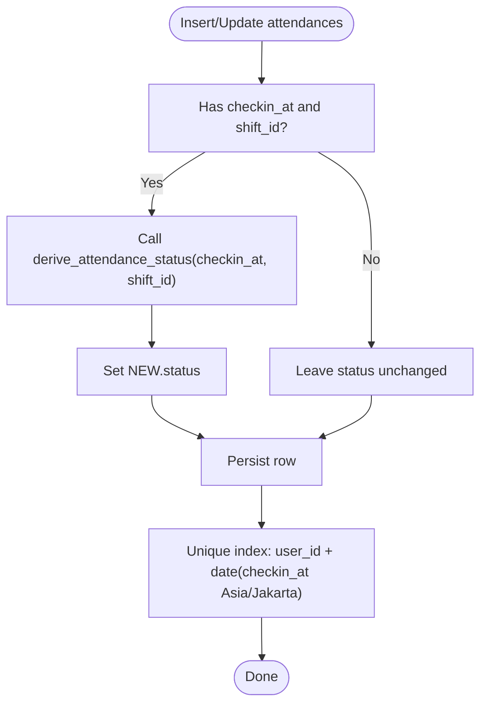

# Migrations and Versioning

<cite>
**Referenced Files in This Document**
- [001_initial.sql](file://supabase/migrations/001_initial.sql)
- [002_seed_auth.sql](file://supabase/migrations/002_seed_auth.sql)
- [003_get_user_by_no_hp.sql](file://supabase/migrations/003_get_user_by_no_hp.sql)
- [004_fix_auth_passwords.sql](file://supabase/migrations/004_fix_auth_passwords.sql)
- [005_cleanup_auth.sql](file://supabase/migrations/005_cleanup_auth.sql)
- [006_fix_rls_recursion.sql](file://supabase/migrations/006_fix_rls_recursion.sql)
- [007_add_attachments_delete_rls.sql](file://supabase/migrations/007_add_attachments_delete_rls.sql)
- [008_remediation.sql](file://supabase/migrations/008_remediation.sql)
- [009_app_settings.sql](file://supabase/migrations/009_app_settings.sql)
- [config.toml](file://supabase/config.toml)
- [admin-user/index.ts](file://supabase/functions/admin-user/index.ts)
- [seed-auth/index.ts](file://supabase/functions/seed-auth/index.ts)
- [diagnose-auth/index.ts](file://supabase/functions/diagnose-auth/index.ts)
- [test-zone-update/index.ts](file://supabase/functions/test-zone-update/index.ts)
- [REMEDIATION_DESIGN.md](file://REMEDIATION_DESIGN.md)
- [REMEDIATION_SPEC.md](file://REMEDIATION_SPEC.md)
- [SPEC.md](file://SPEC.md)
- [settings.service.ts](file://src/services/settings.service.ts)
- [supabase.ts](file://src/config/supabase.ts)
</cite>

## Table of Contents
1. [Introduction](#introduction)
2. [Project Structure](#project-structure)
3. [Core Components](#core-components)
4. [Architecture Overview](#architecture-overview)
5. [Detailed Component Analysis](#detailed-component-analysis)
6. [Dependency Analysis](#dependency-analysis)
7. [Performance Considerations](#performance-considerations)
8. [Troubleshooting Guide](#troubleshooting-guide)
9. [Conclusion](#conclusion)
10. [Appendices](#appendices)

## Introduction
This document explains the database migration and versioning strategy used in AbsensiOnline. It details the sequential numbering scheme, the purpose and impact of each migration, and how schema evolution is managed across development, staging, and production environments. It also covers authentication schema changes, Row Level Security (RLS) fixes, remediation migrations, data transformations, constraint additions, and security policy updates. Finally, it provides best practices for creating new migrations, testing schema changes, managing production deployments, resolving conflicts, and handling environment-specific considerations.

## Project Structure
The database migrations reside under the Supabase configuration directory and are applied in strict numeric order. Each migration file encapsulates a single logical change (schema, data, functions, policies, constraints). Supabase’s CLI applies migrations sequentially based on filename ordering.

**Diagram sources**
- [config.toml:1-43](file://supabase/config.toml#L1-L43)
- [001_initial.sql:1-303](file://supabase/migrations/001_initial.sql#L1-L303)
- [002_seed_auth.sql:1-29](file://supabase/migrations/002_seed_auth.sql#L1-L29)
- [003_get_user_by_no_hp.sql:1-31](file://supabase/migrations/003_get_user_by_no_hp.sql#L1-L31)
- [004_fix_auth_passwords.sql:1-47](file://supabase/migrations/004_fix_auth_passwords.sql#L1-L47)
- [005_cleanup_auth.sql:1-9](file://supabase/migrations/005_cleanup_auth.sql#L1-L9)
- [006_fix_rls_recursion.sql:1-78](file://supabase/migrations/006_fix_rls_recursion.sql#L1-L78)
- [007_add_attachments_delete_rls.sql:1-7](file://supabase/migrations/007_add_attachments_delete_rls.sql#L1-L7)
- [008_remediation.sql:1-35](file://supabase/migrations/008_remediation.sql#L1-L35)
- [009_app_settings.sql:1-46](file://supabase/migrations/009_app_settings.sql#L1-L46)

**Section sources**
- [config.toml:1-43](file://supabase/config.toml#L1-L43)
- [SPEC.md:25-56](file://SPEC.md#L25-L56)

## Core Components
- Sequential migration numbering: migrations are named with zero-padded three-digit integers prefixed by a version number, ensuring deterministic application order.
- Purpose-driven migrations: each migration targets a specific concern—initial schema, auth seeding, RLS fixes, remediation, and app settings—allowing incremental, reversible, and testable changes.
- Supabase configuration: the Supabase server runs Postgres with configured schemas, ports, and extensions, enabling migrations to create tables, functions, policies, and constraints.

Key migration highlights:
- Initial schema creation with referential integrity and constraints.
- Authentication seeding and password hash normalization.
- RLS policy fixes to prevent recursion and align with JWT claims.
- Remediation triggers and unique constraints for data integrity.
- Application settings table with singleton pattern and RLS.

**Section sources**
- [001_initial.sql:1-303](file://supabase/migrations/001_initial.sql#L1-L303)
- [002_seed_auth.sql:1-29](file://supabase/migrations/002_seed_auth.sql#L1-L29)
- [003_get_user_by_no_hp.sql:1-31](file://supabase/migrations/003_get_user_by_no_hp.sql#L1-L31)
- [004_fix_auth_passwords.sql:1-47](file://supabase/migrations/004_fix_auth_passwords.sql#L1-L47)
- [005_cleanup_auth.sql:1-9](file://supabase/migrations/005_cleanup_auth.sql#L1-L9)
- [006_fix_rls_recursion.sql:1-78](file://supabase/migrations/006_fix_rls_recursion.sql#L1-L78)
- [007_add_attachments_delete_rls.sql:1-7](file://supabase/migrations/007_add_attachments_delete_rls.sql#L1-L7)
- [008_remediation.sql:1-35](file://supabase/migrations/008_remediation.sql#L1-L35)
- [009_app_settings.sql:1-46](file://supabase/migrations/009_app_settings.sql#L1-L46)

## Architecture Overview
The migration pipeline integrates with Supabase’s runtime and client libraries. Migrations define schema and policies; functions provide operational helpers for administration and diagnostics; clients consume the database via Supabase SDKs.

**Diagram sources**
- [config.toml:1-43](file://supabase/config.toml#L1-L43)
- [supabase.ts:1-6](file://src/config/supabase.ts#L1-L6)

## Detailed Component Analysis

### Migration 001_initial.sql
Purpose:
- Establishes the initial schema with five core tables: zones, shifts, users, attendances, and attachments.
- Defines primary keys, foreign keys, indexes, constraints, and shared updated_at triggers.
- Seeds initial data for zones, shifts, and users.
- Enables RLS on all tables and defines per-table policies.

Key elements:
- Tables and constraints ensure referential integrity and data validity.
- Indexes optimize common queries by user, date, and status.
- Seed data supports immediate development and testing.

**Diagram sources**
- [001_initial.sql:11-113](file://supabase/migrations/001_initial.sql#L11-L113)

**Section sources**
- [001_initial.sql:1-303](file://supabase/migrations/001_initial.sql#L1-L303)

### Migration 002_seed_auth.sql
Purpose:
- Seeds Supabase Auth users with predefined IDs and metadata to align with public users.

Behavior:
- Inserts two initial users into auth.users with bcrypt-hashed passwords.
- Uses ON CONFLICT to avoid duplication during repeated runs.

**Section sources**
- [002_seed_auth.sql:1-29](file://supabase/migrations/002_seed_auth.sql#L1-L29)

### Migration 003_get_user_by_no_hp.sql
Purpose:
- Provides a secure function to lookup active users by phone number for login flows.

Security:
- SECURITY DEFINER function bypasses RLS for internal lookup while remaining safe due to stable inputs and filtering.

**Section sources**
- [003_get_user_by_no_hp.sql:1-31](file://supabase/migrations/003_get_user_by_no_hp.sql#L1-L31)

### Migration 004_fix_auth_passwords.sql
Purpose:
- Fixes broken password hashes caused by missing pgcrypto extension.

Mechanism:
- Ensures pgcrypto is available, deletes previously inserted users with invalid hashes, and re-inserts them with proper bcrypt hashes.

**Section sources**
- [004_fix_auth_passwords.sql:1-47](file://supabase/migrations/004_fix_auth_passwords.sql#L1-L47)

### Migration 005_cleanup_auth.sql
Purpose:
- Emergency cleanup to remove broken auth users when needed.

**Section sources**
- [005_cleanup_auth.sql:1-9](file://supabase/migrations/005_cleanup_auth.sql#L1-L9)

### Migration 006_fix_rls_recursion.sql
Purpose:
- Resolves infinite recursion in RLS policies that previously queried users from within users policies.

Fix:
- Drops recursive policies and recreates them using auth.jwt() claims to avoid subqueries against the protected table.

Impact:
- Improves stability and prevents 500 errors during admin operations.

**Section sources**
- [006_fix_rls_recursion.sql:1-78](file://supabase/migrations/006_fix_rls_recursion.sql#L1-L78)

### Migration 007_add_attachments_delete_rls.sql
Purpose:
- Adds a missing DELETE policy for attachments to allow administrators to remove attachments.

**Section sources**
- [007_add_attachments_delete_rls.sql:1-7](file://supabase/migrations/007_add_attachments_delete_rls.sql#L1-L7)

### Migration 008_remediation.sql
Purpose:
- Implements critical data integrity improvements:
  - Sets attendance status via a trigger that invokes derive_attendance_status on insert/update.
  - Enforces a unique constraint preventing multiple check-ins per user per calendar day in Asia/Jakarta timezone.

**Diagram sources**
- [008_remediation.sql:7-35](file://supabase/migrations/008_remediation.sql#L7-L35)

**Section sources**
- [008_remediation.sql:1-35](file://supabase/migrations/008_remediation.sql#L1-L35)
- [REMEDIATION_DESIGN.md:128-137](file://REMEDIATION_DESIGN.md#L128-L137)

### Migration 009_app_settings.sql
Purpose:
- Introduces a singleton app_settings table to centralize configurable application-wide parameters.

Features:
- Singleton enforcement via primary key = 1.
- Comprehensive constraints for all settings.
- RLS-enabled with authenticated select and admin update policies.
- Shared updated_at trigger for auditability.

**Section sources**
- [009_app_settings.sql:1-46](file://supabase/migrations/009_app_settings.sql#L1-L46)

## Dependency Analysis
Migrations depend on each other in a strict sequence. The dependency chain ensures prerequisites are met before applying subsequent changes.

```mermaid
graph LR
A["001_initial.sql"] --> B["002_seed_auth.sql"]
B --> C["003_get_user_by_no_hp.sql"]
C --> D["004_fix_auth_passwords.sql"]
D --> E["005_cleanup_auth.sql"]
E --> F["006_fix_rls_recursion.sql"]
F --> G["007_add_attachments_delete_rls.sql"]
G --> H["008_remediation.sql"]
H --> I["009_app_settings.sql"]
```

**Diagram sources**
- [001_initial.sql:1-303](file://supabase/migrations/001_initial.sql#L1-L303)
- [002_seed_auth.sql:1-29](file://supabase/migrations/002_seed_auth.sql#L1-L29)
- [003_get_user_by_no_hp.sql:1-31](file://supabase/migrations/003_get_user_by_no_hp.sql#L1-L31)
- [004_fix_auth_passwords.sql:1-47](file://supabase/migrations/004_fix_auth_passwords.sql#L1-L47)
- [005_cleanup_auth.sql:1-9](file://supabase/migrations/005_cleanup_auth.sql#L1-L9)
- [006_fix_rls_recursion.sql:1-78](file://supabase/migrations/006_fix_rls_recursion.sql#L1-L78)
- [007_add_attachments_delete_rls.sql:1-7](file://supabase/migrations/007_add_attachments_delete_rls.sql#L1-L7)
- [008_remediation.sql:1-35](file://supabase/migrations/008_remediation.sql#L1-L35)
- [009_app_settings.sql:1-46](file://supabase/migrations/009_app_settings.sql#L1-L46)

## Performance Considerations
- Indexes: Attendances and users tables include composite and selective indexes to accelerate frequent queries (by user/date, role/no_hp).
- Triggers: Updated-at triggers and status derivation triggers add minimal overhead; ensure they are scoped to necessary events.
- Constraints: Unique partial indexes enforce business rules efficiently at the storage level.
- RLS: Policies are evaluated per-row; keep conditions simple and leverage indexes where possible.

[No sources needed since this section provides general guidance]

## Troubleshooting Guide
Common issues and resolutions:
- Infinite recursion in RLS: Fixed by switching from subqueries to auth.jwt() claims.
- Broken auth passwords: Ensure pgcrypto is enabled and re-seed users with proper hashes.
- Missing DELETE policy for attachments: Add the policy to allow admin deletions.
- Duplicate check-in per day: Unique index prevents duplicates; handle constraint violations gracefully in the client.
- Diagnosing mismatches: Use the diagnose-auth function to compare auth.users vs public.users and locate orphan records.

Operational helpers:
- diagnose-auth: Compares auth and public user sets, detects mismatches, and lists orphan attendances.
- seed-auth: Idempotently seeds auth users with matching IDs.
- admin-user: Admin-only function to create/reset/delete users via Supabase Auth admin APIs.
- test-zone-update: Validates zone updates via admin client and restores original values afterward.

**Section sources**
- [006_fix_rls_recursion.sql:1-78](file://supabase/migrations/006_fix_rls_recursion.sql#L1-L78)
- [004_fix_auth_passwords.sql:1-47](file://supabase/migrations/004_fix_auth_passwords.sql#L1-L47)
- [007_add_attachments_delete_rls.sql:1-7](file://supabase/migrations/007_add_attachments_delete_rls.sql#L1-L7)
- [008_remediation.sql:1-35](file://supabase/migrations/008_remediation.sql#L1-L35)
- [diagnose-auth/index.ts:1-74](file://supabase/functions/diagnose-auth/index.ts#L1-L74)
- [seed-auth/index.ts:1-65](file://supabase/functions/seed-auth/index.ts#L1-L65)
- [admin-user/index.ts:1-167](file://supabase/functions/admin-user/index.ts#L1-L167)
- [test-zone-update/index.ts:1-49](file://supabase/functions/test-zone-update/index.ts#L1-L49)

## Conclusion
AbsensiOnline’s migration strategy emphasizes incremental, purpose-driven changes with strong backward compatibility and safety nets. The sequential numbering system, robust RLS policies, remediation triggers, and environment-aware configuration enable reliable evolution of the schema. Operational functions support administration and diagnostics, while client-side services integrate seamlessly with the database.

[No sources needed since this section summarizes without analyzing specific files]

## Appendices

### Best Practices for Creating New Migrations
- Scope each migration to a single logical change.
- Use deterministic filenames and apply only once.
- Test locally with Supabase CLI before committing.
- Keep RLS policies explicit and free of recursion.
- Add indexes and constraints early to prevent performance regressions.
- Prefer triggers for derived/computed fields; ensure they are conditional and efficient.
- Document rationale and expected outcomes in migration comments.

[No sources needed since this section provides general guidance]

### Testing Schema Changes
- Run migrations locally and verify data seeding.
- Use diagnostic functions to validate auth and public user alignment.
- Test CRUD operations with RLS policies enabled.
- Verify triggers and constraints behave as expected under edge cases.

[No sources needed since this section provides general guidance]

### Managing Production Deployments
- Review migration order and dependencies.
- Back up production before applying new migrations.
- Monitor logs for policy or trigger failures.
- Use admin functions for emergency rollbacks or cleanups when necessary.

[No sources needed since this section provides general guidance]

### Migration Conflicts and Dependency Resolution
- Conflicts typically arise from overlapping writes or missing prerequisites.
- Resolve by adjusting migration order, adding preconditions, or splitting into smaller steps.
- Use cleanup migrations to resolve inconsistent states.

[No sources needed since this section provides general guidance]

### Environment-Specific Considerations
- Supabase configuration defines schemas, ports, and extensions; ensure local and remote environments align.
- Use environment variables for secrets and feature flags; avoid embedding sensitive data in migrations.
- Validate timezone-dependent logic (e.g., daily uniqueness) across environments.

**Section sources**
- [config.toml:1-43](file://supabase/config.toml#L1-L43)
- [SPEC.md:8-22](file://SPEC.md#L8-L22)