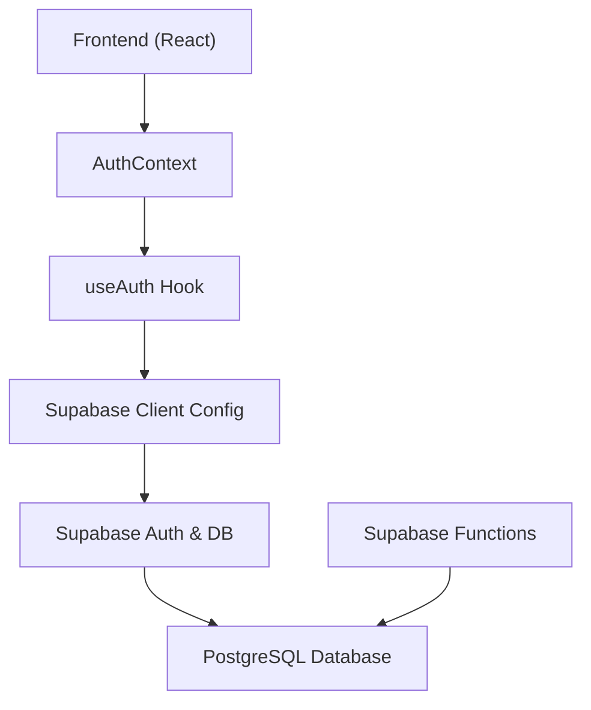
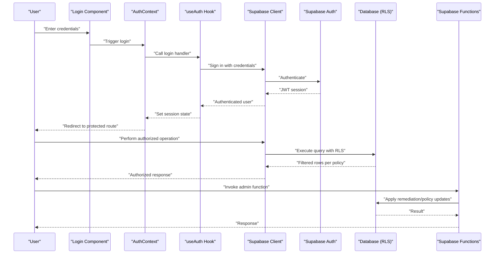
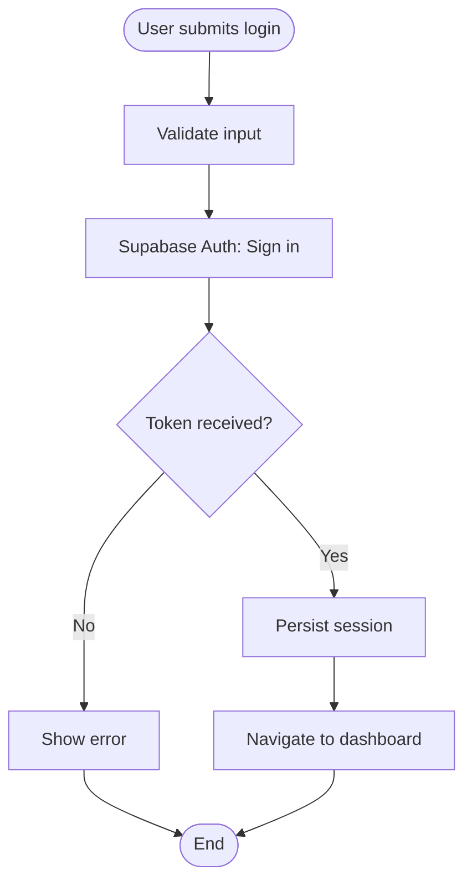
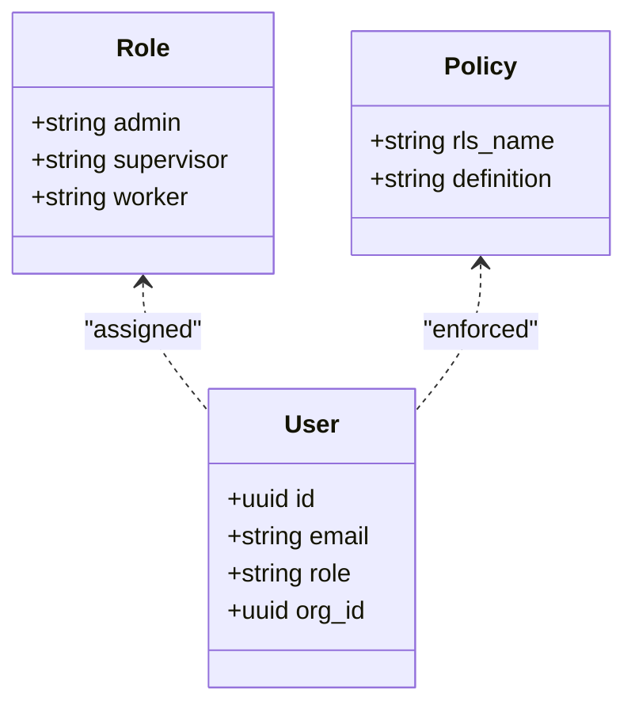
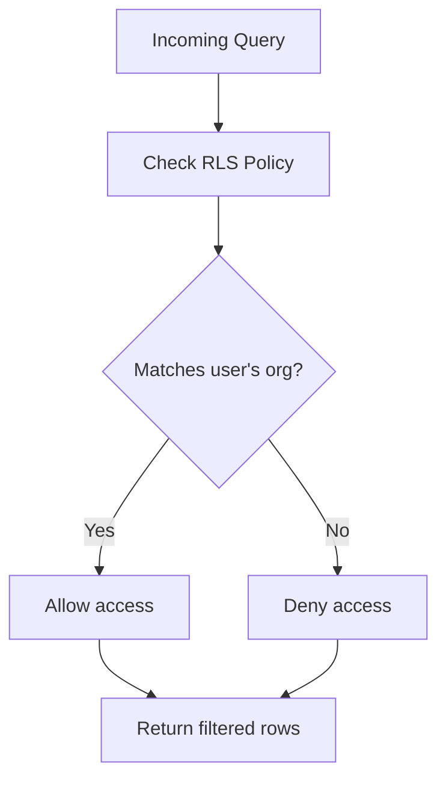
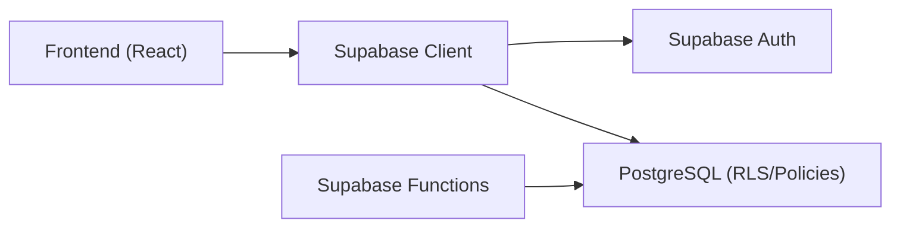

# Security and Access Control

<cite>
**Referenced Files in This Document**
- [supabase.ts](file://src/config/supabase.ts)
- [AuthContext.tsx](file://src/context/AuthContext.tsx)
- [useAuth.ts](file://src/hooks/useAuth.ts)
- [Login.tsx](file://src/components/Login.tsx)
- [ProtectedRoute.tsx](file://src/components/ProtectedRoute.tsx)
- [admin-user/index.ts](file://supabase/functions/admin-user/index.ts)
- [seed-auth/index.ts](file://supabase/functions/seed-auth/index.ts)
- [diagnose-auth/index.ts](file://supabase/functions/diagnose-auth/index.ts)
- [001_initial.sql](file://supabase/migrations/001_initial.sql)
- [002_seed_auth.sql](file://supabase/migrations/002_seed_auth.sql)
- [004_fix_auth_passwords.sql](file://supabase/migrations/004_fix_auth_passwords.sql)
- [005_cleanup_auth.sql](file://supabase/migrations/005_cleanup_auth.sql)
- [006_fix_rls_recursion.sql](file://supabase/migrations/006_fix_rls_recursion.sql)
- [007_add_attachments_delete_rls.sql](file://supabase/migrations/007_add_attachments_delete_rls.sql)
- [008_remediation.sql](file://supabase/migrations/008_remediation.sql)
- [009_app_settings.sql](file://supabase/migrations/009_app_settings.sql)
- [config.toml](file://supabase/config.toml)
</cite>

## Table of Contents
1. [Introduction](#introduction)
2. [Project Structure](#project-structure)
3. [Core Components](#core-components)
4. [Architecture Overview](#architecture-overview)
5. [Detailed Component Analysis](#detailed-component-analysis)
6. [Dependency Analysis](#dependency-analysis)
7. [Performance Considerations](#performance-considerations)
8. [Troubleshooting Guide](#troubleshooting-guide)
9. [Conclusion](#conclusion)

## Introduction
This document provides comprehensive security and access control documentation for AbsensiOnline’s database implementation. It focuses on Row Level Security (RLS) policies enforcing data isolation, role-based access control (RBAC) with admin, supervisor, and worker roles, JWT-based authentication integration, session management, encryption strategies, secure credential storage, audit logging, data retention, and compliance considerations. It also outlines best practices for database configuration, network security, and access monitoring, along with mitigation strategies for common vulnerabilities relevant to the application’s use case.

## Project Structure
AbsensiOnline integrates Supabase for authentication, authorization, and database services. The frontend interacts with Supabase via client configuration and React context, while backend policies and functions manage RLS, seeding, diagnostics, and remediation. Migrations define schema, roles, policies, and initial data.

**Diagram sources**
- [supabase.ts](file://src/config/supabase.ts)
- [AuthContext.tsx](file://src/context/AuthContext.tsx)
- [useAuth.ts](file://src/hooks/useAuth.ts)
- [config.toml](file://supabase/config.toml)

**Section sources**
- [supabase.ts](file://src/config/supabase.ts)
- [AuthContext.tsx](file://src/context/AuthContext.tsx)
- [useAuth.ts](file://src/hooks/useAuth.ts)
- [config.toml](file://supabase/config.toml)

## Core Components
- Authentication and Session Management: Frontend authentication state is managed via a React context and hook, backed by Supabase Auth. The Supabase client configuration centralizes connection and auth settings.
- Authorization and RBAC: Supabase Auth defines user roles (admin, supervisor, worker) and applies RLS policies to enforce tenant/data isolation.
- Secure Credential Storage: Supabase handles password hashing and JWT issuance; credentials are stored securely server-side.
- Audit and Diagnostics: Supabase functions support diagnostic checks and remediation tasks.
- Compliance and Retention: Migrations define schema and policies aligned with data minimization and retention principles.

**Section sources**
- [supabase.ts](file://src/config/supabase.ts)
- [AuthContext.tsx](file://src/context/AuthContext.tsx)
- [useAuth.ts](file://src/hooks/useAuth.ts)
- [001_initial.sql](file://supabase/migrations/001_initial.sql)
- [002_seed_auth.sql](file://supabase/migrations/002_seed_auth.sql)
- [004_fix_auth_passwords.sql](file://supabase/migrations/004_fix_auth_passwords.sql)
- [005_cleanup_auth.sql](file://supabase/migrations/005_cleanup_auth.sql)
- [006_fix_rls_recursion.sql](file://supabase/migrations/006_fix_rls_recursion.sql)
- [007_add_attachments_delete_rls.sql](file://supabase/migrations/007_add_attachments_delete_rls.sql)
- [008_remediation.sql](file://supabase/migrations/008_remediation.sql)
- [009_app_settings.sql](file://supabase/migrations/009_app_settings.sql)
- [admin-user/index.ts](file://supabase/functions/admin-user/index.ts)
- [seed-auth/index.ts](file://supabase/functions/seed-auth/index.ts)
- [diagnose-auth/index.ts](file://supabase/functions/diagnose-auth/index.ts)

## Architecture Overview
The system architecture leverages Supabase for identity, authorization, and database services. The frontend authenticates users, obtains JWTs, and performs authorized queries with RLS enforced server-side. Supabase Functions encapsulate administrative tasks and diagnostics.

**Diagram sources**
- [Login.tsx](file://src/components/Login.tsx)
- [AuthContext.tsx](file://src/context/AuthContext.tsx)
- [useAuth.ts](file://src/hooks/useAuth.ts)
- [supabase.ts](file://src/config/supabase.ts)
- [006_fix_rls_recursion.sql](file://supabase/migrations/006_fix_rls_recursion.sql)
- [admin-user/index.ts](file://supabase/functions/admin-user/index.ts)

## Detailed Component Analysis

### Authentication and Session Management
- JWT-based Authentication: Supabase manages JWT issuance and validation. The frontend stores and refreshes sessions transparently via the Supabase client.
- Session Lifecycle: The AuthContext and useAuth hook coordinate login, logout, and session persistence. Protected routes guard access to admin and worker areas.
- Frontend Integration: The Login component delegates authentication to the useAuth hook, which uses the Supabase client to sign in users.

**Diagram sources**
- [Login.tsx](file://src/components/Login.tsx)
- [AuthContext.tsx](file://src/context/AuthContext.tsx)
- [useAuth.ts](file://src/hooks/useAuth.ts)
- [supabase.ts](file://src/config/supabase.ts)

**Section sources**
- [Login.tsx](file://src/components/Login.tsx)
- [AuthContext.tsx](file://src/context/AuthContext.tsx)
- [useAuth.ts](file://src/hooks/useAuth.ts)
- [supabase.ts](file://src/config/supabase.ts)

### Role-Based Access Control (RBAC)
- Roles: admin, supervisor, worker are defined in the authentication schema and associated with user records.
- Policy Enforcement: RLS policies restrict row access based on user roles and tenant identifiers, ensuring data isolation between users and organizations.
- Administrative Tasks: Supabase Functions support administrative operations, including user management and remediation tasks.

**Diagram sources**
- [001_initial.sql](file://supabase/migrations/001_initial.sql)
- [002_seed_auth.sql](file://supabase/migrations/002_seed_auth.sql)
- [006_fix_rls_recursion.sql](file://supabase/migrations/006_fix_rls_recursion.sql)
- [admin-user/index.ts](file://supabase/functions/admin-user/index.ts)

**Section sources**
- [001_initial.sql](file://supabase/migrations/001_initial.sql)
- [002_seed_auth.sql](file://supabase/migrations/002_seed_auth.sql)
- [admin-user/index.ts](file://supabase/functions/admin-user/index.ts)

### Row Level Security (RLS) Policies
- Tenant Isolation: RLS policies filter rows based on the current user’s organization identifier, preventing cross-tenant data leakage.
- Recursion Fix: Migration 006 addresses recursive RLS evaluation to avoid performance and policy conflicts.
- Deletion Controls: Additional RLS policies refine delete permissions for attachments and other resources.
- Remediation: Migration 008 applies remediation steps to strengthen policies and address prior misconfigurations.

**Diagram sources**
- [006_fix_rls_recursion.sql](file://supabase/migrations/006_fix_rls_recursion.sql)
- [007_add_attachments_delete_rls.sql](file://supabase/migrations/007_add_attachments_delete_rls.sql)
- [008_remediation.sql](file://supabase/migrations/008_remediation.sql)

**Section sources**
- [006_fix_rls_recursion.sql](file://supabase/migrations/006_fix_rls_recursion.sql)
- [007_add_attachments_delete_rls.sql](file://supabase/migrations/007_add_attachments_delete_rls.sql)
- [008_remediation.sql](file://supabase/migrations/008_remediation.sql)

### Secure Credential Storage and Password Hashing
- Password Hashing: Supabase enforces secure password hashing for user credentials during authentication setup and fixes.
- Credential Storage: Supabase manages secrets and tokens server-side; the frontend does not handle raw credentials beyond login requests.

**Section sources**
- [002_seed_auth.sql](file://supabase/migrations/002_seed_auth.sql)
- [004_fix_auth_passwords.sql](file://supabase/migrations/004_fix_auth_passwords.sql)
- [005_cleanup_auth.sql](file://supabase/migrations/005_cleanup_auth.sql)

### Audit Logging, Diagnostics, and Remediation
- Diagnostics: A dedicated function inspects authentication and authorization configurations to identify potential issues.
- Remediation: Migrations apply corrective measures to policies and schema to maintain security posture.
- Functionality: Administrative functions enable controlled operations such as user management and policy updates.

**Section sources**
- [diagnose-auth/index.ts](file://supabase/functions/diagnose-auth/index.ts)
- [008_remediation.sql](file://supabase/migrations/008_remediation.sql)
- [admin-user/index.ts](file://supabase/functions/admin-user/index.ts)

### Data Encryption Strategies
- Transport Encryption: Supabase enforces encrypted connections for all client-server communications.
- At-Rest Encryption: Supabase manages encryption for stored data, including sensitive attributes such as passwords and personal information.

**Section sources**
- [config.toml](file://supabase/config.toml)

### Data Retention and Compliance Considerations
- Schema Alignment: Migrations define tables and constraints aligned with data minimization and retention needs.
- Settings and Policies: Application settings and policy updates reflect compliance-oriented configurations.

**Section sources**
- [009_app_settings.sql](file://supabase/migrations/009_app_settings.sql)

### Network Security and Access Monitoring
- Supabase Configuration: Supabase config controls access policies, replication, and network-level protections.
- Monitoring: Use Supabase dashboard and logs to monitor access patterns and anomalies.

**Section sources**
- [config.toml](file://supabase/config.toml)

## Dependency Analysis
The frontend depends on Supabase for authentication and database access. Supabase enforces RLS and RBAC server-side, while functions provide administrative capabilities.

**Diagram sources**
- [supabase.ts](file://src/config/supabase.ts)
- [001_initial.sql](file://supabase/migrations/001_initial.sql)
- [admin-user/index.ts](file://supabase/functions/admin-user/index.ts)

**Section sources**
- [supabase.ts](file://src/config/supabase.ts)
- [001_initial.sql](file://supabase/migrations/001_initial.sql)
- [admin-user/index.ts](file://supabase/functions/admin-user/index.ts)

## Performance Considerations
- RLS Overhead: Enforce RLS judiciously; ensure indexes exist on tenant and user identifiers to minimize query latency.
- Function Execution: Keep Supabase Functions lightweight and idempotent to reduce runtime overhead.
- Connection Pooling: Configure Supabase to optimize connection pooling and reduce contention.

## Troubleshooting Guide
- Authentication Failures: Use the diagnostic function to inspect auth configuration and resolve discrepancies.
- Permission Denied Errors: Verify RLS policies and user roles; confirm tenant isolation logic aligns with expectations.
- Remediation Steps: Apply migration-based remediation to fix policy recursion and update deletion controls.

**Section sources**
- [diagnose-auth/index.ts](file://supabase/functions/diagnose-auth/index.ts)
- [006_fix_rls_recursion.sql](file://supabase/migrations/006_fix_rls_recursion.sql)
- [008_remediation.sql](file://supabase/migrations/008_remediation.sql)

## Conclusion
AbsensiOnline’s security model centers on Supabase-managed authentication, robust RBAC, and server-side RLS to enforce tenant isolation. JWT-based sessions, secure credential storage, and administrative functions complement a layered defense. Adhering to the outlined best practices and using the provided troubleshooting guidance ensures a resilient and compliant deployment tailored to the application’s operational needs.