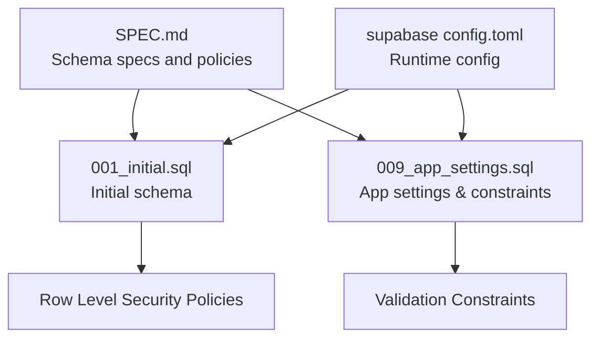
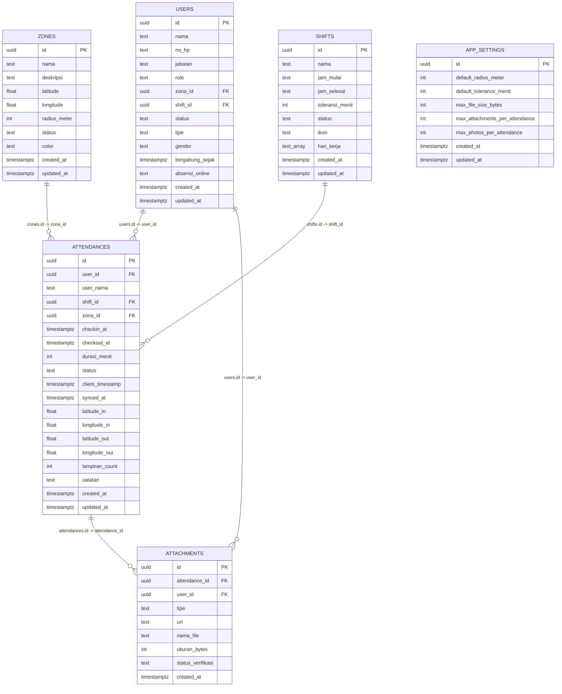
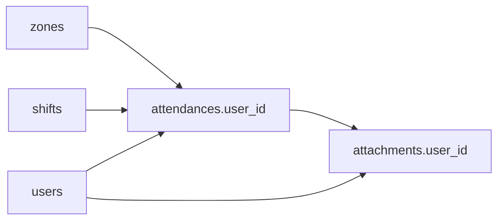

# Table Schemas

<cite>
**Referenced Files in This Document**
- [SPEC.md](file://SPEC.md)
- [001_initial.sql](file://supabase/migrations/001_initial.sql)
- [009_app_settings.sql](file://supabase/migrations/009_app_settings.sql)
- [supabase config.toml](file://supabase/config.toml)
</cite>

## Table of Contents
1. [Introduction](#introduction)
2. [Project Structure](#project-structure)
3. [Core Components](#core-components)
4. [Architecture Overview](#architecture-overview)
5. [Detailed Component Analysis](#detailed-component-analysis)
6. [Dependency Analysis](#dependency-analysis)
7. [Performance Considerations](#performance-considerations)
8. [Troubleshooting Guide](#troubleshooting-guide)
9. [Conclusion](#conclusion)

## Introduction
This document provides comprehensive table schema documentation for AbsensiOnline’s database. It covers each table’s structure, including field names, data types, nullability constraints, defaults, validation rules, primary keys, unique constraints, indexes, computed logic, triggers, and row-level security policies. It also includes rationale for design decisions, storage considerations, indexing strategies, and query optimization guidance.

## Project Structure
The database schema is primarily defined in the Supabase migrations and specification documents:
- Initial schema and table definitions are defined in the initial migration.
- Additional application settings and constraints are introduced in later migrations.
- Row-level security policies are documented alongside table definitions.
- The Supabase configuration file defines runtime settings that influence database behavior.

**Diagram sources**
- [SPEC.md](file://SPEC.md)
- [001_initial.sql](file://supabase/migrations/001_initial.sql)
- [009_app_settings.sql](file://supabase/migrations/009_app_settings.sql)
- [supabase config.toml](file://supabase/config.toml)

**Section sources**
- [SPEC.md](file://SPEC.md)
- [001_initial.sql](file://supabase/migrations/001_initial.sql)
- [009_app_settings.sql](file://supabase/migrations/009_app_settings.sql)
- [supabase config.toml](file://supabase/config.toml)

## Core Components
This section documents each table in AbsensiOnline with its schema, constraints, indexes, and policies.

### zones
- Purpose: Defines geofencing zones with coordinates and radius.
- Primary key: id (UUID).
- Notable constraints:
  - Latitude range: -90 to 90.
  - Longitude range: -180 to 180.
  - Radius meter: greater than 0 and up to 10000.
- Indexes: None explicitly defined.
- Row-level security: Enabled; see policy definitions in SPEC.md.
- Typical fields:
  - id, nama, deskripsi, latitude, longitude, radius_meter, status, color, created_at, updated_at.

Rationale and considerations:
- Using double precision for coordinates ensures geographic accuracy.
- Status constrained to predefined values for consistency.
- Radius bounds prevent invalid or excessively large zones.

Storage and performance:
- Minimal storage overhead; spatial queries may benefit from GIST indexes if extended to geometric types.
- Current design relies on application-level checks for proximity calculations.

**Section sources**
- [001_initial.sql](file://supabase/migrations/001_initial.sql)
- [SPEC.md](file://SPEC.md)

### shifts
- Purpose: Defines work schedules with start/end times, tolerance, and recurrence days.
- Primary key: id (UUID).
- Notable constraints:
  - toleransi_menit must be non-negative.
- Indexes: None explicitly defined.
- Row-level security: Enabled; see policy definitions in SPEC.md.
- Typical fields:
  - id, nama, jam_mulai, jam_selesai, toleransi_menit, status, ikon, hari_kerja, created_at, updated_at.

Rationale and considerations:
- Time fields stored as text in HH:MM format simplify parsing and reduce complexity.
- Array of working days supports flexible scheduling.
- Default tolerance and emoji icon improve usability.

Storage and performance:
- Low storage cost; consider adding indexes on frequently filtered columns if workload grows.

**Section sources**
- [001_initial.sql](file://supabase/migrations/001_initial.sql)
- [SPEC.md](file://SPEC.md)

### users
- Purpose: Stores worker profiles linked to zones and shifts.
- Primary key: id (UUID).
- Notable constraints: None explicitly defined beyond defaults.
- Indexes: None explicitly defined.
- Row-level security: Enabled; see policy definitions in SPEC.md.
- Typical fields:
  - id, nama, no_hp, jabatan, role, zona_id, shift_id, status, tipe, gender, bergabung_sejak, absensi_online, created_at, updated_at.

Rationale and considerations:
- Role-based access control via role field enables admin/super_admin privileges.
- Linkage to zones and shifts establishes organizational hierarchy.

Storage and performance:
- Moderate storage; consider indexing commonly queried fields if needed.

**Section sources**
- [001_initial.sql](file://supabase/migrations/001_initial.sql)
- [SPEC.md](file://SPEC.md)

### attendances
- Purpose: Records check-in/check-out events with derived status and location metadata.
- Primary key: id (UUID).
- Foreign keys:
  - user_id → users(id) CASCADE.
  - shift_id → shifts(id).
  - zona_id → zones(id).
- Notable constraints:
  - status constrained to predefined values.
- Indexes:
  - idx_attendances_user_date: user_id + checkin_at (desc).
  - idx_attendances_date: checkin_at (desc).
  - idx_attendances_zona: zona_id.
  - idx_attendances_status: status.
- Row-level security: Enabled; see policy definitions in SPEC.md.
- Typical fields:
  - id, user_id, user_nama, shift_id, zona_id, checkin_at, checkout_at, durasi_menit, status, client_timestamp, synced_at, latitude_in, longitude_in, latitude_out, longitude_out, lampiran_count, catatan, created_at, updated_at.

Computed logic:
- Derived status computed server-side based on check-in time vs scheduled time plus tolerance.

Rationale and considerations:
- Separate in/out coordinates support entry/exit geolocation.
- Durasi_menit can be derived from check-in/out timestamps.
- Lampiran_count tracks attachment linkage.

Storage and performance:
- Indexes optimized for common reporting queries (by user/date, date-only, zone, status).
- Consider partitioning by date for very large datasets.

**Section sources**
- [001_initial.sql](file://supabase/migrations/001_initial.sql)
- [SPEC.md](file://SPEC.md)

### attachments
- Purpose: Stores media attachments associated with attendance records.
- Primary key: id (UUID).
- Foreign keys:
  - attendance_id → attendances(id) CASCADE.
  - user_id → users(id) CASCADE.
- Notable constraints:
  - tipe constrained to predefined values.
  - status_verifikasi constrained to predefined values.
- Indexes:
  - idx_attachments_attendance: attendance_id.
  - idx_attachments_user: user_id.
- Row-level security: Enabled; see policy definitions in SPEC.md.
- Typical fields:
  - id, attendance_id, user_id, tipe, url, nama_file, ukuran_bytes, status_verifikasi, created_at.

Rationale and considerations:
- Separate user_id enforces per-user ownership.
- Status verification supports moderation workflows.

Storage and performance:
- Indexes optimize lookup by attendance and user.
- Consider file size limits and retention policies.

**Section sources**
- [001_initial.sql](file://supabase/migrations/001_initial.sql)
- [SPEC.md](file://SPEC.md)

### app_settings
- Purpose: Centralized configuration for application-wide settings.
- Primary key: id (UUID).
- Notable constraints:
  - Default radius bounds.
  - Default tolerance bounds.
  - Max file size bounds.
  - Max attachments bounds.
  - Max photos bounds.
- Indexes: None explicitly defined.
- Row-level security: Enabled; see policy definitions in SPEC.md.
- Typical fields:
  - id, default_radius_meter, default_tolerance_menit, max_file_size_bytes, max_attachments_per_attendance, max_photos_per_attendance, created_at, updated_at.

Rationale and considerations:
- Centralized settings enable controlled scaling and compliance.

Storage and performance:
- Minimal footprint; consider caching frequently accessed settings.

**Section sources**
- [009_app_settings.sql](file://supabase/migrations/009_app_settings.sql)
- [SPEC.md](file://SPEC.md)

## Architecture Overview
The schema follows a normalized relational model with explicit foreign keys and constraints. Row-level security is enabled on all tables to enforce tenant-aware access control. Application logic computes derived fields (e.g., attendance status) to keep persisted data lean.

**Diagram sources**
- [001_initial.sql](file://supabase/migrations/001_initial.sql)
- [009_app_settings.sql](file://supabase/migrations/009_app_settings.sql)
- [SPEC.md](file://SPEC.md)

## Detailed Component Analysis

### zones
- Structure and constraints:
  - Latitude and longitude validated against geographic bounds.
  - Radius constrained to a practical upper limit.
- Indexing strategy:
  - No explicit indexes; consider adding a spatial index if geometry types are adopted.
- RLS:
  - Readable by authenticated users; insert/update/delete restricted to admins/super_admins.
- Sample data:
  - Example record includes id, nama, deskripsi, latitude, longitude, radius_meter, status, color, timestamps.

Rationale:
- Geographic bounds ensure data validity and simplify downstream validation.

**Section sources**
- [001_initial.sql](file://supabase/migrations/001_initial.sql)
- [SPEC.md](file://SPEC.md)

### shifts
- Structure and constraints:
  - Tolerance minutes validated to be non-negative.
- Indexing strategy:
  - No explicit indexes; consider adding indexes on status or hari_kerja if filtering becomes frequent.
- RLS:
  - Readable by authenticated users; administrative actions restricted to admins/super_admins.
- Sample data:
  - Example record includes id, nama, jam_mulai, jam_selesai, toleransi_menit, status, ikon, hari_kerja, timestamps.

Rationale:
- HH:MM text format simplifies UI handling and reduces type conversion overhead.

**Section sources**
- [001_initial.sql](file://supabase/migrations/001_initial.sql)
- [SPEC.md](file://SPEC.md)

### users
- Structure and constraints:
  - No explicit column-level constraints beyond defaults.
- Indexing strategy:
  - No explicit indexes; consider adding indexes on role, zona_id, shift_id for access control and filtering.
- RLS:
  - Readable by authenticated users; administrative actions restricted to admins/super_admins.
- Sample data:
  - Example record includes id, nama, no_hp, jabatan, role, zona_id, shift_id, status, tipe, gender, bergabung_sejak, absensi_online, timestamps.

Rationale:
- Role-based access control centralizes permissions.

**Section sources**
- [001_initial.sql](file://supabase/migrations/001_initial.sql)
- [SPEC.md](file://SPEC.md)

### attendances
- Structure and constraints:
  - Status constrained to a closed set of values.
- Indexing strategy:
  - Composite index on user_id + checkin_at (desc) for user-centric reporting.
  - Single-column index on checkin_at (desc) for date-based queries.
  - Indexes on zona_id and status for filtering.
- Computed logic:
  - Server-side function derives status based on check-in time versus scheduled time plus tolerance.
- RLS:
  - Readable by authenticated users; administrative actions restricted to admins/super_admins.
- Sample data:
  - Example record includes id, user_id, user_nama, shift_id, zona_id, checkin_at, checkout_at, durasi_menit, status, client_timestamp, synced_at, latitude_in, longitude_in, latitude_out, longitude_out, lampiran_count, catatan, timestamps.

Rationale:
- Derived status keeps persisted data minimal while allowing dynamic computation.

**Section sources**
- [001_initial.sql](file://supabase/migrations/001_initial.sql)
- [SPEC.md](file://SPEC.md)

### attachments
- Structure and constraints:
  - tipe and status_verifikasi constrained to predefined sets.
- Indexing strategy:
  - Indexes on attendance_id and user_id for efficient retrieval.
- RLS:
  - Readable by authenticated users; administrative actions restricted to admins/super_admins.
- Sample data:
  - Example record includes id, attendance_id, user_id, tipe, url, nama_file, ukuran_bytes, status_verifikasi, created_at.

Rationale:
- Separate user_id enforces ownership and simplifies audits.

**Section sources**
- [001_initial.sql](file://supabase/migrations/001_initial.sql)
- [SPEC.md](file://SPEC.md)

### app_settings
- Structure and constraints:
  - Multiple numeric fields bounded by constraints to enforce safe defaults and limits.
- Indexing strategy:
  - No explicit indexes; consider a single-row access pattern makes indexes unnecessary.
- RLS:
  - Readable by authenticated users; administrative actions restricted to admins/super_admins.
- Sample data:
  - Example record includes id, default_radius_meter, default_tolerance_menit, max_file_size_bytes, max_attachments_per_attendance, max_photos_per_attendance, timestamps.

Rationale:
- Centralized configuration improves maintainability and auditability.

**Section sources**
- [009_app_settings.sql](file://supabase/migrations/009_app_settings.sql)
- [SPEC.md](file://SPEC.md)

## Dependency Analysis
Foreign key relationships and dependencies:
- users references zones and shifts.
- attendances references users, shifts, and zones.
- attachments references attendances and users.

**Diagram sources**
- [001_initial.sql](file://supabase/migrations/001_initial.sql)
- [SPEC.md](file://SPEC.md)

**Section sources**
- [001_initial.sql](file://supabase/migrations/001_initial.sql)
- [SPEC.md](file://SPEC.md)

## Performance Considerations
- Attendances:
  - Composite index on user_id + checkin_at (desc) supports user history views.
  - Date-only index on checkin_at (desc) supports calendar and dashboard views.
  - Indexes on zona_id and status support filtering by location and status.
- Zones and shifts:
  - Consider adding indexes on frequently filtered columns if workload increases.
- Attachments:
  - Indexes on attendance_id and user_id support quick retrieval.
- Storage:
  - Keep file sizes within configured limits; archive old records if needed.
- Query optimization:
  - Prefer selective filters and appropriate indexes.
  - Use server-side computed status to avoid redundant storage.

[No sources needed since this section provides general guidance]

## Troubleshooting Guide
- Constraint violations:
  - Latitude/longitude out of range: adjust coordinates to valid ranges.
  - Radius outside allowed bounds: ensure radius is greater than 0 and within the maximum.
  - Negative tolerance: ensure toleransi_menit is non-negative.
  - Invalid status values: use only allowed values for status and status_verifikasi.
- Access issues:
  - RLS policies restrict reads/writes to authenticated users and admins/super_admins; verify user roles.
- Derived status mismatches:
  - Confirm check-in time and schedule align with expected values; review server-side derivation logic.

**Section sources**
- [001_initial.sql](file://supabase/migrations/001_initial.sql)
- [SPEC.md](file://SPEC.md)

## Conclusion
AbsensiOnline’s schema emphasizes simplicity, safety, and scalability. Constraints and RLS policies protect data integrity and enforce access control. Indexes are strategically placed to support common reporting patterns. Centralized settings in app_settings enable controlled configuration. For future growth, consider adopting spatial types and indexes, partitioning large tables, and monitoring query performance.

[No sources needed since this section summarizes without analyzing specific files]