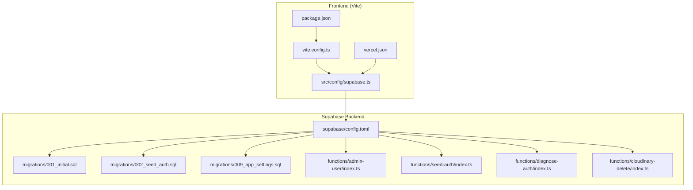
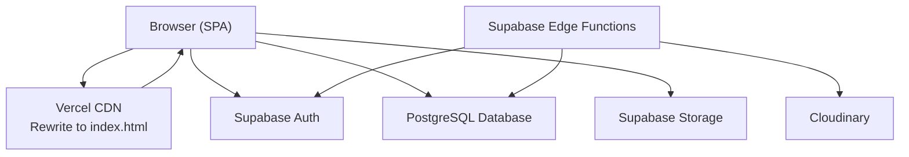
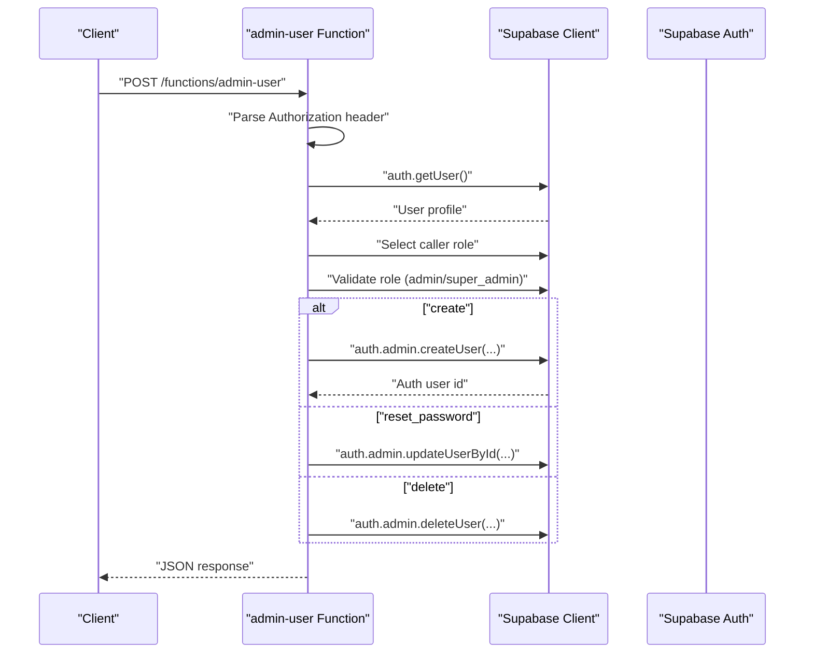
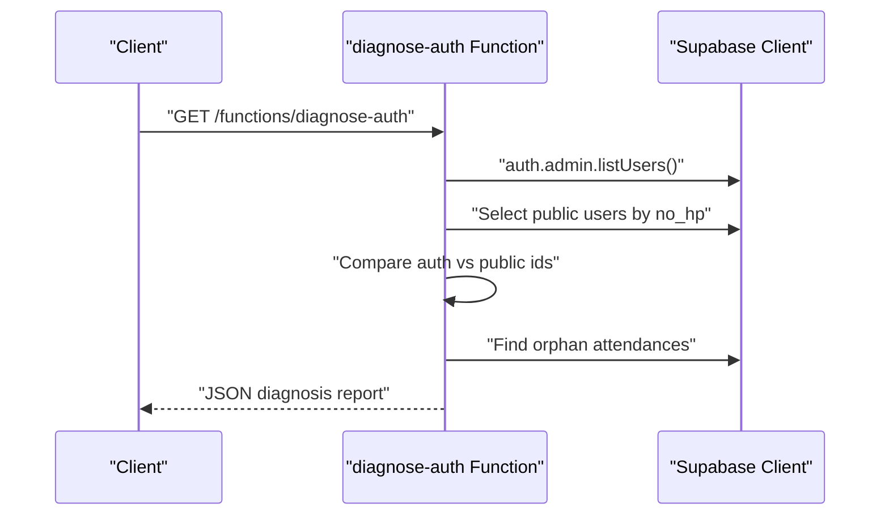
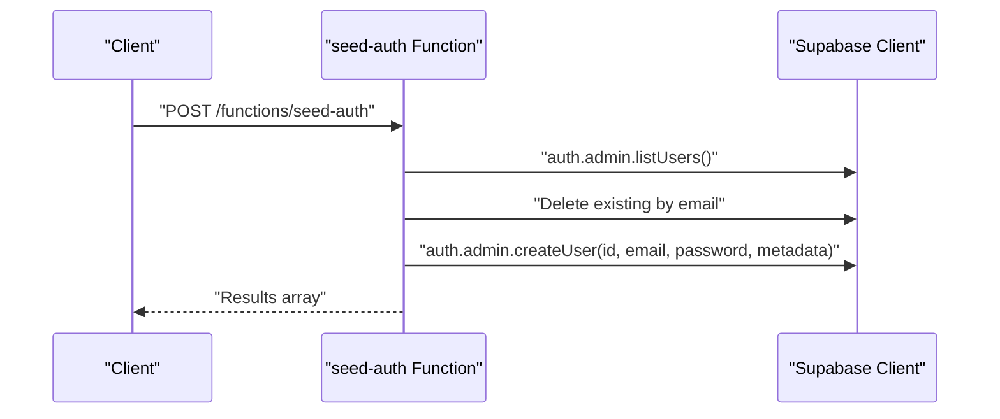
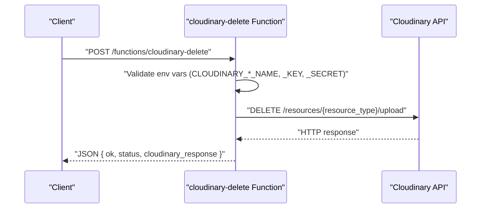
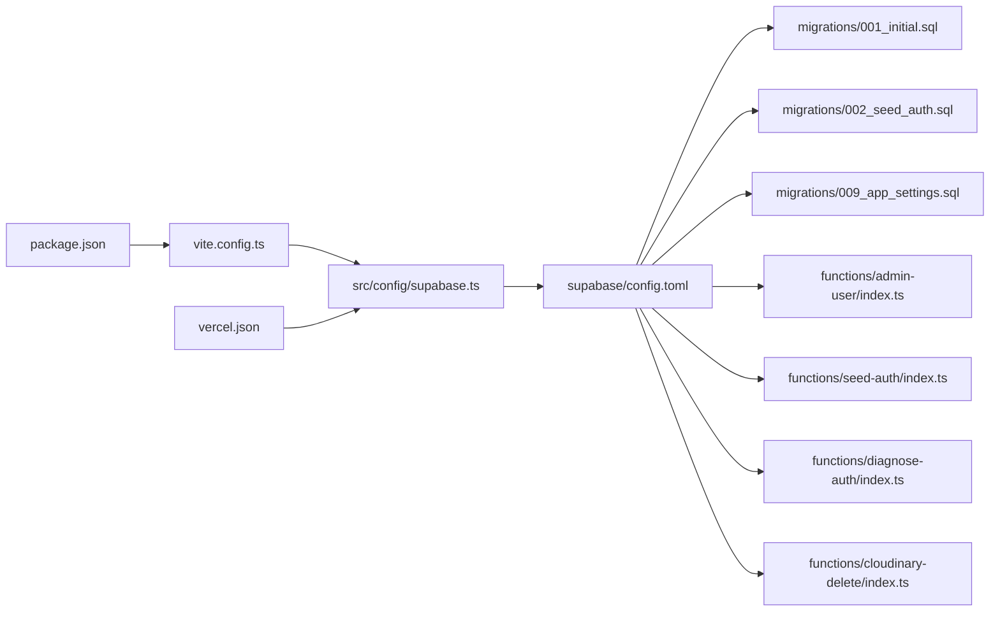

# Deployment & Operations

<cite>
**Referenced Files in This Document**
- [package.json](file://package.json)
- [vite.config.ts](file://vite.config.ts)
- [vercel.json](file://vercel.json)
- [supabase/config.toml](file://supabase/config.toml)
- [src/config/supabase.ts](file://src/config/supabase.ts)
- [supabase/functions/admin-user/index.ts](file://supabase/functions/admin-user/index.ts)
- [supabase/functions/cloudinary-delete/index.ts](file://supabase/functions/cloudinary-delete/index.ts)
- [supabase/functions/diagnose-auth/index.ts](file://supabase/functions/diagnose-auth/index.ts)
- [supabase/functions/seed-auth/index.ts](file://supabase/functions/seed-auth/index.ts)
- [supabase/migrations/001_initial.sql](file://supabase/migrations/001_initial.sql)
- [supabase/migrations/002_seed_auth.sql](file://supabase/migrations/002_seed_auth.sql)
- [supabase/migrations/009_app_settings.sql](file://supabase/migrations/009_app_settings.sql)
</cite>

## Table of Contents
1. [Introduction](#introduction)
2. [Project Structure](#project-structure)
3. [Core Components](#core-components)
4. [Architecture Overview](#architecture-overview)
5. [Detailed Component Analysis](#detailed-component-analysis)
6. [Dependency Analysis](#dependency-analysis)
7. [Performance Considerations](#performance-considerations)
8. [Troubleshooting Guide](#troubleshooting-guide)
9. [Conclusion](#conclusion)
10. [Appendices](#appendices)

## Introduction
This document provides comprehensive deployment and operations guidance for AbsensiOnline. It covers the frontend build process using Vite, environment configuration for development and production, Supabase backend configuration and migrations, edge function deployment, Vercel hosting setup, environment variable management, and operational practices such as monitoring, logging, backups, disaster recovery, maintenance, troubleshooting, rollbacks, and scaling.

## Project Structure
AbsensiOnline is a React + TypeScript application built with Vite and styled with Tailwind CSS. The frontend is a Single Page Application (SPA) configured to route all unmatched routes to index.html via Vite’s history API fallback and Vercel rewrites. Supabase provides authentication, database, storage, and Edge Functions.

**Diagram sources**
- [vite.config.ts:1-48](file://vite.config.ts#L1-L48)
- [package.json:1-41](file://package.json#L1-L41)
- [src/config/supabase.ts:1-7](file://src/config/supabase.ts#L1-L7)
- [vercel.json:1-4](file://vercel.json#L1-L4)
- [supabase/config.toml:1-43](file://supabase/config.toml#L1-L43)
- [supabase/migrations/001_initial.sql:1-303](file://supabase/migrations/001_initial.sql#L1-L303)
- [supabase/migrations/002_seed_auth.sql:1-29](file://supabase/migrations/002_seed_auth.sql#L1-L29)
- [supabase/migrations/009_app_settings.sql:1-46](file://supabase/migrations/009_app_settings.sql#L1-L46)
- [supabase/functions/admin-user/index.ts:1-167](file://supabase/functions/admin-user/index.ts#L1-L167)
- [supabase/functions/seed-auth/index.ts:1-65](file://supabase/functions/seed-auth/index.ts#L1-L65)
- [supabase/functions/diagnose-auth/index.ts:1-74](file://supabase/functions/diagnose-auth/index.ts#L1-L74)
- [supabase/functions/cloudinary-delete/index.ts:1-71](file://supabase/functions/cloudinary-delete/index.ts#L1-L71)

**Section sources**
- [package.json:1-41](file://package.json#L1-L41)
- [vite.config.ts:1-48](file://vite.config.ts#L1-L48)
- [vercel.json:1-4](file://vercel.json#L1-L4)
- [supabase/config.toml:1-43](file://supabase/config.toml#L1-L43)
- [src/config/supabase.ts:1-7](file://src/config/supabase.ts#L1-L7)

## Core Components
- Frontend build and preview: Vite scripts and SPA routing.
- Environment configuration: Supabase client initialization using Vite import.meta.env variables.
- Supabase backend: Local development configuration, migrations, and Edge Functions.
- Hosting: Vercel rewrite rules for SPA routing.

Key implementation references:
- Build scripts and SPA appType: [package.json:6-12](file://package.json#L6-L12), [vite.config.ts:13-16](file://vite.config.ts#L13-L16)
- SPA routing and preview server: [vite.config.ts:39-46](file://vite.config.ts#L39-L46), [vercel.json:1-4](file://vercel.json#L1-L4)
- Supabase client initialization: [src/config/supabase.ts:1-7](file://src/config/supabase.ts#L1-L7)
- Supabase local config: [supabase/config.toml:1-43](file://supabase/config.toml#L1-L43)

**Section sources**
- [package.json:6-12](file://package.json#L6-L12)
- [vite.config.ts:13-46](file://vite.config.ts#L13-L46)
- [vercel.json:1-4](file://vercel.json#L1-L4)
- [src/config/supabase.ts:1-7](file://src/config/supabase.ts#L1-L7)
- [supabase/config.toml:1-43](file://supabase/config.toml#L1-L43)

## Architecture Overview
The system comprises a React SPA served by Vercel and backed by Supabase. The SPA communicates with Supabase via the Supabase client initialized with environment variables. Supabase Edge Functions provide administrative tasks, diagnostics, seeding, and Cloudinary cleanup. Migrations define the database schema and policies.

**Diagram sources**
- [vercel.json:1-4](file://vercel.json#L1-L4)
- [src/config/supabase.ts:1-7](file://src/config/supabase.ts#L1-L7)
- [supabase/functions/admin-user/index.ts:1-167](file://supabase/functions/admin-user/index.ts#L1-L167)
- [supabase/functions/seed-auth/index.ts:1-65](file://supabase/functions/seed-auth/index.ts#L1-L65)
- [supabase/functions/diagnose-auth/index.ts:1-74](file://supabase/functions/diagnose-auth/index.ts#L1-L74)
- [supabase/functions/cloudinary-delete/index.ts:1-71](file://supabase/functions/cloudinary-delete/index.ts#L1-L71)
- [supabase/config.toml:1-43](file://supabase/config.toml#L1-L43)

## Detailed Component Analysis

### Build and Preview Pipeline (Vite)
- SPA mode ensures deep linking works in development and preview.
- Single-file plugin bundles the app for simplified hosting.
- PWA plugin config supports auto updates and asset caching.
- Aliasing @ to src improves import readability.

Operational implications:
- Use the preview command locally to match Vercel behavior.
- Ensure all assets referenced in the PWA manifest and service worker are present.

**Section sources**
- [vite.config.ts:13-48](file://vite.config.ts#L13-L48)
- [package.json:6-12](file://package.json#L6-L12)

### Environment Configuration and Supabase Client
- The Supabase client reads runtime environment variables for URL and ANON key.
- These variables must be set per environment (development, staging, production).

Best practices:
- Define environment variables in Vercel project settings.
- Keep ANON key separate from service role keys.
- Validate environment variables during startup in the browser console.

**Section sources**
- [src/config/supabase.ts:1-7](file://src/config/supabase.ts#L1-L7)

### Supabase Local Development Configuration
- Ports and schemas are configured for local development.
- Studio, Inbucket, and Auth settings are defined.
- Search path and extensions are set for compatibility.

Operational implications:
- Use the provided ports consistently across local tooling.
- Adjust site URL and redirect URLs for local development.

**Section sources**
- [supabase/config.toml:1-43](file://supabase/config.toml#L1-L43)

### Database Migrations
- Initial schema defines zones, shifts, users, attendances, attachments, triggers, functions, and RLS policies.
- Seed data populates zones, shifts, and users with stable UUIDs.
- Additional migrations refine auth seeding and introduce app settings with RLS.

Operational implications:
- Apply migrations in order; verify RLS policies and constraints.
- Use migrations to manage schema changes across environments.

**Section sources**
- [supabase/migrations/001_initial.sql:1-303](file://supabase/migrations/001_initial.sql#L1-L303)
- [supabase/migrations/002_seed_auth.sql:1-29](file://supabase/migrations/002_seed_auth.sql#L1-L29)
- [supabase/migrations/009_app_settings.sql:1-46](file://supabase/migrations/009_app_settings.sql#L1-L46)

### Edge Functions

#### Admin User Management
- Validates Authorization header and checks caller role.
- Supports create, reset_password, and delete operations.
- Uses service role key for privileged actions.

**Diagram sources**
- [supabase/functions/admin-user/index.ts:10-166](file://supabase/functions/admin-user/index.ts#L10-L166)

**Section sources**
- [supabase/functions/admin-user/index.ts:1-167](file://supabase/functions/admin-user/index.ts#L1-L167)

#### Auth Diagnostics
- Lists internal users and compares with public users.
- Identifies mismatches and orphan attendances.

**Diagram sources**
- [supabase/functions/diagnose-auth/index.ts:9-73](file://supabase/functions/diagnose-auth/index.ts#L9-L73)

**Section sources**
- [supabase/functions/diagnose-auth/index.ts:1-74](file://supabase/functions/diagnose-auth/index.ts#L1-L74)

#### Seed Auth
- Creates predefined users with matching UUIDs and metadata.
- Cleans up existing users before creation.

**Diagram sources**
- [supabase/functions/seed-auth/index.ts:9-64](file://supabase/functions/seed-auth/index.ts#L9-L64)

**Section sources**
- [supabase/functions/seed-auth/index.ts:1-65](file://supabase/functions/seed-auth/index.ts#L1-L65)

#### Cloudinary Cleanup
- Validates environment variables and deletes resources by public_id.
- Returns structured response with Cloudinary status.

**Diagram sources**
- [supabase/functions/cloudinary-delete/index.ts:8-70](file://supabase/functions/cloudinary-delete/index.ts#L8-L70)

**Section sources**
- [supabase/functions/cloudinary-delete/index.ts:1-71](file://supabase/functions/cloudinary-delete/index.ts#L1-L71)

### Vercel Deployment Setup
- Rewrites all routes to index.html to support SPA routing.
- Ensure environment variables are configured in Vercel for Supabase URL and ANON key.

Operational implications:
- Verify rewrites are applied in production builds.
- Manage environment variables per Vercel project and preview/deployment branches.

**Section sources**
- [vercel.json:1-4](file://vercel.json#L1-L4)

## Dependency Analysis
- Frontend depends on Supabase client for auth, database, and storage.
- Edge Functions depend on Supabase service role key and external services (e.g., Cloudinary).
- Migrations define schema dependencies and RLS policies.

**Diagram sources**
- [package.json:1-41](file://package.json#L1-L41)
- [vite.config.ts:1-48](file://vite.config.ts#L1-L48)
- [src/config/supabase.ts:1-7](file://src/config/supabase.ts#L1-L7)
- [vercel.json:1-4](file://vercel.json#L1-L4)
- [supabase/config.toml:1-43](file://supabase/config.toml#L1-L43)
- [supabase/migrations/001_initial.sql:1-303](file://supabase/migrations/001_initial.sql#L1-L303)
- [supabase/migrations/002_seed_auth.sql:1-29](file://supabase/migrations/002_seed_auth.sql#L1-L29)
- [supabase/migrations/009_app_settings.sql:1-46](file://supabase/migrations/009_app_settings.sql#L1-L46)
- [supabase/functions/admin-user/index.ts:1-167](file://supabase/functions/admin-user/index.ts#L1-L167)
- [supabase/functions/seed-auth/index.ts:1-65](file://supabase/functions/seed-auth/index.ts#L1-L65)
- [supabase/functions/diagnose-auth/index.ts:1-74](file://supabase/functions/diagnose-auth/index.ts#L1-L74)
- [supabase/functions/cloudinary-delete/index.ts:1-71](file://supabase/functions/cloudinary-delete/index.ts#L1-L71)

**Section sources**
- [package.json:1-41](file://package.json#L1-L41)
- [vite.config.ts:1-48](file://vite.config.ts#L1-L48)
- [src/config/supabase.ts:1-7](file://src/config/supabase.ts#L1-L7)
- [vercel.json:1-4](file://vercel.json#L1-L4)
- [supabase/config.toml:1-43](file://supabase/config.toml#L1-L43)
- [supabase/migrations/001_initial.sql:1-303](file://supabase/migrations/001_initial.sql#L1-L303)
- [supabase/migrations/002_seed_auth.sql:1-29](file://supabase/migrations/002_seed_auth.sql#L1-L29)
- [supabase/migrations/009_app_settings.sql:1-46](file://supabase/migrations/009_app_settings.sql#L1-L46)
- [supabase/functions/admin-user/index.ts:1-167](file://supabase/functions/admin-user/index.ts#L1-L167)
- [supabase/functions/seed-auth/index.ts:1-65](file://supabase/functions/seed-auth/index.ts#L1-L65)
- [supabase/functions/diagnose-auth/index.ts:1-74](file://supabase/functions/diagnose-auth/index.ts#L1-L74)
- [supabase/functions/cloudinary-delete/index.ts:1-71](file://supabase/functions/cloudinary-delete/index.ts#L1-L71)

## Performance Considerations
- Build optimization: Use Vite’s default bundling; avoid unnecessary assets.
- PWA caching: Review cache patterns and asset inclusion to balance freshness and performance.
- Database queries: Indexes are defined for frequent filters; monitor slow queries and add targeted indexes if needed.
- Edge Functions cold starts: Keep functions small and reuse connections where possible; consider warming strategies if latency is critical.
- CDN and SPA routing: Vercel rewrites ensure efficient static delivery and SPA navigation.

[No sources needed since this section provides general guidance]

## Troubleshooting Guide
Common deployment and operations issues:

- SPA routing fails after refresh or deep link:
  - Ensure Vercel rewrites target index.html and server.strictPort is disabled in development.
  - Validate history API fallback behavior in preview.

- Supabase client initialization errors:
  - Verify VITE_SUPABASE_URL and VITE_SUPABASE_ANON_KEY are set in Vercel environment.
  - Confirm the client is initialized with correct variables.

- Edge Function unauthorized or forbidden:
  - Ensure Authorization header is passed and caller has admin/super_admin role.
  - Confirm SUPABASE_SERVICE_ROLE_KEY is configured in Edge Functions environment.

- Cloudinary deletion failures:
  - Verify CLOUDINARY_CLOUD_NAME, CLOUDINARY_API_KEY, and CLOUDINARY_API_SECRET are set.
  - Check returned status and Cloudinary response for detailed errors.

- Migration conflicts or missing policies:
  - Review migration order and RLS policy definitions.
  - Confirm triggers and constraints are created as expected.

Rollback and scaling:
- Rollback migrations by downgrading to previous versions using Supabase CLI.
- Scale Supabase by adjusting instance size and enabling read replicas if needed.
- Scale Vercel by increasing serverless function limits and optimizing build artifacts.

**Section sources**
- [vercel.json:1-4](file://vercel.json#L1-L4)
- [vite.config.ts:39-46](file://vite.config.ts#L39-L46)
- [src/config/supabase.ts:1-7](file://src/config/supabase.ts#L1-L7)
- [supabase/functions/admin-user/index.ts:15-49](file://supabase/functions/admin-user/index.ts#L15-L49)
- [supabase/functions/cloudinary-delete/index.ts:23-37](file://supabase/functions/cloudinary-delete/index.ts#L23-L37)
- [supabase/migrations/001_initial.sql:164-267](file://supabase/migrations/001_initial.sql#L164-L267)

## Conclusion
AbsensiOnline’s deployment model combines a streamlined Vite-built SPA with Supabase for authentication, database, storage, and Edge Functions. By following the environment configuration, migration, and hosting guidelines outlined here, teams can reliably deploy, operate, and scale the platform while maintaining strong security posture through RLS and service role keys.

[No sources needed since this section summarizes without analyzing specific files]

## Appendices

### Environment Variables Reference
- Frontend runtime:
  - VITE_SUPABASE_URL
  - VITE_SUPABASE_ANON_KEY
- Edge Functions:
  - SUPABASE_URL
  - SUPABASE_SERVICE_ROLE_KEY
  - SUPABASE_ANON_KEY
  - CLOUDINARY_CLOUD_NAME
  - CLOUDINARY_API_KEY
  - CLOUDINARY_API_SECRET

**Section sources**
- [src/config/supabase.ts:1-7](file://src/config/supabase.ts#L1-L7)
- [supabase/functions/admin-user/index.ts:24-54](file://supabase/functions/admin-user/index.ts#L24-L54)
- [supabase/functions/cloudinary-delete/index.ts:23-25](file://supabase/functions/cloudinary-delete/index.ts#L23-L25)

### Monitoring and Logging Strategies
- Frontend:
  - Enable browser console logs and Sentry for error tracking.
  - Monitor network requests to Supabase endpoints.
- Backend:
  - Use Supabase dashboard logs for database and auth activity.
  - Enable Edge Functions logs in Supabase project settings.
- Infrastructure:
  - Track Vercel deployment logs and performance metrics.
  - Monitor Cloudinary API usage and quotas.

[No sources needed since this section provides general guidance]

### Backup and Disaster Recovery
- Database:
  - Use Supabase project snapshots and export/import for point-in-time recovery.
- Edge Functions:
  - Version control function code; redeploy from source on failure.
- Frontend:
  - Store build artifacts and manifests in version control or artifact storage.
- DR Plan:
  - Maintain offsite backups of Supabase credentials and secrets.
  - Document restore steps for database, functions, and environment variables.

[No sources needed since this section provides general guidance]

### Maintenance Schedule
- Weekly:
  - Review Supabase logs and Edge Functions error rates.
  - Validate migrations and apply schema updates in staging.
- Monthly:
  - Audit roles and RLS policies.
  - Rotate service role keys and environment variables.
- Quarterly:
  - Reassess PWA caching strategy and CDN performance.
  - Evaluate and update Supabase instance sizing.

[No sources needed since this section provides general guidance]