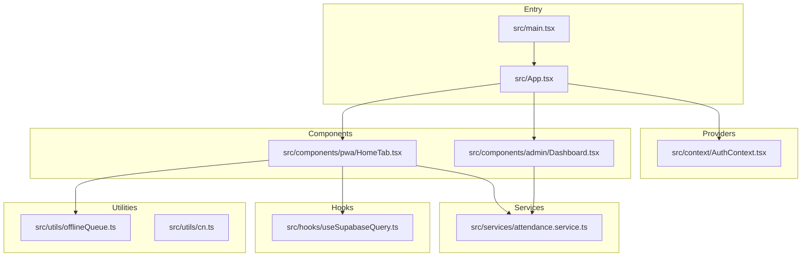
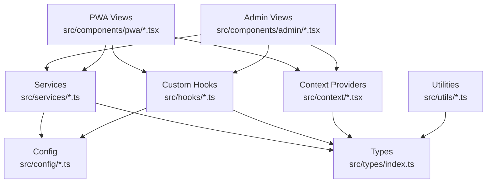
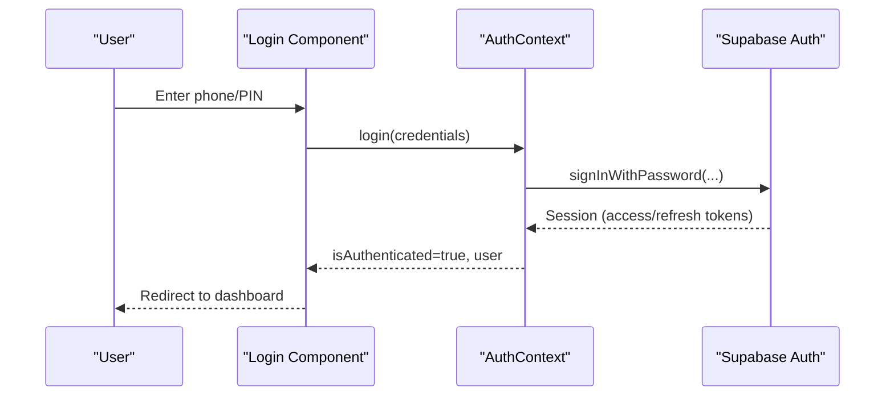
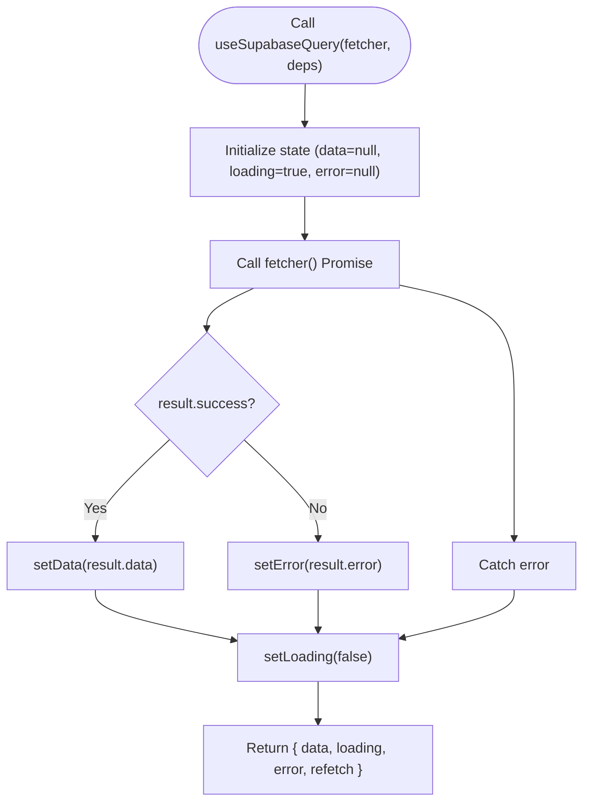
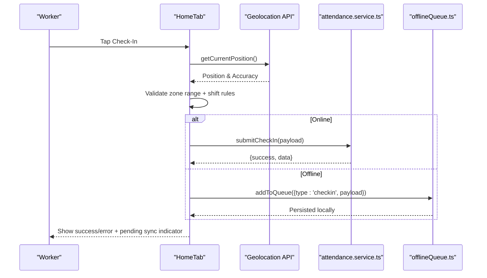
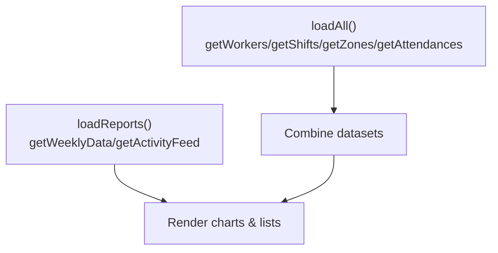

# Development Guidelines

<cite>
**Referenced Files in This Document**
- [package.json](file://package.json)
- [tsconfig.json](file://tsconfig.json)
- [vite.config.ts](file://vite.config.ts)
- [DESIGN.md](file://DESIGN.md)
- [SPEC.md](file://SPEC.md)
- [src/main.tsx](file://src/main.tsx)
- [src/App.tsx](file://src/App.tsx)
- [src/context/AuthContext.tsx](file://src/context/AuthContext.tsx)
- [src/hooks/useSupabaseQuery.ts](file://src/hooks/useSupabaseQuery.ts)
- [src/services/attendance.service.ts](file://src/services/attendance.service.ts)
- [src/components/pwa/HomeTab.tsx](file://src/components/pwa/HomeTab.tsx)
- [src/components/admin/Dashboard.tsx](file://src/components/admin/Dashboard.tsx)
- [src/types/index.ts](file://src/types/index.ts)
- [src/utils/offlineQueue.ts](file://src/utils/offlineQueue.ts)
- [src/utils/cn.ts](file://src/utils/cn.ts)
</cite>

## Table of Contents
1. [Introduction](#introduction)
2. [Project Structure](#project-structure)
3. [Core Components](#core-components)
4. [Architecture Overview](#architecture-overview)
5. [Detailed Component Analysis](#detailed-component-analysis)
6. [Dependency Analysis](#dependency-analysis)
7. [Performance Considerations](#performance-considerations)
8. [Testing Strategies](#testing-strategies)
9. [Debugging and Profiling](#debugging-and-profiling)
10. [Code Review and Branching](#code-review-and-branching)
11. [Accessibility and Security](#accessibility-and-security)
12. [Maintainability Principles](#maintainability-principles)
13. [Troubleshooting Guide](#troubleshooting-guide)
14. [Conclusion](#conclusion)

## Introduction
This document provides comprehensive development guidelines for contributors working on AbsensiOnline. It consolidates coding standards, TypeScript configuration, component development patterns, project structure conventions, architectural decisions, testing strategies, performance optimization, debugging techniques, code review processes, accessibility, security, and maintainability practices. The project follows a modern React + TypeScript stack with Vite, TailwindCSS, Supabase for authentication and real-time data, and PWA capabilities.

## Project Structure
The repository is organized around feature-based and layer-based conventions:
- src/components: Feature-specific UI components (admin, pwa, ui)
- src/services: Data access layer implementing Supabase queries
- src/hooks: Custom hooks for auth, Supabase queries, and app settings
- src/context: Application context providers (Auth)
- src/utils: Shared utilities (offline queue, class merging)
- src/types: Centralized TypeScript type definitions
- src/config: Client initialization (Supabase)
- Root configs: package.json, tsconfig.json, vite.config.ts, SPEC.md, DESIGN.md

**Diagram sources**
- [src/main.tsx:1-15](file://src/main.tsx#L1-L15)
- [src/App.tsx:1-58](file://src/App.tsx#L1-L58)
- [src/context/AuthContext.tsx:1-43](file://src/context/AuthContext.tsx#L1-L43)
- [src/components/admin/Dashboard.tsx:1-283](file://src/components/admin/Dashboard.tsx#L1-L283)
- [src/components/pwa/HomeTab.tsx:1-817](file://src/components/pwa/HomeTab.tsx#L1-L817)
- [src/services/attendance.service.ts:1-188](file://src/services/attendance.service.ts#L1-L188)
- [src/hooks/useSupabaseQuery.ts:1-48](file://src/hooks/useSupabaseQuery.ts#L1-L48)
- [src/utils/offlineQueue.ts:1-97](file://src/utils/offlineQueue.ts#L1-L97)
- [src/utils/cn.ts:1-7](file://src/utils/cn.ts#L1-L7)

**Section sources**
- [src/main.tsx:1-15](file://src/main.tsx#L1-L15)
- [src/App.tsx:1-58](file://src/App.tsx#L1-L58)
- [SPEC.md:346-404](file://SPEC.md#L346-L404)

## Core Components
- Authentication Context: Provides user session, login/logout, and auth state to components.
- Supabase Query Hook: Generic hook for fetching data, caching, and refetching.
- Attendance Service: Implements check-in/out, history retrieval, and status updates via Supabase.
- Offline Queue Utility: Manages offline check-in/out operations and flushes when online.
- Types: Centralized type definitions for domain entities and service results.

Key conventions:
- All service methods return a standardized ServiceResult<T> to unify error handling.
- Components consume services and hooks; state caching persists via local storage for offline readiness.
- Auth uses Supabase Auth with JWT sessions and automatic refresh.

**Section sources**
- [src/context/AuthContext.tsx:1-43](file://src/context/AuthContext.tsx#L1-L43)
- [src/hooks/useSupabaseQuery.ts:1-48](file://src/hooks/useSupabaseQuery.ts#L1-L48)
- [src/services/attendance.service.ts:1-188](file://src/services/attendance.service.ts#L1-L188)
- [src/utils/offlineQueue.ts:1-97](file://src/utils/offlineQueue.ts#L1-L97)
- [src/types/index.ts:137-141](file://src/types/index.ts#L137-L141)

## Architecture Overview
The system adopts a layered architecture:
- Presentation: React components (admin and PWA views)
- Services: Encapsulate Supabase queries and mutations
- Hooks: Abstractions for data fetching and caching
- Context: Authentication and shared state providers
- Utilities: Offline synchronization and UI helpers
- Config: Supabase client initialization and build configuration

**Diagram sources**
- [src/components/admin/Dashboard.tsx:1-283](file://src/components/admin/Dashboard.tsx#L1-L283)
- [src/components/pwa/HomeTab.tsx:1-817](file://src/components/pwa/HomeTab.tsx#L1-L817)
- [src/services/attendance.service.ts:1-188](file://src/services/attendance.service.ts#L1-L188)
- [src/hooks/useSupabaseQuery.ts:1-48](file://src/hooks/useSupabaseQuery.ts#L1-L48)
- [src/context/AuthContext.tsx:1-43](file://src/context/AuthContext.tsx#L1-L43)
- [src/utils/offlineQueue.ts:1-97](file://src/utils/offlineQueue.ts#L1-L97)
- [src/types/index.ts:1-182](file://src/types/index.ts#L1-L182)

## Detailed Component Analysis

### Authentication Flow
The authentication flow integrates with Supabase Auth and local session persistence. Components rely on AuthContext for user state and login/logout actions.

**Diagram sources**
- [src/context/AuthContext.tsx:18-36](file://src/context/AuthContext.tsx#L18-L36)
- [SPEC.md:399-411](file://SPEC.md#L399-L411)

**Section sources**
- [src/context/AuthContext.tsx:1-43](file://src/context/AuthContext.tsx#L1-L43)
- [SPEC.md:399-411](file://SPEC.md#L399-L411)

### Data Fetching with useSupabaseQuery
The custom hook encapsulates loading, error, and refetch logic while delegating to service methods.

**Diagram sources**
- [src/hooks/useSupabaseQuery.ts:11-47](file://src/hooks/useSupabaseQuery.ts#L11-L47)

**Section sources**
- [src/hooks/useSupabaseQuery.ts:1-48](file://src/hooks/useSupabaseQuery.ts#L1-L48)

### Attendance Operations (Check-in/Check-out)
The HomeTab orchestrates geolocation checks, validation against zones and shifts, and offline queueing.

**Diagram sources**
- [src/components/pwa/HomeTab.tsx:292-351](file://src/components/pwa/HomeTab.tsx#L292-L351)
- [src/services/attendance.service.ts:25-46](file://src/services/attendance.service.ts#L25-L46)
- [src/utils/offlineQueue.ts:53-57](file://src/utils/offlineQueue.ts#L53-L57)

**Section sources**
- [src/components/pwa/HomeTab.tsx:1-817](file://src/components/pwa/HomeTab.tsx#L1-L817)
- [src/services/attendance.service.ts:1-188](file://src/services/attendance.service.ts#L1-L188)
- [src/utils/offlineQueue.ts:1-97](file://src/utils/offlineQueue.ts#L1-L97)

### Dashboard Reporting
The admin dashboard aggregates data from multiple services and renders charts and activity feeds.

**Diagram sources**
- [src/components/admin/Dashboard.tsx:82-99](file://src/components/admin/Dashboard.tsx#L82-L99)
- [src/components/admin/Dashboard.tsx:138-148](file://src/components/admin/Dashboard.tsx#L138-L148)

**Section sources**
- [src/components/admin/Dashboard.tsx:1-283](file://src/components/admin/Dashboard.tsx#L1-L283)

## Dependency Analysis
External libraries and their roles:
- Supabase client for auth, database, and realtime
- React Router for routing
- Recharts for reporting
- TailwindCSS and Vite for styling and bundling
- Vite PWA plugin for offline-first experiences

Build and runtime:
- Vite SPA with single-file packaging for distribution
- Tailwind Vite plugin for CSS
- PWA configuration with auto-update and asset caching

**Section sources**
- [package.json:13-39](file://package.json#L13-L39)
- [vite.config.ts:1-48](file://vite.config.ts#L1-L48)
- [SPEC.md:431-470](file://SPEC.md#L431-L470)

## Performance Considerations
- Minimize re-renders by leveraging local state and memoization patterns in components.
- Use the generic useSupabaseQuery hook to centralize loading and error states.
- Defer heavy computations (e.g., chart rendering) to off-main-thread tasks when necessary.
- Optimize images before upload using browser-image-compression to reduce bandwidth and storage costs.
- Prefer batched requests (Promise.all) for initial loads to reduce latency.
- Keep local caches minimal and scoped to avoid memory pressure.

[No sources needed since this section provides general guidance]

## Testing Strategies
Unit testing:
- Test service methods by mocking Supabase client responses and asserting ServiceResult<T>.
- Mock useSupabaseQuery to isolate component logic and verify loading/error states.

Integration testing:
- Verify AuthContext provider wiring and login/logout flows.
- Validate Supabase query hooks with mocked data and error scenarios.

End-to-end testing:
- Use Playwright/Cypress to simulate user journeys: login, check-in/out, attachment upload, and offline sync.
- Test geolocation-dependent flows by stubbing navigator.geolocation.

[No sources needed since this section provides general guidance]

## Debugging and Profiling
Common debugging techniques:
- Use React DevTools to inspect component props, state, and hooks.
- Log Supabase errors and ServiceResult codes to identify failures.
- Inspect localStorage keys for offline queue and cached today’s attendance.

Profiling tools:
- React DevTools Profiler to identify expensive renders.
- Lighthouse for PWA metrics and accessibility scoring.
- Browser network panel to monitor Supabase queries and Cloudinary uploads.

[No sources needed since this section provides general guidance]

## Code Review and Branching
Branching strategy:
- Feature branches per feature or bug fix; prefix with feature/, fix/, chore/.
- Squash and merge after review to keep history clean.

Commit messages:
- Use imperative mood: “Add feature” not “Added feature”
- Include issue reference: “feat(auth): implement login flow #123”

Review checklist:
- Consistent use of ServiceResult<T> and error handling
- Proper hook usage (avoid fetching in render)
- Accessibility: ARIA labels, semantic HTML, keyboard navigation
- Security: No secrets in frontend; RLS enforced on backend
- Performance: Avoid unnecessary re-renders; optimize images

[No sources needed since this section provides general guidance]

## Accessibility and Security
Accessibility:
- Ensure sufficient color contrast and focus indicators.
- Use semantic HTML and ARIA attributes where appropriate.
- Provide keyboard navigation and screen reader support.

Security:
- Enforce Row Level Security (RLS) policies on all tables.
- Use Supabase Auth JWT tokens; avoid storing sensitive keys in the frontend.
- Sanitize inputs and apply validation rules defined in the schema.

**Section sources**
- [SPEC.md:209-386](file://SPEC.md#L209-L386)
- [DESIGN.md:129-134](file://DESIGN.md#L129-L134)

## Maintainability Principles
- Favor small, focused components and services.
- Keep type definitions centralized in src/types/index.ts.
- Use consistent naming conventions: PascalCase for components, camelCase for hooks/functions, kebab-case for CSS utilities.
- Document complex logic in comments and update DESIGN.md/SPEC.md accordingly.
- Refactor frequently called UI helpers (e.g., cn) into reusable utilities.

**Section sources**
- [src/utils/cn.ts:1-7](file://src/utils/cn.ts#L1-L7)
- [SPEC.md:196-206](file://SPEC.md#L196-L206)

## Troubleshooting Guide
Common issues and resolutions:
- Authentication failures: Verify VITE_SUPABASE_URL and VITE_SUPABASE_ANON_KEY; check Supabase Auth logs.
- Network errors in services: Wrap calls with try/catch and return ServiceResult<T> with NETWORK_ERROR code.
- Offline sync not flushing: Ensure online event listeners and queue integrity; confirm flushQueue returns count > 0.
- Geolocation blocked: Prompt users to enable location permissions; handle error codes appropriately.

**Section sources**
- [src/services/attendance.service.ts:16-23](file://src/services/attendance.service.ts#L16-L23)
- [src/utils/offlineQueue.ts:66-96](file://src/utils/offlineQueue.ts#L66-L96)
- [src/components/pwa/HomeTab.tsx:164-216](file://src/components/pwa/HomeTab.tsx#L164-L216)

## Conclusion
These guidelines establish a consistent, scalable development process for AbsensiOnline. By adhering to the layered architecture, standardized service patterns, robust error handling, and strong security practices, contributors can deliver reliable features efficiently while maintaining code quality and user experience.