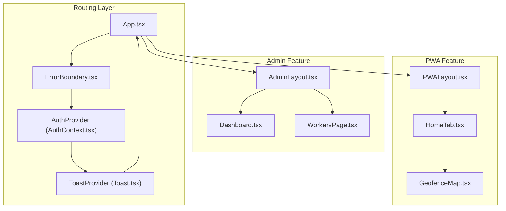
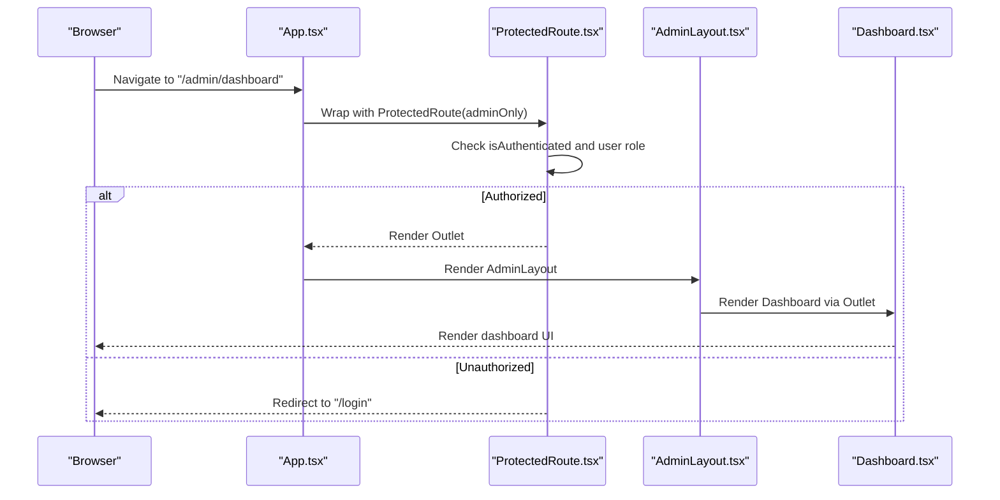
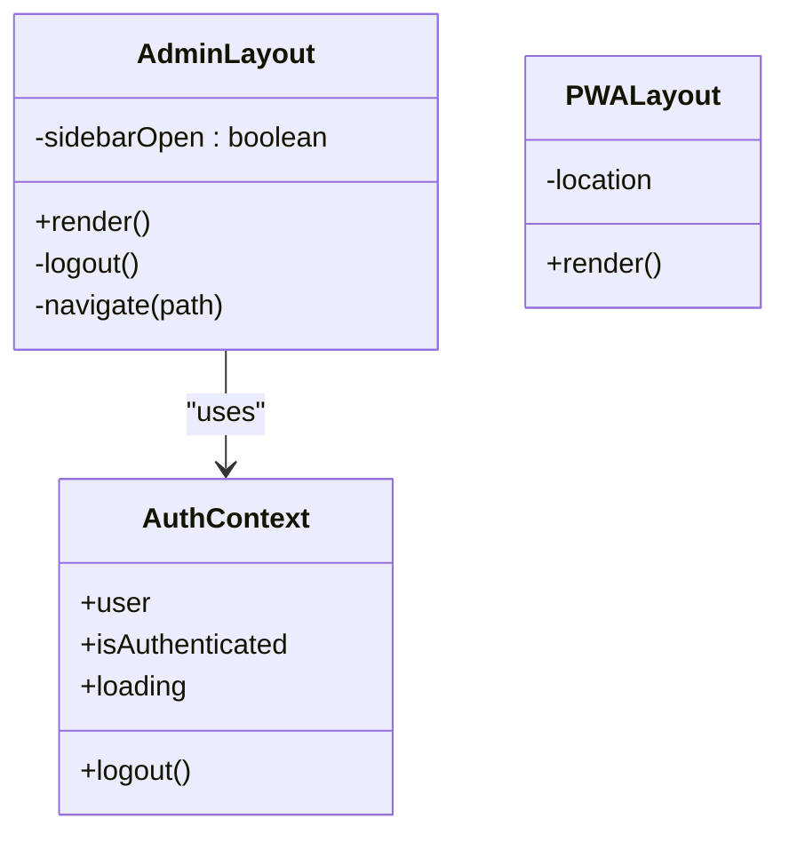
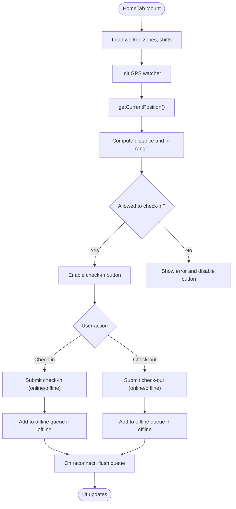
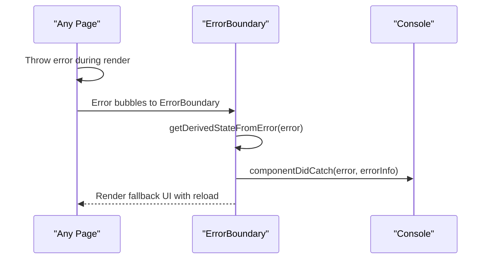
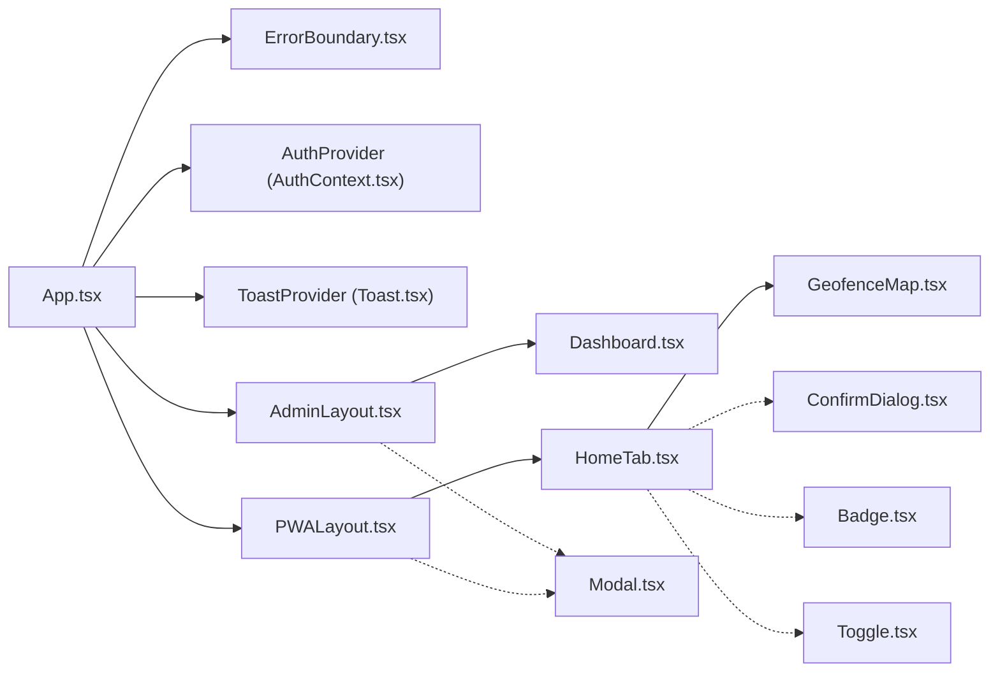

# Component Hierarchy

<cite>
**Referenced Files in This Document**
- [AdminLayout.tsx](file://src/components/admin/AdminLayout.tsx)
- [PWALayout.tsx](file://src/components/pwa/PWALayout.tsx)
- [Modal.tsx](file://src/components/ui/Modal.tsx)
- [Toast.tsx](file://src/components/ui/Toast.tsx)
- [Badge.tsx](file://src/components/ui/Badge.tsx)
- [Toggle.tsx](file://src/components/ui/Toggle.tsx)
- [ConfirmDialog.tsx](file://src/components/ui/ConfirmDialog.tsx)
- [ErrorBoundary.tsx](file://src/components/ErrorBoundary.tsx)
- [ProtectedRoute.tsx](file://src/components/ProtectedRoute.tsx)
- [Dashboard.tsx](file://src/components/admin/Dashboard.tsx)
- [WorkersPage.tsx](file://src/components/admin/WorkersPage.tsx)
- [HomeTab.tsx](file://src/components/pwa/HomeTab.tsx)
- [GeofenceMap.tsx](file://src/components/pwa/GeofenceMap.tsx)
- [AuthContext.tsx](file://src/context/AuthContext.tsx)
- [App.tsx](file://src/App.tsx)
</cite>

## Table of Contents
1. [Introduction](#introduction)
2. [Project Structure](#project-structure)
3. [Core Components](#core-components)
4. [Architecture Overview](#architecture-overview)
5. [Detailed Component Analysis](#detailed-component-analysis)
6. [Dependency Analysis](#dependency-analysis)
7. [Performance Considerations](#performance-considerations)
8. [Troubleshooting Guide](#troubleshooting-guide)
9. [Conclusion](#conclusion)

## Introduction
This document describes the component hierarchy and architecture of AbsensiOnline’s React application. It focuses on how AdminLayout and PWALayout act as main layout containers, how UI components provide reusable building blocks, and how specialized components encapsulate domain-specific functionality. It also covers component composition patterns, strategies to prevent prop drilling, communication between layers, lifecycle management, error boundaries, route protection, and practical usage patterns.

## Project Structure
The application is organized by feature and responsibility:
- Layouts: AdminLayout (admin panel) and PWALayout (PWA/mobile interface)
- UI primitives: Modal, Toast, Badge, Toggle, ConfirmDialog
- Specialized pages: Admin dashboards and PWA tabs
- Context and routing: Auth provider, protected routes, and global error boundary
- Services and utilities: Services for attendance, workers, zones, and offline queue utilities



**Diagram sources**
- [App.tsx:20-57](file://src/App.tsx#L20-L57)
- [ErrorBoundary.tsx:13-60](file://src/components/ErrorBoundary.tsx#L13-L60)
- [AuthContext.tsx:18-42](file://src/context/AuthContext.tsx#L18-L42)
- [Toast.tsx:23-46](file://src/components/ui/Toast.tsx#L23-L46)
- [AdminLayout.tsx:17-140](file://src/components/admin/AdminLayout.tsx#L17-L140)
- [PWALayout.tsx:11-42](file://src/components/pwa/PWALayout.tsx#L11-L42)
- [Dashboard.tsx:72-282](file://src/components/admin/Dashboard.tsx#L72-L282)
- [WorkersPage.tsx:162-509](file://src/components/admin/WorkersPage.tsx#L162-L509)
- [HomeTab.tsx:37-817](file://src/components/pwa/HomeTab.tsx#L37-L817)
- [GeofenceMap.tsx:12-153](file://src/components/pwa/GeofenceMap.tsx#L12-L153)

**Section sources**
- [App.tsx:20-57](file://src/App.tsx#L20-L57)

## Core Components
- Layout containers
  - AdminLayout: Provides admin navigation, responsive sidebar, header actions, and outlet rendering for admin routes.
  - PWALayout: Provides bottom tab navigation for PWA views and outlet rendering for mobile routes.
- UI primitives
  - Modal: A flexible overlay container with configurable sizes and close behavior.
  - Toast: Provider and hook for non-blocking notifications with auto-dismiss.
  - Badge: Status indicator with variants and convenience mapping for attendance/status.
  - Toggle: Accessible switch component with optional label and disabled state.
  - ConfirmDialog: Modal-based confirmation dialog built on Modal.
- Specialized pages
  - Dashboard: Admin analytics dashboard with charts, stats, and activity feed.
  - WorkersPage: CRUD and filtering for workers with modals and toasts.
  - HomeTab: PWA check-in/out flow with geofencing, attachments, offline queue, and progress.
  - GeofenceMap: Canvas-based visualization of zone radius and user position.
- Infrastructure
  - ErrorBoundary: Application-level error catcher with user-friendly fallback.
  - ProtectedRoute: Route guard enforcing authentication and admin-only access.
  - AuthContext: Authentication state provider and hook.

**Section sources**
- [AdminLayout.tsx:17-140](file://src/components/admin/AdminLayout.tsx#L17-L140)
- [PWALayout.tsx:11-42](file://src/components/pwa/PWALayout.tsx#L11-L42)
- [Modal.tsx:21-53](file://src/components/ui/Modal.tsx#L21-L53)
- [Toast.tsx:19-90](file://src/components/ui/Toast.tsx#L19-L90)
- [Badge.tsx:32-53](file://src/components/ui/Badge.tsx#L32-L53)
- [Toggle.tsx:10-28](file://src/components/ui/Toggle.tsx#L10-L28)
- [ConfirmDialog.tsx:20-41](file://src/components/ui/ConfirmDialog.tsx#L20-L41)
- [ErrorBoundary.tsx:13-60](file://src/components/ErrorBoundary.tsx#L13-L60)
- [ProtectedRoute.tsx:9-31](file://src/components/ProtectedRoute.tsx#L9-L31)
- [Dashboard.tsx:72-282](file://src/components/admin/Dashboard.tsx#L72-L282)
- [WorkersPage.tsx:162-509](file://src/components/admin/WorkersPage.tsx#L162-L509)
- [HomeTab.tsx:37-817](file://src/components/pwa/HomeTab.tsx#L37-L817)
- [GeofenceMap.tsx:12-153](file://src/components/pwa/GeofenceMap.tsx#L12-L153)
- [AuthContext.tsx:18-42](file://src/context/AuthContext.tsx#L18-L42)

## Architecture Overview
The app composes three layers:
- Routing and guards: App defines routes, wraps children in ErrorBoundary, AuthProvider, and ToastProvider, and enforces ProtectedRoute for admin and PWA sections.
- Layouts: AdminLayout and PWALayout provide consistent navigation and outlet rendering for their respective feature sets.
- Pages and UI: Specialized pages orchestrate data fetching, state, and UI primitives; UI components encapsulate presentation and behavior.



**Diagram sources**
- [App.tsx:29-40](file://src/App.tsx#L29-L40)
- [ProtectedRoute.tsx:9-31](file://src/components/ProtectedRoute.tsx#L9-L31)
- [AdminLayout.tsx:17-140](file://src/components/admin/AdminLayout.tsx#L17-L140)
- [Dashboard.tsx:72-282](file://src/components/admin/Dashboard.tsx#L72-L282)

## Detailed Component Analysis

### Layout Containers: AdminLayout and PWALayout
- AdminLayout
  - Responsibilities: Navigation menu, responsive sidebar, header actions, logout, and outlet rendering.
  - Composition: Uses AuthContext for current user and logout; computes active label from location; renders nav items with icons and titles; toggles sidebar on small screens; provides “view PWA” button.
  - Communication: Calls logout handler from AuthContext; navigates to PWA view via react-router.
- PWALayout
  - Responsibilities: Bottom tab navigation for home/history/profile; outlet rendering; responsive container with fixed bottom nav.
  - Composition: Uses location to compute active tab; renders NavLink items with icons and labels.



**Diagram sources**
- [AdminLayout.tsx:17-140](file://src/components/admin/AdminLayout.tsx#L17-L140)
- [PWALayout.tsx:11-42](file://src/components/pwa/PWALayout.tsx#L11-L42)
- [AuthContext.tsx:38-42](file://src/context/AuthContext.tsx#L38-L42)

**Section sources**
- [AdminLayout.tsx:17-140](file://src/components/admin/AdminLayout.tsx#L17-L140)
- [PWALayout.tsx:11-42](file://src/components/pwa/PWALayout.tsx#L11-L42)
- [AuthContext.tsx:38-42](file://src/context/AuthContext.tsx#L38-L42)

### UI Primitives: Reusable Building Blocks
- Modal
  - Props: isOpen, onClose, title, children, size, className.
  - Behavior: Controls body scroll; conditionally renders overlay and modal content; supports optional title bar with close button.
- Toast
  - Provider: Exposes toast(message, type) via context; renders floating stack of toasts; auto-dismiss after delay.
  - Hook: useToast returns the toast function for consumers.
- Badge
  - Props: variant, children, className, dot.
  - Utility: getStatusBadgeVariant maps status strings to badge variants.
- Toggle
  - Props: checked, onChange, disabled, label.
  - Behavior: Clickable toggle with visual feedback and optional label.
- ConfirmDialog
  - Props: isOpen, onClose, onConfirm, title, message, confirmLabel, cancelLabel, variant.
  - Composition: Built on Modal; provides confirm/cancel actions styled by variant.

```mermaid
classDiagram
class Modal {
+props : isOpen, onClose, title, children, size, className
+render()
}
class ToastProvider {
+toast(message, type)
+dismiss(id)
+render()
}
class ToastHook {
+useToast() : { toast }
}
class Badge {
+props : variant, children, className, dot
+getStatusBadgeVariant(status)
}
class Toggle {
+props : checked, onChange, disabled, label
+render()
}
class ConfirmDialog {
+props : isOpen, onClose, onConfirm, title, message, variant
+render()
}
ConfirmDialog --> Modal : "composes"
ToastProvider --> ToastHook : "provides via context"
```

**Diagram sources**
- [Modal.tsx:21-53](file://src/components/ui/Modal.tsx#L21-L53)
- [Toast.tsx:23-90](file://src/components/ui/Toast.tsx#L23-L90)
- [Badge.tsx:32-53](file://src/components/ui/Badge.tsx#L32-L53)
- [Toggle.tsx:10-28](file://src/components/ui/Toggle.tsx#L10-L28)
- [ConfirmDialog.tsx:20-41](file://src/components/ui/ConfirmDialog.tsx#L20-L41)

**Section sources**
- [Modal.tsx:21-53](file://src/components/ui/Modal.tsx#L21-L53)
- [Toast.tsx:23-90](file://src/components/ui/Toast.tsx#L23-L90)
- [Badge.tsx:32-53](file://src/components/ui/Badge.tsx#L32-L53)
- [Toggle.tsx:10-28](file://src/components/ui/Toggle.tsx#L10-L28)
- [ConfirmDialog.tsx:20-41](file://src/components/ui/ConfirmDialog.tsx#L20-L41)

### Specialized Components: Domain Functionality
- Dashboard
  - Responsibilities: Fetches and displays weekly stats, pie/bar charts, recent activity, and recent check-ins.
  - Patterns: Parallel data loading, derived computations, periodic refresh, and chart rendering.
- WorkersPage
  - Responsibilities: Lists workers with filters and pagination; inline edit/create via Modal; resets PIN via separate Modal; uses Badge and Toggle.
  - Patterns: Controlled forms, validation, optimistic updates, and toast feedback.
- HomeTab
  - Responsibilities: Implements check-in/out with geofencing, attachment uploads, offline queue, and sync.
  - Patterns: GPS detection, distance calculation, offline-first behavior, progress reporting, and service orchestration.
- GeofenceMap
  - Responsibilities: Renders a canvas-based visualization of zone radius, user position, accuracy ring, and center pin.



**Diagram sources**
- [HomeTab.tsx:37-817](file://src/components/pwa/HomeTab.tsx#L37-L817)
- [GeofenceMap.tsx:12-153](file://src/components/pwa/GeofenceMap.tsx#L12-L153)

**Section sources**
- [Dashboard.tsx:72-282](file://src/components/admin/Dashboard.tsx#L72-L282)
- [WorkersPage.tsx:162-509](file://src/components/admin/WorkersPage.tsx#L162-L509)
- [HomeTab.tsx:37-817](file://src/components/pwa/HomeTab.tsx#L37-L817)
- [GeofenceMap.tsx:12-153](file://src/components/pwa/GeofenceMap.tsx#L12-L153)

### Component Composition Patterns and Prop Drilling Prevention
- Context-based state
  - AuthContext provides user, token, isAuthenticated, loading, login, and logout to AdminLayout and ProtectedRoute without passing props down the tree.
  - ToastProvider exposes toast via context, allowing any component to emit notifications without requiring props.
- Layouts as composition roots
  - AdminLayout and PWALayout wrap their children via Outlet, enabling clean separation of navigation and page content.
- UI components as leaf nodes
  - Modal, ConfirmDialog, Toast, Badge, and Toggle encapsulate behavior and styling, minimizing prop cascading.

**Section sources**
- [AuthContext.tsx:18-42](file://src/context/AuthContext.tsx#L18-L42)
- [Toast.tsx:23-46](file://src/components/ui/Toast.tsx#L23-L46)
- [AdminLayout.tsx:17-140](file://src/components/admin/AdminLayout.tsx#L17-L140)
- [PWALayout.tsx:11-42](file://src/components/pwa/PWALayout.tsx#L11-L42)

### Component Communication Strategies
- Parent-to-child: Props (e.g., Modal receives isOpen/onClose/title/children; Badge receives variant/dot; Toggle receives checked/onChange).
- Child-to-parent: Callback props (e.g., Modal onClose; Toggle onChange; ConfirmDialog onConfirm).
- Cross-component via context: useAuth and useToast allow components deep in the tree to access shared state and services.
- Event-driven within pages: HomeTab handles GPS events, uploads, and queue flushing; WorkersPage triggers modals and toasts.

**Section sources**
- [Modal.tsx:21-53](file://src/components/ui/Modal.tsx#L21-L53)
- [ConfirmDialog.tsx:20-41](file://src/components/ui/ConfirmDialog.tsx#L20-L41)
- [Toggle.tsx:10-28](file://src/components/ui/Toggle.tsx#L10-L28)
- [Toast.tsx:19-90](file://src/components/ui/Toast.tsx#L19-L90)
- [AuthContext.tsx:38-42](file://src/context/AuthContext.tsx#L38-L42)

### Component Lifecycle Management
- Mounting and cleanup
  - HomeTab sets up GPS watchers, interval timers, and online/offline listeners; cleans up intervals and event listeners on unmount.
  - GeofenceMap draws on canvas and reacts to prop changes; clears and redraws on updates.
  - Modal manages document.body overflow in effect and restores on unmount.
- Periodic tasks
  - Dashboard auto-refreshes stats and activity feed periodically.
  - HomeTab periodically checks connectivity and attempts to sync queued operations.

**Section sources**
- [HomeTab.tsx:125-128](file://src/components/pwa/HomeTab.tsx#L125-L128)
- [HomeTab.tsx:164-216](file://src/components/pwa/HomeTab.tsx#L164-L216)
- [HomeTab.tsx:218-234](file://src/components/pwa/HomeTab.tsx#L218-L234)
- [GeofenceMap.tsx:15-141](file://src/components/pwa/GeofenceMap.tsx#L15-L141)
- [Modal.tsx:22-29](file://src/components/ui/Modal.tsx#L22-L29)
- [Dashboard.tsx:145-148](file://src/components/admin/Dashboard.tsx#L145-L148)

### Error Boundaries and Route Protection
- ErrorBoundary
  - Catches errors via static getDerivedStateFromError and logs via componentDidCatch; renders friendly UI with reload button and error message.
- ProtectedRoute
  - Checks authentication and role; shows spinner while loading; redirects unauthenticated users to login; restricts admin-only routes.



**Diagram sources**
- [ErrorBoundary.tsx:19-25](file://src/components/ErrorBoundary.tsx#L19-L25)
- [ErrorBoundary.tsx:27-58](file://src/components/ErrorBoundary.tsx#L27-L58)

**Section sources**
- [ErrorBoundary.tsx:13-60](file://src/components/ErrorBoundary.tsx#L13-L60)
- [ProtectedRoute.tsx:9-31](file://src/components/ProtectedRoute.tsx#L9-L31)

### Examples of Component Usage Patterns and Integration Points
- Admin dashboard
  - AdminLayout renders Dashboard via Outlet; Dashboard fetches data from services and renders charts and tables.
- Worker management
  - WorkersPage uses Modal for create/edit, ConfirmDialog for delete, Badge for status, Toggle for enabling/disabling online check-in, and Toast for feedback.
- PWA check-in/out
  - HomeTab orchestrates GPS detection, distance computation, check-in/out submission, attachment upload, and offline queue; integrates GeofenceMap for visualization.
- Global providers
  - App wraps routes in ErrorBoundary, AuthProvider, and ToastProvider to ensure consistent behavior across admin and PWA sections.

**Section sources**
- [AdminLayout.tsx:17-140](file://src/components/admin/AdminLayout.tsx#L17-L140)
- [Dashboard.tsx:72-282](file://src/components/admin/Dashboard.tsx#L72-L282)
- [WorkersPage.tsx:162-509](file://src/components/admin/WorkersPage.tsx#L162-L509)
- [HomeTab.tsx:37-817](file://src/components/pwa/HomeTab.tsx#L37-L817)
- [GeofenceMap.tsx:12-153](file://src/components/pwa/GeofenceMap.tsx#L12-L153)
- [App.tsx:20-57](file://src/App.tsx#L20-L57)

## Dependency Analysis
- Routing and guards depend on AuthContext and ProtectedRoute.
- Layouts depend on AuthContext for user and logout.
- Pages depend on services and UI primitives; HomeTab additionally depends on GeofenceMap and offline utilities.
- UI primitives are leaf components with minimal internal dependencies.



**Diagram sources**
- [App.tsx:20-57](file://src/App.tsx#L20-L57)
- [AuthContext.tsx:18-42](file://src/context/AuthContext.tsx#L18-L42)
- [Toast.tsx:23-46](file://src/components/ui/Toast.tsx#L23-L46)
- [AdminLayout.tsx:17-140](file://src/components/admin/AdminLayout.tsx#L17-L140)
- [PWALayout.tsx:11-42](file://src/components/pwa/PWALayout.tsx#L11-L42)
- [Dashboard.tsx:72-282](file://src/components/admin/Dashboard.tsx#L72-L282)
- [HomeTab.tsx:37-817](file://src/components/pwa/HomeTab.tsx#L37-L817)
- [GeofenceMap.tsx:12-153](file://src/components/pwa/GeofenceMap.tsx#L12-L153)
- [Modal.tsx:21-53](file://src/components/ui/Modal.tsx#L21-L53)
- [ConfirmDialog.tsx:20-41](file://src/components/ui/ConfirmDialog.tsx#L20-L41)
- [Badge.tsx:32-53](file://src/components/ui/Badge.tsx#L32-L53)
- [Toggle.tsx:10-28](file://src/components/ui/Toggle.tsx#L10-L28)

**Section sources**
- [App.tsx:20-57](file://src/App.tsx#L20-L57)

## Performance Considerations
- Minimize re-renders
  - Use memoization for derived data (e.g., computed stats) and avoid unnecessary state updates.
  - Batch UI updates in HomeTab (GPS, distance, inRange) to reduce layout thrashing.
- Optimize rendering
  - Dashboard uses responsive charts; consider virtualizing large tables if growth continues.
  - GeofenceMap uses canvas; ensure efficient redraws by updating only when props change.
- Network and offline
  - HomeTab defers submissions to offline queue and flushes on reconnect; limit frequent polling and batch operations.

## Troubleshooting Guide
- Authentication issues
  - ProtectedRoute shows a spinner while loading; if stuck, verify AuthContext initialization and network connectivity.
- UI notifications
  - ToastProvider requires wrapping App; ensure ToastProvider is present to expose useToast.
- Layout responsiveness
  - AdminLayout toggles sidebar on small screens; verify media query behavior and click handlers.
- PWA offline mode
  - HomeTab indicates offline state and queues operations; confirm service worker and offlineQueue utilities are initialized.

**Section sources**
- [ProtectedRoute.tsx:12-18](file://src/components/ProtectedRoute.tsx#L12-L18)
- [Toast.tsx:23-46](file://src/components/ui/Toast.tsx#L23-L46)
- [AdminLayout.tsx:21-87](file://src/components/admin/AdminLayout.tsx#L21-L87)
- [HomeTab.tsx:87-93](file://src/components/pwa/HomeTab.tsx#L87-L93)

## Conclusion
AbsensiOnline’s component hierarchy cleanly separates concerns across layouts, UI primitives, and specialized pages. Context and providers minimize prop drilling, while ErrorBoundary and ProtectedRoute ensure robust UX and security. The PWA and admin sections share consistent patterns for navigation and data presentation, with HomeTab and Dashboard exemplifying complex flows that combine geolocation, offline-first strategies, and real-time updates.