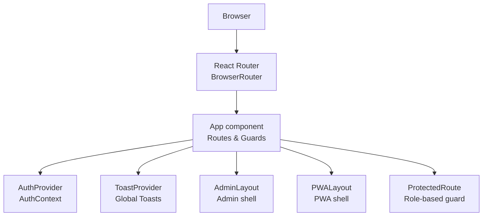
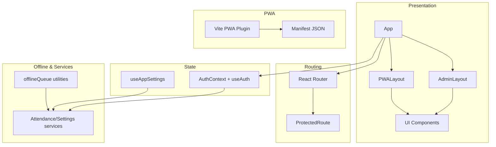
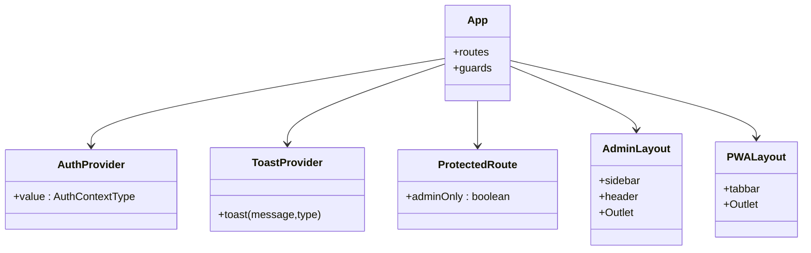
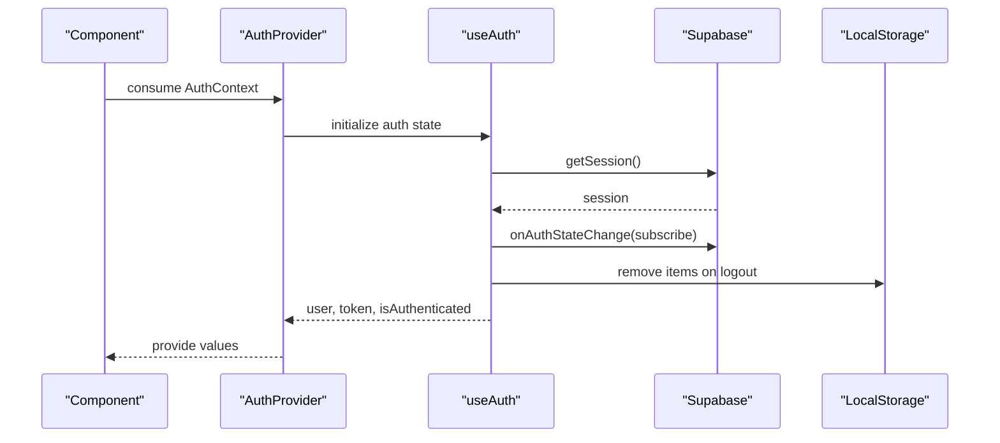
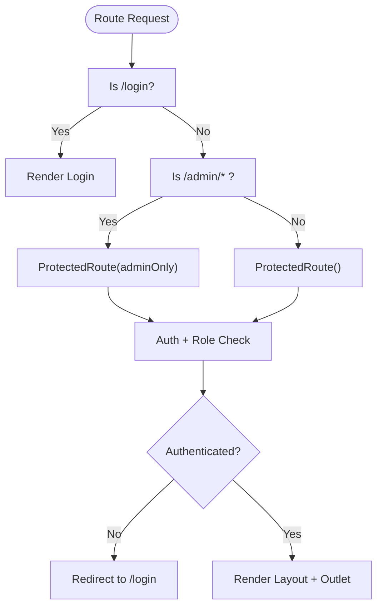
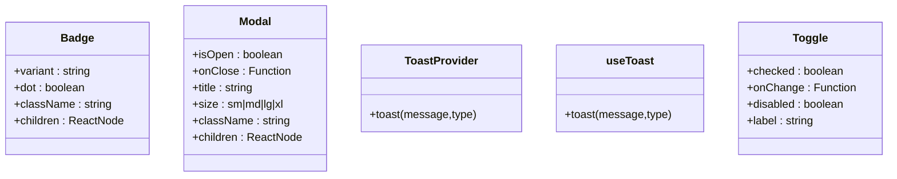
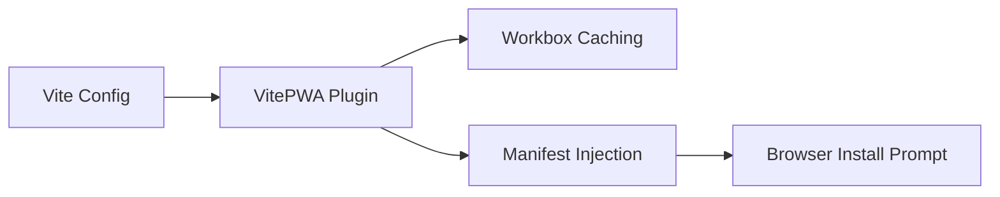
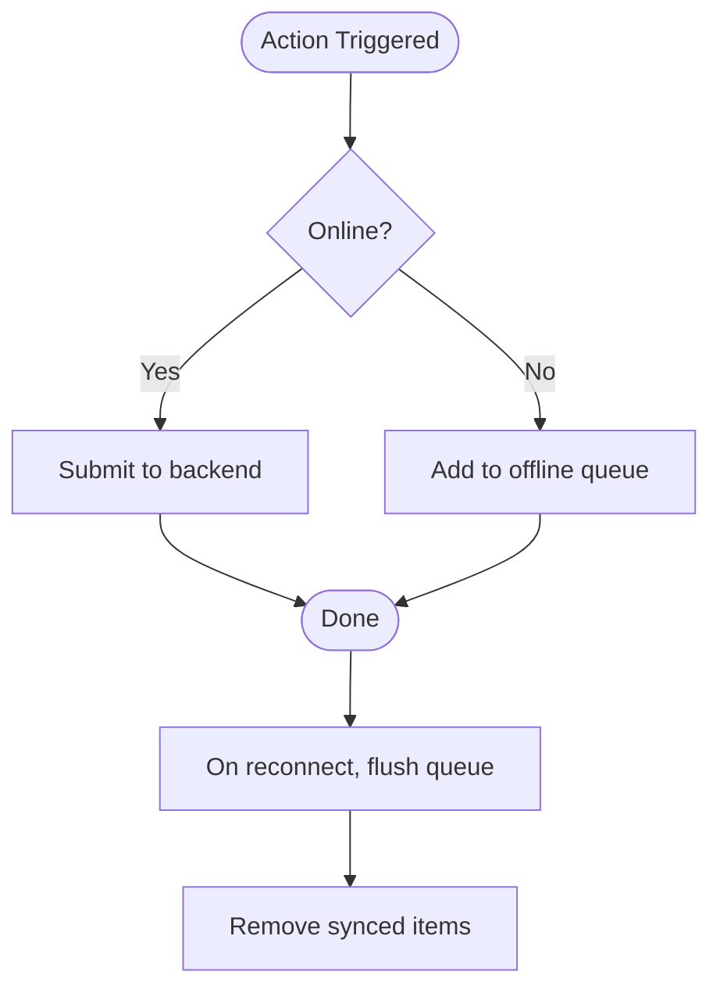
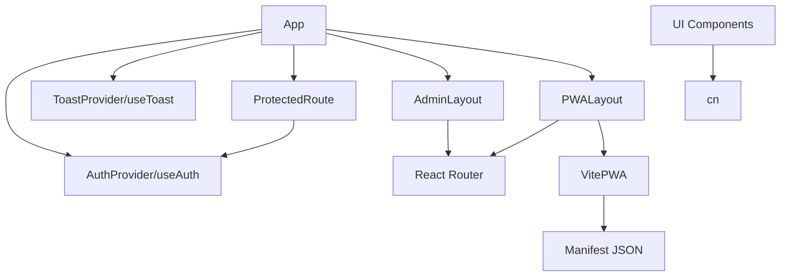

# Frontend Architecture

<cite>
**Referenced Files in This Document**
- [src/main.tsx](file://src/main.tsx)
- [src/App.tsx](file://src/App.tsx)
- [src/components/admin/AdminLayout.tsx](file://src/components/admin/AdminLayout.tsx)
- [src/components/pwa/PWALayout.tsx](file://src/components/pwa/PWALayout.tsx)
- [src/context/AuthContext.tsx](file://src/context/AuthContext.tsx)
- [src/hooks/useAuth.ts](file://src/hooks/useAuth.ts)
- [src/components/ProtectedRoute.tsx](file://src/components/ProtectedRoute.tsx)
- [src/components/ui/Badge.tsx](file://src/components/ui/Badge.tsx)
- [src/components/ui/Modal.tsx](file://src/components/ui/Modal.tsx)
- [src/components/ui/Toast.tsx](file://src/components/ui/Toast.tsx)
- [src/components/ui/Toggle.tsx](file://src/components/ui/Toggle.tsx)
- [src/utils/offlineQueue.ts](file://src/utils/offlineQueue.ts)
- [src/hooks/useAppSettings.ts](file://src/hooks/useAppSettings.ts)
- [vite.config.ts](file://vite.config.ts)
- [public/manifest.json](file://public/manifest.json)
- [src/index.css](file://src/index.css)
</cite>

## Table of Contents
1. [Introduction](#introduction)
2. [Project Structure](#project-structure)
3. [Core Components](#core-components)
4. [Architecture Overview](#architecture-overview)
5. [Detailed Component Analysis](#detailed-component-analysis)
6. [Dependency Analysis](#dependency-analysis)
7. [Performance Considerations](#performance-considerations)
8. [Troubleshooting Guide](#troubleshooting-guide)
9. [Conclusion](#conclusion)
10. [Appendices](#appendices)

## Introduction
This document describes the frontend architecture of AbsensiOnline’s React-based Progressive Web App (PWA). It explains the component hierarchy, state management patterns, routing configuration, styling approach, PWA implementation, UI component library, responsive design, and accessibility considerations. The application supports two primary interfaces:
- Admin interface under /admin, secured via role-based protection
- Worker PWA interface under /app, designed for mobile-first usage

## Project Structure
The frontend is structured around a single-page application built with React and Vite. Routing is handled client-side with React Router. Authentication state is centralized via a React Context provider. UI components are organized into reusable modules, and PWA capabilities are configured through Vite and Workbox.

**Diagram sources**
- [src/main.tsx:8-14](file://src/main.tsx#L8-L14)
- [src/App.tsx:20-57](file://src/App.tsx#L20-L57)
- [src/context/AuthContext.tsx:18-36](file://src/context/AuthContext.tsx#L18-L36)
- [src/components/ui/Toast.tsx:23-46](file://src/components/ui/Toast.tsx#L23-L46)
- [src/components/admin/AdminLayout.tsx:17-141](file://src/components/admin/AdminLayout.tsx#L17-L141)
- [src/components/pwa/PWALayout.tsx:11-43](file://src/components/pwa/PWALayout.tsx#L11-L43)
- [src/components/ProtectedRoute.tsx:9-31](file://src/components/ProtectedRoute.tsx#L9-L31)

**Section sources**
- [src/main.tsx:1-15](file://src/main.tsx#L1-L15)
- [src/App.tsx:1-58](file://src/App.tsx#L1-L58)

## Core Components
- App: Declares routes for login, admin, and PWA areas, and applies route guards.
- AuthProvider/AuthContext: Centralizes authentication state and exposes login/logout and user info.
- ProtectedRoute: Enforces authentication and optional admin-only access.
- AdminLayout: Provides admin shell with sidebar navigation, header, and outlet for nested routes.
- PWALayout: Provides PWA shell with bottom tab bar and outlet for nested routes.
- UI components: Reusable building blocks (Badge, Modal, Toast, Toggle) with consistent styling and behavior.

**Section sources**
- [src/App.tsx:20-57](file://src/App.tsx#L20-L57)
- [src/context/AuthContext.tsx:18-43](file://src/context/AuthContext.tsx#L18-L43)
- [src/components/ProtectedRoute.tsx:9-31](file://src/components/ProtectedRoute.tsx#L9-L31)
- [src/components/admin/AdminLayout.tsx:17-141](file://src/components/admin/AdminLayout.tsx#L17-L141)
- [src/components/pwa/PWALayout.tsx:11-43](file://src/components/pwa/PWALayout.tsx#L11-L43)
- [src/components/ui/Badge.tsx:32-43](file://src/components/ui/Badge.tsx#L32-L43)
- [src/components/ui/Modal.tsx:21-31](file://src/components/ui/Modal.tsx#L21-L31)
- [src/components/ui/Toast.tsx:23-46](file://src/components/ui/Toast.tsx#L23-L46)
- [src/components/ui/Toggle.tsx:10-28](file://src/components/ui/Toggle.tsx#L10-L28)

## Architecture Overview
The application follows a layered architecture:
- Presentation Layer: App, layouts, and UI components
- State Management: React Context (AuthContext) and custom hooks (useAuth, useAppSettings)
- Routing and Navigation: React Router with protected routes
- Services and Offline: Attendance and settings services, offline queue utilities
- PWA: Vite PWA plugin with Workbox caching and manifest configuration

**Diagram sources**
- [src/App.tsx:20-57](file://src/App.tsx#L20-L57)
- [src/context/AuthContext.tsx:18-43](file://src/context/AuthContext.tsx#L18-L43)
- [src/hooks/useAuth.ts:29-115](file://src/hooks/useAuth.ts#L29-L115)
- [src/hooks/useAppSettings.ts:25-45](file://src/hooks/useAppSettings.ts#L25-L45)
- [src/utils/offlineQueue.ts:66-97](file://src/utils/offlineQueue.ts#L66-L97)
- [vite.config.ts:20-32](file://vite.config.ts#L20-L32)
- [public/manifest.json:1-13](file://public/manifest.json#L1-L13)

## Detailed Component Analysis

### Component Hierarchy and Composition
- App composes providers (AuthProvider, ToastProvider) and defines routes for:
  - Admin area guarded by adminOnly
  - PWA area for authenticated users
  - Login page and catch-all redirects
- AdminLayout renders a responsive sidebar and header, with an outlet for nested admin pages.
- PWALayout renders a bottom tab bar for mobile navigation and an outlet for nested PWA pages.
- ProtectedRoute enforces authentication and admin-only access when required.

**Diagram sources**
- [src/App.tsx:20-57](file://src/App.tsx#L20-L57)
- [src/context/AuthContext.tsx:18-36](file://src/context/AuthContext.tsx#L18-L36)
- [src/components/ui/Toast.tsx:23-46](file://src/components/ui/Toast.tsx#L23-L46)
- [src/components/ProtectedRoute.tsx:9-31](file://src/components/ProtectedRoute.tsx#L9-L31)
- [src/components/admin/AdminLayout.tsx:17-141](file://src/components/admin/AdminLayout.tsx#L17-L141)
- [src/components/pwa/PWALayout.tsx:11-43](file://src/components/pwa/PWALayout.tsx#L11-L43)

**Section sources**
- [src/App.tsx:20-57](file://src/App.tsx#L20-L57)
- [src/components/admin/AdminLayout.tsx:17-141](file://src/components/admin/AdminLayout.tsx#L17-L141)
- [src/components/pwa/PWALayout.tsx:11-43](file://src/components/pwa/PWALayout.tsx#L11-L43)
- [src/components/ProtectedRoute.tsx:9-31](file://src/components/ProtectedRoute.tsx#L9-L31)

### State Management Patterns
- Authentication state is managed via a Context provider and hook:
  - AuthProvider wraps children and exposes user, token, isAuthenticated, loading, login, and logout.
  - useAuth encapsulates Supabase auth session hydration, login flow, and logout cleanup.
- Application-wide settings are cached and refreshed via useAppSettings, which leverages a settings service and invalidates cache on demand.
- Toast notifications are globally provided and consumed via a dedicated context and hook.

**Diagram sources**
- [src/context/AuthContext.tsx:18-43](file://src/context/AuthContext.tsx#L18-L43)
- [src/hooks/useAuth.ts:29-115](file://src/hooks/useAuth.ts#L29-L115)

**Section sources**
- [src/context/AuthContext.tsx:18-43](file://src/context/AuthContext.tsx#L18-L43)
- [src/hooks/useAuth.ts:29-115](file://src/hooks/useAuth.ts#L29-L115)
- [src/hooks/useAppSettings.ts:25-45](file://src/hooks/useAppSettings.ts#L25-L45)
- [src/components/ui/Toast.tsx:19-46](file://src/components/ui/Toast.tsx#L19-L46)

### Routing Configuration and Navigation
- Routes:
  - /login: Unprotected login page
  - /admin/*: Admin area guarded by adminOnly
  - /app/*: PWA area guarded by general auth
  - Catch-all redirect to /login
- Navigation patterns:
  - AdminLayout uses NavLink for sidebar and a “View PWA” action to navigate to /app/home
  - PWALayout uses a bottom tab bar with NavLink for home/history/profile
- ProtectedRoute handles loading state, authentication checks, and admin-only redirection.

**Diagram sources**
- [src/App.tsx:25-51](file://src/App.tsx#L25-L51)
- [src/components/ProtectedRoute.tsx:9-31](file://src/components/ProtectedRoute.tsx#L9-L31)

**Section sources**
- [src/App.tsx:25-51](file://src/App.tsx#L25-L51)
- [src/components/ProtectedRoute.tsx:9-31](file://src/components/ProtectedRoute.tsx#L9-L31)
- [src/components/admin/AdminLayout.tsx:107-112](file://src/components/admin/AdminLayout.tsx#L107-L112)
- [src/components/pwa/PWALayout.tsx:22-38](file://src/components/pwa/PWALayout.tsx#L22-L38)

### UI Component Library
- Badge
  - Props: variant (green, amber, red, blue, gray, purple, cyan), dot (boolean), className, children
  - Usage pattern: Status badges mapped from status strings via getStatusBadgeVariant
- Modal
  - Props: isOpen (boolean), onClose, title (optional), children, size (sm|md|lg|xl), className
  - Behavior: Locks body scroll when open; backdrop click closes
- Toast
  - Provider: Exposes toast(message, type?) via context
  - Hook: useToast returns the toast function
  - Types: success, error, warning, info; auto-dismiss after delay
- Toggle
  - Props: checked (boolean), onChange, disabled (boolean), label (string)
  - Behavior: Click toggles state; disabled state prevents interaction

**Diagram sources**
- [src/components/ui/Badge.tsx:5-10](file://src/components/ui/Badge.tsx#L5-L10)
- [src/components/ui/Modal.tsx:5-12](file://src/components/ui/Modal.tsx#L5-L12)
- [src/components/ui/Toast.tsx:13-15](file://src/components/ui/Toast.tsx#L13-L15)
- [src/components/ui/Toggle.tsx:3-8](file://src/components/ui/Toggle.tsx#L3-L8)

**Section sources**
- [src/components/ui/Badge.tsx:32-53](file://src/components/ui/Badge.tsx#L32-L53)
- [src/components/ui/Modal.tsx:21-53](file://src/components/ui/Modal.tsx#L21-L53)
- [src/components/ui/Toast.tsx:23-89](file://src/components/ui/Toast.tsx#L23-L89)
- [src/components/ui/Toggle.tsx:10-28](file://src/components/ui/Toggle.tsx#L10-L28)

### Styling Approach and Responsive Design
- Tailwind CSS is integrated via the Tailwind plugin in Vite.
- Utility-first classes are used extensively for layout, spacing, colors, and responsive breakpoints.
- Responsive patterns:
  - AdminLayout: Collapsible sidebar with mobile overlay and breakpoint-specific rendering
  - PWALayout: Fixed bottom tab bar with safe-area padding and centered max-width container
- Accessibility considerations:
  - Semantic HTML and proper focus order
  - Sufficient color contrast and readable sizes
  - Keyboard navigable tabs and buttons
  - Titles and aria-friendly controls in UI components

**Section sources**
- [vite.config.ts:16-18](file://vite.config.ts#L16-L18)
- [src/index.css](file://src/index.css)
- [src/components/admin/AdminLayout.tsx:27-87](file://src/components/admin/AdminLayout.tsx#L27-L87)
- [src/components/pwa/PWALayout.tsx:15-40](file://src/components/pwa/PWALayout.tsx#L15-L40)

### PWA Implementation
- Vite PWA plugin configuration:
  - Auto registration and update strategy
  - Asset inclusion and Workbox glob patterns
  - Runtime caching disabled; assets cached via Workbox
- Manifest:
  - Short name, start URL, standalone display, theme/background colors, and icons
- Mobile optimization:
  - Max-width constrained layout for PWA
  - Safe-area padding for bottom tab bar
  - Touch-friendly controls and spacing

**Diagram sources**
- [vite.config.ts:20-32](file://vite.config.ts#L20-L32)
- [public/manifest.json:1-13](file://public/manifest.json#L1-L13)

**Section sources**
- [vite.config.ts:20-32](file://vite.config.ts#L20-L32)
- [public/manifest.json:1-13](file://public/manifest.json#L1-L13)

### Offline Functionality
- Offline queue utilities support:
  - Pending queue persistence in localStorage
  - Local “today” record for current check-in/check-out state
  - Batch submission of queued check-ins/check-outs when online
  - Sync status tracking per queue item
- Typical flow:
  - On network loss, queue actions locally
  - On reconnect, flush queue and remove synced items

**Diagram sources**
- [src/utils/offlineQueue.ts:44-97](file://src/utils/offlineQueue.ts#L44-L97)

**Section sources**
- [src/utils/offlineQueue.ts:14-97](file://src/utils/offlineQueue.ts#L14-L97)

## Dependency Analysis
Key dependencies and relationships:
- App depends on AuthProvider, ToastProvider, ProtectedRoute, AdminLayout, and PWALayout
- ProtectedRoute depends on AuthContext
- AdminLayout and PWALayout depend on React Router for navigation and outlets
- UI components depend on shared utility functions (cn) and icons
- PWA relies on Vite PWA plugin and manifest configuration

**Diagram sources**
- [src/App.tsx:20-57](file://src/App.tsx#L20-L57)
- [src/context/AuthContext.tsx:18-43](file://src/context/AuthContext.tsx#L18-L43)
- [src/components/ui/Toast.tsx:23-46](file://src/components/ui/Toast.tsx#L23-L46)
- [src/components/ProtectedRoute.tsx:9-31](file://src/components/ProtectedRoute.tsx#L9-L31)
- [src/components/admin/AdminLayout.tsx:17-141](file://src/components/admin/AdminLayout.tsx#L17-L141)
- [src/components/pwa/PWALayout.tsx:11-43](file://src/components/pwa/PWALayout.tsx#L11-L43)
- [vite.config.ts:20-32](file://vite.config.ts#L20-L32)
- [public/manifest.json:1-13](file://public/manifest.json#L1-L13)

**Section sources**
- [src/App.tsx:20-57](file://src/App.tsx#L20-L57)
- [src/context/AuthContext.tsx:18-43](file://src/context/AuthContext.tsx#L18-L43)
- [src/components/ProtectedRoute.tsx:9-31](file://src/components/ProtectedRoute.tsx#L9-L31)
- [src/components/admin/AdminLayout.tsx:17-141](file://src/components/admin/AdminLayout.tsx#L17-L141)
- [src/components/pwa/PWALayout.tsx:11-43](file://src/components/pwa/PWALayout.tsx#L11-L43)
- [vite.config.ts:20-32](file://vite.config.ts#L20-L32)
- [public/manifest.json:1-13](file://public/manifest.json#L1-L13)

## Performance Considerations
- Route guards avoid unnecessary rendering by checking authentication and role early.
- Toast provider batches notifications and auto-dismisses them to prevent DOM clutter.
- Settings caching via useAppSettings reduces repeated network calls.
- PWA caching strategy minimizes asset downloads; consider adding targeted runtime caching for critical assets if needed.
- Keep UI components pure and memoized where appropriate to reduce re-renders.

## Troubleshooting Guide
- Authentication issues:
  - Verify AuthProvider wraps the application root and that useAuth is used within it.
  - Check login flow errors returned by useAuth and ensure Supabase RPC and auth endpoints are reachable.
- Route protection:
  - ProtectedRoute displays a spinner while loading; ensure auth state resolves before navigating.
  - Admin-only routes redirect non-admin users appropriately.
- Toast visibility:
  - Ensure ToastProvider wraps the application to expose the toast function.
- PWA installation:
  - Confirm manifest.json is served and VitePWA plugin is enabled.
  - Test install prompt and offline behavior in development mode.

**Section sources**
- [src/context/AuthContext.tsx:38-42](file://src/context/AuthContext.tsx#L38-L42)
- [src/hooks/useAuth.ts:58-96](file://src/hooks/useAuth.ts#L58-L96)
- [src/components/ProtectedRoute.tsx:12-18](file://src/components/ProtectedRoute.tsx#L12-L18)
- [src/components/ui/Toast.tsx:23-46](file://src/components/ui/Toast.tsx#L23-L46)
- [vite.config.ts:20-32](file://vite.config.ts#L20-L32)
- [public/manifest.json:1-13](file://public/manifest.json#L1-L13)

## Conclusion
AbsensiOnline’s frontend is a well-structured React-based PWA featuring:
- Clear separation of concerns with providers, guards, and layouts
- Centralized authentication and global notifications
- Mobile-first PWA with robust offline queueing
- Reusable UI components with consistent styling
- Strong routing and navigation patterns

## Appendices
- Additional UI utilities and helpers are available in the shared utilities module and can be leveraged across components as needed.