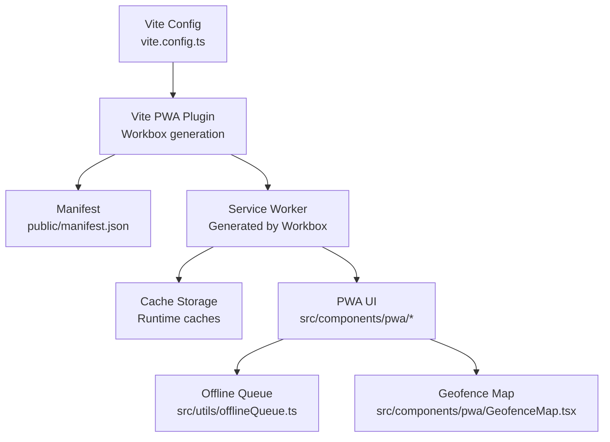
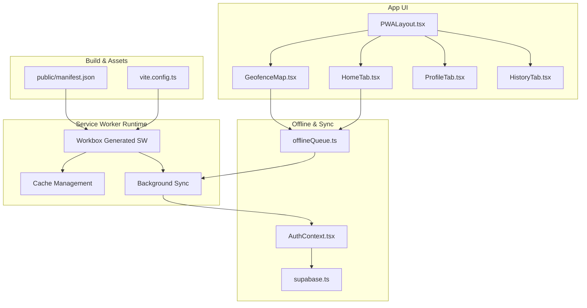
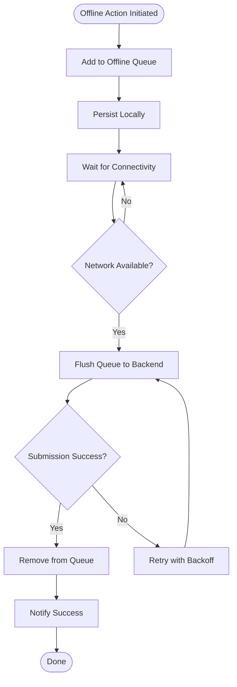
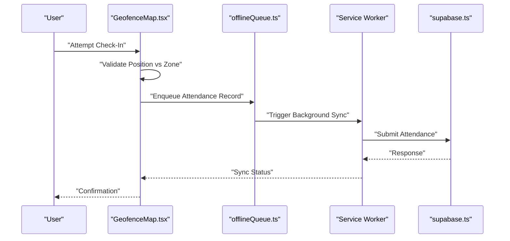
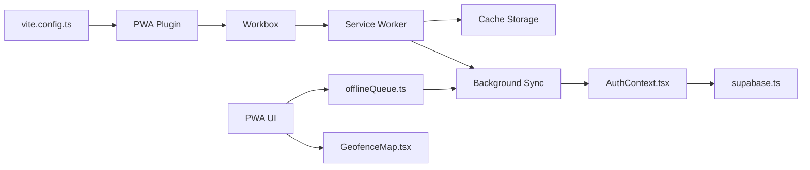

# PWA Integration

<cite>
**Referenced Files in This Document**
- [vite.config.ts](file://vite.config.ts)
- [manifest.json](file://public/manifest.json)
- [offlineQueue.ts](file://src/utils/offlineQueue.ts)
- [GeofenceMap.tsx](file://src/components/pwa/GeofenceMap.tsx)
- [HomeTab.tsx](file://src/components/pwa/HomeTab.tsx)
- [PWALayout.tsx](file://src/components/pwa/PWALayout.tsx)
- [Toast.tsx](file://src/components/ui/Toast.tsx)
- [AuthContext.tsx](file://src/context/AuthContext.tsx)
- [supabase.ts](file://src/config/supabase.ts)
- [vercel.json](file://vercel.json)
</cite>

## Table of Contents
1. [Introduction](#introduction)
2. [Project Structure](#project-structure)
3. [Core Components](#core-components)
4. [Architecture Overview](#architecture-overview)
5. [Detailed Component Analysis](#detailed-component-analysis)
6. [Dependency Analysis](#dependency-analysis)
7. [Performance Considerations](#performance-considerations)
8. [Troubleshooting Guide](#troubleshooting-guide)
9. [Conclusion](#conclusion)

## Introduction
This document explains the Progressive Web App (PWA) implementation in AbsensiOnline, focusing on service worker configuration, offline functionality, geofencing map integration, and mobile optimization. It covers the Vite PWA plugin setup, manifest.json configuration, offline queue management for attendance data, and strategies for offline synchronization, push notifications, cache management, and production deployment considerations.

## Project Structure
The PWA-related assets and logic are organized as follows:
- Build-time PWA configuration via Vite and the PWA plugin
- Application shell and PWA-specific UI under the pwa folder
- Offline data queue utility for capturing attendance actions when offline
- Manifest definition under the public directory
- Deployment configuration for hosting providers

**Diagram sources**
- [vite.config.ts](file://vite.config.ts)
- [manifest.json](file://public/manifest.json)
- [offlineQueue.ts](file://src/utils/offlineQueue.ts)
- [GeofenceMap.tsx](file://src/components/pwa/GeofenceMap.tsx)

**Section sources**
- [vite.config.ts](file://vite.config.ts)
- [manifest.json](file://public/manifest.json)

## Core Components
- Vite PWA Plugin and Workbox: Configured in the build pipeline to generate a service worker and precache static assets. This enables offline readiness and update mechanisms.
- Manifest Definition: Describes the app’s metadata, icons, theme colors, and display mode for installation and home screen presence.
- Offline Queue Utility: Captures attendance actions while offline and replays them when connectivity is restored.
- PWA UI Shell: Provides dedicated tabs and layouts for PWA features such as home, history, profile, and geofencing.
- Geofencing Map Integration: Renders interactive maps for zone-based attendance checks with offline-friendly caching.
- Authentication and Supabase Integration: Ensures secure user sessions and backend synchronization for attendance records.

**Section sources**
- [vite.config.ts](file://vite.config.ts)
- [manifest.json](file://public/manifest.json)
- [offlineQueue.ts](file://src/utils/offlineQueue.ts)
- [GeofenceMap.tsx](file://src/components/pwa/GeofenceMap.tsx)
- [PWALayout.tsx](file://src/components/pwa/PWALayout.tsx)
- [AuthContext.tsx](file://src/context/AuthContext.tsx)
- [supabase.ts](file://src/config/supabase.ts)

## Architecture Overview
The PWA architecture centers on the service worker generated by the Vite PWA plugin and Workbox. It manages runtime caching, background sync triggers, and update flows. The UI components leverage the offline queue for reliable data capture and the geofencing map for location-aware attendance.

**Diagram sources**
- [vite.config.ts](file://vite.config.ts)
- [manifest.json](file://public/manifest.json)
- [PWALayout.tsx](file://src/components/pwa/PWALayout.tsx)
- [HomeTab.tsx](file://src/components/pwa/HomeTab.tsx)
- [GeofenceMap.tsx](file://src/components/pwa/GeofenceMap.tsx)
- [offlineQueue.ts](file://src/utils/offlineQueue.ts)
- [AuthContext.tsx](file://src/context/AuthContext.tsx)
- [supabase.ts](file://src/config/supabase.ts)

## Detailed Component Analysis

### Vite PWA Plugin Configuration
- Purpose: Generates a service worker, creates a manifest, and configures precaching and runtime caching strategies.
- Key Behaviors:
  - Precaches static assets during install.
  - Manages cache updates via the service worker lifecycle.
  - Supports background sync for offline submissions.
- Integration Points:
  - Consumed by the build process to produce the service worker and manifest.
  - Works with Workbox for advanced caching and update strategies.

**Section sources**
- [vite.config.ts](file://vite.config.ts)

### Manifest Configuration
- Purpose: Defines app identity, icons, theme colors, orientation, and display mode for installation and home screen presentation.
- Key Fields:
  - App name, short name, description, and icons for various sizes.
  - Theme color and background color for splash screens.
  - Display mode and orientation settings.
- Validation:
  - Ensure icon sizes match recommended resolutions for install prompts.
  - Verify colors align with the app’s branding.

**Section sources**
- [manifest.json](file://public/manifest.json)

### Offline Queue Management
- Purpose: Capture attendance actions when offline and replay them upon reconnection.
- Responsibilities:
  - Persist pending operations locally.
  - Retry failed submissions with exponential backoff.
  - Integrate with background sync to trigger retries.
- Data Model:
  - Operations include attendance check-ins/out, updates, and attachments.
  - Each operation stores metadata for retry and deduplication.
- Error Handling:
  - Gracefully handle network failures and server errors.
  - Provide user feedback via toast notifications.

**Diagram sources**
- [offlineQueue.ts](file://src/utils/offlineQueue.ts)
- [Toast.tsx](file://src/components/ui/Toast.tsx)

**Section sources**
- [offlineQueue.ts](file://src/utils/offlineQueue.ts)
- [Toast.tsx](file://src/components/ui/Toast.tsx)

### Geofencing Map Integration
- Purpose: Enable location-aware attendance checks using interactive maps.
- Capabilities:
  - Render geofence zones and current position.
  - Validate proximity thresholds for check-in eligibility.
  - Cache map tiles and resources for offline map viewing.
- Offline Strategy:
  - Preload essential map resources via precache.
  - Use cached tiles when offline; disable dynamic overlays.
- UX Considerations:
  - Provide clear feedback for out-of-zone scenarios.
  - Offer manual override with validation and logging.

**Diagram sources**
- [GeofenceMap.tsx](file://src/components/pwa/GeofenceMap.tsx)
- [offlineQueue.ts](file://src/utils/offlineQueue.ts)
- [supabase.ts](file://src/config/supabase.ts)

**Section sources**
- [GeofenceMap.tsx](file://src/components/pwa/GeofenceMap.tsx)
- [offlineQueue.ts](file://src/utils/offlineQueue.ts)
- [supabase.ts](file://src/config/supabase.ts)

### PWA UI Shell and Tabs
- Layout:
  - Centralized layout component for PWA navigation and routing.
- Tabs:
  - Home tab for primary actions and quick access.
  - History tab for reviewing past attendance records.
  - Profile tab for user settings and account info.
- Responsiveness:
  - Mobile-first design with touch-friendly controls.
  - Adaptive layouts for portrait/landscape orientations.

**Section sources**
- [PWALayout.tsx](file://src/components/pwa/PWALayout.tsx)
- [HomeTab.tsx](file://src/components/pwa/HomeTab.tsx)
- [HistoryTab.tsx](file://src/components/pwa/HistoryTab.tsx)
- [ProfileTab.tsx](file://src/components/pwa/ProfileTab.tsx)

### Authentication and Session Context
- Purpose: Secure user sessions and synchronize attendance data with the backend.
- Integration:
  - Authentication context provides user state and tokens.
  - Service worker uses session context to authorize background sync requests.
- Security:
  - Tokens are scoped and refreshed as needed.
  - Sensitive operations are gated behind authenticated routes.

**Section sources**
- [AuthContext.tsx](file://src/context/AuthContext.tsx)
- [supabase.ts](file://src/config/supabase.ts)

## Dependency Analysis
- Build Dependencies:
  - Vite PWA plugin depends on Workbox for service worker generation and caching strategies.
  - Manifest is bundled and injected by the plugin.
- Runtime Dependencies:
  - Service worker interacts with cache storage and background sync APIs.
  - UI components depend on the offline queue and authentication context.
- External Integrations:
  - Supabase handles real-time data synchronization and authentication.
  - Map libraries rely on cached tiles and local positioning.

**Diagram sources**
- [vite.config.ts](file://vite.config.ts)
- [offlineQueue.ts](file://src/utils/offlineQueue.ts)
- [GeofenceMap.tsx](file://src/components/pwa/GeofenceMap.tsx)
- [AuthContext.tsx](file://src/context/AuthContext.tsx)
- [supabase.ts](file://src/config/supabase.ts)

**Section sources**
- [vite.config.ts](file://vite.config.ts)
- [offlineQueue.ts](file://src/utils/offlineQueue.ts)
- [GeofenceMap.tsx](file://src/components/pwa/GeofenceMap.tsx)
- [AuthContext.tsx](file://src/context/AuthContext.tsx)
- [supabase.ts](file://src/config/supabase.ts)

## Performance Considerations
- Precaching Strategy:
  - Preload critical HTML, JS, and CSS assets to enable instant load offline.
  - Limit precache entries to reduce initial bundle size.
- Cache Management:
  - Use cache-first for static assets and stale-while-revalidate for dynamic content.
  - Implement cache expiration and cleanup to prevent unbounded growth.
- Background Sync:
  - Batch submissions to minimize network overhead.
  - Add jitter/backoff to avoid thundering herd effects.
- Map Performance:
  - Preload essential map tiles and styles.
  - Disable heavy overlays when offline to conserve bandwidth.
- Bundle Size:
  - Split code into smaller chunks and lazy-load non-critical features.
  - Remove unused dependencies and tree-shake aggressively.

## Troubleshooting Guide
- Service Worker Not Updating:
  - Clear browser cache and unregister old service workers.
  - Verify the update strategy and skipWaiting options in the plugin configuration.
- Offline Queue Not Replaying:
  - Inspect persisted queue entries and submission logs.
  - Confirm background sync permissions and quota limits.
- Geofencing Accuracy Issues:
  - Validate device location permissions and accuracy settings.
  - Test with simulated positions and adjust proximity thresholds.
- Push Notifications:
  - Ensure manifest includes required fields and HTTPS deployment.
  - Verify subscription and delivery endpoints in the service worker.
- Deployment on Vercel:
  - Confirm static asset serving and service worker registration paths.
  - Validate environment variables and origin policies.

**Section sources**
- [vite.config.ts](file://vite.config.ts)
- [offlineQueue.ts](file://src/utils/offlineQueue.ts)
- [GeofenceMap.tsx](file://src/components/pwa/GeofenceMap.tsx)
- [vercel.json](file://vercel.json)

## Conclusion
AbsensiOnline’s PWA implementation leverages the Vite PWA plugin and Workbox to deliver an installable, offline-capable application. The offline queue ensures reliable attendance data capture, while the geofencing map integrates location awareness with robust caching. With proper cache management, background sync, and deployment hygiene, the app achieves strong reliability and performance across devices and network conditions.