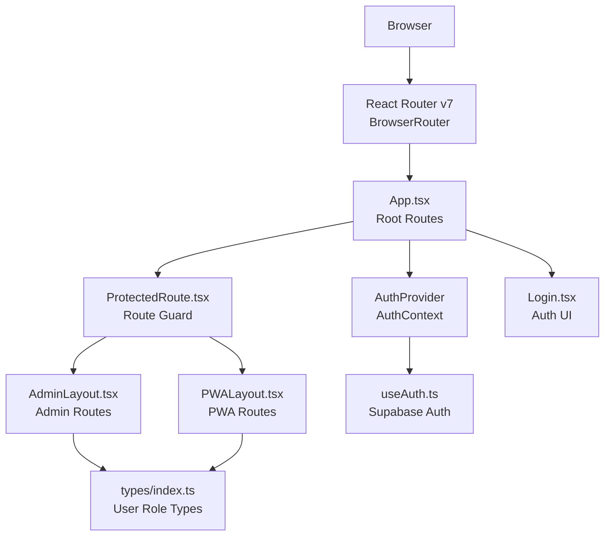
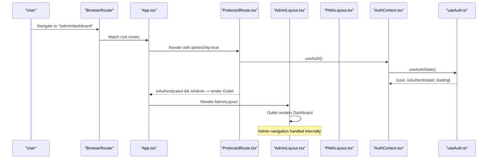
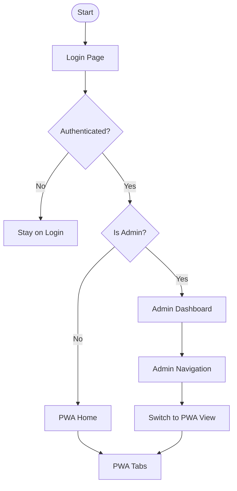
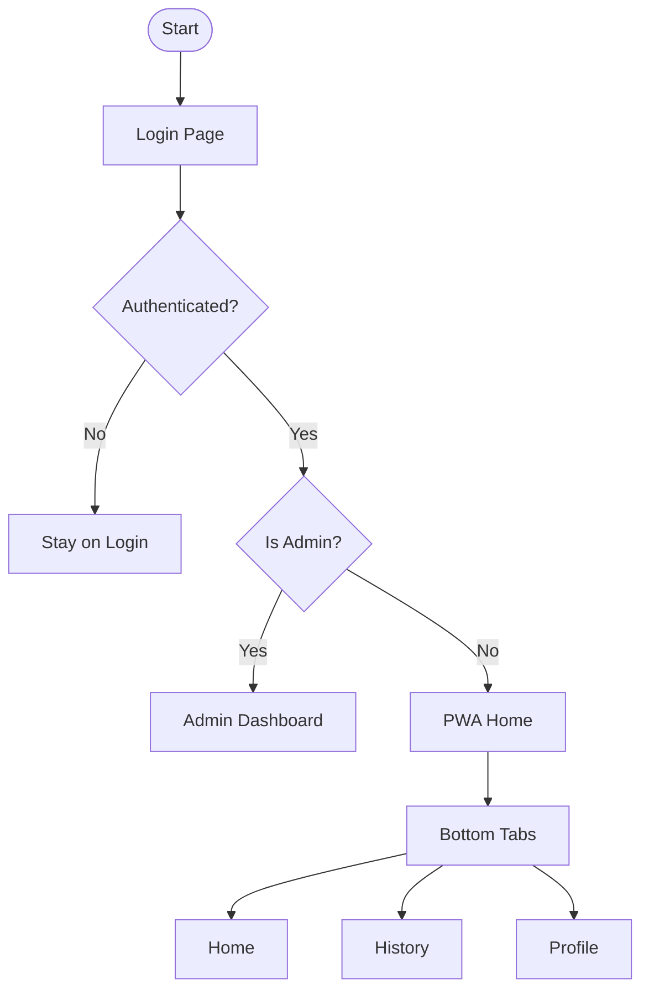
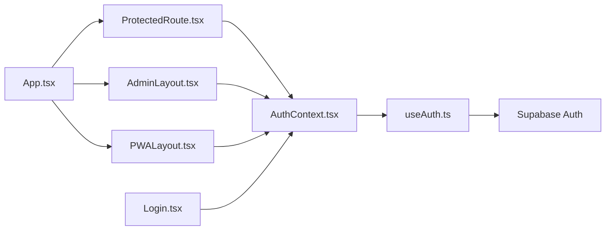

# Routing and Navigation

<cite>
**Referenced Files in This Document**
- [App.tsx](file://src/App.tsx)
- [ProtectedRoute.tsx](file://src/components/ProtectedRoute.tsx)
- [AdminLayout.tsx](file://src/components/admin/AdminLayout.tsx)
- [PWALayout.tsx](file://src/components/pwa/PWALayout.tsx)
- [AuthContext.tsx](file://src/context/AuthContext.tsx)
- [useAuth.ts](file://src/hooks/useAuth.ts)
- [Login.tsx](file://src/components/Login.tsx)
- [main.tsx](file://src/main.tsx)
- [vite.config.ts](file://vite.config.ts)
- [index.ts](file://src/types/index.ts)
</cite>

## Table of Contents
1. [Introduction](#introduction)
2. [Project Structure](#project-structure)
3. [Core Components](#core-components)
4. [Architecture Overview](#architecture-overview)
5. [Detailed Component Analysis](#detailed-component-analysis)
6. [Dependency Analysis](#dependency-analysis)
7. [Performance Considerations](#performance-considerations)
8. [Troubleshooting Guide](#troubleshooting-guide)
9. [Conclusion](#conclusion)

## Introduction
This document explains the routing and navigation architecture of AbsensiOnline’s multi-layout application. It covers how App.tsx orchestrates navigation between the admin and PWA interfaces, how ProtectedRoute enforces authentication-based access control, and how layout components manage interface switching. It also documents route guards, navigation patterns, URL structure, navigation state management, and user journey flows. Practical examples demonstrate programmatic navigation, route parameters handling, and accessibility considerations.

## Project Structure
AbsensiOnline is a single-page application (SPA) built with React and React Router v7. The routing is configured at the root level and composed through layout wrappers. Authentication state is managed centrally and consumed by route guards and UI components.

**Diagram sources**
- [main.tsx:8-14](file://src/main.tsx#L8-L14)
- [App.tsx:20-57](file://src/App.tsx#L20-L57)
- [AuthContext.tsx:18-36](file://src/context/AuthContext.tsx#L18-L36)
- [useAuth.ts:29-56](file://src/hooks/useAuth.ts#L29-L56)
- [ProtectedRoute.tsx:9-31](file://src/components/ProtectedRoute.tsx#L9-L31)
- [AdminLayout.tsx:17-141](file://src/components/admin/AdminLayout.tsx#L17-L141)
- [PWALayout.tsx:11-43](file://src/components/pwa/PWALayout.tsx#L11-L43)
- [Login.tsx:6-19](file://src/components/Login.tsx#L6-L19)
- [index.ts:4](file://src/types/index.ts#L4)

**Section sources**
- [main.tsx:8-14](file://src/main.tsx#L8-L14)
- [vite.config.ts:14-15](file://vite.config.ts#L14-L15)

## Core Components
- Root routing and orchestration: App.tsx defines all routes, including login, admin, and PWA sections, and redirects for unknown paths.
- Authentication guard: ProtectedRoute.tsx checks authentication and role-based access, redirecting unauthorized users.
- Layouts: AdminLayout.tsx and PWALayout.tsx wrap their respective route groups and provide navigation UI.
- Authentication context: AuthContext.tsx and useAuth.ts provide centralized authentication state and actions.
- Login page: Login.tsx renders the authentication form and navigates upon successful sign-in.
- SPA configuration: vite.config.ts configures the app as an SPA with history fallback.

**Section sources**
- [App.tsx:20-57](file://src/App.tsx#L20-L57)
- [ProtectedRoute.tsx:9-31](file://src/components/ProtectedRoute.tsx#L9-L31)
- [AdminLayout.tsx:17-141](file://src/components/admin/AdminLayout.tsx#L17-L141)
- [PWALayout.tsx:11-43](file://src/components/pwa/PWALayout.tsx#L11-L43)
- [AuthContext.tsx:18-43](file://src/context/AuthContext.tsx#L18-L43)
- [useAuth.ts:29-115](file://src/hooks/useAuth.ts#L29-L115)
- [Login.tsx:6-119](file://src/components/Login.tsx#L6-L119)
- [vite.config.ts:14-15](file://vite.config.ts#L14-L15)

## Architecture Overview
The routing architecture separates concerns by:
- Root routes in App.tsx for login and two protected route groups (/admin and /app).
- ProtectedRoute.tsx as a route element wrapper enforcing authentication and role checks.
- Layout components managing internal navigation and outlet rendering for child routes.

**Diagram sources**
- [App.tsx:29-40](file://src/App.tsx#L29-L40)
- [ProtectedRoute.tsx:9-31](file://src/components/ProtectedRoute.tsx#L9-L31)
- [AdminLayout.tsx:17-141](file://src/components/admin/AdminLayout.tsx#L17-L141)
- [AuthContext.tsx:38-42](file://src/context/AuthContext.tsx#L38-L42)
- [useAuth.ts:29-56](file://src/hooks/useAuth.ts#L29-L56)

## Detailed Component Analysis

### Root Routing in App.tsx
- Defines the login route and a catch-all redirect to login.
- Protects the admin route group with adminOnly=true.
- Protects the PWA route group with default (non-admin-only) protection.
- Provides index redirects for both admin and PWA sections to their first tab.

Key behaviors:
- Redirects unknown paths to login.
- Uses React Router v7 Navigate for programmatic redirection.
- Wraps protected sections with ProtectedRoute to enforce authentication and roles.

**Section sources**
- [App.tsx:20-57](file://src/App.tsx#L20-L57)

### ProtectedRoute.tsx
- Reads authentication state from AuthContext via useAuth.
- Renders a spinner while loading.
- Redirects unauthenticated users to /login.
- Enforces admin-only access when adminOnly is true; otherwise redirects to /app/home.
- Renders Outlet for authorized users.

Role enforcement:
- Treats both 'admin' and 'super_admin' as administrators.

**Section sources**
- [ProtectedRoute.tsx:9-31](file://src/components/ProtectedRoute.tsx#L9-L31)
- [AuthContext.tsx:38-42](file://src/context/AuthContext.tsx#L38-L42)
- [index.ts:4](file://src/types/index.ts#L4)

### AdminLayout.tsx
- Provides admin navigation via NavLink items mapped to /admin/* routes.
- Manages responsive sidebar state and mobile overlay behavior.
- Exposes a “View PWA” button to navigate to /app/home.
- Displays current user and logout action.

Navigation patterns:
- Uses useNavigate for programmatic navigation (e.g., switching to PWA view).
- Uses useLocation to compute active label for the header.

Accessibility considerations:
- Uses aria-friendly markup with icons and titles.
- Mobile-first responsive design with overlay dismissal.

**Section sources**
- [AdminLayout.tsx:17-141](file://src/components/admin/AdminLayout.tsx#L17-L141)

### PWALayout.tsx
- Provides bottom-tab navigation for PWA views: home, history, profile.
- Uses useLocation to determine active tab.
- Renders child routes in Outlet.

Navigation patterns:
- Uses NavLink for tab switching.
- Supports nested paths under /app/*.

**Section sources**
- [PWALayout.tsx:11-43](file://src/components/pwa/PWALayout.tsx#L11-L43)

### Authentication Context and Hooks
- AuthProvider wraps the app with AuthContext, exposing user, token, isAuthenticated, loading, login, and logout.
- useAuthState initializes Supabase session hydration and listens to auth state changes.
- Login.tsx consumes useAuth to handle login and redirects based on user role.

Login flow:
- Validates credentials and signs in via Supabase.
- On success, useEffect triggers navigation to admin dashboard or PWA home depending on role.

**Section sources**
- [AuthContext.tsx:18-43](file://src/context/AuthContext.tsx#L18-L43)
- [useAuth.ts:29-115](file://src/hooks/useAuth.ts#L29-L115)
- [Login.tsx:6-119](file://src/components/Login.tsx#L6-L119)

### URL Structure and Route Guards
- Base URLs:
  - Admin: /admin/*
  - PWA: /app/*
  - Login: /login
- Index redirects:
  - /admin -> /admin/dashboard
  - /app -> /app/home
- Guards:
  - ProtectedRoute.adminOnly protects admin routes.
  - Non-admin users redirected to /app/home when accessing admin routes.
  - Unauthenticated users redirected to /login.

Programmatic navigation examples:
- AdminLayout: navigate to /app/home when clicking “View PWA”.
- Login: navigate to /admin/dashboard or /app/home after successful login.

Route parameters:
- No explicit route parameters are defined in the current routing configuration. Parameters would be handled via React Router’s useParams hook in target components if needed.

**Section sources**
- [App.tsx:26-51](file://src/App.tsx#L26-L51)
- [ProtectedRoute.tsx:24-28](file://src/components/ProtectedRoute.tsx#L24-L28)
- [Login.tsx:15-19](file://src/components/Login.tsx#L15-L19)
- [AdminLayout.tsx:107](file://src/components/admin/AdminLayout.tsx#L107)

### User Journey Flows

#### Admin User Journey
- Visits /login, authenticates, navigates to /admin/dashboard.
- Navigates within admin via AdminLayout’s sidebar.
- Switches to PWA view using the “View PWA” button.

**Diagram sources**
- [Login.tsx:15-19](file://src/components/Login.tsx#L15-L19)
- [ProtectedRoute.tsx:24-28](file://src/components/ProtectedRoute.tsx#L24-L28)
- [AdminLayout.tsx:107](file://src/components/admin/AdminLayout.tsx#L107)

#### Worker/PWA User Journey
- Visits /login, authenticates, navigates to /app/home.
- Navigates via bottom tabs: Home, History, Profile.

**Diagram sources**
- [Login.tsx:15-19](file://src/components/Login.tsx#L15-L19)
- [PWALayout.tsx:22-37](file://src/components/pwa/PWALayout.tsx#L22-L37)

## Dependency Analysis
- App.tsx depends on:
  - ProtectedRoute for access control.
  - AuthProvider for authentication state.
  - Layout components for rendering.
- ProtectedRoute depends on:
  - AuthContext for user and authentication state.
  - React Router for navigation.
- Layout components depend on:
  - React Router for navigation and outlet rendering.
  - AuthContext for user data and logout.
- AuthContext depends on:
  - useAuthState for session hydration and auth state change subscriptions.
- useAuthState depends on:
  - Supabase for authentication and user profile retrieval.
- Login depends on:
  - useAuth for login and navigation post-auth.

**Diagram sources**
- [App.tsx:20-57](file://src/App.tsx#L20-L57)
- [ProtectedRoute.tsx:9-31](file://src/components/ProtectedRoute.tsx#L9-L31)
- [AdminLayout.tsx:17-141](file://src/components/admin/AdminLayout.tsx#L17-L141)
- [PWALayout.tsx:11-43](file://src/components/pwa/PWALayout.tsx#L11-L43)
- [AuthContext.tsx:18-43](file://src/context/AuthContext.tsx#L18-L43)
- [useAuth.ts:29-115](file://src/hooks/useAuth.ts#L29-L115)
- [Login.tsx:6-119](file://src/components/Login.tsx#L6-L119)

**Section sources**
- [App.tsx:20-57](file://src/App.tsx#L20-L57)
- [ProtectedRoute.tsx:9-31](file://src/components/ProtectedRoute.tsx#L9-L31)
- [AuthContext.tsx:18-43](file://src/context/AuthContext.tsx#L18-L43)
- [useAuth.ts:29-115](file://src/hooks/useAuth.ts#L29-L115)
- [Login.tsx:6-119](file://src/components/Login.tsx#L6-L119)

## Performance Considerations
- SPA mode with history fallback ensures deep links work without server configuration.
- Minimal re-renders: ProtectedRoute renders a spinner during auth hydration to avoid unnecessary outlet renders.
- Efficient layout switching: AdminLayout and PWALayout rely on React Router’s Outlet rendering, avoiding heavy DOM churn.
- Consider lazy-loading route components for larger applications to reduce initial bundle size.

[No sources needed since this section provides general guidance]

## Troubleshooting Guide
Common issues and resolutions:
- Stuck on loading spinner:
  - Cause: Auth hydration still in progress.
  - Resolution: Wait for loading to complete; ensure Supabase session is available.
- Redirect loops:
  - Cause: Incorrect role or missing user profile.
  - Resolution: Verify user role and profile hydration in useAuthState.
- Access denied to admin routes:
  - Cause: Non-admin user attempting to access admin routes.
  - Resolution: ProtectedRoute redirects to /app/home; ensure user has admin role.
- Login failures:
  - Cause: Invalid credentials or network issues.
  - Resolution: Check Login error messages and network connectivity; confirm Supabase auth configuration.

**Section sources**
- [ProtectedRoute.tsx:12-18](file://src/components/ProtectedRoute.tsx#L12-L18)
- [useAuth.ts:58-96](file://src/hooks/useAuth.ts#L58-L96)
- [ProtectedRoute.tsx:20-28](file://src/components/ProtectedRoute.tsx#L20-L28)
- [Login.tsx:21-33](file://src/components/Login.tsx#L21-L33)

## Conclusion
AbsensiOnline’s routing and navigation system cleanly separates authentication, layout, and content concerns. App.tsx orchestrates routes, ProtectedRoute enforces access control, and AdminLayout/PWALayout manage interface switching. The SPA configuration and route guards provide a robust foundation for user journeys across admin and PWA contexts. Future enhancements could include route parameterization, lazy-loaded route components, and expanded accessibility attributes for navigation elements.