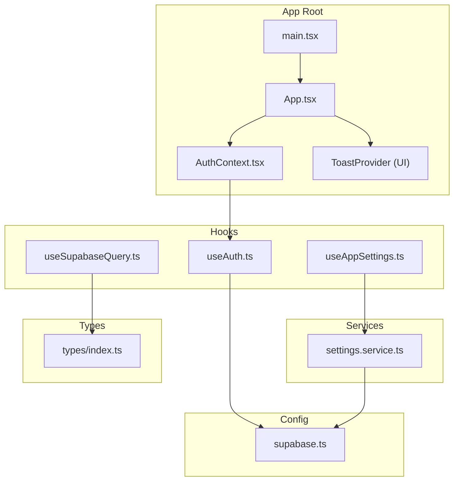
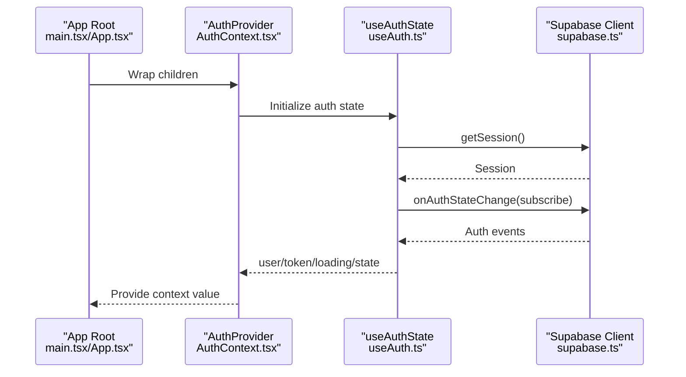
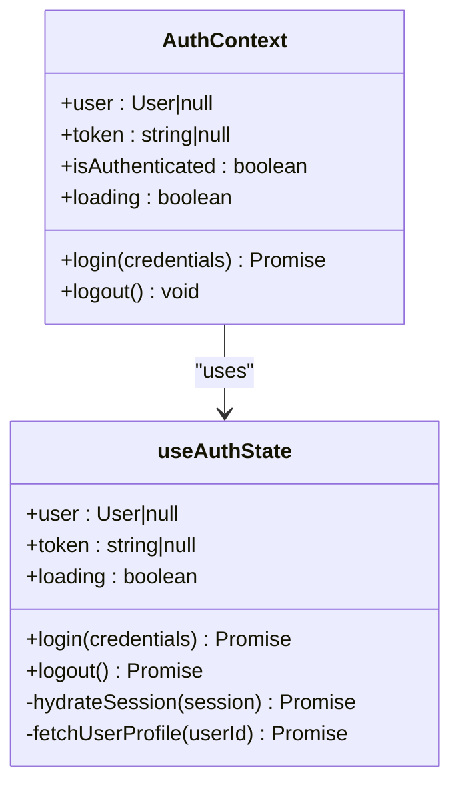
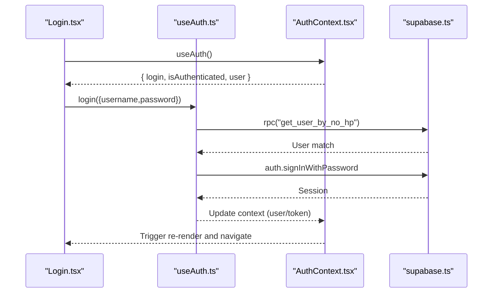
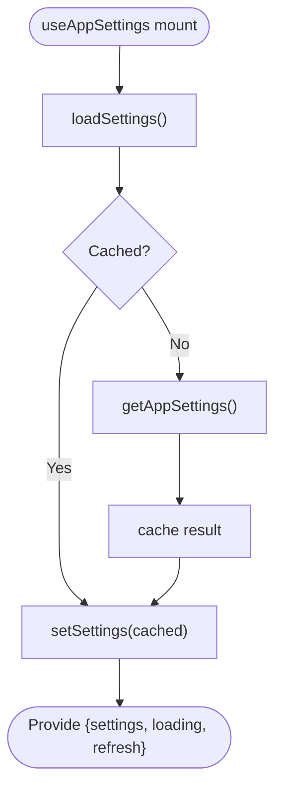
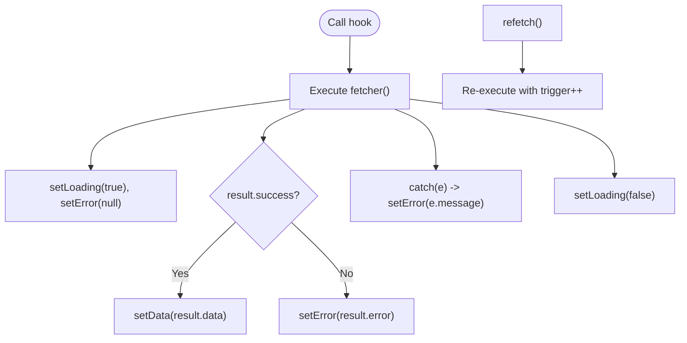
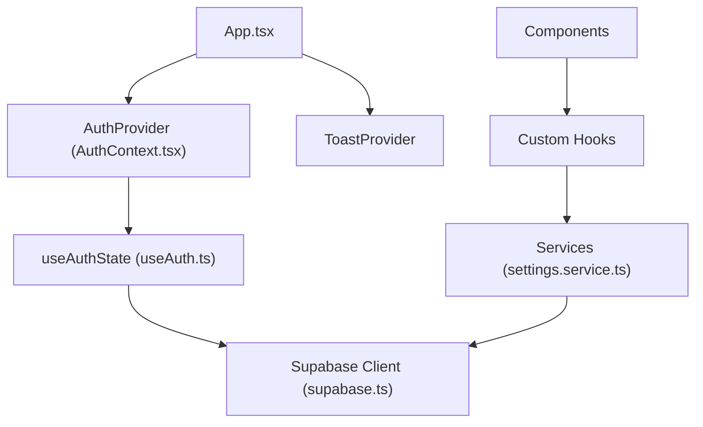
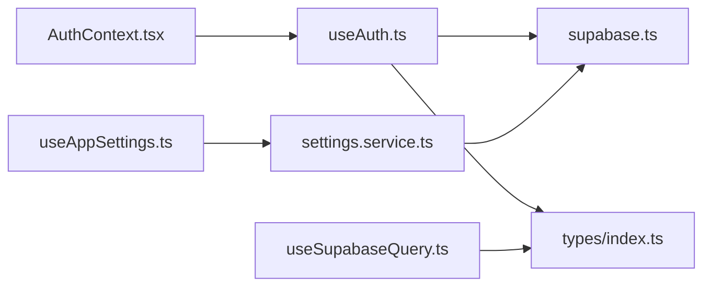

# State Management

<cite>
**Referenced Files in This Document**
- [AuthContext.tsx](file://src/context/AuthContext.tsx)
- [useAuth.ts](file://src/hooks/useAuth.ts)
- [useAppSettings.ts](file://src/hooks/useAppSettings.ts)
- [useSupabaseQuery.ts](file://src/hooks/useSupabaseQuery.ts)
- [supabase.ts](file://src/config/supabase.ts)
- [index.ts](file://src/types/index.ts)
- [settings.service.ts](file://src/services/settings.service.ts)
- [App.tsx](file://src/App.tsx)
- [main.tsx](file://src/main.tsx)
- [Login.tsx](file://src/components/Login.tsx)
- [ProtectedRoute.tsx](file://src/components/ProtectedRoute.tsx)
- [HomeTab.tsx](file://src/components/pwa/HomeTab.tsx)
- [AttendancePage.tsx](file://src/components/admin/AttendancePage.tsx)
</cite>

## Table of Contents
1. [Introduction](#introduction)
2. [Project Structure](#project-structure)
3. [Core Components](#core-components)
4. [Architecture Overview](#architecture-overview)
5. [Detailed Component Analysis](#detailed-component-analysis)
6. [Dependency Analysis](#dependency-analysis)
7. [Performance Considerations](#performance-considerations)
8. [Troubleshooting Guide](#troubleshooting-guide)
9. [Conclusion](#conclusion)

## Introduction
This document explains the state management patterns used in AbsensiOnline, focusing on React Context, custom hooks, and data flow. It covers:
- Authentication state via AuthContext and useAuth
- Application configuration via useAppSettings
- Generic Supabase query pattern via useSupabaseQuery
- Provider composition and hook composition
- State consumption in components
- Error handling and performance optimizations

## Project Structure
AbsensiOnline organizes state management around:
- Providers at the app root (Auth and UI providers)
- Contexts and custom hooks for domain-specific state
- Typed service abstractions and Supabase client configuration

**Diagram sources**
- [main.tsx:1-15](file://src/main.tsx#L1-L15)
- [App.tsx:1-58](file://src/App.tsx#L1-L58)
- [AuthContext.tsx:1-43](file://src/context/AuthContext.tsx#L1-L43)
- [useAuth.ts:1-115](file://src/hooks/useAuth.ts#L1-L115)
- [useAppSettings.ts:1-45](file://src/hooks/useAppSettings.ts#L1-L45)
- [useSupabaseQuery.ts:1-48](file://src/hooks/useSupabaseQuery.ts#L1-L48)
- [settings.service.ts:1-34](file://src/services/settings.service.ts#L1-L34)
- [supabase.ts:1-7](file://src/config/supabase.ts#L1-L7)
- [index.ts:1-182](file://src/types/index.ts#L1-L182)

**Section sources**
- [main.tsx:1-15](file://src/main.tsx#L1-L15)
- [App.tsx:1-58](file://src/App.tsx#L1-L58)

## Core Components
- AuthContext and useAuth: Centralized authentication state, login/logout, and hydration of user/session from Supabase.
- useAppSettings: Application configuration with caching and refresh capability.
- useSupabaseQuery: Generic data-fetching hook with cancellation, loading/error states, and refetch.

**Section sources**
- [AuthContext.tsx:1-43](file://src/context/AuthContext.tsx#L1-L43)
- [useAuth.ts:1-115](file://src/hooks/useAuth.ts#L1-L115)
- [useAppSettings.ts:1-45](file://src/hooks/useAppSettings.ts#L1-L45)
- [useSupabaseQuery.ts:1-48](file://src/hooks/useSupabaseQuery.ts#L1-L48)

## Architecture Overview
The state architecture composes providers at the root and exposes typed hooks to components. AuthContext wraps the app tree and exposes a normalized auth surface. Components consume auth, settings, and generic query hooks to render UI and orchestrate operations.

**Diagram sources**
- [main.tsx:1-15](file://src/main.tsx#L1-L15)
- [App.tsx:1-58](file://src/App.tsx#L1-L58)
- [AuthContext.tsx:18-36](file://src/context/AuthContext.tsx#L18-L36)
- [useAuth.ts:29-56](file://src/hooks/useAuth.ts#L29-L56)
- [supabase.ts:1-7](file://src/config/supabase.ts#L1-L7)

## Detailed Component Analysis

### AuthContext and useAuth
AuthContext provides a normalized auth surface and AuthProvider composes useAuthState. useAuthState manages:
- Hydration of session and user profile
- Real-time auth state subscriptions
- Login flow with credential-based lookup and Supabase sign-in
- Logout and cleanup

Key behaviors:
- Initial session hydration and ongoing subscription via Supabase auth hooks
- Login resolves a user by phone number via RPC, constructs an email, and signs in
- Returns computed isAuthenticated flag and loading state
- Exposes login and logout functions

**Diagram sources**
- [AuthContext.tsx:5-42](file://src/context/AuthContext.tsx#L5-L42)
- [useAuth.ts:29-114](file://src/hooks/useAuth.ts#L29-L114)

**Section sources**
- [AuthContext.tsx:1-43](file://src/context/AuthContext.tsx#L1-L43)
- [useAuth.ts:16-114](file://src/hooks/useAuth.ts#L16-L114)

### useAuth Consumption Patterns
Components consume auth via useAuth:
- Login form reads credentials, calls login, and navigates on success
- Protected routes guard navigation based on isAuthenticated and user role
- Worker PWA home tab consumes currentUser and settings for UX

**Diagram sources**
- [Login.tsx:6-33](file://src/components/Login.tsx#L6-L33)
- [useAuth.ts:58-96](file://src/hooks/useAuth.ts#L58-L96)
- [AuthContext.tsx:38-42](file://src/context/AuthContext.tsx#L38-L42)
- [supabase.ts:1-7](file://src/config/supabase.ts#L1-L7)

**Section sources**
- [Login.tsx:1-119](file://src/components/Login.tsx#L1-L119)
- [ProtectedRoute.tsx:9-31](file://src/components/ProtectedRoute.tsx#L9-L31)
- [HomeTab.tsx:37-41](file://src/components/pwa/HomeTab.tsx#L37-L41)

### useAppSettings
useAppSettings encapsulates application configuration:
- Loads settings via settings.service.ts
- Implements a cache with invalidation and refresh
- Provides loading state and refresh function

**Diagram sources**
- [useAppSettings.ts:9-44](file://src/hooks/useAppSettings.ts#L9-L44)
- [settings.service.ts:5-14](file://src/services/settings.service.ts#L5-L14)

**Section sources**
- [useAppSettings.ts:1-45](file://src/hooks/useAppSettings.ts#L1-L45)
- [settings.service.ts:1-34](file://src/services/settings.service.ts#L1-L34)

### useSupabaseQuery
useSupabaseQuery offers a reusable pattern for data fetching:
- Accepts a fetcher function and optional dependencies
- Manages loading/error/data/refetch
- Cancels in-flight requests on unmount to prevent state updates after disposal

**Diagram sources**
- [useSupabaseQuery.ts:11-47](file://src/hooks/useSupabaseQuery.ts#L11-L47)

**Section sources**
- [useSupabaseQuery.ts:1-48](file://src/hooks/useSupabaseQuery.ts#L1-L48)

### Provider Composition and Hook Composition
- App root composes providers: AuthProvider, ToastProvider, and routing
- AuthProvider delegates to useAuthState and exposes a stable context value
- Components compose hooks: useAuth for auth, useAppSettings for settings, and useSupabaseQuery for data

**Diagram sources**
- [App.tsx:20-54](file://src/App.tsx#L20-L54)
- [AuthContext.tsx:18-36](file://src/context/AuthContext.tsx#L18-L36)
- [useAuth.ts:29-56](file://src/hooks/useAuth.ts#L29-L56)
- [supabase.ts:1-7](file://src/config/supabase.ts#L1-L7)
- [settings.service.ts:5-14](file://src/services/settings.service.ts#L5-L14)

**Section sources**
- [App.tsx:1-58](file://src/App.tsx#L1-L58)
- [AuthContext.tsx:18-36](file://src/context/AuthContext.tsx#L18-L36)

## Dependency Analysis
- AuthContext depends on useAuthState and exports a stable shape for consumers
- useAuthState depends on Supabase client and types
- useAppSettings depends on settings.service and types
- useSupabaseQuery depends on types and is framework-agnostic for data fetching

**Diagram sources**
- [AuthContext.tsx:1-43](file://src/context/AuthContext.tsx#L1-L43)
- [useAuth.ts:1-115](file://src/hooks/useAuth.ts#L1-L115)
- [useAppSettings.ts:1-45](file://src/hooks/useAppSettings.ts#L1-L45)
- [useSupabaseQuery.ts:1-48](file://src/hooks/useSupabaseQuery.ts#L1-L48)
- [settings.service.ts:1-34](file://src/services/settings.service.ts#L1-L34)
- [supabase.ts:1-7](file://src/config/supabase.ts#L1-L7)
- [index.ts:131-182](file://src/types/index.ts#L131-L182)

**Section sources**
- [index.ts:131-182](file://src/types/index.ts#L131-L182)

## Performance Considerations
- useAuthState
  - Subscribes to Supabase auth state changes; ensure minimal re-renders by keeping context value stable and avoiding unnecessary renders in child components.
  - Hydration occurs once on mount; avoid redundant queries.
- useAppSettings
  - Uses a cache with promise de-duplication to prevent repeated network calls.
  - Invalidate cache when settings change externally to keep UI in sync.
- useSupabaseQuery
  - Uses a cancellation flag to avoid state updates after unmount.
  - Memoize fetcher and dependencies to reduce refetch frequency.
- General
  - Prefer shallow context values and memoized callbacks to minimize re-renders.
  - Defer heavy computations to effects and memoization.

[No sources needed since this section provides general guidance]

## Troubleshooting Guide
- Authentication
  - Symptom: Stuck on loading spinner
    - Cause: Auth state hydration not completing
    - Action: Verify Supabase client env vars and network connectivity
  - Symptom: Login fails with credential errors
    - Cause: RPC lookup failure or wrong credentials
    - Action: Inspect RPC result and error messages returned by login
- Settings
  - Symptom: Settings not applied
    - Cause: Cache not invalidated after update
    - Action: Call refresh/invalidateAppSettingsCache after mutation
- Queries
  - Symptom: Out-of-order updates or stale data
    - Cause: Missing cancellation or incorrect dependencies
    - Action: Ensure refetch triggers and dependencies are correct; cancel in cleanup

**Section sources**
- [useAuth.ts:58-96](file://src/hooks/useAuth.ts#L58-L96)
- [useAppSettings.ts:20-35](file://src/hooks/useAppSettings.ts#L20-L35)
- [useSupabaseQuery.ts:22-44](file://src/hooks/useSupabaseQuery.ts#L22-L44)

## Conclusion
AbsensiOnline’s state management centers on:
- A stable AuthContext powered by a focused useAuthState hook
- A configurable app settings hook with caching and refresh
- A reusable data-fetching hook with cancellation semantics
Together, these patterns deliver predictable, testable, and maintainable state flows across the application.