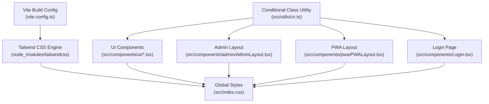
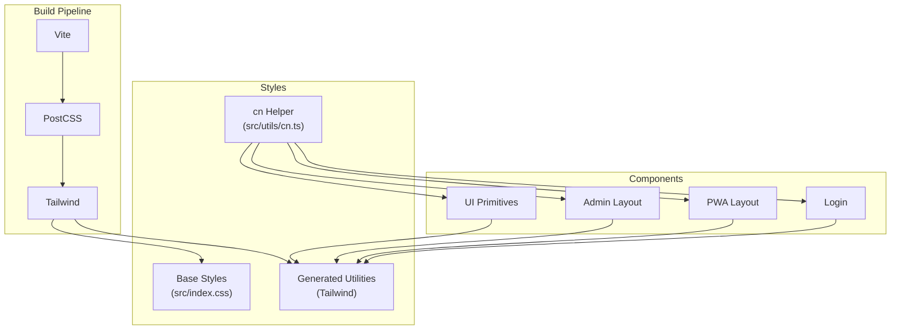
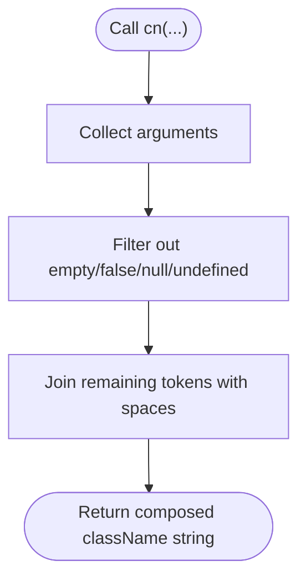
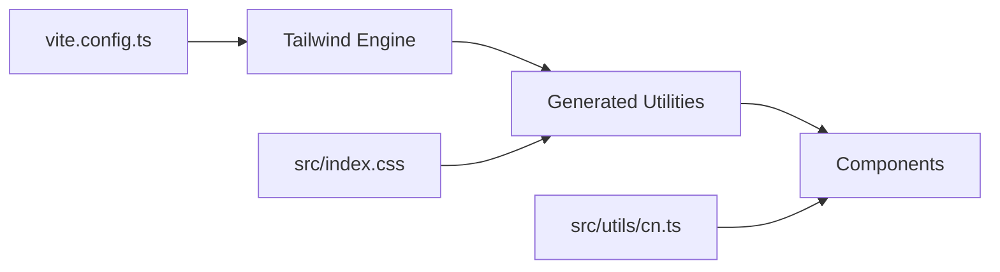

# Styling and Theming

<cite>
**Referenced Files in This Document**
- [DESIGN.md](file://DESIGN.md)
- [vite.config.ts](file://vite.config.ts)
- [src/index.css](file://src/index.css)
- [src/utils/cn.ts](file://src/utils/cn.ts)
- [src/components/ui/Badge.tsx](file://src/components/ui/Badge.tsx)
- [src/components/ui/Modal.tsx](file://src/components/ui/Modal.tsx)
- [src/components/ui/Toast.tsx](file://src/components/ui/Toast.tsx)
- [src/components/ui/Toggle.tsx](file://src/components/ui/Toggle.tsx)
- [src/components/admin/AdminLayout.tsx](file://src/components/admin/AdminLayout.tsx)
- [src/components/pwa/PWALayout.tsx](file://src/components/pwa/PWALayout.tsx)
- [src/components/Login.tsx](file://src/components/Login.tsx)
- [src/main.tsx](file://src/main.tsx)
</cite>

## Table of Contents
1. [Introduction](#introduction)
2. [Project Structure](#project-structure)
3. [Core Components](#core-components)
4. [Architecture Overview](#architecture-overview)
5. [Detailed Component Analysis](#detailed-component-analysis)
6. [Dependency Analysis](#dependency-analysis)
7. [Performance Considerations](#performance-considerations)
8. [Troubleshooting Guide](#troubleshooting-guide)
9. [Conclusion](#conclusion)

## Introduction
This document describes the styling and theming approach used in AbsensiOnline. It focuses on the Tailwind CSS implementation, utility class patterns, component styling strategies, and the cn utility function for conditional class names. It also outlines the CSS architecture, color schemes, typography systems, responsive design patterns, accessibility considerations, and performance optimization for CSS delivery.

## Project Structure
The styling system centers around Tailwind CSS configured via Vite and applied across React components. Global styles are defined in a single stylesheet, while component-level styling leverages Tailwind utilities and a helper function for conditional class composition.

**Diagram sources**
- [vite.config.ts](file://vite.config.ts)
- [src/index.css](file://src/index.css)
- [src/utils/cn.ts](file://src/utils/cn.ts)
- [src/components/ui/Badge.tsx](file://src/components/ui/Badge.tsx)
- [src/components/admin/AdminLayout.tsx](file://src/components/admin/AdminLayout.tsx)
- [src/components/pwa/PWALayout.tsx](file://src/components/pwa/PWALayout.tsx)
- [src/components/Login.tsx](file://src/components/Login.tsx)

**Section sources**
- [vite.config.ts](file://vite.config.ts)
- [src/index.css](file://src/index.css)

## Core Components
- Tailwind CSS engine integrated through Vite.
- Single global stylesheet for base styles and Tailwind directives.
- cn utility for composing conditional Tailwind classes in components.
- UI primitives (Badge, Modal, Toast, Toggle) styled with Tailwind utilities.
- Layout components (AdminLayout, PWALayout) applying consistent spacing, colors, and responsive patterns.
- Login page leveraging shared utilities and layout classes.

**Section sources**
- [src/utils/cn.ts](file://src/utils/cn.ts)
- [src/components/ui/Badge.tsx](file://src/components/ui/Badge.tsx)
- [src/components/ui/Modal.tsx](file://src/components/ui/Modal.tsx)
- [src/components/ui/Toast.tsx](file://src/components/ui/Toast.tsx)
- [src/components/ui/Toggle.tsx](file://src/components/ui/Toggle.tsx)
- [src/components/admin/AdminLayout.tsx](file://src/components/admin/AdminLayout.tsx)
- [src/components/pwa/PWALayout.tsx](file://src/components/pwa/PWALayout.tsx)
- [src/components/Login.tsx](file://src/components/Login.tsx)

## Architecture Overview
The styling architecture follows a layered approach:
- Build pipeline: Vite compiles TypeScript and CSS, invoking Tailwind for utility generation.
- Base layer: Global CSS defines base styles, preflight resets, and Tailwind directives.
- Composition layer: cn composes Tailwind classes conditionally per component state.
- Presentation layer: Components apply consistent utilities for colors, spacing, typography, and responsiveness.

**Diagram sources**
- [vite.config.ts](file://vite.config.ts)
- [src/index.css](file://src/index.css)
- [src/utils/cn.ts](file://src/utils/cn.ts)
- [src/components/ui/Badge.tsx](file://src/components/ui/Badge.tsx)
- [src/components/admin/AdminLayout.tsx](file://src/components/admin/AdminLayout.tsx)
- [src/components/pwa/PWALayout.tsx](file://src/components/pwa/PWALayout.tsx)
- [src/components/Login.tsx](file://src/components/Login.tsx)

## Detailed Component Analysis

### Tailwind CSS Integration and Global Styles
- Tailwind is configured via Vite and generates utilities consumed by components.
- Global CSS sets base styles and ensures Tailwind’s preflight and utilities are applied consistently.

Implementation references:
- Tailwind integration and build configuration: [vite.config.ts](file://vite.config.ts)
- Global stylesheet: [src/index.css](file://src/index.css)

**Section sources**
- [vite.config.ts](file://vite.config.ts)
- [src/index.css](file://src/index.css)

### cn Utility Function for Conditional Classes
The cn utility composes Tailwind classes conditionally, enabling concise and readable class logic across components.

Key characteristics:
- Accepts multiple arguments and filters out falsy values.
- Returns a single string of concatenated class names.
- Used extensively in UI components to adapt styles based on props or state.

Usage patterns:
- Conditional variants (e.g., size, color, disabled).
- State-driven overrides (e.g., hover, focus, active).
- Composition of base, variant, and state classes.

Implementation reference:
- [src/utils/cn.ts](file://src/utils/cn.ts)

**Diagram sources**
- [src/utils/cn.ts](file://src/utils/cn.ts)

**Section sources**
- [src/utils/cn.ts](file://src/utils/cn.ts)

### UI Component Styling Patterns
Components use Tailwind utilities for layout, colors, spacing, typography, and responsiveness. They rely on cn to compose base, variant, and state classes.

Examples:
- Badge: [src/components/ui/Badge.tsx](file://src/components/ui/Badge.tsx)
- Modal: [src/components/ui/Modal.tsx](file://src/components/ui/Modal.tsx)
- Toast: [src/components/ui/Toast.tsx](file://src/components/ui/Toast.tsx)
- Toggle: [src/components/ui/Toggle.tsx](file://src/components/ui/Toggle.tsx)

Common patterns:
- Base classes define shape, padding, border, and default color.
- Variant classes override defaults for size, color, or style.
- State classes adjust appearance on hover, focus, or disabled.
- Responsive utilities adapt layout and spacing across breakpoints.

**Section sources**
- [src/components/ui/Badge.tsx](file://src/components/ui/Badge.tsx)
- [src/components/ui/Modal.tsx](file://src/components/ui/Modal.tsx)
- [src/components/ui/Toast.tsx](file://src/components/ui/Toast.tsx)
- [src/components/ui/Toggle.tsx](file://src/components/ui/Toggle.tsx)

### Layout Components and Consistent Theming
Layout components establish consistent spacing, color usage, and responsive behavior across pages.

- AdminLayout: [src/components/admin/AdminLayout.tsx]
- PWALayout: [src/components/pwa/PWALayout.tsx]

Typical approaches:
- Header, sidebar, and content area spacing using margin/padding utilities.
- Color tokens for backgrounds, borders, and accents aligned with the global palette.
- Responsive grid and flex utilities for adaptive layouts.

**Section sources**
- [src/components/admin/AdminLayout.tsx](file://src/components/admin/AdminLayout.tsx)
- [src/components/pwa/PWALayout.tsx](file://src/components/pwa/PWALayout.tsx)

### Login Page Styling
The Login page applies shared utilities for form controls, spacing, and responsive layout.

Reference:
- [src/components/Login.tsx](file://src/components/Login.tsx)

**Section sources**
- [src/components/Login.tsx](file://src/components/Login.tsx)

### Design System and Theming Foundations
While the repository does not define a separate theme configuration file, the design system emerges from:
- Global color palette and semantic tokens defined in the global stylesheet.
- Typography scale and font families set at the base layer.
- Spacing scale derived from Tailwind’s default spacing units.

References:
- Global stylesheet: [src/index.css](file://src/index.css)
- Design overview: [DESIGN.md](file://DESIGN.md)

**Section sources**
- [src/index.css](file://src/index.css)
- [DESIGN.md](file://DESIGN.md)

## Dependency Analysis
The styling stack depends on Tailwind utilities generated during the build process and consumed by components through cn and direct class attributes.

**Diagram sources**
- [vite.config.ts](file://vite.config.ts)
- [src/index.css](file://src/index.css)
- [src/utils/cn.ts](file://src/utils/cn.ts)
- [src/components/ui/Badge.tsx](file://src/components/ui/Badge.tsx)

**Section sources**
- [vite.config.ts](file://vite.config.ts)
- [src/index.css](file://src/index.css)
- [src/utils/cn.ts](file://src/utils/cn.ts)

## Performance Considerations
- Tree shaking and purging: Configure Tailwind to purge unused CSS in production builds to minimize payload size.
- Critical CSS: Inline essential styles for above-the-fold content to reduce render-blocking.
- Minification: Ensure CSS minification is enabled via Vite plugins.
- Bundle splitting: Keep styles scoped to components to avoid global bloat.
- Utility reuse: Prefer shared cn compositions to reduce duplication and maintain smaller bundles.

[No sources needed since this section provides general guidance]

## Troubleshooting Guide
- Utilities not applied:
  - Verify Tailwind directives are present in the global stylesheet.
  - Confirm Vite build includes Tailwind processing.
  - Check for conflicting inline styles overriding utilities.
- Conditional classes not working:
  - Ensure cn receives proper arguments and no unexpected falsy values.
  - Validate class names match Tailwind’s naming conventions.
- Theme inconsistencies:
  - Centralize color and spacing tokens in the global stylesheet.
  - Reuse cn compositions across components for uniformity.

**Section sources**
- [src/index.css](file://src/index.css)
- [src/utils/cn.ts](file://src/utils/cn.ts)

## Conclusion
AbsensiOnline employs a pragmatic Tailwind-based styling architecture with a single global stylesheet and a cn utility for composing conditional classes. UI components and layouts adhere to consistent patterns for colors, typography, spacing, and responsiveness. By centralizing design tokens, leveraging cn for composability, and optimizing the build pipeline, the project maintains design consistency and efficient CSS delivery.

[No sources needed since this section summarizes without analyzing specific files]