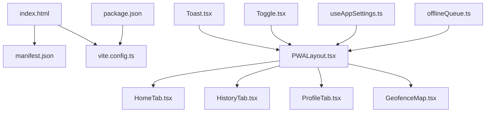
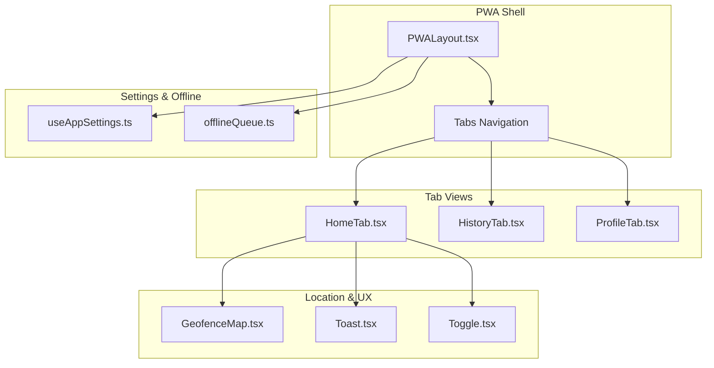
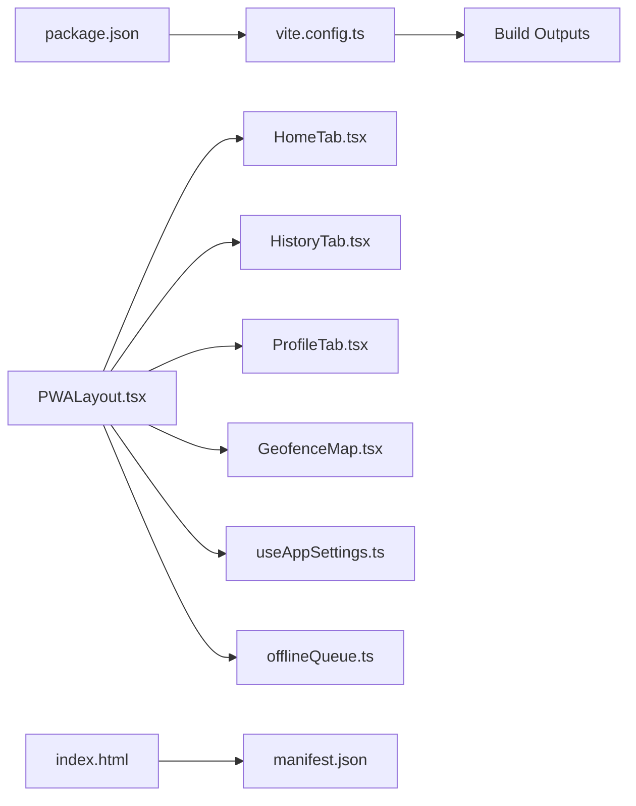

# Mobile Optimization

<cite>
**Referenced Files in This Document**
- [index.html](file://index.html)
- [manifest.json](file://public/manifest.json)
- [vite.config.ts](file://vite.config.ts)
- [package.json](file://package.json)
- [PWALayout.tsx](file://src/components/pwa/PWALayout.tsx)
- [HomeTab.tsx](file://src/components/pwa/HomeTab.tsx)
- [HistoryTab.tsx](file://src/components/pwa/HistoryTab.tsx)
- [ProfileTab.tsx](file://src/components/pwa/ProfileTab.tsx)
- [GeofenceMap.tsx](file://src/components/pwa/GeofenceMap.tsx)
- [Toast.tsx](file://src/components/ui/Toast.tsx)
- [Toggle.tsx](file://src/components/ui/Toggle.tsx)
- [useAppSettings.ts](file://src/hooks/useAppSettings.ts)
- [offlineQueue.ts](file://src/utils/offlineQueue.ts)
- [DESIGN.md](file://DESIGN.md)
</cite>

## Table of Contents
1. [Introduction](#introduction)
2. [Project Structure](#project-structure)
3. [Core Components](#core-components)
4. [Architecture Overview](#architecture-overview)
5. [Detailed Component Analysis](#detailed-component-analysis)
6. [Dependency Analysis](#dependency-analysis)
7. [Performance Considerations](#performance-considerations)
8. [Troubleshooting Guide](#troubleshooting-guide)
9. [Conclusion](#conclusion)

## Introduction
This document provides comprehensive guidance for optimizing AbsensiOnline’s Progressive Web App (PWA) for mobile devices. It focuses on mobile-first design, responsive layouts, touch-friendly components, tab-based navigation, gesture handling, viewport configuration, performance optimizations, and platform-specific features such as geolocation accuracy, device orientation, and battery optimization. Testing strategies for diverse mobile platforms and screen sizes are also included.

## Project Structure
AbsensiOnline’s PWA implementation centers around a dedicated PWA component set under src/components/pwa, with supporting UI primitives, hooks, and utilities. The build and manifest configurations define installability and runtime behavior for mobile environments.

**Diagram sources**
- [index.html](file://index.html)
- [manifest.json](file://public/manifest.json)
- [vite.config.ts](file://vite.config.ts)
- [package.json](file://package.json)
- [PWALayout.tsx](file://src/components/pwa/PWALayout.tsx)
- [HomeTab.tsx](file://src/components/pwa/HomeTab.tsx)
- [HistoryTab.tsx](file://src/components/pwa/HistoryTab.tsx)
- [ProfileTab.tsx](file://src/components/pwa/ProfileTab.tsx)
- [GeofenceMap.tsx](file://src/components/pwa/GeofenceMap.tsx)
- [Toast.tsx](file://src/components/ui/Toast.tsx)
- [Toggle.tsx](file://src/components/ui/Toggle.tsx)
- [useAppSettings.ts](file://src/hooks/useAppSettings.ts)
- [offlineQueue.ts](file://src/utils/offlineQueue.ts)

**Section sources**
- [index.html](file://index.html)
- [manifest.json](file://public/manifest.json)
- [vite.config.ts](file://vite.config.ts)
- [package.json](file://package.json)
- [PWALayout.tsx](file://src/components/pwa/PWALayout.tsx)

## Core Components
- PWA Layout: Orchestrates tab-based navigation and integrates shared UI components and utilities.
- Tab Components: HomeTab, HistoryTab, and ProfileTab encapsulate mobile-centric views and interactions.
- GeofenceMap: Provides location-aware functionality optimized for mobile devices.
- UI Primitives: Touch-friendly controls like Toggle and Toast support consistent UX across devices.
- Hooks and Utilities: useAppSettings centralizes app-wide settings; offlineQueue supports reliable offline operation.

**Section sources**
- [PWALayout.tsx](file://src/components/pwa/PWALayout.tsx)
- [HomeTab.tsx](file://src/components/pwa/HomeTab.tsx)
- [HistoryTab.tsx](file://src/components/pwa/HistoryTab.tsx)
- [ProfileTab.tsx](file://src/components/pwa/ProfileTab.tsx)
- [GeofenceMap.tsx](file://src/components/pwa/GeofenceMap.tsx)
- [Toast.tsx](file://src/components/ui/Toast.tsx)
- [Toggle.tsx](file://src/components/ui/Toggle.tsx)
- [useAppSettings.ts](file://src/hooks/useAppSettings.ts)
- [offlineQueue.ts](file://src/utils/offlineQueue.ts)

## Architecture Overview
The PWA architecture emphasizes a single-page, tab-driven interface optimized for mobile. The layout coordinates navigation, while individual tabs handle domain-specific content. Shared utilities and hooks ensure consistent behavior across screens.

**Diagram sources**
- [PWALayout.tsx](file://src/components/pwa/PWALayout.tsx)
- [HomeTab.tsx](file://src/components/pwa/HomeTab.tsx)
- [HistoryTab.tsx](file://src/components/pwa/HistoryTab.tsx)
- [ProfileTab.tsx](file://src/components/pwa/ProfileTab.tsx)
- [GeofenceMap.tsx](file://src/components/pwa/GeofenceMap.tsx)
- [Toast.tsx](file://src/components/ui/Toast.tsx)
- [Toggle.tsx](file://src/components/ui/Toggle.tsx)
- [useAppSettings.ts](file://src/hooks/useAppSettings.ts)
- [offlineQueue.ts](file://src/utils/offlineQueue.ts)

## Detailed Component Analysis

### PWALayout: Mobile-First Container
Responsibilities:
- Hosts tab-based navigation optimized for mobile swiping and tap targets.
- Integrates global UI helpers (toast notifications) and settings.
- Manages viewport meta configuration and PWA lifecycle hooks.

Mobile considerations:
- Ensures adequate touch target sizing and spacing for finger-friendly interactions.
- Supports safe area insets and orientation changes for modern mobile devices.
- Coordinates with service worker for caching and offline readiness.

**Section sources**
- [PWALayout.tsx](file://src/components/pwa/PWALayout.tsx)

### HomeTab: Location-Aware Mobile Hub
Responsibilities:
- Presents primary actions and location-sensitive features.
- Integrates GeofenceMap for proximity-based attendance checks.
- Uses Toast for feedback and Toggle for quick settings adjustments.

Touch and gesture optimizations:
- Large, tappable controls with appropriate haptic feedback cues.
- Swipe-to-refresh pattern for history lists and map updates.
- Orientation change handling to adapt map and form layouts.

**Section sources**
- [HomeTab.tsx](file://src/components/pwa/HomeTab.tsx)
- [GeofenceMap.tsx](file://src/components/pwa/GeofenceMap.tsx)
- [Toast.tsx](file://src/components/ui/Toast.tsx)
- [Toggle.tsx](file://src/components/ui/Toggle.tsx)

### HistoryTab: Scrollable Lists for Mobile
Responsibilities:
- Displays attendance records in a vertically scrollable list optimized for small screens.
- Implements virtualization or pagination strategies to maintain smooth scrolling on low-end devices.

Mobile considerations:
- Infinite scroll with pull-to-refresh fallback.
- Reduced image sizes and lazy-loading for thumbnails.
- Compact row layouts with truncated labels and icons.

**Section sources**
- [HistoryTab.tsx](file://src/components/pwa/HistoryTab.tsx)

### ProfileTab: Settings and Personal Info
Responsibilities:
- Shows user profile and settings tailored for mobile input fields and toggles.
- Integrates with useAppSettings for persistent preferences.

Mobile considerations:
- Auto-focus on first input field after navigation.
- Keyboard-friendly layouts with reduced cognitive load.
- Toggle switches sized for thumb-friendly activation.

**Section sources**
- [ProfileTab.tsx](file://src/components/pwa/ProfileTab.tsx)
- [useAppSettings.ts](file://src/hooks/useAppSettings.ts)

### GeofenceMap: Mobile Location Experience
Responsibilities:
- Renders a map optimized for mobile interactions (pinch-to-zoom, drag pan).
- Handles geolocation permissions and accuracy filtering for battery-conscious operation.

Mobile considerations:
- Aggregates location samples to reduce power consumption.
- Displays accuracy circles and retry prompts for degraded GPS.
- Adapts tile providers and cache policies for cellular networks.

**Section sources**
- [GeofenceMap.tsx](file://src/components/pwa/GeofenceMap.tsx)

### UI Primitives: Touch-Friendly Controls
- Toast: Lightweight, non-blocking notifications with auto-dismiss suitable for mobile.
- Toggle: Large switch controls designed for single-hand operation.

**Section sources**
- [Toast.tsx](file://src/components/ui/Toast.tsx)
- [Toggle.tsx](file://src/components/ui/Toggle.tsx)

### Settings and Offline Utilities
- useAppSettings: Centralizes app preferences and ensures persistence across sessions.
- offlineQueue: Queues operations during offline periods and replays upon connectivity.

**Section sources**
- [useAppSettings.ts](file://src/hooks/useAppSettings.ts)
- [offlineQueue.ts](file://src/utils/offlineQueue.ts)

## Dependency Analysis
The PWA relies on build-time configuration and runtime dependencies to deliver a fast, installable experience on mobile devices.

**Diagram sources**
- [vite.config.ts](file://vite.config.ts)
- [package.json](file://package.json)
- [PWALayout.tsx](file://src/components/pwa/PWALayout.tsx)
- [HomeTab.tsx](file://src/components/pwa/HomeTab.tsx)
- [HistoryTab.tsx](file://src/components/pwa/HistoryTab.tsx)
- [ProfileTab.tsx](file://src/components/pwa/ProfileTab.tsx)
- [GeofenceMap.tsx](file://src/components/pwa/GeofenceMap.tsx)
- [useAppSettings.ts](file://src/hooks/useAppSettings.ts)
- [offlineQueue.ts](file://src/utils/offlineQueue.ts)
- [index.html](file://index.html)
- [manifest.json](file://public/manifest.json)

**Section sources**
- [vite.config.ts](file://vite.config.ts)
- [package.json](file://package.json)
- [index.html](file://index.html)
- [manifest.json](file://public/manifest.json)

## Performance Considerations
Bundle Size Reduction:
- Code splitting per tab to defer heavy map initialization until needed.
- Tree-shaking enabled via module bundler configuration.
- Minification and compression in production builds.

Loading Strategies:
- Lazy-load map libraries and third-party widgets.
- Preload critical fonts and essential assets; defer non-critical resources.
- Use service worker precaching for static assets and dynamic caching for API responses.

Mobile-Specific Optimizations:
- Reduce image sizes and use modern formats (WebP) with responsive breakpoints.
- Implement aggressive caching for frequently accessed data.
- Debounce or throttle input handlers to avoid layout thrashing on low-end devices.

Battery and Network Awareness:
- Throttle geolocation updates and aggregate samples.
- Detect network type and adjust data fetching frequency accordingly.
- Respect reduced activity modes and suspend non-essential tasks.

**Section sources**
- [vite.config.ts](file://vite.config.ts)
- [package.json](file://package.json)
- [PWALayout.tsx](file://src/components/pwa/PWALayout.tsx)
- [GeofenceMap.tsx](file://src/components/pwa/GeofenceMap.tsx)

## Troubleshooting Guide
Common Mobile Issues and Remedies:
- Viewport Problems: Verify viewport meta configuration in the HTML template and ensure safe area handling for notch devices.
- Touch Target Issues: Increase hit areas for interactive elements and avoid placing them too close to each other.
- Orientation Changes: Test layout adaptation and reflow stability across portrait and landscape modes.
- Geolocation Accuracy: Implement accuracy thresholds and provide user guidance when GPS is unavailable or inaccurate.
- Offline Reliability: Ensure offlineQueue persists operations and retries gracefully when connectivity returns.

Testing Checklist:
- Device coverage: iOS Safari, Chrome Android, Samsung Internet.
- Screen sizes: iPhone SE, iPhone Pro Max, Pixel 5, foldable devices.
- Network conditions: 2G/3G/4G, Wi-Fi, airplane mode.
- Battery saver and data saver modes.

**Section sources**
- [index.html](file://index.html)
- [PWALayout.tsx](file://src/components/pwa/PWALayout.tsx)
- [GeofenceMap.tsx](file://src/components/pwa/GeofenceMap.tsx)
- [offlineQueue.ts](file://src/utils/offlineQueue.ts)

## Conclusion
AbsensiOnline’s PWA is structured to prioritize mobile experiences through a tab-based shell, location-aware components, and robust offline capabilities. By focusing on responsive layouts, touch-friendly controls, efficient loading strategies, and careful handling of device sensors and power constraints, the application delivers a reliable and performant experience across diverse mobile platforms.