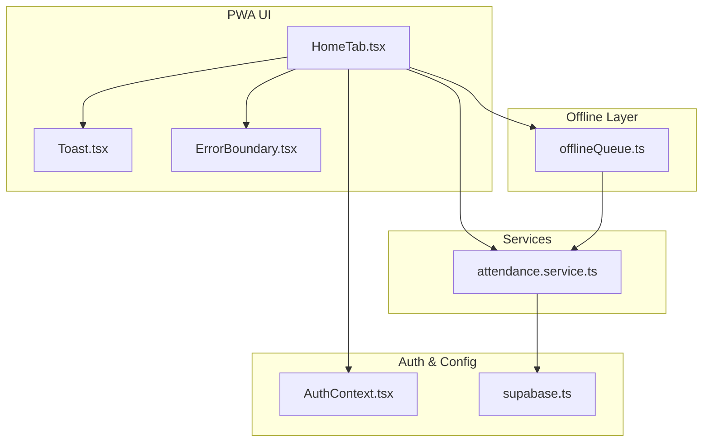
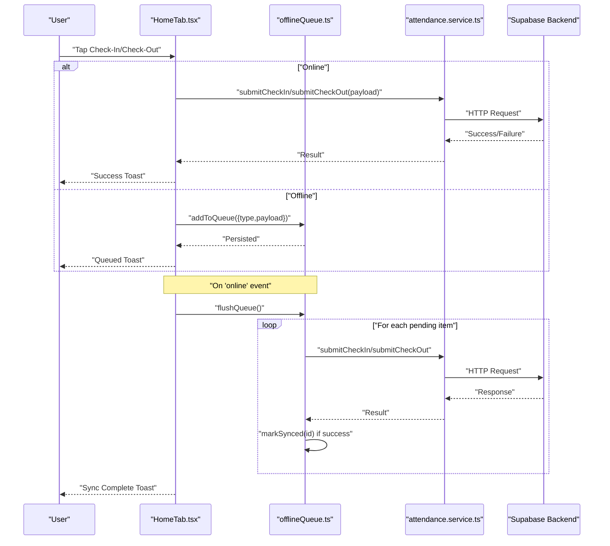
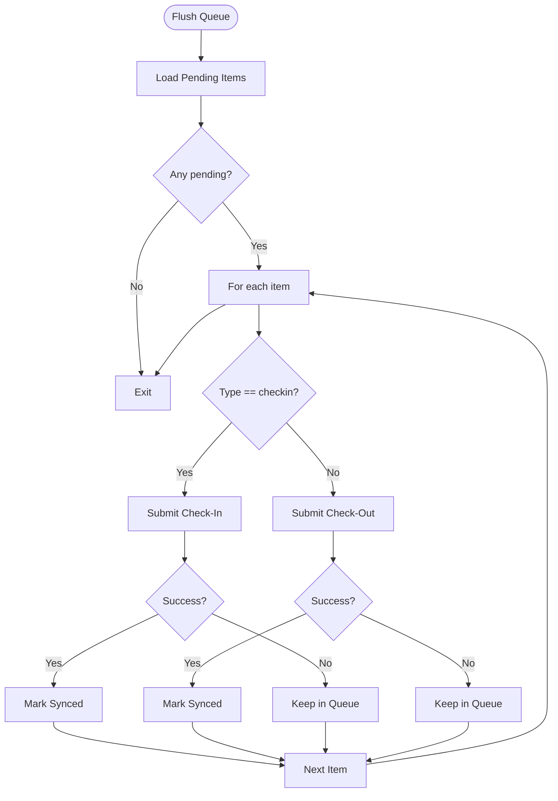
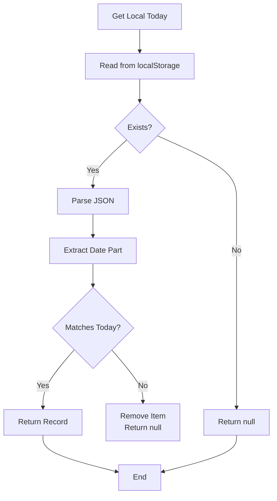
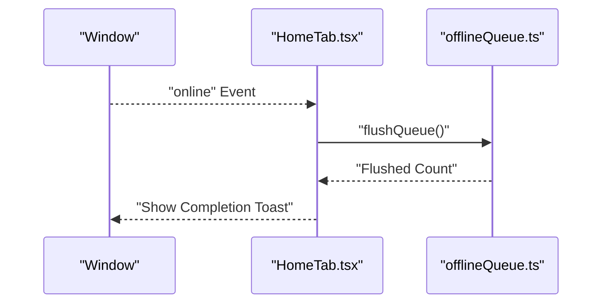
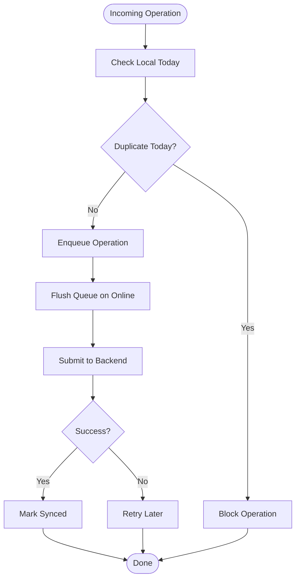
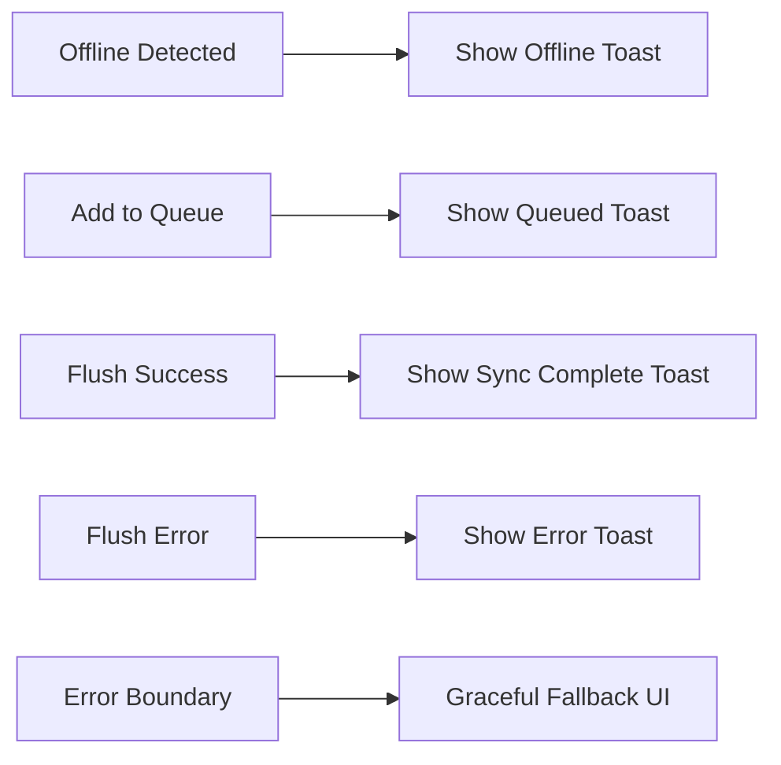
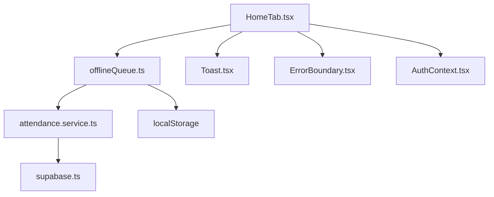

# Offline Functionality

<cite>
**Referenced Files in This Document**
- [offlineQueue.ts](file://src/utils/offlineQueue.ts)
- [DESIGN.md](file://DESIGN.md)
- [REMEDIATION_DESIGN.md](file://REMEDIATION_DESIGN.md)
- [ANALISIS_APLIKASI.md](file://ANALISIS_APLIKASI.md)
- [HomeTab.tsx](file://src/components/pwa/HomeTab.tsx)
- [Toast.tsx](file://src/components/ui/Toast.tsx)
- [ErrorBoundary.tsx](file://src/components/ErrorBoundary.tsx)
- [AuthContext.tsx](file://src/context/AuthContext.tsx)
- [supabase.ts](file://src/config/supabase.ts)
</cite>

## Table of Contents
1. [Introduction](#introduction)
2. [Project Structure](#project-structure)
3. [Core Components](#core-components)
4. [Architecture Overview](#architecture-overview)
5. [Detailed Component Analysis](#detailed-component-analysis)
6. [Dependency Analysis](#dependency-analysis)
7. [Performance Considerations](#performance-considerations)
8. [Troubleshooting Guide](#troubleshooting-guide)
9. [Conclusion](#conclusion)

## Introduction
This document explains the offline-first implementation for attendance operations in AbsensiOnline. It focuses on the offline queue system for check-in/check-out, synchronization strategies, conflict resolution, network failure handling, automatic retries, and user experience during offline scenarios. The solution prioritizes critical attendance workflows while maintaining data integrity and performance.

## Project Structure
The offline functionality centers around a lightweight queue stored in browser local storage and coordinated with attendance submission services. Key locations:
- Offline queue utilities: src/utils/offlineQueue.ts
- Design rationale and triggers: DESIGN.md
- Risk mitigation and payload typing: REMEDIATION_DESIGN.md
- Application-level integration points: src/components/pwa/HomeTab.tsx
- User feedback components: src/components/ui/Toast.tsx
- Global error handling: src/components/ErrorBoundary.tsx
- Authentication context: src/context/AuthContext.tsx
- Supabase client configuration: src/config/supabase.ts

**Diagram sources**
- [offlineQueue.ts:1-96](file://src/utils/offlineQueue.ts#L1-L96)
- [HomeTab.tsx](file://src/components/pwa/HomeTab.tsx)
- [Toast.tsx](file://src/components/ui/Toast.tsx)
- [ErrorBoundary.tsx](file://src/components/ErrorBoundary.tsx)
- [AuthContext.tsx](file://src/context/AuthContext.tsx)
- [supabase.ts](file://src/config/supabase.ts)

**Section sources**
- [offlineQueue.ts:1-96](file://src/utils/offlineQueue.ts#L1-L96)
- [DESIGN.md:270-345](file://DESIGN.md#L270-L345)
- [ANALISIS_APLIKASI.md:520-525](file://ANALISIS_APLIKASI.md#L520-L525)

## Core Components
- Offline Queue Manager: Provides queue persistence, enqueue, sync marking, and flushing logic using localStorage.
- Local Today Attendance: Tracks a single daily check-in record to prevent duplicate check-ins within the same day.
- Flush Triggers: Online event listeners to automatically synchronize queued operations when connectivity resumes.
- User Feedback: Toast notifications and error boundaries to communicate offline status and errors.

Key responsibilities:
- Enqueue check-in/check-out operations when offline.
- Persist queue items locally until successful server sync.
- Mark items as synced upon successful submission.
- Prevent duplicate check-ins within the same calendar day.
- Notify users of offline status and sync progress.

**Section sources**
- [offlineQueue.ts:20-42](file://src/utils/offlineQueue.ts#L20-L42)
- [offlineQueue.ts:44-64](file://src/utils/offlineQueue.ts#L44-L64)
- [offlineQueue.ts:66-96](file://src/utils/offlineQueue.ts#L66-L96)
- [DESIGN.md:270-345](file://DESIGN.md#L270-L345)

## Architecture Overview
The offline-first architecture ensures that check-in/check-out actions are immediately available regardless of network status. When offline, operations are enqueued locally. When online, the queue is flushed synchronously against the backend. The system maintains a single-today record to avoid accidental duplicates and uses typed payloads to reduce conflicts.

**Diagram sources**
- [offlineQueue.ts:53-96](file://src/utils/offlineQueue.ts#L53-L96)
- [HomeTab.tsx](file://src/components/pwa/HomeTab.tsx)
- [DESIGN.md:329-342](file://DESIGN.md#L329-L342)

## Detailed Component Analysis

### Offline Queue Manager
Implements queue persistence and lifecycle:
- Queue item shape: id, type (checkin/checkout), payload, timestamp, synced flag.
- Storage keys: queue and local-today records.
- Operations:
  - Retrieve pending queue items.
  - Add new items with random IDs and unsynced status.
  - Mark items as synced and prune them from storage.
  - Flush pending items sequentially, invoking service submissions and updating state.

**Diagram sources**
- [offlineQueue.ts:66-96](file://src/utils/offlineQueue.ts#L66-L96)

**Section sources**
- [offlineQueue.ts:3-18](file://src/utils/offlineQueue.ts#L3-L18)
- [offlineQueue.ts:11-18](file://src/utils/offlineQueue.ts#L11-L18)
- [offlineQueue.ts:44-64](file://src/utils/offlineQueue.ts#L44-L64)
- [offlineQueue.ts:66-96](file://src/utils/offlineQueue.ts#L66-L96)

### Local Today Attendance
Ensures a user cannot accidentally submit multiple check-ins on the same calendar day by storing a single-today record keyed by date. On date mismatch or parsing errors, the record is cleared.

**Diagram sources**
- [offlineQueue.ts:20-34](file://src/utils/offlineQueue.ts#L20-L34)

**Section sources**
- [offlineQueue.ts:20-34](file://src/utils/offlineQueue.ts#L20-L34)
- [offlineQueue.ts:36-42](file://src/utils/offlineQueue.ts#L36-L42)

### Flush Triggers and Network Awareness
The application listens for the browser’s online event to trigger queue flushing. This ensures minimal latency when connectivity resumes.

**Diagram sources**
- [DESIGN.md:329-342](file://DESIGN.md#L329-L342)
- [HomeTab.tsx](file://src/components/pwa/HomeTab.tsx)

**Section sources**
- [DESIGN.md:329-342](file://DESIGN.md#L329-L342)

### Conflict Resolution and Data Integrity
Mitigations implemented:
- Single-today record prevents duplicate check-ins within a day.
- Typed payloads and reuse of shared payload types reduce mismatches.
- Before-insert overrides and migration strategies address unique index conflicts and legacy duplicates.

**Diagram sources**
- [offlineQueue.ts:20-34](file://src/utils/offlineQueue.ts#L20-L34)
- [offlineQueue.ts:53-64](file://src/utils/offlineQueue.ts#L53-L64)
- [offlineQueue.ts:66-96](file://src/utils/offlineQueue.ts#L66-L96)
- [REMEDIATION_DESIGN.md:155-161](file://REMEDIATION_DESIGN.md#L155-L161)

**Section sources**
- [REMEDIATION_DESIGN.md:155-161](file://REMEDIATION_DESIGN.md#L155-L161)
- [offlineQueue.ts:20-34](file://src/utils/offlineQueue.ts#L20-L34)
- [offlineQueue.ts:53-64](file://src/utils/offlineQueue.ts#L53-L64)
- [offlineQueue.ts:66-96](file://src/utils/offlineQueue.ts#L66-L96)

### User Experience During Offline Scenarios
- Immediate feedback: Users see queued operations when offline.
- Status indicators: Toast notifications inform users about offline status and sync completion.
- Error handling: Centralized error boundary surfaces unexpected issues gracefully.

**Diagram sources**
- [Toast.tsx](file://src/components/ui/Toast.tsx)
- [ErrorBoundary.tsx](file://src/components/ErrorBoundary.tsx)
- [DESIGN.md:329-342](file://DESIGN.md#L329-L342)

**Section sources**
- [Toast.tsx](file://src/components/ui/Toast.tsx)
- [ErrorBoundary.tsx](file://src/components/ErrorBoundary.tsx)
- [DESIGN.md:329-342](file://DESIGN.md#L329-L342)

## Dependency Analysis
The offline queue depends on:
- Attendance service functions for actual submission.
- Browser APIs for online/offline events and localStorage.
- UI components for user feedback and error handling.
- Authentication context and Supabase configuration for request context.

**Diagram sources**
- [offlineQueue.ts:1-96](file://src/utils/offlineQueue.ts#L1-L96)
- [HomeTab.tsx](file://src/components/pwa/HomeTab.tsx)
- [Toast.tsx](file://src/components/ui/Toast.tsx)
- [ErrorBoundary.tsx](file://src/components/ErrorBoundary.tsx)
- [AuthContext.tsx](file://src/context/AuthContext.tsx)
- [supabase.ts](file://src/config/supabase.ts)

**Section sources**
- [offlineQueue.ts:1-96](file://src/utils/offlineQueue.ts#L1-L96)
- [HomeTab.tsx](file://src/components/pwa/HomeTab.tsx)
- [AuthContext.tsx](file://src/context/AuthContext.tsx)
- [supabase.ts](file://src/config/supabase.ts)

## Performance Considerations
- Queue size: Limit queue depth to avoid memory pressure; consider pruning older entries.
- Batch submission: While current implementation flushes sequentially, batching could improve throughput.
- Debounced flush: Coalesce multiple rapid operations into fewer flush attempts.
- Payload minimization: Store only essential fields to reduce serialization overhead.
- IndexedDB migration: For future enhancements, IndexedDB can replace localStorage for larger datasets and better reliability.

[No sources needed since this section provides general guidance]

## Troubleshooting Guide
Common issues and resolutions:
- Duplicate check-ins: Verify local-today record clearing and date parsing logic.
- Queue stuck: Ensure flush triggers fire on online events and that markSynced removes processed items.
- Type mismatches: Validate payload shapes align with shared types to prevent runtime errors.
- Legacy data conflicts: Apply migrations to resolve unique index failures and override before-insert behaviors.

**Section sources**
- [offlineQueue.ts:20-34](file://src/utils/offlineQueue.ts#L20-L34)
- [offlineQueue.ts:59-64](file://src/utils/offlineQueue.ts#L59-L64)
- [offlineQueue.ts:66-96](file://src/utils/offlineQueue.ts#L66-L96)
- [REMEDIATION_DESIGN.md:155-161](file://REMEDIATION_DESIGN.md#L155-L161)

## Conclusion
AbsensiOnline’s offline-first approach for check-in/check-out operations leverages a simple, robust queue persisted in localStorage, with clear triggers to flush on connectivity restoration. The design balances MVP simplicity with practical mitigations for duplicates, type safety, and legacy data conflicts. Extending to IndexedDB and batching strategies can further enhance reliability and performance as the application evolves.