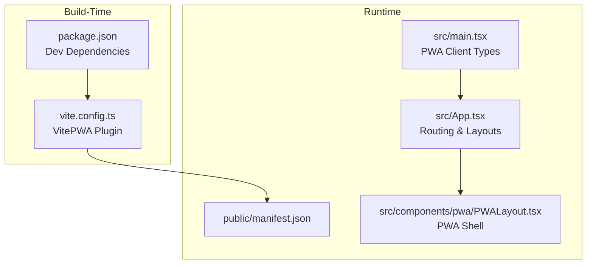
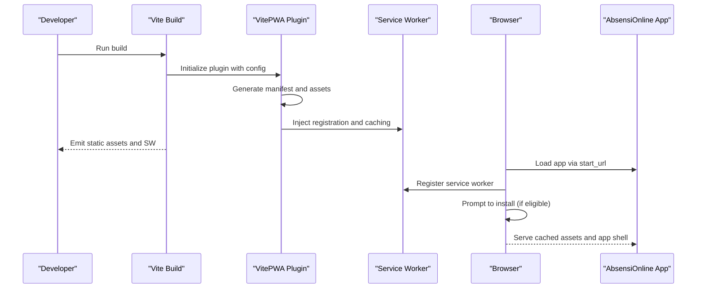
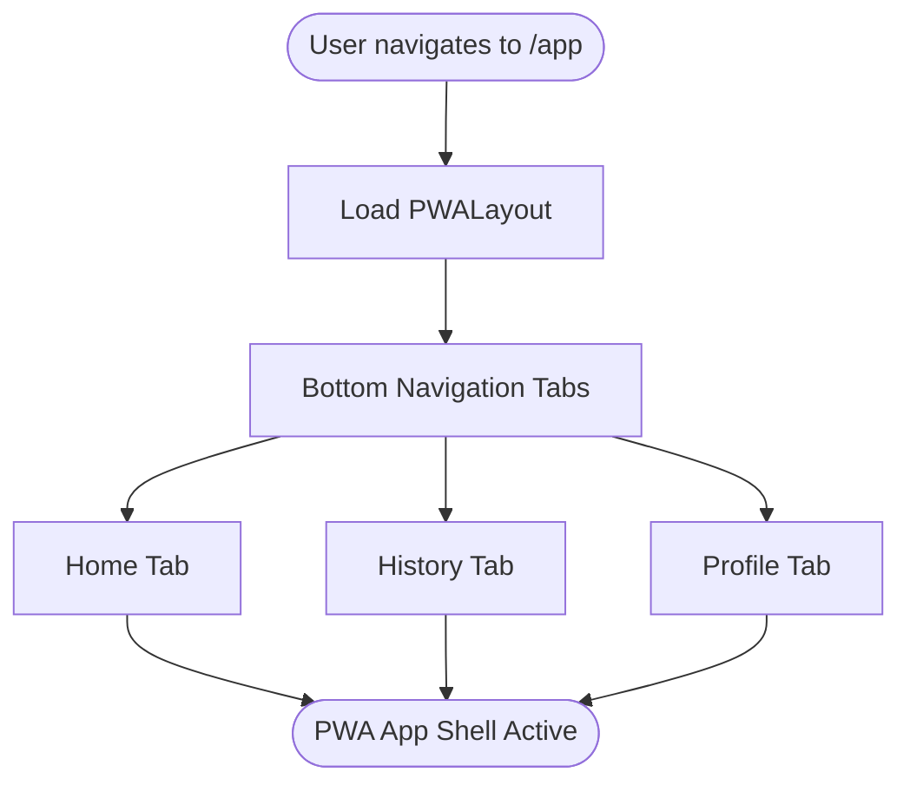
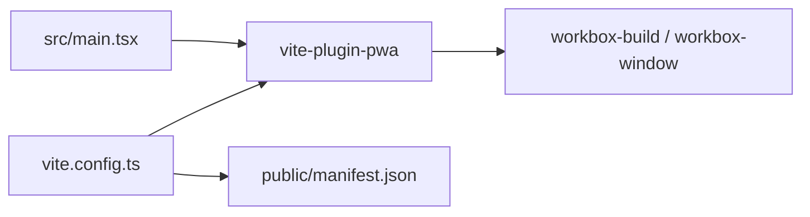

# PWA Manifest Configuration

<cite>
**Referenced Files in This Document**
- [manifest.json](file://public/manifest.json)
- [vite.config.ts](file://vite.config.ts)
- [package.json](file://package.json)
- [main.tsx](file://src/main.tsx)
- [App.tsx](file://src/App.tsx)
- [PWALayout.tsx](file://src/components/pwa/PWALayout.tsx)
</cite>

## Table of Contents
1. [Introduction](#introduction)
2. [Project Structure](#project-structure)
3. [Core Components](#core-components)
4. [Architecture Overview](#architecture-overview)
5. [Detailed Component Analysis](#detailed-component-analysis)
6. [Dependency Analysis](#dependency-analysis)
7. [Performance Considerations](#performance-considerations)
8. [Troubleshooting Guide](#troubleshooting-guide)
9. [Conclusion](#conclusion)

## Introduction
This document explains how the AbsensiOnline application configures and delivers a Progressive Web App (PWA). It covers the manifest.json structure, icon specifications, theme and background colors, display mode, and how VitePWA generates and injects assets. It also documents the installation lifecycle, user experience considerations for adding to home screen, and best practices for cross-browser compatibility and testing.

## Project Structure
The PWA configuration centers around two primary areas:
- Static manifest definition under the public directory
- Build-time PWA generation via VitePWA plugin configuration

Key files and roles:
- manifest.json: Defines app identity, navigation, appearance, and icons
- vite.config.ts: Configures VitePWA to auto-generate service worker, cache assets, and inject registration
- package.json: Declares VitePWA as a development dependency
- main.tsx: Declares PWA client types for TypeScript
- App routing: Establishes the PWA app shell under /app routes

**Diagram sources**
- [vite.config.ts:13-33](file://vite.config.ts#L13-L33)
- [package.json:28-39](file://package.json#L28-L39)
- [manifest.json:1-13](file://public/manifest.json#L1-L13)
- [main.tsx:1](file://src/main.tsx#L1)
- [App.tsx:20-57](file://src/App.tsx#L20-L57)
- [PWALayout.tsx:11-42](file://src/components/pwa/PWALayout.tsx#L11-L42)

**Section sources**
- [vite.config.ts:13-33](file://vite.config.ts#L13-L33)
- [package.json:28-39](file://package.json#L28-L39)
- [manifest.json:1-13](file://public/manifest.json#L1-L13)
- [main.tsx:1](file://src/main.tsx#L1)
- [App.tsx:20-57](file://src/App.tsx#L20-L57)
- [PWALayout.tsx:11-42](file://src/components/pwa/PWALayout.tsx#L11-L42)

## Core Components
- Manifest definition: Provides app name, short name, start URL, display mode, background color, theme color, and icon set
- VitePWA plugin: Enables automatic service worker registration, asset caching, and injection of PWA metadata
- Routing: Establishes the PWA app shell under /app with tabbed navigation

Key configuration highlights:
- Manifest fields: name, short_name, start_url, display, background_color, theme_color, icons
- VitePWA options: autoUpdate registration, asset inclusion, Workbox glob patterns, dev mode enabled
- TypeScript integration: PWA client types declared for VitePWA

**Section sources**
- [manifest.json:1-13](file://public/manifest.json#L1-L13)
- [vite.config.ts:20-32](file://vite.config.ts#L20-L32)
- [main.tsx:1](file://src/main.tsx#L1)

## Architecture Overview
The PWA lifecycle spans build-time generation and runtime installation:

**Diagram sources**
- [vite.config.ts:20-32](file://vite.config.ts#L20-L32)
- [manifest.json:1-13](file://public/manifest.json#L1-L13)

## Detailed Component Analysis

### Manifest Definition Analysis
The manifest defines the PWA identity and presentation:
- Identity: name and short_name
- Navigation: start_url sets the initial route for installation
- Presentation: display standalone, background_color, theme_color
- Assets: icons array with PNG sizes 192x192 and 512x512

Recommendations:
- Add additional icon sizes (e.g., 384x384, 512x512) for higher-density screens
- Consider maskable icons for platform-specific adaptive icons
- Ensure background_color matches the app shell to avoid flash-of-unstyled-content

**Section sources**
- [manifest.json:1-13](file://public/manifest.json#L1-L13)

### VitePWA Plugin Configuration
The plugin configuration controls how the PWA is generated and served:
- registerType: autoUpdate enables automatic updates after installation
- injectRegister: auto injects the registration script
- includeAssets: ensures specific assets (icons and manifest) are bundled
- manifest: disabled to rely on static manifest.json
- workbox: globPatterns define cacheable assets; runtimeCaching empty for deterministic caching
- devOptions: enabled for development convenience

Asset inclusion strategy:
- Icons: icon-192.png and icon-512.png are included
- Manifest: manifest.json is included as-is

Platform-specific optimizations:
- Workbox handles caching and offline behavior
- Dev mode enabled for easier testing during development

**Section sources**
- [vite.config.ts:20-32](file://vite.config.ts#L20-L32)

### TypeScript Integration for PWA Client
The application declares PWA client types to enable type-safe service worker usage and registration APIs.

**Section sources**
- [main.tsx:1](file://src/main.tsx#L1)

### PWA App Shell and Routing
The PWA app shell is routed under /app and provides a mobile-first layout with fixed bottom navigation. The shell integrates with the PWA manifest’s start_url to deliver a native-app-like experience.

**Diagram sources**
- [App.tsx:42-49](file://src/App.tsx#L42-L49)
- [PWALayout.tsx:11-42](file://src/components/pwa/PWALayout.tsx#L11-L42)

**Section sources**
- [App.tsx:42-49](file://src/App.tsx#L42-L49)
- [PWALayout.tsx:11-42](file://src/components/pwa/PWALayout.tsx#L11-L42)

## Dependency Analysis
The PWA relies on VitePWA and Workbox for service worker generation and caching. The plugin is configured as a development dependency and integrated into the Vite build pipeline.

**Diagram sources**
- [vite.config.ts:6](file://vite.config.ts#L6)
- [package.json:37](file://package.json#L37)
- [main.tsx:1](file://src/main.tsx#L1)

**Section sources**
- [vite.config.ts:6](file://vite.config.ts#L6)
- [package.json:37](file://package.json#L37)
- [main.tsx:1](file://src/main.tsx#L1)

## Performance Considerations
- Keep icons optimized and sized appropriately to reduce bundle size
- Use Workbox glob patterns to cache only necessary assets
- Test caching behavior across devices and networks
- Validate that background_color and theme_color align with the app shell to prevent visual flashes

## Troubleshooting Guide
Common issues and resolutions:
- Installation prompt does not appear
  - Verify manifest fields (name, short_name, start_url, display, icons)
  - Ensure service worker is registered and caching is active
  - Check browser developer tools for PWA-related errors
- Incorrect icon display
  - Confirm icon paths and MIME types match manifest entries
  - Rebuild with VitePWA to regenerate assets
- Theme or background color mismatch
  - Align theme_color and background_color with app shell styling
- Service worker not updating
  - Review registerType and devOptions settings
  - Clear browser cache and unregister old service workers during testing

Testing checklist:
- Chrome DevTools: Application tab, manifest validation, service worker status
- Firefox: Installability diagnostics and service worker panel
- Safari: Web Inspector, manifest and service worker sections
- Mobile: Test on Android and iOS with real devices

**Section sources**
- [manifest.json:1-13](file://public/manifest.json#L1-L13)
- [vite.config.ts:20-32](file://vite.config.ts#L20-L32)

## Conclusion
The AbsensiOnline PWA is configured with a concise manifest and a robust VitePWA pipeline that automates service worker registration and asset caching. By validating manifest fields, ensuring proper icon coverage, and testing across browsers and devices, the application delivers a reliable installable experience aligned with modern PWA best practices.