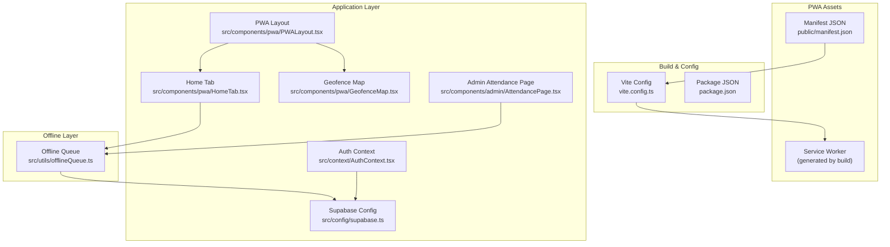
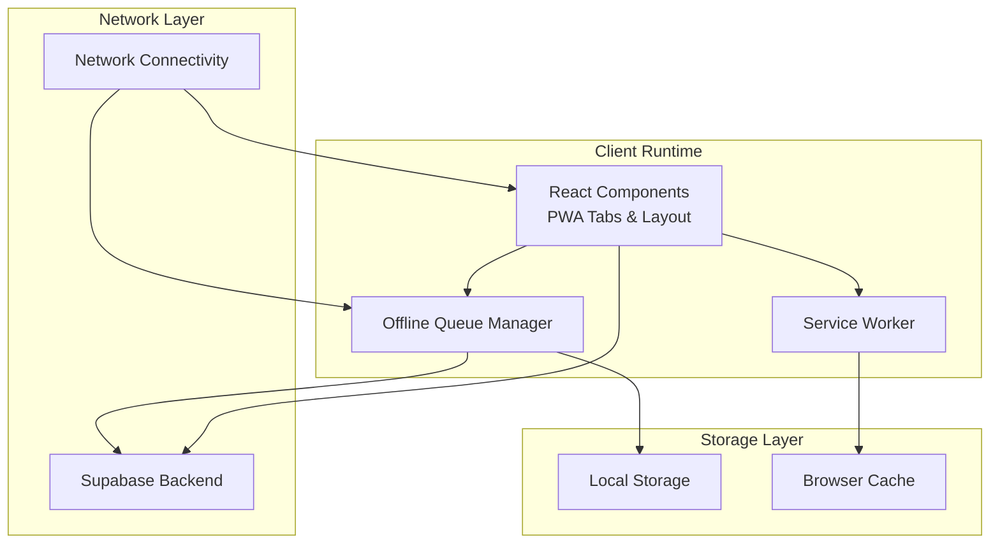
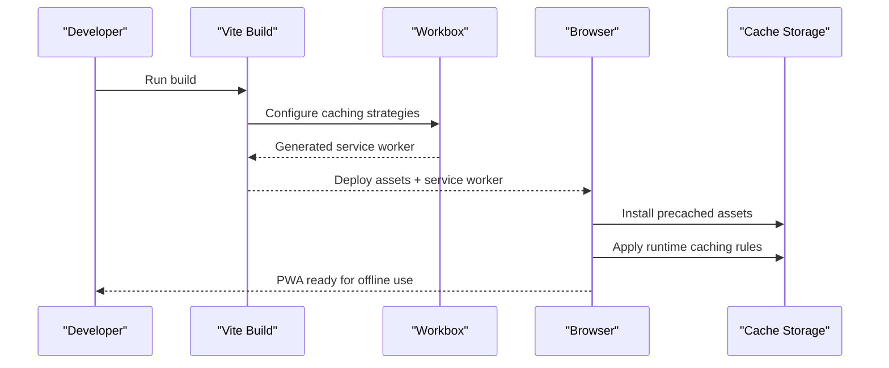
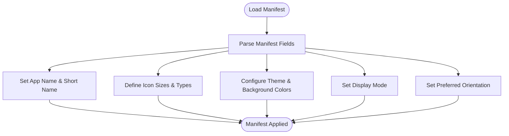
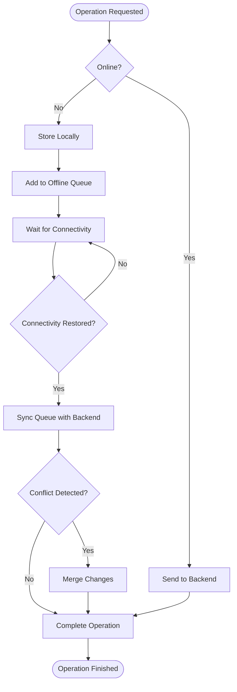
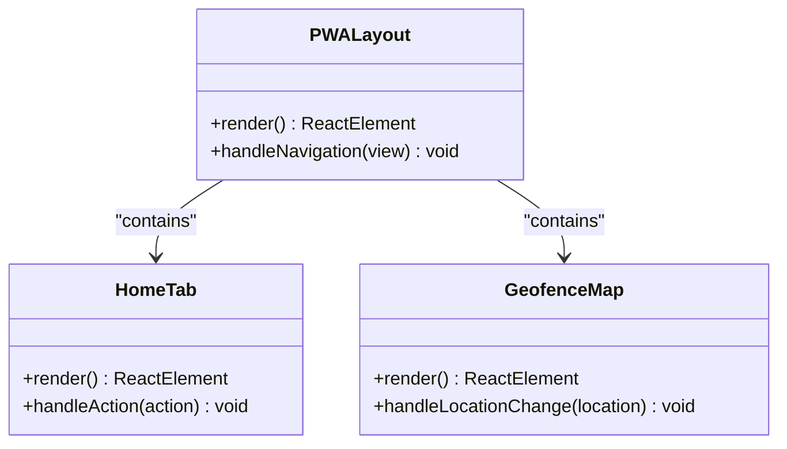
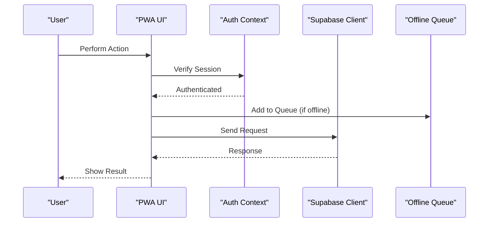
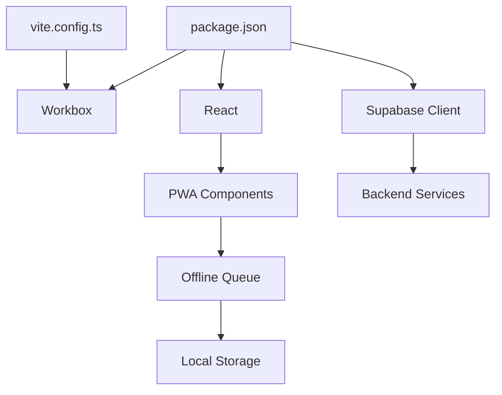

# Progressive Web App Implementation

<cite>
**Referenced Files in This Document**
- [manifest.json](file://public/manifest.json)
- [offlineQueue.ts](file://src/utils/offlineQueue.ts)
- [vite.config.ts](file://vite.config.ts)
- [index.html](file://index.html)
- [PWALayout.tsx](file://src/components/pwa/PWALayout.tsx)
- [HomeTab.tsx](file://src/components/pwa/HomeTab.tsx)
- [GeofenceMap.tsx](file://src/components/pwa/GeofenceMap.tsx)
- [AttendancePage.tsx](file://src/components/admin/AttendancePage.tsx)
- [AuthContext.tsx](file://src/context/AuthContext.tsx)
- [supabase.ts](file://src/config/supabase.ts)
- [package.json](file://package.json)
</cite>

## Table of Contents
1. [Introduction](#introduction)
2. [Project Structure](#project-structure)
3. [Core Components](#core-components)
4. [Architecture Overview](#architecture-overview)
5. [Detailed Component Analysis](#detailed-component-analysis)
6. [Dependency Analysis](#dependency-analysis)
7. [Performance Considerations](#performance-considerations)
8. [Troubleshooting Guide](#troubleshooting-guide)
9. [Conclusion](#conclusion)

## Introduction
This document provides comprehensive Progressive Web App (PWA) implementation guidance for AbsensiOnline. It covers the PWA architecture, service worker configuration, offline functionality, mobile optimization strategies, manifest configuration, caching strategies, offline queue management, and integration with core application functionality. The focus is on practical implementation details derived from the repository's codebase, ensuring accessibility for both technical and non-technical stakeholders.

## Project Structure
The PWA implementation in AbsensiOnline is organized around several key areas:
- Manifest configuration for installability and metadata
- Offline queue management for synchronization operations
- Vite build configuration for PWA asset generation and service worker injection
- React components structured for PWA-specific features (home, geofencing, profile tabs)
- Authentication and Supabase integration for secure offline-capable operations

**Diagram sources**
- [manifest.json](file://public/manifest.json)
- [vite.config.ts](file://vite.config.ts)
- [PWALayout.tsx](file://src/components/pwa/PWALayout.tsx)
- [HomeTab.tsx](file://src/components/pwa/HomeTab.tsx)
- [GeofenceMap.tsx](file://src/components/pwa/GeofenceMap.tsx)
- [AttendancePage.tsx](file://src/components/admin/AttendancePage.tsx)
- [AuthContext.tsx](file://src/context/AuthContext.tsx)
- [supabase.ts](file://src/config/supabase.ts)
- [offlineQueue.ts](file://src/utils/offlineQueue.ts)

**Section sources**
- [manifest.json](file://public/manifest.json)
- [vite.config.ts](file://vite.config.ts)
- [package.json](file://package.json)

## Core Components
This section outlines the primary PWA components and their roles:

- Manifest configuration: Defines app metadata, icons, theme colors, and display mode for installability.
- Offline queue manager: Coordinates local storage of operations that require network connectivity, enabling retry when connectivity is restored.
- Build-time service worker integration: Uses Vite and Workbox to generate and inject a service worker for caching strategies.
- PWA layout and tabs: Provides the mobile-first UI structure for home, geofencing, and profile views.
- Authentication and Supabase integration: Ensures secure user sessions and backend synchronization, supporting offline-aware flows.

Key implementation references:
- Manifest configuration and metadata: [manifest.json](file://public/manifest.json)
- Offline queue management: [offlineQueue.ts](file://src/utils/offlineQueue.ts)
- Build configuration for PWA assets: [vite.config.ts](file://vite.config.ts)
- PWA layout structure: [PWALayout.tsx](file://src/components/pwa/PWALayout.tsx)
- Home tab UI: [HomeTab.tsx](file://src/components/pwa/HomeTab.tsx)
- Geofence map UI: [GeofenceMap.tsx](file://src/components/pwa/GeofenceMap.tsx)
- Admin attendance page: [AttendancePage.tsx](file://src/components/admin/AttendancePage.tsx)
- Authentication context: [AuthContext.tsx](file://src/context/AuthContext.tsx)
- Supabase client configuration: [supabase.ts](file://src/config/supabase.ts)

**Section sources**
- [manifest.json](file://public/manifest.json)
- [offlineQueue.ts](file://src/utils/offlineQueue.ts)
- [vite.config.ts](file://vite.config.ts)
- [PWALayout.tsx](file://src/components/pwa/PWALayout.tsx)
- [HomeTab.tsx](file://src/components/pwa/HomeTab.tsx)
- [GeofenceMap.tsx](file://src/components/pwa/GeofenceMap.tsx)
- [AttendancePage.tsx](file://src/components/admin/AttendancePage.tsx)
- [AuthContext.tsx](file://src/context/AuthContext.tsx)
- [supabase.ts](file://src/config/supabase.ts)

## Architecture Overview
The PWA architecture integrates build-time service worker generation with runtime offline capabilities and mobile-first UI components. The system leverages:
- Vite and Workbox for service worker generation and caching strategies
- Local storage for offline operation queuing
- Supabase for secure authentication and data synchronization
- React components designed for responsive layouts and offline UX

[No sources needed since this diagram shows conceptual architecture, not specific code structure]

## Detailed Component Analysis

### Service Worker and Caching Strategy
The service worker is generated during the build process and manages caching for optimal offline performance. The build configuration integrates Workbox to:
- Precache application assets
- Define runtime caching strategies for dynamic resources
- Handle navigation requests and fallback pages
- Manage cache updates and invalidation

Implementation references:
- Build configuration for service worker generation: [vite.config.ts](file://vite.config.ts)
- Package dependencies for PWA support: [package.json](file://package.json)

**Diagram sources**
- [vite.config.ts](file://vite.config.ts)
- [package.json](file://package.json)

**Section sources**
- [vite.config.ts](file://vite.config.ts)
- [package.json](file://package.json)

### Manifest Configuration
The manifest defines the PWA's appearance and behavior when installed. It includes:
- Application name and short name
- Icons for various sizes and formats
- Theme color and background color
- Display mode (standalone)
- Orientation preferences
- Shortcuts and related applications

Implementation reference:
- Manifest definition: [manifest.json](file://public/manifest.json)

**Diagram sources**
- [manifest.json](file://public/manifest.json)

**Section sources**
- [manifest.json](file://public/manifest.json)

### Offline Queue Management
The offline queue ensures that operations continue seamlessly when network connectivity is unavailable. It coordinates:
- Local storage of pending operations
- Retry logic when connectivity is restored
- Conflict resolution and data consistency
- User feedback for queued actions

Implementation reference:
- Offline queue implementation: [offlineQueue.ts](file://src/utils/offlineQueue.ts)

**Diagram sources**
- [offlineQueue.ts](file://src/utils/offlineQueue.ts)

**Section sources**
- [offlineQueue.ts](file://src/utils/offlineQueue.ts)

### PWA Layout and Mobile Optimization
The PWA layout and tabs provide a mobile-first experience:
- Responsive design patterns for small screens
- Touch-friendly controls and gestures
- Optimized navigation between home, geofencing, and profile views
- Adaptive typography and spacing

Implementation references:
- PWA layout container: [PWALayout.tsx](file://src/components/pwa/PWALayout.tsx)
- Home tab UI: [HomeTab.tsx](file://src/components/pwa/HomeTab.tsx)
- Geofence map UI: [GeofenceMap.tsx](file://src/components/pwa/GeofenceMap.tsx)

**Diagram sources**
- [PWALayout.tsx](file://src/components/pwa/PWALayout.tsx)
- [HomeTab.tsx](file://src/components/pwa/HomeTab.tsx)
- [GeofenceMap.tsx](file://src/components/pwa/GeofenceMap.tsx)

**Section sources**
- [PWALayout.tsx](file://src/components/pwa/PWALayout.tsx)
- [HomeTab.tsx](file://src/components/pwa/HomeTab.tsx)
- [GeofenceMap.tsx](file://src/components/pwa/GeofenceMap.tsx)

### Authentication and Supabase Integration
Secure authentication and backend synchronization are critical for offline-capable operations:
- Auth context manages user sessions and state
- Supabase client handles database operations
- Offline queue integrates with authentication to ensure proper user context during sync

Implementation references:
- Authentication context: [AuthContext.tsx](file://src/context/AuthContext.tsx)
- Supabase configuration: [supabase.ts](file://src/config/supabase.ts)
- Admin attendance page (integration example): [AttendancePage.tsx](file://src/components/admin/AttendancePage.tsx)

**Diagram sources**
- [AuthContext.tsx](file://src/context/AuthContext.tsx)
- [supabase.ts](file://src/config/supabase.ts)
- [AttendancePage.tsx](file://src/components/admin/AttendancePage.tsx)
- [offlineQueue.ts](file://src/utils/offlineQueue.ts)

**Section sources**
- [AuthContext.tsx](file://src/context/AuthContext.tsx)
- [supabase.ts](file://src/config/supabase.ts)
- [AttendancePage.tsx](file://src/components/admin/AttendancePage.tsx)
- [offlineQueue.ts](file://src/utils/offlineQueue.ts)

## Dependency Analysis
The PWA implementation relies on several key dependencies and their interactions:
- Vite for build-time asset generation and service worker injection
- Workbox for runtime caching and offline capabilities
- React components for UI rendering and state management
- Supabase for authentication and data persistence
- Local storage for offline operation persistence

**Diagram sources**
- [vite.config.ts](file://vite.config.ts)
- [package.json](file://package.json)

**Section sources**
- [vite.config.ts](file://vite.config.ts)
- [package.json](file://package.json)

## Performance Considerations
To optimize PWA performance:
- Minimize bundle size using tree-shaking and code splitting
- Leverage caching strategies for static assets and API responses
- Optimize images and media for mobile networks
- Use lazy loading for non-critical resources
- Monitor and reduce Largest Contentful Paint (LCP) and First Input Delay (FID)
- Implement efficient offline queue processing to prevent blocking the main thread

[No sources needed since this section provides general guidance]

## Troubleshooting Guide
Common PWA issues and resolutions:
- Service worker not updating: Clear browser cache and unregister old service workers; verify build configuration and Workbox settings
- Manifest errors: Validate manifest fields and icon paths; ensure correct MIME types and sizes
- Offline queue failures: Check local storage quotas and network connectivity; implement retry logic and error boundaries
- Authentication problems: Verify session tokens and refresh mechanisms; ensure proper error handling for expired sessions
- Build failures: Review Vite configuration and plugin compatibility; check for conflicting build steps

**Section sources**
- [vite.config.ts](file://vite.config.ts)
- [manifest.json](file://public/manifest.json)
- [offlineQueue.ts](file://src/utils/offlineQueue.ts)
- [AuthContext.tsx](file://src/context/AuthContext.tsx)

## Conclusion
AbsensiOnline's PWA implementation combines modern build tooling with robust offline capabilities and mobile-first design. The service worker, manifest configuration, and offline queue work together to deliver a seamless user experience across devices and network conditions. By integrating authentication and Supabase, the application maintains security and data consistency while supporting offline operations. Proper configuration and ongoing optimization will ensure reliable performance and user satisfaction.