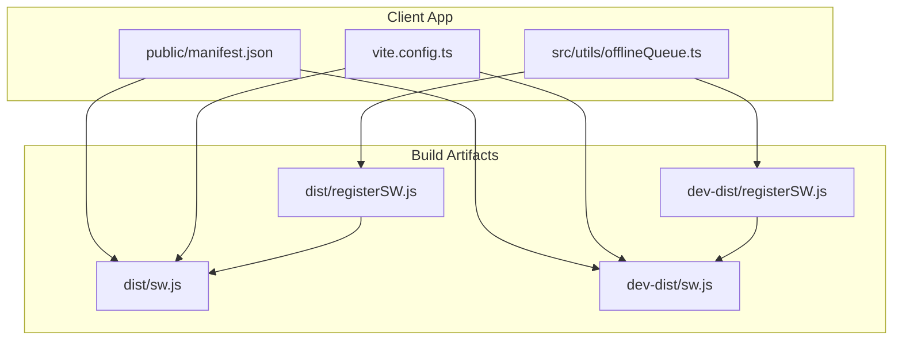
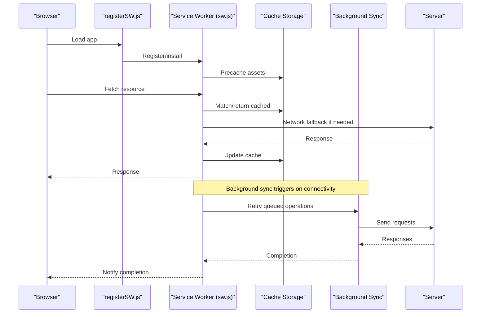
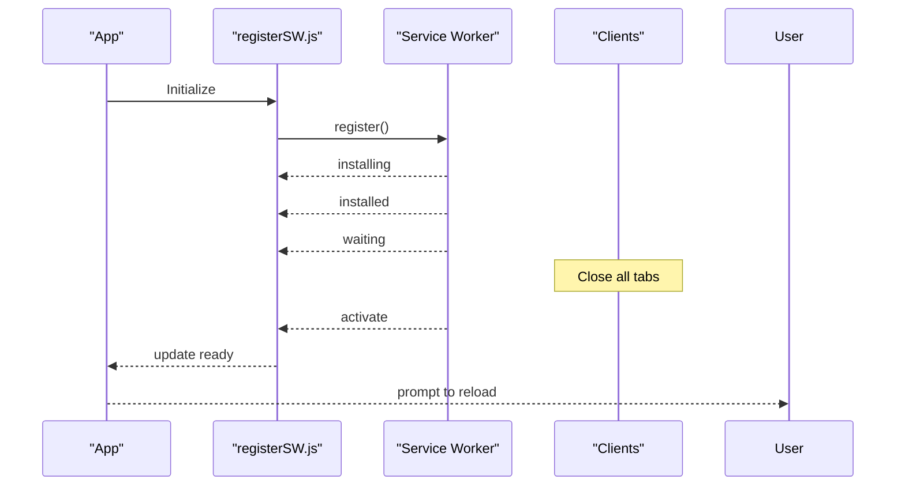
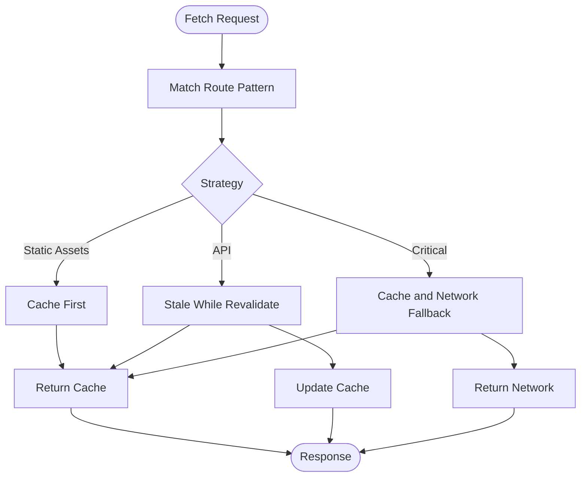
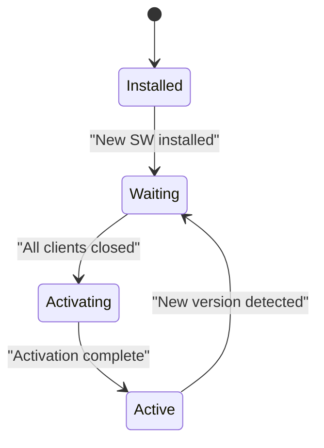
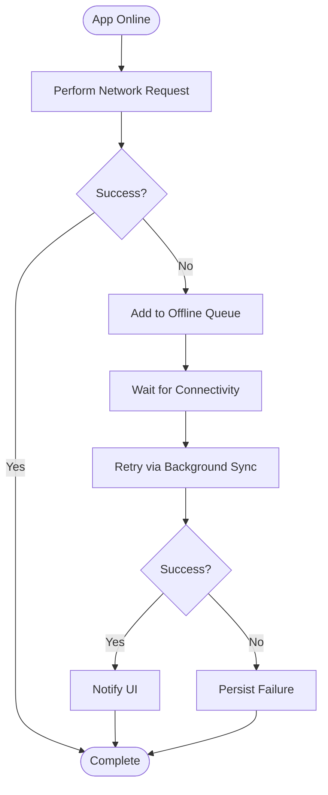
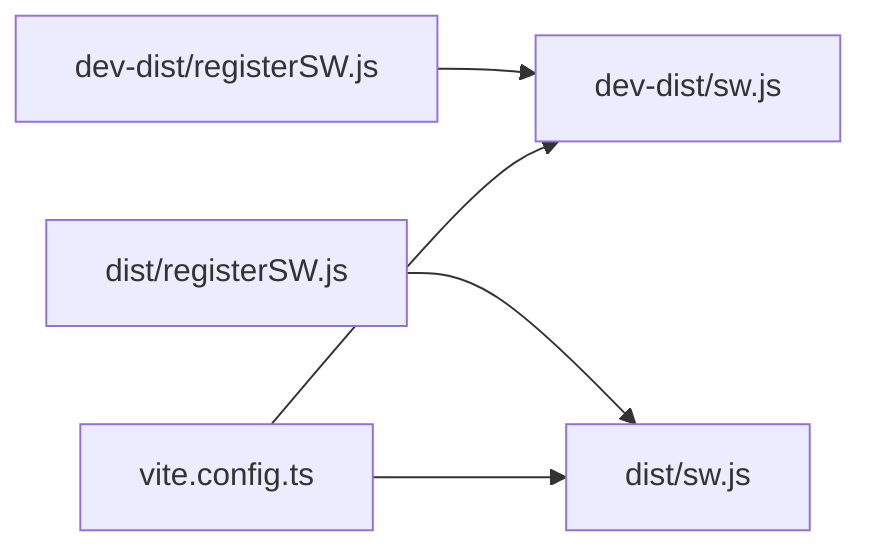
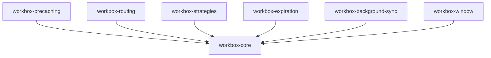

# Service Worker Configuration

<cite>
**Referenced Files in This Document**
- [dist/sw.js](file://dist/sw.js)
- [dev-dist/sw.js](file://dev-dist/sw.js)
- [dist/registerSW.js](file://dist/registerSW.js)
- [dev-dist/registerSW.js](file://dev-dist/registerSW.js)
- [src/utils/offlineQueue.ts](file://src/utils/offlineQueue.ts)
- [vite.config.ts](file://vite.config.ts)
- [package.json](file://package.json)
- [public/manifest.json](file://public/manifest.json)
</cite>

## Table of Contents
1. [Introduction](#introduction)
2. [Project Structure](#project-structure)
3. [Core Components](#core-components)
4. [Architecture Overview](#architecture-overview)
5. [Detailed Component Analysis](#detailed-component-analysis)
6. [Dependency Analysis](#dependency-analysis)
7. [Performance Considerations](#performance-considerations)
8. [Troubleshooting Guide](#troubleshooting-guide)
9. [Conclusion](#conclusion)

## Introduction
This document explains the service worker configuration powering AbsensiOnline’s Progressive Web App (PWA). It covers Workbox integration, caching strategies, runtime routing, auto-update mechanisms, registration, cache invalidation, offline queue management for synchronization, and environment-specific configurations. Guidance for debugging and performance tuning is also included.

## Project Structure
The PWA assets and service worker artifacts are built and deployed under the dist and dev-dist directories. Registration scripts live alongside the built assets. Offline queue logic resides in the client-side utilities.

**Diagram sources**
- [dist/sw.js](file://dist/sw.js)
- [dev-dist/sw.js](file://dev-dist/sw.js)
- [dist/registerSW.js](file://dist/registerSW.js)
- [dev-dist/registerSW.js](file://dev-dist/registerSW.js)
- [vite.config.ts](file://vite.config.ts)
- [public/manifest.json](file://public/manifest.json)
- [src/utils/offlineQueue.ts](file://src/utils/offlineQueue.ts)

**Section sources**
- [dist/sw.js](file://dist/sw.js)
- [dev-dist/sw.js](file://dev-dist/sw.js)
- [dist/registerSW.js](file://dist/registerSW.js)
- [dev-dist/registerSW.js](file://dev-dist/registerSW.js)
- [vite.config.ts](file://vite.config.ts)
- [public/manifest.json](file://public/manifest.json)
- [src/utils/offlineQueue.ts](file://src/utils/offlineQueue.ts)

## Core Components
- Service Worker (Workbox-powered): Generated during build, registers precache and runtime routes, manages background sync, and handles updates.
- Registration Script: Installs and updates the service worker from the browser, with environment-aware behavior.
- Offline Queue Utility: Manages failed network requests and retries when connectivity is restored.
- Build Configuration: Vite integrates Workbox via plugin(s) to produce optimized service worker bundles.

Key responsibilities:
- Precache static assets for instant load and offline availability.
- Route dynamic requests with appropriate caching strategies.
- Coordinate auto-updates and cache invalidation.
- Queue and retry offline operations using background sync.
- Provide reliable PWA lifecycle management.

**Section sources**
- [dist/sw.js](file://dist/sw.js)
- [dev-dist/sw.js](file://dev-dist/sw.js)
- [dist/registerSW.js](file://dist/registerSW.js)
- [dev-dist/registerSW.js](file://dev-dist/registerSW.js)
- [src/utils/offlineQueue.ts](file://src/utils/offlineQueue.ts)
- [vite.config.ts](file://vite.config.ts)

## Architecture Overview
The PWA relies on Workbox to generate a service worker that:
- Precaches build outputs and app manifests.
- Applies runtime caching strategies for API and media resources.
- Uses background sync to retry failed operations.
- Handles update cycles and cache invalidation.

**Diagram sources**
- [dist/sw.js](file://dist/sw.js)
- [dev-dist/sw.js](file://dev-dist/sw.js)
- [dist/registerSW.js](file://dist/registerSW.js)
- [dev-dist/registerSW.js](file://dev-dist/registerSW.js)
- [src/utils/offlineQueue.ts](file://src/utils/offlineQueue.ts)

## Detailed Component Analysis

### Service Worker Generation and Workbox Configuration
- The service worker is generated by the build pipeline using Workbox plugins configured in Vite. The resulting sw.js files in dist and dev-dist encapsulate precache manifests, runtime routing, and background sync logic.
- Workbox modules present in the dependency tree include precaching, routing, strategies, expiration, background sync, and window utilities.

Operational highlights:
- Precache: Static assets are cached during install and invalidated on version change.
- Runtime caching: Strategies applied per route (e.g., cache-first for images, stale-while-revalidate for API).
- Background sync: Queues failed fetches and retries when online.
- Auto-update: New service worker installs and replaces the current one after clients are closed.

**Section sources**
- [dist/sw.js](file://dist/sw.js)
- [dev-dist/sw.js](file://dev-dist/sw.js)
- [vite.config.ts](file://vite.config.ts)
- [package.json](file://package.json)

### Registration and Auto-Update Mechanism
- The registration script checks for service worker support, registers the worker, and listens for updates.
- In development, the registration script targets the dev-dist service worker; in production, it targets the dist service worker.
- Auto-update flow:
  - New service worker is installed.
  - After existing clients are closed, the new service worker activates.
  - The registration script notifies the app to refresh content.

**Diagram sources**
- [dist/registerSW.js](file://dist/registerSW.js)
- [dev-dist/registerSW.js](file://dev-dist/registerSW.js)
- [dist/sw.js](file://dist/sw.js)
- [dev-dist/sw.js](file://dev-dist/sw.js)

**Section sources**
- [dist/registerSW.js](file://dist/registerSW.js)
- [dev-dist/registerSW.js](file://dev-dist/registerSW.js)
- [dist/sw.js](file://dist/sw.js)
- [dev-dist/sw.js](file://dev-dist/sw.js)

### Caching Strategies and Runtime Routing
- Precache: All build outputs are precached and versioned to enable instant load and offline availability.
- Runtime strategies:
  - Cache-first for static assets (images, fonts).
  - Stale-while-revalidate for API responses to keep UI responsive while ensuring eventual consistency.
  - Cache-and-network with fallback for critical resources.
- Expiration: Configured to remove old entries and limit cache size.
- Broadcast updates: Notifies clients when caches change.

**Diagram sources**
- [dist/sw.js](file://dist/sw.js)
- [dev-dist/sw.js](file://dev-dist/sw.js)

**Section sources**
- [dist/sw.js](file://dist/sw.js)
- [dev-dist/sw.js](file://dev-dist/sw.js)

### Cache Invalidation and Auto-Update Lifecycle
- Versioned precache ensures that when the build changes, the old cache is discarded and replaced with the new set.
- During activation, the service worker discards old caches and claims clients.
- Auto-update occurs after all tabs close, preventing conflicts with active clients.

**Diagram sources**
- [dist/sw.js](file://dist/sw.js)
- [dev-dist/sw.js](file://dev-dist/sw.js)

**Section sources**
- [dist/sw.js](file://dist/sw.js)
- [dev-dist/sw.js](file://dev-dist/sw.js)

### Offline Queue Management and Background Sync
- Offline queue utility captures failed network requests and persists them for later retry.
- Background sync leverages the service worker to retry queued operations when connectivity is restored.
- The registration script coordinates with the queue to surface completion notifications to the UI.

**Diagram sources**
- [src/utils/offlineQueue.ts](file://src/utils/offlineQueue.ts)
- [dist/sw.js](file://dist/sw.js)
- [dev-dist/sw.js](file://dev-dist/sw.js)
- [dist/registerSW.js](file://dist/registerSW.js)
- [dev-dist/registerSW.js](file://dev-dist/registerSW.js)

**Section sources**
- [src/utils/offlineQueue.ts](file://src/utils/offlineQueue.ts)
- [dist/sw.js](file://dist/sw.js)
- [dev-dist/sw.js](file://dev-dist/sw.js)
- [dist/registerSW.js](file://dist/registerSW.js)
- [dev-dist/registerSW.js](file://dev-dist/registerSW.js)

### Environment-Specific Configuration (Development vs Production)
- Development: The registration script targets dev-dist/sw.js and workbox-*.js assets.
- Production: The registration script targets dist/sw.js and workbox-*.js assets.
- Build configuration integrates Workbox to generate environment-appropriate service worker bundles.

**Diagram sources**
- [dist/registerSW.js](file://dist/registerSW.js)
- [dev-dist/registerSW.js](file://dev-dist/registerSW.js)
- [dist/sw.js](file://dist/sw.js)
- [dev-dist/sw.js](file://dev-dist/sw.js)
- [vite.config.ts](file://vite.config.ts)

**Section sources**
- [dist/registerSW.js](file://dist/registerSW.js)
- [dev-dist/registerSW.js](file://dev-dist/registerSW.js)
- [dist/sw.js](file://dist/sw.js)
- [dev-dist/sw.js](file://dev-dist/sw.js)
- [vite.config.ts](file://vite.config.ts)

## Dependency Analysis
Workbox modules integrated into the build:
- workbox-core: Shared primitives for caching and lifecycle events.
- workbox-precaching: Precache manifest generation and installation.
- workbox-routing + workbox-strategies: Route matching and caching strategies.
- workbox-expiration: Cache expiration and cleanup.
- workbox-background-sync: Background sync for offline operations.
- workbox-window: Simplified service worker registration and update handling.

**Diagram sources**
- [package.json](file://package.json)

**Section sources**
- [package.json](file://package.json)

## Performance Considerations
- Prefer cache-first for static assets to minimize network latency.
- Use stale-while-revalidate for API responses to balance freshness and responsiveness.
- Limit cache sizes and configure expiration to prevent unbounded growth.
- Minimize the number of runtime routes to reduce complexity.
- Keep the service worker bundle minimal by avoiding unnecessary modules.

## Troubleshooting Guide
Common issues and resolutions:
- Service worker not updating:
  - Ensure clients are closed so the new service worker can activate.
  - Verify precache manifest changes trigger cache invalidation.
- Offline operations not retrying:
  - Confirm background sync is enabled and the service worker handles sync events.
  - Check the offline queue utility logs for persisted failures.
- Cache misses:
  - Review runtime route patterns and ensure they match intended URLs.
  - Validate cache names and expiration policies.
- Registration errors:
  - Confirm the registration script targets the correct sw.js path for the environment.
  - Check browser console for permission or unsupported feature messages.

Debugging steps:
- Open browser DevTools > Application > Service Workers to inspect registration and lifecycle.
- Use the Cache Storage panel to inspect cache contents and verify expiration.
- Monitor Network tab for cache hits/misses and background sync activity.
- Add logging in the service worker and registration script to trace update and sync flows.

**Section sources**
- [dist/sw.js](file://dist/sw.js)
- [dev-dist/sw.js](file://dev-dist/sw.js)
- [dist/registerSW.js](file://dist/registerSW.js)
- [dev-dist/registerSW.js](file://dev-dist/registerSW.js)
- [src/utils/offlineQueue.ts](file://src/utils/offlineQueue.ts)

## Conclusion
AbsensiOnline’s PWA leverages Workbox to deliver fast, resilient experiences with robust offline capabilities. The service worker precaches assets, applies intelligent caching strategies, and coordinates background sync for offline operations. The registration script ensures smooth updates across environments, while the offline queue utility guarantees operation reliability even when connectivity is intermittent. With proper configuration and monitoring, the system maintains performance and user trust.