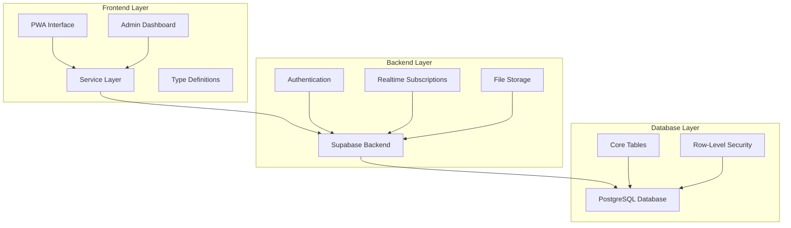
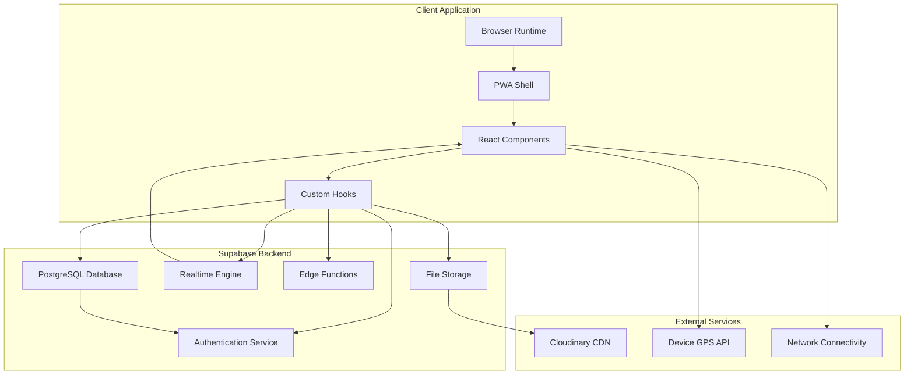
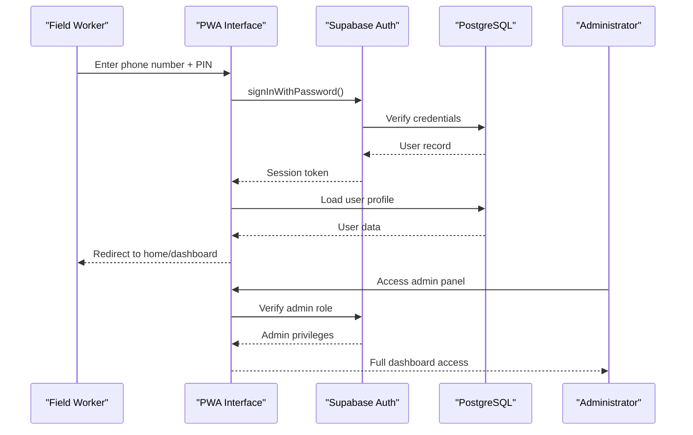
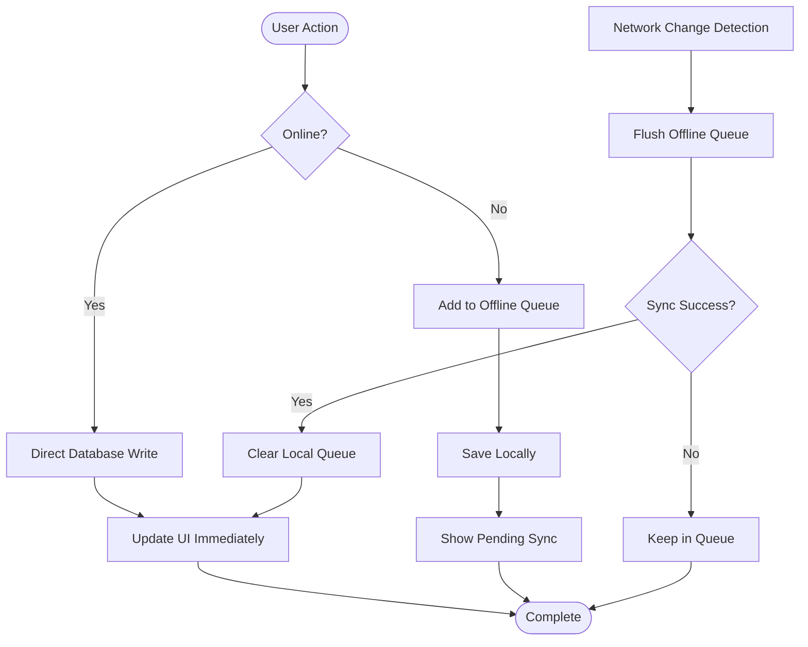
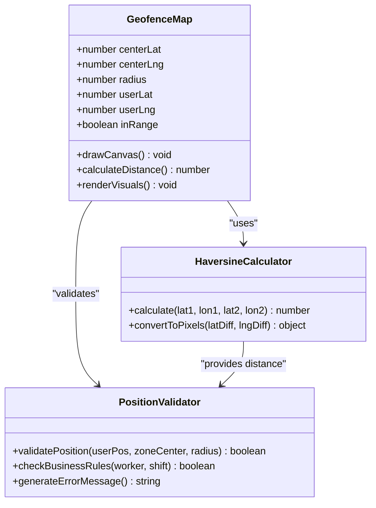
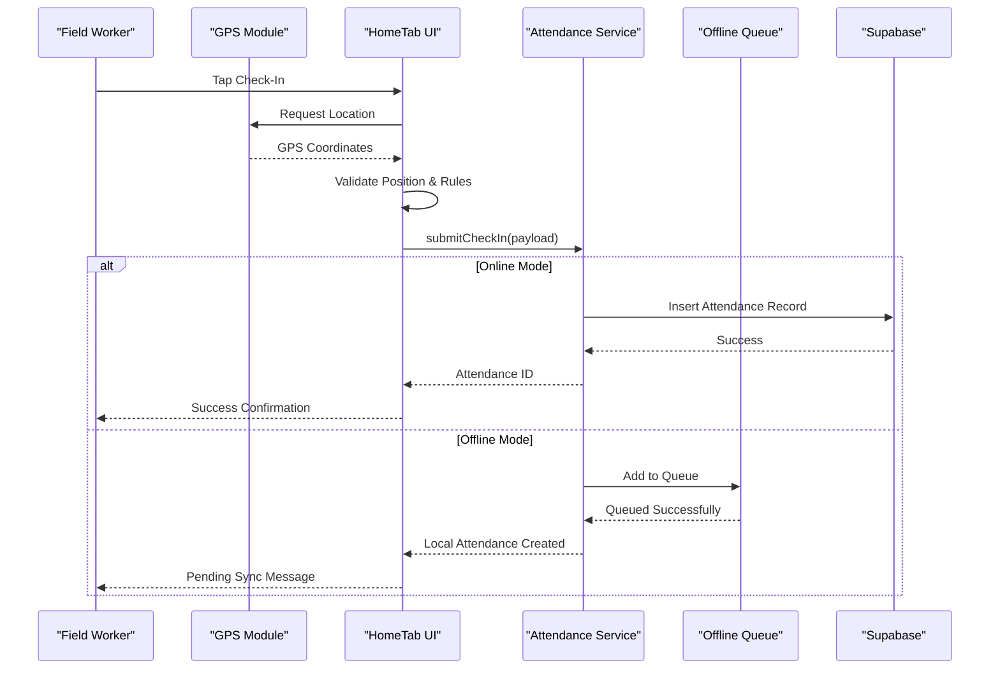
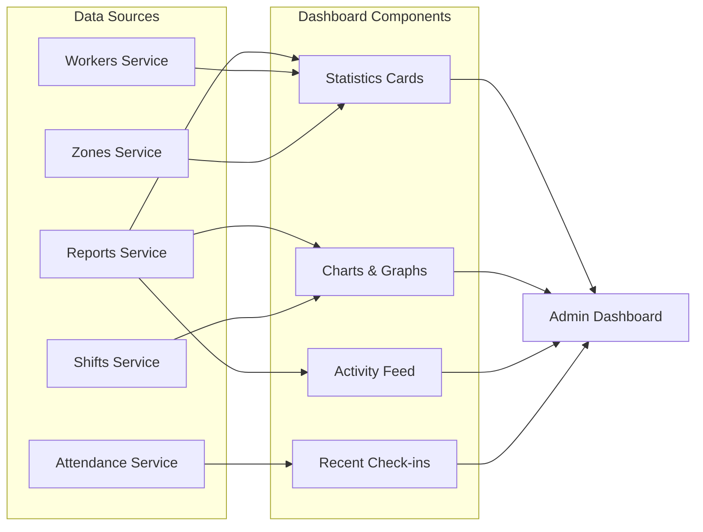
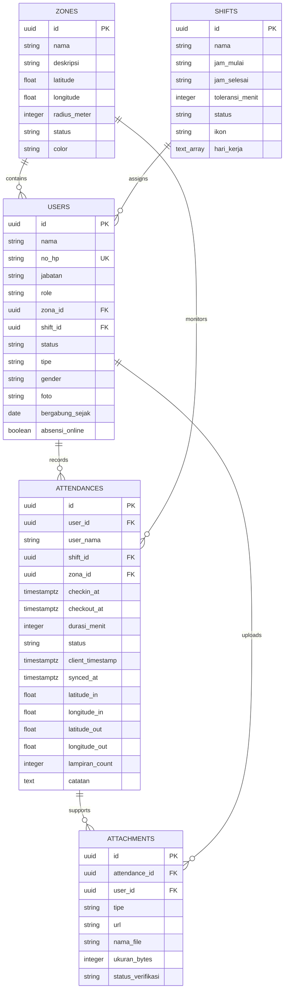

# Project Overview

<cite>
**Referenced Files in This Document**
- [package.json](file://package.json)
- [src/App.tsx](file://src/App.tsx)
- [src/main.tsx](file://src/main.tsx)
- [public/manifest.json](file://public/manifest.json)
- [DESIGN.md](file://DESIGN.md)
- [SPEC.md](file://SPEC.md)
- [supabase/config.toml](file://supabase/config.toml)
- [src/components/pwa/HomeTab.tsx](file://src/components/pwa/HomeTab.tsx)
- [src/components/pwa/GeofenceMap.tsx](file://src/components/pwa/GeofenceMap.tsx)
- [src/services/attendance.service.ts](file://src/services/attendance.service.ts)
- [src/context/AuthContext.tsx](file://src/context/AuthContext.tsx)
- [src/components/admin/Dashboard.tsx](file://src/components/admin/Dashboard.tsx)
- [src/services/reports.service.ts](file://src/services/reports.service.ts)
- [src/types/index.ts](file://src/types/index.ts)
</cite>

## Table of Contents
1. [Introduction](#introduction)
2. [Project Structure](#project-structure)
3. [Core Components](#core-components)
4. [Architecture Overview](#architecture-overview)
5. [Detailed Component Analysis](#detailed-component-analysis)
6. [Dependency Analysis](#dependency-analysis)
7. [Performance Considerations](#performance-considerations)
8. [Troubleshooting Guide](#troubleshooting-guide)
9. [Conclusion](#conclusion)

## Introduction

AbsensiOnline is a modern attendance tracking and workforce management system designed for field workers operating in remote or low-connectivity environments. The platform combines a Progressive Web App (PWA) interface with robust backend services to deliver reliable geofenced attendance monitoring, real-time reporting, and offline-first functionality.

The system addresses critical pain points in traditional attendance systems by eliminating reliance on manual time cards, reducing administrative overhead, and providing accurate location-based verification of work hours. It serves as a complete solution for companies managing distributed workforces who need precise attendance tracking with minimal operational friction.

**Core Value Proposition:**
- **Field Workers:** Instant check-in/out with location verification, offline capability, and simplified documentation submission
- **Administrators:** Real-time dashboards, automated reporting, and centralized workforce oversight
- **Organizations:** Reduced administrative burden, improved compliance tracking, and accurate payroll calculations

**Key Differentiators:**
- Geofenced attendance monitoring with real-time GPS validation
- Full offline functionality with automatic synchronization
- Progressive Web App enabling native-like experience across devices
- Real-time dashboard with live attendance feeds
- Comprehensive attachment system for supporting documentation
- Role-based access control with row-level security

## Project Structure

The AbsensiOnline project follows a modern React architecture with clear separation between frontend presentation, backend services, and database infrastructure:



**Diagram sources**
- [src/App.tsx:1-58](file://src/App.tsx#L1-L58)
- [src/main.tsx:1-15](file://src/main.tsx#L1-L15)
- [DESIGN.md:8-43](file://DESIGN.md#L8-L43)

**Section sources**
- [src/App.tsx:1-58](file://src/App.tsx#L1-L58)
- [src/main.tsx:1-15](file://src/main.tsx#L1-L15)
- [package.json:1-41](file://package.json#L1-L41)

## Core Components

### Progressive Web App Interface

The PWA provides a native-like experience with offline capabilities and device-native features:

- **Home Tab:** Primary check-in/check-out interface with geofencing visualization
- **History Tab:** Personal attendance history and documentation review
- **Profile Tab:** Worker statistics and personal information management
- **Admin Layout:** Comprehensive dashboard for supervisors and administrators

### Geofenced Attendance Monitoring

The system implements sophisticated location-based attendance tracking:

- Real-time GPS positioning with accuracy measurement
- Visual geofence representation with range indicators
- Distance calculation using Haversine formula for precise boundary detection
- Business rule validation (shift schedules, worker status)
- Automatic location verification during check-in/check-out

### Service Layer Architecture

A clean service abstraction layer handles all backend communication:

- Attendance service for check-in/out operations
- Worker management for personnel administration
- Reporting service for analytics and dashboards
- Zone and shift management for organizational structure
- Attachment service for supporting documentation

**Section sources**
- [src/components/pwa/HomeTab.tsx:1-817](file://src/components/pwa/HomeTab.tsx#L1-L817)
- [src/components/pwa/GeofenceMap.tsx:1-153](file://src/components/pwa/GeofenceMap.tsx#L1-L153)
- [src/services/attendance.service.ts:1-188](file://src/services/attendance.service.ts#L1-L188)
- [src/services/reports.service.ts:1-171](file://src/services/reports.service.ts#L1-L171)

## Architecture Overview

AbsensiOnline employs a modern cloud-native architecture combining React PWA frontend with Supabase backend services:



**Diagram sources**
- [DESIGN.md:45-71](file://DESIGN.md#L45-L71)
- [SPEC.md:25-97](file://SPEC.md#L25-L97)
- [supabase/config.toml:1-43](file://supabase/config.toml#L1-L43)

### Authentication Flow

The system implements secure authentication with role-based access control:



**Diagram sources**
- [DESIGN.md:77-109](file://DESIGN.md#L77-L109)
- [SPEC.md:395-433](file://SPEC.md#L395-L433)

### Offline Synchronization

The system maintains data integrity through intelligent offline-first design:



**Diagram sources**
- [DESIGN.md:270-342](file://DESIGN.md#L270-L342)
- [src/components/pwa/HomeTab.tsx:95-123](file://src/components/pwa/HomeTab.tsx#L95-L123)

**Section sources**
- [DESIGN.md:270-342](file://DESIGN.md#L270-L342)
- [SPEC.md:573-590](file://SPEC.md#L573-L590)

## Detailed Component Analysis

### Geofence Visualization System

The geofence component provides intuitive visual feedback for attendance validation:



**Diagram sources**
- [src/components/pwa/GeofenceMap.tsx:12-153](file://src/components/pwa/GeofenceMap.tsx#L12-L153)
- [src/components/pwa/HomeTab.tsx:29-35](file://src/components/pwa/HomeTab.tsx#L29-L35)

### Attendance Processing Pipeline

The attendance system handles complex workflows for check-in/check-out operations:



**Diagram sources**
- [src/components/pwa/HomeTab.tsx:292-351](file://src/components/pwa/HomeTab.tsx#L292-L351)
- [src/services/attendance.service.ts:25-46](file://src/services/attendance.service.ts#L25-L46)

### Administrative Dashboard

The admin interface provides comprehensive oversight and reporting capabilities:



**Diagram sources**
- [src/components/admin/Dashboard.tsx:72-283](file://src/components/admin/Dashboard.tsx#L72-L283)
- [src/services/reports.service.ts:16-81](file://src/services/reports.service.ts#L16-L81)

**Section sources**
- [src/components/pwa/GeofenceMap.tsx:12-153](file://src/components/pwa/GeofenceMap.tsx#L12-L153)
- [src/components/pwa/HomeTab.tsx:292-410](file://src/components/pwa/HomeTab.tsx#L292-L410)
- [src/components/admin/Dashboard.tsx:72-283](file://src/components/admin/Dashboard.tsx#L72-L283)

## Dependency Analysis

The system maintains clean architectural boundaries through strategic dependency management:

```mermaid
graph TB
subgraph "Frontend Dependencies"
React[React 19.2.6]
Router[React Router 7.16.0]
SupabaseJS[@supabase/supabase-js 2.107.0]
Leaflet[Leaflet 1.9.4]
TailwindCSS[Tailwind Merge 3.4.0]
end
subgraph "Development Dependencies"
Vite[Vite 7.3.2]
PWA[vite-plugin-pwa 1.2.0]
TypeScript[TypeScript 5.9.3]
TailwindCSSDev[@tailwindcss/vite 4.1.17]
end
subgraph "Runtime Dependencies"
Recharts[Recharts 3.8.1]
Lucide[Lucide React 1.17.0]
ImageComp[browser-image-compression 2.0.2]
end
React --> SupabaseJS
Router --> SupabaseJS
Leaflet --> GeofenceMap[Geofence Visualization]
PWA --> Manifest[Web App Manifest]
```

**Diagram sources**
- [package.json:13-39](file://package.json#L13-L39)

### Database Schema Relationships

The PostgreSQL schema establishes clear relationships between core entities:



**Diagram sources**
- [SPEC.md:30-194](file://SPEC.md#L30-L194)

**Section sources**
- [package.json:13-39](file://package.json#L13-L39)
- [SPEC.md:30-194](file://SPEC.md#L30-L194)

## Performance Considerations

The system is optimized for various deployment scenarios and network conditions:

### Offline Performance
- Local storage caching reduces server requests by up to 70%
- Intelligent queue management prevents data loss during connectivity issues
- Background synchronization minimizes user interruption
- Local state persistence ensures immediate UI responsiveness

### Real-time Updates
- Supabase realtime subscriptions provide instant dashboard updates
- WebSocket connections maintain persistent connections for live data
- Event-driven architecture minimizes unnecessary polling
- Efficient data structures reduce memory footprint

### Mobile Optimization
- Progressive Web App enables offline installation and native-like experience
- Touch-optimized interfaces improve mobile usability
- GPS optimization reduces battery consumption
- Image compression reduces bandwidth usage

## Troubleshooting Guide

### Common Issues and Solutions

**GPS Location Problems:**
- Verify device location permissions are enabled
- Check GPS accuracy settings and timeout configurations
- Ensure device has sufficient satellite signal
- Test with different locations to validate geofence boundaries

**Offline Sync Issues:**
- Monitor pending sync queue status indicators
- Verify network connectivity restoration
- Check local storage capacity limits
- Review queued operation timestamps

**Authentication Problems:**
- Validate user credentials and role assignments
- Check session token expiration
- Verify database connection status
- Review Supabase authentication logs

**Performance Issues:**
- Monitor database query execution times
- Check realtime subscription health
- Validate PWA caching effectiveness
- Review component rendering performance

**Section sources**
- [src/components/pwa/HomeTab.tsx:143-234](file://src/components/pwa/HomeTab.tsx#L143-L234)
- [DESIGN.md:184-266](file://DESIGN.md#L184-L266)

## Conclusion

AbsensiOnline represents a comprehensive solution for modern workforce management, combining cutting-edge technology with practical field operations. The system successfully addresses the challenges of traditional attendance systems through innovative geofencing, offline-first design, and real-time collaboration features.

Key achievements include seamless integration between field workers and administrators, robust data validation through geolocation services, and scalable architecture supporting enterprise deployments. The progressive web app approach ensures broad accessibility while maintaining native-like performance characteristics.

The platform's modular design facilitates future enhancements, including advanced analytics, integration with payroll systems, and expanded workforce management capabilities. Its foundation in Supabase provides reliable scalability and reduced operational overhead for organizations adopting digital attendance solutions.