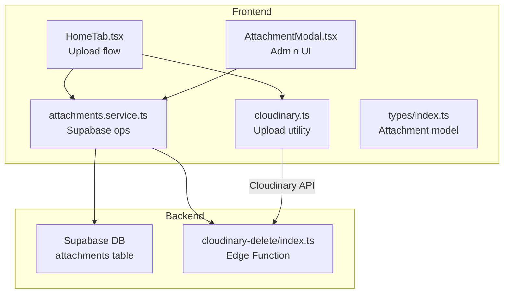
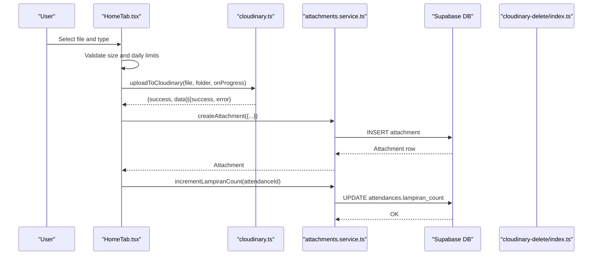
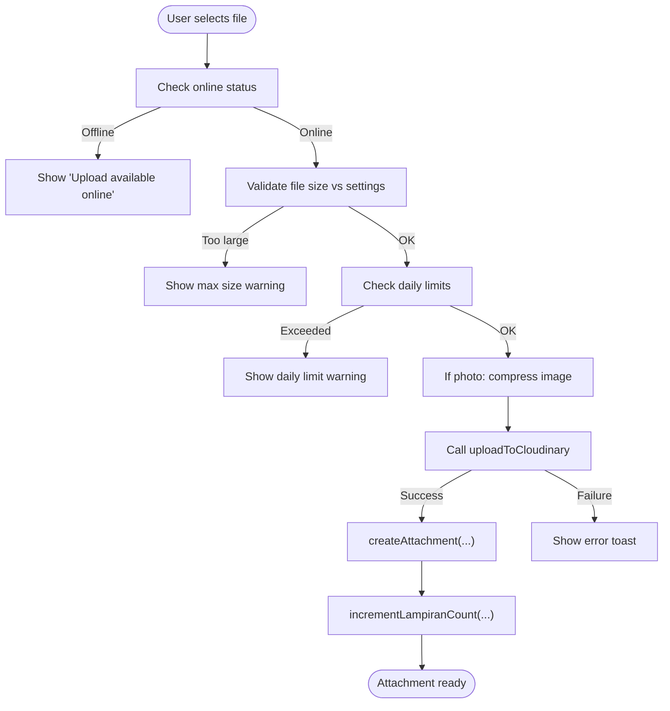
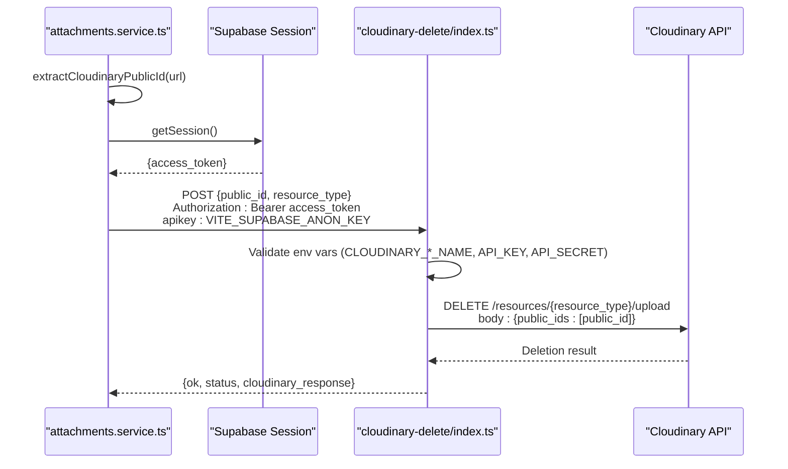
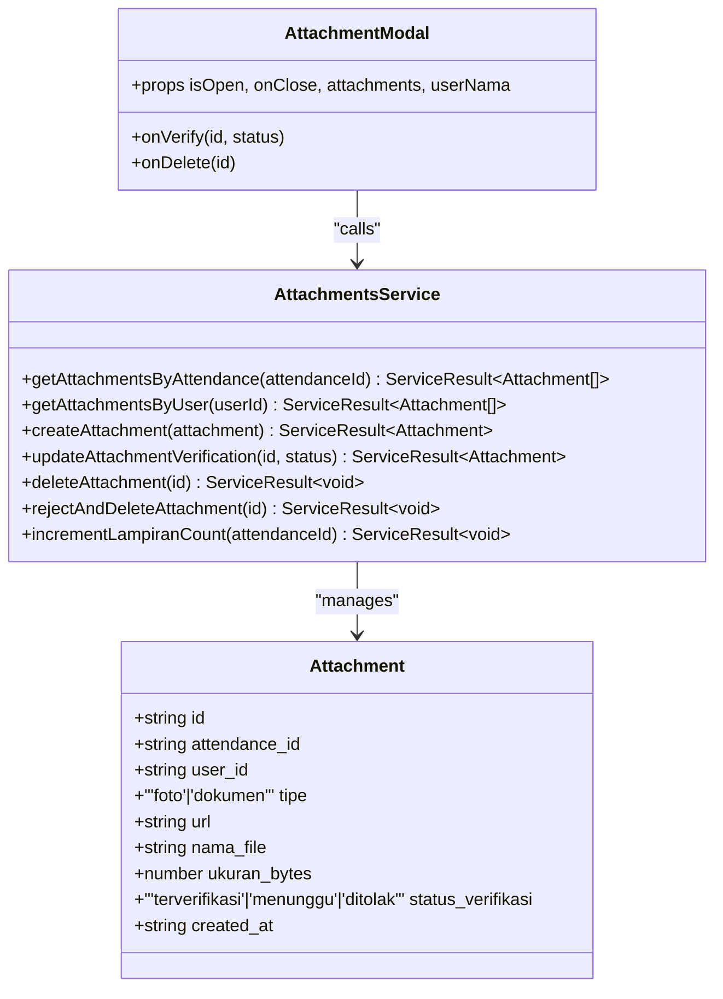
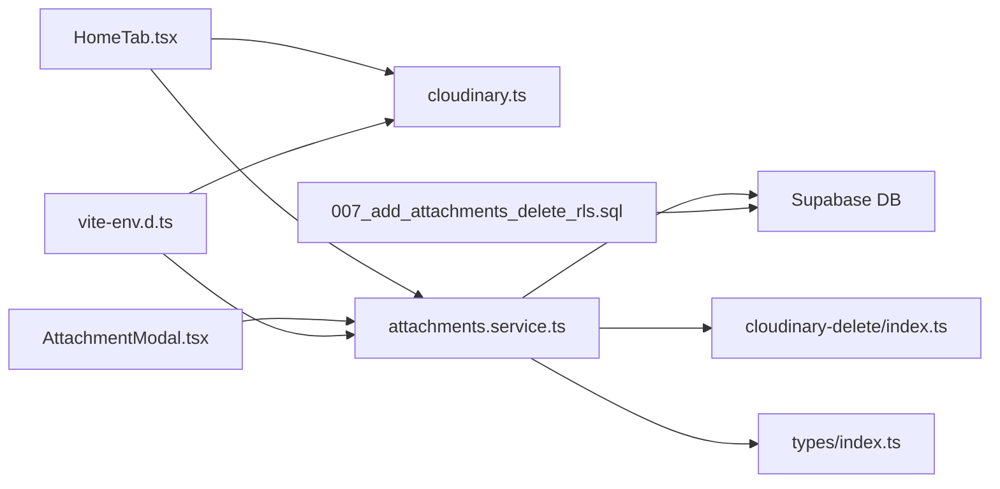

# Attachments Service

<cite>
**Referenced Files in This Document**
- [attachments.service.ts](file://src/services/attachments.service.ts)
- [cloudinary.ts](file://src/utils/cloudinary.ts)
- [index.ts](file://supabase/functions/cloudinary-delete/index.ts)
- [index.ts](file://src/types/index.ts)
- [AttachmentModal.tsx](file://src/components/admin/AttachmentModal.tsx)
- [HomeTab.tsx](file://src/components/pwa/HomeTab.tsx)
- [attendance.service.ts](file://src/services/attendance.service.ts)
- [007_add_attachments_delete_rls.sql](file://supabase/migrations/007_add_attachments_delete_rls.sql)
- [vite-env.d.ts](file://src/vite-env.d.ts)
- [settings.service.ts](file://src/services/settings.service.ts)
</cite>

## Table of Contents
1. [Introduction](#introduction)
2. [Project Structure](#project-structure)
3. [Core Components](#core-components)
4. [Architecture Overview](#architecture-overview)
5. [Detailed Component Analysis](#detailed-component-analysis)
6. [Dependency Analysis](#dependency-analysis)
7. [Performance Considerations](#performance-considerations)
8. [Troubleshooting Guide](#troubleshooting-guide)
9. [Conclusion](#conclusion)

## Introduction
This document describes the Attachments Service responsible for managing image and document uploads, Cloudinary integration, and media handling within the AbsensiOnline application. It covers the complete lifecycle of attachments: upload, validation, metadata management, verification, and deletion. It also explains how attachments relate to attendance records, proof submission, and administrative approval workflows. The documentation includes practical examples, error recovery strategies, and integration details with Cloudinary APIs.

## Project Structure
The Attachments Service spans frontend and backend components:
- Frontend services and utilities manage upload, validation, and UI interactions.
- Supabase-backed database stores attachment metadata linked to attendance records.
- Supabase Edge Functions provide privileged Cloudinary deletion operations.
- Types define the data contracts for attachments and related entities.

**Diagram sources**
- [HomeTab.tsx:412-491](file://src/components/pwa/HomeTab.tsx#L412-L491)
- [AttachmentModal.tsx:24-136](file://src/components/admin/AttachmentModal.tsx#L24-L136)
- [attachments.service.ts:48-126](file://src/services/attachments.service.ts#L48-L126)
- [cloudinary.ts:11-62](file://src/utils/cloudinary.ts#L11-L62)
- [index.ts:8-70](file://supabase/functions/cloudinary-delete/index.ts#L8-L70)
- [index.ts:48-58](file://src/types/index.ts#L48-L58)

**Section sources**
- [HomeTab.tsx:412-491](file://src/components/pwa/HomeTab.tsx#L412-L491)
- [AttachmentModal.tsx:24-136](file://src/components/admin/AttachmentModal.tsx#L24-L136)
- [attachments.service.ts:48-126](file://src/services/attachments.service.ts#L48-L126)
- [cloudinary.ts:11-62](file://src/utils/cloudinary.ts#L11-L62)
- [index.ts:8-70](file://supabase/functions/cloudinary-delete/index.ts#L8-L70)
- [index.ts:48-58](file://src/types/index.ts#L48-L58)

## Core Components
- Attachment model: Defines the structure of stored attachments, including identifiers, links, metadata, and verification status.
- Upload utility: Handles Cloudinary upload via XMLHttpRequest with progress callbacks and robust error handling.
- Attachments service: Provides CRUD operations for attachments, verification updates, and deletion with Cloudinary cleanup.
- Admin UI: Presents attachment lists, previews, downloads, verification actions, and deletion prompts.
- Edge Function: Performs privileged Cloudinary deletions using API keys.
- Attendance integration: Links attachments to attendance records and maintains counters.

**Section sources**
- [index.ts:48-58](file://src/types/index.ts#L48-L58)
- [cloudinary.ts:11-62](file://src/utils/cloudinary.ts#L11-L62)
- [attachments.service.ts:48-126](file://src/services/attachments.service.ts#L48-L126)
- [AttachmentModal.tsx:24-136](file://src/components/admin/AttachmentModal.tsx#L24-L136)
- [index.ts:8-70](file://supabase/functions/cloudinary-delete/index.ts#L8-L70)
- [attendance.service.ts:25-46](file://src/services/attendance.service.ts#L25-L46)

## Architecture Overview
The Attachments Service follows a layered architecture:
- Presentation layer: HomeTab handles user uploads and displays progress; AttachmentModal supports admin verification and deletion.
- Service layer: attachments.service.ts orchestrates Supabase interactions and Cloudinary operations.
- Utility layer: cloudinary.ts encapsulates upload mechanics and error handling.
- Backend layer: Supabase database stores attachment metadata; Supabase Edge Function performs Cloudinary deletions.

**Diagram sources**
- [HomeTab.tsx:412-491](file://src/components/pwa/HomeTab.tsx#L412-L491)
- [cloudinary.ts:11-62](file://src/utils/cloudinary.ts#L11-L62)
- [attachments.service.ts:68-126](file://src/services/attachments.service.ts#L68-L126)

## Detailed Component Analysis

### Attachment Model and Metadata
The Attachment type defines:
- Identity: id, attendance_id, user_id
- Content: tipe ('foto' | 'dokumen'), url, nama_file, ukuran_bytes
- Verification: status_verifikasi ('terverifikasi' | 'menunggu' | 'ditolak')
- Timestamp: created_at

These fields enable:
- File categorization and display
- Storage location and size tracking
- Administrative verification workflows
- Audit trail via timestamps

**Section sources**
- [index.ts:48-58](file://src/types/index.ts#L48-L58)

### Upload Workflow and Validation
The upload pipeline in HomeTab enforces:
- Size limits based on app settings
- Daily caps for total attachments and per-type counts
- Online-only uploads
- Optional image compression for photos using browser-image-compression
- Folder naming convention: absensi/{userId}/{attendanceId}

The upload utility:
- Validates Cloudinary configuration
- Builds multipart/form-data payload with upload preset and target folder
- Streams progress events
- Parses Cloudinary responses and surfaces errors

**Diagram sources**
- [HomeTab.tsx:412-491](file://src/components/pwa/HomeTab.tsx#L412-L491)
- [cloudinary.ts:11-62](file://src/utils/cloudinary.ts#L11-L62)
- [attachments.service.ts:68-126](file://src/services/attachments.service.ts#L68-L126)

**Section sources**
- [HomeTab.tsx:412-491](file://src/components/pwa/HomeTab.tsx#L412-L491)
- [cloudinary.ts:11-62](file://src/utils/cloudinary.ts#L11-L62)
- [settings.service.ts:5-14](file://src/services/settings.service.ts#L5-L14)

### Cloudinary Integration
Upload mechanism:
- Uses XMLHttpRequest to post to Cloudinary auto-upload endpoint
- Sends file, upload_preset, and folder parameters
- Emits progress events and resolves with secure_url and metadata
- Handles network errors, aborts, and parsing failures

Deletion mechanism:
- Extracts public_id and resource_type from Cloudinary URLs
- Calls Supabase Edge Function with authenticated session and Supabase API key
- Edge Function validates credentials and invokes Cloudinary v1 API to delete resources
- Returns structured response including Cloudinary raw output

**Diagram sources**
- [attachments.service.ts:4-46](file://src/services/attachments.service.ts#L4-L46)
- [index.ts:8-70](file://supabase/functions/cloudinary-delete/index.ts#L8-L70)

**Section sources**
- [attachments.service.ts:4-46](file://src/services/attachments.service.ts#L4-L46)
- [index.ts:8-70](file://supabase/functions/cloudinary-delete/index.ts#L8-L70)

### Metadata Management and Verification
Operations:
- Retrieve attachments by attendance or user
- Create attachment records with verification status initialized to 'menunggu'
- Update verification status to 'terverifikasi' or 'ditolak'
- Delete individual attachments and remove associated Cloudinary resources
- Increment attachment counters on attendance records

Admin UI:
- AttachmentModal displays list with type icons, sizes, timestamps, and verification badges
- Supports preview for images, download, verification actions, and deletion confirmation

**Diagram sources**
- [index.ts:48-58](file://src/types/index.ts#L48-L58)
- [attachments.service.ts:48-126](file://src/services/attachments.service.ts#L48-L126)
- [AttachmentModal.tsx:15-22](file://src/components/admin/AttachmentModal.tsx#L15-L22)

**Section sources**
- [attachments.service.ts:48-126](file://src/services/attachments.service.ts#L48-L126)
- [AttachmentModal.tsx:24-136](file://src/components/admin/AttachmentModal.tsx#L24-L136)

### Relationship with Attendance Records
- Each attachment references an attendance_id, linking proofs to check-in/out sessions.
- The attendances table includes a lampiran_count field to track associated attachments.
- The service increments this counter upon successful attachment creation.
- Admins can review and approve/reject attachments, affecting audit trails and reporting.

**Section sources**
- [attendance.service.ts:25-46](file://src/services/attendance.service.ts#L25-L46)
- [attachments.service.ts:112-126](file://src/services/attachments.service.ts#L112-L126)
- [index.ts:60-78](file://src/types/index.ts#L60-L78)

### Storage Optimization and Thumbnails
- Images are optionally compressed before upload to reduce size while preserving quality.
- Cloudinary transforms can be applied via URL parameters for thumbnails and optimized delivery.
- The system stores original filenames and sizes, enabling efficient retrieval and display.

Note: Thumbnail generation is handled by Cloudinary transformations applied to stored URLs; the current implementation focuses on upload and metadata storage.

**Section sources**
- [HomeTab.tsx:434-448](file://src/components/pwa/HomeTab.tsx#L434-L448)
- [cloudinary.ts:11-62](file://src/utils/cloudinary.ts#L11-L62)

### Examples of Attachment Handling Scenarios
- Photo upload with compression and progress tracking, followed by database insertion and counter increment.
- Document upload with size validation and daily cap enforcement.
- Admin rejection and permanent deletion: fetch URL, extract public_id, call Edge Function, then delete DB record.
- Preview and download from the admin modal.

**Section sources**
- [HomeTab.tsx:412-491](file://src/components/pwa/HomeTab.tsx#L412-L491)
- [AttachmentModal.tsx:24-136](file://src/components/admin/AttachmentModal.tsx#L24-L136)
- [attachments.service.ts:96-110](file://src/services/attachments.service.ts#L96-L110)

## Dependency Analysis
Key dependencies and relationships:
- HomeTab depends on cloudinary.ts for uploads and settings.service.ts for validation rules.
- attachments.service.ts depends on Supabase for persistence and the Edge Function for Cloudinary deletion.
- AttachmentModal depends on Attachment model and service operations for rendering and actions.
- Supabase migrations grant admin deletion privileges for attachments.

**Diagram sources**
- [HomeTab.tsx:412-491](file://src/components/pwa/HomeTab.tsx#L412-L491)
- [cloudinary.ts:11-62](file://src/utils/cloudinary.ts#L11-L62)
- [attachments.service.ts:48-126](file://src/services/attachments.service.ts#L48-L126)
- [AttachmentModal.tsx:24-136](file://src/components/admin/AttachmentModal.tsx#L24-L136)
- [index.ts:8-70](file://supabase/functions/cloudinary-delete/index.ts#L8-L70)
- [007_add_attachments_delete_rls.sql:4-6](file://supabase/migrations/007_add_attachments_delete_rls.sql#L4-L6)
- [vite-env.d.ts:3-7](file://src/vite-env.d.ts#L3-L7)

**Section sources**
- [HomeTab.tsx:412-491](file://src/components/pwa/HomeTab.tsx#L412-L491)
- [attachments.service.ts:48-126](file://src/services/attachments.service.ts#L48-L126)
- [AttachmentModal.tsx:24-136](file://src/components/admin/AttachmentModal.tsx#L24-L136)
- [index.ts:8-70](file://supabase/functions/cloudinary-delete/index.ts#L8-L70)
- [007_add_attachments_delete_rls.sql:4-6](file://supabase/migrations/007_add_attachments_delete_rls.sql#L4-L6)
- [vite-env.d.ts:3-7](file://src/vite-env.d.ts#L3-L7)

## Performance Considerations
- Prefer image compression for photos to reduce bandwidth and storage costs.
- Use Cloudinary transformations for on-demand resizing and format optimization.
- Batch operations should avoid frequent Supabase writes; group updates where possible.
- Monitor upload progress to provide responsive feedback and reduce perceived latency.

## Troubleshooting Guide
Common issues and resolutions:
- Cloudinary not configured: Ensure VITE_CLOUDINARY_CLOUD_NAME and VITE_CLOUDINARY_UPLOAD_PRESET are present in environment.
- Upload failures: Check network connectivity, Cloudinary API status, and error messages returned by the upload utility.
- Deletion failures: Verify Supabase session availability and Supabase API key header; inspect Edge Function logs for Cloudinary credential errors.
- Permission denied: Confirm admin role and RLS policies for attachment deletion.
- Exceeded limits: Respect daily caps and size thresholds enforced by the frontend and backend.

**Section sources**
- [cloudinary.ts:19-21](file://src/utils/cloudinary.ts#L19-L21)
- [attachments.service.ts:20-25](file://src/services/attachments.service.ts#L20-L25)
- [index.ts:23-37](file://supabase/functions/cloudinary-delete/index.ts#L23-L37)
- [007_add_attachments_delete_rls.sql:4-6](file://supabase/migrations/007_add_attachments_delete_rls.sql#L4-L6)
- [HomeTab.tsx:418-432](file://src/components/pwa/HomeTab.tsx#L418-L432)

## Conclusion
The Attachments Service integrates Cloudinary for scalable media storage with Supabase for metadata management and admin workflows. It enforces validation, supports verification and deletion, and maintains strong relationships with attendance records. The modular design enables extensibility for advanced features like dynamic transformations and batch operations.