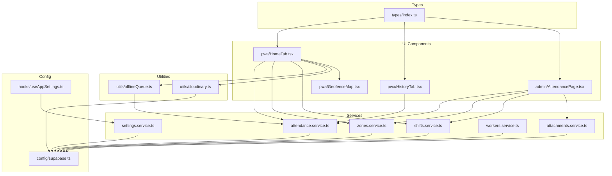
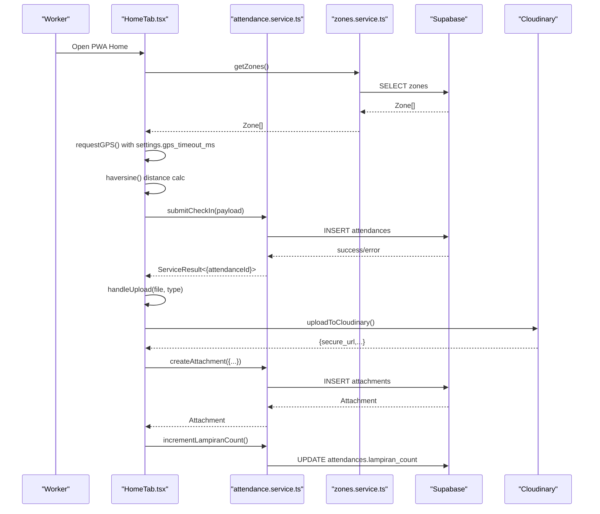
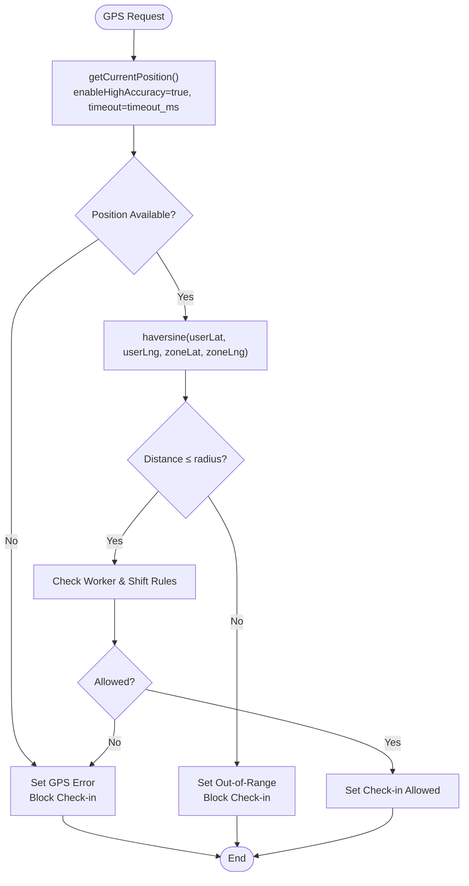
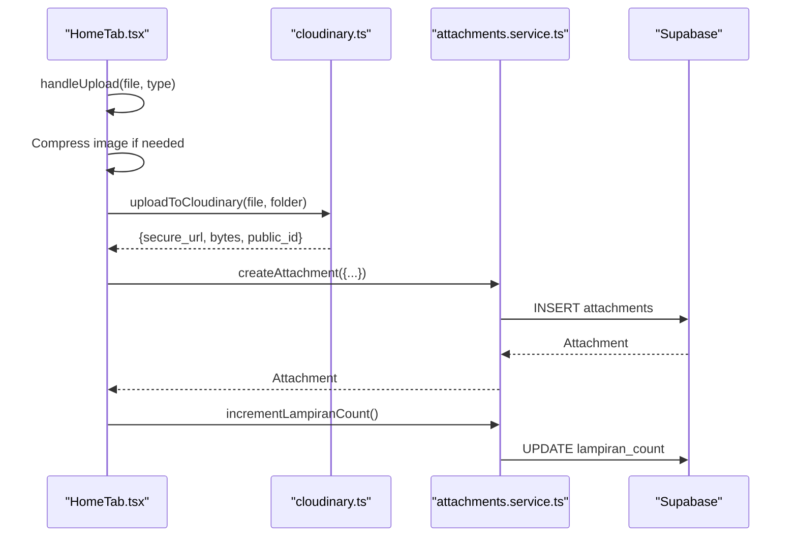
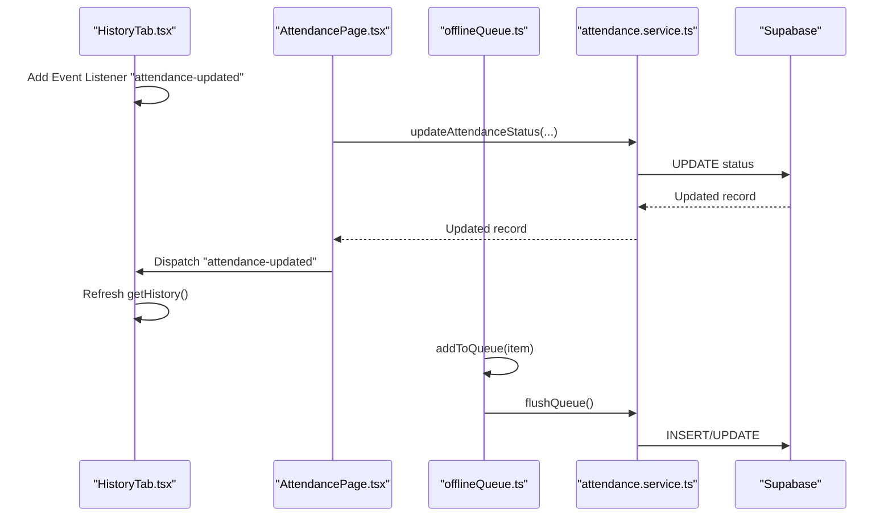
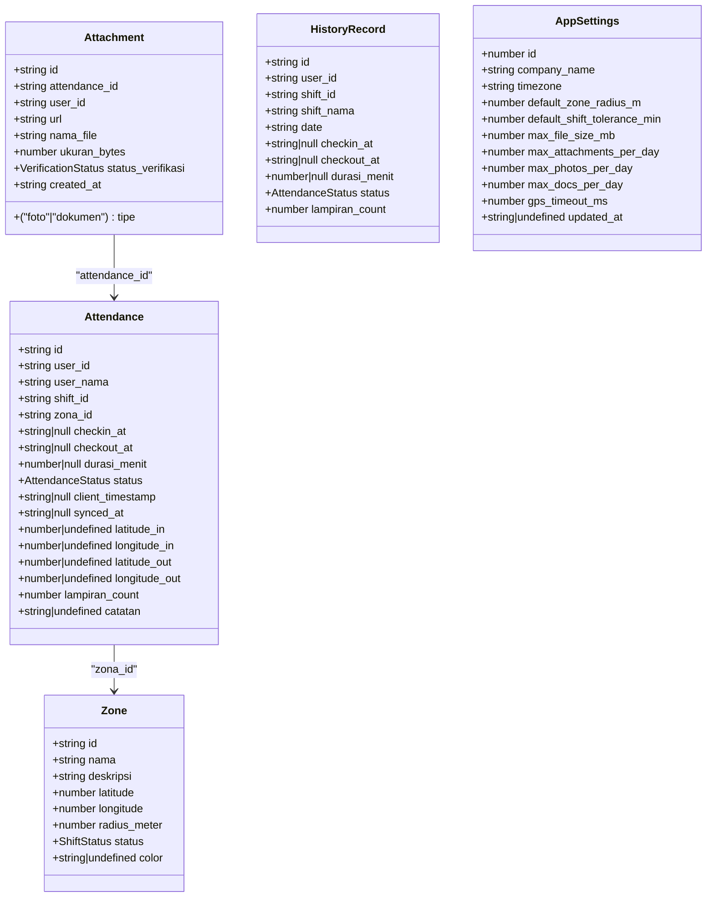
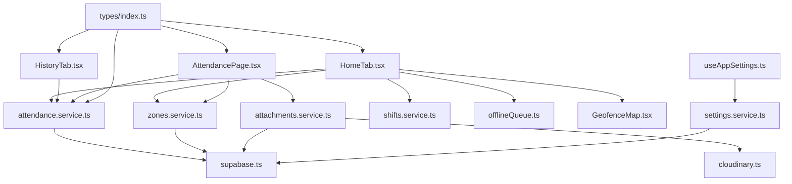

# Attendance Service

<cite>
**Referenced Files in This Document**
- [attendance.service.ts](file://src/services/attendance.service.ts)
- [zones.service.ts](file://src/services/zones.service.ts)
- [attachments.service.ts](file://src/services/attachments.service.ts)
- [index.ts](file://src/types/index.ts)
- [GeofenceMap.tsx](file://src/components/pwa/GeofenceMap.tsx)
- [HomeTab.tsx](file://src/components/pwa/HomeTab.tsx)
- [HistoryTab.tsx](file://src/components/pwa/HistoryTab.tsx)
- [AttendancePage.tsx](file://src/components/admin/AttendancePage.tsx)
- [offlineQueue.ts](file://src/utils/offlineQueue.ts)
- [cloudinary.ts](file://src/utils/cloudinary.ts)
- [supabase.ts](file://src/config/supabase.ts)
- [useAppSettings.ts](file://src/hooks/useAppSettings.ts)
- [settings.service.ts](file://src/services/settings.service.ts)
</cite>

## Table of Contents
1. [Introduction](#introduction)
2. [Project Structure](#project-structure)
3. [Core Components](#core-components)
4. [Architecture Overview](#architecture-overview)
5. [Detailed Component Analysis](#detailed-component-analysis)
6. [Dependency Analysis](#dependency-analysis)
7. [Performance Considerations](#performance-considerations)
8. [Troubleshooting Guide](#troubleshooting-guide)
9. [Conclusion](#conclusion)

## Introduction
This document provides comprehensive technical documentation for the Attendance Service implementation. It covers check-in/check-out operations, geofencing validation, attendance history retrieval, status management, GPS coordinate handling, distance calculation algorithms, tolerance settings, integration with geofence validation, image attachment processing, and real-time status updates. The guide includes method signatures, parameter requirements, return value formats, error scenarios, and practical examples of attendance workflow implementation.

## Project Structure
The Attendance Service spans several layers:
- Services: Attendance, Zones, Attachments, Settings, Workers, Shifts
- Types: Shared data models and constants
- UI Components: PWA Home and History tabs, Admin Attendance page, Geofence visualization
- Utilities: Offline queue, Cloudinary integration, Supabase client
- Hooks: Application settings management

**Diagram sources**
- [attendance.service.ts:1-188](file://src/services/attendance.service.ts#L1-L188)
- [zones.service.ts:1-50](file://src/services/zones.service.ts#L1-L50)
- [attachments.service.ts:1-127](file://src/services/attachments.service.ts#L1-L127)
- [index.ts:1-182](file://src/types/index.ts#L1-L182)
- [GeofenceMap.tsx:1-153](file://src/components/pwa/GeofenceMap.tsx#L1-L153)
- [HomeTab.tsx:1-817](file://src/components/pwa/HomeTab.tsx#L1-L817)
- [HistoryTab.tsx:1-165](file://src/components/pwa/HistoryTab.tsx#L1-L165)
- [AttendancePage.tsx:1-355](file://src/components/admin/AttendancePage.tsx#L1-L355)
- [offlineQueue.ts:1-97](file://src/utils/offlineQueue.ts#L1-L97)
- [cloudinary.ts:1-63](file://src/utils/cloudinary.ts#L1-L63)
- [supabase.ts:1-7](file://src/config/supabase.ts#L1-L7)
- [useAppSettings.ts:1-45](file://src/hooks/useAppSettings.ts#L1-L45)
- [settings.service.ts:1-34](file://src/services/settings.service.ts#L1-L34)

**Section sources**
- [attendance.service.ts:1-188](file://src/services/attendance.service.ts#L1-L188)
- [index.ts:1-182](file://src/types/index.ts#L1-L182)

## Core Components
This section outlines the primary attendance-related APIs and their responsibilities.

- Attendance Service
  - Retrieves all attendance records
  - Submits check-in with geofencing validation
  - Submits check-out with duration calculation
  - Fetches today's attendance for a worker
  - Builds history records with shift mapping
  - Updates attendance status with optional note
  - Provides status label/color helpers

- Zones Service
  - Manages geofence zones with validation
  - Validates latitude, longitude, and radius constraints

- Attachments Service
  - Manages image/document attachments
  - Integrates with Cloudinary for uploads
  - Handles verification and deletion workflows
  - Increments attachment counters

- Types
  - Defines Attendance, Zone, Attachment, Shift, and status enums
  - Standardized ServiceResult wrapper for all service methods
  - Application settings including GPS timeout and limits

**Section sources**
- [attendance.service.ts:16-187](file://src/services/attendance.service.ts#L16-L187)
- [zones.service.ts:4-49](file://src/services/zones.service.ts#L4-L49)
- [attachments.service.ts:48-126](file://src/services/attachments.service.ts#L48-L126)
- [index.ts:4-182](file://src/types/index.ts#L4-L182)

## Architecture Overview
The Attendance Service integrates frontend components with backend storage via Supabase and external services for media.

**Diagram sources**
- [HomeTab.tsx:29-35](file://src/components/pwa/HomeTab.tsx#L29-L35)
- [HomeTab.tsx:164-216](file://src/components/pwa/HomeTab.tsx#L164-L216)
- [HomeTab.tsx:292-351](file://src/components/pwa/HomeTab.tsx#L292-L351)
- [HomeTab.tsx:412-491](file://src/components/pwa/HomeTab.tsx#L412-L491)
- [attendance.service.ts:25-46](file://src/services/attendance.service.ts#L25-L46)
- [zones.service.ts:4-8](file://src/services/zones.service.ts#L4-L8)
- [cloudinary.ts:11-62](file://src/utils/cloudinary.ts#L11-L62)
- [attachments.service.ts:68-75](file://src/services/attachments.service.ts#L68-L75)
- [attachments.service.ts:112-126](file://src/services/attachments.service.ts#L112-L126)

## Detailed Component Analysis

### Attendance Service Methods
This section documents all attendance-related methods with signatures, parameters, return values, and error handling.

- getAttendances()
  - Purpose: Retrieve all attendance records ordered by check-in time descending
  - Returns: ServiceResult<Attendance[]>
  - Errors: Propagates database errors with code and message

- submitCheckIn(payload)
  - Purpose: Record employee check-in with geofencing coordinates
  - Payload: CheckInPayload
    - workerId: string (required)
    - zoneId: string (required)
    - shiftId?: string
    - workerName?: string
    - lat: number (required)
    - lng: number (required)
    - timestamp: string (ISO 8601, required)
    - attendanceId?: string (optional, auto-generated if missing)
  - Returns: ServiceResult<{ attendanceId: string }>
  - Behavior: Inserts new attendance record with status "hadir", stores client and sync timestamps, and coordinates

- submitCheckOut(attendanceId, payload)
  - Purpose: Record employee check-out and compute duration
  - Parameters:
    - attendanceId: string (required)
    - payload: { lat: number; lng: number; timestamp: string }
  - Returns: ServiceResult<void>
  - Behavior: Calculates duration in minutes from check-in to check-out, updates coordinates and synced timestamp

- getTodayAttendance(workerId)
  - Purpose: Get today's attendance record for a worker
  - Parameters: workerId: string
  - Returns: ServiceResult<{ id: string; timestamp: string; checkOutAt: string | null } | null>
  - Behavior: Queries for latest check-in today; returns null if none

- getHistory(userId)
  - Purpose: Build formatted history with shift names and metadata
  - Parameters: userId: string
  - Returns: ServiceResult<HistoryRecord[]>
  - Behavior: Joins attendances with shifts to produce human-readable records

- updateAttendanceStatus(attendanceId, payload)
  - Purpose: Override attendance status and optionally add a note
  - Parameters:
    - attendanceId: string
    - payload: { status: AttendanceStatus; catatan?: string }
  - Returns: ServiceResult<Attendance>
  - Behavior: Updates status and optional note, returns updated record

- Status Helpers
  - getStatusLabel(status): Maps AttendanceStatus to localized string
  - getStatusColor(status): Returns semantic color for UI
  - getStatusLabelAsync(status): Async wrapper around getStatusLabel

- Deprecated Aliases
  - checkIn = submitCheckIn
  - checkOut = submitCheckOut

**Section sources**
- [attendance.service.ts:16-187](file://src/services/attendance.service.ts#L16-L187)

### Geofencing Validation and Distance Calculation
Geofencing validation occurs in the PWA Home component using the Haversine formula for distance computation.

- Haversine Implementation
  - Function: haversine(lat1, lon1, lat2, lon2)
  - Formula: Uses Earth radius and spherical law of cosines
  - Returns: Distance in meters

- GPS Request and Validation
  - requestGPS(): Uses browser Geolocation API with settings.gps_timeout_ms
  - Accuracy: Captures GPS accuracy in meters
  - Range Check: Compares calculated distance to zone.radius_meter
  - Business Rules: Checks worker availability and shift schedule

- Geofence Visualization
  - GeofenceMap component renders a canvas-based visualization
  - Draws zone boundaries, user position, accuracy rings, and compass
  - Color-coded feedback based on in-range status

**Diagram sources**
- [HomeTab.tsx:29-35](file://src/components/pwa/HomeTab.tsx#L29-L35)
- [HomeTab.tsx:164-216](file://src/components/pwa/HomeTab.tsx#L164-L216)
- [HomeTab.tsx:143-234](file://src/components/pwa/HomeTab.tsx#L143-L234)
- [GeofenceMap.tsx:12-153](file://src/components/pwa/GeofenceMap.tsx#L12-L153)

**Section sources**
- [HomeTab.tsx:29-35](file://src/components/pwa/HomeTab.tsx#L29-L35)
- [HomeTab.tsx:164-216](file://src/components/pwa/HomeTab.tsx#L164-L216)
- [HomeTab.tsx:143-234](file://src/components/pwa/HomeTab.tsx#L143-L234)
- [GeofenceMap.tsx:12-153](file://src/components/pwa/GeofenceMap.tsx#L12-L153)

### Image Attachment Processing
The system supports uploading photos and documents with size limits and daily quotas.

- Upload Workflow
  - File Selection: Photo or document input handlers
  - Compression: Optional image compression for photos
  - Cloudinary Upload: Uses upload preset and progress callbacks
  - Database Insertion: Creates attachment record with metadata
  - Counter Increment: Updates attendance.lampiran_count

- Validation Rules
  - Maximum file size per setting
  - Daily caps per type (photos vs documents)
  - Online-only uploads for attachments

**Diagram sources**
- [HomeTab.tsx:412-491](file://src/components/pwa/HomeTab.tsx#L412-L491)
- [cloudinary.ts:11-62](file://src/utils/cloudinary.ts#L11-L62)
- [attachments.service.ts:68-75](file://src/services/attachments.service.ts#L68-L75)
- [attachments.service.ts:112-126](file://src/services/attachments.service.ts#L112-L126)

**Section sources**
- [HomeTab.tsx:412-491](file://src/components/pwa/HomeTab.tsx#L412-L491)
- [cloudinary.ts:11-62](file://src/utils/cloudinary.ts#L11-L62)
- [attachments.service.ts:48-126](file://src/services/attachments.service.ts#L48-L126)

### Real-time Status Updates and Admin Management
Real-time updates occur through UI events and periodic synchronization.

- Real-time Events
  - HistoryTab listens for "attendance-updated" DOM event to refresh history
  - Admin AttendancePage displays live status badges and allows overrides

- Offline Synchronization
  - Offline queue stores pending check-in/out operations
  - flushQueue() retries unsynced items when online
  - Local Today Attendance tracks current day's record

**Diagram sources**
- [HistoryTab.tsx:37-45](file://src/components/pwa/HistoryTab.tsx#L37-L45)
- [AttendancePage.tsx:95-110](file://src/components/admin/AttendancePage.tsx#L95-L110)
- [offlineQueue.ts:53-96](file://src/utils/offlineQueue.ts#L53-L96)
- [attendance.service.ts:171-187](file://src/services/attendance.service.ts#L171-L187)

**Section sources**
- [HistoryTab.tsx:37-45](file://src/components/pwa/HistoryTab.tsx#L37-L45)
- [AttendancePage.tsx:95-110](file://src/components/admin/AttendancePage.tsx#L95-L110)
- [offlineQueue.ts:53-96](file://src/utils/offlineQueue.ts#L53-L96)

### Data Models and Types
The system defines shared types for consistent data handling.

**Diagram sources**
- [index.ts:60-78](file://src/types/index.ts#L60-L78)
- [index.ts:10-19](file://src/types/index.ts#L10-L19)
- [index.ts:48-58](file://src/types/index.ts#L48-L58)
- [index.ts:170-181](file://src/types/index.ts#L170-L181)
- [index.ts:142-167](file://src/types/index.ts#L142-L167)

**Section sources**
- [index.ts:4-182](file://src/types/index.ts#L4-L182)

## Dependency Analysis
The Attendance Service relies on Supabase for persistence, Cloudinary for media, and React components for UI orchestration.

**Diagram sources**
- [attendance.service.ts:1-2](file://src/services/attendance.service.ts#L1-L2)
- [zones.service.ts:1-2](file://src/services/zones.service.ts#L1-L2)
- [attachments.service.ts:1-2](file://src/services/attachments.service.ts#L1-L2)
- [cloudinary.ts:1-2](file://src/utils/cloudinary.ts#L1-L2)
- [HomeTab.tsx:1-24](file://src/components/pwa/HomeTab.tsx#L1-L24)
- [HistoryTab.tsx:1-6](file://src/components/pwa/HistoryTab.tsx#L1-L6)
- [AttendancePage.tsx:1-14](file://src/components/admin/AttendancePage.tsx#L1-L14)
- [offlineQueue.ts:1-1](file://src/utils/offlineQueue.ts#L1-L1)
- [GeofenceMap.tsx:1-10](file://src/components/pwa/GeofenceMap.tsx#L1-L10)
- [settings.service.ts:1-3](file://src/services/settings.service.ts#L1-L3)
- [useAppSettings.ts:1-4](file://src/hooks/useAppSettings.ts#L1-L4)
- [index.ts:1-10](file://src/types/index.ts#L1-L10)

**Section sources**
- [supabase.ts:1-7](file://src/config/supabase.ts#L1-L7)
- [settings.service.ts:1-34](file://src/services/settings.service.ts#L1-L34)
- [useAppSettings.ts:1-45](file://src/hooks/useAppSettings.ts#L1-L45)

## Performance Considerations
- GPS Timeout: Configurable via app settings to balance accuracy and responsiveness
- Offline Queue: Minimizes network requests and ensures eventual consistency
- Haversine Calculation: Lightweight and suitable for client-side computation
- Image Compression: Reduces upload sizes and improves user experience
- Database Indexing: Ensure proper indexing on attendances.checkin_at, user_id, and zones.radius_meter for optimal queries

## Troubleshooting Guide
Common issues and resolutions:

- GPS Permission Denied
  - Symptom: Check-in blocked with permission error
  - Resolution: Prompt user to enable location permissions in device settings

- GPS Timeout
  - Symptom: "Waktu habis saat mendeteksi lokasi" error
  - Resolution: Increase gps_timeout_ms in app settings or move to open area

- Out-of-Range
  - Symptom: "Di luar area kerja" with distance displayed
  - Resolution: Move closer to the zone center within radius_meter

- Duplicate Check-in Today
  - Symptom: "Anda sudah check-in hari ini" error
  - Resolution: Wait until tomorrow or check-out first

- Network Issues
  - Symptom: Offline banner and pending sync indicator
  - Resolution: Retry when online; queued operations will flush automatically

- Cloudinary Upload Failures
  - Symptom: Upload errors despite successful Cloudinary configuration
  - Resolution: Verify file size limits and network connectivity

**Section sources**
- [HomeTab.tsx:143-216](file://src/components/pwa/HomeTab.tsx#L143-L216)
- [HomeTab.tsx:330-351](file://src/components/pwa/HomeTab.tsx#L330-L351)
- [HomeTab.tsx:384-410](file://src/components/pwa/HomeTab.tsx#L384-L410)
- [offlineQueue.ts:66-96](file://src/utils/offlineQueue.ts#L66-L96)
- [cloudinary.ts:19-21](file://src/utils/cloudinary.ts#L19-L21)

## Conclusion
The Attendance Service provides a robust, offline-capable solution for attendance tracking with integrated geofencing, image attachments, and real-time status updates. Its modular design separates concerns across services, types, and UI components, enabling maintainability and scalability. By leveraging Supabase for persistence and Cloudinary for media, the system balances simplicity with powerful functionality for workforce attendance management.