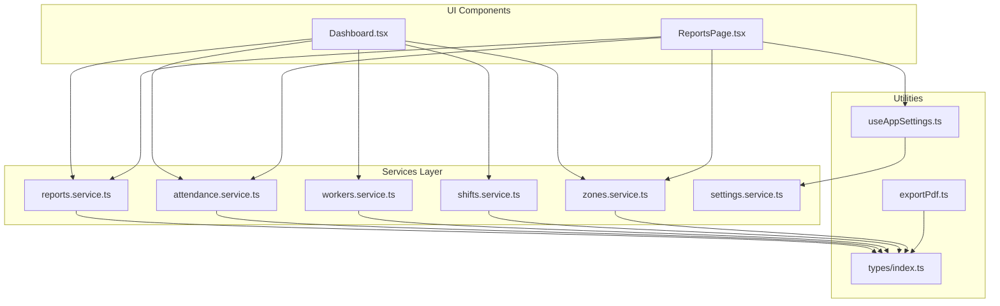
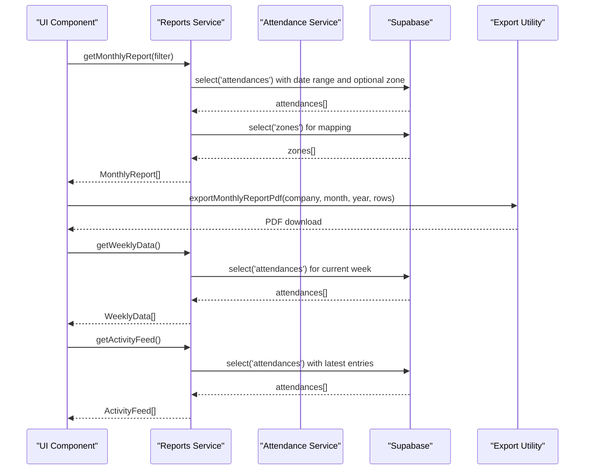
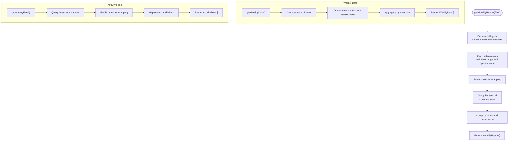
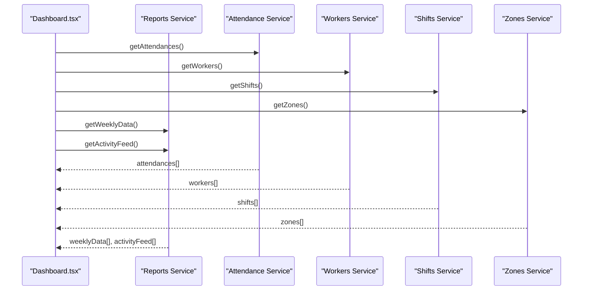
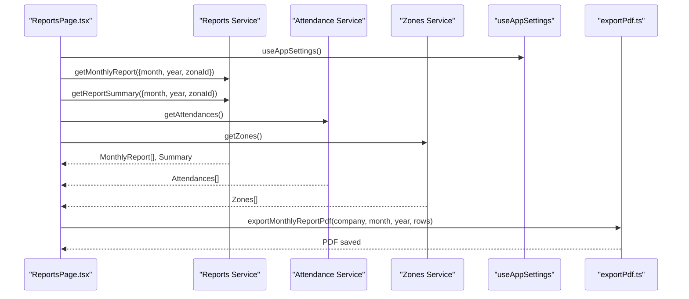
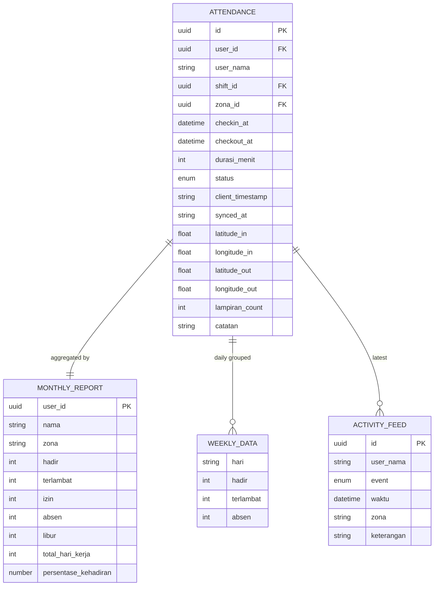
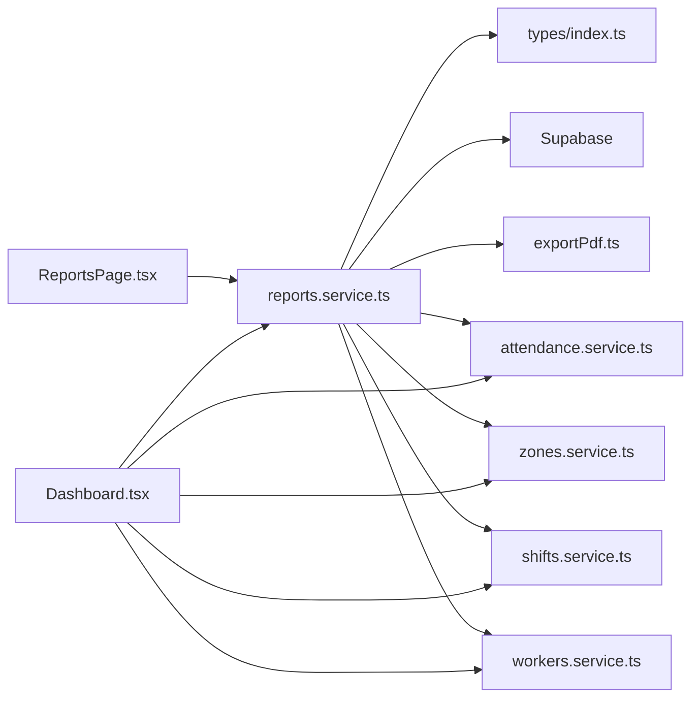

# Reports & Analytics Service

<cite>
**Referenced Files in This Document**
- [reports.service.ts](file://src/services/reports.service.ts)
- [Dashboard.tsx](file://src/components/admin/Dashboard.tsx)
- [ReportsPage.tsx](file://src/components/admin/ReportsPage.tsx)
- [exportPdf.ts](file://src/utils/exportPdf.ts)
- [index.ts](file://src/types/index.ts)
- [attendance.service.ts](file://src/services/attendance.service.ts)
- [workers.service.ts](file://src/services/workers.service.ts)
- [shifts.service.ts](file://src/services/shifts.service.ts)
- [zones.service.ts](file://src/services/zones.service.ts)
- [useAppSettings.ts](file://src/hooks/useAppSettings.ts)
- [settings.service.ts](file://src/services/settings.service.ts)
</cite>

## Table of Contents
1. [Introduction](#introduction)
2. [Project Structure](#project-structure)
3. [Core Components](#core-components)
4. [Architecture Overview](#architecture-overview)
5. [Detailed Component Analysis](#detailed-component-analysis)
6. [Dependency Analysis](#dependency-analysis)
7. [Performance Considerations](#performance-considerations)
8. [Troubleshooting Guide](#troubleshooting-guide)
9. [Conclusion](#conclusion)

## Introduction
This document describes the Reports and Analytics Service responsible for generating dashboard widgets, statistical calculations, and data aggregation for attendance monitoring. It covers report generation methods, data filtering, time range selection, export functionality, analytics calculations, KPI computations, trend analysis, and performance metrics. The service integrates with attendance data, worker statistics, and administrative reporting requirements, providing both real-time dashboards and downloadable reports.

## Project Structure
The Reports and Analytics Service is implemented primarily in the services layer and consumed by administrative UI components. Key areas:
- Services: reports, attendance, workers, shifts, zones, settings
- UI Components: Dashboard, Reports page
- Utilities: PDF export helpers
- Types: shared data models and service result types

**Diagram sources**
- [reports.service.ts:1-171](file://src/services/reports.service.ts#L1-L171)
- [Dashboard.tsx:1-283](file://src/components/admin/Dashboard.tsx#L1-L283)
- [ReportsPage.tsx:1-232](file://src/components/admin/ReportsPage.tsx#L1-L232)
- [exportPdf.ts:1-109](file://src/utils/exportPdf.ts#L1-L109)
- [index.ts:1-182](file://src/types/index.ts#L1-L182)
- [useAppSettings.ts:1-45](file://src/hooks/useAppSettings.ts#L1-L45)
- [settings.service.ts:1-34](file://src/services/settings.service.ts#L1-L34)

**Section sources**
- [reports.service.ts:1-171](file://src/services/reports.service.ts#L1-L171)
- [Dashboard.tsx:1-283](file://src/components/admin/Dashboard.tsx#L1-L283)
- [ReportsPage.tsx:1-232](file://src/components/admin/ReportsPage.tsx#L1-L232)
- [exportPdf.ts:1-109](file://src/utils/exportPdf.ts#L1-L109)
- [index.ts:1-182](file://src/types/index.ts#L1-L182)
- [useAppSettings.ts:1-45](file://src/hooks/useAppSettings.ts#L1-L45)
- [settings.service.ts:1-34](file://src/services/settings.service.ts#L1-L34)

## Core Components
- Reports Service: Provides monthly reports, weekly data, activity feeds, and summary KPIs.
- Dashboard: Real-time widgets for today’s attendance, weekly trends, recent activity, and active shifts.
- Reports Page: Filters, charts, summaries, and export capabilities for monthly reports.
- Export Utilities: PDF generation for monthly and daily attendance reports.
- Data Services: Attendance, workers, shifts, zones, and settings services supply supporting data.

Key responsibilities:
- Aggregate attendance records by user and zone.
- Compute KPIs such as presence percentage, totals, and averages.
- Render interactive charts and tables.
- Export reports to PDF with company branding.

**Section sources**
- [reports.service.ts:16-171](file://src/services/reports.service.ts#L16-L171)
- [Dashboard.tsx:72-283](file://src/components/admin/Dashboard.tsx#L72-L283)
- [ReportsPage.tsx:12-232](file://src/components/admin/ReportsPage.tsx#L12-L232)
- [exportPdf.ts:9-109](file://src/utils/exportPdf.ts#L9-L109)

## Architecture Overview
The Reports and Analytics Service follows a layered architecture:
- UI Components render widgets and pages.
- Services encapsulate data fetching and computation.
- Supabase provides backend data storage and retrieval.
- Utilities handle export formatting.

**Diagram sources**
- [reports.service.ts:16-145](file://src/services/reports.service.ts#L16-L145)
- [exportPdf.ts:9-43](file://src/utils/exportPdf.ts#L9-L43)

## Detailed Component Analysis

### Reports Service
The Reports Service orchestrates report generation and analytics:
- Monthly Report: Filters by month/year and optional zone, aggregates counts per user, computes presence percentage, and returns structured MonthlyReport data.
- Weekly Data: Computes daily totals for present, late, and absent statuses for the current week.
- Activity Feed: Retrieves recent attendance events with zone mapping and event categorization.
- Report Summary: Aggregates totals and average presence across the monthly report.

**Diagram sources**
- [reports.service.ts:16-81](file://src/services/reports.service.ts#L16-L81)
- [reports.service.ts:83-110](file://src/services/reports.service.ts#L83-L110)
- [reports.service.ts:112-145](file://src/services/reports.service.ts#L112-L145)

**Section sources**
- [reports.service.ts:4-81](file://src/services/reports.service.ts#L4-L81)
- [reports.service.ts:83-110](file://src/services/reports.service.ts#L83-L110)
- [reports.service.ts:112-145](file://src/services/reports.service.ts#L112-L145)
- [reports.service.ts:147-171](file://src/services/reports.service.ts#L147-L171)

### Dashboard Widgets
The Dashboard component renders real-time widgets:
- Today’s stats: total workers, present, late, absent computed from attendance records.
- Presence distribution: pie chart showing present/late/absent ratios.
- Weekly trends: bar chart of daily presence for the current week.
- Recent activity: list of recent check-in/out events with time-ago formatting.
- Active shifts: counts per shift for today.

**Diagram sources**
- [Dashboard.tsx:82-148](file://src/components/admin/Dashboard.tsx#L82-L148)
- [reports.service.ts:83-145](file://src/services/reports.service.ts#L83-L145)

**Section sources**
- [Dashboard.tsx:72-283](file://src/components/admin/Dashboard.tsx#L72-L283)

### Reports Page and Export
The Reports Page provides:
- Time range selection: month and year dropdowns.
- Zone filter: optional zone filtering.
- Summary cards: total presence, average presence, total late, total absent.
- Zone comparison chart: bar chart showing presence percentages per zone.
- Monthly report table: detailed counts and presence percentage per worker.
- Export: PDF export of monthly report and placeholder for CSV.

**Diagram sources**
- [ReportsPage.tsx:27-121](file://src/components/admin/ReportsPage.tsx#L27-L121)
- [reports.service.ts:16-81](file://src/services/reports.service.ts#L16-L81)
- [reports.service.ts:147-171](file://src/services/reports.service.ts#L147-L171)
- [exportPdf.ts:9-43](file://src/utils/exportPdf.ts#L9-L43)

**Section sources**
- [ReportsPage.tsx:12-232](file://src/components/admin/ReportsPage.tsx#L12-L232)
- [exportPdf.ts:9-109](file://src/utils/exportPdf.ts#L9-L109)

### Data Models and Types
Shared types define the shape of reports, attendance records, and service results:
- MonthlyReport: aggregated counts and presence percentage per user.
- WeeklyData: daily totals for presence categories.
- ActivityFeed: recent attendance events with mapped zone names.
- ServiceResult: standardized response wrapper for service methods.

**Diagram sources**
- [index.ts:60-118](file://src/types/index.ts#L60-L118)

**Section sources**
- [index.ts:60-118](file://src/types/index.ts#L60-L118)

## Dependency Analysis
The Reports Service depends on:
- Supabase for data retrieval.
- Shared types for data contracts.
- Export utilities for PDF generation.
- Other services for auxiliary data (zones, shifts, workers).

**Diagram sources**
- [reports.service.ts:1-2](file://src/services/reports.service.ts#L1-L2)
- [Dashboard.tsx:4-8](file://src/components/admin/Dashboard.tsx#L4-L8)
- [ReportsPage.tsx:4-8](file://src/components/admin/ReportsPage.tsx#L4-L8)

**Section sources**
- [reports.service.ts:1-2](file://src/services/reports.service.ts#L1-L2)
- [Dashboard.tsx:4-8](file://src/components/admin/Dashboard.tsx#L4-L8)
- [ReportsPage.tsx:4-8](file://src/components/admin/ReportsPage.tsx#L4-L8)

## Performance Considerations
- Efficient date range queries: Monthly and weekly functions compute precise boundaries to minimize dataset size.
- Parallel loading: Dashboard and Reports Page use Promise.all to fetch multiple datasets concurrently.
- Client-side aggregation: Reports Service performs grouping and percentage calculations in memory for responsiveness.
- Chart rendering: Recharts renders responsive charts; ensure large datasets are paginated or filtered to avoid heavy DOM updates.
- Export optimization: PDF generation batches table rows; consider chunking for very large reports.

[No sources needed since this section provides general guidance]

## Troubleshooting Guide
Common issues and resolutions:
- Supabase errors: ServiceResult wraps errors with message and code; check error.code for specific failures (e.g., missing data).
- Missing data: Weekly and activity feeds rely on recent attendance records; ensure records exist for the selected period.
- Filtering anomalies: Verify month/year and zone filters are correctly passed to getMonthlyReport.
- Export failures: Ensure exportPdf receives valid rows and company settings; confirm browser supports jsPDF-autotable.

**Section sources**
- [reports.service.ts:34-36](file://src/services/reports.service.ts#L34-L36)
- [reports.service.ts:95-96](file://src/services/reports.service.ts#L95-L96)
- [reports.service.ts:119-121](file://src/services/reports.service.ts#L119-L121)
- [exportPdf.ts:5-7](file://src/utils/exportPdf.ts#L5-L7)

## Conclusion
The Reports and Analytics Service delivers robust reporting capabilities with real-time dashboards and downloadable exports. It aggregates attendance data efficiently, computes meaningful KPIs, and presents insights through interactive charts. The modular design enables easy extension for additional filters, export formats, and analytics features.