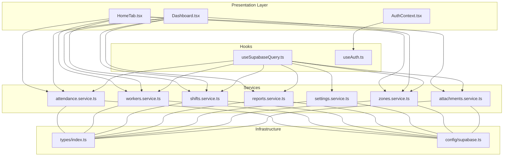
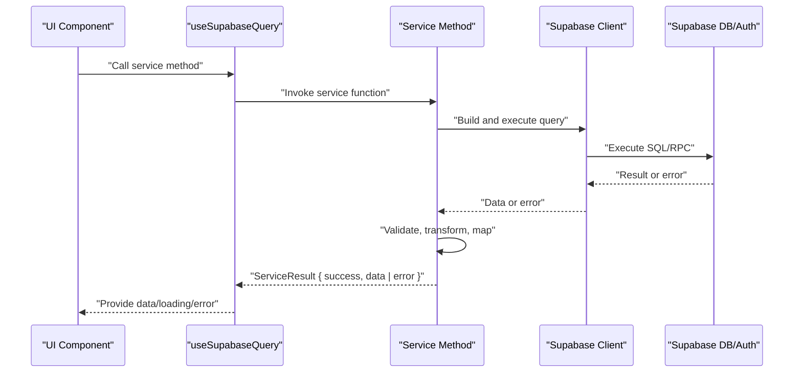
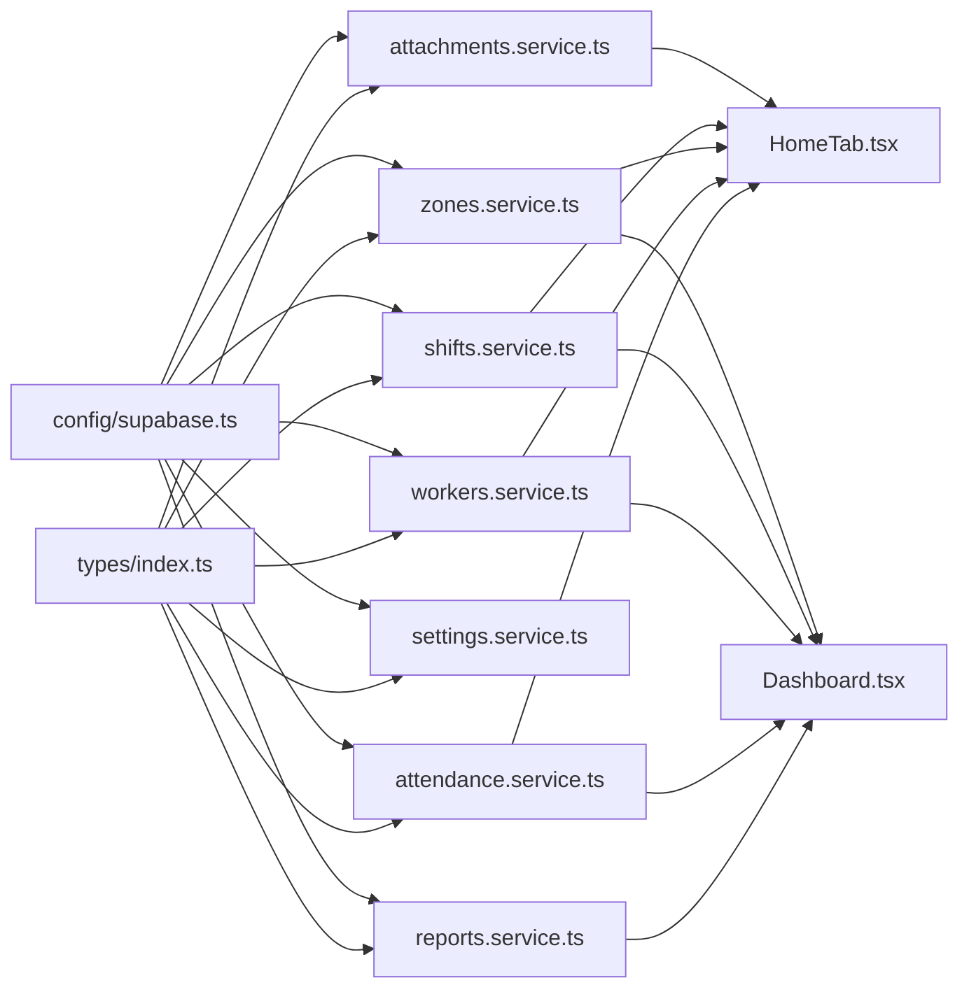

# Service Abstraction Pattern

<cite>
**Referenced Files in This Document**
- [supabase.ts](file://src/config/supabase.ts)
- [index.ts](file://src/types/index.ts)
- [attendance.service.ts](file://src/services/attendance.service.ts)
- [workers.service.ts](file://src/services/workers.service.ts)
- [shifts.service.ts](file://src/services/shifts.service.ts)
- [reports.service.ts](file://src/services/reports.service.ts)
- [settings.service.ts](file://src/services/settings.service.ts)
- [zones.service.ts](file://src/services/zones.service.ts)
- [attachments.service.ts](file://src/services/attachments.service.ts)
- [useSupabaseQuery.ts](file://src/hooks/useSupabaseQuery.ts)
- [useAuth.ts](file://src/hooks/useAuth.ts)
- [AuthContext.tsx](file://src/context/AuthContext.tsx)
- [HomeTab.tsx](file://src/components/pwa/HomeTab.tsx)
- [Dashboard.tsx](file://src/components/admin/Dashboard.tsx)
</cite>

## Table of Contents
1. [Introduction](#introduction)
2. [Project Structure](#project-structure)
3. [Core Components](#core-components)
4. [Architecture Overview](#architecture-overview)
5. [Detailed Component Analysis](#detailed-component-analysis)
6. [Dependency Analysis](#dependency-analysis)
7. [Performance Considerations](#performance-considerations)
8. [Troubleshooting Guide](#troubleshooting-guide)
9. [Conclusion](#conclusion)

## Introduction
This document explains the service abstraction pattern implemented in AbsensiOnline. Services encapsulate data access logic and business operations behind clean, typed interfaces, enabling components to remain focused on presentation while promoting separation of concerns, testability, and maintainability. The implementation integrates with Supabase for database and authentication operations, enforces parameter validation, and standardizes error handling via a unified ServiceResult type. It covers CRUD operations, query construction patterns, data transformation, and API response processing across attendance, workers, shifts, reports, settings, zones, and attachments domains.

## Project Structure
The service abstraction resides primarily under src/services, with shared types under src/types and a centralized Supabase client under src/config. UI components consume services through hooks and contexts, ensuring a clear boundary between presentation and data logic.

**Diagram sources**
- [HomeTab.tsx:1-817](file://src/components/pwa/HomeTab.tsx#L1-L817)
- [Dashboard.tsx:1-283](file://src/components/admin/Dashboard.tsx#L1-L283)
- [AuthContext.tsx:1-43](file://src/context/AuthContext.tsx#L1-L43)
- [useSupabaseQuery.ts:1-48](file://src/hooks/useSupabaseQuery.ts#L1-L48)
- [useAuth.ts:1-115](file://src/hooks/useAuth.ts#L1-L115)
- [attendance.service.ts:1-188](file://src/services/attendance.service.ts#L1-L188)
- [workers.service.ts:1-133](file://src/services/workers.service.ts#L1-L133)
- [shifts.service.ts:1-54](file://src/services/shifts.service.ts#L1-L54)
- [reports.service.ts:1-171](file://src/services/reports.service.ts#L1-L171)
- [settings.service.ts:1-34](file://src/services/settings.service.ts#L1-L34)
- [zones.service.ts:1-50](file://src/services/zones.service.ts#L1-L50)
- [attachments.service.ts:1-127](file://src/services/attachments.service.ts#L1-L127)
- [index.ts:1-182](file://src/types/index.ts#L1-L182)
- [supabase.ts:1-7](file://src/config/supabase.ts#L1-L7)

**Section sources**
- [supabase.ts:1-7](file://src/config/supabase.ts#L1-L7)
- [index.ts:1-182](file://src/types/index.ts#L1-L182)

## Core Components
- Supabase client: Centralized client initialization for database and auth operations.
- ServiceResult type: Unified response envelope for all service methods, carrying either success data or error details.
- Domain services: Attendance, Workers, Shifts, Reports, Settings, Zones, Attachments, each exposing domain-specific methods with validation and standardized error handling.
- Hooks and context: useSupabaseQuery for reactive data fetching and useAuth for authentication state management.

Benefits of the pattern:
- Separation of concerns: UI components depend on service interfaces, not on raw Supabase queries.
- Testability: Services can be mocked independently; unit tests can assert on ServiceResult shapes.
- Maintainability: Changes to data access logic are localized within services; UI remains unchanged.

**Section sources**
- [supabase.ts:1-7](file://src/config/supabase.ts#L1-L7)
- [index.ts:137-141](file://src/types/index.ts#L137-L141)
- [useSupabaseQuery.ts:1-48](file://src/hooks/useSupabaseQuery.ts#L1-L48)

## Architecture Overview
The service layer sits between UI components and the Supabase client. Components call service methods, which construct queries, apply validations, and transform data into domain models. Errors are normalized into ServiceResult format, enabling consistent error handling in UI.

**Diagram sources**
- [useSupabaseQuery.ts:11-47](file://src/hooks/useSupabaseQuery.ts#L11-L47)
- [attendance.service.ts:16-23](file://src/services/attendance.service.ts#L16-L23)
- [workers.service.ts:20-28](file://src/services/workers.service.ts#L20-L28)
- [supabase.ts:1-7](file://src/config/supabase.ts#L1-L7)

## Detailed Component Analysis

### Attendance Service
Responsibilities:
- Retrieve attendance records, submit check-in/check-out, compute durations, and build history with shift metadata.
- Provide status label/color helpers and update attendance status.

Key methods and patterns:
- Query construction: select, order, eq, gte/lte, single, limit.
- Data transformation: map raw rows to HistoryRecord with computed fields and shift name resolution.
- Error handling: normalize Supabase errors into ServiceResult; handle "not found" gracefully.

Method signature examples (paths):
- [getAttendances:16-23](file://src/services/attendance.service.ts#L16-L23)
- [submitCheckIn:25-46](file://src/services/attendance.service.ts#L25-L46)
- [submitCheckOut:48-77](file://src/services/attendance.service.ts#L48-L77)
- [getTodayAttendance:79-112](file://src/services/attendance.service.ts#L79-L112)
- [getHistory:132-159](file://src/services/attendance.service.ts#L132-L159)
- [updateAttendanceStatus:171-187](file://src/services/attendance.service.ts#L171-L187)

Validation and transformation:
- Duration calculation from timestamps.
- Status label/color mapping via internal helpers.

Usage in UI:
- HomeTab integrates check-in/out, GPS checks, offline queue, and attachment uploads.
- Dashboard consumes attendance data for statistics.

**Section sources**
- [attendance.service.ts:1-188](file://src/services/attendance.service.ts#L1-L188)
- [HomeTab.tsx:1-817](file://src/components/pwa/HomeTab.tsx#L1-L817)
- [Dashboard.tsx:1-283](file://src/components/admin/Dashboard.tsx#L1-L283)

### Workers Service
Responsibilities:
- Manage worker profiles, validate inputs, and delegate auth operations to Supabase Edge Functions.
- Enforce phone number uniqueness and PIN constraints.

Key methods and patterns:
- Validation helpers for worker data and PIN.
- Call Edge Function admin-user for auth operations (create/reset/delete).
- Fetch and update worker records with integrity checks.

Method signature examples (paths):
- [getWorkers:20-28](file://src/services/workers.service.ts#L20-L28)
- [getWorkerById:30-34](file://src/services/workers.service.ts#L30-L34)
- [createWorker:54-91](file://src/services/workers.service.ts#L54-L91)
- [updateWorker:93-112](file://src/services/workers.service.ts#L93-L112)
- [resetWorkerPin:114-121](file://src/services/workers.service.ts#L114-L121)
- [deleteWorker:123-132](file://src/services/workers.service.ts#L123-L132)

**Section sources**
- [workers.service.ts:1-133](file://src/services/workers.service.ts#L1-L133)

### Shifts Service
Responsibilities:
- CRUD operations for shift definitions with validation for timing and tolerance.

Method signature examples (paths):
- [getShifts:4-8](file://src/services/shifts.service.ts#L4-L8)
- [getShiftById:10-14](file://src/services/shifts.service.ts#L10-L14)
- [createShift:33-39](file://src/services/shifts.service.ts#L33-L39)
- [updateShift:41-47](file://src/services/shifts.service.ts#L41-L47)
- [deleteShift:49-53](file://src/services/shifts.service.ts#L49-L53)

Validation:
- Tolerance minutes range and time format validation.

**Section sources**
- [shifts.service.ts:1-54](file://src/services/shifts.service.ts#L1-L54)

### Reports Service
Responsibilities:
- Generate monthly attendance reports, weekly summaries, and activity feeds.
- Aggregate and compute metrics like presence percentages.

Method signature examples (paths):
- [getMonthlyReport:16-81](file://src/services/reports.service.ts#L16-L81)
- [getWeeklyData:83-110](file://src/services/reports.service.ts#L83-L110)
- [getActivityFeed:112-145](file://src/services/reports.service.ts#L112-L145)
- [getReportSummary:147-170](file://src/services/reports.service.ts#L147-L170)

Processing logic:
- Build dynamic queries with optional filters.
- Map zone IDs to names and aggregate counts.
- Compute presence percentage and weekly distributions.

**Section sources**
- [reports.service.ts:1-171](file://src/services/reports.service.ts#L1-L171)

### Settings Service
Responsibilities:
- Retrieve and update application settings with fallback to defaults.
- Integrate with environment variables for external service status.

Method signature examples (paths):
- [getAppSettings:5-14](file://src/services/settings.service.ts#L5-L14)
- [updateAppSettings:16-27](file://src/services/settings.service.ts#L16-L27)
- [getIntegrationStatus:29-34](file://src/services/settings.service.ts#L29-L34)

**Section sources**
- [settings.service.ts:1-34](file://src/services/settings.service.ts#L1-L34)

### Zones Service
Responsibilities:
- CRUD operations for geofencing zones with validation for coordinates and radius.

Method signature examples (paths):
- [getZones:4-8](file://src/services/zones.service.ts#L4-L8)
- [getZoneById:10-14](file://src/services/zones.service.ts#L10-L14)
- [createZone:29-35](file://src/services/zones.service.ts#L29-L35)
- [updateZone:37-43](file://src/services/zones.service.ts#L37-L43)
- [deleteZone:45-49](file://src/services/zones.service.ts#L45-L49)

Validation:
- Latitude/longitude ranges and radius bounds.

**Section sources**
- [zones.service.ts:1-50](file://src/services/zones.service.ts#L1-L50)

### Attachments Service
Responsibilities:
- Manage attachments associated with attendance records, including verification and deletion.
- Integrate with Cloudinary via Supabase Edge Functions for remote deletions.

Method signature examples (paths):
- [getAttachmentsByAttendance:48-56](file://src/services/attachments.service.ts#L48-L56)
- [getAttachmentsByUser:58-66](file://src/services/attachments.service.ts#L58-L66)
- [createAttachment:68-75](file://src/services/attachments.service.ts#L68-L75)
- [deleteAttachment:77-81](file://src/services/attachments.service.ts#L77-L81)
- [updateAttachmentVerification:83-94](file://src/services/attachments.service.ts#L83-L94)
- [rejectAndDeleteAttachment:96-110](file://src/services/attachments.service.ts#L96-L110)
- [incrementLampiranCount:112-127](file://src/services/attachments.service.ts#L112-L127)

Cloudinary integration:
- Extract public IDs from URLs and call cloudinary-delete function.

**Section sources**
- [attachments.service.ts:1-127](file://src/services/attachments.service.ts#L1-L127)

### Supabase Client Integration
- Initialization: createClient with VITE_SUPABASE_URL and VITE_SUPABASE_ANON_KEY.
- Usage: All services import the singleton client and use .from(table).select/update/insert/delete/rpc patterns.
- Authentication: Used for session hydration and auth state change subscriptions.

**Section sources**
- [supabase.ts:1-7](file://src/config/supabase.ts#L1-L7)
- [useAuth.ts:1-115](file://src/hooks/useAuth.ts#L1-L115)

### Query Construction Patterns
- Selective retrieval: .select(fields).order(field, options).eq(field, value).gte/lte(range).single().limit(n).
- Upserts and updates: .update(payload).eq(key, value).select().single().
- Inserts: .insert(payload).select().single().
- RPC calls: .rpc(functionName, params).maybeSingle().

Examples:
- [getAttendances:16-23](file://src/services/attendance.service.ts#L16-L23)
- [getTodayAttendance:79-112](file://src/services/attendance.service.ts#L79-L112)
- [getMonthlyReport:24-34](file://src/services/reports.service.ts#L24-L34)
- [getWorkerById:30-34](file://src/services/workers.service.ts#L30-L34)

**Section sources**
- [attendance.service.ts:16-112](file://src/services/attendance.service.ts#L16-L112)
- [reports.service.ts:24-34](file://src/services/reports.service.ts#L24-L34)
- [workers.service.ts:30-34](file://src/services/workers.service.ts#L30-L34)

### Error Handling Strategies
- Normalize errors: All services return ServiceResult<T>, capturing error message and optional code.
- Graceful handling: "not found" scenarios (e.g., PGRST116) return success with null or default data.
- UI propagation: useSupabaseQuery reads result.success to set data or error state.

Patterns:
- [ServiceResult:137-141](file://src/types/index.ts#L137-L141)
- [getAppSettings fallback:8-11](file://src/services/settings.service.ts#L8-L11)
- [getTodayAttendance handling:96-98](file://src/services/attendance.service.ts#L96-L98)

**Section sources**
- [index.ts:137-141](file://src/types/index.ts#L137-L141)
- [settings.service.ts:8-11](file://src/services/settings.service.ts#L8-L11)
- [attendance.service.ts:96-98](file://src/services/attendance.service.ts#L96-L98)

### Data Transformation and API Response Processing
- Transform raw DB rows into domain models (e.g., HistoryRecord).
- Resolve foreign keys (shift names, zone names) via pre-fetched metadata.
- Compute derived fields (duration, percentages) in service layer.

Example:
- [getHistory mapping:132-159](file://src/services/attendance.service.ts#L132-L159)
- [getMonthlyReport aggregation:41-78](file://src/services/reports.service.ts#L41-L78)

**Section sources**
- [attendance.service.ts:132-159](file://src/services/attendance.service.ts#L132-L159)
- [reports.service.ts:41-78](file://src/services/reports.service.ts#L41-L78)

### Parameter Validation and Return Value Formatting
- Validation helpers enforce business rules (phone length, PIN constraints, coordinate ranges).
- Return value formatting ensures consistent field names and types across UI consumers.

Examples:
- [validateWorker:36-46](file://src/services/workers.service.ts#L36-L46)
- [validatePin:48-52](file://src/services/workers.service.ts#L48-L52)
- [validateZone:16-27](file://src/services/zones.service.ts#L16-L27)
- [validateShift:16-31](file://src/services/shifts.service.ts#L16-L31)

**Section sources**
- [workers.service.ts:36-52](file://src/services/workers.service.ts#L36-L52)
- [zones.service.ts:16-27](file://src/services/zones.service.ts#L16-L27)
- [shifts.service.ts:16-31](file://src/services/shifts.service.ts#L16-L31)

## Dependency Analysis
The service layer depends on:
- Supabase client for database and auth operations.
- Shared types for domain models and ServiceResult.
- Environment variables for Supabase and Cloudinary integration.

**Diagram sources**
- [index.ts:1-182](file://src/types/index.ts#L1-L182)
- [supabase.ts:1-7](file://src/config/supabase.ts#L1-L7)
- [attendance.service.ts:1-188](file://src/services/attendance.service.ts#L1-L188)
- [workers.service.ts:1-133](file://src/services/workers.service.ts#L1-L133)
- [shifts.service.ts:1-54](file://src/services/shifts.service.ts#L1-L54)
- [reports.service.ts:1-171](file://src/services/reports.service.ts#L1-L171)
- [settings.service.ts:1-34](file://src/services/settings.service.ts#L1-L34)
- [zones.service.ts:1-50](file://src/services/zones.service.ts#L1-L50)
- [attachments.service.ts:1-127](file://src/services/attachments.service.ts#L1-L127)
- [HomeTab.tsx:1-817](file://src/components/pwa/HomeTab.tsx#L1-L817)
- [Dashboard.tsx:1-283](file://src/components/admin/Dashboard.tsx#L1-L283)

**Section sources**
- [index.ts:1-182](file://src/types/index.ts#L1-L182)
- [supabase.ts:1-7](file://src/config/supabase.ts#L1-L7)

## Performance Considerations
- Batch queries: Use Promise.all to fetch related data concurrently (e.g., zones and shifts in HomeTab).
- Efficient filtering: Apply gte/lte and eq early to reduce dataset size.
- Minimal selects: Request only required fields to reduce payload size.
- Memoization: Cache small datasets (zones, shifts) in component state to avoid repeated fetches.
- Debounced refresh: Auto-refresh intervals in dashboards prevent excessive polling.

[No sources needed since this section provides general guidance]

## Troubleshooting Guide
Common issues and resolutions:
- Authentication failures: Verify VITE_SUPABASE_URL and VITE_SUPABASE_ANON_KEY; ensure Edge Functions are deployed.
- Validation errors: Review service-side validation messages for phone, PIN, and coordinate constraints.
- Not found errors: Some APIs return success with null for "not found"; handle gracefully in UI.
- Network errors: useSupabaseQuery surfaces errors; implement retry and offline queue strategies.

**Section sources**
- [useSupabaseQuery.ts:22-41](file://src/hooks/useSupabaseQuery.ts#L22-L41)
- [workers.service.ts:58-62](file://src/services/workers.service.ts#L58-L62)
- [zones.service.ts:16-27](file://src/services/zones.service.ts#L16-L27)
- [shifts.service.ts:16-31](file://src/services/shifts.service.ts#L16-L31)

## Conclusion
AbsensiOnline’s service abstraction pattern cleanly separates data access and business logic from UI concerns. By leveraging a unified ServiceResult type, robust validation, and consistent query patterns, the system achieves improved maintainability, testability, and reliability. Supabase integration is centralized, and services provide predictable interfaces for components, enabling scalable development and clear error handling across the application.