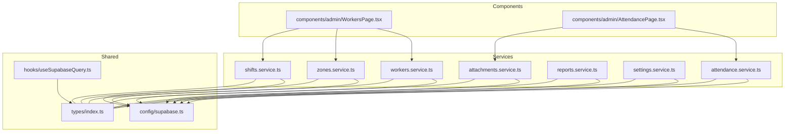
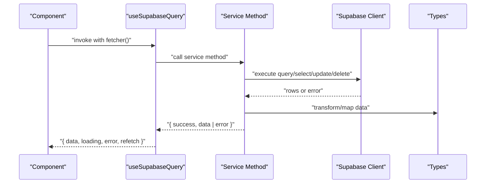
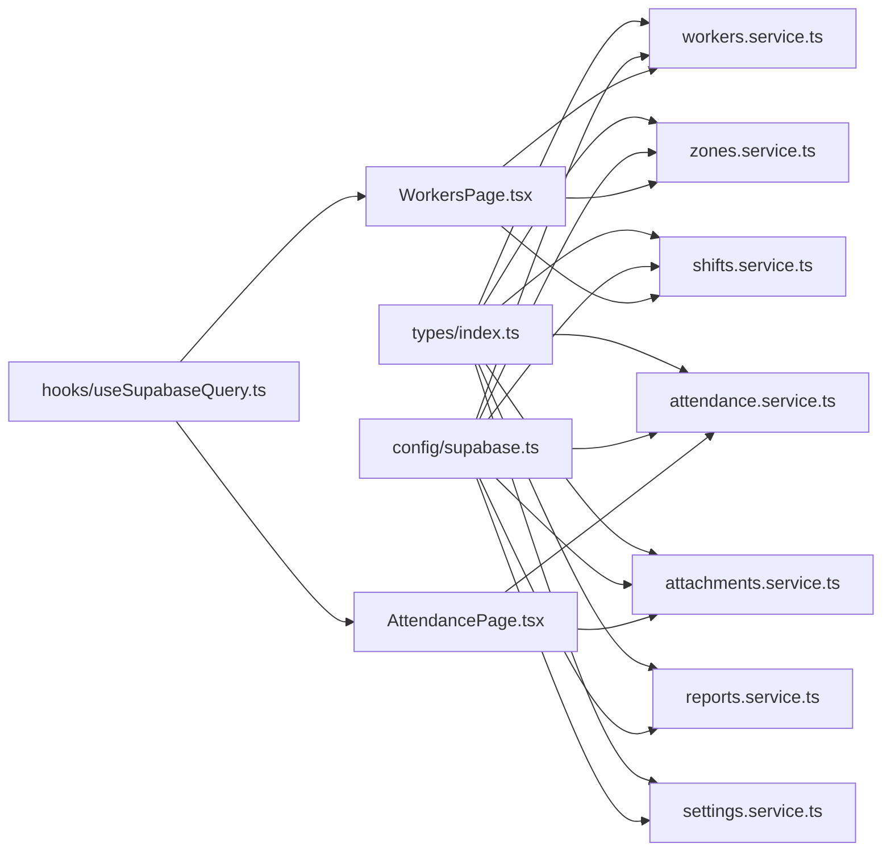

# Service Layer Architecture

<cite>
**Referenced Files in This Document**
- [attendance.service.ts](file://src/services/attendance.service.ts)
- [workers.service.ts](file://src/services/workers.service.ts)
- [shifts.service.ts](file://src/services/shifts.service.ts)
- [zones.service.ts](file://src/services/zones.service.ts)
- [reports.service.ts](file://src/services/reports.service.ts)
- [settings.service.ts](file://src/services/settings.service.ts)
- [attachments.service.ts](file://src/services/attachments.service.ts)
- [useSupabaseQuery.ts](file://src/hooks/useSupabaseQuery.ts)
- [supabase.ts](file://src/config/supabase.ts)
- [index.ts](file://src/types/index.ts)
- [WorkersPage.tsx](file://src/components/admin/WorkersPage.tsx)
- [AttendancePage.tsx](file://src/components/admin/AttendancePage.tsx)
</cite>

## Table of Contents
1. [Introduction](#introduction)
2. [Project Structure](#project-structure)
3. [Core Components](#core-components)
4. [Architecture Overview](#architecture-overview)
5. [Detailed Component Analysis](#detailed-component-analysis)
6. [Dependency Analysis](#dependency-analysis)
7. [Performance Considerations](#performance-considerations)
8. [Troubleshooting Guide](#troubleshooting-guide)
9. [Conclusion](#conclusion)
10. [Appendices](#appendices)

## Introduction
This document describes the service layer architecture of AbsensiOnline, focusing on how data access and business logic are encapsulated behind a clean abstraction pattern. Each service module exposes typed methods for CRUD operations against Supabase tables, handles validation and transformation, and returns a unified result type. The architecture integrates Supabase for real-time data and authentication, uses a custom React hook for reactive data fetching, and provides structured error handling and status mapping utilities.

## Project Structure
The service layer resides under src/services and is complemented by shared types, a Supabase client configuration, and a custom React hook for queries. Components consume services to render UI and orchestrate user actions.

**Diagram sources**
- [attendance.service.ts:1-188](file://src/services/attendance.service.ts#L1-L188)
- [workers.service.ts:1-133](file://src/services/workers.service.ts#L1-L133)
- [shifts.service.ts:1-54](file://src/services/shifts.service.ts#L1-L54)
- [zones.service.ts:1-50](file://src/services/zones.service.ts#L1-L50)
- [reports.service.ts:1-171](file://src/services/reports.service.ts#L1-L171)
- [settings.service.ts:1-34](file://src/services/settings.service.ts#L1-L34)
- [attachments.service.ts:1-127](file://src/services/attachments.service.ts#L1-L127)
- [useSupabaseQuery.ts:1-48](file://src/hooks/useSupabaseQuery.ts#L1-L48)
- [supabase.ts:1-7](file://src/config/supabase.ts#L1-L7)
- [index.ts:1-182](file://src/types/index.ts#L1-L182)
- [WorkersPage.tsx:1-200](file://src/components/admin/WorkersPage.tsx#L1-L200)
- [AttendancePage.tsx:1-200](file://src/components/admin/AttendancePage.tsx#L1-L200)

**Section sources**
- [supabase.ts:1-7](file://src/config/supabase.ts#L1-L7)
- [index.ts:1-182](file://src/types/index.ts#L1-L182)
- [useSupabaseQuery.ts:1-48](file://src/hooks/useSupabaseQuery.ts#L1-L48)

## Core Components
- Supabase client configured with environment variables for URL and anonymous key.
- Unified ServiceResult<T> type for consistent success/error responses across services.
- Validation helpers embedded in services to enforce domain rules before database operations.
- Transformation utilities for status labels and colors, and for report aggregation.

Key abstractions:
- ServiceResult<T>: Normalized shape for all service responses.
- Service methods: Encapsulate Supabase queries, validations, and transformations.
- useSupabaseQuery<T>: React hook for reactive data fetching with loading/error states.

**Section sources**
- [supabase.ts:1-7](file://src/config/supabase.ts#L1-L7)
- [index.ts:137-140](file://src/types/index.ts#L137-L140)
- [useSupabaseQuery.ts:4-9](file://src/hooks/useSupabaseQuery.ts#L4-L9)

## Architecture Overview
The service layer follows a functional pattern:
- Each service file exports pure functions that accept typed parameters and return ServiceResult<T>.
- Supabase client is injected via a centralized module.
- Components call services and handle UI state updates based on ServiceResult outcomes.
- Validation occurs at the service boundary to prevent invalid writes.
- Transformations (e.g., status mapping, report aggregation) occur within services to keep components presentation-focused.

**Diagram sources**
- [useSupabaseQuery.ts:11-47](file://src/hooks/useSupabaseQuery.ts#L11-L47)
- [attendance.service.ts:16-23](file://src/services/attendance.service.ts#L16-L23)
- [index.ts:137-140](file://src/types/index.ts#L137-L140)

## Detailed Component Analysis

### Attendance Service
Responsibilities:
- Retrieve all attendance records with ordering.
- Submit check-in with optional client-generated ID and GPS coordinates.
- Submit check-out with duration calculation and GPS coordinates.
- Fetch today’s attendance for a worker.
- Map status labels and colors for UI rendering.
- Build history records enriched with shift names.
- Update attendance status with optional note.

Methods and signatures:
- getAttendances(): Promise<ServiceResult<Attendance[]>>
- submitCheckIn(payload: CheckInPayload): Promise<ServiceResult<{ attendanceId: string }>>
- submitCheckOut(attendanceId: string, payload: { lat: number; lng: number; timestamp: string }): Promise<ServiceResult<void>>
- getTodayAttendance(workerId: string): Promise<ServiceResult<{ id: string; timestamp: string; checkOutAt: string | null } | null>>
- getHistory(userId: string): Promise<ServiceResult<HistoryRecord[]>>
- updateAttendanceStatus(attendanceId: string, payload: { status: AttendanceStatus; catatan?: string }): Promise<ServiceResult<Attendance>>
- getStatusLabel(status: AttendanceStatus): string
- getStatusColor(status: AttendanceStatus): string

Data structures:
- CheckInPayload: Includes worker identity, zone, shift, timestamps, and optional client attendanceId.
- AttendanceStatus: Union of allowed statuses.
- HistoryRecord: Enriched record combining attendance and shift name.

Supabase integration patterns:
- Select with ordering and filtering.
- Insert with computed fields and optional client ID.
- Update with derived duration and GPS coordinates.
- Join-like enrichment using secondary selects and Map-based lookups.

Error handling:
- Returns ServiceResult with success flag and error message/code.
- Gracefully handles “not found” cases using Supabase error codes.

Caching and transformation:
- No client-side cache; relies on Supabase for data freshness.
- Transformations include status label/color mapping and report-style aggregation.

Testing strategies:
- Mock Supabase client with jest.fn() for select/update/insert/delete.
- Test validation paths and error branches.
- Snapshot tests for transformed data shapes.

**Section sources**
- [attendance.service.ts:1-188](file://src/services/attendance.service.ts#L1-L188)
- [index.ts:60-78](file://src/types/index.ts#L60-L78)
- [index.ts:170-181](file://src/types/index.ts#L170-L181)

### Workers Service
Responsibilities:
- List workers excluding super admins, ordered by name.
- Retrieve worker by ID.
- Create worker with PIN provisioning via Supabase Edge Function.
- Update worker with validation and uniqueness checks.
- Reset worker PIN via Edge Function.
- Delete worker with cascading auth deletion via Edge Function.

Methods and signatures:
- getWorkers(): Promise<ServiceResult<User[]>>
- getWorkerById(id: string): Promise<ServiceResult<User>>
- createWorker(worker: Omit<User, 'id'>, pin: string): Promise<ServiceResult<User>>
- updateWorker(id: string, worker: Partial<User>): Promise<ServiceResult<User>>
- resetWorkerPin(userId: string, pin: string): Promise<ServiceResult<void>>
- deleteWorker(id: string): Promise<ServiceResult<void>>

Validation:
- Validates name presence and phone number format.
- Validates PIN length and numeric constraints.
- Uniqueness checks for phone numbers during create and update.

Edge Functions:
- Calls admin-user Edge Function for auth operations.
- Uses session access token and anon key for authorization.

Error handling:
- Returns ServiceResult with normalized errors.
- Propagates auth function errors.

Testing strategies:
- Mock fetch for Edge Function calls.
- Mock Supabase auth and DB operations.
- Verify validation logic and uniqueness constraints.

**Section sources**
- [workers.service.ts:1-133](file://src/services/workers.service.ts#L1-L133)
- [index.ts:32-46](file://src/types/index.ts#L32-L46)

### Shifts Service
Responsibilities:
- List shifts ordered by name.
- Retrieve shift by ID.
- Create, update, and delete shifts with validation.

Methods and signatures:
- getShifts(): Promise<ServiceResult<Shift[]>>
- getShiftById(id: string): Promise<ServiceResult<Shift>>
- createShift(shift: Omit<Shift, 'id'>): Promise<ServiceResult<Shift>>
- updateShift(id: string, shift: Partial<Shift>): Promise<ServiceResult<Shift>>
- deleteShift(id: string): Promise<ServiceResult<void>>

Validation:
- Toleransi (tolerance) minutes constrained to 0–120.
- Start/end times validated for HH:MM format and range.

Testing strategies:
- Validate time parsing and bounds.
- Test update scenarios with partial fields.

**Section sources**
- [shifts.service.ts:1-54](file://src/services/shifts.service.ts#L1-L54)
- [index.ts:21-30](file://src/types/index.ts#L21-L30)

### Zones Service
Responsibilities:
- List zones ordered by name.
- Retrieve zone by ID.
- Create, update, and delete zones with validation.

Methods and signatures:
- getZones(): Promise<ServiceResult<Zone[]>>
- getZoneById(id: string): Promise<ServiceResult<Zone>>
- createZone(zone: Omit<Zone, 'id'>): Promise<ServiceResult<Zone>>
- updateZone(id: string, zone: Partial<Zone>): Promise<ServiceResult<Zone>>
- deleteZone(id: string): Promise<ServiceResult<void>>

Validation:
- Latitude in [-90, 90], longitude in [-180, 180].
- Radius constrained to (0, 10000] meters.

Testing strategies:
- Boundary checks for geographic ranges.
- Test update with partial fields.

**Section sources**
- [zones.service.ts:1-50](file://src/services/zones.service.ts#L1-L50)
- [index.ts:10-19](file://src/types/index.ts#L10-L19)

### Reports Service
Responsibilities:
- Generate monthly report aggregating attendance by user and status.
- Compute weekly data counts per weekday.
- Build activity feed of recent check-ins.
- Summarize totals and averages.

Methods and signatures:
- getMonthlyReport(filter?: ReportFilter): Promise<ServiceResult<MonthlyReport[]>>
- getWeeklyData(): Promise<ServiceResult<WeeklyData[]>>>
- getActivityFeed(): Promise<ServiceResult<ActivityFeed[]>>>
- getReportSummary(filter?: ReportFilter): Promise<ServiceResult<{ totalHadir: number; avgKehadiran: number; totalTerlambat: number; totalAbsen: number }>>

Filters and computations:
- ReportFilter supports month/year and zone filtering.
- Aggregation uses Map to group and compute totals and percentages.
- Weekly data aligns check-in timestamps to weekday indices.
- Activity feed enriches with zone names.

Testing strategies:
- Unit tests for aggregation logic and percentage rounding.
- Mock Supabase select results and zone maps.

**Section sources**
- [reports.service.ts:1-171](file://src/services/reports.service.ts#L1-L171)
- [index.ts:100-118](file://src/types/index.ts#L100-L118)
- [index.ts:90-98](file://src/types/index.ts#L90-L98)
- [index.ts:80-88](file://src/types/index.ts#L80-L88)

### Settings Service
Responsibilities:
- Retrieve application settings with fallback to defaults when table is missing/unavailable.
- Update application settings with optimistic updates.

Methods and signatures:
- getAppSettings(): Promise<ServiceResult<AppSettings>>
- updateAppSettings(settings: Partial<Omit<AppSettings, 'id' | 'updated_at'>>): Promise<ServiceResult<AppSettings>>
- getIntegrationStatus(): { supabase: boolean; cloudinary: boolean }

Default settings:
- Provides sensible defaults when DB row is absent.

Testing strategies:
- Mock DB single-row retrieval and error codes.
- Verify fallback behavior for missing tables.

**Section sources**
- [settings.service.ts:1-34](file://src/services/settings.service.ts#L1-L34)
- [index.ts:142-167](file://src/types/index.ts#L142-L167)

### Attachments Service
Responsibilities:
- List attachments by attendance or user.
- Create attachment records.
- Delete attachment records.
- Update verification status.
- Reject and delete attachments with Cloudinary cleanup via Edge Function.
- Increment attachment counters on attendance.

Methods and signatures:
- getAttachmentsByAttendance(attendanceId: string): Promise<ServiceResult<Attachment[]>>
- getAttachmentsByUser(userId: string): Promise<ServiceResult<Attachment[]>>
- createAttachment(attachment: Omit<Attachment, 'id' | 'created_at'>): Promise<ServiceResult<Attachment>>
- deleteAttachment(id: string): Promise<ServiceResult<void>>
- updateAttachmentVerification(id: string, status: 'terverifikasi' | 'ditolak'): Promise<ServiceResult<Attachment>>
- rejectAndDeleteAttachment(id: string): Promise<ServiceResult<void>>
- incrementLampiranCount(attendanceId: string): Promise<ServiceResult<void>>

Cloudinary integration:
- Extracts public ID and resource type from Cloudinary URLs.
- Delegates deletion to cloudinary-delete Edge Function.

Testing strategies:
- Mock fetch for Edge Function and Supabase operations.
- Validate URL parsing and error propagation.

**Section sources**
- [attachments.service.ts:1-127](file://src/services/attachments.service.ts#L1-L127)
- [index.ts:48-58](file://src/types/index.ts#L48-L58)

### useSupabaseQuery Hook
Responsibilities:
- Wrap service calls with React state for loading, data, and error.
- Provide refetch callback and dependency array support.
- Guard against stale updates via cancellation flag.

Behavior:
- On mount or dependency change, invokes fetcher() and sets loading.
- On success, sets data; on failure, sets error.
- Returns data, loading, error, and refetch for UI consumption.

Usage pattern:
- Components pass service methods (that return ServiceResult<T>) to this hook.
- Hook normalizes ServiceResult into UI-friendly state.

**Section sources**
- [useSupabaseQuery.ts:1-48](file://src/hooks/useSupabaseQuery.ts#L1-L48)

## Dependency Analysis
- Services depend on a single Supabase client instance and share a common types module.
- Components depend on services for data and on the hook for reactive state.
- Edge Functions are invoked by workers.service.ts and attachments.service.ts for auth and Cloudinary operations.

**Diagram sources**
- [index.ts:1-182](file://src/types/index.ts#L1-L182)
- [supabase.ts:1-7](file://src/config/supabase.ts#L1-L7)
- [useSupabaseQuery.ts:1-48](file://src/hooks/useSupabaseQuery.ts#L1-L48)
- [WorkersPage.tsx:1-200](file://src/components/admin/WorkersPage.tsx#L1-L200)
- [AttendancePage.tsx:1-200](file://src/components/admin/AttendancePage.tsx#L1-L200)

**Section sources**
- [index.ts:1-182](file://src/types/index.ts#L1-L182)
- [supabase.ts:1-7](file://src/config/supabase.ts#L1-L7)
- [useSupabaseQuery.ts:1-48](file://src/hooks/useSupabaseQuery.ts#L1-L48)

## Performance Considerations
- Prefer selective field queries and appropriate ordering to reduce payload sizes.
- Use pagination constants in components to limit rendered lists.
- Avoid unnecessary re-renders by memoizing filtered datasets in components.
- Batch reads/writes where feasible (e.g., loading zones, shifts, and workers together).
- Offload heavy computations (report aggregation) to services to keep components lean.

## Troubleshooting Guide
Common issues and resolutions:
- Supabase errors: Distinguish between “not found” and other errors using error codes; handle gracefully with user feedback.
- Authentication failures: Ensure session exists before calling Edge Functions; verify access tokens and api keys.
- Validation errors: Surface validation messages returned by services to users.
- Network failures: Use the hook’s error state to display retry prompts.

Operational tips:
- Inspect ServiceResult.error and ServiceResult.code for actionable diagnostics.
- For reports, verify that related entities (zones, shifts) are present and selectable.

**Section sources**
- [workers.service.ts:6-18](file://src/services/workers.service.ts#L6-L18)
- [reports.service.ts:10-14](file://src/services/reports.service.ts#L10-L14)
- [settings.service.ts:5-14](file://src/services/settings.service.ts#L5-L14)

## Conclusion
AbsensiOnline’s service layer cleanly separates data access and business logic behind a uniform interface. Supabase is used consistently for persistence and real-time capabilities, while validation and transformation live close to the data boundary. The useSupabaseQuery hook enables reactive UI updates with minimal boilerplate. Together, these patterns promote maintainability, testability, and scalability.

## Appendices

### API and Method Reference Summary
- Attendance Service
  - getAttendances(): ServiceResult<Attendance[]>
  - submitCheckIn(CheckInPayload): ServiceResult<{ attendanceId: string }>
  - submitCheckOut(string, { lat, lng, timestamp }): ServiceResult<void>
  - getTodayAttendance(string): ServiceResult<{ id, timestamp, checkOutAt } | null>
  - getHistory(string): ServiceResult<HistoryRecord[]>
  - updateAttendanceStatus(string, { status, catatan? }): ServiceResult<Attendance>
  - getStatusLabel/Color(AttendanceStatus): string

- Workers Service
  - getWorkers(): ServiceResult<User[]>
  - getWorkerById(string): ServiceResult<User>
  - createWorker(Omit<User,'id'>, string): ServiceResult<User>
  - updateWorker(string, Partial<User>): ServiceResult<User>
  - resetWorkerPin(string, string): ServiceResult<void>
  - deleteWorker(string): ServiceResult<void>

- Shifts Service
  - getShifts(): ServiceResult<Shift[]>
  - getShiftById(string): ServiceResult<Shift>
  - createShift(Omit<Shift,'id'>): ServiceResult<Shift>
  - updateShift(string, Partial<Shift>): ServiceResult<Shift>
  - deleteShift(string): ServiceResult<void>

- Zones Service
  - getZones(): ServiceResult<Zone[]>
  - getZoneById(string): ServiceResult<Zone>
  - createZone(Omit<Zone,'id'>): ServiceResult<Zone>
  - updateZone(string, Partial<Zone>): ServiceResult<Zone>
  - deleteZone(string): ServiceResult<void>

- Reports Service
  - getMonthlyReport(ReportFilter?): ServiceResult<MonthlyReport[]>
  - getWeeklyData(): ServiceResult<WeeklyData[]>
  - getActivityFeed(): ServiceResult<ActivityFeed[]>
  - getReportSummary(ReportFilter?): ServiceResult<{ totalHadir, avgKehadiran, totalTerlambat, totalAbsen }>

- Settings Service
  - getAppSettings(): ServiceResult<AppSettings>
  - updateAppSettings(Partial<AppSettings>): ServiceResult<AppSettings>
  - getIntegrationStatus(): { supabase, cloudinary }

- Attachments Service
  - getAttachmentsByAttendance(string): ServiceResult<Attachment[]>
  - getAttachmentsByUser(string): ServiceResult<Attachment[]>
  - createAttachment(Omit<Attachment,'id'|'created_at'>): ServiceResult<Attachment>
  - deleteAttachment(string): ServiceResult<void>
  - updateAttachmentVerification(string, 'terverifikasi'|'ditolak'): ServiceResult<Attachment>
  - rejectAndDeleteAttachment(string): ServiceResult<void>
  - incrementLampiranCount(string): ServiceResult<void>

- useSupabaseQuery Hook
  - Params: fetcher(ServiceResult<T>), deps(DependencyList?)
  - Returns: { data, loading, error, refetch }

**Section sources**
- [attendance.service.ts:16-188](file://src/services/attendance.service.ts#L16-L188)
- [workers.service.ts:20-133](file://src/services/workers.service.ts#L20-L133)
- [shifts.service.ts:4-54](file://src/services/shifts.service.ts#L4-L54)
- [zones.service.ts:4-50](file://src/services/zones.service.ts#L4-L50)
- [reports.service.ts:16-171](file://src/services/reports.service.ts#L16-L171)
- [settings.service.ts:5-34](file://src/services/settings.service.ts#L5-L34)
- [attachments.service.ts:48-127](file://src/services/attachments.service.ts#L48-L127)
- [useSupabaseQuery.ts:11-47](file://src/hooks/useSupabaseQuery.ts#L11-L47)