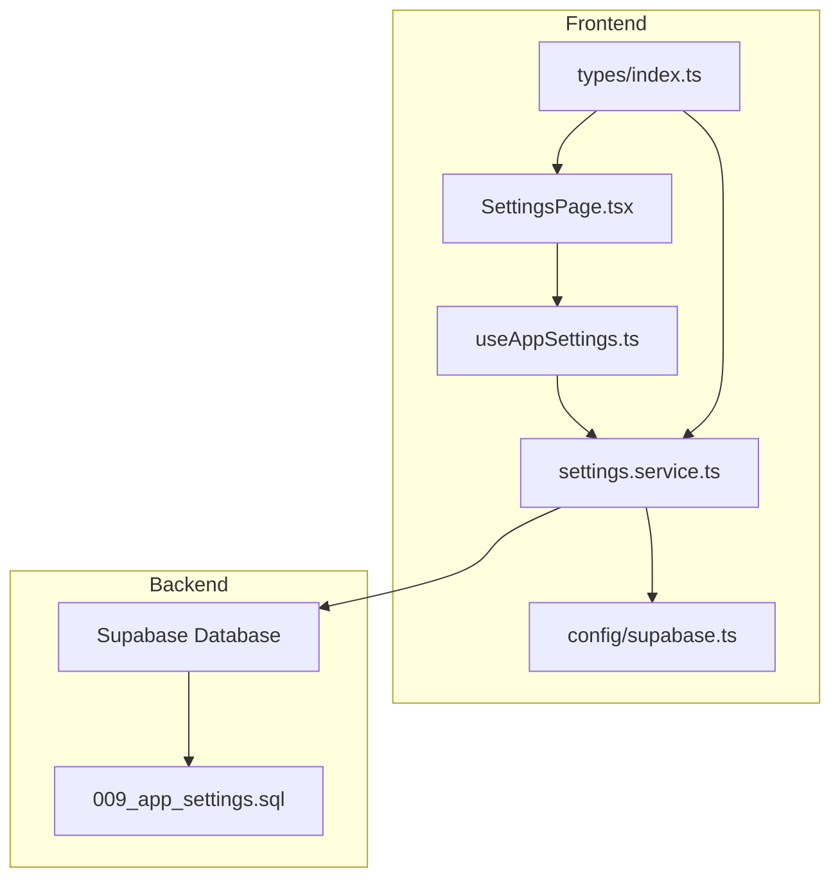
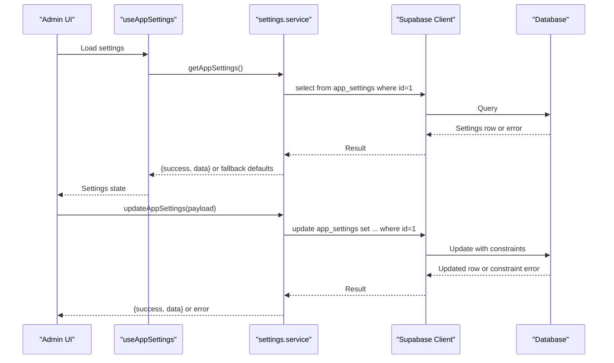
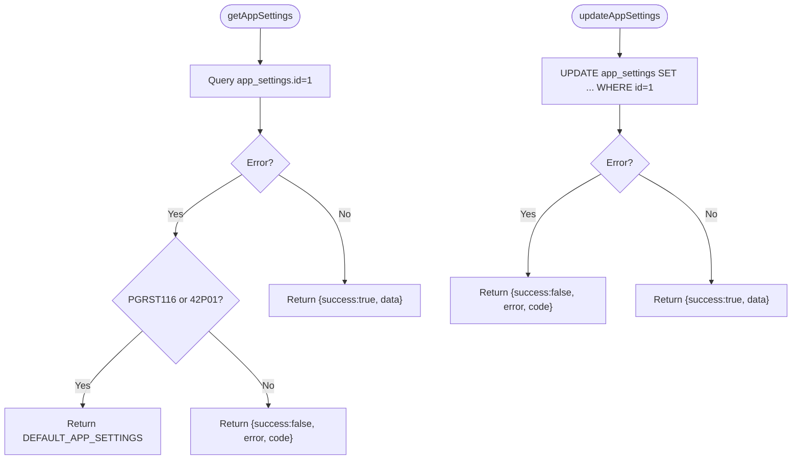
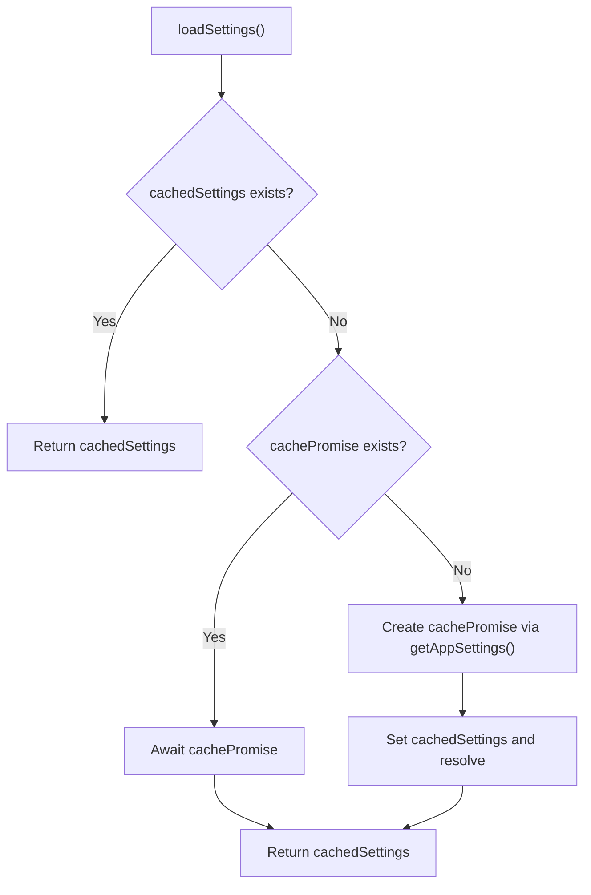
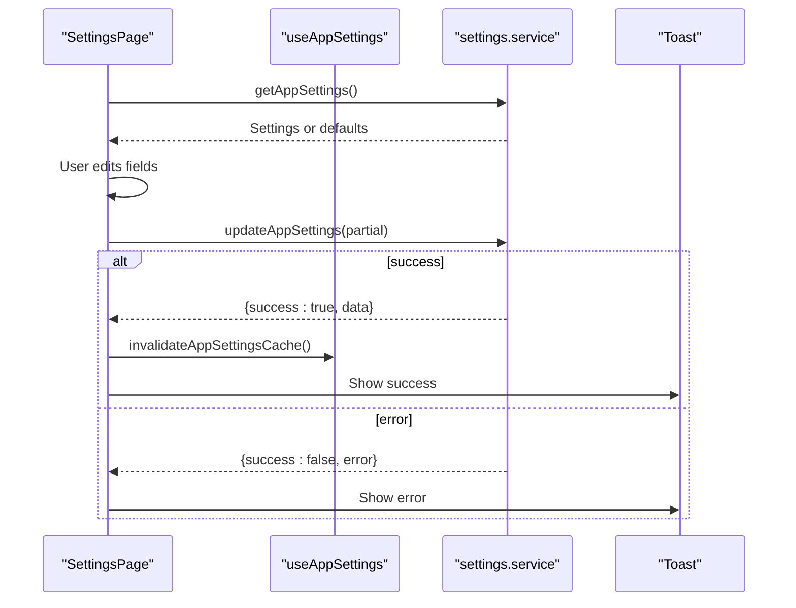
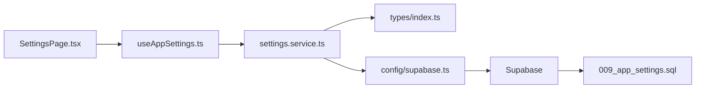

# Settings Service

<cite>
**Referenced Files in This Document**
- [settings.service.ts](file://src/services/settings.service.ts)
- [useAppSettings.ts](file://src/hooks/useAppSettings.ts)
- [SettingsPage.tsx](file://src/components/admin/SettingsPage.tsx)
- [index.ts](file://src/types/index.ts)
- [supabase.ts](file://src/config/supabase.ts)
- [009_app_settings.sql](file://supabase/migrations/009_app_settings.sql)
</cite>

## Table of Contents
1. [Introduction](#introduction)
2. [Project Structure](#project-structure)
3. [Core Components](#core-components)
4. [Architecture Overview](#architecture-overview)
5. [Detailed Component Analysis](#detailed-component-analysis)
6. [Dependency Analysis](#dependency-analysis)
7. [Performance Considerations](#performance-considerations)
8. [Troubleshooting Guide](#troubleshooting-guide)
9. [Conclusion](#conclusion)

## Introduction
This document describes the Settings Service responsible for managing application-wide configuration, system parameters, and administrative settings. It covers:
- Settings CRUD operations
- Configuration validation and defaults
- System-wide settings, user preferences, and environment-specific configurations
- Integration with Supabase Row Level Security (RLS) policies
- Settings persistence and caching
- Administrative controls and workflows

## Project Structure
The Settings Service spans frontend services, hooks, UI components, and backend database definitions:
- Frontend service module handles retrieval and updates
- React hook manages caching and loading states
- Admin UI page provides editing and saving
- Types define the settings model and defaults
- Supabase migration defines the table schema, constraints, and RLS policies
- Supabase client configuration enables database connectivity

**Diagram sources**
- [SettingsPage.tsx:1-170](file://src/components/admin/SettingsPage.tsx#L1-L170)
- [useAppSettings.ts:1-45](file://src/hooks/useAppSettings.ts#L1-L45)
- [settings.service.ts:1-34](file://src/services/settings.service.ts#L1-L34)
- [index.ts:142-167](file://src/types/index.ts#L142-L167)
- [supabase.ts:1-7](file://src/config/supabase.ts#L1-L7)
- [009_app_settings.sql:1-46](file://supabase/migrations/009_app_settings.sql#L1-L46)

**Section sources**
- [settings.service.ts:1-34](file://src/services/settings.service.ts#L1-L34)
- [useAppSettings.ts:1-45](file://src/hooks/useAppSettings.ts#L1-L45)
- [SettingsPage.tsx:1-170](file://src/components/admin/SettingsPage.tsx#L1-L170)
- [index.ts:142-167](file://src/types/index.ts#L142-L167)
- [supabase.ts:1-7](file://src/config/supabase.ts#L1-L7)
- [009_app_settings.sql:1-46](file://supabase/migrations/009_app_settings.sql#L1-L46)

## Core Components
- Settings service: Provides functions to fetch and update application settings, with fallback to default values when the settings table is missing.
- Settings hook: Implements caching and loading lifecycle for settings across the app.
- Settings page: Admin UI for viewing and editing settings with validation hints and save actions.
- Types and defaults: Defines the settings model and default values used when initial seeding is not present.
- Supabase integration: Database client configuration and RLS policies governing access to settings.

Key responsibilities:
- Retrieve current settings with robust error handling
- Persist updates atomically by ID
- Enforce validation via database constraints
- Restrict updates to administrators
- Provide environment integration status

**Section sources**
- [settings.service.ts:5-27](file://src/services/settings.service.ts#L5-L27)
- [useAppSettings.ts:9-44](file://src/hooks/useAppSettings.ts#L9-L44)
- [SettingsPage.tsx:37-170](file://src/components/admin/SettingsPage.tsx#L37-L170)
- [index.ts:142-167](file://src/types/index.ts#L142-L167)
- [009_app_settings.sql:5-46](file://supabase/migrations/009_app_settings.sql#L5-L46)

## Architecture Overview
The Settings Service follows a layered architecture:
- Presentation layer: Admin UI renders and edits settings
- Domain layer: React hook encapsulates caching and loading
- Service layer: Encapsulates Supabase operations
- Persistence layer: Supabase table with constraints and RLS policies

**Diagram sources**
- [SettingsPage.tsx:44-75](file://src/components/admin/SettingsPage.tsx#L44-L75)
- [useAppSettings.ts:9-44](file://src/hooks/useAppSettings.ts#L9-L44)
- [settings.service.ts:5-27](file://src/services/settings.service.ts#L5-L27)
- [009_app_settings.sql:5-46](file://supabase/migrations/009_app_settings.sql#L5-L46)

## Detailed Component Analysis

### Settings Service
Implements two primary operations:
- Fetch settings: Queries the singleton settings row by ID and falls back to defaults if the table is missing or empty.
- Update settings: Applies partial updates to the singleton row and returns the refreshed record.

Validation and defaults:
- Defaults are defined in types and returned when retrieval fails due to missing table metadata.
- Database constraints enforce numeric ranges and sane defaults for all fields.

Administrative controls:
- RLS policies restrict updates to authenticated users with admin or super_admin roles.

**Diagram sources**
- [settings.service.ts:5-27](file://src/services/settings.service.ts#L5-L27)
- [index.ts:156-167](file://src/types/index.ts#L156-L167)

**Section sources**
- [settings.service.ts:5-27](file://src/services/settings.service.ts#L5-L27)
- [index.ts:156-167](file://src/types/index.ts#L156-L167)

### Settings Hook (Caching and Loading)
Provides:
- Singleton cache with lazy initialization
- Loading state management
- Refresh mechanism to invalidate cache and reload

Behavior:
- On first call, fetches settings and caches the result
- Subsequent loads return cached data
- Exposes a refresh function to force reload

**Diagram sources**
- [useAppSettings.ts:9-18](file://src/hooks/useAppSettings.ts#L9-L18)

**Section sources**
- [useAppSettings.ts:1-45](file://src/hooks/useAppSettings.ts#L1-L45)

### Settings Page (Admin UI)
Features:
- Sections for company profile, attachment policies, default master data, and integration status
- Real-time form binding with typed setters
- Save action that validates and persists settings
- Toast notifications for success and error feedback
- Integration status indicators for Supabase and Cloudinary

Workflow:
- Loads settings on mount
- Updates local state on field changes
- Calls updateAppSettings on save
- Invalidates cache and refreshes UI upon success

**Diagram sources**
- [SettingsPage.tsx:44-75](file://src/components/admin/SettingsPage.tsx#L44-L75)
- [useAppSettings.ts:20-23](file://src/hooks/useAppSettings.ts#L20-L23)
- [settings.service.ts:16-27](file://src/services/settings.service.ts#L16-L27)

**Section sources**
- [SettingsPage.tsx:1-170](file://src/components/admin/SettingsPage.tsx#L1-L170)

### Types and Defaults
Defines:
- AppSettings interface with all configuration fields
- DEFAULT_APP_SETTINGS constant used as fallback values
- ServiceResult union for consistent error handling across services

Implications:
- Ensures type safety for settings consumption
- Centralizes default values for graceful degradation

**Section sources**
- [index.ts:142-167](file://src/types/index.ts#L142-L167)

### Supabase Integration and RLS Policies
Schema and constraints:
- Singleton table with enforced primary key and default values
- Numeric range checks for all configurable limits
- Trigger updates the updated_at timestamp automatically

Security:
- Select access granted to authenticated users
- Update restricted to admin or super_admin roles
- Enables Row Level Security on the table

Environment integration:
- Integration status checks environment variables for Supabase and Cloudinary configuration

**Section sources**
- [009_app_settings.sql:5-46](file://supabase/migrations/009_app_settings.sql#L5-L46)
- [supabase.ts:3-6](file://src/config/supabase.ts#L3-L6)
- [settings.service.ts:29-34](file://src/services/settings.service.ts#L29-L34)

## Dependency Analysis
The Settings Service exhibits clean separation of concerns:
- UI depends on the hook for state management
- Hook depends on the service for data operations
- Service depends on the Supabase client and types
- Supabase client depends on environment configuration
- Database depends on migration-defined schema and policies

**Diagram sources**
- [SettingsPage.tsx:1-10](file://src/components/admin/SettingsPage.tsx#L1-L10)
- [useAppSettings.ts:1-4](file://src/hooks/useAppSettings.ts#L1-L4)
- [settings.service.ts:1-3](file://src/services/settings.service.ts#L1-L3)
- [index.ts:142-143](file://src/types/index.ts#L142-L143)
- [supabase.ts:1-7](file://src/config/supabase.ts#L1-L7)
- [009_app_settings.sql:1-46](file://supabase/migrations/009_app_settings.sql#L1-L46)

**Section sources**
- [SettingsPage.tsx:1-10](file://src/components/admin/SettingsPage.tsx#L1-L10)
- [useAppSettings.ts:1-4](file://src/hooks/useAppSettings.ts#L1-L4)
- [settings.service.ts:1-3](file://src/services/settings.service.ts#L1-L3)
- [index.ts:142-143](file://src/types/index.ts#L142-L143)
- [supabase.ts:1-7](file://src/config/supabase.ts#L1-L7)
- [009_app_settings.sql:1-46](file://supabase/migrations/009_app_settings.sql#L1-L46)

## Performance Considerations
- Caching: The hook caches settings to avoid repeated network requests during the session.
- Single-row access: Using a singleton ID minimizes query complexity and leverages database indexing.
- Constraint validation: Validation occurs at the database level, preventing invalid writes and reducing client-side validation overhead.
- Environment checks: Integration status checks avoid unnecessary external calls when environment variables are missing.

## Troubleshooting Guide
Common scenarios and resolutions:
- Settings table missing or empty:
  - The service returns default values, ensuring the app remains functional.
  - Verify database migration ran successfully.
- Update failures:
  - Check RLS policy compliance (must be admin or super_admin).
  - Validate numeric ranges enforced by database constraints.
- Cache staleness:
  - Use the refresh mechanism to invalidate cache and reload settings.
- Environment misconfiguration:
  - Verify Supabase and Cloudinary environment variables are set.

Operational checks:
- Confirm Supabase client is initialized with required environment variables.
- Ensure RLS policies are enabled and correctly configured for the settings table.

**Section sources**
- [settings.service.ts:7-12](file://src/services/settings.service.ts#L7-L12)
- [useAppSettings.ts:20-23](file://src/hooks/useAppSettings.ts#L20-L23)
- [009_app_settings.sql:39-46](file://supabase/migrations/009_app_settings.sql#L39-L46)
- [supabase.ts:3-6](file://src/config/supabase.ts#L3-L6)

## Conclusion
The Settings Service provides a robust, secure, and maintainable foundation for managing application-wide configuration. It integrates seamlessly with Supabase through RLS policies and constraints, ensures data integrity via database-level validation, and offers a responsive admin experience with caching and clear error handling. Administrators can confidently adjust system parameters while the service guarantees defaults and security posture.