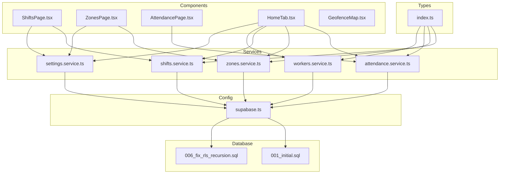
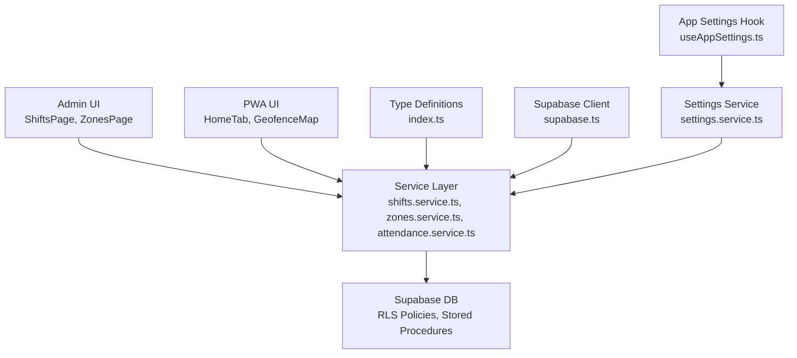
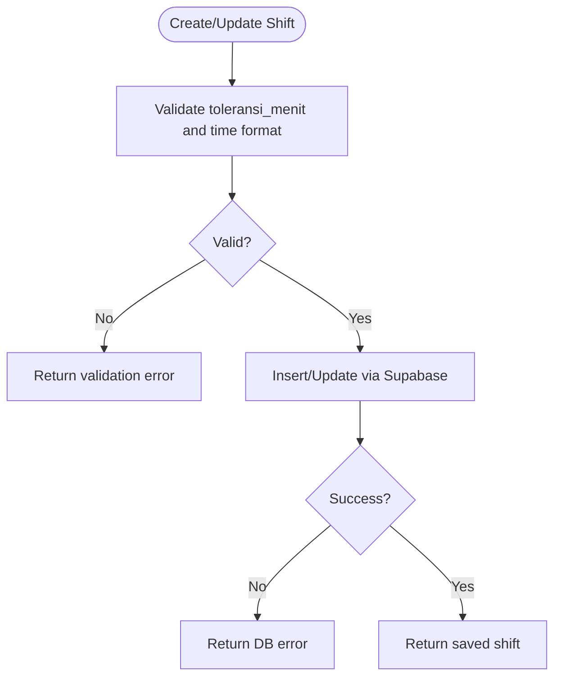
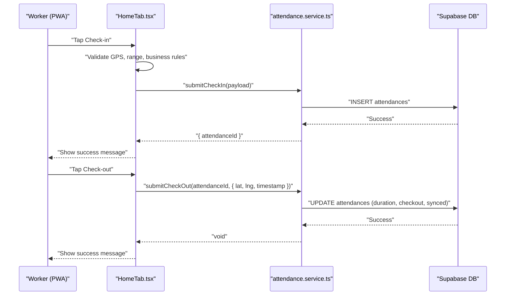
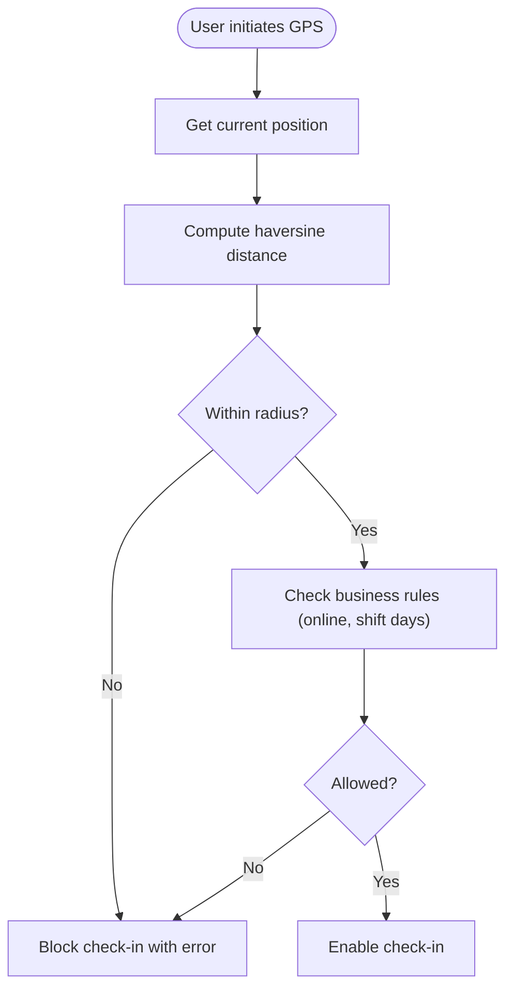
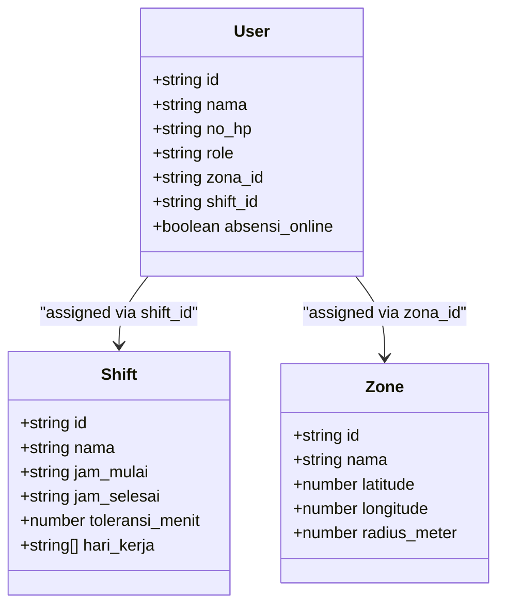
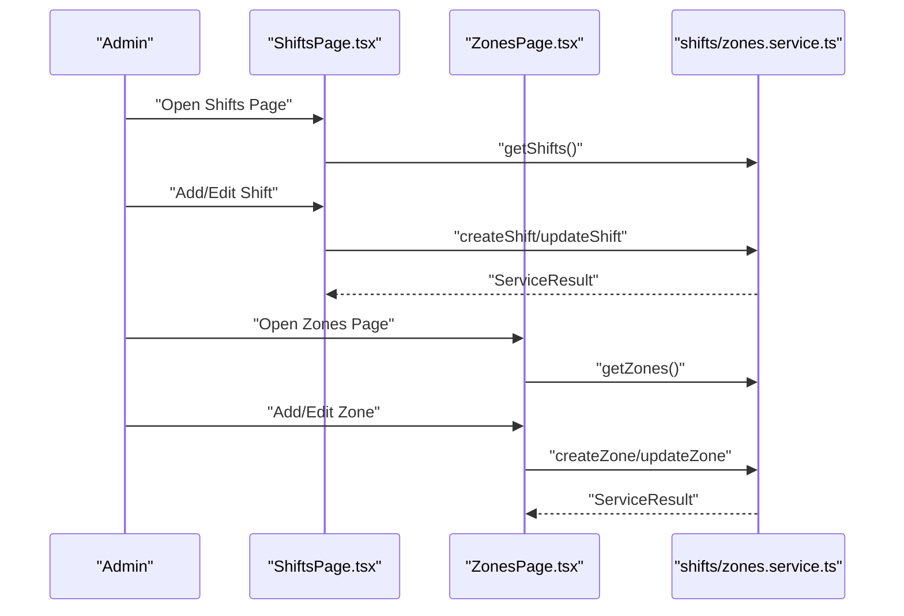
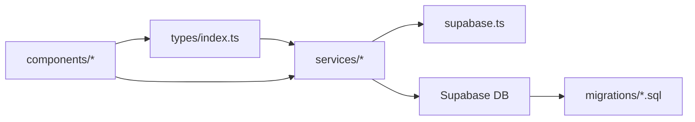

# Shifts & Zones Service

<cite>
**Referenced Files in This Document**
- [shifts.service.ts](file://src/services/shifts.service.ts)
- [zones.service.ts](file://src/services/zones.service.ts)
- [attendance.service.ts](file://src/services/attendance.service.ts)
- [workers.service.ts](file://src/services/workers.service.ts)
- [ShiftsPage.tsx](file://src/components/admin/ShiftsPage.tsx)
- [ZonesPage.tsx](file://src/components/admin/ZonesPage.tsx)
- [AttendancePage.tsx](file://src/components/admin/AttendancePage.tsx)
- [HomeTab.tsx](file://src/components/pwa/HomeTab.tsx)
- [GeofenceMap.tsx](file://src/components/pwa/GeofenceMap.tsx)
- [index.ts](file://src/types/index.ts)
- [supabase.ts](file://src/config/supabase.ts)
- [settings.service.ts](file://src/services/settings.service.ts)
- [useAppSettings.ts](file://src/hooks/useAppSettings.ts)
- [001_initial.sql](file://supabase/migrations/001_initial.sql)
- [006_fix_rls_recursion.sql](file://supabase/migrations/006_fix_rls_recursion.sql)
</cite>

## Table of Contents
1. [Introduction](#introduction)
2. [Project Structure](#project-structure)
3. [Core Components](#core-components)
4. [Architecture Overview](#architecture-overview)
5. [Detailed Component Analysis](#detailed-component-analysis)
6. [Dependency Analysis](#dependency-analysis)
7. [Performance Considerations](#performance-considerations)
8. [Troubleshooting Guide](#troubleshooting-guide)
9. [Conclusion](#conclusion)

## Introduction
This document provides comprehensive documentation for the Shifts and Zones services that power shift scheduling and geographic zone management in the AbsensiOnline application. It covers shift creation and modification, tolerance settings, validation rules, zone configuration and geofencing parameters, spatial calculations, and the integration with attendance tracking. It also explains the relationship between shifts and zones, worker assignments, and schedule conflict resolution strategies.

## Project Structure
The system is organized around three primary layers:
- Services: Backend-like service modules that encapsulate data access and business logic for shifts, zones, attendance, workers, and settings.
- Components: React components for administration and PWA interfaces managing shifts, zones, attendance records, and geofencing.
- Types: Shared TypeScript interfaces and enums defining domain models and service result structures.
- Database: Supabase-backed PostgreSQL with row-level security policies and stored procedures for derived status calculation.

**Diagram sources**
- [shifts.service.ts:1-54](file://src/services/shifts.service.ts#L1-L54)
- [zones.service.ts:1-50](file://src/services/zones.service.ts#L1-L50)
- [attendance.service.ts:1-188](file://src/services/attendance.service.ts#L1-L188)
- [workers.service.ts:1-133](file://src/services/workers.service.ts#L1-L133)
- [settings.service.ts:1-34](file://src/services/settings.service.ts#L1-L34)
- [ShiftsPage.tsx:1-295](file://src/components/admin/ShiftsPage.tsx#L1-L295)
- [ZonesPage.tsx:1-420](file://src/components/admin/ZonesPage.tsx#L1-L420)
- [AttendancePage.tsx:1-355](file://src/components/admin/AttendancePage.tsx#L1-L355)
- [HomeTab.tsx:1-817](file://src/components/pwa/HomeTab.tsx#L1-L817)
- [GeofenceMap.tsx:1-77](file://src/components/pwa/GeofenceMap.tsx#L1-L77)
- [index.ts:1-182](file://src/types/index.ts#L1-L182)
- [supabase.ts:1-7](file://src/config/supabase.ts#L1-L7)
- [001_initial.sql:29-286](file://supabase/migrations/001_initial.sql#L29-L286)
- [006_fix_rls_recursion.sql:30-55](file://supabase/migrations/006_fix_rls_recursion.sql#L30-L55)

**Section sources**
- [shifts.service.ts:1-54](file://src/services/shifts.service.ts#L1-L54)
- [zones.service.ts:1-50](file://src/services/zones.service.ts#L1-L50)
- [attendance.service.ts:1-188](file://src/services/attendance.service.ts#L1-L188)
- [workers.service.ts:1-133](file://src/services/workers.service.ts#L1-L133)
- [settings.service.ts:1-34](file://src/services/settings.service.ts#L1-L34)
- [ShiftsPage.tsx:1-295](file://src/components/admin/ShiftsPage.tsx#L1-L295)
- [ZonesPage.tsx:1-420](file://src/components/admin/ZonesPage.tsx#L1-L420)
- [AttendancePage.tsx:1-355](file://src/components/admin/AttendancePage.tsx#L1-L355)
- [HomeTab.tsx:1-817](file://src/components/pwa/HomeTab.tsx#L1-L817)
- [GeofenceMap.tsx:1-77](file://src/components/pwa/GeofenceMap.tsx#L1-L77)
- [index.ts:1-182](file://src/types/index.ts#L1-L182)
- [supabase.ts:1-7](file://src/config/supabase.ts#L1-L7)
- [001_initial.sql:29-286](file://supabase/migrations/001_initial.sql#L29-L286)
- [006_fix_rls_recursion.sql:30-55](file://supabase/migrations/006_fix_rls_recursion.sql#L30-L55)

## Core Components
- Shifts Service: CRUD operations for shift definitions, including validation for tolerance minutes and time formats.
- Zones Service: CRUD operations for geographic zones with validation for coordinates and radius.
- Attendance Service: Check-in/check-out submission, duration calculation, status derivation, and history retrieval.
- Workers Service: Worker management with PIN validation and integration with Supabase Auth via Edge Functions.
- Admin Pages: ShiftsPage and ZonesPage provide forms, validation, and CRUD actions for administrators.
- PWA HomeTab: Geofencing logic, distance calculation, and check-in/out flows for workers.
- Types: Strongly typed models for shifts, zones, attendance, and service results.

**Section sources**
- [shifts.service.ts:1-54](file://src/services/shifts.service.ts#L1-L54)
- [zones.service.ts:1-50](file://src/services/zones.service.ts#L1-L50)
- [attendance.service.ts:1-188](file://src/services/attendance.service.ts#L1-L188)
- [workers.service.ts:1-133](file://src/services/workers.service.ts#L1-L133)
- [ShiftsPage.tsx:1-295](file://src/components/admin/ShiftsPage.tsx#L1-L295)
- [ZonesPage.tsx:1-420](file://src/components/admin/ZonesPage.tsx#L1-L420)
- [HomeTab.tsx:1-817](file://src/components/pwa/HomeTab.tsx#L1-L817)
- [index.ts:1-182](file://src/types/index.ts#L1-L182)

## Architecture Overview
The system follows a layered architecture:
- Presentation Layer: Admin pages and PWA components render UI and collect inputs.
- Service Layer: Service modules encapsulate Supabase queries and validations.
- Domain Layer: Types define contracts and shared structures.
- Data Layer: Supabase tables with RLS policies and stored procedures.

**Diagram sources**
- [ShiftsPage.tsx:1-295](file://src/components/admin/ShiftsPage.tsx#L1-L295)
- [ZonesPage.tsx:1-420](file://src/components/admin/ZonesPage.tsx#L1-L420)
- [HomeTab.tsx:1-817](file://src/components/pwa/HomeTab.tsx#L1-L817)
- [GeofenceMap.tsx:1-77](file://src/components/pwa/GeofenceMap.tsx#L1-L77)
- [shifts.service.ts:1-54](file://src/services/shifts.service.ts#L1-L54)
- [zones.service.ts:1-50](file://src/services/zones.service.ts#L1-L50)
- [attendance.service.ts:1-188](file://src/services/attendance.service.ts#L1-L188)
- [settings.service.ts:1-34](file://src/services/settings.service.ts#L1-L34)
- [useAppSettings.ts:1-45](file://src/hooks/useAppSettings.ts#L1-L45)
- [index.ts:1-182](file://src/types/index.ts#L1-L182)
- [supabase.ts:1-7](file://src/config/supabase.ts#L1-L7)

## Detailed Component Analysis

### Shift Management Service
The shifts service handles CRUD operations with built-in validation:
- Validation rules:
  - Tolerance minutes: 0 to 120.
  - Time format: HH:MM with valid ranges for hours and minutes.
- Operations:
  - Fetch all shifts and by ID.
  - Create, update, and delete shifts with validation prior to persistence.

**Diagram sources**
- [shifts.service.ts:16-47](file://src/services/shifts.service.ts#L16-L47)

**Section sources**
- [shifts.service.ts:1-54](file://src/services/shifts.service.ts#L1-L54)
- [ShiftsPage.tsx:10-125](file://src/components/admin/ShiftsPage.tsx#L10-L125)

### Zone Management Service
The zones service manages geographic boundaries with validation:
- Validation rules:
  - Latitude: -90 to 90.
  - Longitude: -180 to 180.
  - Radius: 1 to 10,000 meters.
- Operations:
  - Fetch all zones and by ID.
  - Create, update, and delete zones with validation prior to persistence.

**Diagram sources**
- [zones.service.ts:16-43](file://src/services/zones.service.ts#L16-L43)

**Section sources**
- [zones.service.ts:1-50](file://src/services/zones.service.ts#L1-L50)
- [ZonesPage.tsx:155-247](file://src/components/admin/ZonesPage.tsx#L155-L247)

### Attendance Tracking Integration
The attendance service integrates shifts and zones:
- Check-in:
  - Creates attendance record with user_id, shift_id, zona_id, timestamps, and location.
  - Supports offline queueing with client-generated IDs.
- Check-out:
  - Calculates duration in minutes from check-in to check-out.
  - Updates checkout fields and synced timestamp.
- Status derivation:
  - A stored procedure derives attendance status based on check-in time and shift tolerance.
- History:
  - Retrieves attendance records and enriches with shift names.

**Diagram sources**
- [HomeTab.tsx:292-400](file://src/components/pwa/HomeTab.tsx#L292-L400)
- [attendance.service.ts:25-77](file://src/services/attendance.service.ts#L25-L77)

**Section sources**
- [attendance.service.ts:1-188](file://src/services/attendance.service.ts#L1-L188)
- [HomeTab.tsx:1-817](file://src/components/pwa/HomeTab.tsx#L1-L817)
- [AttendancePage.tsx:1-355](file://src/components/admin/AttendancePage.tsx#L1-L355)

### Geofencing and Spatial Calculations
Geofencing ensures check-ins occur within zone boundaries:
- Distance calculation uses the haversine formula for accurate Earth spherical distance.
- Range enforcement compares calculated distance against zone radius.
- UI visualization renders a canvas-based map with glow effects and radius labels.

**Diagram sources**
- [HomeTab.tsx:29-35](file://src/components/pwa/HomeTab.tsx#L29-L35)
- [HomeTab.tsx:164-234](file://src/components/pwa/HomeTab.tsx#L164-L234)
- [GeofenceMap.tsx:12-77](file://src/components/pwa/GeofenceMap.tsx#L12-L77)

**Section sources**
- [HomeTab.tsx:1-817](file://src/components/pwa/HomeTab.tsx#L1-L817)
- [GeofenceMap.tsx:1-77](file://src/components/pwa/GeofenceMap.tsx#L1-L77)

### Worker Assignments and Schedule Conflict Resolution
Workers are assigned to shifts and zones via foreign keys:
- Users table references shifts and zones.
- Conflict resolution:
  - Business rules prevent check-in on non-working days based on shift.hari_kerja.
  - Single daily check-in constraint enforced by database constraints and UI checks.
  - Status overrides allow administrative adjustments.

**Diagram sources**
- [index.ts:32-46](file://src/types/index.ts#L32-L46)
- [index.ts:21-30](file://src/types/index.ts#L21-L30)
- [index.ts:10-19](file://src/types/index.ts#L10-L19)

**Section sources**
- [index.ts:1-182](file://src/types/index.ts#L1-L182)
- [workers.service.ts:1-133](file://src/services/workers.service.ts#L1-L133)
- [HomeTab.tsx:151-162](file://src/components/pwa/HomeTab.tsx#L151-L162)

### Administrative Workflows
Administrators manage shifts and zones through dedicated pages:
- ShiftsPage:
  - Form collects name, start/end times, tolerance, icon, working days, and status.
  - Default tolerance sourced from app settings.
  - Validation mirrors backend rules.
- ZonesPage:
  - Interactive map rendering and selection.
  - Form validates coordinates and radius.
  - Default radius sourced from app settings.

**Diagram sources**
- [ShiftsPage.tsx:127-171](file://src/components/admin/ShiftsPage.tsx#L127-L171)
- [ZonesPage.tsx:249-295](file://src/components/admin/ZonesPage.tsx#L249-L295)
- [shifts.service.ts:4-8](file://src/services/shifts.service.ts#L4-L8)
- [zones.service.ts:4-8](file://src/services/zones.service.ts#L4-L8)

**Section sources**
- [ShiftsPage.tsx:1-295](file://src/components/admin/ShiftsPage.tsx#L1-L295)
- [ZonesPage.tsx:1-420](file://src/components/admin/ZonesPage.tsx#L1-L420)

## Dependency Analysis
Key dependencies and relationships:
- Services depend on Supabase client for database operations.
- Components depend on services for data fetching and mutations.
- Types define contracts used across services and components.
- Database migrations define tables, constraints, RLS policies, and stored procedures.
- Settings service provides configurable defaults for UI and validation.

**Diagram sources**
- [index.ts:1-182](file://src/types/index.ts#L1-L182)
- [shifts.service.ts:1-54](file://src/services/shifts.service.ts#L1-L54)
- [zones.service.ts:1-50](file://src/services/zones.service.ts#L1-L50)
- [attendance.service.ts:1-188](file://src/services/attendance.service.ts#L1-L188)
- [supabase.ts:1-7](file://src/config/supabase.ts#L1-L7)
- [001_initial.sql:29-286](file://supabase/migrations/001_initial.sql#L29-L286)

**Section sources**
- [index.ts:1-182](file://src/types/index.ts#L1-L182)
- [supabase.ts:1-7](file://src/config/supabase.ts#L1-L7)
- [001_initial.sql:29-286](file://supabase/migrations/001_initial.sql#L29-L286)
- [006_fix_rls_recursion.sql:30-55](file://supabase/migrations/006_fix_rls_recursion.sql#L30-L55)

## Performance Considerations
- Use indexed columns for frequent filters (e.g., users by phone and role, attendance by user and date).
- Batch operations for attendance exports and attachment verification.
- Optimize geofencing distance calculations by caching zone and worker data where appropriate.
- Minimize network requests by combining queries (e.g., loading zones, shifts, and attendances together in admin views).

## Troubleshooting Guide
Common issues and resolutions:
- Validation errors on shift creation/update:
  - Ensure tolerance minutes are within 0–120 and time formats are valid HH:MM.
- Validation errors on zone creation/update:
  - Ensure latitude [-90, 90], longitude [-180, 180], and radius (1–10000].
- Attendance submission failures:
  - Verify single daily check-in constraints and online/offline queue flushing.
  - Check GPS permissions and accuracy thresholds.
- RLS policy violations:
  - Confirm authenticated user roles and policies for shifts and zones.

**Section sources**
- [shifts.service.ts:16-31](file://src/services/shifts.service.ts#L16-L31)
- [zones.service.ts:16-27](file://src/services/zones.service.ts#L16-L27)
- [HomeTab.tsx:332-336](file://src/components/pwa/HomeTab.tsx#L332-L336)
- [006_fix_rls_recursion.sql:30-55](file://supabase/migrations/006_fix_rls_recursion.sql#L30-L55)

## Conclusion
The Shifts and Zones services provide a robust foundation for shift scheduling and geofencing-based attendance tracking. Through validated forms, spatial calculations, and integrated administrative tools, the system supports accurate scheduling, precise location-aware check-ins, and flexible status management. The modular architecture and strong typing facilitate maintainability and scalability.