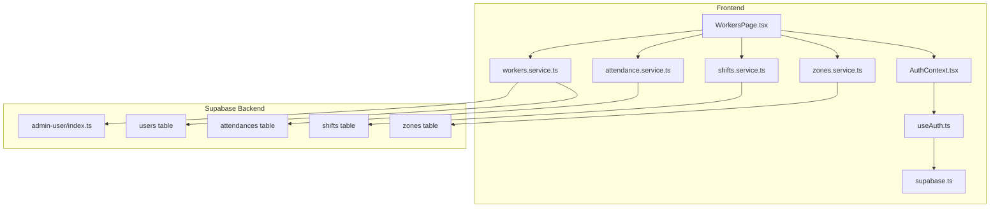
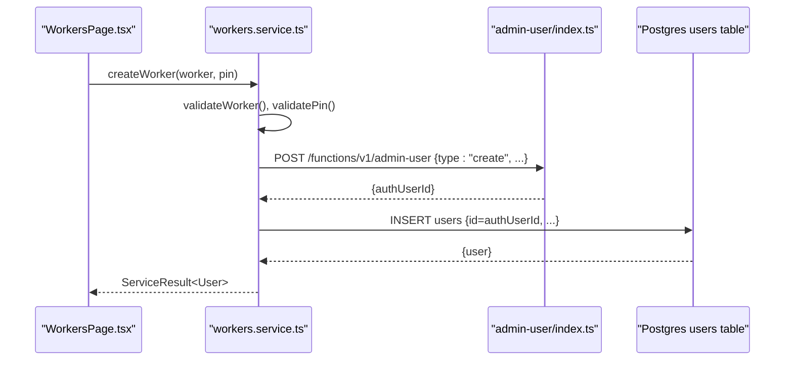
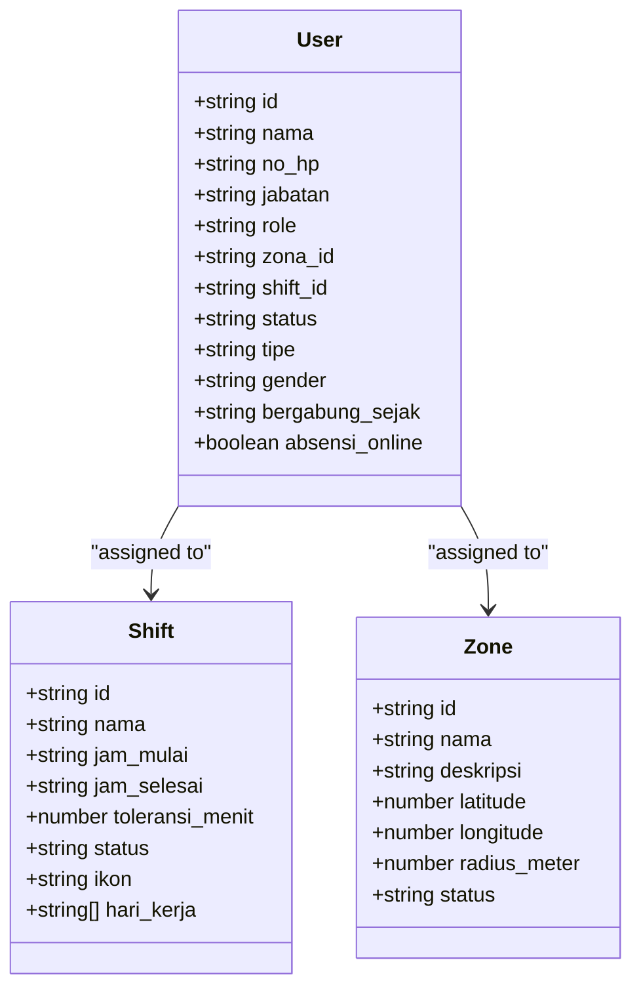
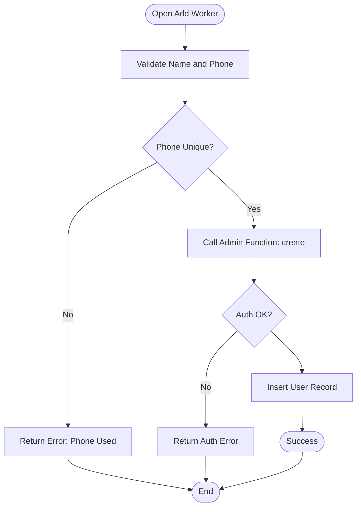
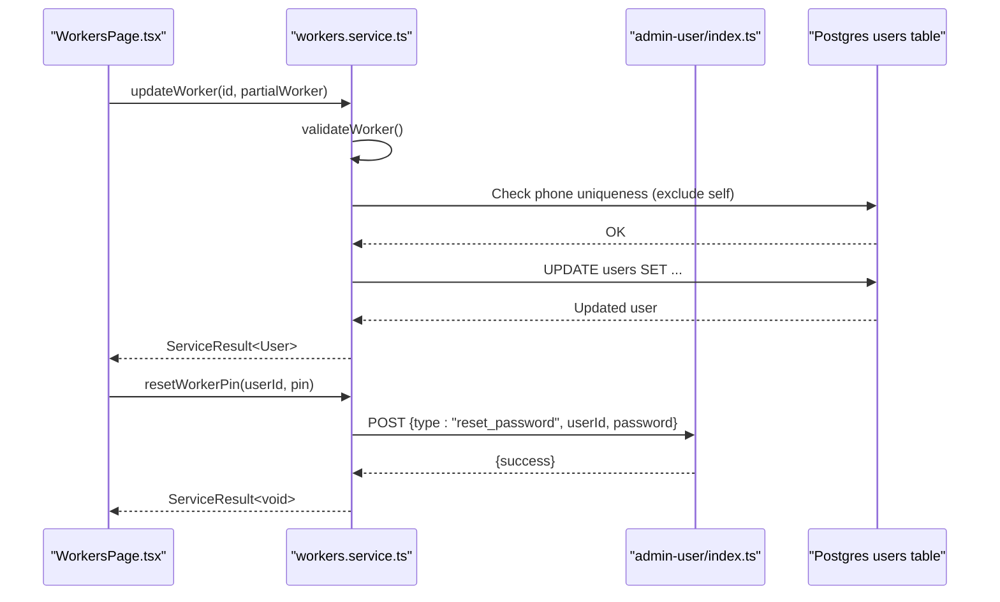
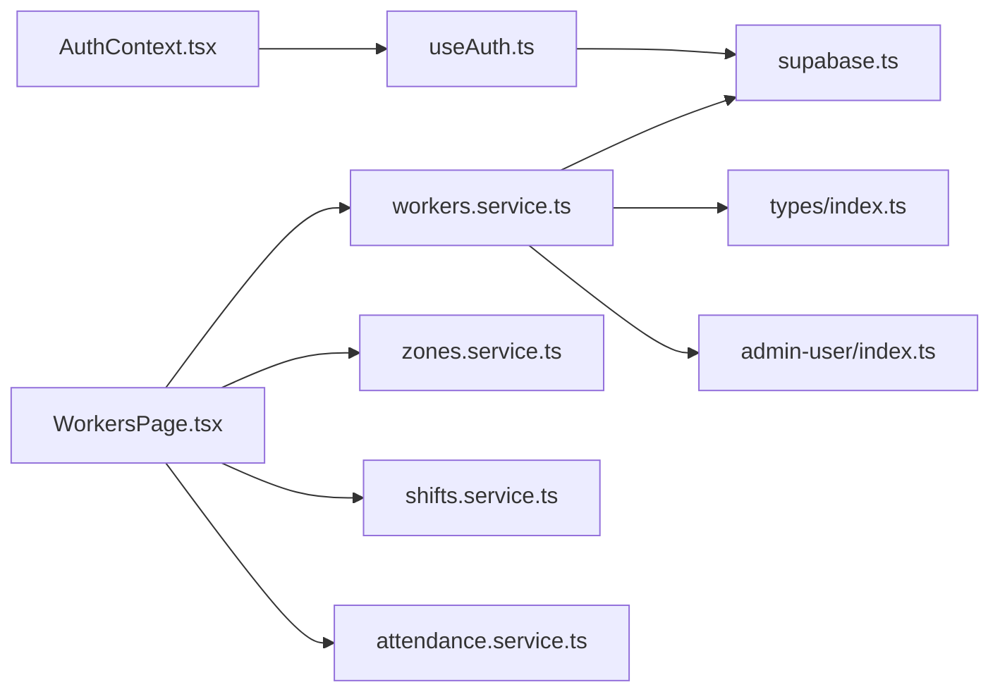

# Workers Service

<cite>
**Referenced Files in This Document**
- [workers.service.ts](file://src/services/workers.service.ts)
- [WorkersPage.tsx](file://src/components/admin/WorkersPage.tsx)
- [index.ts](file://src/types/index.ts)
- [admin-user/index.ts](file://supabase/functions/admin-user/index.ts)
- [attendance.service.ts](file://src/services/attendance.service.ts)
- [shifts.service.ts](file://src/services/shifts.service.ts)
- [zones.service.ts](file://src/services/zones.service.ts)
- [AuthContext.tsx](file://src/context/AuthContext.tsx)
- [useAuth.ts](file://src/hooks/useAuth.ts)
- [supabase.ts](file://src/config/supabase.ts)
- [SPEC.md](file://SPEC.md)
- [002_seed_auth.sql](file://supabase/migrations/002_seed_auth.sql)
</cite>

## Table of Contents
1. [Introduction](#introduction)
2. [Project Structure](#project-structure)
3. [Core Components](#core-components)
4. [Architecture Overview](#architecture-overview)
5. [Detailed Component Analysis](#detailed-component-analysis)
6. [Dependency Analysis](#dependency-analysis)
7. [Performance Considerations](#performance-considerations)
8. [Troubleshooting Guide](#troubleshooting-guide)
9. [Conclusion](#conclusion)
10. [Appendices](#appendices)

## Introduction
This document describes the Workers Service responsible for managing worker profiles and user operations. It covers CRUD operations, profile updates, shift assignments, role-based access control, registration workflows, validation rules, and synchronization with the authentication system. It also documents search and filtering capabilities, bulk operation patterns, and integrations with attendance and shifts services.

## Project Structure
The Workers Service spans frontend services, UI components, Supabase functions, and shared types. The primary service module orchestrates worker operations and delegates authentication tasks to a dedicated Supabase Edge Function. The admin UI provides search, filtering, pagination, and inline editing.

**Diagram sources**
- [WorkersPage.tsx:162-509](file://src/components/admin/WorkersPage.tsx#L162-L509)
- [workers.service.ts:20-133](file://src/services/workers.service.ts#L20-L133)
- [admin-user/index.ts:10-167](file://supabase/functions/admin-user/index.ts#L10-L167)
- [attendance.service.ts:16-188](file://src/services/attendance.service.ts#L16-L188)
- [shifts.service.ts:4-54](file://src/services/shifts.service.ts#L4-L54)
- [zones.service.ts:4-50](file://src/services/zones.service.ts#L4-L50)
- [AuthContext.tsx:18-42](file://src/context/AuthContext.tsx#L18-L42)
- [useAuth.ts:29-114](file://src/hooks/useAuth.ts#L29-L114)
- [supabase.ts:3-6](file://src/config/supabase.ts#L3-L6)

**Section sources**
- [workers.service.ts:1-133](file://src/services/workers.service.ts#L1-L133)
- [WorkersPage.tsx:162-509](file://src/components/admin/WorkersPage.tsx#L162-L509)
- [index.ts:32-46](file://src/types/index.ts#L32-L46)
- [admin-user/index.ts:10-167](file://supabase/functions/admin-user/index.ts#L10-L167)

## Core Components
- Workers Service (workers.service.ts): Provides worker CRUD, PIN reset, validation, and authentication synchronization via a Supabase Edge Function.
- Workers Admin Page (WorkersPage.tsx): Implements search, filtering, pagination, inline expansion, and forms for create/update/delete/reset operations.
- Types (index.ts): Defines User, Role, and ServiceResult types used across services.
- Authentication Function (admin-user/index.ts): Enforces admin-only access and performs create/reset/delete operations against Supabase Auth.
- Related Services: Attendance, Shifts, and Zones services support worker assignment and context.

**Section sources**
- [workers.service.ts:20-133](file://src/services/workers.service.ts#L20-L133)
- [WorkersPage.tsx:162-509](file://src/components/admin/WorkersPage.tsx#L162-L509)
- [index.ts:32-46](file://src/types/index.ts#L32-L46)
- [admin-user/index.ts:58-154](file://supabase/functions/admin-user/index.ts#L58-L154)

## Architecture Overview
The Workers Service integrates with Supabase Auth and Postgres. Worker records are stored in the users table, while authentication accounts are managed by Supabase Auth. Operations are executed through the workers service, which calls an admin-only Edge Function to manage Auth accounts and then synchronizes the Postgres users table.

**Diagram sources**
- [workers.service.ts:54-91](file://src/services/workers.service.ts#L54-L91)
- [admin-user/index.ts:58-94](file://supabase/functions/admin-user/index.ts#L58-L94)
- [workers.service.ts:85-90](file://src/services/workers.service.ts#L85-L90)

## Detailed Component Analysis

### Workers Service API
- getWorkers(): Fetches all workers excluding super_admin, ordered by name.
- getWorkerById(id): Retrieves a single worker by ID.
- createWorker(worker, pin): Validates inputs, checks phone uniqueness, creates an Auth account via admin function, then inserts a user record.
- updateWorker(id, partialWorker): Validates updates, checks phone uniqueness against other users, then updates the user record.
- resetWorkerPin(userId, pin): Resets the worker’s Auth PIN via admin function.
- deleteWorker(id): Deletes the Auth account via admin function, then deletes the user record.

Validation rules:
- Name is required and must not be empty.
- Phone number must be 10–15 digits.
- PIN must be 4–8 digits and numeric.

Role-based access control:
- The admin function restricts operations to admin or super_admin callers.
- Supabase Row Level Security enforces read/write permissions for users and attendances.

**Section sources**
- [workers.service.ts:20-133](file://src/services/workers.service.ts#L20-L133)
- [workers.service.ts:36-52](file://src/services/workers.service.ts#L36-L52)
- [SPEC.md:219-255](file://SPEC.md#L219-L255)

### Workers Admin UI
- Search: Filters by name, phone, or ID.
- Filtering: By zone and status.
- Pagination: Fixed page size with navigation controls.
- Inline expansion: Shows detailed worker info and actions.
- Forms: Add/Edit worker with validation and PIN requirement for creation.
- Actions: Edit, disable, reset PIN, delete.

**Section sources**
- [WorkersPage.tsx:162-509](file://src/components/admin/WorkersPage.tsx#L162-L509)
- [WorkersPage.tsx:261-270](file://src/components/admin/WorkersPage.tsx#L261-L270)

### Authentication Integration
- Worker registration creates an Auth user with email derived from phone number and metadata containing name, phone, and role.
- Login uses RPC to resolve user by phone, then signs in with Auth using the local email and PIN.
- Session hydration fetches the user profile from Postgres users table.

**Section sources**
- [admin-user/index.ts:73-93](file://supabase/functions/admin-user/index.ts#L73-L93)
- [useAuth.ts:58-96](file://src/hooks/useAuth.ts#L58-L96)
- [002_seed_auth.sql:1-28](file://supabase/migrations/002_seed_auth.sql#L1-L28)

### Attendance and Shifts Integration
- Workers are associated with shifts and zones via foreign keys.
- Attendance service tracks check-in/check-out per worker and shift.
- UI displays shift and zone details per worker.

**Section sources**
- [index.ts:32-46](file://src/types/index.ts#L32-L46)
- [attendance.service.ts:16-188](file://src/services/attendance.service.ts#L16-L188)
- [WorkersPage.tsx:511-541](file://src/components/admin/WorkersPage.tsx#L511-L541)

### Class Model: User and Related Entities

**Diagram sources**
- [index.ts:32-46](file://src/types/index.ts#L32-L46)
- [index.ts:21-30](file://src/types/index.ts#L21-L30)
- [index.ts:10-19](file://src/types/index.ts#L10-L19)

### Worker Registration Workflow

**Diagram sources**
- [workers.service.ts:54-91](file://src/services/workers.service.ts#L54-L91)
- [admin-user/index.ts:58-94](file://supabase/functions/admin-user/index.ts#L58-L94)

### Worker Update and PIN Reset

**Diagram sources**
- [workers.service.ts:93-121](file://src/services/workers.service.ts#L93-L121)
- [admin-user/index.ts:96-128](file://supabase/functions/admin-user/index.ts#L96-L128)

## Dependency Analysis
- workers.service.ts depends on:
  - Supabase client for Postgres operations.
  - admin-user Edge Function for Auth operations.
  - Shared types for User and ServiceResult.
- WorkersPage.tsx depends on:
  - workers.service.ts for CRUD.
  - zones.service.ts and shifts.service.ts for assignment context.
  - attendance.service.ts for related reporting.
  - AuthContext and useAuth for session and login.
- admin-user/index.ts depends on:
  - Supabase Auth admin APIs.
  - Supabase service_role key for privileged operations.

**Diagram sources**
- [workers.service.ts:1-4](file://src/services/workers.service.ts#L1-L4)
- [supabase.ts:3-6](file://src/config/supabase.ts#L3-L6)
- [WorkersPage.tsx:4-6](file://src/components/admin/WorkersPage.tsx#L4-L6)
- [admin-user/index.ts:24-28](file://supabase/functions/admin-user/index.ts#L24-L28)

**Section sources**
- [workers.service.ts:1-4](file://src/services/workers.service.ts#L1-L4)
- [WorkersPage.tsx:4-6](file://src/components/admin/WorkersPage.tsx#L4-L6)
- [admin-user/index.ts:24-28](file://supabase/functions/admin-user/index.ts#L24-L28)

## Performance Considerations
- Validation occurs on both client and server to reduce unnecessary network calls.
- Bulk operations are not implemented; pagination and client-side filtering are used for large datasets.
- Auth operations are delegated to a single Edge Function to minimize repeated admin client calls.
- Consider adding database indexes on frequently queried columns (e.g., no_hp) to improve lookup performance.

## Troubleshooting Guide
Common issues and resolutions:
- Unauthorized Access: Ensure the current user has admin or super_admin role; otherwise, the admin function returns forbidden.
- Phone Number Conflicts: Updating a worker with an existing phone number returns a conflict error; choose another number.
- Invalid PIN: PIN must be 4–8 digits and numeric; otherwise, validation fails.
- Auth Account Creation Failure: Verify the admin function received required fields and that the service role key is configured.
- Session Hydration: If login succeeds but profile is missing, confirm the users table contains a row for the returned user ID.

**Section sources**
- [admin-user/index.ts:44-49](file://supabase/functions/admin-user/index.ts#L44-L49)
- [workers.service.ts:69-71](file://src/services/workers.service.ts#L69-L71)
- [workers.service.ts:48-52](file://src/services/workers.service.ts#L48-L52)
- [useAuth.ts:58-96](file://src/hooks/useAuth.ts#L58-L96)

## Conclusion
The Workers Service provides a robust foundation for worker lifecycle management, integrating tightly with Supabase Auth and Postgres. It enforces role-based access control, validates inputs, and synchronizes user and authentication data. The admin UI offers practical tools for search, filtering, and bulk-like operations through pagination and inline editing.

## Appendices

### Data Validation Rules Summary
- Worker name: Required and non-empty.
- Phone number: 10–15 digits.
- PIN: 4–8 digits, numeric only.
- Phone uniqueness: Enforced during create and update.

**Section sources**
- [workers.service.ts:36-52](file://src/services/workers.service.ts#L36-L52)
- [workers.service.ts:64-71](file://src/services/workers.service.ts#L64-L71)
- [workers.service.ts:97-107](file://src/services/workers.service.ts#L97-L107)

### Role-Based Access Control Summary
- Admin-only operations: create, reset_password, delete via admin function.
- RLS policies: Admin can read/update/delete users; worker can read own profile.
- Attendance RLS: Admin can read/update/delete; worker can read/update own attendances.

**Section sources**
- [admin-user/index.ts:44-49](file://supabase/functions/admin-user/index.ts#L44-L49)
- [SPEC.md:219-255](file://SPEC.md#L219-L255)
- [SPEC.md:318-355](file://SPEC.md#L318-L355)