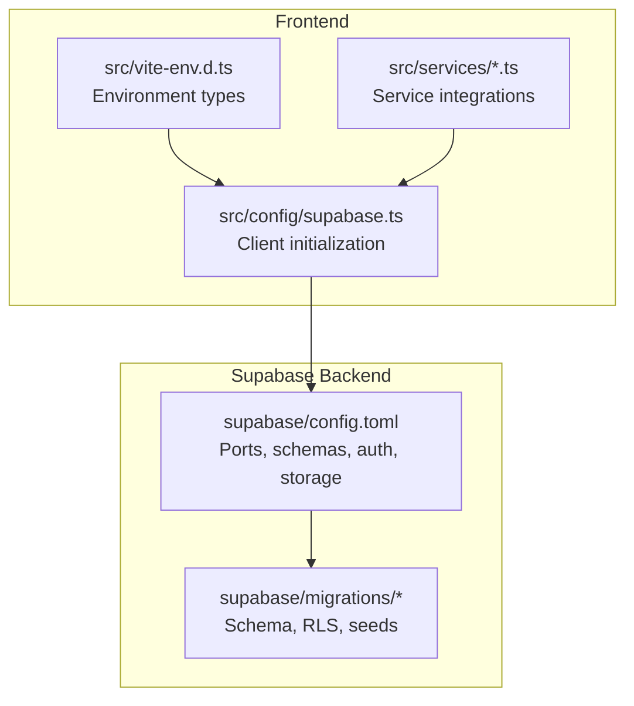
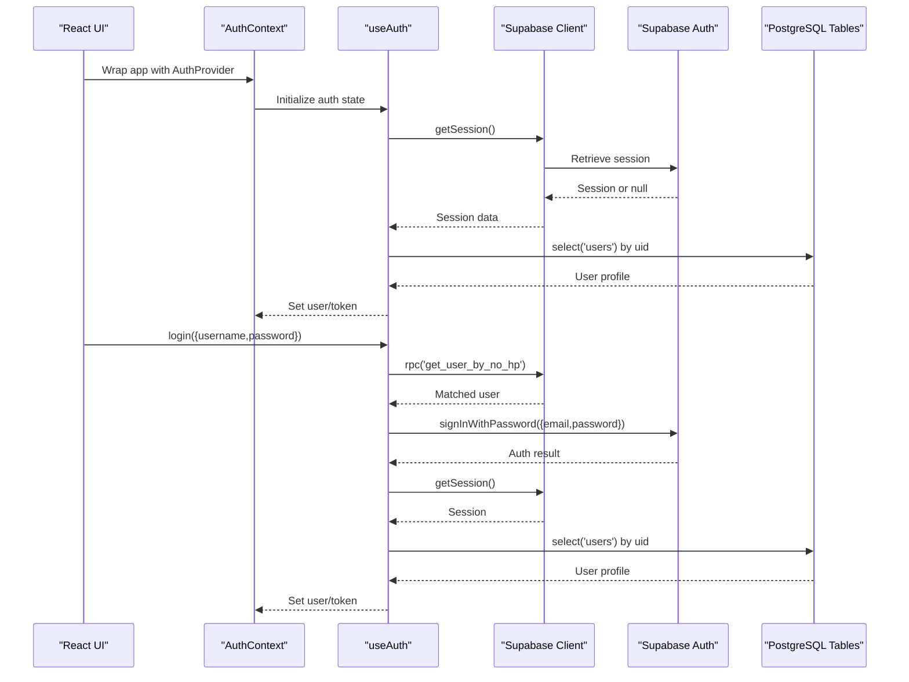
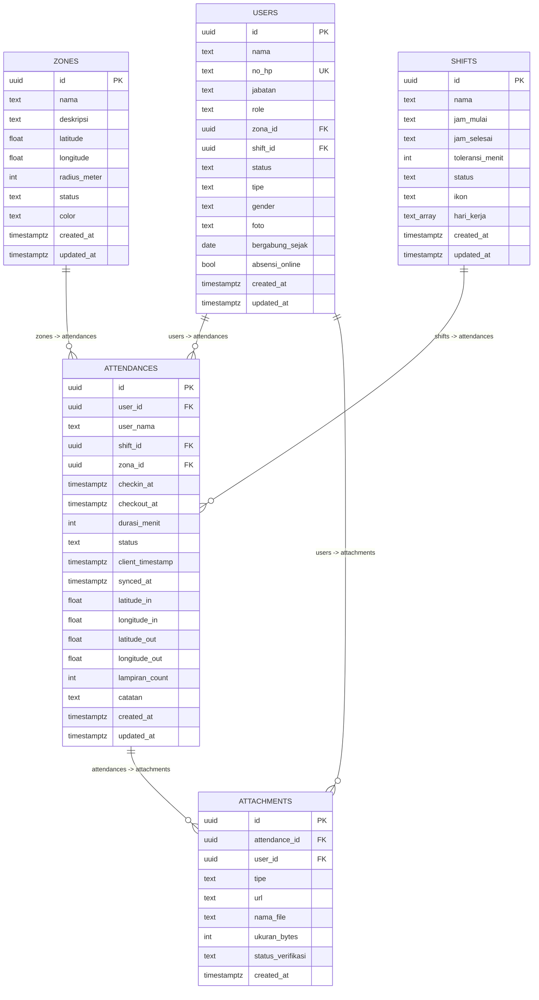
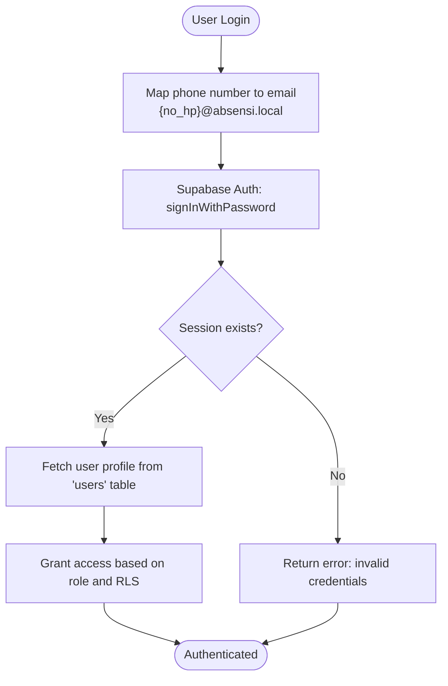
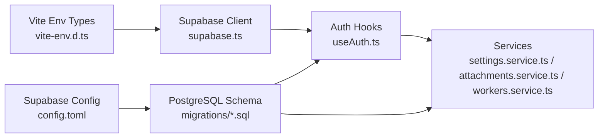

# Database Configuration

<cite>
**Referenced Files in This Document**
- [supabase.ts](file://src/config/supabase.ts)
- [vite-env.d.ts](file://src/vite-env.d.ts)
- [config.toml](file://supabase/config.toml)
- [001_initial.sql](file://supabase/migrations/001_initial.sql)
- [002_seed_auth.sql](file://supabase/migrations/002_seed_auth.sql)
- [AuthContext.tsx](file://src/context/AuthContext.tsx)
- [useAuth.ts](file://src/hooks/useAuth.ts)
- [settings.service.ts](file://src/services/settings.service.ts)
- [attachments.service.ts](file://src/services/attachments.service.ts)
- [workers.service.ts](file://src/services/workers.service.ts)
- [DESIGN.md](file://DESIGN.md)
- [SPEC.md](file://SPEC.md)
- [TASKS.md](file://TASKS.md)
- [package.json](file://package.json)
</cite>

## Table of Contents
1. [Introduction](#introduction)
2. [Project Structure](#project-structure)
3. [Core Components](#core-components)
4. [Architecture Overview](#architecture-overview)
5. [Detailed Component Analysis](#detailed-component-analysis)
6. [Dependency Analysis](#dependency-analysis)
7. [Performance Considerations](#performance-considerations)
8. [Troubleshooting Guide](#troubleshooting-guide)
9. [Conclusion](#conclusion)
10. [Appendices](#appendices)

## Introduction
This document provides comprehensive database configuration guidance for Supabase setup in AbsensiOnline. It covers client initialization, environment variable configuration, connection parameters, database schema structure, authentication schema and permissions, Supabase configuration file settings, and practical troubleshooting steps for connectivity and timeouts. The goal is to enable reliable local development and production deployment of the Supabase backend used by the application.

## Project Structure
The Supabase-related configuration spans three primary areas:
- Frontend client initialization and environment variables
- Supabase configuration file controlling ports, schemas, and auth behavior
- Database schema migrations defining tables, relationships, constraints, and Row Level Security (RLS)

**Diagram sources**
- [supabase.ts:1-7](file://src/config/supabase.ts#L1-L7)
- [vite-env.d.ts:3-9](file://src/vite-env.d.ts#L3-L9)
- [config.toml:1-43](file://supabase/config.toml#L1-L43)
- [001_initial.sql:1-303](file://supabase/migrations/001_initial.sql#L1-L303)
- [002_seed_auth.sql:1-29](file://supabase/migrations/002_seed_auth.sql#L1-L29)

**Section sources**
- [supabase.ts:1-7](file://src/config/supabase.ts#L1-L7)
- [vite-env.d.ts:1-14](file://src/vite-env.d.ts#L1-L14)
- [config.toml:1-43](file://supabase/config.toml#L1-L43)
- [001_initial.sql:1-303](file://supabase/migrations/001_initial.sql#L1-L303)
- [002_seed_auth.sql:1-29](file://supabase/migrations/002_seed_auth.sql#L1-L29)

## Core Components
- Supabase client initialization: Creates a Supabase client using Vite environment variables for URL and anonymous key.
- Environment variables: Declared in Vite’s type definitions and consumed across services.
- Supabase configuration: Defines API port, schemas, extra search path, DB port, Studio, Inbucket, Auth, Storage, and Functions settings.
- Migrations: Define schema, constraints, indexes, triggers, functions, and RLS policies; seed initial data and auth users.

**Section sources**
- [supabase.ts:1-7](file://src/config/supabase.ts#L1-L7)
- [vite-env.d.ts:3-9](file://src/vite-env.d.ts#L3-L9)
- [config.toml:1-43](file://supabase/config.toml#L1-L43)
- [001_initial.sql:1-303](file://supabase/migrations/001_initial.sql#L1-L303)
- [002_seed_auth.sql:1-29](file://supabase/migrations/002_seed_auth.sql#L1-L29)

## Architecture Overview
The frontend initializes the Supabase client with environment variables and uses it for:
- Authentication (password sign-in with email derived from phone number)
- Real-time data access (tables: zones, shifts, users, attendances, attachments)
- Function calls (RPC functions)
- Storage integration (via separate services)

**Diagram sources**
- [AuthContext.tsx:18-36](file://src/context/AuthContext.tsx#L18-L36)
- [useAuth.ts:29-114](file://src/hooks/useAuth.ts#L29-L114)
- [supabase.ts:1-7](file://src/config/supabase.ts#L1-L7)
- [001_initial.sql:139-160](file://supabase/migrations/001_initial.sql#L139-L160)
- [002_seed_auth.sql:1-29](file://supabase/migrations/002_seed_auth.sql#L1-L29)

## Detailed Component Analysis

### Supabase Client Initialization
- The client is created using Vite environment variables for Supabase URL and anonymous key.
- These variables are declared in Vite’s type definitions and validated by service checks.

Implementation highlights:
- Client creation path: [supabase.ts:3-6](file://src/config/supabase.ts#L3-L6)
- Environment variable declarations: [vite-env.d.ts:3-5](file://src/vite-env.d.ts#L3-L5)
- Integration checks in services: [settings.service.ts:31-33](file://src/services/settings.service.ts#L31-L33)

**Section sources**
- [supabase.ts:1-7](file://src/config/supabase.ts#L1-L7)
- [vite-env.d.ts:3-9](file://src/vite-env.d.ts#L3-L9)
- [settings.service.ts:29-34](file://src/services/settings.service.ts#L29-L34)

### Environment Variable Configuration
- Required variables:
  - VITE_SUPABASE_URL: Supabase project URL
  - VITE_SUPABASE_ANON_KEY: Anonymous API key for client access
- Additional variables used by the app:
  - VITE_CLOUDINARY_CLOUD_NAME and VITE_CLOUDINARY_UPLOAD_PRESET for file uploads
  - VITE_APP_NAME for branding

Validation and usage:
- Types declaration: [vite-env.d.ts:3-9](file://src/vite-env.d.ts#L3-L9)
- Runtime checks in services: [settings.service.ts:31-33](file://src/services/settings.service.ts#L31-L33)
- Example environment variables in documentation: [DESIGN.md:446-452](file://DESIGN.md#L446-L452)

**Section sources**
- [vite-env.d.ts:3-9](file://src/vite-env.d.ts#L3-L9)
- [settings.service.ts:29-34](file://src/services/settings.service.ts#L29-L34)
- [DESIGN.md:446-452](file://DESIGN.md#L446-L452)

### Supabase Configuration File (config.toml)
Key settings and their impact:
- API
  - Port: 54321
  - Schemas: public, graphql_public
  - Extra search path: public, extensions
  - Max rows: 1000
- Database
  - Port: 54322
  - Shadow port: 54320
  - Major version: 17
- Studio
  - Enabled: true
  - Port: 54323
  - API URL: http://localhost
- Inbucket
  - Enabled: true
  - Ports: SMTP 54325, POP3 54326
- Auth
  - Site URL: http://localhost:5173
  - Additional redirect URLs: https://localhost:5173
  - JWT expiry: 3600
  - Refresh token rotation enabled
  - Enable signup: false
  - Email settings: Enable signup false, double confirm changes true, confirmations false
- Storage
  - Enabled: true
  - File size limit: 50MiB
- Functions
  - Empty section (default behavior)

Operational implications:
- API and DB ports are customized for local development isolation.
- Auth settings align with the frontend’s localhost origin and password-based sign-in.
- Studio and Inbucket facilitate local development and testing.

**Section sources**
- [config.toml:1-43](file://supabase/config.toml#L1-L43)

### Database Schema Structure
Tables and relationships:
- zones: Geographic coverage with constraints on latitude, longitude, and radius.
- shifts: Work schedules with tolerance minutes and weekly schedule arrays.
- users: References zones and shifts; role-based access; personal attributes; indexed for performance.
- attendances: Links users, shifts, and zones; tracks check-in/check-out, duration, status, geolocation, and verification count.
- attachments: Links to attendances and users; supports photo/document types and verification statuses.

Constraints and indexes:
- Domain checks for status enums and numeric bounds.
- Unique constraint on users.no_hp.
- Foreign keys with cascading deletes for attachments and attendances.
- Indexes on frequently queried columns (e.g., users(no_hp, role), attendances(user_id, checkin_at DESC)).

Triggers and functions:
- update_updated_at trigger on zones, shifts, users, attendances.
- derive_attendance_status function computes presence status based on scheduled time and tolerance.

Seed data:
- Zones, shifts, and users seeded with realistic UUIDs and attributes.
- Auth users seeded with hashed passwords and metadata.

**Diagram sources**
- [001_initial.sql:11-113](file://supabase/migrations/001_initial.sql#L11-L113)

**Section sources**
- [001_initial.sql:11-113](file://supabase/migrations/001_initial.sql#L11-L113)

### Authentication Schema Setup, Roles, and Permissions
Auth schema and seeding:
- Auth users seeded with email, encrypted password, and JSON metadata containing user profile info.
- Frontend login maps phone number to email (e.g., {no_hp}@absensi.local) and signs in with password.

Role and permission model:
- Users table defines role values: worker, admin, super_admin.
- RLS policies grant selective access:
  - zones: authenticated can select; insert/update/delete restricted to admin/super_admin.
  - shifts: similar policy to zones.
  - users: admins can select/update/delete; own record selectable/updatable.
  - attendances: admins can manage; own records selectable/updatable; insert constrained to current user.
  - attachments: admins can manage; own records selectable/insertable/updatable.

**Diagram sources**
- [useAuth.ts:58-96](file://src/hooks/useAuth.ts#L58-L96)
- [002_seed_auth.sql:1-29](file://supabase/migrations/002_seed_auth.sql#L1-L29)
- [001_initial.sql:204-267](file://supabase/migrations/001_initial.sql#L204-L267)

**Section sources**
- [002_seed_auth.sql:1-29](file://supabase/migrations/002_seed_auth.sql#L1-L29)
- [001_initial.sql:204-267](file://supabase/migrations/001_initial.sql#L204-L267)
- [useAuth.ts:58-96](file://src/hooks/useAuth.ts#L58-L96)

### Database Configuration File (config.toml) Settings
- API
  - Port 54321, schemas public and graphql_public, extra search path public/extensions, max rows 1000.
- DB
  - Port 54322, shadow port 54320, major version 17.
- Studio
  - Enabled on port 54323 with API URL http://localhost.
- Inbucket
  - Enabled with SMTP (54325) and POP3 (54326) ports.
- Auth
  - Site URL and redirect URLs match localhost development.
  - JWT expiry 3600, refresh token rotation enabled, signup disabled, email confirmations disabled.
- Storage
  - Enabled with 50MiB file size limit.
- Functions
  - Defaults apply.

These settings isolate local development, simplify auth flows, and provide a sandbox for testing.

**Section sources**
- [config.toml:1-43](file://supabase/config.toml#L1-L43)

### Connection Parameters and Service Integrations
- Supabase client uses VITE_SUPABASE_URL and VITE_SUPABASE_ANON_KEY.
- Services consume these variables for:
  - Settings retrieval and integration status checks.
  - Attachments service for file operations.
  - Workers service for invoking Supabase Edge Functions endpoint.

References:
- Client initialization: [supabase.ts:3-6](file://src/config/supabase.ts#L3-L6)
- Environment types: [vite-env.d.ts:3-5](file://src/vite-env.d.ts#L3-L5)
- Settings service: [settings.service.ts:31-33](file://src/services/settings.service.ts#L31-L33)
- Attachments service: [attachments.service.ts:26-27](file://src/services/attachments.service.ts#L26-L27)
- Workers service: [workers.service.ts](file://src/services/workers.service.ts#L3)

**Section sources**
- [supabase.ts:1-7](file://src/config/supabase.ts#L1-L7)
- [vite-env.d.ts:3-9](file://src/vite-env.d.ts#L3-L9)
- [settings.service.ts:29-34](file://src/services/settings.service.ts#L29-L34)
- [attachments.service.ts:26-27](file://src/services/attachments.service.ts#L26-L27)
- [workers.service.ts](file://src/services/workers.service.ts#L3)

## Dependency Analysis
- Frontend depends on Supabase client initialized with Vite environment variables.
- Services depend on the client for database and function calls.
- Auth depends on seeded users and RLS policies for access control.
- Migrations define the schema and policies that services rely upon.

**Diagram sources**
- [vite-env.d.ts:3-9](file://src/vite-env.d.ts#L3-L9)
- [supabase.ts:1-7](file://src/config/supabase.ts#L1-L7)
- [useAuth.ts:1-115](file://src/hooks/useAuth.ts#L1-L115)
- [settings.service.ts:1-34](file://src/services/settings.service.ts#L1-L34)
- [attachments.service.ts:1-30](file://src/services/attachments.service.ts#L1-L30)
- [workers.service.ts:1-20](file://src/services/workers.service.ts#L1-L20)
- [config.toml:1-43](file://supabase/config.toml#L1-L43)
- [001_initial.sql:1-303](file://supabase/migrations/001_initial.sql#L1-L303)

**Section sources**
- [vite-env.d.ts:3-9](file://src/vite-env.d.ts#L3-L9)
- [supabase.ts:1-7](file://src/config/supabase.ts#L1-L7)
- [useAuth.ts:1-115](file://src/hooks/useAuth.ts#L1-L115)
- [settings.service.ts:1-34](file://src/services/settings.service.ts#L1-L34)
- [attachments.service.ts:1-30](file://src/services/attachments.service.ts#L1-L30)
- [workers.service.ts:1-20](file://src/services/workers.service.ts#L1-L20)
- [config.toml:1-43](file://supabase/config.toml#L1-L43)
- [001_initial.sql:1-303](file://supabase/migrations/001_initial.sql#L1-L303)

## Performance Considerations
- Indexes: Users and attendances tables include composite and single-column indexes to optimize frequent queries.
- Triggers: update_updated_at reduces duplication and ensures consistent timestamps.
- RLS: Policies restrict data visibility to reduce unnecessary scans.
- API row limits: max_rows = 1000 prevents overly large result sets in Studio and API.
- Search path: extra_search_path = public, extensions improves function resolution and performance.

Recommendations:
- Monitor slow queries using Studio and logs.
- Keep indexes minimal and aligned with query patterns.
- Use pagination for large datasets.
- Leverage RLS to avoid heavy client-side filtering.

**Section sources**
- [001_initial.sql:64-95](file://supabase/migrations/001_initial.sql#L64-L95)
- [001_initial.sql:118-137](file://supabase/migrations/001_initial.sql#L118-L137)
- [config.toml](file://supabase/config.toml#L6)

## Troubleshooting Guide
Common issues and resolutions:
- Missing environment variables
  - Symptom: Integration status indicates missing Supabase configuration.
  - Action: Ensure VITE_SUPABASE_URL and VITE_SUPABASE_ANON_KEY are present in the environment and typed correctly.
  - Reference: [settings.service.ts:31-33](file://src/services/settings.service.ts#L31-L33), [vite-env.d.ts:3-5](file://src/vite-env.d.ts#L3-L5)

- Incorrect Supabase URL or anonymous key
  - Symptom: Cannot connect to Supabase or authentication fails.
  - Action: Verify URL and key against Supabase project settings; confirm they match the project reference.
  - Reference: [supabase.ts:3-6](file://src/config/supabase.ts#L3-L6)

- Auth sign-in failures
  - Symptom: Login errors indicating invalid credentials or inability to retrieve session.
  - Action: Confirm user exists in auth.users with the expected email derived from phone number; verify password encryption and metadata.
  - Reference: [useAuth.ts:58-96](file://src/hooks/useAuth.ts#L58-L96), [002_seed_auth.sql:1-29](file://supabase/migrations/002_seed_auth.sql#L1-L29)

- RLS access denied
  - Symptom: Queries return empty or unauthorized results.
  - Action: Check RLS policies for the relevant table; ensure user role and ownership conditions are met.
  - Reference: [001_initial.sql:166-267](file://supabase/migrations/001_initial.sql#L166-L267)

- Connection timeouts or port conflicts
  - Symptom: Localhost connections fail or Studio/Inbucket ports unavailable.
  - Action: Verify config.toml ports are free; adjust ports if conflicting with other services.
  - Reference: [config.toml:3-22](file://supabase/config.toml#L3-L22)

- Function invocation errors
  - Symptom: RPC calls fail or return unexpected results.
  - Action: Validate function existence and signatures; check migrations for function definitions.
  - Reference: [001_initial.sql:139-160](file://supabase/migrations/001_initial.sql#L139-L160)

**Section sources**
- [settings.service.ts:29-34](file://src/services/settings.service.ts#L29-L34)
- [vite-env.d.ts:3-9](file://src/vite-env.d.ts#L3-L9)
- [supabase.ts:1-7](file://src/config/supabase.ts#L1-L7)
- [useAuth.ts:58-96](file://src/hooks/useAuth.ts#L58-L96)
- [002_seed_auth.sql:1-29](file://supabase/migrations/002_seed_auth.sql#L1-L29)
- [001_initial.sql:139-160](file://supabase/migrations/001_initial.sql#L139-L160)
- [config.toml:3-22](file://supabase/config.toml#L3-L22)

## Conclusion
AbsensiOnline’s Supabase setup integrates cleanly with Vite environment variables and a well-defined local configuration. The schema emphasizes role-based access control and efficient indexing, while migrations establish robust constraints and policies. By validating environment variables, confirming auth seeding, and aligning local ports with config.toml, developers can achieve reliable local development and smooth production deployment.

## Appendices
- Supabase client library version used: [package.json](file://package.json#L14)
- Environment variable examples for Vercel deployment: [DESIGN.md:446-452](file://DESIGN.md#L446-L452)
- Migration tasks and actions: [TASKS.md:18-24](file://TASKS.md#L18-L24)