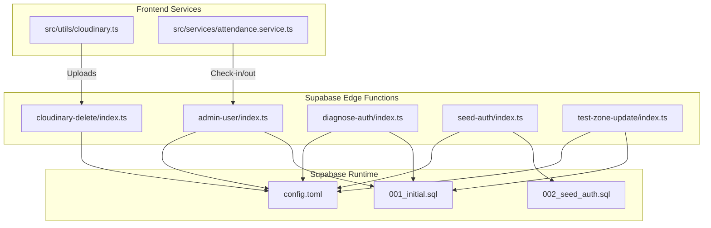
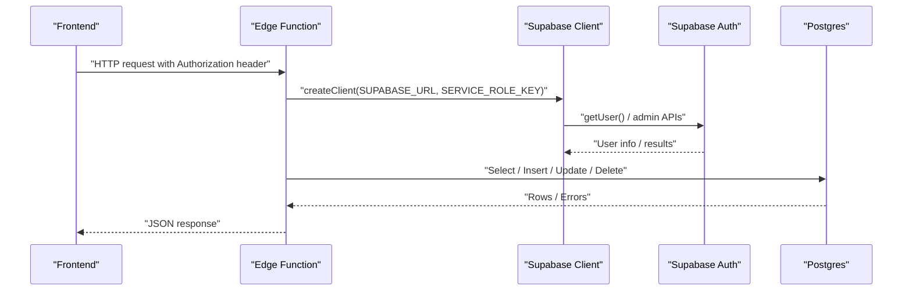
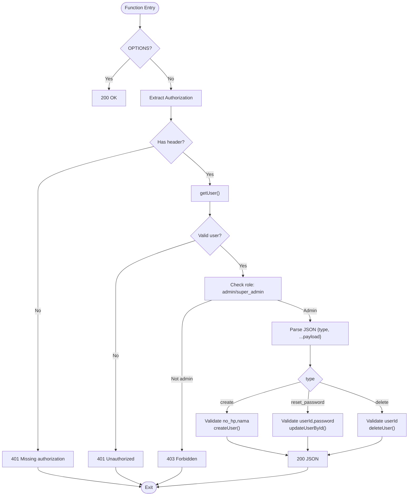
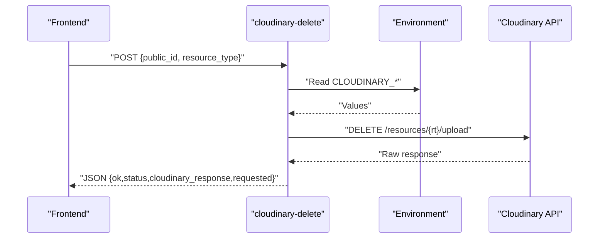
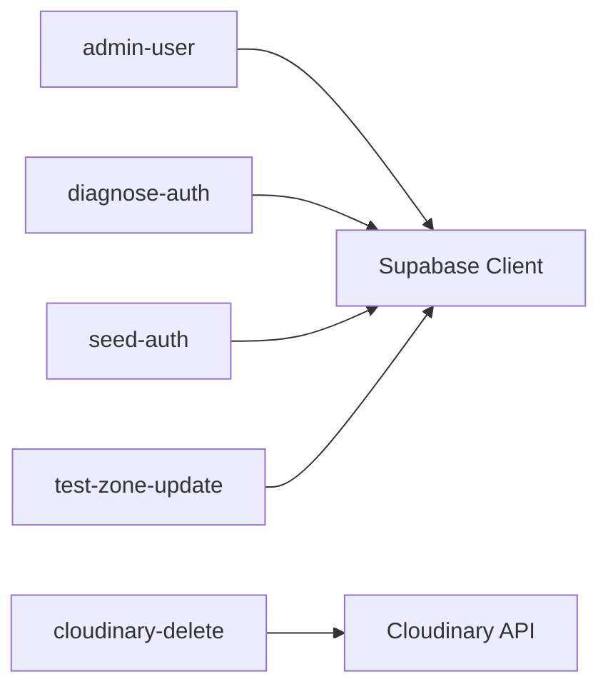

# Edge Functions

<cite>
**Referenced Files in This Document**
- [admin-user/index.ts](file://supabase/functions/admin-user/index.ts)
- [cloudinary-delete/index.ts](file://supabase/functions/cloudinary-delete/index.ts)
- [diagnose-auth/index.ts](file://supabase/functions/diagnose-auth/index.ts)
- [seed-auth/index.ts](file://supabase/functions/seed-auth/index.ts)
- [test-zone-update/index.ts](file://supabase/functions/test-zone-update/index.ts)
- [config.toml](file://supabase/config.toml)
- [001_initial.sql](file://supabase/migrations/001_initial.sql)
- [002_seed_auth.sql](file://supabase/migrations/002_seed_auth.sql)
- [cloudinary.ts](file://src/utils/cloudinary.ts)
- [attendance.service.ts](file://src/services/attendance.service.ts)
</cite>

## Table of Contents
1. [Introduction](#introduction)
2. [Project Structure](#project-structure)
3. [Core Components](#core-components)
4. [Architecture Overview](#architecture-overview)
5. [Detailed Component Analysis](#detailed-component-analysis)
6. [Dependency Analysis](#dependency-analysis)
7. [Performance Considerations](#performance-considerations)
8. [Troubleshooting Guide](#troubleshooting-guide)
9. [Conclusion](#conclusion)
10. [Appendices](#appendices)

## Introduction
This document provides comprehensive edge functions documentation for Supabase serverless functions in AbsensiOnline. It covers five functions:
- admin-user: administrative operations for user lifecycle management
- cloudinary-delete: media cleanup for Cloudinary resources
- diagnose-auth: authentication troubleshooting and data alignment checks
- seed-auth: initial data setup for development and testing
- test-zone-update: geofencing validation workflow

It explains purpose, implementation, usage patterns, deployment, environment requirements, error handling, performance considerations, security implications, rate limiting, and monitoring approaches. Frontend integration examples are included via service references.

## Project Structure
Edge functions are located under supabase/functions/<function-name>/index.ts. Each function exposes a Deno “serve” handler and uses Supabase client libraries to interact with the database and authentication systems. Supabase configuration and migrations define runtime behavior and schema.

**Diagram sources**
- [admin-user/index.ts:1-167](file://supabase/functions/admin-user/index.ts#L1-L167)
- [cloudinary-delete/index.ts:1-71](file://supabase/functions/cloudinary-delete/index.ts#L1-L71)
- [diagnose-auth/index.ts:1-74](file://supabase/functions/diagnose-auth/index.ts#L1-L74)
- [seed-auth/index.ts:1-65](file://supabase/functions/seed-auth/index.ts#L1-L65)
- [test-zone-update/index.ts:1-68](file://supabase/functions/test-zone-update/index.ts#L1-L68)
- [config.toml:1-43](file://supabase/config.toml#L1-L43)
- [001_initial.sql:1-303](file://supabase/migrations/001_initial.sql#L1-L303)
- [002_seed_auth.sql:1-29](file://supabase/migrations/002_seed_auth.sql#L1-L29)
- [cloudinary.ts:1-63](file://src/utils/cloudinary.ts#L1-L63)
- [attendance.service.ts:1-188](file://src/services/attendance.service.ts#L1-L188)

**Section sources**
- [config.toml:1-43](file://supabase/config.toml#L1-L43)

## Core Components
- admin-user: Validates caller permissions, creates/reset/deletes users via Supabase Auth Admin API, and enforces role-based access.
- cloudinary-delete: Deletes Cloudinary resources using Cloudinary API credentials from environment variables.
- diagnose-auth: Compares Supabase Auth users vs. public users, detects mismatches, and finds orphan attendance records.
- seed-auth: Seeds development/test users with deterministic IDs and emails; cleans up existing entries first.
- test-zone-update: Reads a zone, attempts an update, reads back the change, and restores original value.

**Section sources**
- [admin-user/index.ts:1-167](file://supabase/functions/admin-user/index.ts#L1-L167)
- [cloudinary-delete/index.ts:1-71](file://supabase/functions/cloudinary-delete/index.ts#L1-L71)
- [diagnose-auth/index.ts:1-74](file://supabase/functions/diagnose-auth/index.ts#L1-L74)
- [seed-auth/index.ts:1-65](file://supabase/functions/seed-auth/index.ts#L1-L65)
- [test-zone-update/index.ts:1-68](file://supabase/functions/test-zone-update/index.ts#L1-L68)

## Architecture Overview
The functions operate in the Supabase Edge Runtime. They authenticate callers (where applicable), enforce authorization, and interact with Supabase Auth and Postgres. Some functions integrate with external services (Cloudinary).

**Diagram sources**
- [admin-user/index.ts:15-49](file://supabase/functions/admin-user/index.ts#L15-L49)
- [diagnose-auth/index.ts:15-18](file://supabase/functions/diagnose-auth/index.ts#L15-L18)
- [seed-auth/index.ts:15-18](file://supabase/functions/seed-auth/index.ts#L15-L18)
- [test-zone-update/index.ts:15-18](file://supabase/functions/test-zone-update/index.ts#L15-L18)

## Detailed Component Analysis

### admin-user
Purpose
- Administrative user lifecycle management: create, reset password, delete users.
- Enforces admin-only access and validates payloads.

Implementation highlights
- CORS preflight support.
- Extracts Authorization header and validates caller via getUser().
- Confirms caller role is admin or super_admin.
- Uses SUPABASE_SERVICE_ROLE_KEY to create an admin client.
- Supports three operation types: create, reset_password, delete.
- Payload validation and error responses.

Usage patterns
- Create user: send JSON with type "create" and required fields.
- Reset password: send JSON with type "reset_password" and userId/password.
- Delete user: send JSON with type "delete" and userId.

Security and access
- Requires Authorization header.
- Caller must be admin/super_admin.
- Uses service role key for privileged operations.

Error handling
- Returns structured JSON errors with appropriate HTTP status codes (400, 401, 403, 500).

**Diagram sources**
- [admin-user/index.ts:10-166](file://supabase/functions/admin-user/index.ts#L10-L166)

**Section sources**
- [admin-user/index.ts:1-167](file://supabase/functions/admin-user/index.ts#L1-L167)

### cloudinary-delete
Purpose
- Delete a Cloudinary resource by public_id using Cloudinary’s API.

Implementation highlights
- Accepts JSON with public_id and optional resource_type.
- Reads CLOUDINARY_* environment variables.
- Calls Cloudinary API with Basic auth and returns raw response metadata.

Usage pattern
- Send JSON with public_id (and optionally resource_type).
- Receives JSON with ok/status/cloudinary_response/requested.

Security and access
- Requires CLOUDINARY_CLOUD_NAME, CLOUDINARY_API_KEY, CLOUDINARY_API_SECRET.
- API secret is used directly in function; treat as sensitive.

Error handling
- Returns 400 if public_id missing.
- Returns 500 if environment variables missing or unexpected error.

**Diagram sources**
- [cloudinary-delete/index.ts:14-50](file://supabase/functions/cloudinary-delete/index.ts#L14-L50)

**Section sources**
- [cloudinary-delete/index.ts:1-71](file://supabase/functions/cloudinary-delete/index.ts#L1-L71)

### diagnose-auth
Purpose
- Diagnose authentication and user data alignment issues.
- Lists internal users, compares Auth vs. Public users, detects mismatches, and finds orphan attendances.

Implementation highlights
- Uses SUPABASE_SERVICE_ROLE_KEY to list Auth users and query public users.
- Filters Auth users by domain suffix and maps to public users by no_hp.
- Detects mismatched IDs and lists orphan attendances not linked to current public users.

Usage pattern
- GET/POST to function returns diagnostic JSON with auth_users, public_users, mismatch, orphan_attendances.

Security and access
- Requires service role key.

Error handling
- Returns 500 on unexpected errors.

**Section sources**
- [diagnose-auth/index.ts:1-74](file://supabase/functions/diagnose-auth/index.ts#L1-L74)

### seed-auth
Purpose
- Seed development/test environment with predefined users and matching Auth IDs.

Implementation highlights
- Uses SUPABASE_SERVICE_ROLE_KEY.
- Iterates seeded users, deletes existing Auth user by email if present, then creates with matching UUID and metadata.

Usage pattern
- GET/POST to function returns results array with no_hp, email, auth_user_id, error.

Security and access
- Requires service role key.

Error handling
- Returns 500 on unexpected errors.

**Section sources**
- [seed-auth/index.ts:1-65](file://supabase/functions/seed-auth/index.ts#L1-L65)

### test-zone-update
Purpose
- Validate geofencing update workflow by updating a zone, reading back, and restoring.

Implementation highlights
- Selects first zone, increments latitude slightly, updates, reads back, then restores original value.
- Returns zone_id, original_lat, new_lat, update_result, read_back.

Usage pattern
- GET/POST to function returns structured result for validation.

Security and access
- Requires service role key.

Error handling
- Returns 404 if no zones; 500 on unexpected errors.

**Section sources**
- [test-zone-update/index.ts:1-68](file://supabase/functions/test-zone-update/index.ts#L1-L68)

## Dependency Analysis
Internal dependencies
- All functions depend on Supabase client libraries and environment variables.
- admin-user depends on users table roles and Auth admin APIs.
- diagnose-auth and seed-auth depend on users and auth.users seeding.
- test-zone-update depends on zones table.

External dependencies
- cloudinary-delete depends on Cloudinary API.

**Diagram sources**
- [admin-user/index.ts:24-54](file://supabase/functions/admin-user/index.ts#L24-L54)
- [cloudinary-delete/index.ts:23-50](file://supabase/functions/cloudinary-delete/index.ts#L23-L50)
- [diagnose-auth/index.ts:15-18](file://supabase/functions/diagnose-auth/index.ts#L15-L18)
- [seed-auth/index.ts:15-18](file://supabase/functions/seed-auth/index.ts#L15-L18)
- [test-zone-update/index.ts:15-18](file://supabase/functions/test-zone-update/index.ts#L15-L18)

**Section sources**
- [001_initial.sql:46-62](file://supabase/migrations/001_initial.sql#L46-L62)
- [002_seed_auth.sql:1-29](file://supabase/migrations/002_seed_auth.sql#L1-L29)

## Performance Considerations
- Minimize round-trips: batch operations where possible.
- Use indexes: queries on users(no_hp, role), attendances(user_id, checkin_at), zones(id) leverage existing indexes.
- Avoid long-running operations: keep function logic lightweight; offload heavy tasks to background jobs.
- Concurrency: edge functions scale horizontally; avoid shared mutable state.
- Network latency: cloudinary-delete performs an external HTTP call; consider retry/backoff in frontend if needed.

[No sources needed since this section provides general guidance]

## Troubleshooting Guide
Common issues and resolutions
- Missing Authorization header (admin-user): ensure frontend sends Authorization header; function returns 401.
- Unauthorized access (admin-user): caller must be admin/super_admin; function returns 403.
- Invalid payload (admin-user): ensure create/reset/delete payloads include required fields; function returns 400.
- Environment variables missing (cloudinary-delete): ensure CLOUDINARY_CLOUD_NAME, CLOUDINARY_API_KEY, CLOUDINARY_API_SECRET are set; function returns 500 with diagnostics.
- No zones found (test-zone-update): ensure zones table has data; function returns 404.
- Auth mismatch (diagnose-auth): compare returned mismatch array to identify ID discrepancies.

Monitoring approaches
- Enable Supabase Edge Functions logs and metrics.
- Track function invocation counts, duration, and error rates.
- Use structured logging in functions for easier correlation.

**Section sources**
- [admin-user/index.ts:17-49](file://supabase/functions/admin-user/index.ts#L17-L49)
- [cloudinary-delete/index.ts:27-37](file://supabase/functions/cloudinary-delete/index.ts#L27-L37)
- [test-zone-update/index.ts:22-26](file://supabase/functions/test-zone-update/index.ts#L22-L26)
- [diagnose-auth/index.ts:44-54](file://supabase/functions/diagnose-auth/index.ts#L44-L54)

## Conclusion
These edge functions provide essential administrative, diagnostic, and validation capabilities for AbsensiOnline. They enforce strict authorization, integrate with Supabase Auth and Postgres, and interact with external services like Cloudinary. Proper environment configuration, robust error handling, and monitoring are critical for production readiness.

[No sources needed since this section summarizes without analyzing specific files]

## Appendices

### Deployment Process
- Place function code under supabase/functions/<name>/index.ts.
- Configure Supabase environment variables (SUPABASE_URL, SUPABASE_SERVICE_ROLE_KEY, SUPABASE_ANON_KEY for admin-user).
- For cloudinary-delete, configure CLOUDINARY_CLOUD_NAME, CLOUDINARY_API_KEY, CLOUDINARY_API_SECRET.
- Run migrations to set up schema and seed data.
- Deploy via Supabase CLI or dashboard.

**Section sources**
- [config.toml:1-43](file://supabase/config.toml#L1-L43)
- [001_initial.sql:1-303](file://supabase/migrations/001_initial.sql#L1-L303)
- [002_seed_auth.sql:1-29](file://supabase/migrations/002_seed_auth.sql#L1-L29)

### Environment Variables Reference
- SUPABASE_URL: Supabase project URL.
- SUPABASE_ANON_KEY: Supabase anonymous key (used by admin-user).
- SUPABASE_SERVICE_ROLE_KEY: Supabase service role key (used by admin-user, diagnose-auth, seed-auth, test-zone-update).
- CLOUDINARY_CLOUD_NAME: Cloud name for Cloudinary.
- CLOUDINARY_API_KEY: Cloudinary API key.
- CLOUDINARY_API_SECRET: Cloudinary API secret.

**Section sources**
- [admin-user/index.ts:24-28](file://supabase/functions/admin-user/index.ts#L24-L28)
- [cloudinary-delete/index.ts:23-25](file://supabase/functions/cloudinary-delete/index.ts#L23-L25)
- [diagnose-auth/index.ts:15-18](file://supabase/functions/diagnose-auth/index.ts#L15-L18)
- [seed-auth/index.ts:15-18](file://supabase/functions/seed-auth/index.ts#L15-L18)
- [test-zone-update/index.ts:15-18](file://supabase/functions/test-zone-update/index.ts#L15-L18)

### Frontend Integration Examples
- Cloudinary uploads: use the frontend utility to upload files; on success, persist metadata and optionally call cloudinary-delete to clean up duplicates.
- Attendance operations: use the attendance service to submit check-in/check-out; admin actions can be performed via admin-user.

**Section sources**
- [cloudinary.ts:11-62](file://src/utils/cloudinary.ts#L11-L62)
- [attendance.service.ts:25-77](file://src/services/attendance.service.ts#L25-L77)